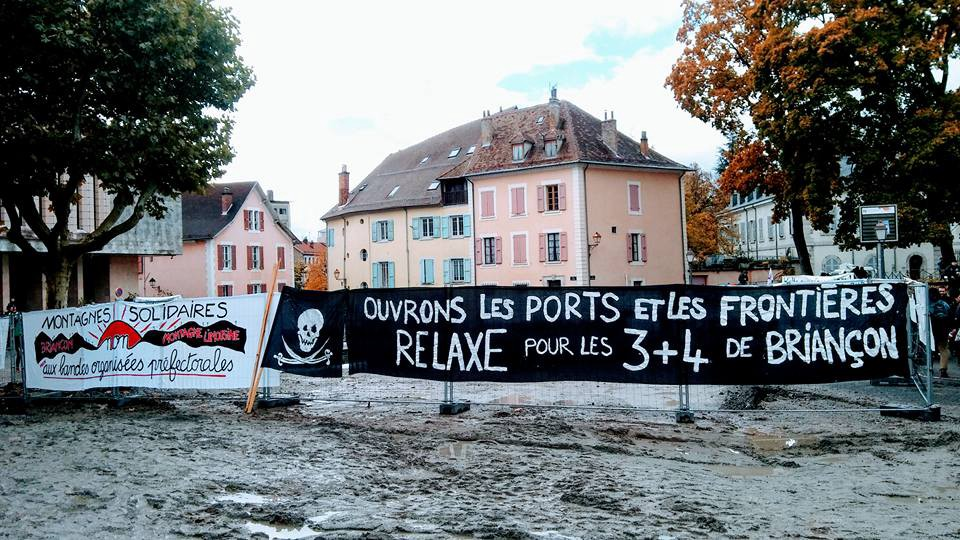
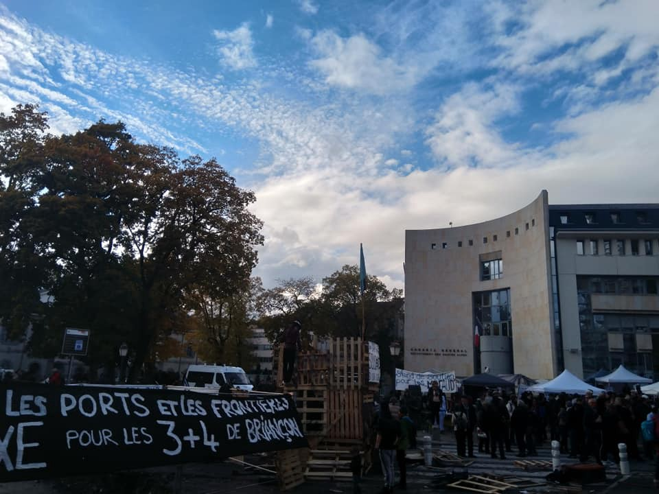
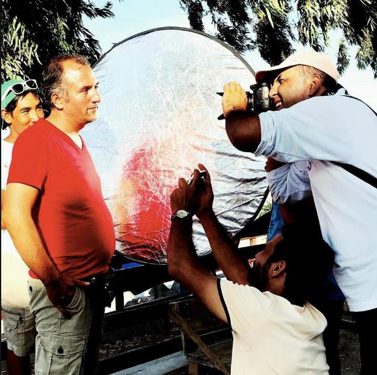
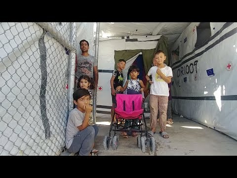

### AYS Daily Digest 08/11/2018: Hundreds Demonstrate as 7 Activists face 10 years in Prison in France

Rescues and Interceptions at Sea// 124 refugees repatriated from Libya to Somalia//Arrivals in Greece//Situation on Samos Deteriorating//Italy Passes Tough Anti\-Migrant and security Legislation ‘Salvini Decree’//People returning to Grand Synthe// and More…

](assets/404bf48d3949/1*lcsxdxdh2qY8_kDup16OTA.jpeg)

Source: [Chez Jesus — Rifugio Autogestito](https://www.facebook.com/Chez-Jesus-Rifugio-Autogestito-362786637540072/?tn-str=k%2AF)
#### FEATURE: Hundreds demonstrate as seven protesters in France face 10 years in prison and 750,000 € in fines for ‘aiding illegal immigration and organized gangs’

On April 22, 2018, a spontaneous demonstration that crossed the border between Italy and France took place against an organised group of people who were ‘guarding’ the border at Colle della Scala and preventing people from crossing to France\.

> In hundreds, we walked on the road, for 18 kilometers, from Claviere to Briançon\. Together we have arrived there\. Together, for that day, we made sure that the border did not exist\. 

In Briançon, three people were arrested and jailed for 11 days and charged with ‘aiding illegal immigration and organized gangs\.’ Subsequently another four people were charged with the same crimes\.

> In this era of the return of fascisms, of widespread racism, of exploitation of the fear of the different, we call to solidarity\. 

The trial took place today\.

](assets/404bf48d3949/1*JWV5Kmp3UauUGh9YmRtpHA.jpeg)

[Chez Jesus — Rifugio Autogestito](https://www.facebook.com/Chez-Jesus-Rifugio-Autogestito-362786637540072/?tn-str=k%2AF)

Over 1000 people attended the trial to demonstrate in support of the seven people who were arrested for attempting to cross the Italy/France border\.

](assets/404bf48d3949/1*z0DNwTzKgiWvM9LLFutbrA.jpeg)

[Collectif Soutien Migrants 13 / El Manba](https://www.facebook.com/collectifmigrants13/?__tn__=%2CdkCH-R-R&eid=ARBeN1-2d4VyaxtOYFY5ykK488l7e74BW5uYl5ALvcmwuLh4afqeqMgGhfdx9d5Hi6FOY5abkF682IzI&hc_ref=ART_nOAigTlT5F2ITOOs9YPLB9lgmTfq9r-OKbI-COqjs7d1v4nKhHNnLhzzO_CttZo&fref=nf)

> We don’t forget, we don’t forgive political and police violence wherever they kill\. 

](assets/404bf48d3949/1*x7mkSF4350FW7Co1sbu6Bw.jpeg)

[Collectif Soutien Migrants 13 / El Manba](https://www.facebook.com/collectifmigrants13/?__tn__=%2CdkCH-R-R&eid=ARBeN1-2d4VyaxtOYFY5ykK488l7e74BW5uYl5ALvcmwuLh4afqeqMgGhfdx9d5Hi6FOY5abkF682IzI&hc_ref=ART_nOAigTlT5F2ITOOs9YPLB9lgmTfq9r-OKbI-COqjs7d1v4nKhHNnLhzzO_CttZo&fref=nf)
#### MOROCCO

A total of [140 people travelling by boat were intercepted by the Moroccan Navy](http://www.dailyfinland.fi/worldwide/7841/Morocco-navy-rescues-140-migrants-off-Mediterranean-Sea?fbclid=IwAR1PFvq5Cx-IeLwhMPxezElxX9aMY1LSRB8VpTw4vxmj1X7os9aaSR-pVaI) off the Mediterranean coast\. Over the past 24 hours, royal navy units have been on patrol in the Mediterranean Sea\. Most of the people on board were from Sub\-Saharan African countries and included women and children\.

[Association Marocaine des Droits Humains — Section Nador](https://www.facebook.com/AmdhNador/?__tn__=kC-R&eid=ARCE1HeQmpUE-NLg7h-xMByaxpbP-bi4xVXLwsy4Y7wrce70QqUeLI0--Ve9-F0D9nIHrVrtr2piarSn&hc_ref=ARTrLnNRPFgMy025fkQqqhJ86e-UH5JfgObh8p7NXOo5igYgzsvVoPwSlyIAk1utp3A&fref=nf&__xts__%5B0%5D=68.ARA1OmU_7X8Ru9okpiXRyR_fATscPdrsvmpNOFtob-RQOi-dDmSmHDpG1XSy8o6wd1258_aAqv3NXSCLXbbG3zbCqvQMkLeL0TN9ZGBYq6UaRpPZptLkswBjVnJhIbJlgwT7KyKhNCUA21OqQkNl-42bSh3O-HiM_xsoDfRmtA-LFIbGOojouh0FReBhou--g0h8LN_rM3GgdRb0uIE6kiwKvGo) reports that five buses remained stationed in front of the detention centre in Nador yesterday\. Approximately 200 people who were illegally detained at the police station were expelled from the country\.
#### TURKEY

■■■■■■■■■■■■■■ 
> **[IOM Türkiye](https://twitter.com/IOMTurkiye) @ Twitter Says:** 

> > Eleven Syrians and a Turkish citizen were rescued after their boat capsized off Erdemli district in Mersin province yesterday. The discovery came after nearby fishermen saw the boat start to sink. [bit.ly/2JNHis6](https://bit.ly/2JNHis6) @[TCSahilGuvenlik](https://twitter.com/TCSahilGuvenlik) https://t.co/EMjfAeur2o 

> **Tweeted at [2018-11-08 08:17:56](https://twitter.com/iomturkey/status/1060446308455141376).** 

■■■■■■■■■■■■■■ 

#### LIBYA

[**IOM has report**](https://www.libyanexpress.com/iom-says-124-somali-migrants-repatriated-from-libya/?fbclid=IwAR1O3WkLGlKDdxpzdsA5LOPBvysIB39IWD98tRAUgpjyIBgq8_9kddXHEow) **ed that 124 Somalian refugees have voluntarily repatriated from Tripoli**

> “Late last night, clashes erupted briefly around Mitiga airport, where our team was working to finalize procedures for 124 Somali migrants wishing to return home to Somalia,” the statement said\. 

#### GENERAL

**The Refugee Language Initiative has opportunities for Language Tutors** 
We currently have opportunities for self funded volunteer language tutors in Bosnia, Serbia and Greece\.

Please email your interest to info@refugeelanguageinitiative\.org

**EASO have compiled a new report on Pakistan\.** 
The report aims to provide information on the security situation in Pakistan, which is relevant for international protection status determination\. The report briefly describes the situation as follows: “The security situation in Pakistan is complex and influenced by factors such as political violence, insurgent violence, ethnic conflicts, and sectarian violence\. The domestic security situation is also influenced by disputes with the neighbouring countries of India and Afghanistan that occasionally turn violent\.”
#### SEA

[Watch The Med — Alarmphone](https://www.facebook.com/watchthemed.alarmphone/?__tn__=kC-R&eid=ARCM32lRIM3BT9TXUtBoxN_3lRIJRV62oPHzeJt00_hnxukml5FY2pIReLWdSx251C6oowQ2VMmekbN4&hc_ref=ARQMcV9RoBZtDFzhcWH319UqZnt3LxBPiqTzNXK0u4lpT52r89nXVdIHZUghevCUMFQ&fref=nf&__xts__%5B0%5D=68.ARDHaEAuTXiWAW9ySjOw2RfVs9RLXi17tX4giRF6KFp0UMgBZAHR1-_JTrD3m4YTZSZAB439r5fMMvT8xxJTxXPfgKyQJu3JjkwLxovnX7WLNEgRvf7vX2w0ODmwt8PwHSDVKg4SWW1csW7XZb_Bm_GDhiKrD209E8xbwEEcyEBiIt0tk_rekJYrHNhz18kD1tTmU9JeoeAYUUdBr5OG6GN9NXA) report that they received a phone call at 18\.18 CET from a man afloat on a rubber boat carrying approximately 100 people off the coast of Libya\. They had been at sea for 19 hours at the time of the call and required urgent assistance\.

European authorities, including the Italian and Maltese coast guards were contacted\. The Italian Coast guard denied all responsibility and refused to help\.

The boat was eventually ‘rescued’ by the Libyan coast guard\.

> In this case, the ‘rescue’ of the 100 people would mean their return into conditions of confinement, torture, extortion, and sexual violence — conditions that they were trying to escape from\.We strongly demand European authorities to assume responsibility again and conduct search and rescue operations\. There are plenty of rescue assets that could engage but what is missing is the political will in this current racist anti\-migrant climate\. 

> Europe has handed over the mandate to the Libyan authorities to abduct people in precarious situations at high sea\. We fail to find words for the perversity of the situation — with torture or death seemingly being the only options left for people seeking safety in Europe\. 

**SALVAMENTO MARITIMO: Rescues in Spain** 
A total of 341 people were rescued from 10 boats\.

■■■■■■■■■■■■■■ 
> **[SALVAMENTO MARÍTIMO](https://twitter.com/salvamentogob) @ Twitter Says:** 

> > Balance 17.00 horas. Estrecho. María Zambrano rescata 22 personas de 3 pateras. 
Alborán: 7 pateras. Guardamar Calíope llegará a #Málaga (17.45h) con 148 personas, S/ Hamal a #Almería (18.15h) con 59 y S/ Spica a #Motril (18.25h) con 112.  
TOTAL:  341 personas de 10 pateras. https://t.co/pkZ1oWGgfb 

> **Tweeted at [2018-11-08 16:24:32](https://twitter.com/salvamentogob/status/1060568765597917187).** 

■■■■■■■■■■■■■■ 

■■■■■■■■■■■■■■ 
> **[IOM Türkiye](https://twitter.com/IOMTurkiye) @ Twitter Says:** 

> > Eleven Syrians and a Turkish citizen were rescued after their boat capsized off Erdemli district in Mersin province yesterday. The discovery came after nearby fishermen saw the boat start to sink. [bit.ly/2JNHis6](https://bit.ly/2JNHis6) @[TCSahilGuvenlik](https://twitter.com/TCSahilGuvenlik) https://t.co/EMjfAeur2o 

> **Tweeted at [2018-11-08 08:17:56](https://twitter.com/iomturkey/status/1060446308455141376).** 

■■■■■■■■■■■■■■ 

#### GREECE

A total of four boats arrived today in Greece\.

First Boat: 39 people\.
Arrived on Farmakonisi and was transported to Leros\.

Second Boat: 34 people\. 
Arrived on Samos\. Another 10 people who arrived on Ikaria yesterday have also been transported to Samos\.

Third Boat: 39 people\.
Arrived on Chios\.

Fourth Boat: 50 people\.
Arrived in the evening on Samos\.

**Children of Moria: Mobile Film Festival** 
Two people living in Moria, Javad and Reza, have submitted a one\-minute movie to the Mobile Film Festival\. It has been selected as one of the top 51 best submissions\.

If they are able to reach the top 10 of most youtube views by November 15 they will be invited to the gala awards in Paris and may be able to win 20,000 euro prize money to make a feature length film\.

> So here’s a call for you: go on Youtube and watch “Children of Moria” as many times as you can, play it in the background while you’re working, encourage everybody you know to do so and share the movie on your social media\. Those courageous and creative journalist deserve their chance\! 

> It is important to watch the movie on YouTube, not Facebook, to make the views count\. Here’e the link: [https://www\.youtube\.com/watch?v=oxp\_hajbyMs](https://www.youtube.com/watch?v=oxp_hajbyMs&fbclid=IwAR3Qw1d9Usg-DYkMNC2UdBPiyK2bbzO-3JrmohOUzKrFVYas2jfkPzIFLS8) 

**Conditions on Samos are Getting Worse**

Organisations report that the population of the camp has grown to a size that was previously not thought possible\. Intended to house 700 people, it is currently housing 4500\. There are currently approximately 1000 children living in the camp and over 300 pregnant women\. Last week Samos received 55% of all the people who arrived in Greece, despite the lower amount of services available compared to other islands, which are also severely overcrowded\.

> The overcrowding brings increased tension and strain\. There are stories of food shortages, and people waking up at 5am to stand for hours in line for breakfast, often to be sent away empty handed\. Pop\-up beach tents house entire families, set up on rocky platforms in an attempt to stop flooding when the rains hit the dry earth\. 

**ON SATURDAY, 10TH OF NOVEMBER, THE ASYLUM OFFICE OF ATHENS IS OPEN TO ISSUE TRAVEL DOCUMENTS**

> If you live in Athens and you received notification that your Greek travel document is ready for delivery, you can go to the Regional Asylum Office of Athens and pick it up on Saturday the 10th of November\. The Regional Asylum Office of Athens will be open from 7:00 to 10:00 in the morning, but only to issue ready travel documents and for no other purpose — Mobile Info Team 

The address of the Regional Asylum Office: 
2, P\. Kanellopoulou Avenue, 101 77 Athens \( [https://goo\.gl/maps/z8dXmdQUshu](https://goo.gl/maps/z8dXmdQUshu?fbclid=IwAR12Y-gRkCTyB2ggdyMorMEpl2SySHxKZ4fGI00alCxYpll4odB0RhB0fgM) \) \.

> Here you can check if your travel document is ready for delivery: [http://asylo\.gov\.gr/en/?page\_id=1289](http://asylo.gov.gr/en/?page_id=1289&fbclid=IwAR09-zoS9QUADtxxMFlRAGm0KIxD-KQ-yJ3XpmeP5sNvoNS-d5ZCnc7KJsY) \. 
 

> And here you can find the announcement of the Asylum Service: 

[http://asylo\.gov\.gr/en/?p=3986&fbclid=IwAR1iIfdu5jVIVt7yAfIa8jdCV5\_sdLpaV9VzquZWP48dI7amhDdbRYOWYA4](http://asylo.gov.gr/en/?p=3986&fbclid=IwAR27syXubWDQm8BDQR-gXG0oDRavnmb96tnw8hW74-cd-Ify8QWjIn3g_dU)

**Intervolve are in need of volunteers for 2019**

> We are looking for dedicated, hardworking and passionate volunteers to join our team in Larissa as a Project Lead from January 2019 onwards\. 

#### ITALY

A total of 21 people were rescued yesterday off the coast of Lampedusa, Italy\.

■■■■■■■■■■■■■■ 
> **[Mediterranean Hope](https://twitter.com/Medhope_FCEI) @ Twitter Says:** 

> > Avvistato e soccorso a largo di #Lampedusa un barcone con a bordo 21 #migranti
[bit.ly/2Qu1Lom](https://bit.ly/2Qu1Lom) 

> **Tweeted at [2018-11-08 08:31:44](https://twitter.com/medhope_fcei/status/1060449779531112448).** 

■■■■■■■■■■■■■■ 

**Italy Passes Tough Anti\-Migrant and security Legislation following a Confidence Vote Today in Senate**

[163 Senators voted for and 59 against](https://www.straitstimes.com/lifestyle) far\-right Interior Minister Matteo Salvini’s anti\-migrant and security decree to become law\.

> Mr Salvini tweeted that it was a “historic day” after the Senate vote\. 

A demonstration has already been created to protest the ‘Salvini Decree’ on November 10\.

**“UNITED AND IN SOLIDARITY AGAINST GOVERNMENT, RACISM AND SALVINI DECREE”**

> It’s time to react, mobilize and unite against government attacks, to which Minniti has opened the way , against the racist escalation and the Salvini decree that attacks the freedom of everyone\. 

**The Demonstration Calls For:**
- For the immediate withdrawal of the Immigration and Security Decree passed by the government\. NO to the Pillon bill\.
- Reception and regularization for all
- Solidarity and freedom for Mimmo Lucano\! Hands off from Riace and NGOs
- Against social exclusion\.
- No to rejections, expulsions, evictions\.
- Against rampant racism, the fascist threat, violence against women, homophobia and any kind of discrimination\.

To find out more information please [follow this link\.](https://www.facebook.com/events/155785395376127/)
#### FRANCE

**People continue to return to Grand\-Synthe after Evacuation** 
Two weeks ago, over 1500 people were forcefully cleared from Grand\-Synthe, Dunkirk\. People are now returning to the area\. With winter approaching and makeshift accomodations destroyed by the police, they are forced to sleep rough in conditions worse than before the place was cleared\.

**Donations Needed in Paris** 
Many people are sleeping rough in Paris and there is an urgent need for tents and shoes\. Over the past two weeks [Paris Refugee Ground Support](https://www.facebook.com/PRGS.team/?tn-str=k%2AF) have distributed over 200 tents, but more are needed\.

Minors are currently being housed in poorly equipped accommodation while they wait for the Red Cross to make assessments\. Video footage shows that the place is full of cockroaches and bedbugs\. Minors are given a kebab to eat each weekday but no food on weekends\.

#### UK

■■■■■■■■■■■■■■ 
> **[Refugee Info Bus](https://twitter.com/RefugeeInfoBus) @ Twitter Says:** 

> > UK gets more EU migrant cash than any other member state, under the EU asylum, integration and migration fund.  Unlike fellow member states it poured over 60% of this funding into returns. 🇬🇧 🇪🇺 #Brexit #ECRE_AGC18 

> **Tweeted at [2018-11-08 11:51:43](https://twitter.com/refugeeinfobus/status/1060500108041744385).** 

■■■■■■■■■■■■■■ 

**We strive to echo correct news from the ground through collaboration and fairness\.**

**Every effort has been made to credit organizations and individuals with regard to the supply of information, video, and photo material \(in cases where the source wanted to be accredited\) \. Please notify us regarding corrections\.**

**If there’s anything you want to share or comment, contact us through Facebook or write to: areyousyrious@gmail\.com**

_Converted [Medium Post](https://medium.com/are-you-syrious/ays-daily-digest-08-11-2018-hundreds-demonstrate-as-7-activists-face-10-years-in-prison-in-france-404bf48d3949) by [ZMediumToMarkdown](https://github.com/ZhgChgLi/ZMediumToMarkdown)._
