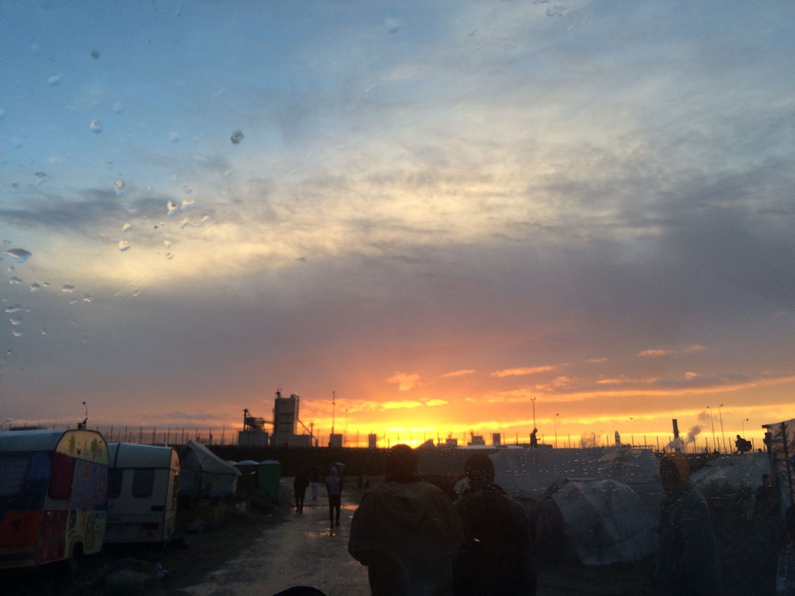
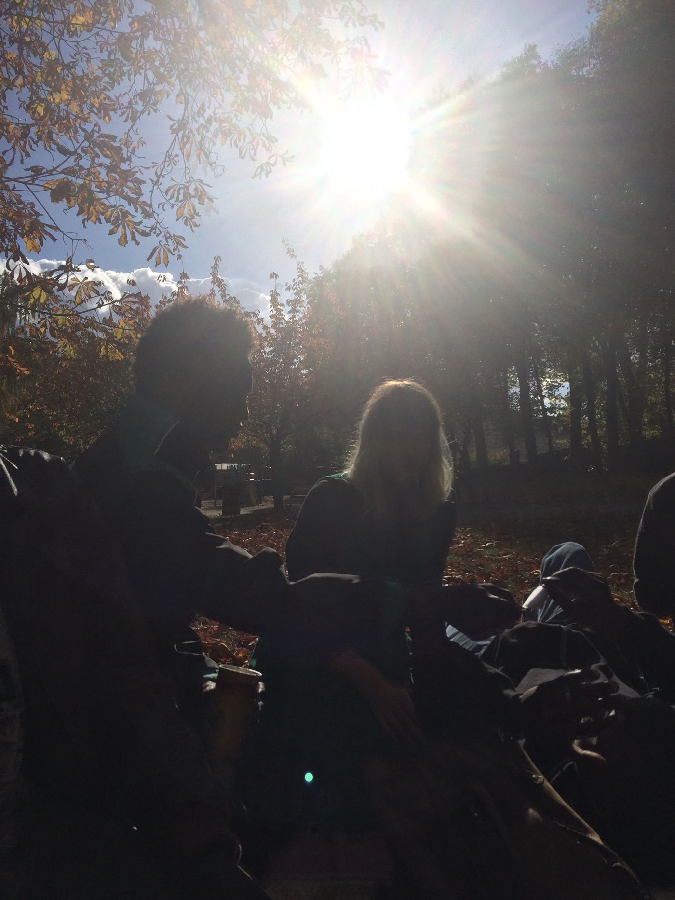
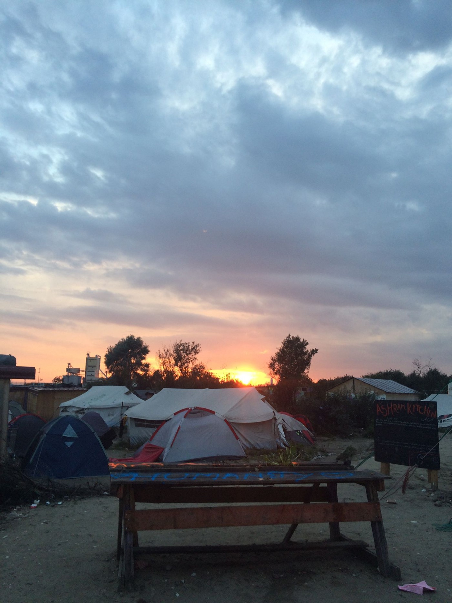
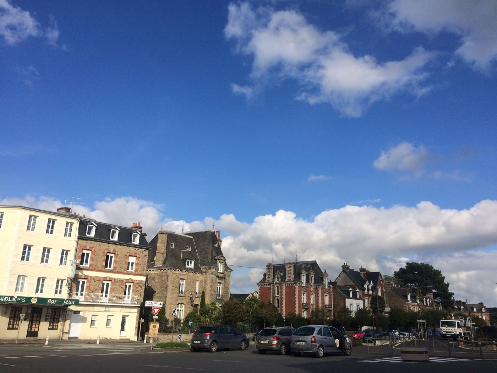

### AYS SPECIAL: “It’s Been A Long Time\.”

_The Calais Jungle, Two Years On_

The Jungle at sunset, one of the last evenings before evictions in 2016\.

On a cloudy, grey morning two years ago this past week, the bulldozer operators were working overtime in Calais\.

The Jungle’s population had swelled during the summer months, and elections were [approaching](https://www.bbc.com/news/world-europe-38173350) \. The French government found it politically expedient to empty and raze the illegal refugee camp in one fell swoop\. On October 23rd, 2016, the night before the beginning of the evictions, French riot police idled at the underpass just beyond camp limits, holding their polycarbonate riot shields in preparation\.

The next morning, they moved on the Jungle\. There were between 8,000 and 10,000 people living in that camp, most of them men, many under the age of 18\. Within two weeks, all of them were gone: taken away on busses to temporary accommodation centers \(CAOs\) where they would have a fewmonths to apply for asylum in France, or quietly vanished, on their way to Paris or Germany or Belgium, where they would make another bid for England\. The camp was unrecognizable, mostly destroyed by fire, and the French government sent machinery in to flatten its remains\.

I spent two months leading up to this moment working in the camp in a small community kitchen\. Most of my time there was overshadowed by news of the looming evictions, and I watched as my friends struggled to decide whether to accept the French government’s offer — which meant trusting a country that had thus far showed them only hostility and violence — or leave the camp early and try to get to the U\.K\. from another European port\.

When the time came, we said goodbye without hope or anticipation of an eventual reunion\. I’ve kept in touch with a number of them, even managed to reunite briefly with several people; others I’ve lost contact with entirely\. Now, two years on, I contacted several of the people I knew in the Jungle: Musap, Khel\*, Hamada, and Khalid\* \. I was curious about their recollections of the Jungle, and I wanted to investigate what had happened to them in the intervening years: these people united by the happenstance of spending a few months living alongside one another in a strange muddy tent city, at the edge of a freeway that led to England\.

Hamada was one of a group of 5 Sudanese men from nearby villages in Darfur who worked nearly every day in the kitchen\. In late September of 2016, as news of the upcoming evictions spread, they began to wonder what they should do\. Two of the men started the French asylum application process during the last weeks of the Jungle’s existence, and on October 25, all five boarded a bus bound for a CAO in Le Mans, a small city two hours southwest of Paris\. They were sad to give up on their shared goal of England, but at least they could make the decision to stick together\.

The French government had other plans\.

A year after the Jungle’s demise, another kitchen volunteer and I visited the boys in Le Mans\. One of our friends, Abdullah\*, had received asylum\. He was employed as an apple picker and had just moved into a new apartment almost entirely absent of furniture; we ate dinner sitting on the floor\. A local volunteer had given him a copy of Malala Yousafzai’s memoir, which he showed me alongside his new _carte de séjour_ \.

Hamada and a friend in Le Mans, November 2016\.

Hamada had already been gone for a few months by then\. After his asylum request was denied by the French government in August, he was given merely two weeks to leave his CAO\.

“They told me ‘your asylum is rejected and so you have to go,’” Hamada recalls\.

“I didn’t know what I can do\. People said, _you have to find smuggler\._ ”

He started thinking about the dream he’d given up on when he got on a bus for Le Mans\. “I was homeless, jobless\. I didn’t know what I could do\. So I said, ok, I’ll try for England again\.’”

Hamada paid a smuggler to get him to Belgium and help him stow away on a lorry\. He tried twice without success, getting caught by police each time\. On the third try, miraculously, he ended up in London\.

That winter, he sent us a video that a friend took of him walking down a city street in a snowstorm, his hair dusted with it, as though he had aged overnight\. At one point, he scoops the newly fallen snow into the shape of a heart, then jumps inside it\.

“I dreamed of this before, in my country,” Hamada tells me\. “I have so many friends from different countries here…\. my English is good — not great\-great, but middle\.”

He feels far more comfortable in London than in France: “When I was in Le Mans, I feel like I’m living with racist people\. When I say hello, nobody say hello\. When I ask a question, nobody will stop…\. when they see refugee people or black people, they have a bad feeling\.” He sounds resigned to the ill treatment\. Then he smiles\. “In U\.K, anybody will say hey to you\.”

Hamada applied for asylum in the U\.K\. He told the police the truth: that he had no family in the U\.K\. \(two of his uncles have since made it there from Egypt\), that he’d had his [fingerprints taken](https://openmigration.org/en/analyses/what-is-the-dublin-regulation/) in both Italy and France\. Now, he’s working as a dishwasher in an Iranian restaurant, taking English classes, hanging out with his new friends, and waiting for a response to his asylum case\.

His life is both pleasantly routine and still wildly unresolved; it could change drastically the moment he receives his decision, leaving him as bereft as he was in August 2017\. But Hamada has always been a master of equanimity\. In our conversation, he’s upbeat that it’s impossible for me to tell whether he’s apprehensive about the outcome\. The only thing he says about it: “I hope they won’t forget me\.”

This past Saturday, a new [report](https://www.theguardian.com/world/2018/nov/03/uk-admits-only-20-unaccompanied-child-refugees-in-two-years?fbclid=IwAR0xvBK5srwH9C79n3WswdrUWVAa-TASfM5hpEdD-qX-82Wr4TTATXsqK64) by _The Guardian’s_ Observer Magazine revealed that the Dubs Act, a parliamentary scheme created with the intention of transferring 3000 vulnerable child refugees to the U\.K\., has only succeeded in transferring 220\. The Observer noted that this is fewer than the estimated number of children who have died crossing the Mediterranean in 2017 alone\.

Khel\* happens to belong to the former group\. “It’s been a long time,” he says when he sees my face, blurred through the screen\. He was only 13 back then, the youngest person I knew in the Jungle\. There were younger children, of course, but they were closely guarded by their fathers or mothers\. Khel was alone\.

In the Jungle, Khel and his friends lived just beyond these tents\.

Incredibly gentle, with a soft voice and a shy smile, he lived with a ragtag band of unaccompanied Afghan minors who were slightly older and much wilder\. During the day, they played cricket and stole biscuits from our food supply\. At night, they went out to “try” \(what camp residents called the process of attempting to climb aboard a lorry bound for England\) together, often showing up in our kitchen the following morning with inexplicable injuries and infections\.

They were completely uncared for, vaguely watched over by an older countryman whom none of us trusted\.

During the week\-long evictions, the thousand\-odd unaccompanied minors in the camp were kept in containers the midst of the camp and asked to “register” with officials\. Many were interviewed, creating anticipation that they would soon be brought to the UK\.And yet, at the end of the process — a traumatizing one for many children, who were left essentially alone in the center of the camp, watching as it was bulldozed around them — only around 200 children were ultimately transferred\.

Khel still doesn’t know why the British government chose him\. “Maybe I was lucky,” he says\.

He tells me the story of how he found out that he was going to England: “They called me and said, ‘tomorrow, 8 o’clock, be ready\.’” At first, he didn’t believe the voice on the end of the phone\. Why now, after so many nights on the highway trying?

“My friends were making fun of me,” he remembers\. “At 8am \[the next morning\] they called me and said, ‘why are you not ready?’” Finally, he realized that it was real\. He told his friend Ramin\* goodbye: “He said, ‘no, you’re joking\!’”

None of Khel’s 6 or 7 friends, all vulnerable unaccompanied boys between the ages of 14 and 17, were transferred along with him\. Khel sent them a photo of England when the bus arrived\.

He’s been living with a host family in West London ever since\. “They’re nice people,” he tells me\. Some of his Facebook photos show him posing in a hoodie and trainers with a few other Afghan friends; in others, he’s in a _salwar kameez_ and John Lennon glasses _\._ Khel plays cricket twice a week, and his main worry right now is passing his GCSEs\. About 6 weeks ago, he finally received a visa that will last until he’s 21\.

Though he had to wait nearly 2 years for the visa, he wasn’t too worried\. “I just feel like I’m safe here,” he tells me\. “It’s better than the Jungle or Afghanistan\.” These days, he doesn’t think about Calais much at all\.

When I video chat Khalid\*, it’s a stormy Sunday afternoon in St\. Brieuc, and he’s in his kitchen making lunch for the following workday — a recipe of his mother’s, who he hasn’t seen in years now\. He’s always liked to cook, and been good at it — I remember him at 16, collecting euros from the other kitchen workers and turning back up with a dozen eggs, teaching us to make shakshuka\.

But this calm, self\-possessed young man moving back and forth across the screen while he sautés vegetables seems eons away from the boy I knew in Calais: hilarious and magnetic, but angry, even manic at times, caught in the throes of adolescence amidst a situation that would be overwhelming for a sage\.

“I was in Calais for six months, and after six months I was so destroyed,” Khalid says\. As evictions neared, he banked his hopes on being transferred to the U\.K\. through the Dubs scheme\. He was the perfect candidate: unaccompanied minor, direct relative in the U\.K\. He underwent several rounds of interviews\. “The Home Office said they would bring me to my uncle,” he reminds me, “and then they didn’t\.”

Instead, French authorities sent him to a town in Brittany, where he struggled with feelings of anger, isolation, and hopelessness as he waited for updates on his family reunification application\. Because his request to rejoin his uncle was pending in the U\.K\., he was barred from attending school in France\.

When the application was ultimately [denied with no explanation](https://www.theguardian.com/commentisfree/2018/jul/31/the-guardian-view-on-the-uk-and-child-refugees-unfair-unlawful-inhumane) , Khalid watched his dream of making it to the U\.K\. dwindle and vanish\.

“I didn’t choose to stay in France, but luckily I \[did\],” he says\. “I met a woman who helped me\.” He’s referring to Lucy,\* an Australian woman who befriended him, advocated for his case, brought him into her home, and, in the end, functionally adopted him\. Today, he refers to her as his second mother\.

The town halfway between St\. Brieuc and Lucy’s house, where Lucy used to pick Khalid up from the train station\.

In the past year, thanks to Lucy, Khalid’s attitude toward his life in France has changed considerably\. “You remember how I was in Jungle,” he says, “I didn’t like when people said that France was a good country — well, I learned the truth\. I’ve made loads of friends…French people are lovely — if you can talk to them in French\.” Which he can: Khalid has an incredible gift for languages\. He speaks both Dari and Pashto, pieced together English from lessons back in Afghanistan and conversations with various volunteers in the Jungle, learned French within a few months of being transferred to St\. Brieuc, and has somehow perfected his English during the past two years in France\.

After part\-time employment at a bric\-a\-brac shop where he was adored by the _patron,_ a cigar\-chewing Frenchman in his late 50s, Khalid began working construction\. He adopted a bunny and bought himself a car with the money he’s been saving from work — whatever’s left over after sending remittances to his mum\. One time, while he’s on the phone with me, Khalid stops to pick up some hitchhikers, chatting with them in easy, slangy French\.

“People have done good things for me, and I like to do good things for other people now that I can,” he tells me\.

Last January **,** the French government granted him asylum\.

Ididn’t know Musap very well in Calais, but I remember his smile, and the poems and rap videos he posted on Facebook from the very beginning\. When I speak to him over Facebook video chat for the first time in almost a year, he’s about to start his new job at Airbus\.

“They were looking for someone who speaks English and French, and they got me,” he says, smiling still\.

During the eviction, Musap decided to get on the busses and go to a CAO, though he doesn’t see it as a real choice, given that the alternative was arrest and possible deportation\. He ended up in Nantes\.

After his asylum request was initially rejected, Musap appealed and was ultimately granted full refugee status — one of just [5,402](https://www.asylumineurope.org/reports/country/france/statistics) asylum seekers in 2017, or about 12% of all those who appealed their first rejection \(83\.3% are rejected a second time; an additional 5 percent receive a lesser recognition known as subsidiary protection\) \. Now, he’s in secondary school, studying for his baccalaureate and learning Spanish\.

Though Musap is relieved that his asylum request was reconsidered, he misses the Jungle\.

“We had freedom there,” he says, “Since we arrived in the E\.U\., that is the first place we were happy\. That was our home\.” Now, his life is mundane, he says — “Staying in your flat, going to school, coming back\.” He tells me he’s been creatively blocked since the Jungle was demolished and can’t seem to finish the album he’s working on\.

It may seem shocking that a place like the Jungle — mud, camping tents, filthy portable toilets, hunger, exhaustion, constant theft — could induce nostalgia\.It’s not a universal experience by any means — Khalid remembers some of the worst times of his life there\. But Musap isn’t the only one to express this sentiment\.

Many of my friends in Le Mans said the same when I saw them last year\. For people who are experiencing uncertainty or stagnancy in their daily lives, the Jungle symbolizes freedom, community, and the sense of single\-minded purpose that comes with a fixed goal\.

“There, when you sleep, you have in your mind, _tomorrow I will go to England\._ So you have a future\.” Two years later, Musap’s conception of the Jungle is elegiac; for him, the camp represents a past in which a different future was still possible\.

“Would you go to England if you could, even now?” I ask him\. “ _Yessss_ ,” he half\-whispers immediately, before the words are even out of my mouth\.

Intimately acquainted as they were with the reasons why a person might end up in Calais, trying to get to England, no one living in that camp believed that the Jungle could ever truly be eradicated\. A common refrain during the weeks leading up to the evictions was “Jungle never finished\.” And when evictions happened, a few hundred camp residents decided to double down on that belief\.

As the bulldozers continued their work — ripping down tents and crushing the plywood structures once used to sell phone credit and cigarettes, flattening trash and people’s belongings back into the dirt of the industrial site that the camp had been built on — they blended quietly into the woods surrounding their former home and waited for the police to clear out\.

These people were perhaps too optimistic about their personal prospects for success, but they were right about the inevitability of a refugee camp — in whatever form — in Northern France, as long as the laws and policies that have created such a phenomenon remain\.

Though the crossing to England has only become more risky and futile in the intervening years, refugees have once more flocked to the region\. There are currently around 3,000 people living in the woods in Dunkirk, Calais, and the surrounding area\.

](assets/65bce90b97bd/1*yfTTrL8af-WuF_NYRv_44A.jpeg)

The makeshift camp in Dunkirk, before the evictions\. Credit: [Roots](https://www.facebook.com/charitableroots/posts/2745957238962201?hc_location=ufi)

To Hamada, Calais seems like a distant memory, but he’s heard a little bit about what’s going on there now\. “Calais is now closed but the people make another community, 1000 people there, I think\. Now it’s too hard for them,” he says\.

In the past two years, refugees in the region have been hounded by police day and night: their phones stolen, their shoes slashed, their belongings drenched or set alight\. Police allegedly confiscated one disabled child’s [wheelchair](https://www.facebook.com/care4calais/photos/a.1046164975416459/2162102387156040/?type=3&theater) \. Solidarity workers have been targeted as well — one activist was convicted for a [tweet](https://www.hrw.org/news/2018/09/27/france-aid-worker-convicted-tweet) , and in 2017, the Calais mayor attempted to outlaw food distribution in the area\.

Khalid is still in communication with one of the women who runs the Calais info point, and he knows exactly what’s going on — and he’s angry about it\. “Well it’s shit, because they’re not having anything,” he tells me\. “The French government is taking their tents down\. Look at this fucking weather…\. I’m sorry, I’m swearing again, but it just makes me sad\.”

Musap lives not far away from Calais, and he’s gone back to the area often to volunteer with Care4Calais, an organization that has been active in the region since 2015 **\.** Many of the men and boys he meets in the woods there are Sudanese, and they sometimes mistake him for a Brit because of his English, his trendy hairstyle, and the white\-and\-red bib that marks him as a Care4Calais volunteer\.

“I feel so good when I go there,” he tells me — “I help refugees and it reminds me of the good days” — the good days being Calais back in the day\. Still, he says, “the situation there is very difficult now\.”

Despite the French police’s best efforts to make life as miserable as possible for refugees in the area, the charity Utopia56 [reports](https://www.facebook.com/Utopia56-Calais-Grand-Littoral-258099198180444/) that there are currently around 500 people “living rough” — because most of them are so hounded by police that don’t even get the chance to sleep — in Calais\. In October 23, almost 2 years to the day since the eviction of the Jungle commenced, there was another mass eviction — this time in Grande\-Synthe, a suburb of Dunkirk, where thousands of people have been living in a similar state of privation and precarity\. Two weeks later, many of them are already back\.

As we speak about the situation in Calais now, Khalid thinks back again to his six\-month stint in the Jungle\. “I was suffering there,” he says: “It was good in some ways because I learned a lot from it, but it was also just like a bad dream\. A nightmare\.” He pauses\. “And I can’t imagine doing it without a tent\. At least we were not forced to be moved all the time\.”

**_post\-script:_**

_The men I interviewed for this article are not representative of the nearly 10,000 people living in the Jungle at the time of its eviction\. They are all young, healthy, able\-bodied, resourceful; all of them spoke enough English to advocate for themselves\. Most of all, each of them has been lucky\. Khel’s one\-in\-a\-million Dubs transfer, Musap’s successful appeal, the fact that Khalid met someone who was prepared to truly care for him — even Hamada, who made it to London under a lorry when others have died on the highway trying\._

_For each of them, there is another displaced person who once lived alongside them in the Jungle: A child rejected by the Dubs amendment who has since [gone missing](http://safepassage.org.uk/press_posts/child-refugees-may-be-missing-because-of-home-office-failure-says-safe-passage-charity-as-government-loses-at-court-of-appeal/) , a young man whose asylum application has become homeless after receiving his second rejection\._

_Musap and Khel, Hamada and Khalid\. They have each been through hells barely touched on here, but they have all achieved some measure of peace that is denied far too many refugees\. Certainly one withheld from the men, women and children gathered in Calais and Grande\-Synthe today\._

_\*Names have been changed at the request of the interviewee\._

**_\(By Piper French, AYS Info Team volunteer\)_**

> **We strive to echo correct news from the ground through collaboration and fairness\.** 

> **Every effort has been made to credit organizations and individuals with regard to the supply of information, video, and photo material \(in cases where the source wanted to be accredited\) \. Please notify us regarding corrections\.** 

> **If there’s anything you want to share or comment, contact us through Facebook or write to: areyousyrious@gmail\.com** 

_Converted [Medium Post](https://medium.com/are-you-syrious/ays-special-its-been-a-long-time-65bce90b97bd) by [ZMediumToMarkdown](https://github.com/ZhgChgLi/ZMediumToMarkdown)._
