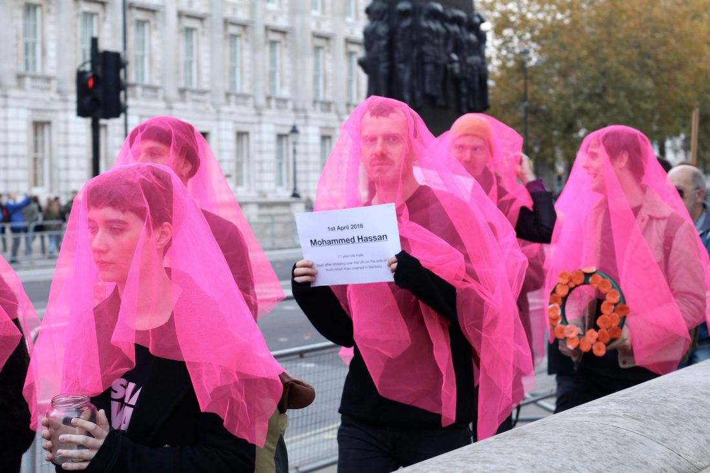

### AYS Weekend Digest 10\-11/11/18 Racist attacks on AYS Integration Centre

_Far\-right march in Poland // Shootings outside of Libyan detention center // Unaccompanied minors updates from Greece // Updates on the ground from the Balkans // and so much more…_

### Feature

A direct consequence of anti\-refugee propaganda: AYS integration center is targeted by fascists\.

For the third time in recent weeks, AYS’ van, free shop and integration center in Zagreb have been vandalized by unknown perpetrators who usually act during the night and on weekends\. Such attacks occur when our media presence is higher or when anti\-refugee propaganda is on the rise, as it currently is in Croatia\. The last two incidents involved breaking our windows and smashing our van with bricks\.

Photo By Are You Syrious’ Integration Center in Zagreb

This attack is only part of the threatening reality\. Recently, there’s an almost constant police presence in front of our integration center and it is still unclear if this is for our protection or if they’re trying to intimidate us\. It’s unclear because our relationship with the Ministry of Interior has been very ambivalent due to our advocacy work which involves raising awareness about unlawful, violent push\-backs perpetrated by Croatian police\.

Because of this, our volunteers have been repeatedly held for hours in police stations for reporting unlawful activities even though we are legally supporting asylum seekers, and we receive threats of criminal charges with no legal grounds\. However, it is important to note that we have a very decent cooperation with police officers in the Porin reception center in Zagreb where we have a constant presence\. Yet the Minister of Interior has called us out several times for “encouraging illegal migration”, which has also triggered a lot of hate coming from Croatian fascists\.

Today’s events are just another vivid example of how such public government pressure and fake news propaganda make a toxic mix that erupts in violence and vandalism\. Of course, this only motivates us to continue our work\. In solidarity, AYS ✊
### Libya

The photo below is from the detention center Sabaa, where a few people managed to force their way out and one boy was shot by police\. Once detained, the police refused to give any food to the starving men\.

> As one activists states, “This is torture, they need immediate evacuation\.” 

Calls to UNHCR Libya, where are you? Why aren’t you getting them out?

](assets/9625a9d4858b/1*eArEy6-XjdgGsnAwUHinTg.jpeg)

Photo by [Giulia Tranchina](https://twitter.com/GiuliaRastajuly/status/1061325606296739845?fbclid=IwAR2sHd3qU0lobmuMIrkvqhCG7DRMbxx378MmijqmTBVn2akBSPN7iU4nsyc)
### Sea

Seenotrettung \(Mission Lifeline\) wants to help equip smaller boats and individuals with the means to make sea rescues\. Fishermen have always shown us that it only takes a small boat to save a life\. Find out more about their campaign [here](https://us13.campaign-archive.com/?u=4d9384120d9f4822d5c4cb13a&id=b0e3ec6601) \.

On Sunday, 243 people were rescued from 10 boats according to [Salvamento Maritimo](https://twitter.com/salvamentogob/status/1061680314794303489?fbclid=IwAR0QvboWA3Ui2GLaePnSI4GLvraP8cgqAGFPM5LZjAHuYh5o-CUWEpKu5cY) , in the Mediterranean between Spain and North Africa\. 5 of the boats were in the Estrecho Sea \(each carrying 18 , 7 , 5, 10, and 23 people\) and the other 5 were in the Alborán Sea \(carrying 34 , 33, 72, 21, and 20 people\) \.

[13 bodies](https://twitter.com/eldiarioes/status/1061689515549646848?fbclid=IwAR2qcEZHsfohA7OCyIRDgKhRam82Z7wDQonDbkKTarA0onNozZS2sU7MRfE) were found from a boat after it shipwrecked in Cadiz on Sunday\. Witnesses say that 31 people were on the boat, so 31 drowned in total\. That means [31](https://twitter.com/alzoubeidi/status/1061604708408872960?fbclid=IwAR1apzTLKSdorphSnS5gsYSEkBXatCAYFksqAH8u_fe8s32YwFNKwgB7u5Q) people died along the western Mediterranean route and 730 people arrived to Spain from Morocco this week alone\. While it’s said over and over again, how many more times is Europe going to let this happen?
### Cyprus

According to UNHCR, so far this year 392 people have arrived to Cyprus by sea\. The majority of them are from Syria\.
### Greece
#### Child killed in van crash after police chase

A 4\-year\-old child died and 27 people were injured when a van transferring migrants collided with a truck on the old national highway Thessaloniki\-Kavala on Friday night\.

Witnesses report that the van was being chased by police at a high speed before the crash\. Deaths resulting from chases like these have become all to common in Greece, with many occuring on the Thessaloniki\-Kahala highway\. It is time for the Greek police to change the reckless chase policies that are resulting in so many deaths\.

■■■■■■■■■■■■■■ 
> **[Marianna Karakoulaki](https://twitter.com/Faloulah) @ Twitter Says:** 

> > Four year old #refugeesGR boy after crossing the Greek-Turkish land border. The car he was in crashed with a lorry. 27 people are injured. 
Closed borders did their fair share in yesterday's death toll again. [efsyn.gr/arthro/nekro-4…](https://www.efsyn.gr/arthro/nekro-4hrono-agoraki-se-trohaio-me-prosfyges) … 

> **Tweeted at [2018-11-10 10:42:26](https://twitter.com/faloulah/status/1061207446092500992).** 

■■■■■■■■■■■■■■ 

#### New Arrivals

**Saturday**

A boat arrived on Lesvos in the early morning carrying 46 people \(no breakdown available\. \)

**Sunday**

A boat was picked up outside Samos this morning around 08\.00\.
14 people 
No breakdown available\.

One boat landed on the South shore of Lesvos, carrying 36 people — 
23 children, 8 women, 5 men\.

Aegean Boat Report, which puts out regular reports on new arrivals to the Aegean islands that we at AYS and many others rely on, is currently having a fundraiser\. Contribute [here](https://www.facebook.com/donate/1117524501743773/) \.
#### Increase in refugees fleeing to Greece

35,600 people have arrived by land and sea to Greece so far this year, according to the latest figures from the UNHCR\. This is a nearly 50% increase compared to the same period last year, showing that those who are claiming that the war Syria “ended” are clearly living in their own world\.

An estimated 5,300 people arrived on the Aegean islands in September, making it the month with the highest numbers\. There were also 2,680 people stopped and forcibly returned by the Turkish Coast Guard \(TCG\) in September\.

The countries that most people were arriving by sea from were Syria \(30%\), Afghanistan \(23%\) and Iraq \(20%\) \.

#### Over 5,000 Turkish citizens have applied for asylum in Greece

Since the failed 2016 coup attempt in Turkey, 5,786 Turkish citizens have applied for asylum in Greece\. Since the coup many academics and government workers have been swept up in efforts to oust the “Gulenist” movement\. While Turkish citizens fleeing to Greece is a relatively new phenomenon, Turkish people make up a small percentage of refugees in Greece as a whole\. For example, approximately 10 times more Syrian people than Turkish have applied for asylum in Greece in recent years\.
#### Unaccompanied Minors in Greece — Who is accountable?

Greek authorities in coordination with Unicef have released new figures on the number of unaccompanied minors in Greece\. While the graphs above may not seem much to look at, they represent a very alarming reality\.

856 children are living in the refugee camps across Greece, where they have very limited access to education and support services, if at all\. 277 unaccompanied minors are living in “informal housing”, and a reported 275 are missing\.

ShowerPower, a group that provides showers to women and children in the Moria camp on Lesvos, urgently need a volunteer starting on 15 December\. Contact [here](https://www.facebook.com/SPSLesvos/) \.
#### Arrests of people flying with forged documents are up in Greece

According to figures from the Greek government, 6,633 people have been arrested so far this year for trying to fly out of the country with forged identity documents\. This is a sharp increase compared to previous years\. The greatest number of arrests happened at the Iraklion airport on Crete, where 1,511 people were detained\.
#### Disgusting conditions at Petrou Ralli Immigration Center

People who are being detained in the Petrou Ralli immigration center in Athens are facing not only disgusting living conditions and a lack of medical services, but also a total lack of access to legal services or information, according to Greek human rights group MOV, which visited the center this week\. According to their report,

> The worsening of detention conditions was evident even before we talked to women\. It is characteristic that we already went up the stairs to women’s detention centers through a crowd of cockroaches that were running in every direction, on the food, stairs, and walls\. Then women told us that cockroaches live in their cells as well as in toilets, everywhere\. They also told us that there are other insects in the rooms and especially in their beds and that they suffer from stings and dermatological diseases\. And indeed we saw the signs on their bodies\. 

> …Our constant request is to close all detention centers, open decent reception and hospitality centers, and remove the geographical restrictions on movement\. Solidarity with detained women refugees and immigrants\! 

■■■■■■■■■■■■■■ 
> **[NoBorders](https://twitter.com/Refugees_Gr) @ Twitter Says:** 

> > Report of MOV after last visit to women refugees and immigrants detained in Petrou Ralli immigration centre:  worsening of detention conditions and inadequacy of legal protection
[tomov.gr/2018/11/09/pet…](https://tomov.gr/2018/11/09/petrou-ralli-moria/?fbclid=IwAR2vY6BJsvhI1mnW_lusutIGWFBc5t32fcbJGQgkiCJHNa3eLQ7q4qxfNLA)
ENGLISH TEXT 
[facebook.com/nobordersnetwo…](https://www.facebook.com/nobordersnetwork/photos/a.660787423989153/1999746806759868/?type=3&theater)

#refugeesgr #antireport #PetrouRalli https://t.co/pYKVU5V6xX 

> **Tweeted at [2018-11-11 12:11:38](https://twitter.com/refugees_gr/status/1061592284481892352).** 

■■■■■■■■■■■■■■ 

You can access their full report \(in Greek\) [here](https://tomov.gr/2018/11/09/petrou-ralli-moria/?fbclid=IwAR1BgTDzMcPMcZa5wIa_nJnx2opA0zg5dkxiJrErJLikKGwQi6C6ITP4V5Y) \.

We generally do not publish information related to individual needs for housing, etc in the daily digest\. However, information has been posted about one mother in Athens who is living in a flat where the owner is demanding that she give him her eldest daughter in marriage\. This is an especially outrageous example of abuse in the Athens housing market, but throughout Greece, refugees face more typical forms of discrimination every day\. If you can help find accommodation in the city you can use contact this [here](https://www.facebook.com/profile.php?id=100004919027405&__tn__=%2CdCH-R-R&eid=ARAaU5AZEnvNoOpH6h_4U6XrG88rXxd38Un-FMw01r222EdVP_s0li_yUm1Od_MjQTK7qA5CYyz9aM6H&hc_ref=ARRTpngLt96ZesewsCW35F6aMmecS6M7wKCBl5AXMoBAjyoMJeEWiW2L2R9QYYKTXQ4&fref=nf) \.

Amurtel Greece, an organization that helps refugee mothers and babies, is looking for someone to help with their website\. Please get in touch with them [here](https://www.facebook.com/AmurtelHellasforRefugeeMothersandBabies/posts/741405726214639) \.

Volunteers at the Skaramangas camp, 30 minute outside of Athens, are looking for a yoga teacher\. Contact [here](https://www.facebook.com/caitlin.plunkett.3?__tn__=%2CdCH-R-R&eid=ARAcuD1b_d8t5AZaL_PcheuT8bns3rDy-0C_x9Ptb7PKyN_xx7lSI4XY_gVBfbr_vuF3fjZgEawv7x2D&hc_ref=ARQL7Eu_cNqtTyYhVF4gnIPzGvWHjV1nMPMO9iwho4XabdoWT-CPgCZ7atFUTPsw6wY&fref=nf) if interested\.
### Italy

For all the hate, racism, and fear mongering news in this digest, here is a moment of grace\. Take a look at this montage of friendly and inclusive faces from the march on Saturday in Rome, where 100,000 people descended into the streets standing in the face of dehumanizing others, remaining \#Indivisible\.

](assets/9625a9d4858b/1*mAL4lU2KKJeVGmjqN38BCw.jpeg)

We are here today “to say no to the immigration decree, to the criminalisation of solidarity and to any form of exclusion and social marginalization\!” Photo By [Refugees Welcome Italia](https://www.facebook.com/refugeeswelcomeitalia/photos/a.1644175432520667/2279092605695610/?type=3&theater)

](assets/9625a9d4858b/1*TEBe69py8hOXhkeoxbyvOQ.jpeg)

Thousands protest “today and yesterday and tomorrow \(we\) believe in an inclusive, supportive, anti\-racist society\.” Photo By [Gabriella Guido](https://www.facebook.com/gabriella.guido1?__tn__=%2CdC-R-R&eid=ARCfzqYZGOxxMy6AjnopltcDJ4hHFjHNYfRIi51Sq6dccI5xCLVNvhm-yrsCc5UZzbdioZglktzp0tki&hc_ref=ARQZ65TXOpVv7zVUDjCQLUd96OD5ITDbSRVzy4x48E0bAkkxalkQgLPmanh-p-f2uu8&fref=nf)

](assets/9625a9d4858b/1*dTReVTc-HOEy1P6ee3uuWg.jpeg)

“From The Piazza Della Repubblica to Rome, we say: we choose humanity, we are united in diversity\!” Photo By [Stephen Ogongo](https://www.facebook.com/ogongo?fref=gs&__tn__=%2CdC-R-R&eid=ARDW551ScLjS1XAHBtDZuTaVtxGRru-IgroKx3HS2tAOztiNRYYBjO2TXyZXmSvivu9Et9kuMPIDvgWp&hc_ref=ARQ67FF-TZ63Pj_9wookb4f6jNeAJh6PB9H05EL-jI6eYUKTTNXD3Swd7JObyglCAsc&dti=483683632041010&hc_location=group)

](assets/9625a9d4858b/1*LGsWmJ4jwQfd8DoXYFlWZQ.jpeg)

Photo By [Città Migrante](https://www.facebook.com/citta.migrante/?__tn__=kC-R&eid=ARD3pkSvzhUD8yLykYAEmN9G_KB-ednRyqkqMgnRgsWZ4QQjVOwVYb9ijimcITIVtaFfkRgqHLT1Nu92&hc_ref=ARQtQTzIDPgocZ-B2DX2XnKU5TYQonIvGKRzLKsACSoMZugd38wubSb6i0KMSy7tdfs&fref=nf&__xts__%5B0%5D=68.ARAmuWiBz1MMxl6IAEzindWeeMgQ3YdQmv6ikFAGys-KH025IjwzX7H-WWv0ujH792AvMLS2j2mlwenARDbNdr6-9UTo2wXdOwG2lP6AKwzfReeiU7ftwfQkQYqMX8zXA4L07dlu9x5yhCqX00Jamd-HZ9aabrDtgyPW_Q9aIYcs4RnSm8U8f0yUZos611ZSEq3jOIGIIG4Q50qGADjat5nyxORQTjm62bCEisxZy3MX5Wx8O5zqyYs_c4QCFDDGQG6DO6tgtRL9QAiNFpYuTQqGGs9Z9P2RpV2gcWomu0-UoleN7Ygtr_kMkKj_6kkuNYyMu-x3mKCdokafXBlSxS2dUw)

However, the media did very little to cover the event\. [The only coverage](https://www.facebook.com/indivisibili10novembre/posts/947463948796999?__xts__[0]=68.ARA7CiEniSnAzPVPTSlJm-RrxStmFF0fs3dFpwR1-dZzFyFEBmVy5ee6fayQHsJwpFBoQcONqxqaNyDrrAB-_4VAwTHi4UQggEKN4JBymOyMHC7OLA4t9wP0FIhiYAgNabQz3o_rtNJo9AKFSvuW6UqxifKWQpfG18hVNmlEewq8KxbVtPH-XB6r3MWYZBGD9TgFOBRZgKou4LFIQaofsi1i0xDY250G5nSQcZuj322rffxM1HdXGjwJYLfMmAPGbFPIp95EGcy_31saP6cmth5ksIu3Vmz2SKtlBykMERxaPwWDPV7vsE7VnmeUEdceFtpEhG6yrmrg8iKwhjlPS_Q&__tn__=-R) concerned the very unfortunate death of one of the protesters, a 55 year old man from Ethiopia who happened to be ill\. [Also the police](https://www.facebook.com/arvultura/posts/2052821671444461?hc_location=ufi) were trying their best to stop buses from reaching the demonstration and were identifying and intimidating migrants as well\.

Still, 100,000 people showed up on Saturday demanding their country to stand against racism and discrimination\. Huge congratulations to the Indivisible movement’s organizers\.

According to UNHCR, just under 950 people reached Italy’s borders in September\. This is an 85% decrease compared to the number who arrived in September 2017\.

[250 people](https://www.repubblica.it/cronaca/2018/11/10/news/migranti_i_maltesi_riforniscono_di_benzina_giubbotti_e_bussola_un_barchino_arrivato_a_lampedusa-211256692/?fbclid=IwAR2QQiFPN3AOZYCxJzYDiSlWoQHIMPKxf6YifoZ9XMEBc1t1gQH6sAaAn84) landed between Lampedusa and the coast of Trapani in 24 hours\. These “ghost” landings are, according to the Ministry of Interior, favored by Malta\. Italy’s Matteo Salvini said that there is photographic evidence and that the lifejackets used by the people were branded “Mecca Marine”, the same brand working for the Maltese army\.

Intimidating tactics coming from Salvini on Saturday in a response to Malta’s lack of assistance in rescuing people at sea earlier this week:

> “If Malta and France treat us like fools, they will have to face the consequences\. Instead of waiting for little letters from Brussels, it’s time we sent angry ones to them\. I’ve had it up to here with the rest of Europe treating Italy like a refugee camp”\. 

These photos are from the “Alagie” in a camp near Foggia\. No this isn’t Libya, these are the common conditions refugees on the European continent face\.

](assets/9625a9d4858b/1*_Gr9lUgx7xB4i1Pvbs0VYA.jpeg)

Photos by [Migrants of the Mediterranean‏](https://twitter.com/migrantsotmed)

[15 people](https://twitter.com/Medhope_FCEI/status/1061646434796257280?fbclid=IwAR0d8jHwkT2s_-14KNqPLotKkYggP8tM8NxEF3aEMUEKIkxj0LqCTvbFyrs) landed on Saturday in the South of Sardinia, 45 more between Thursday and Friday, all from Algeria\. They have been moved to Monastir, the local reception centre around Cagliari, however the majority have been transferred to Taranto in order to be deported back\.

Italy’s new decree, intended to regulate immigration and public security, will change how one’s “humanitarian grounds” for staying in Italy will be determined\. It has yet to pass in the lower house, which is needed by the end of November in order for it to become law\. Find out more [here](http://www.infomigrants.net/en/post/13210/what-will-change-for-migrants-under-italy-s-new-immigration-and-security-decree) \.
### Spain

According to UNHCR, 42,700 refugees have reached Spain so far in 2018, including by land and sea\. This is a 147% increase from the number reached the same time last year\. Of sea arrivals, the largest numbers are from Guinea \(25%\), Mali \(16%\), Morocco \(15%\), Cote D’Ivoire \(8%\) and Gambia \(7%\) \.
### Balkans

According to UNHCR, between January and 4 November of this year, 28,709 people were registered in Albania, Montenegro and Bosnia\. 75% of those registered in 2018 were in Bosnia\.

In Serbia at the end of October there were 7,257 newly registered people, a 28% increase from the total in 2017\. The majority of the people registered in Bosnia and Serbia are from Pakistan, while the majority of those registered in Albania and Montenegro are from Syria\.
### Macedonia

The number of people staying in transit centers is very low in Macedonia at the moment, yet the number of people passing by remains high\. Centers on the southern border continue providing food supplies to people on the move\. You can find out more about Macedonia’s situation [here](https://www.facebook.com/ngolegis/posts/1774606822665199) \.
### Montenegro

A van full of people over turned in an accident on Saturday where one person was left severely injured\. The people were fleeing from the police when the accident occurred\. The police suspect that the van was stolen\.
### Bosnia

The European Commission’s figures state that 20,496 people have arrived in Bosnia so far in 2018\. Their estimation is that 6,000 are still in the country and in need of humanitarian assistance, especially in the Una Sana Canton\.

“The winterization of existing reception facilities is ongoing and two new reception facilities have been completed and non\-food items and vouchers for hostels are provided for the most vulnerable,” they claim presenting the situation better than it really is\.

In Bihac, kamp Djacki dom, where about 1000 people are living\. Photo by Ibrahim M Malla, Red Cross Bihac\.

Living conditions inside of the Djacki dom, official camp\. Photo by Red Cross Bihac

About 1,500 people were sent back from the Bihac area over the last 2 weeks\. The decision to stop people from arriving to this area was made at the meeting on October 23rd in Bihac, when representatives of the state government, cantonal government but also IOM were present\. An AYS volunteer currently in Bihac reports:

> “The past three nights about 40 policemen have been at the train station in Bihac in order to send refugees arriving by train around midnight back to Sarajevo\. It’s been announced that the police will continue with this procedure\. DRC and Save the Children have assisted the procedure by identifying minors\. \(Save the Children staff told us that they were going to be transferred to a hostel\. \) 

> Yesterday around 50 people arrived, of whom nine were unaccompanied minors\. The day before it was about 90, and the first night about 150 people\. Yesterday night one bus had been chartered and everybody accepts the nine minors was immediately ordered to get on the bus\. People in the train seemed to know that they were going to be sent back but tried anyway — since it is one of few options while traveling north\.The official reason for this procedure is that there is no capacity to take in more people in Una\-Sana and Bihac\. 

> Sunday morning, volunteers from BASIS Bosnia in Sarajevo, went to the train station in order to tell people that they are likely to be sent back if they arrive in Bihac by train\. Some people seem to know already, but it is not certain that everyone does\. At the moment it is not clear for how long these controls will continue\. It is also counterproductive in so many ways\. And expensive\. Those who buy tickets are not getting them refunded either, so people waste the few financial means they have on being deported back from Bihac to Sarajevo just to try again\.” 

According to the local media, people who are sent back from Bihac are placed in Usivak, the new camp near Sarajevo, that at the moment has around 600 people\.

However, people are still coming and finding other ways\. The police announced that the process of sending people back will continue as long as the solution for their accommodation is not found\.

Officially at the moment about 1000 people are in Djacki dom in Bihac, 500 in Bira camp and around 400 in Sedra camp\. In Kladusa, there is between 800 and 1000 people\. People from Kladusa are not moved to any place and they still do not have decent, or even human, accommodation\.
### Bulgaria

The Harmanli Refugee Camp Play School in Bulgaria is in desperate need of financial resources\. The school was set up in 2014 in order to provide a safe center for the children living in the camp, as play has proven to be one of the best therapeutic measures for children who have faced trauma\. In order to help them run a 5th year in their center, please check out their GoFundMe [here](https://www.gofundme.com/harmanlirefugeecampplayschool3?fbclid=IwAR3AK9aaN4BmO_jhyINFq8Bj5Q00aUDalXEAZJl7e68fmkScvELpmpiJ4TI) \.

[Border crossings](http://bulgaria.bordermonitoring.eu/2018/11/11/border-crossings-to-bulgaria-are-increasing/?fbclid=IwAR36Mydmla8vQKsB0cl_s6M9ZQ3Ks5cxkj-XxMXM3NgeYsTopr8lWRnsVqk) into Bulgaria have increased significantly since August 2018\. 2,416 people were detained from August through October\. Serbia has also seen an increase in the number of people crossing from Bulgaria\. The police are still trying to prevent people from entering into the country and have placed a restricted area along the Evros River on their border with Greece\.
### Poland

[About 200,000](http://www.dreamdeferred.org.uk/2018/11/poland-fascists-lead-europes-largest-far-right-demo-eywitness-report-and-analysis-photos-and-video/?fbclid=IwAR1-457uwYCnUnbb0Ojt8rF7-K6YThtA8sG1sYvssqZV1ePTlhwgAooy2qE) people participated in a march, including the representatives from the Polish government and the President Andrzej Duda and Prime Minister Mateusz Morawiecki\. They marched alongside far\-right groups to mark the centenary of the restoration of Poland’s independence\. Most participants at this year’s event were peaceful, raising the Polish flag and chanting patriotic slogans\. Others used neo\-Nazi hate symbols and screamed profanity against refugees as well as others\.

](assets/9625a9d4858b/1*jZBzSC18NrhxhS-9vUJUvA.jpeg)

Photo by [Dream Deferred](http://www.dreamdeferred.org.uk/2018/11/poland-fascists-lead-europes-largest-far-right-demo-eywitness-report-and-analysis-photos-and-video/?fbclid=IwAR1-457uwYCnUnbb0Ojt8rF7-K6YThtA8sG1sYvssqZV1ePTlhwgAooy2qE)
### France

In an on the ground update from the [Refugee Women’s Centre in Dunkirk](https://www.facebook.com/refugeewomenscentre/photos/a.178973875861584/535889466836688/?type=3&theater) ,

> “\(we\) are pleased to learn that, following last week’s meeting with Dunkirk Sub\-Prefecture, families sheltered by local homelessness charity Emmaüs Dunkirk have been taken to an accommodation centre in Somain\. On Tuesday evening families were housed for the night in a community centre in Grande\-Synthe before the relocation to Somain on Wednesday morning\.” 

Refugee Info Bus is looking for donations to continue their work in preparing people for the upcoming winter\. Find out more [here](https://www.facebook.com/RefugeeInfoBus/posts/2276902729211809?__xts__[0]=68.ARAPO4GWQqlQVO41aC70kglnDiy63kiLuzXnUtphRlgvsj9TTLhalW1lX6MjCqHZ8cepmFd415C77iXDVr7601ZvqG4fVRsd4ShpyIFiBFPKMCowVmR1wHHF_YO5jDh8qBArmdn51O_My4XI1kcR4BfaK1TsAp-p3Y9COKzbuYGylg5Dugve7j-h37hLACY3vKeueIwcYGRGoLQU5qGE5SsI4YBd2RB92YKp7nfOn_BfW4De4QxfV4Tmo_tz_h_u8k66IQzH0sAiiXtEp60kLT90kIEWNTfuPd8RrhwDnR-CCrtJcItfQ0qmYvsEpzh751CJeQzovyNiKDvFKk3ZglmNZJY9&__tn__=-R) \.
### UK

 handed Prime Minister May 33,000 signatures on Saturday to grant safe passage of 10,000 children refugees to come to Britain\. This is in honor of the 80 years since kinder\-transport for British children\. \#OurTurn Photo by [Safe Passage](https://www.facebook.com/SafePassageInt/photos/a.178513619270063/573588083095946/?type=3&theater)](assets/9625a9d4858b/1*z4UDFGg1jfLw6GLwNdH-1g.jpeg)

[Lord Dubbs](https://www.facebook.com/SafePassageInt/photos/a.178513619270063/573588083095946/?type=3&theater) handed Prime Minister May 33,000 signatures on Saturday to grant safe passage of 10,000 children refugees to come to Britain\. This is in honor of the 80 years since kinder\-transport for British children\. \#OurTurn Photo by [Safe Passage](https://www.facebook.com/SafePassageInt/photos/a.178513619270063/573588083095946/?type=3&theater)

[Activists](https://novaramedia.com/2018/11/11/activists-hold-remembrance-march-for-refugees-killed-trying-to-reach-uk/?fbclid=IwAR39uHFF0aqkqo0Y8oC5PJ7npFH9Pmj-Oyv7iGtDt1MZIBIH53rZpzyk85U) wore pink veils in a remembrance march for all of the refugees who have died trying to reach the UK\. They laid lifeboat orange wreaths down at the Cenotaph after marching from the Ministry of Defence\. Around 40 people marched and they carried names of some of the people who had died migrating this year\.

](assets/9625a9d4858b/1*18SpZ9JIcWvQ0Xw1zAfOpQ.jpeg)

Photos By [Novara Media](https://novaramedia.com/2018/11/11/activists-hold-remembrance-march-for-refugees-killed-trying-to-reach-uk/?fbclid=IwAR39uHFF0aqkqo0Y8oC5PJ7npFH9Pmj-Oyv7iGtDt1MZIBIH53rZpzyk85U)

Sebastian Aguirre, of Lesbians and Gays Support the Migrants \(LGSM\), said:

> “I think the ‘why’ should be clear to anybody\. Refugees are forgotten about so often because of systems the government has in place to make people who need to be protected, and deserve to be protected, invisible\. We need to begin to hold governments accountable for the number of people who have a human right to seek refuge who die just trying to do that\.” 

### General

So far in 2018, 1,853 people have died or gone missing at sea trying to reach European shores, according to UNHCR\. 1 in every 8 people who attempted crossing the central Mediterranean route in September either died or went missing\. 78 people have died on land routes along European borders\.

[People](https://euobserver.com/justice/143290?fbclid=IwAR3zpbCSGNLfpdzG2M5UIzi6eUeM6xsgm4CypU06cLG0Ji01syiiv-ao20g) might be required to get their own travel documents if refused asylum in Europe, according to a new proposal from the European Commission\. This is due to attempts to get people to leave sooner rather than staying in European countries long past their asylum case being denied\. Yet this decision puts families at risk, because many of their home countries might no longer consider them as nationals\.

**We strive to echo correct news from the ground through collaboration and fairness\.**

**Every effort has been made to credit organizations and individuals with regard to the supply of information, video, and photo material \(in cases where the source wanted to be accredited\) \. Please notify us regarding corrections\.**

**If there’s anything you want to share or comment, contact us through Facebook or write to: areyousyrious@gmail\.com**

_Converted [Medium Post](https://medium.com/are-you-syrious/ays-weekend-digest-10-11-11-18-racist-attacks-on-ays-integration-centre-9625a9d4858b) by [ZMediumToMarkdown](https://github.com/ZhgChgLi/ZMediumToMarkdown)._
