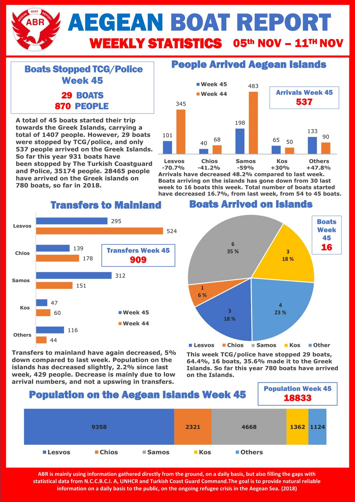
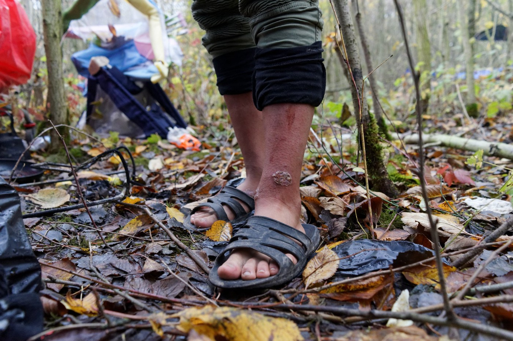
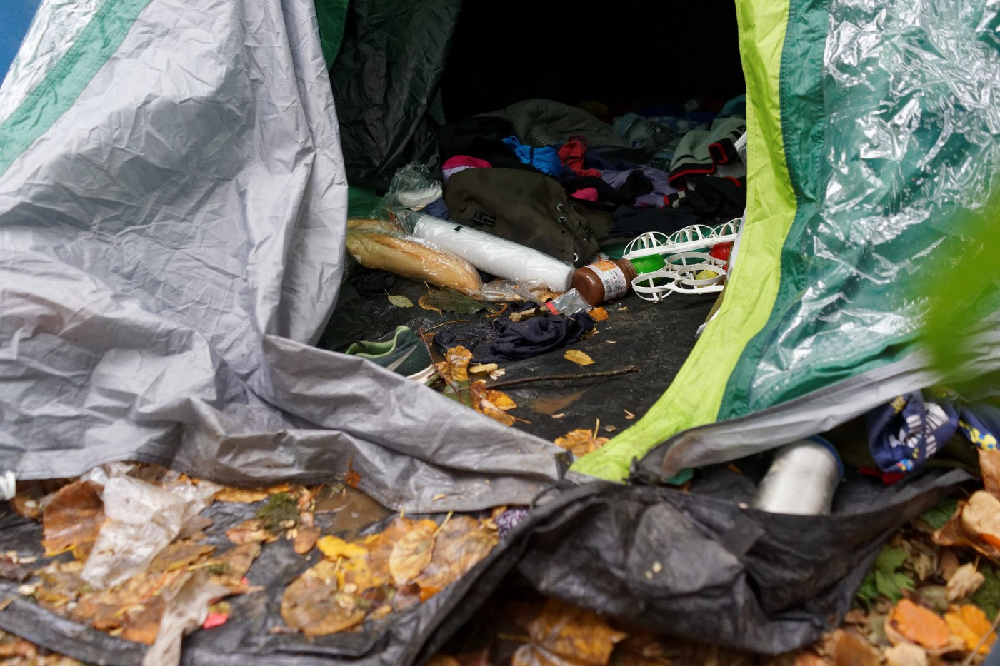
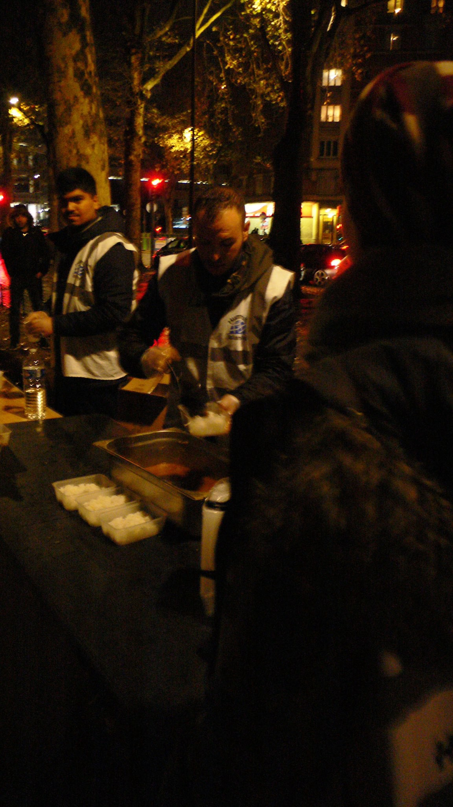
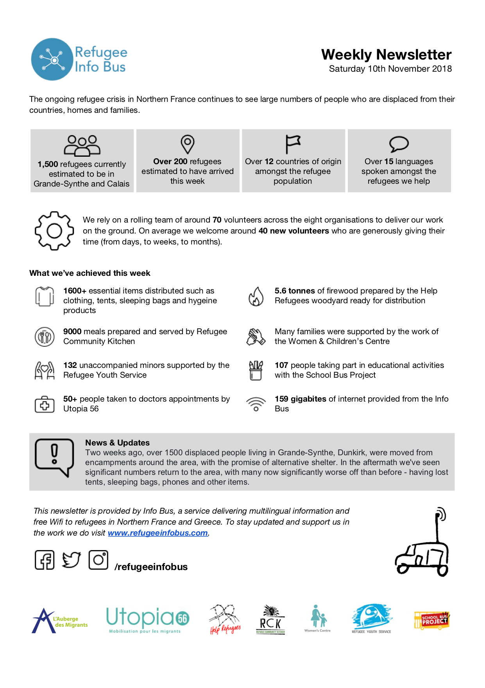
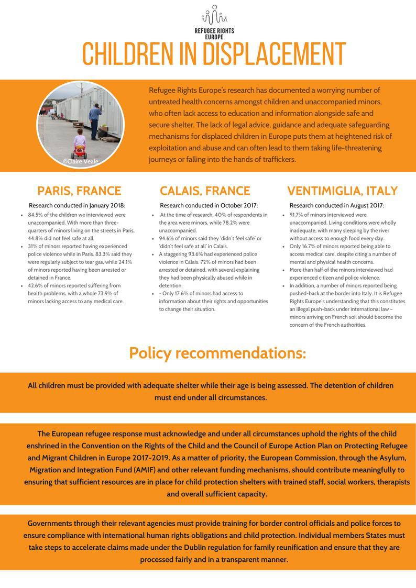

### AYS DAILY DIGEST 12/11/2018: Fortress Europe has taken more lives

_Boat sinks on the way from Turkey to Lesvos // The situation for Eritreans in Libya is not getting better // Frontex in Albania // Desperate situation in Paris for hundreds of people sleeping in the streets // Weather forecast for the Balkans and Paris_

](assets/8f901edb00fd/1*aAqU0ipvBeWwtRJIJPHZbw.jpeg)

Photo by [Médecins du Monde Hauts\-de\-France](https://www.facebook.com/M%C3%A9decins-du-Monde-Hauts-de-France-850170168369696/?__tn__=%2CdkCH-R-R&eid=ARATnO9g457-PrWm86sSKMKxAI8_ReXoFvLcUuz5XdzyoMzdob-XLpRDAd76AlG3JeCqjEbqJ2MoQHsu&hc_ref=ARSf32UayjlFSd3onCEC5VtHam-leGuBeqp317Gbz7RjFPfOg1kypc_dvdqf1zu205M&fref=nf)
### Feature

At least four people died and six are still considered missing after a boat sank outside Dikili, Turkey on Monday morning\. Two people from the boat managed to swim to shore to seek help\.

According to the [Aegean Boat Report](https://www.facebook.com/AegeanBoatReport/videos/739385149727803/?__xts__%5B0%5D=68.ARDREEHlXpOTWsSmcyO728cDATGpVXgObllrq0Xgb5TscUJt2l-6moXdhT-ONak4UGB-6rRQJupxXL4EZcVcT4D5MZGmyCMNzohe2CYux6BAniG1w3JTU-wZ4w0G9fPna8dFDJJGP-daREb0L9IHvkE8S7jWRs0xGO16ufitW3QONm1R1v90IqMIZZooSqI4Gc75iFZhhWFlSXbfvjwSsYUwQ2ol9bxSdWmxPKplZaRWitXLEpwRBK_gwjkfXa2ZiLDdVVGjedNnDg1K1HaqaAbes018C-SJrKR_WSpDValsTuWXo_B4OKE1TPUGQxNxhH9yMK1SWPaiIE2xYi2RsPjI8Iumg621&__tn__=-R) , the boat was reported to carry 15 people and was heading towards Lesvos\.

[Turkish media](https://m.haberler.com/dikili-de-2-gocmen-kurtarildi-4-unun-cansiz-11428965-haberi/?fbclid=IwAR2nUbSemWBuS6WNJ8hPzJdLcFS5V_C0kkPQzB6UF8KkHQoX9CWO6e-j2xU) are reporting that the state coast guard recovered four bodies\.

Amongst the passengers were four children\.

Apparently, all but one person, who is from Iran, are from Afghanistan\.
### Libya

Despite media reports and alerts by human rights activists, the situation for people in Al Furhaji Sebha is not getting any better\.

Hundreds of people, mostly from Eritrea, are being kept for days in this center, with no food\. Apparently, the police is denying access to IOM/UNHCR\.

[**Giulia Tranchina**](https://www.facebook.com/rastajuly?__tn__=%2CdlCH-R-R&eid=ARBh7KivUo7aV2S9z_vCduKQn3bmiaU_Td63K6g3p87BxigAChvC9Q80lc2viu3mpoqZ9tb2kHfmtb8w&hc_ref=ARSyTnQzlsGA575zSj1MuyzSkGX7RfT3xdVWoinYy5OPycdPN0yzq2bb2SEWo_jU7m0&hc_location=group) , an activist who is tying to alarm the public about this situation, reports that the police have also built “a very rough prison site next to the centre and told the people they would be moved there and locked up without seeing the light again\. These refugees, including 56 minors, are all registered with UNHCR, which should take steps to protect them\. They are being starved, held incommunicado and abused\. This group needs to be fed and evacuated as a top priority\.”
### Greece

People are still arriving over the land border, from Turkey to Greece\. They are forced to stay in Langadikia camp, Northern Greece, where conditions are dire, especially with the dropping of temperatures\.

[Action for Women](https://www.facebook.com/actionforwomenCH/?ref=gs&__tn__=%2CdKH-R-R&eid=ARBd3kCVFVcaISePIzVgOJhWRdNQAPPRkI9GarqAaATo7xapGd5RIMfe0O0WU8kHza_KkMIo7Isk3swe&fref=gs&dti=998272446971719&hc_location=group) needs long term volunteers in Chios and Athens\.

Their projects in Chios and Athens have been powered entirely by dedicated and passionate all\-women volunteers — from all walks of life\. They require a minimum stay of at least 30 days \(Chios\) and 60 days \(Athens\) — and are ideally seeking female volunteers with the following skill sets:

1\. Arabic/Farsi/French/Pashto/Dari/Sorani/Kurmanji speakers with at least B2 in English — you must be confident enough to translate for legal / medical sessions; 
2\. experience in gender based violence/trauma/ psychology; 
3\. For Athens: teachers with classroom experience \(minimum TEFL qualification or equivalent\) \.

Or if you are interested in volunteering with them, please write to their Volunteer Coordinator, Tesnim \(tesnim@actionforwomen\.ch\), introduce yourself briefly and send her your available dates \(min 30 days\) and CV\.
### Albania

Last month, the [EU signed an agreement](http://europa.eu/rapid/press-release_IP-18-6004_en.htm?fbclid=IwAR1XdWj4Ohy9muZWtnrGZR00wcLT6pdw7FptBO0sY46Ovd1d1K0sRMZMbP8) on border management cooperation with Albania\. Under the agreement, the Frontex agency will be able to take action at the external borders, under the control of Albanian authorities\. It is the first agreement of this kind between the EU and a third country\.
### France

Update from Grand Synthe by [Médecins du Monde Hauts\-de\-France](https://www.facebook.com/M%C3%A9decins-du-Monde-Hauts-de-France-850170168369696/?__tn__=%2CdkCH-R-R&eid=ARATnO9g457-PrWm86sSKMKxAI8_ReXoFvLcUuz5XdzyoMzdob-XLpRDAd76AlG3JeCqjEbqJ2MoQHsu&hc_ref=ARSf32UayjlFSd3onCEC5VtHam-leGuBeqp317Gbz7RjFPfOg1kypc_dvdqf1zu205M&fref=nf)

[Solidarité migrants Wilson](https://www.facebook.com/Solidarit%C3%A9-migrants-Wilson-598228360377940/?__tn__=%2CdkCH-R-R&eid=ARDrmUC64m3mvlu_Q-FxHrd1ROSo6LdPcd85lLFmPfZjL0-uc_gW73KcYYsPhoGTrPomK1eebA7P8G1W&hc_ref=ARTnVEAHawnyLQZ5e92FHKjjZIcw_2KsSrbjJbCnC025lQ8D6Cx9yHVttxUe0JHs5Ro&fref=nf)

“A sad and desperate Sunday night in the north of Paris\. But people are there to help people\. Stronger than states and the international organizations who should be doing this\.

So there were this Sunday night in this north of Paris over 1,200 people \(including women and children\) who will spend the night in unworthy and inhuman conditions\! Because the public authorities are failing inm their duty of humanity\! And don’t do their job…”

A newsletter about Calais & Dunkirk from [Refugee Info Bus حافلة المعلومات للاجئين مسیر راهنمای پناهندگان](https://www.facebook.com/RefugeeInfoBus/?fref=gc&dti=1652972374920129&hc_location=ufi)

[Refugee Community Kitchen](https://www.facebook.com/refugeeCkitchen/?__tn__=%2CdkCH-R-R&eid=ARB16ekjHUiAmxHKX4WPYhxtf-szdCbctPsadKmRZBCacJ23B81dHyRrZ9nHrtGC3210prnlVr2McN1X&hc_ref=ARQgkdLTHUbpPzo_xY56zVMER6QOYKJcmSKbp9hiS_148vWrdzTeRHQoOl5TnWbNWhI&hc_location=group) is in [Dunkirk, France](https://www.facebook.com/pages/Dunkirk-France/110338382322811?__tn__=%2CdkCH-R-R&eid=ARCA6Pdu9bd-9zG3UkV1KvNSMJ-NqIAN-nA2_OBRIU8Bkk7-YIHUqdq76mV1D1yk-lVxa0jZaqs6zjC0&hc_ref=ARQgkdLTHUbpPzo_xY56zVMER6QOYKJcmSKbp9hiS_148vWrdzTeRHQoOl5TnWbNWhI&fref=tag&hc_location=group) \.

They are currently providing an estimated 1,500 people with hot, wholesome meals in Calais and Dunkirk\. This requires a huge amount of food and work\!

Donate what you can so that we can continue providing food without judgement\. \-> [bit\.ly/rckdonate](https://bit.ly/rckdonate?fbclid=IwAR0llAh6T95EL_cvYNLjr_QbtoUTuFDGutRmWBaUq0aK3TzPd2B7vuw6l6I)

Volunteers needed\!

Hello\! [Sciences Po Refugee Help](https://www.facebook.com/sciencesporefugeehelp/?__tn__=%2CdKH-R-R&eid=ARAeXpDFS6itwKa6gLWiHp9g9zp1hee2YLOwmGVJ4_D23QJfSdSD4MVyp5j-P0YJmptIy44E7Vx2ba1Y&fref=mentions) is organizing a collection event at Decathlon on November 24th\. We need help to make sure we’ll have enough volunteers for all the shifts\.

If you want to participate, you can suscribe in the [doodle](https://doodle.com/poll/cww7zrutx2q9kbzr) :

 is also distributing help in Paris\.](assets/8f901edb00fd/1*6KIcIykjPogk4XMHzd0Y2A.jpeg)

[SAJE soutien et accompagnement des jeunes en exil](https://www.facebook.com/lesajeparis/?__tn__=%2CdkCH-R-R&eid=ARCJOUH7wOWh5JSfFncOPW5E-Cu45vGYOp78FRvz56CeGv2Ez5tO2Bj84Jn8ZiSh4upD4JTA4x27J3CA&hc_ref=ARRLfpYpvHZzRPcwFcFrPS8dzvXQj9nvwXdWhhYG28szmVxADFQbTt4AFzKRwx3ih2o) is also distributing help in Paris\.
### Europe

[Refugee Rights Europe](https://www.facebook.com/RefugeeRightsEurope/?__tn__=%2CdkCH-R-R&eid=ARD3bn84bjHCBSL90oKGgrv51ZA4xUjlGPRZu2p5EoDVJL-4wyubg0qB8Qt0KxCG91lRxtO3dU4GDLKS&hc_ref=ARToh0sUMoCdEgzRG8Xau9M9ZoF276PAIVmXQpACFLpqZIDNsoyczejjuwhseB_qfFQ&fref=nf&hc_location=group) research has documented a worrying number of untreated health concerns amongst children and unaccompanied minors, who often lack access to education and information alongside safe and secure shelter\.

The lack of legal advice, guidance and adequate safeguarding mechanisms for displaced children in Europe puts them at heightened risk of exploitation and abuse and can often lead to them taking life\-threatening journeys or falling into the hands of traffickers\.

Find out more here: [http://refugeerights\.org\.uk/…/Children\-in\-Displacement\-2\.pdf](http://refugeerights.org.uk/wp-content/uploads/2018/07/Children-in-Displacement-2.pdf?fbclid=IwAR1VQ_bB-QXvC_GnuOQyhmdgXhHjcKTEKD2lO_K8kHncX6ZakkgPspR7xNo)
### WEATHER REPORT

As winter is approaching, we will start publishing weather reports\.

In Paris it is rainy these days\. People who are outdoors often still wear flip flops and have no tents\. They sleep on the bare ground with just a blanket\. Volunteers are reporting that too many peope are not even able to sleep in this cold, and some are saying that they are just going to stand under a bridge all night long\.

Winter has just begun and it already feels so desperate, so unfair, so outrageous and so hard for all these souls having to sleep on the streets\.

The situation is similar in the Balkans\. People are left without badly needed care in Albania, Montenegro, and Bosnia and Herzegovina\. Additionally, hundreds are in overcrowded camps in Greece, but also in the streets of big cities\.

In Greece, last week temperatures reached up to 26 and 27 degrees Celsius, but this week, temperatures are forecast to dramatically drop and bring “early winter\.”

According to meteorologists, temperatures are expected to drop by 6 to 8 degrees Celsius as of Thursday night, November 15, 2018\.

By Sunday, November 18, the average temperature is expected to be at 14°C, from 15°\-20° C today Monday\. In the week to follow, cold weather will be settled for good\.

The second half of November will be characterized by low temperatures, rainfall and snow — initially in the mountainous areas and later also in semi\-mountainous areas\.

In Montenegro it will be predominantly sunny with weak winds blowing from changing directions\. The morning temperatures will range between \-2 and 12 and during the day between 9 and 23 degrees\.

SERBIA

From time to time cloudy and a little bit colder, locally there will be rain and showers with thunder, in the western mountains it will snow\. The winds will be weak to moderate blowing from the west, while in the east and in the mountains it will be strong in places\. The lowest temperatures will be from 6 to 10 and the highest from 14 to 19 degrees\.

BiH
 
 On Tuesday it will be sunny with currents of fog during the morning in the basins and along the river courses\. In the evening will become cloudy\. The morning temperatures will be from 3 to 14, and daily from 16 to 22 degrees\.

CROATIA

In Croatia it will be partly sunny and a bit cloudy, still a little bit warm for the time of year\. In the northern Adriatic and Gorski Kotar it will be more cloudy with a chance of rain\. In the morning locally foggy\. The wind will be weak to moderate, blowing from the southeast and southwest, and towards the end of the day in the north there will be northern winds\. Along the coast in the morning the Bura will be blowing and in the afternoon a moderate northwestern wind\. The lowest morning temperature will be between 4 and 9, along the coast from 10 to 15, and the highest daily temperature will be between 15 and 20 degrees\.

**We strive to echo correct news from the ground through collaboration and fairness\.**

**Every effort has been made to credit organizations and individuals with regard to the supply of information, video, and photo material \(in cases where the source wanted to be accredited\) \. Please notify us regarding corrections\.**

**If there’s anything you want to share or comment, contact us through Facebook or write to: areyousyrious@gmail\.com**

_Converted [Medium Post](https://medium.com/are-you-syrious/ays-daily-digest-12-11-2018-fortress-europe-has-taken-more-lives-8f901edb00fd) by [ZMediumToMarkdown](https://github.com/ZhgChgLi/ZMediumToMarkdown)._
