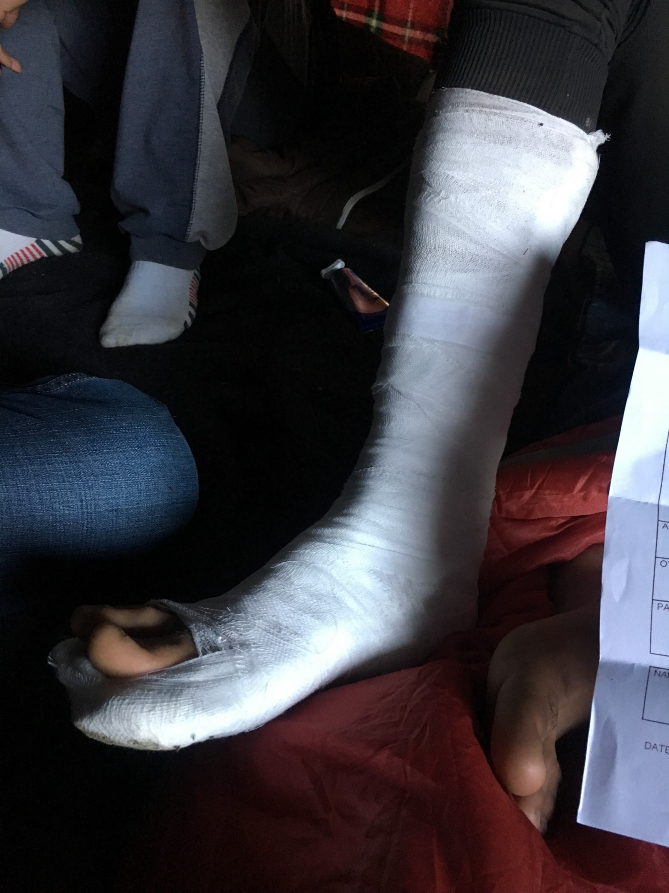

### AYS SPECIAL: **Witnessing a pushback**

_The Croatian authorities have been successfully denying the allegations of police violence and point to a lack of evidence corroborating these stories\. Although hundreds of testimonies have been collected from victims of violent pushbacks at the hands of the Croatian border police so far, secondary witnesses remain quite rare and the denial of these crimes persists\. AYS and NNK obtain more proof, a video filmed during and immediately after the push back, and the story of people who survived\._

Camp Trnovi, Velika Kladuša\.

Croatian border police damage and steal the phones of those being attacked to ensure that no violence can be captured on camera and no evidence is collected\. Most push\-backs happen at night, along sparsely populated sections of the Croatian\-Bosnian border, so this violence is not witnessed\. In this way, audio and visual recordings are elusive\. Due to the clandestine nature of these crimes a warped sense of erasure persists for victims of border violence\.

This changed last week after an unaccompanied minor from Syria returned to Velika Kladuša with a video recording of a push\-back in action\.

NNK and AYS got this video\. We could hear the screams of people who are being beaten up, people calling each other after they got lost in the dark, and could see the people who are arriving to the safe place, greeting each other\.

Khalid \(name changed to protect anonymity\), had left some days prior with a group of four other people with the intention of crossing the Croatian border and continuing towards Italy\. Unintentionally, he stumbled upon the violent push\-back of two groups of men which he proceeded to document, step\-by\-step, on his smartphone\.

Upon returning, he sat down with a No Name Kitchen volunteer and explained what he’d seen:

_“We go someplace, down the mountain, we can’t see anything and someone tells us that we have to go back\. Like go up the mountain to see\. We were waiting and saw a \[police\] car go and come back, go and come back\. For one hour we were stay, no move…\. It called a second car, they meet each other and there is a woman\. Police Croatia\. This car is go and come back and some police car is called the other car to come back\. This car comes back and they meet each other and there is some people inside the other car\._

_They open the car, go out one by one\. Just one and close the door, they beat him so much, after, leave him\. And second, out, one by one, one and close the door, not the whole group, one by one\. Twelve people in the car\. There is a third car that is come, four people from Algeria is inside\. Same thing, one and close the car, beat, beat, beat, beat, so hard\. And leave him\._

_They open the gun and take it in the air to make them scared”_ \(Khalid, Syria\) \.

The cries of the men being beaten stuck with Khalid\. In his own words:

_“In my life, I have never heard a voice so mad, they screamed like this\. In my life”_ \(Khalid, Syria\) \.

A No Name Kitchen volunteer later spoke to one of the men from the second group of people pushed back who echoed the same point’s from Khalid’s story:

_“\[They\] take the first one, \[I was\] the first one, and then close the door\. And they start the beating\. Beat you and beat you”_ \(Ahmed, Algeria\) \.

After watching these beatings, Khalid’s group waited for the police to leave before calling out to the injured men\. Thereafter, they washed out the men’s wound with water and provided them with food\. From there, they walked back to the relative safety of Velika Kladuša

Khalid later described the terror he felt witnessing this event and reflecting on his own status as a refugee pursuing asylum in Europe:

_“\[I felt\] very scared\. Too many police, and disappoint, and morale down, and we can’t cross the border…It’s too many police…and it’s beating so much and make too many people bleeding\. It’s not simple beat\. It’s like some people had destroyed heads”_ \(Khalid, Syria\) \.

**_Why the European Union does not take any action?_**

What happened to this group is an almost daily occurrence at the border area\. After the violence, the people who are victims have no other place to go but to the makeshift camp in Kladuša\.

Sprawled across a mud field of plastic tents and rubbish stands is the Trnovi camp in north\-western Bosnia\. Situated by Velika Kladuša, a small city which straddles the Croatian border, this camp is home for around 400 people on the move who temporarily settled there while trying to transit through Bosnia towards Western Europe\. Around 200 more reside in squats around the town\.

Four men from Pakistan recently arrived back from another [game](ays-special-from-bosnia-the-game-5a56eb2e9a6e) ; another attempt to cross the Bosnian\-Croatian border and get closer to their dream of a safe life in Europe\. They are exhausted, covering their injuries with a bandage after another violent push\-back to Bosnia by the Croatian border patrols\.

Like hundreds of other victims of border violence, which our team at No Name Kitchen has interviewed over the last six months, this group of men was willing to share with us their story in the hopes of raising awareness about the brutality of the EU’s external borders:

_“Yesterday, we got caught on the Slovenian\-Croatian border\. Croatian police caught us and started beating us, kicking us, punching us\. They were making fun of us, laughing at us\. I am completely confused about why they were beating us\. I understand that we are illegal, we are refugees, we are using their borders, and their land\. But we don’t want to hurt anyone\. I don’t know why they are beating us\._

_Why the European Union does not take any action? Why are they allowing them to beat us? This is history that the whole world is witnessing\. Refugees have been fleeing their countries for a long time, that is not a big deal\. We are facing problems in our country, we cannot stay and wait for our death there”_ \(Ferdous\*, Pakistan\) \.

Dozens of injured and tired people come back from the Croatian border to Velika Kladuša each day\. People who are asking for their right to claim asylum in the EU land are not only beaten but also have all of their possessions taken; money, mobile phones, and passports\. They come back to the precarious life in the field camp with nothing, confused and disappointed about human rights in Europe\.

Still, many leave the next day to try another game\. While the winter is approaching, they worry that if they do not reach sanctuary in Europe now, they will get stranded in Bosnia under plastic sheet shelters and inside of abandoned houses, in minus zero temperatures, for the entire winter\. The Croatian border authorities react with even more systematic and extreme violent practices to the increasing attempts to cross\.

During the last few weeks, several groups who returned to Bosnia, reported that instead of “just” being beaten and pushed back, they experienced extensive torture perpetrated by the special Croatian border forces clad in black clothes and balaclava masks\. \( [See report about push back for October\)](illegal-push-backs-and-border-violence-report-e5741e95f835)

After being caught in Croatia, people are contained for hours in fast\-driven vans with lack of oxygen which causes many to vomit\. When they arrive at remote border areas late at night, the police open the van door and point torches into their eyes to make the people blind\. Then, one by one, the officers take them outside and tell them to run through a forest where they have set up “traps”; ropes which people trip over\.

Others report water deliberately dumped on the road from barrels, designed to make individuals slip and fall\. Once a person falls, officers physically attack the individual with batons, kick and punch the body, head, and face\.

We have been told that some of the physical attacks take several minutes, until the person’s bones are broken or their face bleeds\. In the end, many are pushed down a hill or into a river while being shouted at to go run back to Bosnia and being threatened by gun shots in the air\. People then try to walk with broken legs, arms, and open wounds back to the makeshift camp, where they often struggle to find adequate medical care\.

**Brutal border deterrence is against the law**

The brutal practices of the Croatian police are against international laws and directives\. Firstly, the beating and deportation of all people on the move, both irregular migrants and asylum seekers, is against the prohibition of collective expulsion \(Article 4 Protocol 4 ECHR\* \* \), and the absolute prohibition of torture and non\-humane or degrading treatment or punishment \(Article 3 ECHR\* \* \) \.

Secondly, according to the EU Directive on Asylum Procedures \(2005/85/EC\), all people on the move are entitled to information about asylum, translation assistance, the ability to present their case to a competent authority, notification of the outcome, and the right to appeal a negative decision \(1\) \. But most importantly, viewing people searching safety as mere illegal numbers and dangerous bodies pushes them to a grey zone\. Within this grey zone, they are stripped of the right to have rights, resulting in their humiliation without legal consequence, leaving perpetrators unrecognisable and unpunished\.

Thousands of lives are being slowly destroyed while the EU community has been silently overlooking violent push\-backs and denying any responsibility:

_“This is shame for the Croatian Government, this is not a professional action to hit refugees, beating them to their mouth, eyes, hands, breaking our mobile phones\. We are shocked why no one is taking action against the Croatian police who is taking our money, beating all of us; men, women, children and old people\. They don’t care, they just beat and push back everyone because we are illegal people\. This is illegal, and the European Union should take an action against the Croatian police”_ \(Ferdous, Pakistan\) _\._

**Violent consequences of the violent borders**

Pushing those asking for asylum from the borders has been framed by the perpetrators of these acts as a mean of protecting EU inner citizens from dangerous “terrorists” and “criminals”\. However, the closure of the borders and the denial of legal pathways push people to irregular practices of transit and a reliance on human smugglers\. Moreover, it increases the likelihood of other violent behavioural patterns\.

Several men from Syria pointed out to us that they refuse to be again brutally attacked at the border while fleeing the war conflict\. For this reason, they are considering returning to their homeland, where they have no other option of survival than to join army service for 8 years and become part of the violent governmental programmes:

_“Croatia \[treats\] me like I am dangerous, but I am not dangerous\. But if I go back to Syria, I will have to join Assad’s army and yes, I will be made dangerous”_ \(Abdula, Syria\) \.

The border crossing game is no longer only a matter of violence and criminalisation of people, but also a question of life and death\. One week ago, a young man from Iraq reported to us that their older friend died of a heart attack while crossing the mountains in Croatia\. A few days later, another group from Iraq, including one family with two small children, told us that he saw a man drowned while trying to cross a river inside of Croatia:

_“The water took him\. When we were caught by the Croatian police, I told them that this Syrian man died in the forest\. They only said that this was not their problem but our problem”_ \(Majid, Iraq\) \.

For this reason, we have to ask here again: what is more dangerous? People fleeing poverty and conflict, or a continentally militarised border? This question faces us daily while seeing the crying eyes and open wounds of people coming back from the border, hearing screams and gun shooting from the border, and seeing the lights of a helicopter surveilling the border space above the camp in Velika Kladuša\.

> **REFERENCES AND NOTES** 

> \*All names have been changed to secure anonymity of those providing the testimonies of police brutality\. 

> \* \*European Convention on Human Rights 

> \(1\) _Vaughan\-Williams, N\. \(2015\) Europe’s Border Crisis, Oxford: Oxford University Press\._ 

**_\(Report by Karolina Augustova and Jack Sapoch, volunteers with NNK in Velika Kladuša\. Additional report by N\.N\. leaving in the camp in Kladuša, Are You Syrious? and friend from Gipsy Coke collective\)_**

See also: [Report for September](ays-special-eu-border-violence-update-from-bosnian-croatian-border-fro-september-3f2a6227d383) , [July](illegal-push-backs-and-border-violence-reports-velika-kladuša-bosnia-and-hercegovina-july-2018-da04fe8784de) ,

[Report on border violence agains women](ays-special-from-bosnia-violent-push-backs-of-women-from-croatia-and-slovenia-aa4c8b5c9e6d) \.

[Special report by AYS from Bihac](ays-special-from-bihać-and-velika-kladuša-games-of-batons-c64c5e99e02b) \.

You can find more in our Specials section on AYS Medium\.

**We strive to echo correct news from the ground through collaboration and fairness\.**

**Every effort has been made to credit organizations and individuals with regard to the supply of information, video, and photo material \(in cases where the source wanted to be accredited\) \. Please notify us regarding corrections\.**

**If there’s anything you want to share or comment, contact us through Facebook or write to: areyousyrious@gmail\.com**

_Converted [Medium Post](https://medium.com/are-you-syrious/ays-special-witnessing-a-pushback-c52523048b2f) by [ZMediumToMarkdown](https://github.com/ZhgChgLi/ZMediumToMarkdown)._
