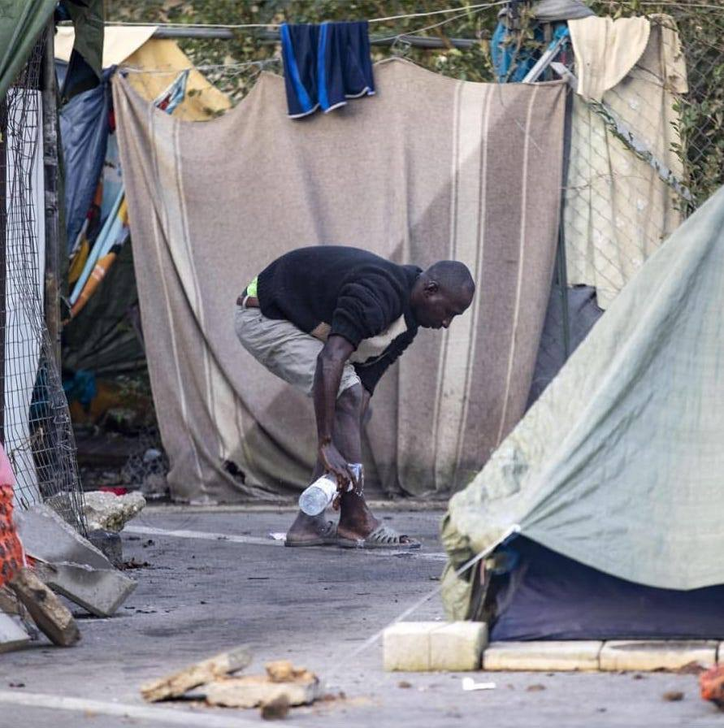
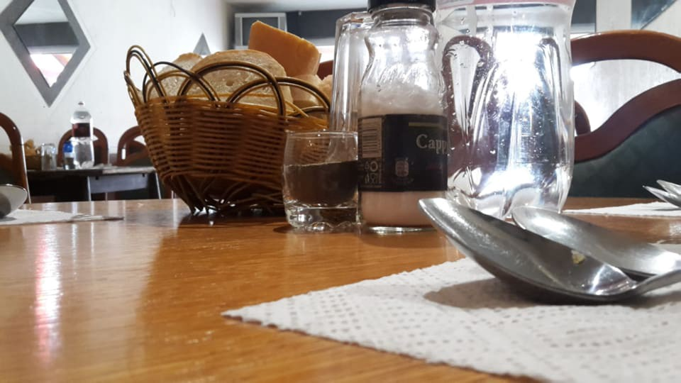
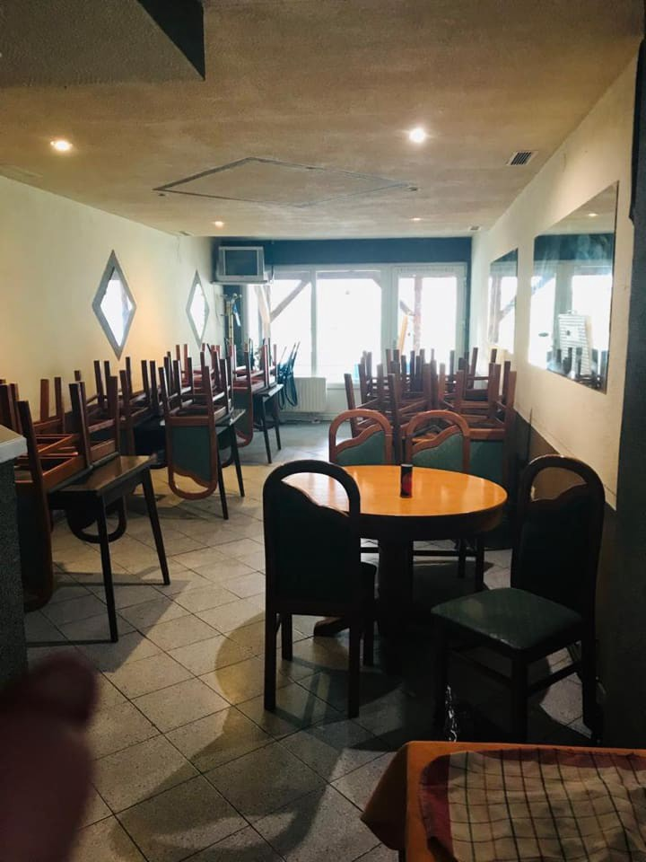

### AYS Daily Digest 13/11/18: Evictions, deportations and testimonies of violence and abuse

_No trace of EU money in Turkey // beaten and robbed of all their belongings by Greek police, and being then forced to return to Turkey over the Evros border // New special: [Violent Robberies and Deportations of Refugees in Evros Region](ays-special-violent-robberies-and-deportations-of-refugees-in-greeces-evros-region-2056ba6195b0) // SAR teams need support // Help keep the Kladuša kitchen running // Volunteer reports and a special story: [Witnessing a pushback](ays-special-witnessing-a-pushback-c52523048b2f) // more news from the field_

](assets/f45aac16759b/1*r_Z2bqQbUrlFwgcaV1xvQA.jpeg)

Photo: [Refugee\.Info\.Italy](https://www.facebook.com/Refugee.Info.Italy/?tn-str=k%2AF)
#### FEATURE

On Tuesday morning, following the recent decisions made by their minister, the Italian police evicted around 150 people who had been staying at the [Baobab Experience](https://www.facebook.com/BaobabExperience/?__tn__=%2CdKH-R-R&eid=ARAOylSScfUPWz91lFPeF44mVDE7Y-JBHXQYAunkbrUf2ZiLapIidOO4O-WyQKOGbitJ6HyRXIU4aDYL&fref=mentions) in Rome, as was announced and feared\.

> Salvini tweeted: “Free zones are no longer tolerated — we promised it, we are doing it…” 

The Baobab team dealt with authorities and organized aid for those who were lodged in an informal volunteer\-run camp near Tiburtina station for a long time\. Providing assistance, food and shelter to some of the most vulnerable people, they were the sole refuge to all the people who remained outside of the official Italian reception system and programs such as SPRAR\. Since opening in 2015 it has helped almost 80,000 people\.
Reportedly, the recent residents were under humanitarian protection, but had been unable to use the SPRAR centers as a result of the Salvini Decree, [Refugee\.Info\.Italy](https://www.facebook.com/Refugee.Info.Italy/?__tn__=%2CdkCH-R-R&eid=ARA0LVscOlwjcY8BkXEAuonUf3V73ZTmgBAfohec9VOrRls9Hb_fwcdI0zUXI_gHUlDV4kEoiO6wytf7&hc_ref=ARRlRZQq4e5yu5oj8bffPE7Tj4hFqOl2C8XUmaAQRlagpXk_6Mc1j6l9NUaaQidmkvc&fref=nf) and mainstream media mention\.
After the eviction, about 120 people were taken to an immigration office\.

> “Hundreds of people will end up on the street\. We hope that the city council takes action\.” — Andrea Costa, the Baobab Experience Coordinator 

However, according to UNHCR and IOM, in the first 9 months of 2018, Italy has received just over 21,000 migrants by land, a figure that has fallen by almost 90% compared to the same period in 2017\.

The 2018 [Dossier Statistico Immigrazione](http://www.dossierimmigrazione.it/) collects all the data necessary to understand the migratory phenomenon towards and from Italy\. The dossier shows that with the number of foreigners living in Italy remaining largely stable, around 5 million since 2013, there is no “invasion” of foreigners in progress\. 826,000 foreigners enrolled in the 2016/2017 school year, about one tenth \(9\.4%\) of the total school population\.

After becoming naturalized, foreigners increasingly end up relocating abroad \(25,000 between 2012 and 2016, with an average age of around 25 and almost half born in Italy\), especially within the EU \(19,000, 75\.6% of the total\), thanks to the free movement guaranteed by Italian citizenship\.

The so\-called “second generation“ is the fastest growing number\. They recognize Italian as their mother tongue, live with and like Italian peers and feel like they are all nationals, sharing everything with them except — citizenship\.

](assets/f45aac16759b/1*3nRLyViT1AOSp2P7Ptbvrg.jpeg)

Photos: [Refugee\.Info\.Italy](https://www.facebook.com/Refugee.Info.Italy/?tn-str=k%2AF)
#### LIBYA

MSF reports on the latest situation regarding Libya:

> The level of desperation is reaching a new low among refugees and migrants pushed back to Libya by EU policies\. 93 shipwreck survivors returned to Libyan shores by a cargo ship on Saturday are refusing to disembark in [M](https://twitter.com/hashtag/Misrata?src=hash) israta port\. 
 

> MSF medical teams were granted access by the Libyan coast guard to ensure medical care to all those in need\. 30 consultations were carried out on the boat\. Countries of origin of survivors include Sudan, Somalia, Bangladesh and Eritrea\.
 

> Urgent solutions must be found to prevent use of violence in the current deadlock\. Safe and legal ways to leave Libya and seek asylum and dedicated resumption of search and rescue in Central Mediterranean are desperately needed\. 

#### TURKEY
### EU not sure where the money went

Following a [report by the European Court of Auditors](https://www.eca.europa.eu/en/Pages/DocItem.aspx?did=47552) , a spending watchdog based in Luxembourg, on how EU funds in Turkey were spent to help Syrian refugees, the chief auditor has reported to the media that the EU is unable to verify with certainty how over €1bn of European taxpayer money was spent on Syrian refugees in Turkey because of Ankara’s data protection laws\.
They wanted to compare Turkey’s registration list of refugees with the list of refugees getting EU cash but were refused access by Turkey’s ministry of family and social policies, who cited Turkey’s data protection laws\.

Among the fraudulent activities, the auditors cite cases where the interest generated on the money at the banks was handed over to the implementing partners\. It means the interest is not going to help the refugees nor being returned to the EU taxpayer, [EU Observer](https://euobserver.com/migration/143364?fbclid=IwAR1e7GfwGvy1yyNroOrqcEErU5gy13td1fr83Wfnai4EB7a2iebHA1wKzNU) wrote on the Monday report\.

They also pointed out that the UN had charged a €64m administrative fee to roll out the two programmes, described by the auditors as “quite a substantial amount of money for just administration\.”
### Beaten, robbed and stripped

According to [pro\-government source](http://m.milliyet.com.tr/gocmenleri-dovup-ciplak-halde-gundem-2777208/?fbclid=IwAR2RPufczrHS5MjVtygkHIeCGLA9pL1smJ6L6R3K7JFRa4PREL_RtJfCimI) Milliyet, residents of an Edirne village found a group of Palestinian and Yemeni refugees wandering through fields wearing no clothes and bearing multiple signs of physical abuse\. The men reported being beaten and robbed of all their belongings by Greek police, and being then forced to return to Turkey over the Evros border\. They were reportedly brought to the village cafe, fed and clothed by the villagers, and turned over to the local gendarmerie\.
#### GREECE
### Islands

In October, 16 boats carrying 437 people arrived on the Greek islands \(among them 121 children, 23 of whom were travelling alone\), [Help Refugees](https://www.facebook.com/HelpRefugeesUK/?__tn__=%2CdkCH-R-R&eid=ARBf-0fP73vlS50o1nLJB2wCDYs3gMjgjd6qwrsLjsZvkp1T7E34n6vOU7Qhb_v3bf4KNCB2i-jGuiiQ&hc_ref=ARRjsGqvyDZsjdqhoe4f7QpW2hR8KycAyZwsS86lVCQzydNaxPRJ8e9g-KTcc3nfXH8&fref=nf) and other groups report, calling for help to teams on the islands\.
[“Refugee Rescue / ‘Mo Chara’](https://www.facebook.com/RefugeeRescueUK/?__tn__=%2CdKH-R-R&eid=ARCOtRwm23tMIAF213sgUAT2VJdh3kDydUuj0Un44SD8wOpq7VEK15bR_59yF2o_XU5NaWH7nEho9q-y&fref=mentions) have the rescue boat on the north shore of Lesvos\. As the winter begins, refugees are continuing to arrive\. Please [donate to help](https://donate.helprefugees.org/campaigns/donate) this life\-saving work continue\.”

[Chios Eastern Shore Response Team — CESRT](https://www.facebook.com/chiosesrt/?__tn__=%2CdkCH-R-R&eid=ARAYDIrj3toZGciXV3uK0edH4V2VD7ecwXaVe8Tef4XLwcaoY4DEIpN3hNf_o7bLa9WG0ilcGPNUeCH8&hc_ref=ARTDKsN7y3m_TEAc6RFiidtwp11VZRrUEIc3swoSSoZN-0AHU4S7z89-edQ8pKwusNI&fref=nf) Language Centre is looking for 3 English teachers to join them at the beginning of December, for a minimum of 2 months\. If you have previous ESL classroom experience or a TEFL/CELTA certificate please send your CV to — chiosesrtlc@gmail\.com\.
### Evros

> When my 20 year old son arrived in Greece, instead of being able to claim asylum, he was arrested by police, he had with him our family’s savings, 7,000 euros, and his Syrian passport — all were stolen from him\. He so badly beaten — he was hospitalised for a week\. 

These are the words of a distraught Syrian father who has refugee status in Germany\. [Refugee Info Bus](https://www.facebook.com/RefugeeInfoBus/?ref=br_rs) has spoken with him on the phone and he told us also that he has been unable to do family reunion with his child\. His son is now alone, in an Istanbul hospital, without money, his phone, or any documents\.

Over the past six weeks, RIB have been in contact with eight groups who, at separate times over a six\-week period, have experienced extreme violence at the hands of officials working inside Greece’s Evros region — various military and civilian personnel including police and the army, but also international military representatives, from Germany and elsewhere in Europe, as part of the EU’s Frontex operation\. More on that in a special story on violence and deportations:

> Please, read our latest [AYS SPECIAL: Violent Robberies and Deportations of Refugees in Greece’s Evros Region](ays-special-violent-robberies-and-deportations-of-refugees-in-greeces-evros-region-2056ba6195b0) 

### Athens

■■■■■■■■■■■■■■ 
> **[RSA](https://twitter.com/rspaegean) @ Twitter Says:** 

> > Hazaras living in Greece protest in front of the afghan embassy in Athens against the genocide that takes place in Afghanistan . 
"Afghanistan is not safe", is their clear message. https://t.co/f6OnGmyfm4 

> **Tweeted at [2018-11-13 14:49:31](https://twitter.com/rspaegean/status/1062356792636817409).** 

■■■■■■■■■■■■■■ 

[Our House](https://www.facebook.com/ourhousegr/?__tn__=%2CdkCH-R-R&eid=ARDlUKmm2jzGaZORmcZBrl4UbPCXTC57JS4F9hSa2sO2R81YrCLErH6We7Lx1_GQcXo7DxDPunmLbBjC&hc_ref=ARS0XsUaknTx2Edb1uC7uigOQxyoO11eUzN5sdIfT4gK0gHUiCtkMzxdN3nYBBUFeW8) needs donations as the situation is getting worse in Athens and more people are being sent to the mainland\.
They are also calling for emergency help needed for a woman with two very small children on the streets\. “Even a hostel for a couple of nights until we can work out a longer term solution\.” — contact [Our House](https://www.facebook.com/ourhousegr/?__tn__=%2CdkCH-R-R&eid=ARDlUKmm2jzGaZORmcZBrl4UbPCXTC57JS4F9hSa2sO2R81YrCLErH6We7Lx1_GQcXo7DxDPunmLbBjC&hc_ref=ARS0XsUaknTx2Edb1uC7uigOQxyoO11eUzN5sdIfT4gK0gHUiCtkMzxdN3nYBBUFeW8) if you can help\!
#### BALKAN WEATHER FORECAST — Nov 14

**Montenegro** 
All sunny tomorrow in Montenegro, with a high of 21 degrees Celsius and a low of 5\. Winds to the southwest of around 6km/h\.

**Serbia** 
A high of 15 and a low of 6 tomorrow with no rain forecasted\. The weather will be partly sunny to overcast, with winds of up to 10km/h in Belgrade to the northwest and lighter winds in the south — around 3km/h to the southwest\.

**BiH** 
Velika Kladusa will experience a high of 14 and a low of 3 \(down to 2 in Bihac, and 0 in Sarajevo\), slight winds of 2km/h, party cloudy, no rain forecast for tomorrow\.

**Croatia** 
More mild weather\. No rain forecast\. High of 11 and a low of 3\. Partly sunny\.
#### BOSNIA AND HERZEGOVINA

A volunteer writes:

“\(…\)Yesterday the police decided to evacuate 50 boys, almost all of Syria, Palestine and Kurdistan from an old bus station in which they lived\. It wasn’t much, but at least there were walls, roof and floor\. At least we could bring you a stove for winter without fear of burning\.

A few hours later, the police also decided to go visit some friends who live on a property kindly loaned to them by the owner\. They take care of space and with some woods have built some beds, and have stoves to be hot and to cook\.

They were probably the only refugees for which we no longer had to worry about winter, in terms of people freezing, literally, by the cold or suffer some deadly diseases like pneumonia\. However, the police want them to go live to the shit field I’m always talking about\. He gave them an ultimatum\. For them it was, “as if we had a nuclear bomb on top”\. The violence displayed by the Croatian police when people are trying to escape the border, it’s worse than ever\. Many people are deported with fractured bones from the club hits\.

](assets/f45aac16759b/1*rfnwk4oYOdfkUoFtIZO7tw.jpeg)

Photo: [Барбарче Бекарес Кастањоска](https://www.facebook.com/cestacestero?__tn__=%2CdCH-R-R&eid=ARDlDgMKv1NpPRqhEVRh7FK-PPxVePWOVfwx3FYuEeEcatO02PtsF2wDXE99QsRN7nu5-OkuKp0E98T8&hc_ref=ARSnJR5j4wuTrhOng003CU7vSq6F_P8aBk41w9iEPepm0s--8Q0vylN2EyYj-46_mQs&fref=nf&hc_location=group)

IOM, one of the main organizations here \(in terms of money, not in terms of work\) keeps an official rhetoric that the same people are inventing those beatings and self\-inflict in order to blame the police, when in Petit Committee everyone recognizes that they know that it is the authorities who exercise this violence with the permission of Europe\.” — [Барбарче Бекарес Кастањоска](https://www.facebook.com/cestacestero?__tn__=%2CdCH-R-R&eid=ARDlDgMKv1NpPRqhEVRh7FK-PPxVePWOVfwx3FYuEeEcatO02PtsF2wDXE99QsRN7nu5-OkuKp0E98T8&hc_ref=ARSnJR5j4wuTrhOng003CU7vSq6F_P8aBk41w9iEPepm0s--8Q0vylN2EyYj-46_mQs&fref=nf&hc_location=group)

> Please read our latest [AYS SPECIAL: Witnessing a pushback](ays-special-witnessing-a-pushback-c52523048b2f) 

### Velika Kladuša kitchen running

Remaining open for people to freely enjoy a hot meal has become a challenge in Velika Kladuša’s restaurant, which has been feeding people for months with help of volunteer staff who cook\. The Dutch organization [Lemon Foundation](https://www.facebook.com/lemonfoundation/?__tn__=%2CdkCH-R-R&eid=ARBowMhfwdc5ljHMC83pAeXK0iyh-wRTrJWaop3_Q6OEN2nitGm0TEqPZD3KG0f7aGzy4hIc0XBKkk2L&hc_ref=ARQ17S_2yx-IT7qq6hI1ROc7IUBD9L4m6AqkYsV3WAhjEiO5JuTZf3cK_dhgYduZthw&fref=nf) helped recently with keeping it up and running for the next month, but the challenge remains\. They invite people to take part in collecting money to buy food etc\. and share their impressions:
“We’ve been back a few days now and can’t forget the people we left behind\. It is really great to be able to give the refugees and migrants a warm meal every day\. That is primarily due to people like Petra, Pixie and Asim\. They are the ones who do the purchasing every day, cleaning the vegetables and cooking the food\. 400 or 500 portions is a big job\. The bread is 1 day old but it’s nice and at the same time cheap\. \(…\)”

](assets/f45aac16759b/1*jf0dqrh22o3uYzfWSgT8eQ.jpeg)

Photos: [Lemon Foundation](https://www.facebook.com/lemonfoundation/?__tn__=%2CdkCH-R-R&eid=ARBowMhfwdc5ljHMC83pAeXK0iyh-wRTrJWaop3_Q6OEN2nitGm0TEqPZD3KG0f7aGzy4hIc0XBKkk2L&hc_ref=ARQ17S_2yx-IT7qq6hI1ROc7IUBD9L4m6AqkYsV3WAhjEiO5JuTZf3cK_dhgYduZthw&fref=nf)

On their Facebook page you can read what the menu of the day is\. And of course, we will continue publishing updates from the field here on AYS\.

[The Refugee Language Initiative](https://www.facebook.com/TheRefugeeLanguageInitiative/?__tn__=%2CdkCH-R-R&eid=ARCbDalKKGiz98qmhbOx3crbDkoa0ISI7f45OtSjzK_SRot6bymzeSo5uSEE3pB7WAoZW_z2F30sxeiv&hc_ref=ARRd4UBmz-CxpILwN5BUA1xowJwz8xqWgf6JxPv39yMC9C_CNjGO-bmddgcVre16y3A&fref=nf) is seeking a Volunteer Coordinator for Bosnia: “This volunteer role would be perfect for a resident of Bosnia and Herzegovina who is self\-motivated, friendly, IT literate and passionate about supporting the education of refugees\. The position will involve networking with local refugee support groups and aiding RLI volunteers during their stay in Bosnia\. You’ll also get to work alongside our amazing international team\!”
If interested, please send you CV to Emma, at ehammock@refugeelanguageinitiative\.org
#### FRANCE

![‘The boy crossing the bridge in the background used to read a lot\. The hole he’s crossing is a toilet, used by around 1200 people\. As you can see, it is full of trash\. It was a very bad place, but there was nowhere else for anyone to go\. The people living on either side of the ‘toilet’ made the bridge to stay in contact with one another\.’ — Photo by Abdul Saboor, a photographer living in Paris, who successfully claimed asylum after fleeing Afghanistan\. His exhibition ‘Exils’ is currently on show in Paris\. To find out more, visit [http://bit\.ly/2TcvaoO](https://bit.ly/2TcvaoO?fbclid=IwAR1yzzGEqP0b8AaUDzwwW7WtJW6w1DWJJu-EtIXVWJDe4o3xFoSYS5ulVf0) \. For more of Abdul’s work, see [https://bit\.ly/2QEcwo0](https://l.facebook.com/l.php?u=https%3A%2F%2Fbit.ly%2F2QEcwo0%3Ffbclid%3DIwAR0ZIhdays_uKwUsl_dXnrkZeWNsV7BH9phbpk4ofhtP6wgjVFAzsuoQFOQ&h=AT0yXYtVI0DJgyi_V9xwchsTWCa8zxY4_1kz09IcSU0KqNP35DOCu7syiekb9gRnjnBkJZZcJTtMZL7_TqAtbTRsjIHLf_MdxMDDVv5u9eytMLfXv4A5DLcxs_Di1ripuW2TE7c) \(via [Refugee Info Bus](https://www.facebook.com/RefugeeInfoBus/?tn-str=k%2AF) \)](assets/f45aac16759b/1*WwPjBznLVqv8-2Dlc2QZjQ.jpeg)

‘The boy crossing the bridge in the background used to read a lot\. The hole he’s crossing is a toilet, used by around 1200 people\. As you can see, it is full of trash\. It was a very bad place, but there was nowhere else for anyone to go\. The people living on either side of the ‘toilet’ made the bridge to stay in contact with one another\.’ — Photo by Abdul Saboor, a photographer living in Paris, who successfully claimed asylum after fleeing Afghanistan\. His exhibition ‘Exils’ is currently on show in Paris\. To find out more, visit [http://bit\.ly/2TcvaoO](https://bit.ly/2TcvaoO?fbclid=IwAR1yzzGEqP0b8AaUDzwwW7WtJW6w1DWJJu-EtIXVWJDe4o3xFoSYS5ulVf0) \. For more of Abdul’s work, see [https://bit\.ly/2QEcwo0](https://l.facebook.com/l.php?u=https%3A%2F%2Fbit.ly%2F2QEcwo0%3Ffbclid%3DIwAR0ZIhdays_uKwUsl_dXnrkZeWNsV7BH9phbpk4ofhtP6wgjVFAzsuoQFOQ&h=AT0yXYtVI0DJgyi_V9xwchsTWCa8zxY4_1kz09IcSU0KqNP35DOCu7syiekb9gRnjnBkJZZcJTtMZL7_TqAtbTRsjIHLf_MdxMDDVv5u9eytMLfXv4A5DLcxs_Di1ripuW2TE7c) \(via [Refugee Info Bus](https://www.facebook.com/RefugeeInfoBus/?tn-str=k%2AF) \)

You can find more in our Specials section on AYS Medium\.

**We strive to echo correct news from the ground through collaboration and fairness\.**

**Every effort has been made to credit organizations and individuals with regard to the supply of information, video, and photo material \(in cases where the source wanted to be accredited\) \. Please notify us regarding corrections\.**

**If there’s anything you want to share or comment, contact us through Facebook or write to: areyousyrious@gmail\.com**

_Converted [Medium Post](https://medium.com/are-you-syrious/ays-daily-digest-13-11-18-evictions-deportations-and-testimonies-of-violence-and-abuse-f45aac16759b) by [ZMediumToMarkdown](https://github.com/ZhgChgLi/ZMediumToMarkdown)._
