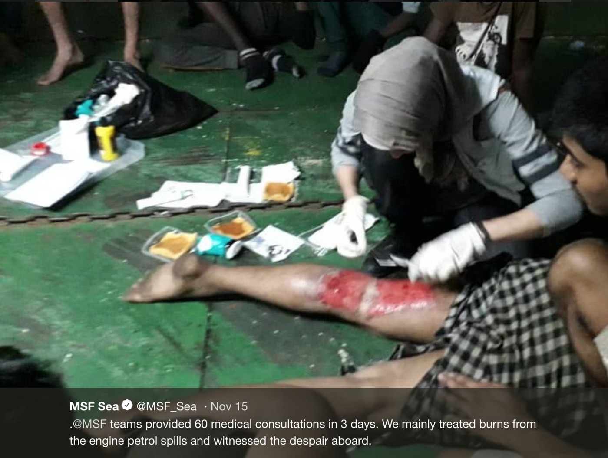
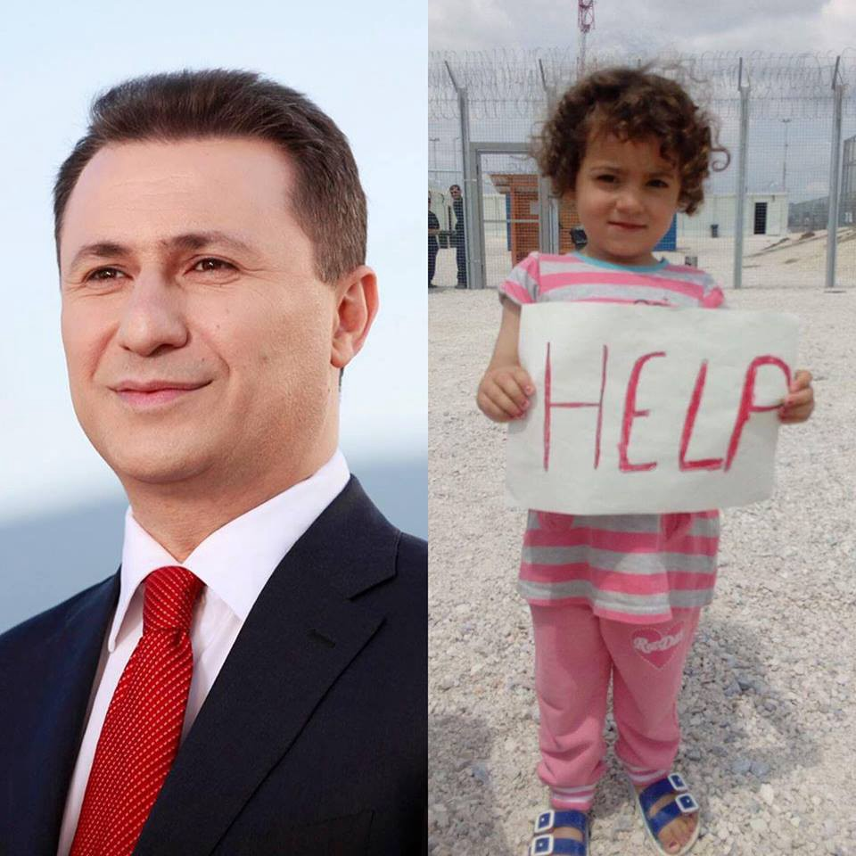

### AYS Daily Digest 15/11/2018: “I would rather die on this cargo ship \[than return to Libya\]”

_Syrians suffering from Human Devastation Syndrome // Frontex reports a decrease in arrivals to EU // 14\-year\-old boy missing in Athens // Hellenic police begin using heartbeat sensoring machines to find people hiding in vehicles // Commission gives **€** 43\.7 million emergency assistance to IOM in Greece // Formal notice issued to Bulgaria urging compliance with EU rules on migration // 13 people missing in forest in Italy // News from France, Belgium, and Denmark // And more news…_

Human rights are sunk in the EU
By Pedripol
### FEATURE
#### A total of [81 people continue to refuse to disembark a commercial container ship](https://www.columbian.com/news/2018/nov/14/dozens-of-migrants-refuse-to-leave-container-ship-in-libya/?fbclid=IwAR21c1Mt8G8FmhninAiBfcxTNxZEkL2ovXP5xBNtpzRRP2z7htAMEQbWTQA) in the Libyan port of Misrata, claiming that Libya is too dangerous\.

They were picked up by the vessel, which was loaded with cars, late on Friday after they were spotted on a flimsy raft out at sea\. Only 14 people have been evacuated so far according to IOM\. Those that remain on board are protesting their return to Libyan detention centres\. They have been on board now for six consecutive days\.

MSF have been providing medical care on the vessel\. They report there is a seventeen\-year\-old Sudanese boy on board whose brother and friend died in the hands of smugglers in Tripoli\.

> “How come you want me to leave this ship and stay in Libya? We agree to go any place but not Libya\.” 

People on board the ship, including unaccompanied minors, have told MSF about their captivity and torture by traffickers in Libya\. Some have endured this torture for over a year\. Julian Rickman, the head of the MSF mission in Libya, has commented on the situation:

> “It’s a shame that once again the only response given to people in search of safety is prolonged arbitrary detention in the country they desperately attempt to leave\.” 

With just one rescue ship patrolling the Mediterranean, and European countries refusing to take in the few that are rescued, commercial ships have increasingly found themselves ‘rescuing’ people at sea in addition to the Libyan Coast Guard, which continues to intercept vessels\.

On November 12th, [the Libyan Coast Guard began a new training module administered by the Croatian Navy in Split\.](https://www.operationsophia.eu/new-lncg-training-module-in-croatia/?fbclid=IwAR01iyMp343N9OUXY1rbYLIe98zXMIUUaQEQtJDqvHnJbxkWID_J7vtjuiw) The course will last five weeks and will provide training in diving procedures and lessons focused on basic first aid and, apparently, ‘human rights\. **’** It is difficult to understand how training the Libyan Coast Guard on how to successfully manage returning people to the country that they risked their lives to leave from, can relate at all to human rights… but there you go\. It seems that the EU is continuing to pretend that a commitment to human rights remains on their agenda\.
### SYRIA

In the latest [Mental Health Report](https://www.sams-usa.net/wp-content/uploads/2018/11/Mental-health-report-17.pdf) , by SAMS, [it is highlighted](https://www.sams-usa.net/reports/human-devastation-syndrome-the-impact-of-conflict-on-mental-health/?fbclid=IwAR0TTE1fJTj3AgVAPl2zEal0pAXYv0XaddlOI7UjGFLnOOf41JSmFd7wGGo) that the complexity and magnitude of mental health conditions that have been caused by the Syrian conflict require a unique diagnosis of their own\. This diagnosis has been termed Human Devastation Syndrome, and is a result of the prolonged and immense suffering and trauma caused by the war, which has gripped the country since 2011\.
### GENERAL

[In a report released by FRONTEX,](https://frontex.europa.eu/media-centre/news-release/migratory-flows-in-october-down-by-a-third-spain-accounts-for-60-of-detections-ppaQPH?fbclid=IwAR3BzhHnMhG5CSgr55JqWJSf9azWBnyEA2vy3krY7nwMYZ7_Pobgvc64Aak) it is contended that the number of arrivals into the EU passing through border crossings has fallen by 31% compared to 2017\. This is primarily thought to be because of decreased pressure in the **Central Mediterranean route\.** The number of arrivals via this route in October of this year fell by 87% compared with October 2017\.

Despite this, pressure on the **Western Mediterranean route** has been reported to have increased\. More than twice the amount of people arrived via this route in October 2018 compared to the same time last year\.

Little change has been observed in the number of people entering Europe via the **Eastern Mediterranean route** by sea in October\. Despite this, there has been significantly increased use of the land border between Turkey and Greece\. Therefore, overall in the first 10 months of 2018, there was a 37% rise in arrivals compared to the same time period in 2017\.

**In the Western Balkans,** the main migratory route from Serbia to Hungary/Croatia has seen a significant decrease in pressure\. However, the parallel route through Albania, Montenegro, and BiH has witnessed an increase in pressure in 2018\.
### SEA

A total of 37 people have been rescued from a boat by SAR Mastelero close to the island of Alboran\. They have been transferred to Almeria with six other people that were rescued from a second boat\.
### GREECE
#### **Arrivals**

According to Aegean Boat Reports, so far in October/November there has been a significant decrease in arrivals on the Greek islands\. A fall of 40% compared to the same time period in October has been witnessed\. They contend that a reason for this drop could be the increased interception of boats by the Turkish Coast Guard, which intercepted a total of 39 boats \(with 1,237 people\) so far in November\.

**Health Point Foundation is in need of qualified dentists** to fill an urgent gap in their rota from December 10th–14th\. For more information, please f [ollow this link](https://www.facebook.com/healthpointfoundation/photos/a.222810764761510/707160626326519/?type=3&theater) \.
#### **Overcrowding in camps in northern Greece**

On the mainland, [Mobile Info Team reports](http://www.mobileinfoteam.org/abandoned-building?fbclid=IwAR1GM5iaHxrJe4EpC1Mje9V8etGYqFNwLPGm74x-3es8k5XBTo5H3Id0MTY) that refugees are being turned away from camps due to overcrowding\. This is causing a number of people, including vulnerable cases, to sleep rough in an abandoned building in Thessaloniki\.

[**A 14 year old boy of Pakistani origin has been missing**](http://www.mobileinfoteam.org/abandoned-building?fbclid=IwAR1GM5iaHxrJe4EpC1Mje9V8etGYqFNwLPGm74x-3es8k5XBTo5H3Id0MTY) **in Athens since 12/11/2018\.** The information of his disappearance was made public on 15/11/2018 following an order from the public prosecutor\.

> Azmat has black hair, dark brown eyes, is 1\.70 m tall\. On the day he disappeared, he was wearing a purple jacket, green plaid shirt, mustard pants and black athletic shoes\. He wears a earring in his left ear\. 

> Anyone who has information is kindly requested to contact “The Smile of the Child” by telephone 24 hours a day, on the “European 116000 Missing Children Line” as well as in all the Police Departments of the country\. 

[**The Commission has provided €43\.7 million emergency assistance to increase reception capacity on mainland Greece\.**](http://www.europeanmigrationlaw.eu/en/articles/news/european-commission-financial-support-to-greece-reception-capacity.html?fbclid=IwAR22EG7mJBFsJLqBq-q-159QLSrv-ZkT6usvDexxD_nrW-zhHu_1AWXE-xc) The money has been provided to IOM to respond to challenges faced over the winter\. It is stated that the money will provide emergency shelter for up to 6,000 asylum seekers… but will it really get to them? If we judge by how the €1\.6 billion of funding awarded by the Commission since 2015 has been spent, probably not\.

[**Five people attempting to enter Greece hidden in a truck have been intercepted near Kipoi, via the use of heartbeat sensing devices that are now being used by Greek Police\.**](http://---  https://www.onexcompany.com/hellenic-police-officers-training-onex-heartbeat-detector/?fbclid=IwAR1mir56QzOamfZiSabh-SHKC5pYt_HXDh9Lurgj2rMBPY9W8D4R-kutpvc   ---) A total of 27 officers of the Hellenic police were recently trained to operate ONEX SA’s high\-end innovative heartbeat detectors\. The officers are serving in Greece’s passport control departments\. Twenty\-five of these sensors have been allocated to the police departments of Orestiada, Alexandroupolis, Rodopi, Serres, Kavala, Drama, Xanthi, Thesprotia, Kilkis, Pella, Kastoria, Florina, and Ioannina\.

[**KEERFA \(Movement Against Racism and Fascist Threat\) reports on the death of a 48\-year\-old man in Thiva camp\.**](http://www.efsyn.gr/arthro/erotimata-gia-ton-thanato-prosfyga-diatyponei-i-keerfa?fbclid=IwAR3G71BfSO3L8gDF82vAb3l9IKhJ1jowIqOcI6l47oJ0NG7Mmf1WhB6Xs2I) He died of a heart attack while taking a shower and leaves behind three young children\. This avoidable tragedy highlights the serious threat of lack of health care services in camps across Greece\. An ambulance was called to the scene but did not arrive on time to save the man’s life\. The man had been hospitalised one month ago with acute myocardial infarction, but was not given the appropriate care or guidance on how to treat the disease\.

[**Greek authorities report that they believe there are 74,000 asylum seekers currently living in the country\.**](http://www.ekathimerini.com/234717/article/ekathimerini/news/greece-says-about-74000-asylum-seekers-now-in-the-country?fbclid=IwAR2v36oSvcKRo1e6brtxTKElQ8szYbqSr9uOvRFrARYfiFo-8tyXrIeS-hs) Efforts are apparently underway to expand housing facilities and improve the conditions of reception centres\.

Migration Minister Dimitris Vitsas has stated that 6,000 people will be moved from the islands to the mainland in the coming months\. He agrees that the situation on the islands, where 20,000 people are living in facilities designed for 10,000 people, is difficult\.

■■■■■■■■■■■■■■ 
> **[RSA](https://twitter.com/rspaegean) @ Twitter Says:** 

> > While 850 persons were transferred to mainland last week from hotspots, Moria camp still hosts nearly two and half times its capacity. 7300 in a camp designed for 3100. The sun may be shining in the picture but winter is here #opentheislands #endthetoxicdeal #refugeesGr https://t.co/Qj1UzpaFyQ 

> **Tweeted at [2018-11-15 09:12:37](https://twitter.com/rspaegean/status/1062996783654191104).** 

■■■■■■■■■■■■■■ 

He has also promised that small health care centres will be set up on each of the islands of Lesvos, Samos, Chios, Leros, and Kos, and that a sewage treatment plan will be completed by March 2019 in Moria\. He also promises that a new camp will be built on Samos with twice the capacity of the current one\. Let’s see if any of these promises are followed up by action…

**WARNING:** Far right ‘journalists’ are active and organisations should be wary before agreeing to interviews\.

■■■■■■■■■■■■■■ 
> **[Nick Barnets](https://twitter.com/NickBarnets) @ Twitter Says:** 

> > Beware of agents of dangerous political extremism pretending to be journalists. If you work in any way on refugee issues, don’t shun journalists but be very careful and verify that a journalist is indeed a journalist before you go on any kind of record with them. 

> **Tweeted at [2018-11-15 14:47:42](https://twitter.com/nickbarnets/status/1063081112564572161).** 

■■■■■■■■■■■■■■ 

■■■■■■■■■■■■■■ 
> **[Elpida #ShutDownAllCamps](https://twitter.com/Elpida_Amal) @ Twitter Says:** 

> > #refugeesGR #lesvos 
@sosrefugiados @[Refugees_Gr](https://twitter.com/Refugees_Gr) 

> **Tweeted at [2018-11-15 20:40:51](https://twitter.com/elpida_hoffnung/status/1063169983293874176).** 

■■■■■■■■■■■■■■ 

### BOSNIA

On Tuesday, UNIMO is bringing aid from Germany to Velika Kladusa in Bosnia, where temperatures have reached below freezing\. The organization is still in need of items\. To find out more please [follow this link\.](https://www.facebook.com/umino.org/photos/pcb.1677946375643762/1677956575642742/?type=3&ifg=1&__tn__=HH-R&eid=ARAE5-yOo8EyTMS5Olp4p2VifrLOYEUh76V8IcClbWIHQb0ennSR4tuLJgWlYvm8CFYbpriJB17wns2e)
### BULGARIA

**The Commission has issued a formal notice to Bulgaria, urging the country to comply with EU rules on migration\.** The notice was issued due to concerns that Bulgaria is incorrectly implementing European legislation\. The primary concerns are related to the accommodation and legal representation of unaccompanied minors, the identification and support of vulnerable asylum seekers, provision of legal assistance, and the detention of asylum seekers\.

> The Commission has identified shortcomings in the Bulgarian asylum system and related support services, which are in breach of the provisions of the Asylum Procedures Directive \(Directive 2013/32 / EU\), the Directive Reception Conditions \(Directive 2013/33 / EU\) and the Charter of Fundamental Rights\. 

■■■■■■■■■■■■■■ 
> **[ECRE](https://twitter.com/ecre) @ Twitter Says:** 

> > 🇧🇬Bulgarian asylum system in breach of Asylum Procedures Directive

🇪🇺European Commission sends formal notice to Bulgaria concerning incorrect implementation of EU asylum legislation

Key concerns; Legal assistance, detention procedure, vulnerable cases, unaccompanied minors 

> **Tweeted at [2018-11-15 14:19:37](https://twitter.com/ecre/status/1063074044990373888).** 

■■■■■■■■■■■■■■ 

### HUNGARY

**First photo:** The runaway former President of Macedonia, who has skipped his court hearing which should see him facing imprisonment, has illegally entered Hungary and applied for asylum\. He is currently in a luxury hotel in Budapest enjoying a warm reception\.

**Second photo:** A young Kurdish girl who legally entered Hungary and is forced to wait in detention behind barbed wire fences while her asylum claim is processed\.

Source: Migration Aid

UN WGAD human rights experts have suspended their visit to Hungary after they were denied access to the transit zones of Röszke and Tompa\.

■■■■■■■■■■■■■■ 
> **[HunHelsinkiCommittee](https://twitter.com/hhc_helsinki) @ Twitter Says:** 

> > Unprecedented! UN WGAD human rights experts suspend #Hungary visit after access denied to the Röszke and Tompa “transit zones” at the border with Serbia where migrants and asylum seekers, including children, are deprived of their liberty.

 [shar.es/aaoH9X](https://shar.es/aaoH9X) 

> **Tweeted at [2018-11-15 15:14:05](https://twitter.com/hhc_helsinki/status/1063087750721740802).** 

■■■■■■■■■■■■■■ 

### ITALY

A total of [13 people from Mali are missing in the forest between Cesana and Claviere on the border with Monginevro\.](http://www.valsusaoggi.it/valsusa-dispersi-13-migranti-in-montagna-intervento-in-corso/?fbclid=IwAR3OWA3XWeYuDFOP_UI3SRnxEVcaoeWuGtKIpRl7Mp0dljWpyM9VE-XXUXc) They reported that they were stuck in snowy ground but could not provide a precise location\. Firefighters and a mountain rescue team are searching for the group\.
### AUSTRIA

**Refugee Protest Camp Vienna** **reports that undercover police in civilian clothing are making controls on trains from Vienna to St\. Pölten\.** It is reported that they are only checking people who look like they could be foreign\.
### FRANCE

**Asylum seekers residing in Apepoigny are demonstrating against the far distances they have to walk each day to accompany their children to school\.** They are requesting for the establishment of a school transport system\. Some have to walk as far as 24 km in consecutive trips each day\. These distances are especially tiring with small children\. The road to the school has also been described as being prone to accidents\.

](assets/9978c07d1240/1*wQnconvzwxeZVavZPu_I2g.jpeg)

Source: [Senate Collective in Support of Refugees and Migrants](https://www.facebook.com/collectif.Sens.soutien.refugies.migrants/?__xts__%5B0%5D=68.ARD7EMzSdZiaFuS0VWgM6EpZliE_GDaI1o-Nhi8FtunNm453WCnE-lmDJnRPX7lVRB_RpLiCqnqNb7W-AOD5JkWwLkB0R76ZN6cWqhLmeWfFUBYER0gAP8fwnK8V3o7AB5lThumTd1nECebBxJnM8zlpMaajM1AgYPeacrZz-rbZllFsq52Zr8yppipZYTwxjWWPux6ZJYZ8lhVTEA_pTFFnCBMa4tGM9dFksb4T49IdmPN59eS5vk97TQYzz6d7qCj-hH5DWFc-_0P-j19UxiKqRyxihm4EOUTbeLMu0VJ_KBqwGyjs5ybe0UGfzgI6ASnMRG0uvul1h6FKX4cFYn9TtK_K&__xts__%5B1%5D=68.ARD-8cpkITIvThYGcAk3XvAFbnvo3Yck50ibeS0OCCEV95w4hOdzCOGlkjzW-lQllGpip_SvFrQ3s91uVziGwBBIhFWVcTYoRXaRWSua10STeaje_53j2ed3uGwJYgpTHu0B04S2PLjsA7Bx1JfLoQr3zj2IPk8HckAriPkoSfxLXvfMNV_v9LF8W_cU18ryVTNzHta7ABx_Co7KSv0s6aXqqRwiCRjVnthTQR25sR2XAvzSzn0VGXXIOc78t89wrumhVjU1umafJ0cyurZfR-b9hExFeBdIyDfzsiX7o4CCAkvbpoTdppdjcgqxOXJBer63DB0LRfQkRhsscqVoDP18nUBJ&__tn__=kC-R&eid=ARAVuS_ox1PZ-hM0PZ5-3cUEqo04l7p3k4FY84BH7GZCz3mBI6snpH9WeUV0mG5-TRA6pSh17EoiW4c_&hc_ref=ARTCkcPZO-F3dGSB1azCRJ-c8eNNU4yjOB3E6Ohdz-Mug2GmwWUt7dhHhEunAXclXio&fref=nf)

**A total of 700 people, who returned to Grand\-Synthe following the last eviction that occurred less than one month ago, have been evacuated again\.** In the last eviction, over 1,500 people residing in the area were forced to leave by authorities, who piled them on buses and moved them to various places across northern France\. Since this eviction, nearly half of the people have returned to the area\. The take\-home message to French authorities is that these sorts of power tactics do not work and real solutions are needed\.

### BELGIUM

[**State Secretary Theo Francken \(N\-VA\) warns**](https://www.nieuwsblad.be/cnt/dmf20181115_03946444?utm_source=facebook&utm_medium=social&utm_term=nieuwsblad&utm_content=article&utm_campaign=seeding&fbclid=IwAR2FqMJTsT0M7oVKNwUse2zlBGvxaBdFkJumqU3CGGF-QcvpWMQtrJESIFg) **that Belgium is in crisis mode following the number of asylum applications rising by 57% in October compared to the same time period last year\.** Apparently the immigration ministry is working overtime over the coming weekends to manage the ‘influx\.’ He is quoted saying, “we need to take measures quickly to make our country less attractive\.”
### DENMARK

**A demonstration in Copenhagen is being held on Tuesday to show support for the children of Sjælsmark\.** The demands include access to Danish schools and kindergardens, access to shared kitchen facilities, better health care, and permission to work\. To find out more details about the demonstration, please [follow this link\.](https://www.facebook.com/events/2847104645315768/)
#### **Information on how to obtain Danish citizenship**

For detailed information on the procedure and limitations, please [follow this link\.](http://refugees.dk/en/facts/legislation-and-definitions/citizenship-in-denmark/?fbclid=IwAR1ZQ7iYeakzh0T0P7D0PctotTsH9qUlbVhwls9qGBz_RwA0pJI8dj2Ojwc)

**We strive to echo correct news from the ground through collaboration and fairness\.**

**Every effort has been made to credit organizations and individuals with regard to the supply of information, video, and photo material \(in cases where the source wanted to be accredited\) \. Please notify us regarding corrections\.**

**If there’s anything you want to share or comment, contact us through Facebook or write to: areyousyrious@gmail\.com**

_Converted [Medium Post](https://medium.com/are-you-syrious/ays-daily-digest-15-11-2018-i-would-rather-die-on-this-cargo-ship-than-return-to-libya-9978c07d1240) by [ZMediumToMarkdown](https://github.com/ZhgChgLi/ZMediumToMarkdown)._
