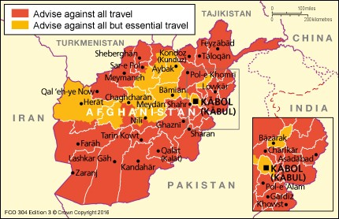
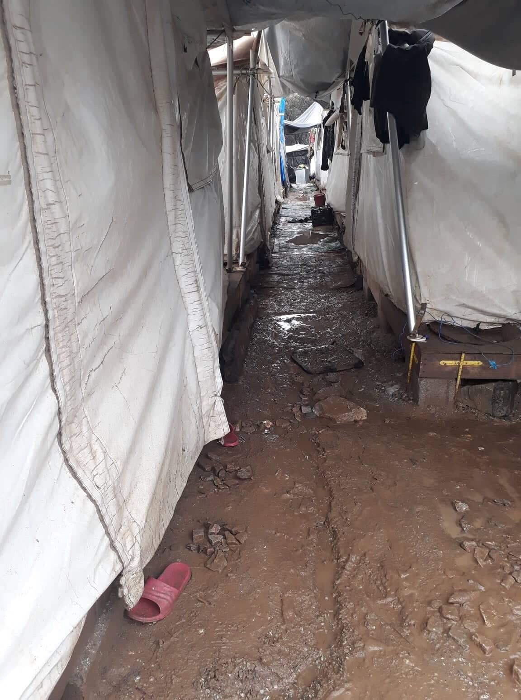
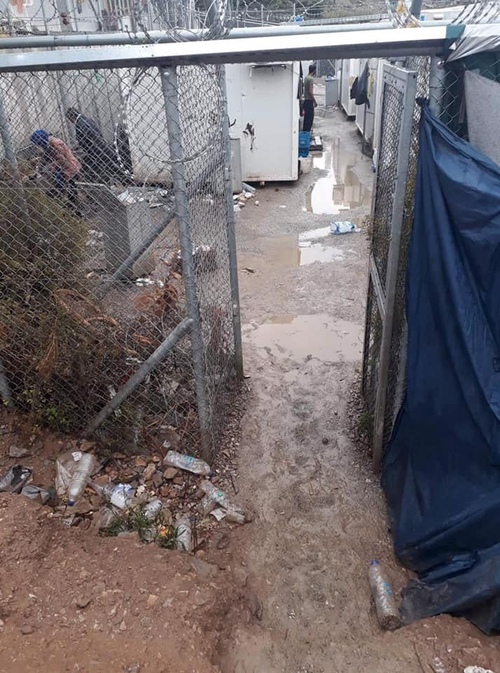
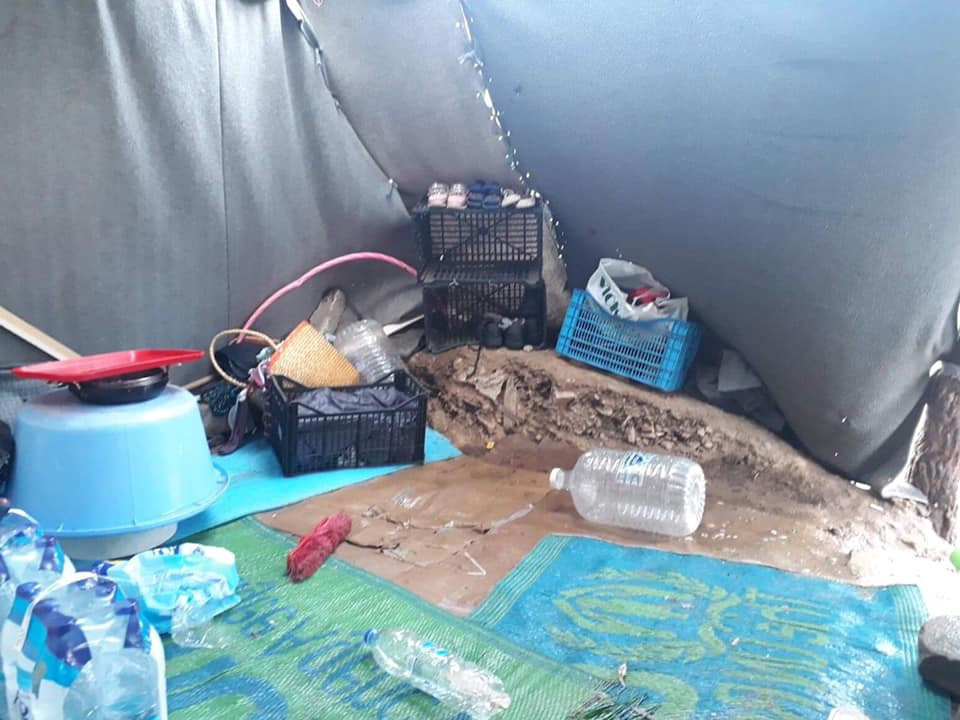
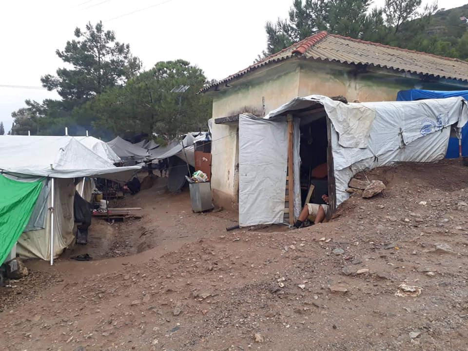
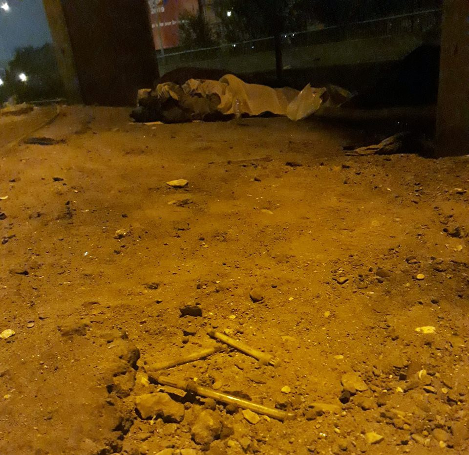
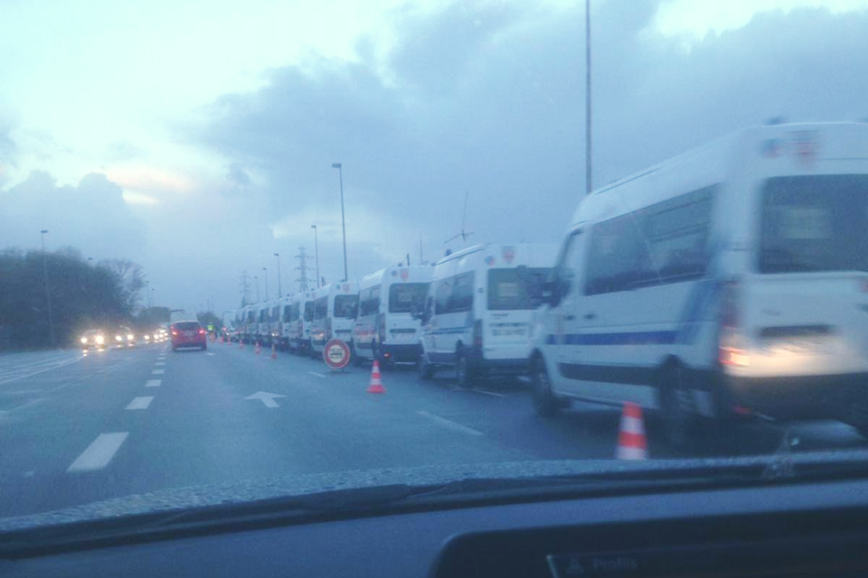

### AYS Weekend Digest 17–18/11/2018: Deportations to Afghanistan Must Stop

Deaths at Sea in the Mediterranean and Atlantic /// Desperation on Samos /// Criminalisation of Solidarity in Bosnia /// 3\-week\-long mass to prevent deportation in The Hague /// Heroin spreading among refugees in Paris /// Boycott of Sjælsmark carries on in Denmark

 / [SMH](https://www.facebook.com/smhumanitario/?tn-str=k%2AF) / [ProemAid](https://www.facebook.com/Proemaid/) \)](assets/30f37f698e54/1*zjYT_isx6qlnwoWl_jcmLQ.jpeg)

Deaths at Sea \( [\#Maydayterraneo](https://www.facebook.com/MAYDAYTERRANEO/?ref=br_rs) / [SMH](https://www.facebook.com/smhumanitario/?tn-str=k%2AF) / [ProemAid](https://www.facebook.com/Proemaid/) \)
#### Feature — Deportations to Afghanistan Must Stop

Another deportation to Afghanistan from Sweden is due to take place on the 19th of November according to [FARR](https://farr.se/sv/aktuellt-a-press/notiser/1653-utvisade-i-livsfara-stoppa-transporten-till-afghanistan?fbclid=IwAR0M3dxaRk-mcpmR6XQCLuvwOBLoMAN-jn85N3zvPC-U9kNk71EdV-fyujw) \. The expulsion is in violation of Sweden’s readmission agreement with Afghanistan as it includes particularly vulnerable people and will return them to a place where their lives will be at risk\.

A member of Afghanistan Migrants Advice & Support Organization \(AMASO\), [Abdul Ghafoor](https://kabulblogs.wordpress.com/2018/11/18/an-open-letter-to-morgan-johansson-swedish-minister-for-migration-stop-deporting-afghan-asylum-seekers/?fbclid=IwAR0O95dj_pWfKuVV91Sxj8HCKR8Qbg2zyGuwD_ESty6HgXKM1wXW0qTU7WE) , has also raised concerns\. He cites the latest [quarterly report](https://www.sigar.mil/allreports/) from the Special Inspector General for Afghan Reconstruction \(SIGAR\) — only 55\.5% of the country’s districts are currently under Government control\. This is the lowest percentage since they began recording in 2015\.

The recent Taliban attacks on two of the safest districts of Ghazni province, Jaghori and Malistan are examples of how difficult the situation has become\. And yet it is likely that 10 out of the 48 people due to be deported come from here\.

In an open letter to Heléne Fritzon, Swedish Minister for Migration, he asks for an end to the deportations\.

> Dear Heléne Fritzon, the experience I have had working with Swedish people, activists and media\. I have seen sympathy and respect for humanity, I have seen rule of law and helping those in need\. Afghans are the most marginalized group of refugees in the globe, they have a government that has failed to protect them\. They have a leadership that has failed to be their voice and talk about their rights\. It is time your government accept the fact and realities in the ground and stop returning Afghan asylum seekers back to danger, or history will remember your country’s betrayal to a group of young people who were in search of nothing more, but safety and protection\. 

The British Government, who have deported [more than 700 people](https://www.gov.uk/government/publications/immigration-statistics-year-ending-june-2018/how-many-people-are-detained-or-returned#returns) to Afghanistan since 2014, seem to agree that the country is incredibly unsafe, at least when it come to their own citizens\. They currently advise against all but essential travel and can offer no support to British Nationals who choose to travel there\.

According to the UN, 2018 has been the deadliest year for civilian Afghans this decade, with [almost 1,700 people killed](https://news.un.org/en/story/2018/07/1014762) in the first half of the year alone\. Amnesty International has recently published a report, [European States should Stop Forcing People to Danger in Afghanistan](https://www.amnesty.org/en/documents/asa11/9262/2018/en/) , stating the multiple dangers faced by people in the country and those returned there including food insecurity, child labour and torture\.

Despite this comprehensive research Turkey alone claimed it had [deported 15,000 people](https://reliefweb.int/report/afghanistan/mass-deportations-afghans-turkey-thousands-migrants-sent-back-deportation-drive) on charter flights to Kabul earlier this year\. Germany has also increased deportations to Afghanistan leading to the [suicide of a 23 year old](https://www.aljazeera.com/news/2018/07/afghan-asylum-seeker-deported-germany-kills-180711120045730.html) man earlier this year in his hotel room in Kabul after he had been forcibly deported along with 68 others\. However, not all European countries have carried on with this murderous practice\. Finland has currently [halted deportations](https://yle.fi/uutiset/osasto/news/finnish_immigration_authorities_suspend_afghan_asylum_decisions/10386092) due to revised advise from the UN\. If they can do this, other governments can too\.

GENERAL
#### The future of EUNAVFOR MED operation Sophia

Several media outlets report \( [1](https://formiche.net/2018/11/sicurezza-operazione-sophia-proroga/) , [2](http://uploads.maltatoday.com.mt/news/europe/91000/mogherini_proposes_new_policy_to_end_practice_of_migrant_disembarkations_in_italy) , [3](http://www.ansa.it/europa/notizie/rubriche/politica/2018/11/15/migrantinuova-proposta-ue-per-risolvere-nodo-sbarchi-sophia_65b80b90-a071-4c55-86df-5bc07aef48c4.html) \) that the European External Action Service \(EEAS\) presented a proposal to the Political and Security Committee to change Operation Sophia disembarkation practices\.

EUNAVFOR MED Sophia’s mandate will expire on December 31 and on the 19 and 20 November EU’s Foreign and Defense ministers will meet to discuss its future\.

The operation’s primary focus since its inception has been the reduction of migrant flows in the Central Mediterranean and the disruption of human trafficking on that route\. EEAS’s proposal is a response to the policies of Italian and Maltese governments\. Moreover, Italy threatened to quit the operation\. With no surprise this proposal goes a long way towards the requests of these governments:

> The proposed change would allow the relevant Maritime Rescue Coordination Centre \(MRCC\) to decide where rescued migrants are to be disembarked and would require new criteria to be considered, including the circumstances of the rescue, the need for EUNAVFOR MED vessels to resume their mission, and principles of efficiency and speed\. 

> Only as a last resort, the proposal would require the country of the MRCC to make available one of its ports for disembarkation, provided that an immediate screening of migrants is organized and an expeditious redistribution of disembarked asylum seekers to other states occurs\. _\( [Migrantsatsea\.org](https://migrantsatsea.org/2018/11/17/new-eunavfor-med-sophia-disembarkation-policy-under-consideration-would-end-practice-of-disembarkations-in-italy/?fbclid=IwAR320Dhc6amgg-bVwh15ZfWDKeJUg35WfNsXJD9PIZO-n9ePB-Jo7tx0FjA) \)_ 

#### Mediterranean Migrant Arrivals Reach 103,347 in 2018; Deaths Reach 2,054

IOM has [published a report](https://www.iom.int/news/mediterranean-migrant-arrivals-reach-103347-2018-deaths-reach-2054?fbclid=IwAR1tEPLcFEIDZ_I3HJNEFXCUK5zha1ABZ6WZwKrsQJeytyQ2dJBg8Hso3Bw) with a breakdown of figures for arrivals and loss of life\. Particularly interesting is the increase in arrivals to the Balkans\.

_Based on the data on irregular entries to Croatia, an 88 per cent increase is observed between September and October \(885 vs\. 1,667 respectively\) \. Since the beginning of 2018, Croatian authorities registered a total of 6,160 irregular entries, almost three times more than the 2,137 reported for the same period last year\. 64 per cent of migrants registered this year were detected in countries near the border with Bosnia and Herzegovina, Slovenia and Serbia\. Majority of migrants were from Afghanistan \(21%\), Pakistan \(16%\), Turkey \(13%\) and the Islamic Republic of Iran \(12%\) \._
#### Translators without Borders are recruiting

TwB are looking for a Translation Projects Officer, look at the details and apply [here](https://translatorswithoutborders.org/translators-without-borders-about-us/careers/translation-project-officer/) , the deadline is December 3rd\.

LIBYA
#### More than 2000 people repatriated from Libya since December 2017

262 migrants detained in Libya were evacuated to Niger on November 12\. This brings the [total number](https://www.ecre.org/detainees-evacuated-out-of-libya-but-resettlement-capacity-remains-inadequate/) of people repatriated to more than 2000 since December 2017\. However, [Amnesty International](https://www.amnesty.org/en/documents/mde19/9391/2018/en/) describes the resettlement process from Niger as slow and the number of pledges inadequate\. The repatriations in October and November were the first since June when the Emergency Transit Mechanism \(ETM\) centre in Niger reached its full capacity of 1,536 people\. According to Amnesty International this was a result of a large number of people “still waiting for their permanent resettlement to a third country\.”

According to UNHCR, 57,483 refugees and asylum seekers are registered in Libya; as of October 2018 [14,349](https://www.iom.int/news/mediterranean-migrant-arrivals-reach-100630-2018-deaths-reach-1989) had agreed to Voluntary Humanitarian Return\. [Currently](https://reliefweb.int/sites/reliefweb.int/files/resources/UNHCR%20Libya%20Flash%20Update%2015%20November%202018.pdf) 3,886 resettlement pledges have been made by [12 states](https://reliefweb.int/report/libya/unhcr-flash-update-libya-2-9-nov-2018-enar) , but only 1,140 have been resettled\.

14,595 people have been [intercepted](https://reliefweb.int/sites/reliefweb.int/files/resources/UNHCR%20Libya%20Flash%20Update%2015%20November%202018.pdf) by the Libyan coast guard and taken back to Libya, however it has been [well documented](http://www.unhcr.org/desperatejourneys/) that their return is being met by detention, abuse, violence and torture\. In the words of [Amnesty International](https://www.amnesty.org/en/latest/news/2018/11/cruel-european-migration-policies-leave-refugees-trapped-in-libya-with-no-way-out/) : “thousands of men, women and children are trapped in Libya facing horrific abuses with no way out”\. This is the situation of around 10,000 people [detained](http://www.infomigrants.net/en/post/10363/up-to-10-000-migrants-in-20-centers-under-the-sun-iom-libya) in Libyan detention centres\.

In this context, as it was reported earlier in the week, refugees and migrants are currently refusing to disembark in Misrata after being rescued by a cargo ship on November 12, [reportedly](https://uk.reuters.com/article/uk-europe-migrants-libya/shipbound-migrants-in-libya-port-say-would-rather-die-than-disembark-idUKKCN1NJ2R2?utm_source=ECRE+Newsletters&utm_campaign=cab364cb19-EMAIL_CAMPAIGN_2018_11_15_01_08&utm_medium=email&utm_term=0_3ec9497afd-cab364cb19-422321521) saying “they would rather die than be returned to land”\.

SEA
#### 22 missing off the Atlantic coast of Morocco

■■■■■■■■■■■■■■ 
> **[Ali Zoubeidi](https://twitter.com/DrAZoubeidi) @ Twitter Says:** 

> > Tragédie : Des informations sur le naufrage d’un bateau de pêche traditionnel de 25 migrants  dans l’atlantique  , 3 individus  ont été rescapés au sud des côtes de #tiznit 
#migration #safepassage #maroc #UE https://t.co/mn5To6bcVZ 

> **Tweeted at [2018-11-18 18:21:43](https://twitter.com/alzoubeidi/status/1064222134350815232).** 

■■■■■■■■■■■■■■ 

A boat carrying 25 people sank off the coast of Tiznit, south\-west Morocco\. 3 people were rescued, the other 22 passengers are still missing\. According to a media outlet they were trying to reach the Canary Islands, around 100 km west of the coast of North Africa\.

GREECE

**Greek Islands**
#### Arrivals

During the weekend weather conditions worsened\.

Two boats arrived to the Greek islands \(info from [Aegean Boat Report](https://www.facebook.com/AegeanBoatReport/?__tn__=kC-R&eid=ARDm_AhXZEffjBqlO9hoUA0-tjzx_3KXfsbsSnqb0mv-gzAr2I79Lt8lqsLpua72IC0GIMxNW07g8j5I&hc_ref=ARRvodqilHPSLrALtXSZFzvGdxzA6Ul6IZIBUBJghLcgNM7DFBf7IKkRuLyMhQ_ta5s&fref=nf&__xts__[0]=68.ARBw-97_U4atjaC-cjy-Ue2qOPKkbgDcIuGwMvLL_VIYIicCQjgjZV9wDAYC8dVsVrMUhr4qo2934eOn4kX2MiNQ8lGHtWySLjYGmdS-Hg9prR3VJDpfkiqzG9u4zpd3E7RmdUjk3crFId9lVXQLXp10SKyT5SdDqDMAjlKn9bGdg-Xkd3wPbHfGdoF6kIeLQ02Xjjw1RvVNmJZGUzJKvCbRjkM8VWf1gkGjOL7lgMa5wK62MDlQbn2w1z7QRNAAjOF0L_9ZCWYKVe_VnWg9yF8OFQkU9z1LeIoycdhygn2-TVDJav_XJbu23xsyHxmvy4T70QQERPb8hwXhUiR6zu8) \) \.

The first boat landed near Agios Antonios, Samos east, at 09\.00 on Saturday\. It carried 48 people\. A second boat landed on Pounta Beach, Karfas, Chios south\-east on Saturday morning\. It carried 32 people \(9 children, 2 women, 21 men\) \.

A third boat started the journey from Gömeç Turkey on Sunday night, towards Lesvos north\-east\. Due to the bad weather they ended up on Yumurta Island, Ayvalik\. The Turkish Coastguard was alerted, and two helicopters and a vessel started the search\. TCG received their location, and they were located 03\.52\.
44 people was picked up and transported to port Ayvalik\.
#### Desperate Situation in Samos

There was a riot in the Samos camp on Saturday, November 17\.

After weeks of hunger, living totally exposed to the elements, facing constant violence from both the police and the general chaos in the camp, some people living in the camp finally hit their breaking point\. It had begun to rain hard on Friday evening, and by Saturday afternoon there were rivers of water streaming through the hill\-side camp\. Almost everyone living in a tent had a stream passing through it, and by Saturday people were completely soaking wet and miserable, more or less washed out of their tents\.

Samos camp \(Photo by AYS\)

It should be noted that the UNHCR has supplies to help people prepare for bad weather which they failed to distribute in the week before this storm, which was forecast well in advance\.

As one volunteer described, “The conditions in the camp and the surrounding field are the worst they’ve ever been… When the temperature drops a month from now people may not survive\. People are living next to piles of feces and bottles of urine because they are too afraid to leave their tents at night\.”

Samos Camp \(Photo by AYS\)

During the rain on Saturday many people were milling about, doing their best to repair their tents, or simply sitting, trying to keep themselves dry with bags or ponchos\. Around dusk, something changed\. A volunteer who was on the scene described what happened: “Suddenly, I heard a cry from the top of the camp\. It was a young guy, yelling in French\. I couldn’t make out exactly what he was saying, but the meaning was very clear from his tone\. People have had enough, they are angry\. All of the sudden many of the young men in the camp took up the cry\. They began to assemble at the top of camp, and then went down to surround the police station\.” Reportedly, people were preventing police who were arriving from getting out of their cars by surrounding them\. Many police cars simply turned away from the camp when they saw the number of young men who were gathered, many armed with sticks\. Eventually riot police were bussed into the camp, where they responded to the situation with typical violence, and beat many people\. It is unclear at this moment if arrests were made, or how many\. Riot police were stationed throughout the camp on Saturday, as people continued to suffer in the rain\.

When there is a natural disaster like a storm and people are exposed to the elements, the reaction of any country should be to put those people in a safe shelter, such as a gym or a school\. On Samos there are many such locations, including many nearly or entirely empty tourist hotels\. Yet the Greek authorities seem to think it is a better use of their resources to instead install riot police in the camp, who will beat anyone who dares to protest against these terrible conditions\.

And what is the UNHCR doing in the midst of this? As usual, it seems, very little\. As of writing, neither the UNCHR not the Greek authorities have committed to any plan for winterization\.
#### Moria in the Rain

A volunteer from Team Humanity published two videos showing the condition of Moria camp in Lesvos:

ITALY
#### More people dead or missing at Italian borders

4 people from Mali are still missing on the Italian\-French Alps\. A group left Claviere last Thursday evening, despite the temperature dropping to \-5°\. Around 20:30 they sent a distress call and 10 people were rescued in the snow\. One of the people rescued [stated](https://www.corriere.it/cronache/18_novembre_16/migranti-sardegna-morto-9-dispersi-mare-e43628ee-e9db-11e8-863b-3e637f80be2e.shtml?fbclid=IwAR1dTFcZfZ6SKZoiB-eXvMeqnlszutBP6kbRMxKUiFmDTLCDcw5_NO3GNWk&refresh_ce-cp) that one of them died during the journey\.

Two bodies were also picked up off the south\-western coast of Sardinia\. They [reportedly](https://it.euronews.com/2018/11/18/italia-naufragio-migranti-regione-sardegna-contro-salvini?utm_term=Autofeed&utm_medium=Social&utm_source=Twitter&fbclid=IwAR3wVYG63Wpq9VZCR88ujH1kkIGXlAOK96hppbu2SQRmUVgJWZ-nyX0KWtY#Echobox=1542537801) died in the shipwreck of a dingy from Algeria\. Three people were rescued, at least another 8 people are still missing\. Around 1,000 people have arrived in Sardinia from Algeria since the beginning of the year\.

SPAIN
#### 21 confirmed deaths

21 bodies have been found from the shipwrecked boat in Los Caños, Cádiz which was lost almost 2 weeks ago\. There were over 40 people on board altogether, 22 of whom survived\.

■■■■■■■■■■■■■■ 
> **[Europa Press](https://twitter.com/EPAndalucia) @ Twitter Says:** 

> > Ascienden a 21 los cadáveres hallados de la patera naufragada en Los Caños #Cádiz hace más de una semana [europapress.es/andalucia/cadi…](https://www.europapress.es/andalucia/cadiz-00351/noticia-hallado-vigesimo-primer-cadaver-patera-naufragada-canos-cadiz-hace-mas-semana-20181118113931.html) 

> **Tweeted at [2018-11-18 10:52:13](https://twitter.com/epandalucia/status/1064109014429126656).** 

■■■■■■■■■■■■■■ 

#### Rescue boat still docked

Meanwhile, the rescue boat Aita Mari is still [prevented from sailing](https://translate.google.com/#auto/en/https%3A%2F%2Fwww.elmundo.es%2Fpais-vasco%2F2018%2F11%2F18%2F5bf13808e2704e88bf8b463d.html) after three months\. They are waiting for permission from the central Spanish government which so far has not even confirmed whether they have to make any changes or if they meet or break any of the rules\.

BALKANS
#### Balkan weather report

On Friday 16th November, snowfalls were [forecast](http://www.severe-weather.eu/recent-events/snow-coming-to-southeastern-and-parts-of-eastern-europe-in-the-next-several-days/?fbclid=IwAR0KfPvYFSbNHxnBOJyCW5_l6rac9ONveYGkRqHrhqtzULj9pyomsYTjZq8) across Eastern and South\-Eastern Europe\.

_Snowfall is already being reported in parts of the Balkans, including Romania and Bulgaria\. Further snowfall is expected across large parts of Bulgaria and Romania, as well as parts of Ukraine and Moldova\. Higher elevations in Greece, FYR Macedonia, Albania, Montenegro, Serbia, Bosnia and Herzegovina, Croatia and parts of Slovenia expect some snow too\. Also expect snow in parts of Poland and Belarus\._

Forecast for Monday 19/11/2018

MONTENEGRO

Partly cloudy, sunny and dry in most part of the country\. In the early morning some rain may fall locally, in the north mainly sleet and snow\. During the night rain, showers and thunder, in the higher mountains in the north rain will occasionally change into sleet and snow\. During the second part of the night, intense rainfall is expected mostly in the southern regions\. The wind will be weak to moderate, at times strong, blowing from eastern directions\. Morning air temperature \-5 to 9, highest daily 1 to 17 degrees\.

SERBIA

Mostly cloudy in the morning and afternoon, with rain and snow in the north and east and in the rest of the country precipitation will cease\. During the day it will clear starting in the south\. In the evening and night rainfall from the southwest and snow in the high mountains\. In central and southern Serbia rain may freeze on the ground\. The wind will mostly be weak from variable directions, in some parts temporarily strong or stormy\. 
Weather warning: 90% chance of freezing of wet surfaces\.

BiH

Mostly cloudy\. During the early morning possibly some snow in Krajina, north and northeast\. Heavy rainfall is expected from the south during the night\. The wind will be weak blowing from the east and south\-east\. The lowest morning temperature will be mostly from \-3 to 7, highest daily from 2 to 12 degrees\.

CROATIA

Mostly cloudy, occasionally with rainfall on the border and snow in the centre of the country\. Sunny periods during morning alongside the coast, in the far south possibly some rain, in the evening and night rain in other parts\. The wind will be weak to moderate blowing from the northeast\. Alongside the coast moderate to strong Bura, at the foot of Velebit with stormy gusts, in the south of Dalmatia the Bura will turn to a moderate Jugo which will strengthen in the evening\. The lowest morning temperature from \-2 \-to 9, highest daily from 1 to 15 degrees\.

BULGARIA
#### EU Commission opens infringements proceeding against Bulgaria

The European Commission sent a [letter of formal notice](http://europa.eu/rapid/press-release_MEMO-18-6247_en.htm) to Bulgaria concerning the incorrect implementation of EU asylum legislation\. Shortcomings in the Bulgarian asylum system and related support services are in breach with provisions of the Asylum Procedures Directive \( [Directive 2013/32/EU](https://eur-lex.europa.eu/legal-content/EN/TXT/?qid=1537698566984&uri=CELEX:32013L0032) \), the Reception Conditions Directive \( [Directive 2013/33/EU](https://eur-lex.europa.eu/legal-content/EN/TXT/?qid=1537698681174&uri=CELEX:32013L0033) \) and the Charter of Fundamental Rights\. Concerns relate in particular to: the accommodation and legal representation of unaccompanied minors; the correct identification and support of vulnerable asylum seekers; provision of adequate legal assistance; and the detention of asylum seekers as well as safeguards within the detention procedure\. If Bulgaria does not act within the next two months, the Commission may send a reasoned opinion on this matter\.

BOSNIA AND HERZEGOVINA
#### Criminalisation of Solidarity Carries On

Volunteers continue to [raise concerns](https://www.facebook.com/cestacestero/posts/10216953007353642) about the criminalisation of solidarity in Bosnia

> Refugees are persecuted and treated as criminals\. They live being constantly observed while no one offers them a shelter\. Humanitarian Aid is already being criminalizing in Bosnia as throughout Europe\. 

> If this doesn’t scare us, we’ve fallen asleep\. 

As the winter is approaching the Balkans more people are on the move\. According to volunteers in Tuzla, over the last week many people, mostly single men, have returned from Bosnia to Serbia and although some are still arriving it is in much smaller numbers\. People leave Bosnia because there are no places in the camps and there is no sense of security\. The government is not issuing proper documents to them, and even people who have been in the country for over a year now still sometimes have no papers\.

Access to asylum processes in Bosnia is very difficult and is run by the government\. They also run one asylum centre, but this only provides shelter for 160 people\. All the large camps are run by the IOM having received a donation from the EC of around 8 million\.

Most people are concentrated in the northern part of the country, but the EU does not want them there and they have requested that the local authorities don’t have camps within 30 km of the border\. This seems to be an attempt by IOM and the authorities to move all people from the border area back to Sarajevo where a new camp has recently opened\.

In Kladusa the police are even trying to send back those who are living in private accommodation supported by local people with no help from the state or any of the big organizations\. Local people there have been threatened with fines or even detention, in a continued attempt to criminalize solidarity\. We have also received reports from Sarajevo that local people giving out food in the streets have been stopped by the police and fined\. Yet no one else will support the homeless who cannot find places in camps and are living in the streets or in squats\.

If you’re thinking of going to Bosnia to volunteer as a medical practitioner there is some advice [here](https://zdravniki4azilante.blogspot.com/2018/11/in-field-training-and-education-for.html?fbclid=IwAR1CNlx7fQfpHHRzyFYez_i4_d_jFSQdCPnG5YfADMPhpDCGxI9UhfoGnz4) \.

SWITZERLAND
#### Updated Information on Asylum procedures

Welcome2Europe published complete and [updated information on asylum procedures in the country](http://w2eu.info/switzerland.en/articles/switzerland_-asylum.en.html?fbclid=IwAR3v8-eEkiVCy37lpPIcbyHYS_5WW0L2-EHzl7Iqjzhz-rCDEbF1s9fCbFs) \. For now, it is only in English\. Arabic, Farsi and French translations will be available soon\.

FRANCE
#### Use of Heroin and Crack Spreading Among Asylum Seekers

From [Paris Refugee Ground Support](https://www.facebook.com/PRGS.team/) :

Paris \(Photo by Paris Refugee Ground Support\)

> As we are going into the winter, it feels different to the previous years we’ve been in Paris\. For many reasons this time it’s more scary, more dangerous and more deadly\. The crack and heroin situation has, unchecked by the police, erupted into the refugee population of the city\. 

> Previously, the situation had been contained to a small area, a small community of around 20/30 crack dealers and users\. They had a small camp that mostly stayed the same size, when help was offered, it was vehemently rejected\. We left the area alone, as did the police\. Status quo\. 

> In March this year, the official camp in Port de la Chappelle was closed and demolished along with a building that was used for needle exchange and that provided help and support to addicts\. At the same time police evicted the isolated crack camp where dealers addicts and prostitutes and various gangsters gathered, lived and did business\. 

> As a result of this eviction and the loss of the needle exchange the problem has exploded\. The worst part of this is that even though police are ever present in the area, they do nothing to try to control the situation\. 

> Their level of indifference is disgusting\. We were told by a French volunteer who was giving out sandwiches to hungry people close to the area where crack and heroin are most prevalent that a policeman came up to him and told him that he could not give out any food\. When the volunteer pointed out that only a few meters away people were openly smoking crack the policeman replied that that wasn’t his job\. \(Let that sink in for a minute, THE POLICE, CRACK, HEROIN… SANDWICHES\) 

> By this reasoning, it’s not the job of the police to contain and control an exploding drug situation,\(born of their own lack of good judgement\) however it is their job to deny food to people living on the street\. 

> This gives dealers and pushers free reign to prey on the most vulnerable people living in a dismal limbo with no way out\. These people who have come from war, torture and poverty\. People who have been subjected to huge horrors such as watching your family die, grief, loss, rape and untold abuses are definitely not in short supply\.
 

> We hear that the first 2 hits of crack are free and the third is €5 then the price goes up\. By the third time it’s already too late, the demon of addiction has got you and won’t let you go\. These people are left selling themselves to curb crawlers to get their next hit to escape the filth of daily street life\. 

> Is there a more sinister agenda behind this?
 

> Is the state actively ignoring this epidemic in order to destroy any resolve, any strength, any humanity that these people have left? 

> We are seeing more and more people succumbing to this living death sentence that is peddled with sweet promises of mental/emotional escape from the open prison that is Paris\. 
 

> This most horrific and desperate situation sucking innocent and broken people in, and spitting out zombie slaves to crack and heroin\. 

> This is Paris\. 

#### Ground update from Grande\-Synthe

[Refugee women’s centre published an update](https://www.facebook.com/refugeewomenscentre/photos/a.178973875861584/540205363071765/?type=3&theater) after la eviction in Grande\-Synthe\.

Grande\-Synthe \(Photo by Refugee Women’s Centre\)

> \[…\] Since the large\-scale eviction on the 23rd October, a new camp developed on the Jesuit Farm in Grande\-Synthe, with estimates suggesting that between 500 to 800 people were living outside\. 

> On Tuesday, this area was evicted by riot police forces\. 

> RWC volunteers on the ground were informed by police officers that there were 400 places on buses to take people to accommodation centres, with priority to be given to families and unaccompanied minors\. 

> Several families in the neighbouring Puythouck area were outside the police perimeter, and were told that they would have to wait until the end of the operation to see if any space was available on buses\. RWC volunteers witnessed one family being escorted inside the perimeter to where buses were stationed\. 

> Some families we were in contact with, who were able to get on a bus, expressed that they were unaware of where they were going; something which RWC has noted as a pattern of these evictions\. 

> The majority of families around Dunkirk are now in accommodation centres\. We estimate that around 20 women and children are currently living outside, as well as hundreds of displaced men\. 

BELGIUM
#### Update from Brussels

 \)](assets/30f37f698e54/1*ktpBh9-s-CcLxGaX6xJuwg.jpeg)

Clothes distribution in Brussels \(Photo by [Care4Calais](https://www.facebook.com/care4calais) \)

There are now hundreds of refugees sleeping rough in the Central Business District of the city\.

> Numbers are rising with approximately 700\+ people desperately in need of support\. 

Care4Calais are distributing warm items for winter\. You can find out more about the situation and how to [help here\.](https://www.facebook.com/care4calais/photos/pcb.2182956251737320/2183546045011674/?type=3&theater)

THE NETHERLANDS
#### 3 week\-long mass to prevent deportation

Local media [report](https://nos.nl/artikel/2259452-marathon-kerkdienst-in-de-haagse-bethelkerk-duurt-al-3-weken.html?fbclid=IwAR0I5jrYqjPNDrqjhEk0PqrLAgFsn0jRxTECSMsVFgNPaojRxS6kXBUN7Vc) that in The Netherlands police are not allowed to interrupt religious ceremonies\. Hence, a Christian mass has been going on now for about 3 weeks in The Hague to prevent the deportation of an Armenian family who have lived in the country for the last 9 years\.

Authorities deny that the family can remain\. Church representatives stated that: “a church shelter is never infinite, so we do not create a free state or the like, it is a temporary way to bring a problem to the attention\. But for now we continue\.”

DENMARK
#### Boycott of Sjælsmark Continues

Since October 25th, children and parents have been [boycotting the cafeteria](https://www.facebook.com/refugeeswelcomedenmark/posts/2347164262020445) food in the deportation center Sjælsmark\.

“Our children are in prison,” explains one of the parents\. “We have to fight for them, because the government and the politicians don’t care\. We have to fight for them, and the Danish people must make their voices heard — they have to shut down Sjælsmark\.”

SWEDEN
#### Child Marriage

Media [report](https://www.nbcnews.com/news/world/sweden-may-become-latest-country-annul-child-marriages-n935281?fbclid=IwAR1uRVMopRMU5Cj0cRjU5wjmhyQDj0gfKsCLA35usa6DnRwuslGrRhdZgcM) that there will be a vote next week by Swedish lawmakers on increased measures against child marriage\. Marriages for people under 18 will remain banned, and if the bill is approved it will also invalidate such unions of foreigners carried out abroad\. Couples will be able to remarry at 18\. For girls child marriage often has drastic consequences, making them more likely to drop out of school, live in poverty and experience domestic violence\.

UK
#### Man found dead trapped under a bus in the Eurotunnel terminal

Local media [report](https://www.kentonline.co.uk/folkestone/news/body-found-on-coach-at-eurotunnel-193649/?fbclid=IwAR1vr5jPuIVdqhRf_4u5MV6OxCj1FwcUOFnsat5qFODC81zSxd_4CORL3Fk) that one person was found dead trapped underneath a bus at the British end of the Eurotunnel\.

According to [media outlets](https://www.bbc.com/news/uk-england-kent-46253019?fbclid=IwAR2Yxyw0mQLL0c_wV1Z2s5fufaa53YzGF8CnrTy2mXdSzPMhaHbt9IkngrY) , during last week around 60 people were rescued on and off the British coast\.

On Tuesday, 17 people entered the Port of Dover on a French fishing boat reportedly stolen\.

On Wednesday three boats carrying 22 people were rescued off the coasts of Dover and Ramsgate\.

On Friday, a dinghy carrying 7 people was found on a beach near Dover\.

On Sunday morning 9 people in distress called for help to the police from a rocky part of the coast near Folkestone\.

Seven more people were found in a lorry in Dover\.

While all the people will be interviewed by immigration officials, a criminal investigation is also underway and the Border Force has since stepped up its patrols along England’s south\-east coast\.
#### NHS pulls out of data sharing agreement used to track down “illegals”

This week the NHS pulled out of a data sharing deal with the Home Office which was used to track down patients who were believed to be breaching immigration rules\. This puts a halt to this controversial component of the UK government’s “hostile environment” policy which had led to seriously ill migrants feeling too scared to seek medical treatment in the UK\.

The deal was set up in November 2016\. The NHS took “only” 11 months to finally withdraw from this agreement, after warnings were expressed to the UK Parliament Health Select Committee last January\.

This practice had left many people too intimidated to see a doctor, leading to people dying from treatable illnesses and pregnant women missing out on vital care\.

Last May the government agreed to suspend most of the data\-sharing arrangement that was originally made in November 2016, and limit its use to tracing those being considered for deportation because they had committed a serious crime\.

The NHS has now confirmed it will completely withdraw from the data\-sharing agreement\. This move has been welcomed by human rights campaigners, with Rita Chadra, director of the Migrants Right Network stating; “We are delighted that the government is starting to dismantle the hostile environment by conceding that deterring people from accessing health services is cruel, inhumane and ultimately more costly\.”

Negotiations between the Home Office and the NHS are now under way to develop a new agreement\.
#### Community Sponsorship for asylum seekers

Refugee InfoBus [reminds](https://www.facebook.com/RefugeeInfoBus/posts/2279466035622145) of a “very very poorly advertised UK government scheme, whereby community groups are able to sponsor an individual or family to come to the UK”\.

> The requirements and responsibility put upon the “sponsors” are tough\. Groups have to work very hard to meet the criteria set by the Home Office and obtain approval from their Local Authority\. 

> Typically this involves finding a suitable, affordable home, raising sufficient funds and putting together a comprehensive resettlement plan that outlines how the community will take responsibility for resettling the family: this covers everything from safeguarding to English language provision and more\. 

> It is absolutely not OK that our government uses resettlement opportunities to justify closing borders or the creation of a two tier asylum system, using a “deserving rhetoric” to allow the rights of asylum seekers who come to the UK “illegally” to become further eroded\. This is not a zero\-sum game\. 

> Despite this, this seems like a safe way to practically help people travel to the UK, and ensure that they are given a warm welcome\. 

> Check out below for more information on how you can make the first steps to becoming a sponsor: 

> [https://www\.gov\.uk/…/p…/apply\-for\-full\-community\-sponsorship](https://www.gov.uk/government/publications/apply-for-full-community-sponsorship?fbclid=IwAR0CPlNxmSTC_HWI1h3pbKe6OvpI_Bn3jlJ-Y10vXkAlpX8zPazh6vBa4pw) 

**We strive to echo correct news from the ground through collaboration and fairness\.**

**Every effort has been made to credit organizations and individuals with regard to the supply of information, video, and photo material \(in cases where the source wanted to be accredited\) \. Please notify us regarding corrections\.**

**If there’s anything you want to share or comment, contact us through Facebook or write to: areyousyrious@gmail\.com**

_Converted [Medium Post](https://medium.com/are-you-syrious/ays-weekend-digest-17-18-11-2018-deportations-to-afghanistan-must-stop-30f37f698e54) by [ZMediumToMarkdown](https://github.com/ZhgChgLi/ZMediumToMarkdown)._
