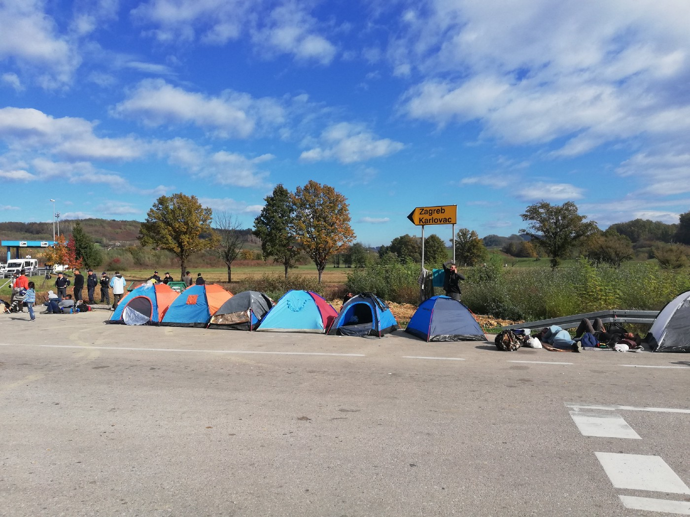
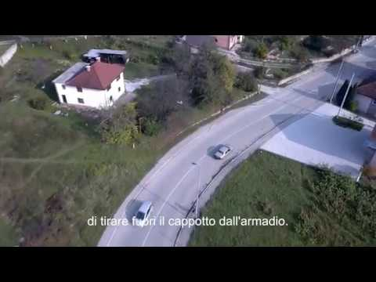
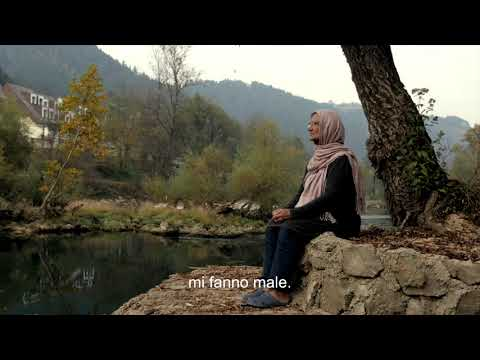
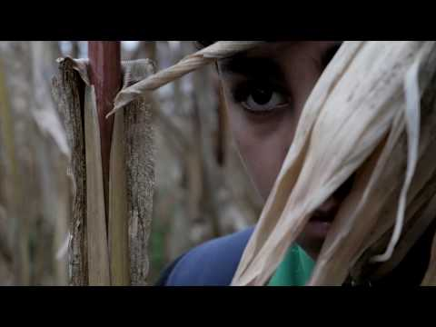

### AYS SPECIAL: Outside the EU borders
#### _AYS presents the project Checkmate and their five short movies about the life at the EU border\._

Photo AYS

Checkmate is a project started in June 2018 as a response to ongoing violence along the EU borders\.

Checkmate is composed of two cinematographers and a former social worker\. We came together after spending some time along the Balkan route with the aim of raising awareness of the many people who are trapped just outside the EU borders\.

The project has been divided into 5 chapters, one is “under construction”, since we thought about deepening people’s understanding of lives confined at the margins of the EU\. We spent a couple of months in Velika Kladuša, a city in the northern part of Bosnia and Herzegovina who has been profoundly shaped by the current migration flow in the Balkans\.

The report is divided into 5 topics\. We have worked both with videos and articles that have been published on “The Submarine,” an independent Italian newspaper\. The chapters are as follows ;

**The Game —** the attempt of crossing borders that very often leads to facing violence and mistreatments

**The Inhabitants of Velika Kladuša \-** we tried to capture people’s feelings about the current situation intertwining it with the historical background of the town\.

**Militarization —** it concerns the brutalities that are daily implemented by the police guarding the EU borders

**The Lost Generations** — how many lives are lost?

And the fifth part will focus on the “European dream” that many migrants bring with them on their journey\.

The project is meant to give voice to people who have not been listened for too long\.

We truly believe that we can still bring about a change as far as we strongly bind together and raise our voices\.

_Collettivo Checkmate_

_Converted [Medium Post](https://medium.com/are-you-syrious/ays-special-outside-the-eu-borders-9cc60d51e0c6) by [ZMediumToMarkdown](https://github.com/ZhgChgLi/ZMediumToMarkdown)._
