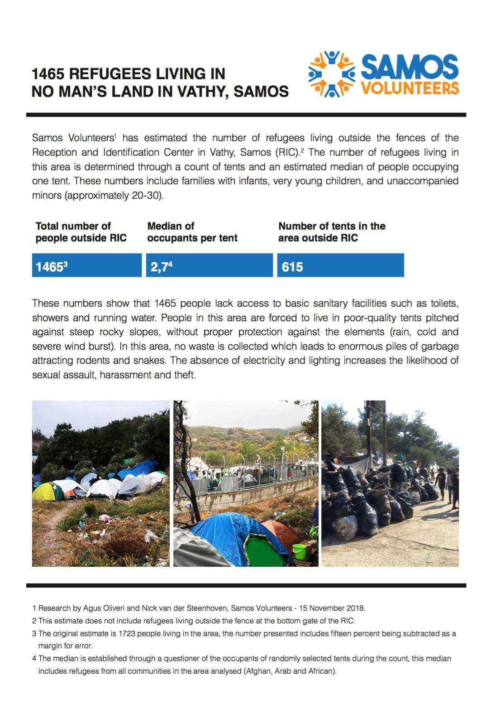
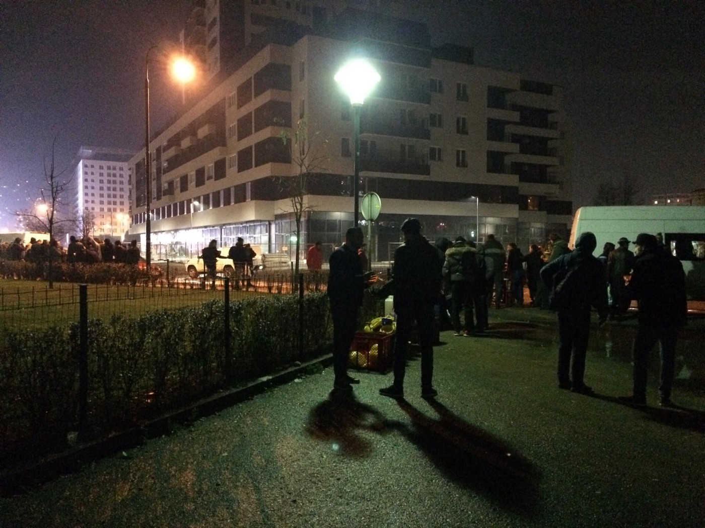
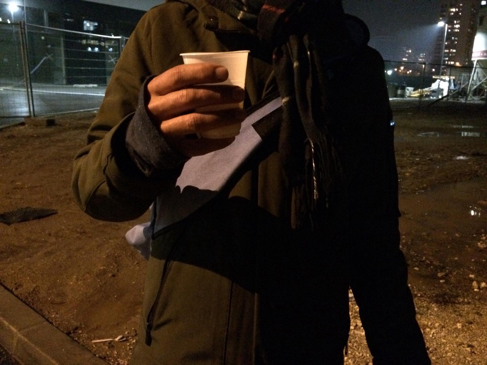
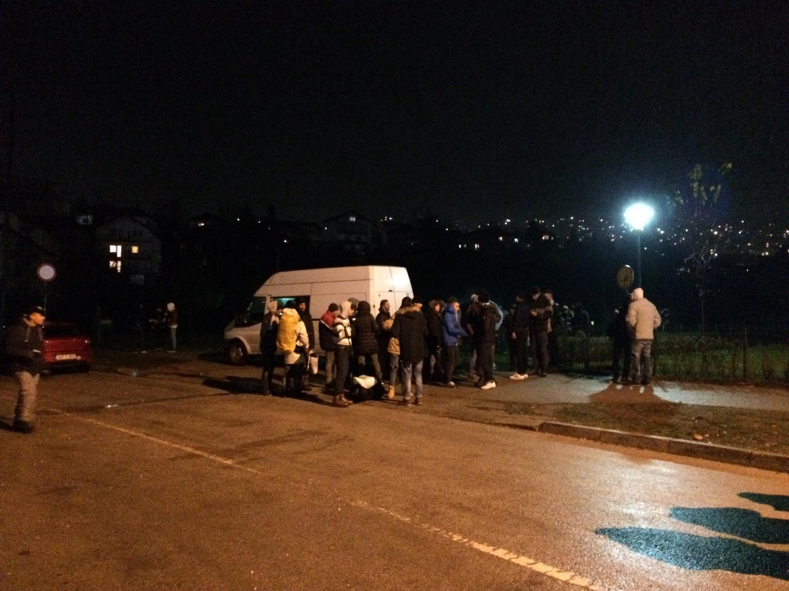
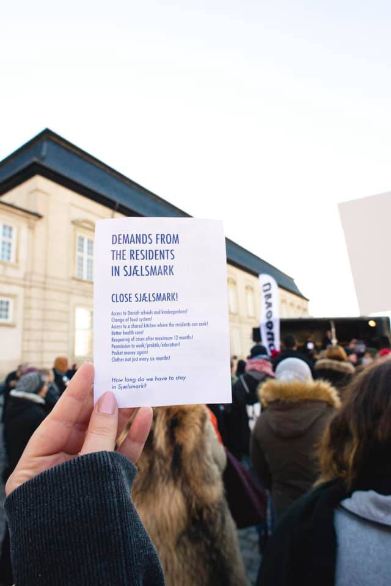
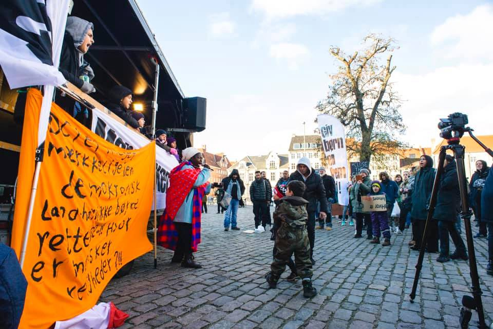
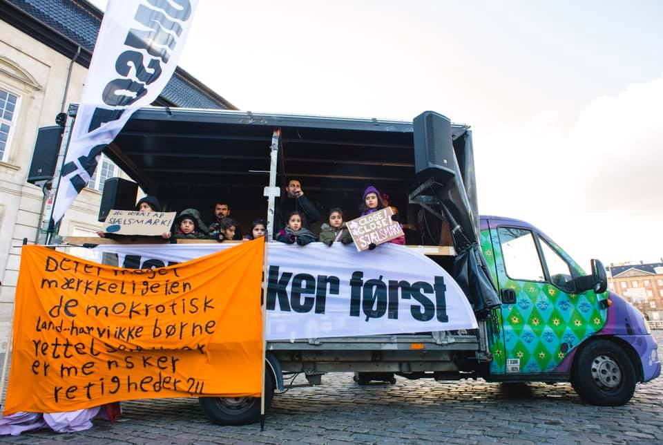

### AYS Daily Digest 20/11/18: Universal Children’s Day — not so universal after all
#### Serious situations facing refugee children continue / A year since the death of little Madina — how many more happened? / What African refugees are fleeing / Commercial ship return refugees to inhumane detention in Libya / Repeated political pressure forces two organizations to temporally cease SAR operations in the Mediterranean / fight to reform deportation camp Sjælsmark in Denmark / read for more…

](assets/1888b555cfab/1*oVkmOPm4k8IkkgY42OEicg.jpeg)

“ Moria \(Lesvos\) refugee camp, just now\. Europe as such\.” — Photo: [Refugee Accommodation and Solidarity Space City Plaza](https://www.facebook.com/sol2refugeesen/?tn-str=k%2AF&hc_location=group_dialog)
#### FEATURE

Since 2015, Europol has reported that [over 10,000 refugee children](http://www.dw.com/en/more-than-10000-migrant-children-missing-europol/a-19014669) have gone missing on the European continent\. Some lost their lives while fleeing with their families, but in all of those cases the children’s rights that the western world has polished up individually do not apply, it seems\.

It has been a year since [**the death of Madina Hussiny**](ays-daily-digest-1-6-2018-who-is-responsible-for-the-horrow-we-are-living-in-85ee87c1c3a7) , a little refugee girl who [died on the night of Nov 20](https://www.facebook.com/areyousyrious/posts/zbogom-madina-goodbye-madina-dva-sata-smo-prolazili-hrvatskom-kada-nas-je-polici/916183278530556/) /Nov21\. Though the police, responsible for the pushback that sent them to the dark railroads and, ultimately, her fate, are complicit in Madina’s death, nobody has been found guilty as of today\. 
Later on, as Madina’s family was in serious danger inside of the Croatia’s border territory, an AYS volunteer went to notify the border police\. This volunteer ended up [sentenced at court](http://www.statewatch.org/news/2018/sep/croatia-ays-case.htm) for “assisting an illegal border crossing\.”

While Madina’s death serves as a constant call to some people to always do what they can to prevent such perilous situations, it evidently meant nothing for those here who “serve and protect\.”

Minors are often treated like adults, both by police and by [the reception teams and facilities](ays-news-digest-unaccompanied-minors-in-refugee-centers-45f54d954542) across Europe\. Already last year it was documented that the number of **unaccompanied minors** entering Europe has skyrocketed since the start of the recent crisis in 2015\. The number of unaccompanied children worldwide has increased fivefold\. Among the myriad problems that refugees face, one of the most serious is the issue of education\.
### ‘Universal’ right to education

Overall, about 4 million refugees aged 5 to 17 were out of school in 2017, [GEM Report](http://unesdoc.unesco.org/images/0026/002659/265996e.pdf) for 2019 notes\. Educational opportunities of children affected by internal migration may be compromised for several reasons, from precarious legal status to poverty, inadequate government attention, or biases and stereotypes\. The legal, educational, and administrative responses to the education plight of the internally displaced are often similar to those for refugees\.
In destination countries, immigrants often leave education early\. According to the GEM report, in the European Union, 10% of natives and 19% of foreign\-born people aged 18 to 24 left school early in 2017\. Dropout can depend on arrival age; outcomes vary considerably by whether students enter host systems at the beginning, middle or end of compulsory education\. Extremists tend to instrumentalize development challenges or exacerbate them to create and exploit a vicious circle of marginalization, particularly affecting the poorest and most vulnerable\.

> The education needs of unaccompanied migrant minors, who are particularly vulnerable to exploitation, are frequently unmet\. 

Their number worldwide increased from 66,000 in 2010–2011 to 300,000 in 2015–2016\. Unfortunately, most of the specially designed programmes for refugees aim at young children, mothers or those who are already enrolled in school, where many young boys and teenagers are left unattended and even stigmatized\.

Faced with crises, most governments’ reflexive response is to offer education to refugee populations in a parallel system\. However, a consensus supposedly developed that this is not a sustainable solution, even though that’s not what it looks like from the practice\. The degree of refugee inclusion varies across displacement contexts\. Prejudice and discrimination are present in many education systems, despite policies against them\. In **Bosnia** , except for a few cases, refugee children have not had the chance to enter the educational system, and now that it has been publicly announced, [the reactions are reportedly very different](https://www.klix.ba/vijesti/bih/djeca-migranti-ce-ici-u-os-brekovica-u-bihacu-mjestani-najavili-ispisivanje-svoje-djece/181119088?utm_medium=Status&utm_source=Facebook&utm_content=181119088&utm_campaign=Klix.ba+Facebook+status&fbclid=IwAR2Kdd-aPXCUhjl9e_gkRuuDQU0dEPD_Db8RnfWl-Pic_pUV9bNGMB2sFDQ) to what one would expect from people who have lived through war — and most of them as refugees, too\.

About 73% of the 86,000 minors who arrived in **Italy** between 2011 and 2016 were unaccompanied\. Despite legislation in 2015 and 2017 aimed at protecting them, only a minority regularly attend school\. In many conflict\-affected countries, internal displacement has strained already struggling education systems\. Financial literacy is low in many traditional regions of countries of origin and low\-skill migrant communities, leaving refugees open to fraud or financial exploitation\. This happens both to the parents of children and to unaccompanied minors, thus affecting greatly the potential future development of children\.
### Case: Croatia

The attitude toward refugee minors in Croatia has not changed significantly since [we reported on it](ays-daily-news-digest-17-1-massive-negligence-of-minors-and-serious-police-abuse-remain-silently-38c0815bdec5) and called out the responsible Ministry\. Even more, unaccompanied minors who are staying in a children’s home in the eastern city Osijek have not been included in school for the past 3 years, adding another issue to the pile that Croatia may have to answer for in Strasbourg\.
The extent to which teacher education includes diversity varies by country, so even when children do get their 70 hours of language learning in Croatia, it is often done by teachers who have not had additional training for teaching Croatian as a second language\.

The example of Ahmad is illustrative\. He has been staying at the Children’s Home in Osijek and nobody included him in high school education, though the facility was obliged to do so\.

> _Today he is 19 and has no qualification, nor the ability to continue his education in Croatia\._ 

The state is taking away valuable time from these children and minors in the state institutions that are responsible for enabling the right to education, but they seem to simply not care, and there are no sanctions for such negligent behavior\. Along with the imperative to enter the system at all, the state should minimize time spent in schools not following the national curriculum or not progressing towards recognized certificates, as such time compromises education trajectories and leaves consequences that our near\-sighted politicians don’t seem to recognize at the moment\.

Children who arrived to the country through the process of resettlement are also not included in the education system, though no official obstacle exists, apart from the 30\-day ‘deadline’\. IOM, the organisation responsible for them, awaits for the Ministry’s decision, but by now we should all be aware that there won’t be any unless we all act and push for progress, if we care about those we are helping and, in their case, working with\.

> Respecting the right to education must go beyond legislation and administrative process\. 

The biggest challenges lie ahead of those who should be included in a high school programme\. The school insists on ‘education accomplishments’, oblivious to the fact that the children have no such opportunities to have accomplishments before they are included in the educational system at all\. Once again, both the parents and the children have no sufficient information on the process and rights in education and do not take part as an equal partner in their own case\.

High school\-aged children are enrolled in elementary school, and the unaccompanied minors still stay at the Juvenile Correctional Facilities\.
On the occasion of the Universal Children’s Day, [GOOD Initiative](http://goo.hr/) and the Initiative Welcome have also called for inclusion of unaccompanied refugee minors in the educational system in Croatia \( [Text](http://welcome.cms.hr/index.php/hr/2018/11/19/ukljucite-djecu-izbjeglice-bez-pratnje-u-skole/) available in Croatian\) \.
#### AFRICA

Who are the people you meet sleeping in the street, in makeshift camps and waiting for months in queues hoping to be allowed to access the system of international protection, by many considered ‘lucky’ to have survived perilous journeys and made it to Europe? Many flee violence and poverty in forgotten places across African countries, before being kidnapped by traffickers and horribly abused in Libya\. In a final bid for freedom, they board crowded, flimsy rafts and dangerous vessels that leave into Mediterranean waters\. The stories SAR workers and volunteers hear [on board the Aquarius](https://www.newsdeeply.com/refugees/community/2018/11/19/what-it-means-for-migrants-when-europe-blocks-sea-rescues) highlight how people are repeatedly stripped of their humanity and dignity\.

Unlike the general attitude and perception of Europeans, who are mostly poorly informed on the real situation regarding refugee resettlement today, it is the generally poorer and geographically closer countries that take in most people in need of international protection\. It is a fact that **while two\-thirds of international migrants are destined for high income countries, 9 out of 10 refugees are hosted by low\- and middle\-income countries,** which require support from international partners, but are we aware of that?

**Somalia** is at the heart of one of the worst humanitarian crises in the world today\. Twenty years of conflict and waves of drought have uprooted a quarter of the country’s 7\.5 million people, sadly moving from a tent to a shelter…and never to a house, as one Somali architect noted\.

■■■■■■■■■■■■■■ 
> **[Amanda Sperber](https://twitter.com/hysperbole) @ Twitter Says:** 

> > And this from 2017: Somali #refugee returnees pushed back across the border lose access to education, there are schools in #Dadaab and no national education system in Somalia [sg.news.yahoo.com/somali-refugee…](https://sg.news.yahoo.com/somali-refugees-regret-returning-home-kenya-040032933.html) #WorldChildrensDay 

> **Tweeted at [2018-11-20 10:58:01](https://twitter.com/hysperbole/status/1064835247177641984).** 

■■■■■■■■■■■■■■ 

International organizations document that inside **South Sudan** , nearly two million people are displaced internally, while outside the country there are now over two million South Sudanese refugees, mainly in Ethiopia, Sudan, and Uganda\. As in other cases, refugees often arrive in underserved areas of host countries, so those arriving in Uganda settle in the poor West Nile subregion\. Uganda currently hosts the most South Sudanese refugees, having taken in more than one million\. 
Many fear imminent attack or struggle with food insecurity\.

The situation in South Sudan and neighbouring countries has quickly escalated into a full\-blown humanitarian emergency\. The majority of the refugees are women and children, many of whom flee across the border alone\. Often, they arrive weak and malnourished\. When the rainy season comes, their needs are compounded by flooding, food shortages and disease\. — data from the UN Operational portal on refugee situations

Total number of refugees and asylum\-seekers from the **Democratic Republic of the Congo** is 781,917, while 1\.37 million Congolese are internally displaced\. Many Congolese were working in the informal mining sector, in the northeast of Angola, before being asked to leave\. A recent expulsion order by the authorities in Angola targeting migrants has [reportedly](http://www.unhcr.org/news/briefing/2018/10/5bc59dcb4/mass-congolese-returns-angola-lead-humanitarian-crisis.html) caused thousands to be stuck at near the border, with limited means to travel onwards to their homes\. There are reports of violence, including sexual violence and harassment, bodily frisking and theft of belongings, at the hands of security forces on both sides of the border\.

> The Congolese refugee population is now among the ten largest in the world\. Nearly 55 per cent are children, many crossing borders unaccompanied or separated\. 

It is difficult and close to impossible to display real data as many lives are lost and people suffer ‘under the radar’ of the official registries and statistics\. 
However, **Burundi** Regional Refugee Response Plan includes Burundian refugees who fled since April 2015, and its [Regional Overview of the Burundian Refugee Population \(as of 31 October 2018\)](https://data2.unhcr.org/en/documents/details/66910) notes that there are some 13,000 Burundian refugees and asylum seekers in Kenya, 8,700 in Mozambique, 7,700 in Malawi, 8,900 in South Africa and 4,900 in Zambia who are assisted within the respective country\-level programmes\. A further 23,000 Burundian refugees, who have lived for decades in Tanzania, no longer receive assistance and are not included in these figures\.

Thousands have died and a fifth of **Central African Republic** ’s 4\.5 million population have fled their homes in a conflict that broke out after mainly Muslim Seleka rebels ousted President Francois Bozize in 2013, provoking a backlash from Christian anti\-balaka militias\. According to [OCHA](https://reliefweb.int/updates?search=%28primary_country.iso3%3A%22caf%22%29%20AND%20ocha_product%3A%22Situation%20Report%22%20AND%20source%3A%22UN%20Office%20for%20the%20Coordination%20of%20Humanitarian%20Affairs%22) , 50 per cent of the population having to rely on humanitarian assistance to survive, while 25 per cent is displaced either internally or in a neighbouring country\.

Following violence, hostilities, human rights violations and a rapidly deteriorating humanitarian situation in the northern part of [**Mali**](https://www.unocha.org/mali) since January 2012, large numbers of Malians have been seeking refuge in Burkina Faso, Mauritania and Niger, or are displaced internally\.

In **[Ethiopia](https://reliefweb.int/sites/reliefweb.int/files/resources/DTM%20Ethiopia%20National%20Dashboard%20Round%2013%20DRAFT.pdf)** , nearly 1\.1 million people are displaced in the Somali region overall, when other causes such as drought and flood are included\. With the 200,000 people who fled ethnic conflict to camps in the Somali region of the country in the past 4 months, over 700,000 people [reportedly](https://reliefweb.int/report/ethiopia/700000-people-flee-conflict-seek-safety-somali-region-ethiopia) fled inter\-communal violence in recent years\.

> “The violence in Ethiopia this year has gone on unnoticed by the international community\.” — NRC officer in Ethiopia 

#### GREECE

■■■■■■■■■■■■■■ 
> **[RSA](https://twitter.com/rspaegean) @ Twitter Says:** 

> > Hundreds of refugees sleep in tents and exposed to bad weather conditions in Moria camp. These pictures taken  after last weekend’s heavy rain show the  harsh conditions so many experience. Winter is here and not looming #opentheislands #endthetoxicdeal #refugeesGR https://t.co/dKfGI9dOXC 

> **Tweeted at [2018-11-19 11:45:02](https://twitter.com/rspaegean/status/1064484693553360897).** 

■■■■■■■■■■■■■■ 

In an attempt to assess the situation at the camp, [Samos Volunteers](https://www.facebook.com/samosvolunteers/?tn-str=k%2AF&hc_location=group_dialog) team has conducted research in order to find out how many people are living with little to no shelter in the extended areas of the camp:

#### BALKAN WEATHER REPORT — forecast for Wednesday, Nov 21

**Montenegro**

Mostly cloudy, occasionally rain, in the south possibly rain and thunder\. Gradual cessation of precipitation is expected in the second part of the day\. The wind will be weak to moderate from variable directions\. Lowest temperature from 4 to 14, highest daily from 5 to 19 degrees\.

**Serbia**

Cloudy with rain with a gradual decrease of rain and wind intensity\. In the morning the wind will be moderate to strong, locally stormy and will weaken in the afternoon\. The lowest temperature is projected to be between 1 and 6, and the highest daily from 6 to 11 degrees\. 
Warning; high probability of strong wind gusts\.

**BiH**

Mostly cloudy in our country tomorrow with rain during the morning in Herzegovina, east and north\-east Bosnia\. During the day light precipitation locally\. The wind in Bosnia will be weak blowing from the north, and in Herzegovina there will be a moderate wind from the southeast\. Morning air temperature from 2 to 11, and the highest daily from 4 to 16 degrees\.

**Croatia**

Land inwards cloudy with fog and occasional drizzle, rain in Slavonia and in the far east locally\. In the mountains possibly some light in the morning, in Lika rain freezing in contact with the ground\. Alongside the coast partly sunny and changeably cloudy, locally some light rain\. In the south of the country there may be rain showers with thunder\. Wind on the mainland will be generally weak\. Alongside the coast moderate wind from the northwest will be blowing, in the first part of the day Bura at the foot of mount Velebit\. Morning temperature from \-1 to 11, and the highest daily from 3 to 17 degrees\.
#### BOSNIA AND HERZEGOVINA

The lifeless body of a presumed undocumented asylum seeker was found on the Bosnian bank of Drina River in the area of Zvornik municipality, InfoPark writes: The police has informed the Public Prosecutor’s Office in Bijeljina which is in charge of further activities\. Biljeljina Police also said that on Monday it has discovered a group of 14 “undocumented illegal migrants” in the city and that the police determined they are Pakistani nationals\. Last Friday, police in Samac discovered eight undocumented people and determined that they are Iranian citizens\. They have been transferred to Doboj police field team, Bijeljina Police Office spokesperson told local media\. “We have noticed the reappearance of Iranian migrants,” Bijeljina City Manager said\. Serbia recently canceled the visa\-free regime with Iran, resulting in “partial reduction” of the arrivals of migrants from that country, “but this morning again, the majority of arrivals were from Iran,” Bijeljina Manager added\. At a meeting of the migration coordinating body, Republic Srpska entity President and Prime Minister said that additional police forces will be deployed to tackle the illegal migration issue, but according to Bijeljina City Manager, the national “institutions of Bosnia and Herzegovina need to react better and faster”\.
### Sarajevo

Volunteers distributing food and tea in the evening report on the current situation and activities:

Photos by a long\-term independent volunteer

> The Cadus NGO has arrived and will provide much needed medical assistance for several months\. People are lining up outside of their truck\. 

> We try and accommodate as many people as possible under some sort of shelter — not leaving them out in the open as it is cold\. We’re doing rounds in the city center as well as at the train station, and a team goes to the mosque where food is distributed\. 

food distribution van
### Velika Kladuša

The Dutch [Lemon Foundation](https://lemonfoundation.eu/doneren/?fbclid=IwAR3mAFWgwC9BHW2J7MX4xvG2zGk8d8GZSzWpiyeBsnx99X7RqgNgWeYbcOM) invites everyone who can to contribute and make possible for people sleeping rough to have a hot meal served daily:

> Please help us keep the restaurant open\.
 

> We should be able to get this together during the winter months\.
 

> You want to help? For 12 euros a month, you give someone a warm meal there 6 days a week\.
 

> Make an amount on the account number of lemon foundation: NL 02 ingb 0007636988 Tnv Bosnia or via our website; [https://lemonfoundation\.eu/doneren/](https://lemonfoundation.eu/doneren/?fbclid=IwAR0TgpbzWm7x05k1EYPyqvBYfz7CvWgddZOLfuys8_VaLBlRR0uv0w-WI98) 

#### LIBYA/SEA

Libyan forces violently removed the migrants aboard [N](https://www.facebook.com/hashtag/nivin?source=feed_text) ivin today, Tuesday 20\. They reportedly shot rubber bullets at the migrants, injuring 10 people\. Some were hospitalised, while other people were taken from the Nivin to the al\-Karareem detention center\. The action was reportedly led by the Libyan Ministry of Interior since they decided to define the migrants on board as criminals\. Humanitarian organisations weren’t allowed access to the area as this happened, as the instructions given were reportedly these:

> \- interrogate all detainees to the Public Prosecutor’s Office\.
 

> \- Transferring injured and sick to emergency hospital for treatment\.
 

> \- Prevent international organizations from reaching migrants 

■■■■■■■■■■■■■■ 
> **[francesca mannocchi](https://twitter.com/mannocchia) @ Twitter Says:** 

> > This is what a detention center looks like.
Being 'inside' the Libyan det. centers means having seen them. Having heard that smell. Having met those eyes and heard the vivid pain of those voices. 
This is being 'inside' a Libyan det. center.
Gharian, during our visit, 2017 #Libya https://t.co/tYzfv5gIi1 

> **Tweeted at [2018-11-20 20:38:47](https://twitter.com/mannocchia/status/1064981402175905793).** 

■■■■■■■■■■■■■■ 

More reactions followed:

■■■■■■■■■■■■■■ 
> **[vincent cochetel](https://twitter.com/cochetel) @ Twitter Says:** 

> > Some of the people on board are probably refugees fleeing from their country of origin. This commercial ship should have never returned these people to Libya. Every effort should be  pursued to avoid detention, retaliation or a blood bath. 

> **Tweeted at [2018-11-19 21:39:07](https://twitter.com/cochetel/status/1064634199469113344).** 

■■■■■■■■■■■■■■ 

■■■■■■■■■■■■■■ 
> **[Hanan Salah](https://twitter.com/HananMSalah) @ Twitter Says:** 

> > The humanitarian community should be a little bit more than ‘sad’ about this incident. They should call for an investigation into events and whether those who conducted the forced disembarkation used excessive force #Misrata #Libya 

> **Tweeted at [2018-11-20 20:14:58](https://twitter.com/hananmsalah/status/1064975407986946048).** 

■■■■■■■■■■■■■■ 

■■■■■■■■■■■■■■ 
> **[Hanan Salah](https://twitter.com/HananMSalah) @ Twitter Says:** 

> > The humanitarian community should be a little bit more than ‘sad’ about this incident. They should call for an investigation into events and whether those who conducted the forced disembarkation used excessive force #Misrata #Libya 

> **Tweeted at [2018-11-20 20:14:58](https://twitter.com/hananmsalah/status/1064975407986946048).** 

■■■■■■■■■■■■■■ 

#### SEA SEARCH AND RESCUE

The last privately\-operated ship conducting rescue missions in the Mediterranean, Aquarius, was ordered to be seized by the prosecutors in Catania\. They are allegedly accused of illegal disposal of 24,000kg of waste, included clothing worn by migrants, blood\-stained bandages, and medical waste\. Their team called it an “unfounded and sinister measure aimed at criminalising our lifesaving activity”\.

■■■■■■■■■■■■■■ 
> **[MSF Sea](https://twitter.com/MSF_Sea) @ Twitter Says:** 

> > ⚡PRESS STATEMENT: @[MSF](https://twitter.com/MSF) is submitting an appeal to Italian review courts. We are fully willing to cooperate with authorities, but refute accusations that [MSF](https://twitter.com/MSF) was involved in criminal activity aimed at illicit waste management of any kind. #Aquarius [bit.ly/2qUHtsZ](http://bit.ly/2qUHtsZ) 

> **Tweeted at [2018-11-20 10:00:23](https://twitter.com/msf_sea/status/1064820746084655105).** 

■■■■■■■■■■■■■■ 

[SOS MEDITERRANEE](https://www.facebook.com/SOSMEDITERRANEE/?__tn__=kC-R&eid=ARD5CEmipKFfBOZtDwH14G268HjgHGKr9rcADXQvMIHmj7jdJKCYh-k33mnzygzlICrFkwOMkBAcqvQ5&hc_ref=ARRIO4j94JAPji2Gn8sTcgxxXTSu4imjptvJ4A3Atoqy5qUWCtTWOMvob3Ci8XRPx5E&fref=nf&__xts__%5B0%5D=68.ARDnTJ1sz5ACzHbiY3mtv9iV6b3ydKfRCNZFGNZoH4bTyk0irL6hHYeJTUse0pVXPr1XAvHA4zTsAxVZOIVvtVZxcFoM-tJlhn6upljUouDdlCCS2dkrvp9BgdjdvkEDYb6blwOwu25ZkbsWHPDbzZ5S1Aj3gcVxRQs0ayqdbVEIeAx-qYtlqDqYeFT6OgvQ5MMxf7nAnK1jwjZEZvHbW2tWkX1sDQZHUnYP5h9WqIY8RT6Qgqs7mH-W1rAsgfCXaAfKHuLbuh3YvP-As8pK793PZYNyvf0ulckyyg8EIR6-hTZSNt754Ep7OCjI54cNZUnzjAhckaj-I3hw2hSjb9o-iA) has issued a press release strongly supporting its partner [Ärzte ohne Grenzen / Médecins Sans Frontières \(MSF\)](https://www.facebook.com/aerzteohnegrenzenMSF/?__tn__=K-R&eid=ARA67RaYBn1HvsZGhRTXCYNhOxOlu7vN9ju7w_qoQ3UorDfTJ_qKdR9FhMSZZZn3asnRXBaSFllcth1A&fref=mentions&__xts__%5B0%5D=68.ARDnTJ1sz5ACzHbiY3mtv9iV6b3ydKfRCNZFGNZoH4bTyk0irL6hHYeJTUse0pVXPr1XAvHA4zTsAxVZOIVvtVZxcFoM-tJlhn6upljUouDdlCCS2dkrvp9BgdjdvkEDYb6blwOwu25ZkbsWHPDbzZ5S1Aj3gcVxRQs0ayqdbVEIeAx-qYtlqDqYeFT6OgvQ5MMxf7nAnK1jwjZEZvHbW2tWkX1sDQZHUnYP5h9WqIY8RT6Qgqs7mH-W1rAsgfCXaAfKHuLbuh3YvP-As8pK793PZYNyvf0ulckyyg8EIR6-hTZSNt754Ep7OCjI54cNZUnzjAhckaj-I3hw2hSjb9o-iA) in condemning the decision of the Italian judicial authorities to order the preventive seizure of the Aquarius:

“We categorically refuse accusations of involvement in illegal activities\. Standard procedures, that have not been questioned by authorities so far, have always been followed by the Aquarius\.

> “This is another strike in the series of attacks criminalising humanitarian aid at sea\. The tragic current situation is leading to an absence of humanitarian search and rescue vessels operating in the central Mediterranean, while the mortality rate is on the rise,” _says Frederic Penard, SOS MEDITERRANEE Head of Operations\._ 

Faced with another politically driven attack, we expect the French authorities to show restraint in the implementation of this decision, as the Aquarius is currently docked in the port of Marseille\. In these difficult moments for the Aquarius, in which repeated political pressure forced our two organizations to temporally cease search and rescue operations in the Mediterranean, we are fully aligned and support all MSF efforts to appeal the court’s decision\.”
#### FRANCE

![“In my culture we work at 14\. It’s normal to us\. So working hard and being strong is what I am used to\. But here, not only can I not work, not only do I have to shower outside under a tap when I’m lucky\. Here it is as though I am not human\.
 Now I know I am human, but this situation makes me feel as though I am not\. Not being able to sleep properly, being moved from place to place\. We are isolated here\. Unable to hold on to items that keep us warm, unable to find shelter, security\. This morning we were woken up; items gone, hope fleeting\. The nights are colder and the situation is worse\.
 I know I am human and I thought I was strong, but now I am not so sure after being here\.”
 These are the words of a Kurdish refugee currently living, like so many others, in the patchy scrub\-land that we visit near to Dunkirk\. Although his situation is bleak, he still makes time, every week, to talk to us and even say thank you for the basic aid that we deliver\. — [Care4Calais](https://www.facebook.com/care4calais/?tn-str=k%2AF)](assets/1888b555cfab/1*-Oc1IJ1rF5RAlBpwIS744w.jpeg)

“In my culture we work at 14\. It’s normal to us\. So working hard and being strong is what I am used to\. But here, not only can I not work, not only do I have to shower outside under a tap when I’m lucky\. Here it is as though I am not human\.
 Now I know I am human, but this situation makes me feel as though I am not\. Not being able to sleep properly, being moved from place to place\. We are isolated here\. Unable to hold on to items that keep us warm, unable to find shelter, security\. This morning we were woken up; items gone, hope fleeting\. The nights are colder and the situation is worse\.
 I know I am human and I thought I was strong, but now I am not so sure after being here\.”
 These are the words of a Kurdish refugee currently living, like so many others, in the patchy scrub\-land that we visit near to Dunkirk\. Although his situation is bleak, he still makes time, every week, to talk to us and even say thank you for the basic aid that we deliver\. — [Care4Calais](https://www.facebook.com/care4calais/?tn-str=k%2AF)

[Refugee Youth Service](https://www.facebook.com/refugeeyouthservice/?__tn__=%2CdkCH-R-R&eid=ARCbg1hOtrKWx8njsAs9gjMb_Pj5UFjOQxUBHezvmq6pjOnOlqQhm60IJzXlY7JY5HBfmC2s6oEvnx82&hc_ref=ARSVksHS_eLvP3y5iIQagbbJMNfoBTwBbEQCuR1lq9rq53fs8TyN9L_JGSwPvAK_ppE&fref=nf) is looking for a new Social Worker and a new Pashto/Dari Cultural Mediator to join our outreach team in northern France\.
### Calais

This week, [Refugee Info Bus حافلة المعلومات للاجئين مسیر راهنمای پناهندگان](https://www.facebook.com/RefugeeInfoBus/?eid=ARDjFsGhiCteXwrzXH7f4Z1oMab0RxW3lpV79VBqDj2a6rUa5crUbwsRwDIi2Tv_5j78WR4wMe3qwhuB) will be sharing a short film to raise awareness about the ongoing humanitarian crisis in Northern France\. This film provides an insight into the current living conditions for displaced people in Calais in their own words…

### Paris

[Solidarité migrants Wilson](https://www.facebook.com/Solidarit%C3%A9-migrants-Wilson-598228360377940/?__tn__=%2CdkCH-R-R&eid=ARDjbwdGSk1gmg-yA4TO0s1zfSvsrwLk9ywmClnaNff73jad23PFMR3SCm1cwUJSRIGz4yZ0EsxQPRu8&hc_ref=ARSCY9BjWeO04C3K2TIpoHzzeDZLt6Al0P_kKOjSttHHTyKMziRZ4azz7KZNJ73p9Hs&fref=nf) calls the citizens of Paris to act and react to wrongdoings:

Ground teams in Paris need aid, help and donations\. Join in if you can:

](assets/1888b555cfab/1*dkhHTVZjOIX0RrtPz84b2A.jpeg)

[SAJE soutien et accompagnement des jeunes en exil](https://www.facebook.com/lesajeparis/?tn-str=k%2AF)

](assets/1888b555cfab/1*rFrY4JO6HVXFUk2BQgLq1Q.jpeg)

[Paris Refugee Ground Support](https://www.facebook.com/PRGS.team/?tn-str=k%2AF)
#### GERMANY
### Are returns to Syria an option somewhere behind closed doors?

[Mobile Info Team](https://www.facebook.com/mobileinfoteam/?__tn__=%2CdkCH-R-R&eid=ARCfFcK_95VVDM3nbZis025dRVOx_s9LXkLBufwcy_ROSLv8GnHk433Rlfm9ZtvdWL5R3IXAFZXFMmZY&hc_ref=ARSzBG63CeIn8BOyBruN5cAU97pTKSWIxI9-rUr9wgcrJpq_FIQY3vyQwmEIreh_7GM&fref=nf&hc_location=group) reports: As the Assad regime has regained control of large parts of Syria, politicians are starting to think about the possibility of gradually returning Syrian nationals\. For example, some days ago a German politician stated that deportation cases to Syria should be looked into at least for persons who present a potential threat\. Despite this viewpoint, an internal report by the German foreign ministry highlights how Syria is still considered unsafe; this report is confidential but was leaked to a German newspaper\. It describes the multiple risks potential deportees to Syria would face\. Young men will on return be called for their military service and will often be placed on the front line\. The report also mentions that it has been said that several returnees were questioned and detained by the security services, while others have been permanently disappeared\. Police and security agencies are systematically using torture, especially on people known to be part of the opposition\. The report also stresses that medical treatment is often insufficient and the economy of the country has collapsed, so it is very difficult to maintain a proper living situation\.

> The forced recruitment of children into military service has been increasing steadily since 2014\. 

Find more details in this InfoMigrants [summary](http://www.infomigrants.net/en/post/13434/germany-says-syrian-deportees-could-face-reprisals-reports?fbclid=IwAR3wh70xLHp2S2uTpc6CSNDb23ZrgRBFoOKDxB0_C0maLzBMZ71iQJOUlQM) \.
#### DENMARK

The first demonstration in the fight to reform deportation camp Sjælsmark happened today, where people heard about the deplorable conditions of the camp from adult and children’s voices alike\. The message was clear:

> “Sjælsmark Prison — Shut it down\!”

#### UK

■■■■■■■■■■■■■■ 
> **[Friends of Refugees 🧡](https://twitter.com/FriendRefugees) @ Twitter Says:** 

> > Hi #bedshour. Our November Big Sort is on Saturday, where we hope to pack a record 200 boxes of aid for #Refugees in Greece and France. We'll have snacks! Come and join us for an hour or so https://t.co/QiIiwkptGU 

> **Tweeted at [2018-11-19 21:23:57](https://twitter.com/friendrefugees/status/1064630382514110469).** 

■■■■■■■■■■■■■■ 

**We strive to echo correct news from the ground through collaboration and fairness\.**

**Every effort has been made to credit organizations and individuals with regard to the supply of information, video, and photo material \(in cases where the source wanted to be accredited\) \. Please notify us regarding corrections\.**

**If there’s anything you want to share or comment, contact us through Facebook or write to: areyousyrious@gmail\.com**

_Converted [Medium Post](https://medium.com/are-you-syrious/ays-daily-digest-20-11-18-universal-childrens-day-not-so-universal-after-all-1888b555cfab) by [ZMediumToMarkdown](https://github.com/ZhgChgLi/ZMediumToMarkdown)._
