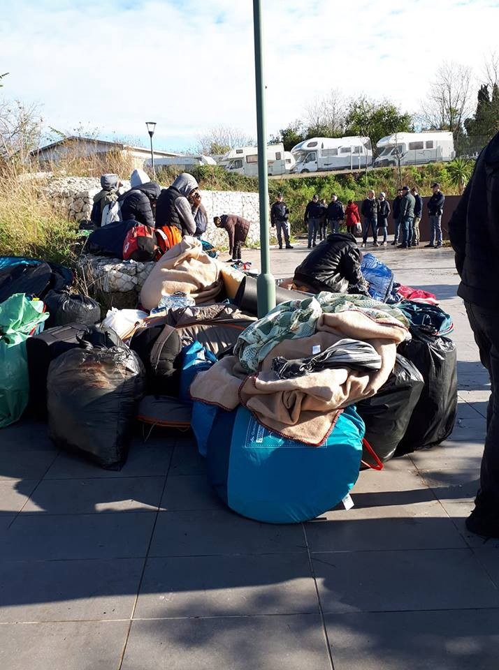
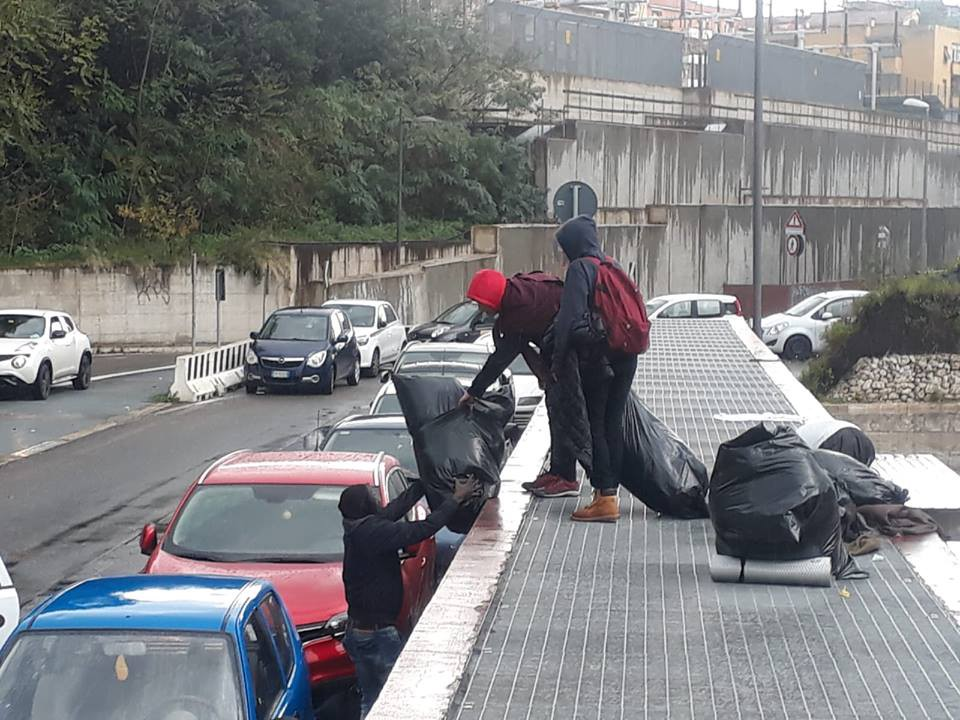
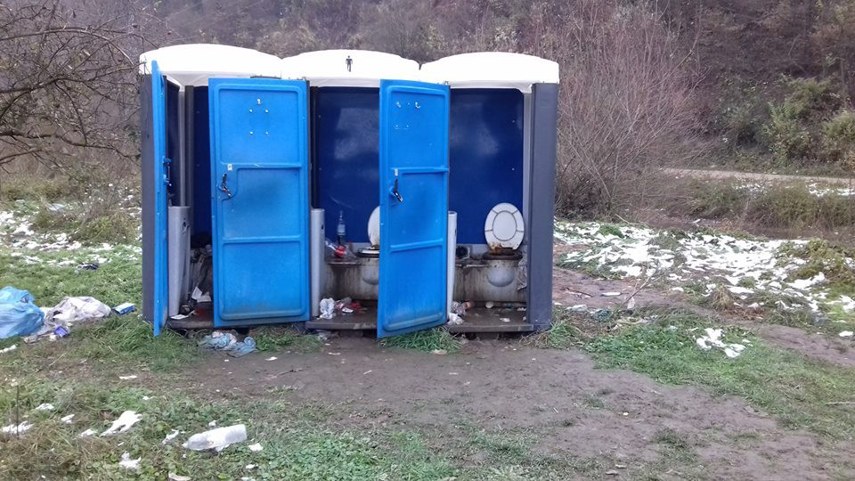
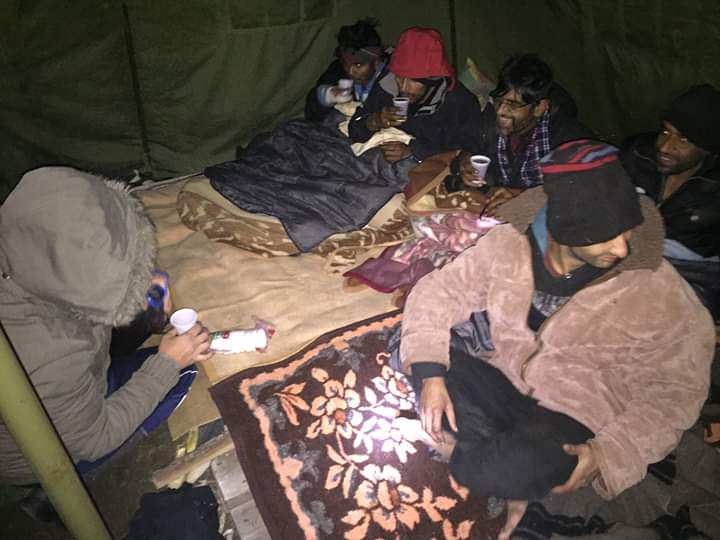
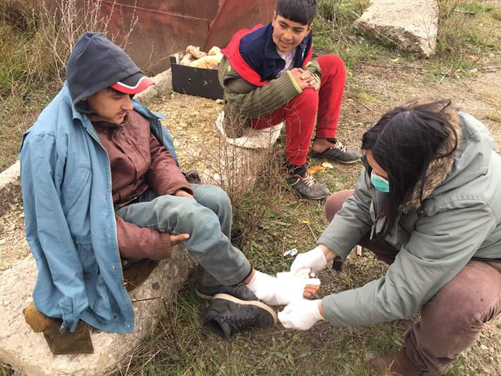
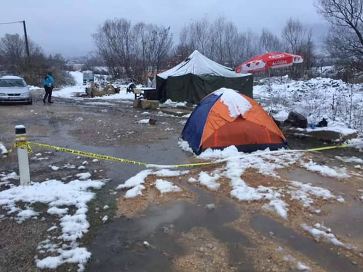
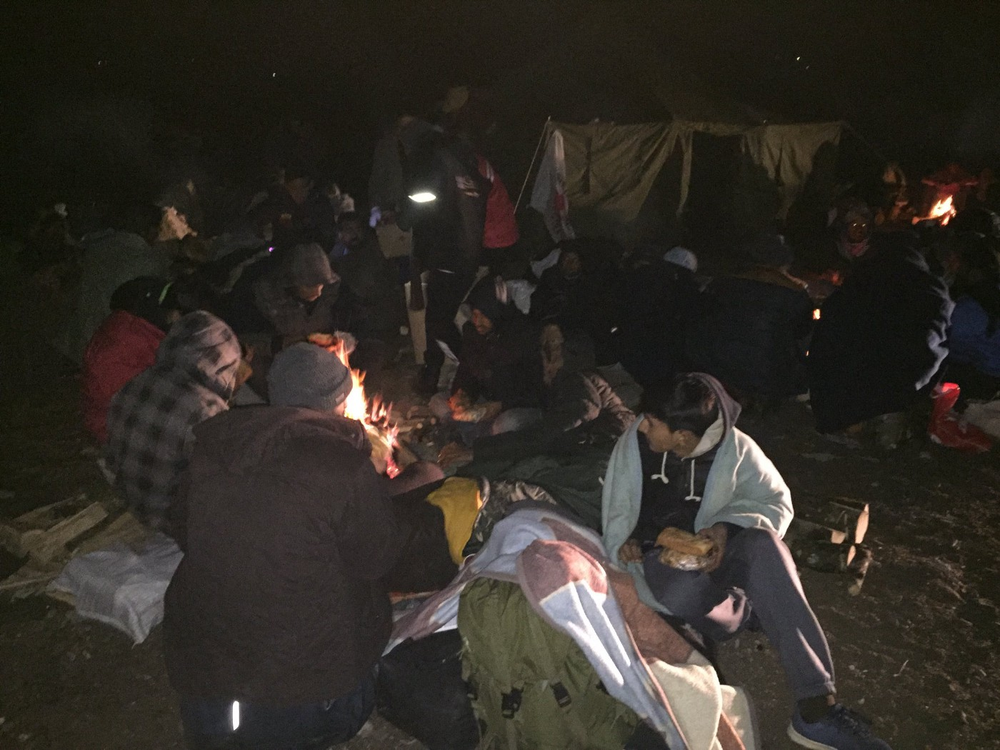

### AYS Daily Digest 21/11/2018: Rome\. Baobab evicted again by local authorities
#### Around 50 people who found shelter at Piazzale Spadolini after the eviction from Piazzale Maslax in Rome are evicted again//Dire living conditions in Moria reported by HRW//New squat to open in Athens needs donations//IOM and UNHCR finally moving people to an indoor shelter near Velika Kladuša//More and more people are being prevented from reaching border areas from Sarajevo//New web portal has been launched, with comprehensive information on asylum procedures\. \.

Credit: Baobab Experince
#### FEATURE

It happened again\. Another eviction\. More frustration\. More anger\. More solidarity\.

On Tuesday 20 November, the 41 people who found shelter from rain at Piazzale Spadolini in Rome, after the big eviction of Baobab centre from Piazzale Maslax just few days before, have again been [evicted](https://www.facebook.com/BaobabExperience/posts/1923677487708994?hc_location=ufi) , in what seems to be a ridiculous rush to destroy solidarity and a nonsensical fury to hurt the most vulnerable, who are not even allowed to find shelter from rain\.

Credit: Baobab Experience

In this case, the personal belongings and blankets of migrants were saved from destruction thanks also to the people who rushed to the location to prevent authorities from additionally damaging those in need of protection\. Police patrolled the whole area during the night, preventing asylum seekers from accessing the place\.

When volunteers and people in solidarity reached Piazzale Spadolini this morning, [policemen were already identifying all the migrants](https://www.facebook.com/BaobabExperience/photos/a.840628946013859/1924596930950383/?type=3&theater) present in the area, impeding the members of the public from getting closer\. Fourteen people, already identified during the previous eviction, were taken to the Questura\.

This morning, activists and people in solidarity wrote a letter directed to the council member, [Laura Baldassarre](https://www.comune.roma.it/web/it/laura-baldassarre.page) , sarcastically responsible for social policies and ironically described as a human rights activist on her personal page at the municipality’s website, who is refusing to find alternative shelters and places at reception centres for those 41 people left sleeping rough\. Since the big eviction of 13 November, Baobab was a victim of two more evictions at Piazzale Spadolini, two evictions in one week\.

> “Among the 41 people \[…\] there are 19 asylum seekers, three people who already have asylum, 11 people with humanitarian protection, two with temporary documents awaiting employment and six people with no documents\. During the week, the SOS \(Sala Operativa Sociale, social services\)—contacted on multiple occasions—declared that it was impossible to host additional people in reception centres, contradicting their previous declarations on 6 November, when they stated that once the first 120 places were filled, an additional 50 places could be found”\. 

A lack of will and communication among authorities is certainly at the very core of the issue, given that for years the tactic implemented has been to delay entrance at the reception system to those who don’t present a regular and permanent address, which, at the same time, is impossible to get if not inserted into the reception system\.

This ridiculous race to defeat the most vulnerable is, at the same time, enhancing solidarity and the determination to fight back against inhumane, fascist policies\.

The AYS Team stands in solidarity with those evicted and with the volunteers and activists who are working tirelessly for the rights of everybody to be respected\.

Read the full letter in Italian [here](https://www.facebook.com/BaobabExperience/photos/a.840628946013859/1925242790885797/?type=3&theater) \.
#### SEA

Nine people lost their lives at sea during a shipwreck on the Western Mediterranean\. Only a teenage boy from Guinea survived the tragedy and was rescued on Monday, reporting that the boat was set adrift for one week at sea with no engine\.

Bad weather conditions and lack of food and water were the major causes of the death of the other people with him; the corpses of two of the victims were recovered off the coast of Cádiz, Spain\.

■■■■■■■■■■■■■■ 
> **[Missing Migrants Project](https://twitter.com/MissingMigrants) @ Twitter Says:** 

> > The remains of two people, a woman and a man, have been recovered off the coast of Cádiz, Spain. It is estimated that seven people remain missing. More than 630 people have lost their lives in the Western Mediterranean since the beginning of the year. [bit.ly/2KnsKzD](http://bit.ly/2KnsKzD) 

> **Tweeted at [2018-11-21 17:15:40](https://twitter.com/missingmigrants/status/1065292672804577280).** 

■■■■■■■■■■■■■■ 

Rescues along the Alborán coast continue as [51 young men](https://twitter.com/salvamentogob/status/1065291772191014912?fbclid=IwAR2j0UrrPm-agAJ-bgufLQLzVLeedbHiqnwDApOvWvydwScBFElKwFA5PLM) were brought to safety today by Salvamento Marítimo\.
#### GREECE

_Arrivals_

61 people landed on Samos in the afternoon\. See [here](https://www.facebook.com/AegeanBoatReport/photos/a.285312485325196/478262166030226/?type=3&theater) \.

_Islands_

New statistics made available by the Greek government are claiming that 2656 people were transported to the mainland in one night\. Perhaps a little bit too drastic to be true?

Living conditions in Moria\.

Human Rights Watch has published their report on the dire living conditions in Moria, after a team visited the camp in October\.

> “In September, the Regional Authority of the Northern Aegean, which is responsible for public health, said the Moria camp posed a threat to public health and the environment due to overcrowding, uncontrolled sewage spills, broken toilet waste pipes, and generally poor hygienic conditions that could speed the spread of infectious disease\. Conditions at the camp remained unsuitable for accommodation even though the regional authority ordered the migration policy minister and Moria camp’s management in early September to improve conditions within 30 days”\. 

One solution was to initiate transferring asylum seekers to the mainland, but, still numbers in Moria, and on the islands in general, are extremely high \(see above\) \. If 6,500 are living at the camp \(three times over its capacity\), we need to think about those approximately 2,000 people living at the Olive Grove, the hill adjacent to the camp, who, even though they have access to the “services” inside the camp during the day, find it extremely difficult at night to make use of them and there is no lighting at all, increasing the danger\.

> “Ahmed, in his early twenties from Mosul, Iraq who has a psychosocial disability, has spent four months at Moria camp\. He left Iraq after losing all his family there\. He showed Human Rights Watch rashes on his arms and legs that he said were caused by unhygienic conditions, as well as cuts on his arms which he said were caused by the anxiety of living in an extremely crowded container\. 

> He shares a two\-meter\-by\-two\-meter space with three unrelated men as a sleeping area, separated from the rest of the container by hanging blankets\. A total of 15 men were accommodated in the container at the time of the visit\. “I have to wait here until 2019 despite being mentally unwell,” Ahmed said\. “I tried to commit suicide\. My friends are protecting me from harming myself\.” 

Huge gaps in psychological and medical care for children and adults are also extremely worrying, as the lack of assistance for sexual and reproductive rights\.

MSF is actively trying to prevent the spread of diseases, at least among children, by carrying on a massive [vaccination campaign](https://twitter.com/MSF_Sea/status/1065189730252464128?fbclid=IwAR0NGhBU0MzsXuu_Y1HgdFuPgVRdgbglB7kjJV4j1ASVbdw2ncGyNH-WLk4) , treating around 2,000 young migrants\.

Read the full report [here](https://www.hrw.org/news/2018/11/21/greece-dire-conditions-asylum-seekers-lesbos?fbclid=IwAR2yuU4VDHMF1vy591EtbTVgkuhi7HN3l-nz_KMomx3x9VyC-0i49v0NgDA) \.

For more testimonies, please see [here](https://twitter.com/rspaegean/status/1065303504074563585?fbclid=IwAR2O1pip1YddwE9e4VdJpfSKZ_MLPrAuZpubykVT1rlAALg65K3b2JGwV9g) \.

_Mainland_

New squat in Athens needs support in order to host up to 50 families\!

Any item, from food and clothing to cutlery and mattresses, is more than welcome\. Please, get in touch if you can help\!

#### BOSNIA

Following AYS’s publication of a series of [photos from the makeshift camp of Velika Kladuša](https://www.facebook.com/areyousyrious/photos/ms.c.eJxFzNkNgEAMA9GOkJ3T9N8YYiPC75M9ZAjVUnoYbr840FJ1htcHggHq0gLfC4GFnMXfiAMdC3aiYQvTIB5FlxtN.bps.a.1148067695342112/1148067885342093/?type=3&theater) after the first snow, IOM and UNHCR, two big international organisations in charge of refugees and migrants in Bosnia \(so far, they have received over eight million euros from the European Union to help in Bosnia\), finally moved the tents from the swampy area\.

A bus came on Wednesday afternoon to take people who voluntarily wanted to go to Miral, a factory given for refugees to use it by the owner\. The people in the camp said another bus was going to come during the night but none came\. IOM seem to have not informed people when they would be coming, so many were in town at the time the bus arrived to drive them\.

There are those who do prefer not to go to Miral and so far it is uncertain if they will have to move in the coming days\. Despite the fact that Miral is a warm facility with access to warm showers and food, some remain concerned that it is unsafe for people of so many different ethnicities to be sleeping in such a large communal space without any privacy\. Many people we spoke to said they would rather stay in their tents in the makeshift field camp with their friends where they seem to feel they have more privacy and security\.

There are approximately 80–100 people who remain in the field camp at the moment\. According to statements, the food distribution stopped there\. It is still provided by the small local restaurant ‘Kod Latana’, cooked and prepared by the locals and refugees themselves\.

About 300 people were already living at this big industrial building, now another 200 have come\. According to the local media, additional big tents will be placed in the same area in order to accommodate even more people, if needed\.

After their visit to the facility, two volunteers from Umino said lunch was served outside the building and that mainly men were present\.

The same organisation reported from Trnovi \(not far from Velika Kladuša\) that a camp opened in May this year, where people live in [inhumane conditions](https://www.facebook.com/umino.org/?tn-str=k*F&hc_location=ufi) and where mobile toilets have not been emptied and cleaned since the opening\!

Credit: Umino

A descriptive video of the situation in Trnovi, before the transfer of residents to Miral factory, can be found [here](https://www.facebook.com/zehida.bihoracodobasic/videos/1332979410172443/?hc_location=ufi) \.

MFS\-Emmaus, an organisation supported by UNHCR in Bosnia, distributed food and clothes with no social or personal contact with the people they were delivering the aid to\. As usual in these situations, we must not forget that with no previous inquiry into the needs and without properly organizing the distribution, the only possible result is a waste of donations and an increasing sense of frustration among asylum seekers\.

AYS keeps receiving more reports about people deciding to go back to Serbia, using the same route along which they came to Bosnia\. Some people are reporting that Bosnian police, especially in the area around Doboj \(North\-East of the country\), are taking people off the trains\. As we also wrote in yesterday’s Digest, we have received reports from the Bijeljina area \(the border with Serbia\) of police confiscating phones and money from the people they stopped and searched, who were allowed to go after these episodes\.

At the same time, asylum seekers are forced off of buses from Sarajevo to Bihać and left on their own in the area near Ključ \(the northwestern part of the country\) \. Moreover, since yesterday, a group of about 60 people is in Velečevo \(in the northwest\), the town where they were stopped and forced off the Sarajevo–Bihać buses\. Locals from nearby Ključ and the Red Cross are providing food, clothes and other needed items\. MSF brought some help, as well as groups of volunteers who came down from Bihać\. Apart from that, according to the local Red Cross, none of the authorities or big international organizations in the area arrived at the site\.

_“People are forced to sleep on the ground, they are being left with no water food or water in a place where there are no toilet facilities nearby or any medical help… Citizens and the Red Cross have been trying to help ever since this practice of taking people off the buses started\. We formed 24\-hour shifts in this area, waiting for the buses and people\. We even had several cases where the police in Bihać arrested people in the city and brought them here for no reason and left them in the field\. We, in the village, have no capacity for take care of the people\. The people who are helping are very tired and out of supplies,”_ a Red Cross volunteer told AYS\.

This unlawful practice in Bosnia is implemented in the way that people are allowed to board buses in Sarajevo, only to be taken off the buses near Ključ\. People have to find their way on their own, buy a bus ticket to go back, or continue walking towards Bihać\. In this particular case, locals collected money to buy tickets to Sarajevo for about 30 people\. The others will have to wait at this point\.

In Sarajevo, where a camp has recently opened and is run by the IOM, people who try to enter the camp and register are often prevented from doing that with no clear explanation\. It is not clear why this happens, and what the IOM’s stance is on that or what the people should do in this situation, bearing in mind that it is the only camp in this part of the country\.
It is hard to tell how long the police in Bosnia will continue this unlawful practice, but what is clear is that a humanitarian catastrophe is in the making\.

Photo: Red Cross Kljuc
#### BALKAN WEATHER REPORT

_MONTENEGRO_

Changeable overcast weather with sunny intervals\. In the north a little cloudy or foggy for most of the day, possibly rain at some places along the coast\. The wind will be weak to moderate from changeable directions\. The lowest temperatures range from 0 to 12C° and the highest from 8 to 19C°\.

_SERBIA_

In the morning, overcast with local rain, possible light snow in the west\. Precipitation will gradually decrease in the afternoon\. The wind will be weak to moderate, strong in places, blowing from the southwest\. The lowest temperature will range from 1 to 4C° and the highest from 3 to 8C°\.

_BH_ 
Overcast in most of the country, in Herzegovina and in southwestern Bosnia the cloud cover will decrease\. The wind will be light, blowing from the north and northeast\. The lowest temperature will range from 2 to 10C° and the highest from 7 to 17C°\.

_CROATIA_ 
Overcast and gloomy inland with intermittent rain\. Fog during the night and in the morning\. Along the coast partly sunny, with more clouds on the north of the coast and possible rain in northern Dalmatia\. The wind inland will be light, with northwestern wind and bura along the coast\. The lowest temperature will range from 0 to 11C° and the highest from 3 to 16C°\.
#### AUSTRIA

#### ITALY

Hundreds of asylum seekers living at the CARA of Mineo \(Catania, Sicily\) have protested this morning by blocking the major connecting road for a few hours in the area\. The protest was triggered by the announcement of cuts of funding to the services of the structure and to transport\.

At the moment, the structure is hosting around 1,500 people, 80 of whom have obtained regular permits and should, therefore, leave the structure, but are refusing to do so if they don’t receive the money they are entitled to, in order to leave the CARA \(the cost of the transport ticket\) \.

> “Siamo migranti, non criminali\. Chiediamo documenti, aiutateci con i biglietti\. Potremo essere buoni per l’Italia” — “We are migrants, not criminals\. We ask for documents, help us with the tickets\. We could be useful for Italy” _\(one of the banners during the protest\)_ 

Apparently, an agreement was reached in the late morning\.

Please, read more [here](https://www.rainews.it/tgr/amp/articoli/2018/11/ContentItem-3fec84ef-b6d5-4eed-a4c4-3f92ad316910.html?wt_mc=2.www.tw.tgrsicilia_ContentItem-3fec84ef-b6d5-4eed-a4c4-3f92ad316910.&wt&__twitter_impression=true&fbclid=IwAR0_NRnPcv6yPKcKNTjAeE_gH136h2CyS67j5FWb3r7aBrx4txoopwVjtHs) \.
#### THE NETHERLANDS

The Ministry of Justice and Security is investigating whether the Immigration and Naturalization Service \(IND\) has acted wrongly in assessing objections from foreign nationals with a residence permit\. According to a whistleblower, the service is not complying with the law and its own internal rules on responding to the objections of status holders\. As a result, dozens of decisions to expel foreign nationals may be invalid\.

The conflict concerns the assessment of objections of status holders who are appealing against decisions by the IND, for example about the withdrawal of their residence status\. The law requires that sensitive issues such as these be assessed by IND officials who were not involved in any earlier decisions, in order to prevent tunnel vision\.

However, according to the whistleblower, he was forced to review forty cases he had previously dealt with\. As a result, the waiting lists at the IND could be eliminated more quickly\.

Read full article in Dutch [here](https://www.nrc.nl/nieuws/2018/11/21/onderzoek-naar-misstanden-ind-a2755950?fbclid=IwAR1KCQPxRTyefpzVFHFtkmIGFfvqVfq3yBkQkh3UxTZ26Ct2k24UKMe58AA) \.
#### GENERAL

A new web portal has been launched with comprehensive information on asylum procedures, work, education, health and other related topics\. It contains information from countries along the route: Croatia, Serbia, Slovenia, Hungary, Austria, Germany, Slovakia and the Czech Republic\.

Check the information provided [here](http://hr.danubecompass.org) \.

**We strive to echo correct news from the ground through collaboration and fairness\.**

**Every effort has been made to credit organizations and individuals with regard to the supply of information, video, and photo material \(in cases where the source wanted to be accredited\) \. Please notify us regarding corrections\.**

**If there’s anything you want to share or comment, contact us through Facebook or write to: areyousyrious@gmail\.com**

_Converted [Medium Post](https://medium.com/are-you-syrious/ays-daily-digest-21-11-2018-rome-baobab-evicted-again-by-local-authorities-2dfc58768bd3) by [ZMediumToMarkdown](https://github.com/ZhgChgLi/ZMediumToMarkdown)._
