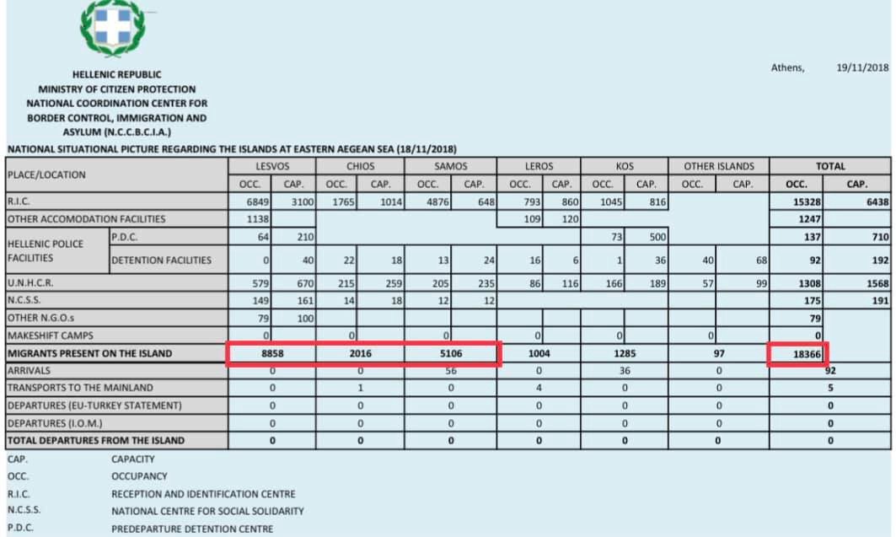
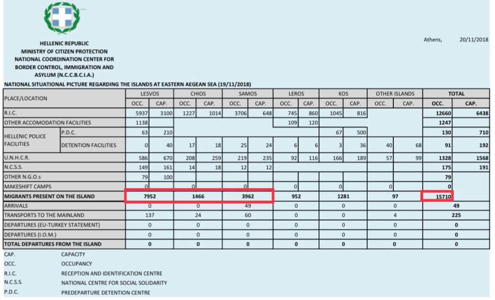
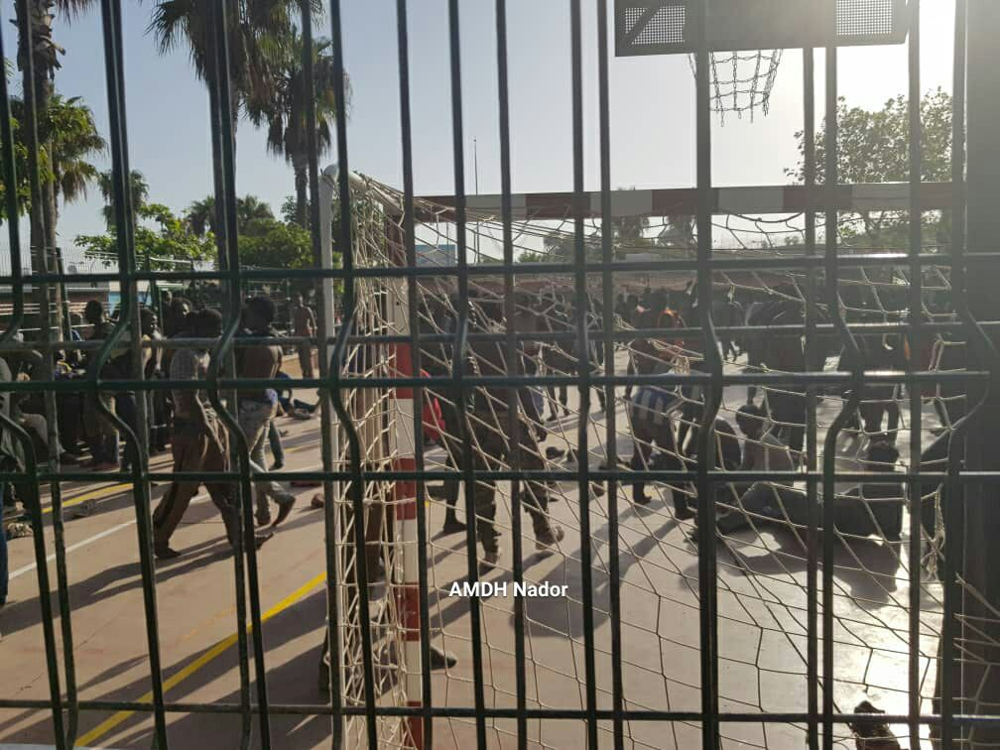
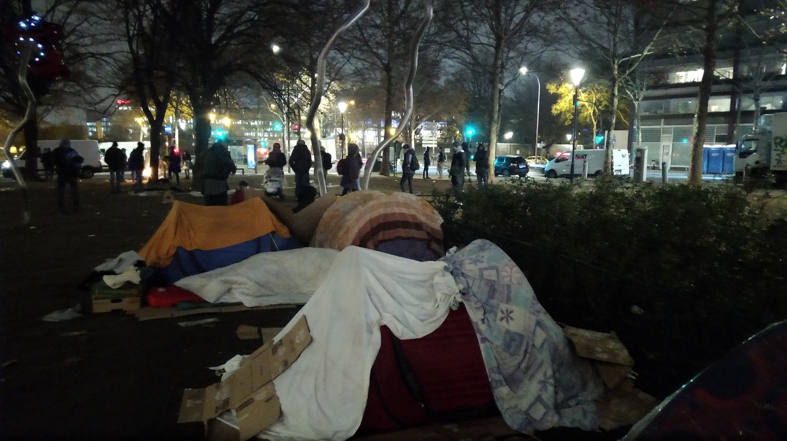
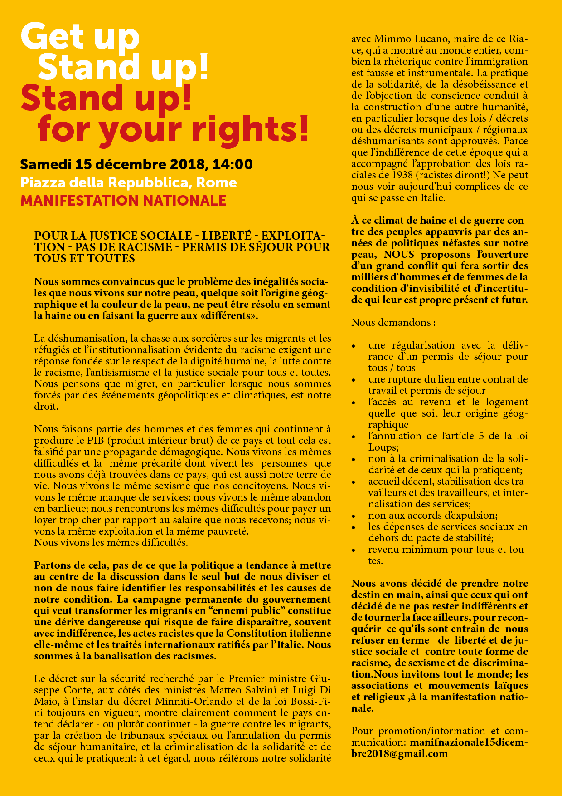

### AYS Daily Digest 22/11/18: Greek Interior ministry ‘deletes’ refugees from islands

_Illegal push\-back in Morocco // Return of civilian SAR ships // Balkan weather report // Racist Austrian law overturned // Sleeping rough in Paris // Evictions in Italy // And more news…_

](assets/6a88ab14ce17/1*uRxR0KExWTPj8IKe2J-A4A.jpeg)

Refugees protesting in Paris\. Signs read — “It’s cold\. The Red Cross says stay outside\.” And, “I want to go to school\!” Photo Credit: [Agathe Nadimi](https://www.facebook.com/agathe.nadimi?__tn__=%2CdCH-R-R&eid=ARBuY8BWPnJ4ciR6I_VXDfR_YKuvLpzkHCok5VAJw69mqI_qgC3pr4h-bNnct6IVygqqXcdxDFQLxJGB&hc_ref=ARQSb4l2OUWUhVnUFaVRKZqYjkqvZ7D-gZSwzZbqgsPYMx245BhcCgxqJ4QewJrPOfw&fref=nf&hc_location=group)
### FEATURE: The transfers that didn’t happen

According to [data published by Greek authorities](https://www.aplotaria.gr/refugees-as-numbers/?fbclid=IwAR2uExDFy22N66eRn2vXguGUfQVpmVn4OoXbm0esZi3YAym5MtW7FExNjVc) , from the 19th to the 20th of November, 2,656 disappeared from the island detention camps on Chios, Samos, and Lesvos\. Such a massive decongestion of the islands would certainly be welcome news, and help ease the awful conditions in the Aegean detention camps\. However, there is a problem with these figures showing an exodus of people from the islands — they appear to be made up\. The official figures only show 5 people being transferred off the Aegean islands on the 19th, the remaining 2,651 seem to have simply dissaperaed\.

Why are the Greek authorities publishing this massive reduction in numbers? Are they attempting to falsely show themselves as working to improve conditions on the islands? Or is this an attempt to correct their inflated estimate of people on the island? As the AYS and other groups have pointed out, the number of people on the islands is often inflated by the Greek interior ministry\. However, the Greek ministry’s estimate is now lower than that of Aegean Boat Report \( [17,877 people on 18/11](https://www.facebook.com/AegeanBoatReport/photos/a.285312485325196/477613589428417/?type=3&theater) \), which is compiled from both UNHCR figures and those provided by independent groups and volunteers\.

Regardless of the story behind the ‘deleted’ people, it is representive of a sinister approach endorsed by both the Greek authorities and the UNHCR and IOM: the attempt to deal with humanitarian crises through data and statistics\. Rather than working towards with the basic human needs of refugees, the UNHCR and Greek authorities have chosen to focus on their self\-serving data collection and reports\. It is telling that the Greek interior ministy would simply remove over 2,500 people from their estimates without comment\. The lack of clarity or accuracy in reports by the Greek authorities are representative of their disregard for refugees’ lives\. As the [NoBorders network wrote](https://www.facebook.com/groups/1652972374920129/permalink/2121391194744909/) in regards to this story, “\[these organizations\] deal with refugees and immigrants as lifeless numbers, who can be ‘disappeared’ through a report on a simple piece of paper\.”

Questionable data by the Greek interior ministry\. From figure one to two, you can see the exaggerated reduction in population\. Image: Aegean Boat Report\.
### MOROCCO
#### Human rights group targets illegal push\-backs to Morocco

In order to fight illegal push\-backs, the Moroccan Association for Human Rights \(AMDH\) is calling for refugees who were pushed back from Spain to share their stories\. According to the group, dozens of people have been turned back from Spain in recent weeks without having the opportunity to apply for asylum\. If you would like to speak with the group you can contact them on [their page](https://www.facebook.com/AmdhNador/?__tn__=%2CdkCH-R-R&eid=ARAyu0VYIlUUuHh73Rtu9v39N3jk7UDWzQafqnxzamlj2mtf-FE052E55MBOhQmYKerrQRMEs5BjcNiB&hc_ref=ARQ9nqQWr1Kt8fs6ywHmnywgKIGCkEqQ6FM7zWlhwA0bxce56PMSGkLUxwwFi46N5QI&fref=nf&hc_location=group) \.

AMDH also made accusations against the Moroccan authorities in Nador this week, claiming that the police are deliberately arresting migrants and charging them as traffickers when they know the charges are false\. The group claims police bribery is widespread, and that the bigger people smugglers walk free, while ordinary people trying to flee to safety are arrested\. “Meanwhile, the true smugglers are spared and stay protected, continuing to lead the beautiful life in Casablanca, Rabat, Tangier and other cities,” writes the group\.

Photo Credit: AMDH Nador
### SEA
#### Return of civilian SAR ships\!

After five months of being prevented from doing its work, the SAR vessel Sea\-Watch 3 is resuming its mission\. The Italian search ship Mare Jono and the Open Arms ship also [resumed operations](https://twitter.com/RescueMed/status/1065641570383351813?fbclid=IwAR2x0GUIx2_aFbckqTBUXtl8Zm3YP_PC7w0CJD9xJ-daeOaIaVUdhAhb5Ys) in the Central Mediterranean today\.

The SMH rescue ship Aita Mari is still awaiting permission from the Spanish interior minister to resume operations, but according to communications with officials, they will be able to set sail soon\.
#### Rescues in the Alboran Sea, 14 missing

The SMH sea rescue organization rescued 590 people in the Alboran Sea today\. According to the people who were rescued from a sinking dinghy, 14 people are still missing\.
### GREECE
#### New arrivals \(numbers from Aegean Boat Report\)

39 people arrived on Chios today \(13 minors, five women, and 21 men\) \.

One boat arrived on Lesvos in the early morning carrying 16 people \(no breakdown available\) \.

One boat landed on Farmakonisi during the night, transported to Leros this morning\. It was carrying 30 people \(no breakdown available\) \.

A boat was stopped by the Turkish Coast Guard outside Davutlar, Kusadasi, last night at 21:20\. The boat was heading towards Samos, and was carrying 62 people \(25 children, 15 women, and 22 men\) \.
#### Volunteer Greek language teachers needed

The Greek Forum of Refugees is looking for volunteer Greek language teachers to teach one or two lessons a week in Exarchia, with full teaching support provided\. Please [contact the organization](https://www.facebook.com/Greekforumofrefugees/) for more details\.
### BALKAN WEATHER REPORT

_\(forecast for Friday 23\.11\)_
#### MONTENEGRO

Lightly to moderately cloudy with longer sunny intervals\. Fog in the basins during the morning\. The wind will be weak to moderate from changing directions\. The lowest temperature will be from \-2 to 10℃ and the highest daily from 9 to 20℃\.
#### SERBIA

In the morning, it will be foggy in the valleys and alongside the rivers in the west and south which can sometimes stay in afternoon\. From mid\-day, expect partial clearing\. In Timočka Krajina, it will be cold and cloudy throughout the day\. The wind will be weak to moderate from the southeast,while later in the afternoon stronger and at night strong locally\. The lowest temperature will be from 0 to 4℃, the highest daily from 4 to 11℃\.
#### BiH

In most part of the country cloudy, in Herzegovina and the southwest of Bosnia moderately cloudy\. The wind will be weak blowing from the north and northeast\. The lowest temperature will be from 1 to 8℃ and highest daily for, 6 to 16℃\.
#### CROATIA

Land inwards, predominantly cloudy, in the afternoon some sunny periods\. Locally there will be fog especially in the morning and there may also be some light rain\. Alongside the coast, partly sunny in the morning, locally predominantly sunny with chance of some rain\. In the afternoon it will gradually become cloudy with locally rain in the evening and during the night\. The wind will be mostly weak, alongside the coast moderate Bura and at the end of the day a southern wind\. The lowest temperate will be from \-1 to 13℃ and the highest daily from 4 to 17℃\.
### AUSTRIA

The EU court in Luxembourg announced this week that it is [overturning Austria’s 2015 legislation](https://euobserver.com/tickers/143469?fbclid=IwAR0FpUNLh9efZio9VBZkLZwx4atiXiHX2Q7brEGmAA5h_yK36UCLo-xli5Q) which imposed limits on welfare for asylum seekers, blocked employment for many refugees, and made it legal for police to take refugee’s cellphones and valuables\.
### FRANCE
#### Sleeping rough in Paris

In Paris it is now regularly \-3℃ or lower during the night\. There are still hundreds of people sleeping on the streets, including families, children, and even infants\. One independent volunteer described the situation this week:

Sleeping rough in Paris\. Photo: Danika Jurisic

> Many people are forced to sleep on the muddy ground, in the park\. Only few have tents\. Families are in the middle of the park, around them are groups of single men, refugees who don’t have a family but they stick together in packs\. Some of them are very violent and their behavior, especially when people are using drugs or alcohol, intimidate all of the children on the camp\. 

> A few nights ago, I found a girl on the camp, she must be 7 or younger, with the most horrific cough I have ever heard\. She was coughing her lungs out, she is really sick\. This morning , almost a week later, she has finally seen a doctor\. She came with a large family, all of her 3 siblings are younger than she is\. Her parents didn’t want to leave the grandmother, so they are now family of 7, sleeping on the street, waiting for the housing and asylum\. They are almost impossible to house overnight in Parisians solidarity network, since no one has a place for 7 people\. 

Volunteers in the capital need help\. If you can help lodge people for a night, please contact [Utopia 56](https://www.facebook.com/asso.utopia56/) \. As the temperature drops, safe spaces for people to sleep are needed more than ever\. If you have wooden pallets to donate, or tents or warm winter clothing contact [Danika](https://www.facebook.com/profile.php?id=100009499466124&__tn__=%2CdCH-R-R&eid=ARBzDOmtFOTKEywdhYkG4uuRzucLr-pXDQmp7CuyvTlQhaNOARxVaGNj6S9VWjaNKXb4iMxJKa3RzEe4&hc_ref=ARRWefxc-kQZH5xFpFTv2aO8CCbMptMUoUxJnBFL3G5WkeaNyX4j9svMXv3092OHebo&fref=nf&hc_location=group) \.

Independent volunteer Lola Siran shared a similar story about vulnerable people being left on the streets today:

> Yesterday night temperatures were below 0 degrees — like they have been for most of the week\. I couldn’t help but think of the people sleeping rough outside when I received a call from R\., 19\. 

> “I need your help\. Can a woman sleep in your home? Just for tonight\.” 

> The cold is deadly and there’s no way her — or anyone else — should be left sleeping outside\. With these temperatures, another night spent outside can mean life or death\. 

> I guess they don’t see it this way there\. Or that they don’t care enough to see it because it’s dramatically obvious\. People will die this winter if the government doesn’t take its responsibilities\. 

There will be a demonstration in Paris on November 23rd to protest the abandonment of minors\. Find the details below\.

#### Authorities deny minors protection in Paris

Not only are many minors and children living on the streets, but these young people are frequently deprived of their rights when they are evaluated by social assistance workers\. Minors are frequently being categorized as adults by simply because of a lack of avaialble accommodation, according to the volunteer group [Solidarity Migrants Wilson](https://www.facebook.com/permalink.php?story_fbid=1026910847509687&id=598228360377940) \. For example, if there are ten beds available in a shelter, and a long line of minors waiting to be seen, only ten people will be recognized as minors, and the others arbitrarily sent away\.
#### Have you seen this man?

 \.](assets/6a88ab14ce17/1*JRad_MswxVRYNCdf9qSOJA.png)

Ahmad\-Issa Ali went missing in the Paris about three motnhs ago\. If you have any information, please contact the phoen number listed on the poster, or message to [Solidarity Migrants Wilson](https://www.facebook.com/Solidarité-migrants-Wilson-598228360377940/?__tn__=%2CdkCH-R-R&eid=ARARCbHOh_JAxWyDu81mgo4fubWQboIY5axWe6H8ERXfL56yidIuy1mQ86scTPYBbI5sRJ7KOHSULKfB&hc_ref=ARQ7HOgSDAEg7cYZiyHhcM5XMdJco00NIXUFya_FM4AU969cjYRtlz_p2TeOnP7jaA8) \.
### ITALY
#### More cruel evictions

36 people in Trento were kicked out of an emergency shelter on Saturday this past week\. The shelter had been provided by the town administration, to accommodate people who were waiting for a space in the reception center\. Local organizations are demanding that shelter is provided for the people who were kicked out, and that the authorities in the county stop telling people that they need to have their own accommodation before applying for asylum \(which is a lie\) \. You can read the full story in Italian [here](https://www.facebook.com/notes/assemblea-antirazzista-trento/laccoglienza-è-un-diritto-fondamentale/204922623640158/) \.
#### Upcoming demonstration in Rome

There will be a national demonstration in Rome on December 15th for the rights of refugees\. Find the details below\.

### GERMANY

**We strive to echo correct news from the ground through collaboration and fairness\.**

**Every effort has been made to credit organizations and individuals with regard to the supply of information, video, and photo material \(in cases where the source wanted to be accredited\) \. Please notify us regarding corrections\.**

**If there’s anything you want to share or comment, contact us through Facebook or write to: areyousyrious@gmail\.com**

_Converted [Medium Post](https://medium.com/are-you-syrious/ays-daily-digest-22-11-18-greek-interior-ministry-deletes-refugees-from-islands-6a88ab14ce17) by [ZMediumToMarkdown](https://github.com/ZhgChgLi/ZMediumToMarkdown)._
