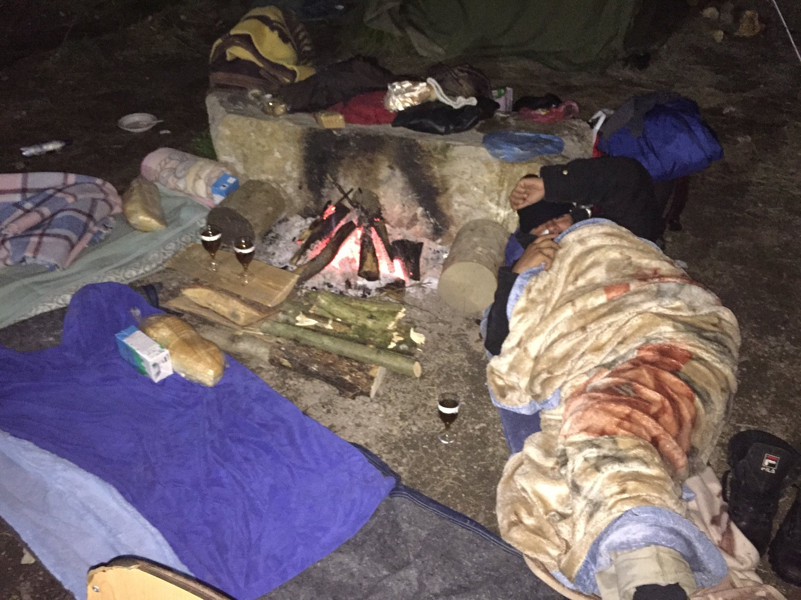
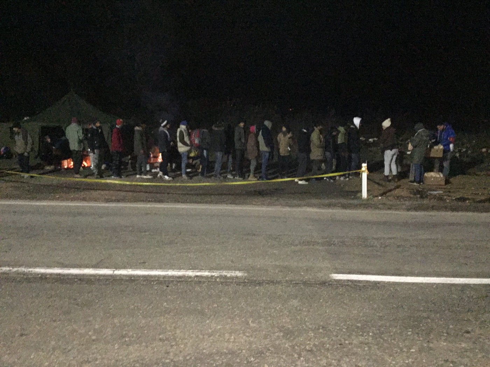
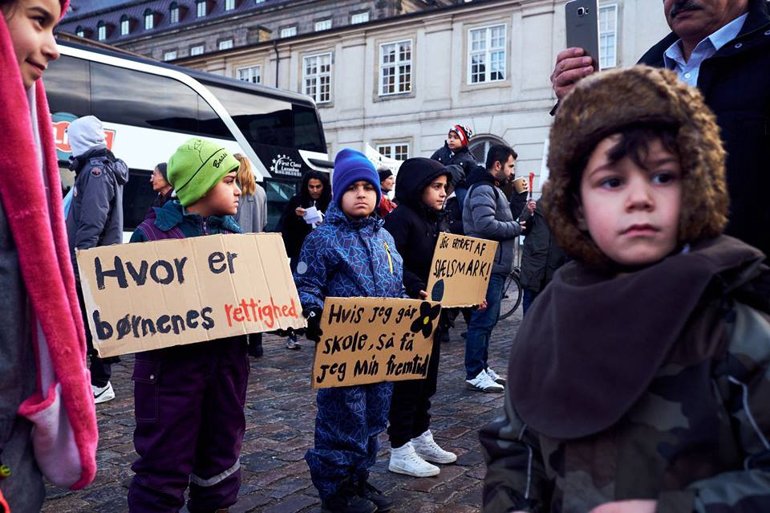

### AYS Daily Digest 23/11/18: After Protracted Battle, 3 Rescue Boats Return to Mediterranean

_Armed gangs extort migrants in Morocco_ // _What life really looks like for refugee in Calais /_ / _Refugee Community Kitchen goes to Belgium\! // No Deportations to Syria, says Seehofer // Asylum seekers poison themselves for fear of deportation // Demonstrations for refugee children’s rights in Copenhagen // and more news…_

](assets/c2ba6b891acf/1*Q6_Cc1-0h5kBtvbvrhUMIA.jpeg)

Bearing witness\. Credit: [Mediterranea Saving Humans](https://www.facebook.com/Mediterranearescue/photos/a.275129009774997/292455398042358/?type=3&theater)
### Feature — \#UNITED4MED

**“Join us, another world is possible\.”**

Open Arms, Mediterranea, and Sea\-Watch 3 will return to sea to continue their search\-and\-rescue operations, the three NGO rescue ships announced today\. In the absence of the European Union, these civilian organizations — from Spain, Italy, and Germany, respectively — will continue their vital lifesaving mission in the deadly waters of the Mediterranean\. Crucially, they will also there to bear witness to potential human rights violations and criminal acts of neglect by the coast guard and cargo ships in the region\. The Moonbird rescue helicopter [will be joining](https://twitter.com/seawatch_intl/status/1065930517382660097?fbclid=IwAR1-eYPJl0i2H6pOPM280kc5LxlHYYqdXeGKdudeVT_J-56k-vzlTNcbgNw) their efforts\.

“We are setting a good example and give a European response to the state\-imposed state of emergency in the Mediterranean, which is committed to the ideals of solidarity and human rights,” said Johannes Bayer, Head of Operations on the Sea\-Watch 3, in a statement\.

He continued, “”We do not want to live in a Europe that has turned its maritime border into a mass grave as a deterrent and has its Libyan bouncers do the dirty work\. We see ourselves as part of an alliance for a humane Europe at sea, on land and in the air, a Europe of safe havens and cities and communities based on solidarity\. **As long as the EU lets people drown in the Mediterranean, we will continue to go to sea\.”**

The three NGOs have published a joint manifesto under the heading \#United4Med, which is available in full here \(Italian\):

The work that civilian rescue ships do is absolutely vital — [29,523 lives](https://www.msf.org/sinister-attacks-italian-authorities-lifesaving-search-and-rescue-mediterranean) have been have been saved by the Aquarius alone since 2016\. The three ships’ announcement could not have come at a better time\. [70%](https://twitter.com/MSF/status/1066104108011053056?fbclid=IwAR3nxoLLVNcbwvOizeV9ftgxIIcYXRD6YFWeYuDuDPiB5m4vDzFRqZm3IPg) of deaths in the Mediterranean this year have occurred since various EU policies criminalizing civilian rescue operations have cut down on the number of NGO ships in Mediterranean waters\. The Aquarius is currently kneecapped in Marseille\.

**In September 2018, a month during which nearly no civilian rescue boats were operational in the Mediterranean, one in five people who attempted the crossing drowned, according to the Italian Institute for Political Studies’ most recent [report](https://www.ispionline.it/sites/default/files/pubblicazioni/report_med2018.pdf) \.**

The grave necessity of humanitarian rescue operations in the Mediterranean is illustrated nearly every day\. Today was no exception\. When a boat with 120 refugees aboard began to sink, at least 30 miles off the Libyan coast, Libyan and Italian maritime operations both ignored Alarmphone’s appeal for aid; the Italian Search and Rescue operation claimed that the boat was out of its jurisdiction and failed to send a mayday call to cargo ships in the area\. Only after Mediterranea and Open Arms — which was 8 hours away at the time — were alerted to the situation and jumped into action did the authorities finally act\. Hours had passed\. During that time, people drowned\.

Lorenzo D’Agostino posted a Twitter [thread](https://twitter.com/lorenzodago/status/1066138683286409216?fbclid=IwAR3DNGdThJzILYh0nYgoGd3HlvuwRZQu6VczWloM1anuE-q-Gb9Yxz8rG_o) detailing the story as it unfolded\. His last dispatch: “\#Mediterranea says Rome has confirmed to them that the Libyan Coast Guard has taken over the rescue operations\. No reports of casualties\. Incredibly with 120 lives at stake, the whole thing unfolded in complete radio silence\.”
### Libya

In the wake of Libyan Security Forces’ forcible disembarkation of 81 asylum seekers from a Panamanian cargo ship docked in the port of Misrata, MSF [reports](https://www.msf.org/forced-disembarkation-81-refugees-and-migrants-misrata-libya) that the organization was prevented from accessing the area and treating the passengers, a group which included minors and survivors of torture\.

“We are appalled to see that after 10 days, despite our repeated calls to avoid a violent outcome, no compromise was reached to implement an alternative to detention,” MSF wrote\.

“What happened instead has once again demonstrated a failure to provide much\-needed protection for people seeking safety\. The reality today is that people being intercepted at sea and brought back to Libyan shores in violation of international law and maritime conventions are left with no other option than indefinite arbitrary detention\.”

■■■■■■■■■■■■■■ 
> **[MSF International](https://twitter.com/MSF) @ Twitter Says:** 

> > #LIBYA | People onboard the #Nivin boat should NOT have been returned to Libya but brought to a port of safety in accordance with international &amp; maritime laws.

Libya cannot be considered a port of safety as stated by UN @[Refugees](https://twitter.com/Refugees) official positioning. 

[bit.ly/2P111W6](http://bit.ly/2P111W6) 

> **Tweeted at [2018-11-23 09:20:00](https://twitter.com/msf/status/1065897744332742656).** 

■■■■■■■■■■■■■■ 

### Morocco

AMDH Nador [reports](https://www.facebook.com/AmdhNador/posts/2222555354623394) that there is an armed gang stopping cars on the Guechadia bridge and demanding money from any migrants they find\. They claim that the Moroccan authorities are doing absolutely nothing to stop this extortion\. Not much more information at present\.
### Italy

“Italy’s proposed tightening of immigration rules will have a serious impact on migrants’ lives, and are of grave concern,” say UN experts on human rights, freedom of expression, trafficking, torture, and the rights of the child\. They note, in particular, “public discourse unashamedly embracing racist and xenophobic anti\-immigrant and anti\-foreigner rhetoric” as well as “criminalisation of the work of migrant rights defenders” — two tried\-and\-true tactics of the new government\.

Here is the full statement from the UN special rapporteurs on the threat to migrants’ rights in Italy:

### Bosnia & Herzegovina

For seventh day in a row, a group of people \(about 30 now, after others left for Sarajevo\) is living out in the open, by the road near the city of Kljuc, Bosnia\. Kljuc is the city half way from Sarajevo to Bihac\. On October 22nd, at the meeting where the state minister for security \(responsible for asylum seekers\) and the head of the IOM BiH were present, the authorities in Bihac decided to apply a very discriminatory and unlawful practice and limit freedom of movement for asylum seekers in Bosnia\. Their explanation is that the Bihac area, including Velika Kladusa, where most of the people who are currently in Bosnia gravitate to, do not have capacity to take more people in\.

Instead of increasing capacity, they decided to start taking people off trains and busses coming from Sarajevo\. At the same time, police in Bihac are disregarding all the laws, by stopping people on the streets and sending them to Kljuc, even if they are registered to live in one of the camps near Bihac\. So far, nobody is trying to stop this practice that is against local and international laws\.

Nevertheless, people in Kljuc, after being taken off the busses, are left alone by the road\. Fortunately, there are people in the area providing assistance\. Self organized groups, with the help of the small local Red Cross, are providing food and NFI for people\. They also collected wood so that the affected people could make fires, in order to keep as warm as it is possible in the circumstances\. On Friday, for the first time after 7 days, the UNHCR came to visit people who are stranded there\. The IOM has also been coming to take the most vulnerable people, leaving the others without even trying to help\.

Officially, people are allowed to go back to Sarajevo but they do not have money for the another bus ticket\. Locals collected money for about 30 of them, but one more group stayed\. Locals also provide 3 meals a day\. Yesterday the group issued a public statement suggesting that everybody who wants to help should coordinate with the [local Red Cross](https://www.facebook.com/profile.php?id=100009318317491) so the food is not wasted\. At the moment, they have enough help and supplies\.

Red Cross Kljuc\.

At the moment, the responsibility for asylum seekers procedures is held by the state Ministry of Security, while the IOM and the UNHCR are responsible for all other issues related to people on the move in Bosnia\. They distribute even financial donations directed to the state from big donors, including over 8 million euros from the European Commission\. The public in Bosnia do not have information on why the IOM and UNHCR have entirely taken this role over from the state\.
### France

CALAIS —

“They know there are refugees here\. But they pretend there are no refugees\.” Uttered as one young asylum seeker leads a camera man through the underbrush towards his home for the night, this statement strikes at the heart of what’s so infuriating about the current situation in Calais: the French government’s refusal to publicly reckon with the reality that refugees are still coming to the area\. Of course, this isn’t to say that refugees are being left in peace\. Far from it — they are hounded day and night by police, who slash their shoes, crush their phones, and steal their camping tents\. But all of this is done quietly, out of sight from the media and even ordinary French civilians who might be shocked at the inhumane acts being committed in their name\.

In collaboration with people living rough in Calais, Refugee Info Bus has released a new short film that depicts the current conditions asylum seekers are facing in Northern France\. Watch it below:

PARIS —

The situation in Porte D’Aubervilliers remains catastrophic, with families and children sleeping rough as temperatures drop, the Hummah Islamiya Association [reports](https://www.facebook.com/HummahIslamiya/posts/2282307738659459?hc_location=ufi) \. The organization notes that there is no reason that asylum seekers must spend the winter nights outside — there are enough gyms and public buildings to shelter all of these people — and exhorts other aid groups to put aside egotism and work together to find more long\-term solutions for the people they aim to serve\.

 a](assets/c2ba6b891acf/1*wyCwnHa2lKxZuBNfO73ZdA.jpeg)

Sleeping rough at Porte D’Aubervilliers\. Credit: [Hummah Islamiy](https://www.facebook.com/HummahIslamiya/posts/2282307738659459?hc_location=ufi) a

Extremely nasty weather in Paris at the moment — Refugee Ground Support reports that it has been [pouring tonight](https://www.facebook.com/PRGS.team/videos/2256249967990903/?hc_location=ufi) after minus\-4 degree weather earlier this week\.

An appeal from Refugee Aid Network — “Things in Paris are truly horrific\. 1500 people sleeping under bridges and on the pavement in freezing temperatures\. This includes families and minors\. We need your help to help them\.” Donate or find out more information [here](https://www.facebook.com/groups/P2PParis/permalink/1953355704751294/?hc_location=ufi) \.
### Belgium

Amidst the Refugee Community Kitchen’s dedicated and tireless work in Calais, they’ve found time to make the trip to Brussels once a week to deliver a much\-needed meal to asylum seekers sleeping rough there\.

### Germany

After considerable deliberation over Germany’s ban on deportations to Syria, which is currently up for renewal, Interior Minister Horst Seehofer announced that the policy will continue at least through the end of 2018\. Germany’s various foreign ministers will discuss a potential extension at their annual conference next week\.

Germany continues to deport asylum seekers to Afghanistan, despite ample evidence that the country is incredibly unsafe\. The result of this misguided policy: according to [European Citizens Against Deportation to Afghanistan](https://www.facebook.com/ecada2017/posts/2189274844621843) , it appears that a number of asylum seekers living in the “first reception camp” in Boosteldt have voluntarily ingested a poisonous substance in the past week with the belief that it would prevent their deportation\. The fact that asylum seekers would rather poison themselves and risk injury or even death than return to their country speaks volumes about the conditions that await them at home\.

ECADA’s message to asylum seekers :

> Inflicting self\-harm on you will not stop you bring deported, but may damage your health permanently\. If you are [\#Afghan](https://www.facebook.com/hashtag/afghan?source=feed_text&__xts__%5B0%5D=68.ARAaoFX7AbrcknW74JquHiY2NHkOCkUQYS_Wou0soxLrPt9rPFGEfhOcpHz5-481JbEww1Y0FsKldPhrOswfAoigtOPJSAJIIM2Mccozc-0HjYmJm_mKlirN-WUhlmXMSWCVEOxtvsjgzdSw-Q0WcT0BYEFr7ypKjnulRfqMwJKPdhoQTXanE8-67zyGTtRJb2pNluCUOgKH3ZNLq2KOrwovda4xwvQ2rk53lLAVTONmClnqSFhzv7xJ0VXIz0DLeNdNLMW0XYr0x57owP2-cTUCBABfFQaaG61AM1H7IUCqOnu6v_7bpAYgMbkEp4L12U_Rwm9fxTVL3T3XvvH__gV49Kmy&__tn__=%2ANK-R) in Schleswig\-Holstein, you do NOT HAVE TO FEAR deportation, unless you have a criminal record with the police\. Instead of doing unreflected damage to yourself, do go and seek legal advice with the Flüchtlingsrat \(link in the comments\) \. If you feel stressed out and panicked, speak to your local doctor or go to the nearest hospital and tell them you want to be taken up in the psychiatric ward\. If you feel that everything is too much, klick to the comment section below for helplines in European countries\. In Germany, dial 0800 1110222 for free\. 

### The Netherlands

](assets/c2ba6b891acf/1*M7RSZjP036IPmAIuHup-SA.jpeg)

The List\. Photo Credit: [Friesland\.nl](https://www.friesland.nl/en/european-capital-of-culture/calendar/4287273974/the-list?fbclid=IwAR3FlkmSCx7Tf916NqCuRQVi5mkCmBw1qr4zuKFY93TvFO43xgZ5JTKW2u0)

The List, an exhaustive compilation of documented refugee deaths attributable to Fortress Europe since 1993, will be displayed in Leeuwarden until November 25th\.

The List is up\-to\-date as of September 30, 2018 and includes nearly 36,000 deaths\. It currently spans 22 full\-sized **walls,** according to United Against Refugee Deaths\.

You can find more images of The List on display around the world [here](http://unitedagainstrefugeedeaths.eu/homepage/photo-gallery-actions-with-the-list/?fbclid=IwAR33mIvBPceOxig6x9g1v32y1RBy5bEJapsDiUoQu-bduCkuZC7GaO-gvCs) \.
### Denmark

Children at the first protest\. Photo credit: Tobias Nilsson

Activists living in the Sjælsmark deportation camp have organized a series of demonstrations in order to call attention to the atrocious conditions facing children living in the camp\. The second demonstration will take place next week on **Tuesday, November 27th in front of the Danish Immigration Service, Ryesgade 53, Copenhagen\.**

The demands are as follows:

Close Sjælsmark\!

> Access to Danish schools/kindergardens\!
 

> Change of food system\!
 

> Access to a shared kitchen where the residents can cook themselves \!
 

> Better health care\!
 

> Reopening of cases after maximum 12 months\!
 

> Permission to work/praktik/education\!
 

> Pocket money again\!
 

> Clothes not just every six months\! 

Find more information on the Facebook [event](https://www.facebook.com/events/793681107629582/) \.
### U\.K\.

Eight migrants have been transferred to British shores after the dinghy carrying them was sighted in the waters off of Kent, the BBC [reports](https://www.bbc.com/news/uk-england-kent-46320413?fbclid=IwAR2cXfaWqHzgJjAdqSF5i4N88hzpFz5SaTig2ODFKV89sNkNdGOpUHctyu0) \. Given the danger of the Channel crossing, most people who hope to get to the U\.K\. stow away on lorries, but in recent months more and more asylum seekers have been attempting to traverse the Channel by boat\. An estimated 50 people attempted the crossing last week alone, according to one solidarity worker\.

**We strive to echo correct news from the ground through collaboration and fairness\.**

**Every effort has been made to credit organizations and individuals with regard to the supply of information, video, and photo material \(in cases where the source wanted to be accredited\) \. Please notify us regarding corrections\.**

**If there’s anything you want to share or comment, contact us through Facebook or write to: areyousyrious@gmail\.com**

_Converted [Medium Post](https://medium.com/are-you-syrious/ays-daily-digest-23-11-18-after-protracted-battle-3-rescue-boats-return-to-mediterranean-c2ba6b891acf) by [ZMediumToMarkdown](https://github.com/ZhgChgLi/ZMediumToMarkdown)._
