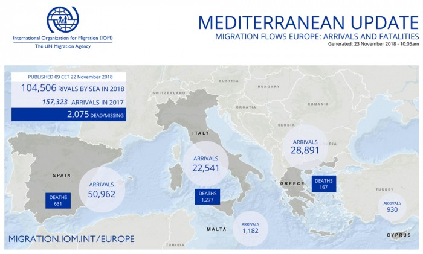
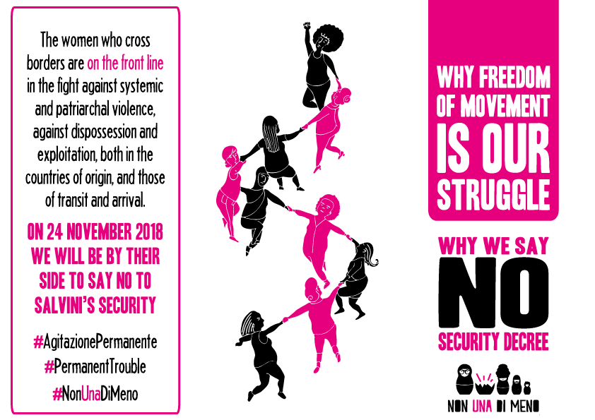
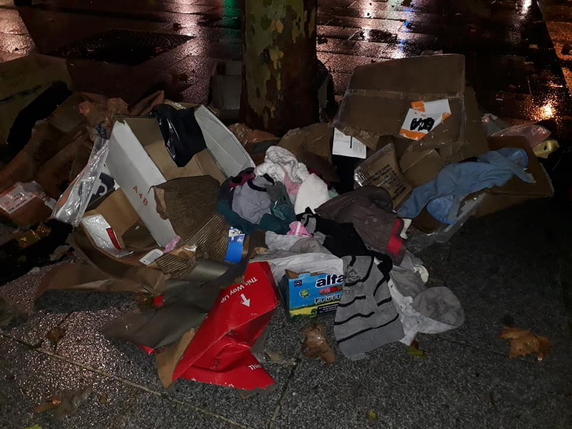
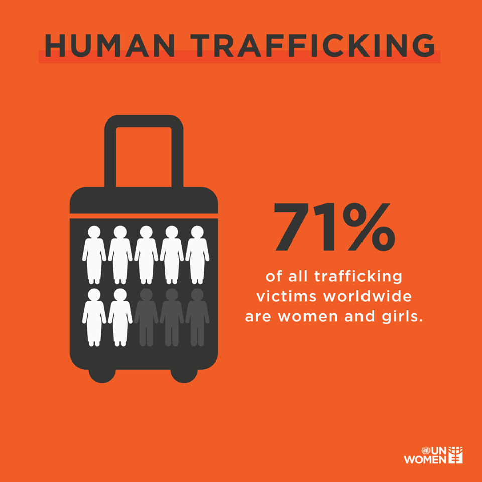

### AYS Weekend Digest 24–25/11/2018 — Delaying rescues\. A new criminal policy\.

Deportation today from Bruxelles /// Updates from Paris /// Donations needed in Dunkirk /// Man in critical condition after attempting suicide in Paris /// Mass deportation in Austria /// More proof of police brutality on the Greek\-Turkish border

 [Mediterranea Saving Humans](https://www.facebook.com/Mediterranearescue/?__tn__=K%2AF&eid=ARBdFU-iMnd9H3rVTdpM7iMIkSlpp8KyIp4al_fGhW0PIFJQrvZmj-6F-2Xi_LvcnrOFH0MsdTeZb5ym&fref=tag&__xts__%5B0%5D=68.ARDFqsbAckS_KCJl1sDnlNX9fJYrZwOdTLcqy-0qcFfKX8pboZz21u-GItrsqkxCug3GwjFCrcmzOCYYKS0ynAEW1r7j93hJ2_vxCg9gi7QeIvUnyjT2xsZNoowfuc2thmqamz2qKN5MrS3J9TxcclbtWCal9ejwgkGFIp4djYx43ioJMNszrAMtHXk) [\#United4Med](https://www.facebook.com/hashtag/united4med?source=feed_text&__xts__%5B0%5D=68.ARDFqsbAckS_KCJl1sDnlNX9fJYrZwOdTLcqy-0qcFfKX8pboZz21u-GItrsqkxCug3GwjFCrcmzOCYYKS0ynAEW1r7j93hJ2_vxCg9gi7QeIvUnyjT2xsZNoowfuc2thmqamz2qKN5MrS3J9TxcclbtWCal9ejwgkGFIp4djYx43ioJMNszrAMtHXk&__tn__=%2ANK%2AF) \(Photo by Javier Fergó\)](assets/89909412e264/1*3CBpXYoTXe73y-59cHDTSw.jpeg)

“We will never know how many people died drowned last night in the Mediterranean after we sent a distress call and a supply boat rescued at dawn the boat that was sinking\.
Rescued from the sea, but returned to torture, harassment and a safe death in Libya\.”
[Sea\-Watch](https://www.facebook.com/seawatchprojekt/?__tn__=K%2AF&eid=ARBAdZwMpL5WQ1AkiI6JAvBACww6wrS-ZzBYqHcN-A1F6dPH5qYPQ0JpQj4vlIrP6ELIZkw_VUUOi01O&fref=tag&__xts__%5B0%5D=68.ARDFqsbAckS_KCJl1sDnlNX9fJYrZwOdTLcqy-0qcFfKX8pboZz21u-GItrsqkxCug3GwjFCrcmzOCYYKS0ynAEW1r7j93hJ2_vxCg9gi7QeIvUnyjT2xsZNoowfuc2thmqamz2qKN5MrS3J9TxcclbtWCal9ejwgkGFIp4djYx43ioJMNszrAMtHXk) [Mediterranea Saving Humans](https://www.facebook.com/Mediterranearescue/?__tn__=K%2AF&eid=ARBdFU-iMnd9H3rVTdpM7iMIkSlpp8KyIp4al_fGhW0PIFJQrvZmj-6F-2Xi_LvcnrOFH0MsdTeZb5ym&fref=tag&__xts__%5B0%5D=68.ARDFqsbAckS_KCJl1sDnlNX9fJYrZwOdTLcqy-0qcFfKX8pboZz21u-GItrsqkxCug3GwjFCrcmzOCYYKS0ynAEW1r7j93hJ2_vxCg9gi7QeIvUnyjT2xsZNoowfuc2thmqamz2qKN5MrS3J9TxcclbtWCal9ejwgkGFIp4djYx43ioJMNszrAMtHXk) [\#United4Med](https://www.facebook.com/hashtag/united4med?source=feed_text&__xts__%5B0%5D=68.ARDFqsbAckS_KCJl1sDnlNX9fJYrZwOdTLcqy-0qcFfKX8pboZz21u-GItrsqkxCug3GwjFCrcmzOCYYKS0ynAEW1r7j93hJ2_vxCg9gi7QeIvUnyjT2xsZNoowfuc2thmqamz2qKN5MrS3J9TxcclbtWCal9ejwgkGFIp4djYx43ioJMNszrAMtHXk&__tn__=%2ANK%2AF) \(Photo by Javier Fergó\)
#### FEATURE — DELAYING RESCUES\. A NEW CRIMINAL POLICY OF MEDITERRANEAN COAST GUARDS

It’s been a very busy and confused weekend throughout the Mediterranean\. Delaying rescues seem to have become the practice of all the Mediterranean coast guards\.

**The Arrivals**

ITALY

Three boats arrived within 24 hours in Sicily and Calabria\. One wooden fishing boat arrived autonomously on the Sicilian coast and was then brought to the port of Pozzallo\. They left from Misrata, Libya, navigated through the Maltese SAR zone and reached the Italian coast with a 30\-degree slope\. The people onboard have been denied the right to disembark for several hours\. Only when winds started to blow stronger and the risk of sinking in the port became too high, were they allowed to disembark, starting with women and children\. Five pregnant women, a 20\-year\-old man and two children have been taken to the hospital for hypothermia\. The boat carried 264 people, mostly from Eritrea \(184 men, 43 women and 37 minors, including a 10\-day\-old baby\) \.Two people — a Libyan and a Tunisian — have been stopped by the Financial Police because they are suspected of being the traffickers\.

 \)](assets/89909412e264/1*i57DFQgoxwlKZemfBsLcZQ.jpeg)

Before disembarking in the Port of Pozzallo \(Photo by [Sergio Scandura](https://twitter.com/scandura) \)

Seventy\-two people from Pakistan have been rescued by the Financial Police after being dropped off in Capo Cimiti \(Crotone, Calabria\) by two suspected Latvian traffickers\.

Two small boats with 14 people from Tunisia \(including seven minors and four women\) and 68 people from the Sub\-Sahara region \(including four women\), have been rescued by the Financial Police vessels between Lampedusa and Pantelleria and brought to Lampedusa\.

SPAIN

According to information provided by the Spanish Coast Guard, 87 people were rescued from five boats during the weekend \(57 \+ 13 \+ 2 \+ 13, and one disappeared\) \.

**Mediterranean Coast Guards, a tragic farce**

In the afternoon of Friday, 23 November, Alarm Phone was contacted by a boat in distress off the Libyan Coast, with around 120 people on board\. According to this first message, the conditions on board were life threatening and some people may already have lost their lives\.

The \#Mediterranea rescue boat received the alarm and started to alert MRCC Rome, and the Maltese and Libyan coast guards\. The Libyan Coast Cuard, which received the first distress call from Alarm Phone, didn’t reply to any communication and refused to send out a Navtext \(general alarm to alert all vessels in the area\); the Italian Coast Guard refused to engage because the distress call came from the Libyan SAR zone\. Regardless, they did find the time to officially ask \#Mediterranea to change the header of their communication, putting the Italian Coast Guard in CC and not as the main recipient…

Only after several hours, and numerous requests from the humanitarian vessel, were the coordinates of the boat in distress given to \#Mediterranea and the Libyan Coast Guard, which again refused to send out a general alert to all vessels\. Later in the night, MRCC Rome informed Alarm Phone that a supply vessel working near the Bouri oil field rescued the people and was waiting for the Libyan authorities to pick the people up and return them to the horrible conditions they had fled\.

■■■■■■■■■■■■■■ 
> **[Mediterranea Saving Humans](https://twitter.com/RescueMed) @ Twitter Says:** 

> > Su quanto successo questa notte, ci sono molti punti oscuri e inesattezze. Tante, troppe cose che non sappiamo e che siamo determinati a chiedere finché non avremo una risposta. #VogliamoSapere https://t.co/cJYCab546L 

> **Tweeted at [2018-11-24 15:31:06](https://twitter.com/rescuemed/status/1066353523691008005).** 

■■■■■■■■■■■■■■ 

Mediterranea launched a campaign: \#VogliamoSapere, We Want To Know, asking for information about the many unclear points about this “rescue”:

> We want to know: 

> If there were casualties, as communicated by the people on board who gave the alarm 

> The name and flag of the supply vessel that operated the rescue 

> When the rescue operations took place exactly 

> How many people were on board, how many men, women and children\. 

> Which nearest safe port they were brought to 

> If they have received medical care 

> Where are they now and if they have been detained 

On the same night the Libyan Coast Guard was the protagonist in an other criminal incident:

■■■■■■■■■■■■■■ 
> **[Oscar Camps](https://twitter.com/campsoscar) @ Twitter Says:** 

> > Los pescadores de #NuestraMadredeLoreto afirman que las 12 personas que rescataron hace 40h habían sido abandonadas en el agua delante sus ojos por una patrullera libia,que antes de irse han pinchado la patera,y han devuelto a las otras 26 personas a Libia.Atendidos x #United4Med https://t.co/jKFZ9k9NXT 

> **Tweeted at [2018-11-24 14:52:48](https://twitter.com/campsoscar/status/1066343883611742209).** 

■■■■■■■■■■■■■■ 

The Spanish fishing boat, Nuestra Madre de Loreto, rescued 12 people after 40 hours at sea\. The fishermen claim they were abandoned in the water by a Libyan patrol vessel, which punctured the dinghy before leaving\. Other 27 people were brought back to Libya\.

Shamelessly, the Libyan Coast Guard published a [statement](https://www.facebook.com/1790218757888068/posts/2208408136069126/) accusing the Spanish fishermen of luring the “illegal migrants” into the water and requested intervention of the Spanish government\. At the time of writing we still don’t know if the Nuestra Madre del Loreto received a safe harbour to disembark\.

In the same hours another tragedy took place in the Western Mediterranean:

Alarm Phone reported that since Friday there was a boat in distress off the Moroccan coast, carrying approximately 70 people\.

The boat had been at sea since Thursday and both Moroccan and Spanish authorities did not react quickly\.

> Even after we forwarded the exact GPS position of the boat it took more than six hours for the rescue to take place\. 

Fifteen people are now confirmed to have died due to the delay in rescue\.

Again, we observed the loss of life in the [\#Mediterranean](https://twitter.com/hashtag/Mediterranean?src=hash) due to delayed rescue efforts by the Moroccan and Spanish authorities\. A boat carrying approximately 70 people had left [\#Morocco](https://twitter.com/hashtag/Morocco?src=hash) as early as Thursday\. Fifteen people drowned\. [Association Marocaine des Droits Humains — Section Nador](https://www.facebook.com/AmdhNador/photos/a.1693125780899690/2223106847901578/?type=3&theater) report that 39 people survived\. People were rescued on Saturday morning by the Moroccan navy and brought back to Morocco\.

> This renewed tragedy off the coast of Morocco is a direct consequence of Europe’s disastrous migration and border policies\. We wish the relatives and friends of the deceased all the strength\. 

During the whole weekend the Maltese Coast Guard was nowhere to be seen, keeping up with their practice of obstructing rescues in every way:

■■■■■■■■■■■■■■ 
> **[Darrin Zammit Lupi](https://twitter.com/darrinzl) @ Twitter Says:** 

> > Disgusted that Maltese authorities continue to obstruct #SAR efforts in the Med by denying #Moonbird plane permission to refuel in #Malta. #seawatch #NotInMyName #BloodOnYourHands 

> **Tweeted at [2018-11-25 15:15:39](https://twitter.com/darrinzl/status/1066712021264187392).** 

■■■■■■■■■■■■■■ 

SYRIA

According to [Syria Civil Defence](https://www.facebook.com/SyriaCivilDef/posts/2228688267455569?hc_location=ufi) , a school was targeted by Assad’s forces in the area of Idlib over the weekend resulting in nine civilian deaths \(seven children and two women\) and multiple injuries\. This was only one of a series of deadly attacks in the last few days\. The [Syrian Observatory for Human Rights](http://www.syriahr.com/en/?p=107383&fbclid=IwAR2J2ZrrR2kwQfIwHffEwS6BIj_D-y6fORNuD2oBULRkskMHbJ5V92cjuFo) reports that a further 68 people lost their lives in clashes with ‘ISIS’ near the International Coalition base east of the Euphrates\.

GREECE
#### Arrivals

Figures from [Aegean Boat report](https://www.facebook.com/AegeanBoatReport/posts/480432002479909) :

Four boats arrived on the Greek islands on Sunday morning, carrying a total of 171 people\. The first boat landed off the Lasia hotel, Lesvos south, at 2:00 am\. \(33 people — no breakdown available\) \. A second boat landed on Lesvos at Kalo Limani, Lesvos north west, 6:00 am\(47 people: 21 children, nine women, 17 men\) \. A third and fourth boat landed at Farmakonisi\. The first boat was picked up at 2:32 am, 38 people; the second boat landed at 8:13 am, 47 people\. Both boats were transported to Leros\.

A boat also arrived in Panteoukios, Chios north east, in the afternoon \(six people — one child, one woman, four men\)
#### Police Brutality continues on the northern border with Turkey

■■■■■■■■■■■■■■ 
> **[Vassilis Tsarnas](https://twitter.com/VassilisTsarnas) @ Twitter Says:** 

> > 24/11/2018: "Greek police beat another group of people near the river.. and steal  (phones, clothes and money) and bring them back to Turkey with a  pregnant woman😡😡"
#Greece #Evros #Pushbacks #RefugeesGr
[facebook.com/ali.surveyor.7…](https://www.facebook.com/ali.surveyor.7/posts/963127980550162?__xts__[0]=68.ARBw3qgEQzyjQlyn0hUn6jy0BY48TOL8KXrAe2rvMU7en4u2FfJTRt8-ENLSqe8f1B_D5lTebFwd9hNGM86QjnjMDSUWO4V1MzTEpoBB2e83tSLG6DJZ1vWB7lKO_xP77uiWh6WivDva-EzfsjVdzjAmcERUOmvKfvzmI7S6UtavAuf83hO4lBF3D7MUW17sfZQmwOJagjaxZnMQtkCLosnRtg0Cgbqu4N1Wc_mX5GfBoO-eShSXrlELnzNaTlWql-Mw53ZJLLp7cWUfIFhovE9Vn0ydkt592kZaDCKDg-6BlDPvOpbCIqxPXkUZXxWiC3CzX4pS96tWbD0y28DdmU6ZhQ&__tn__=H-R) https://t.co/82AGGIxeIA 

> **Tweeted at [2018-11-25 12:48:03](https://twitter.com/vassilistsarnas/status/1066674876608593920).** 

■■■■■■■■■■■■■■ 

#### Increasing number of people sleeping rough in Athens

[Refugee Support Aegean](https://twitter.com/rspaegean/status/1066245441539502080?fbclid=IwAR2lmGfjo2nxMElqqHY-MuS2OhP8hXalJYRsxY9ohctdLjPyaniTFpjzaKU) report that there are increasing numbers of people sleeping rough in Athens, including the extremely vulnerable\.

 \)](assets/89909412e264/1*2afuVs8NqIKSnLXKZ-Apog.jpeg)

Platia Viktoria, Athens \(Photo by [Refugee Support Aegean](https://twitter.com/rspaegean/status/1066245441539502080?fbclid=IwAR2lmGfjo2nxMElqqHY-MuS2OhP8hXalJYRsxY9ohctdLjPyaniTFpjzaKU) \)

Will any solution be found before winter?
#### Volunteer Calls

[Lighthouse relief](https://www.lighthouserelief.org/volunteer/?fbclid=IwAR3A4bDOuDzmhkAdeFh0qy2YgEwsSXFjP5fRphzNwoAWxF0VhrfnOty2X0Q) needs volunteers on Lesvos especially during the first three weeks of December\.

[Health\-Point Foundation](https://www.healthpointfoundation.org/) need volunteer dentists to fill an urgent gap in their November schedule:

> \- Monday, \*12\* November \_till\_ Friday, \*16\* November\. 

> \- Monday, \*19\* November \_till\_ Friday, \*23\* November\. 

> \- Monday, \*26\* November \_till\_ Friday, \*30\* November\. 

They work across camps in Northern Greece providing this much needed service\. Dentists need to have been qualified for two years to complete registration with the Greek health authorities\.

Our House, Lesvos and Athens, need donations and volunteers

 \)](assets/89909412e264/1*gzbFyH0pfrsYBUZIkiaRuA.jpeg)

\(Photo by [Our House](https://www.facebook.com/ourhousegr/photos/a.2128531914065310/2182716561980178/?type=3&theater&ifg=1) \)

Our House, Lesvos and Athens, need the following donations — winter clothes, food and sleeping bags\. More info [here](https://www.facebook.com/groups/446386565554391/permalink/976097685916607/?hc_location=ufi) \.
#### [Open Space](https://www.facebook.com/Open.Space3/) Providing Lessons

A small group of Greek volunteers are giving free Greek and English lessons every Thursday, 11–1 am and 6–8 pm\. At the Ecology Building, Xatzianesti 13, in Drama\.

ITALY
#### Demonstrations in Rome

During the weekend there were three demonstrations held in Rome\.

■■■■■■■■■■■■■■ 
> **[Paranoida Androida](https://twitter.com/ParAndroida) @ Twitter Says:** 

> > Uh...toh! :)  ...freedom of movement is our struggle! #24novembre  #ROMA #nonunadimeno #mozionerespinta #agitazionepermanente #contravientoymarea #Violenzasulledonne #ViolenceAgainstWomen https://t.co/sULvtiNBmC 

> **Tweeted at [2018-11-24 15:00:09](https://twitter.com/parandroida/status/1066345735598342145).** 

■■■■■■■■■■■■■■ 

On Saturday, 150,000 people marched through the city for the [Non Una di Meno](https://nonunadimeno.wordpress.com/) national demonstration\. The feminist march openly supported migrant, refugee, and asylum\-seeker women in their struggle for rights, decent conditions and against the Salvini Decree\.

](assets/89909412e264/1*bTCgzuTNtvJT6ZrJg6C8qQ.png)

[\#NonUnaDiMeno](https://l.facebook.com/l.php?u=http%3A%2F%2Fwww.siracusanews.it%2Fsiracusa-psicologi-migranti-oltre-200-professionisti-decreto-sicurezza%2F%3Ffbclid%3DIwAR28p09h61dfRR-hHQSGRh8TTB-7ad0acvXXLvjz8RRKDQW1HglcjSJ1kw8&h=AT3bwJOPK12XGn6t4vi3y9jhhOF_WitYS-oigSilceyc70jetTL3CsPNoJ2ve0suZtlX4CTOntdUR5x1xZb2Yo1ygI4bExsyXeZBzjHdMT5wHHkG6bLHV8bjaC82RnQsJvcuIKMFJ-cRYyUsYbxND_uzFREClAjgIJ_pQUoH5wUIcCXNgxo93EVhTNAK8-BKGuEPkWHxpN9Dy4wt3rNkGRl7HeIrOlBORwS-7CyzwChdeD0G0CdYOU-dlJHNaHB_1ysebONuN1JGgbJDFLcpKvtonQutbNkq0OUjs8rD_rICjGhoxo7RTRKuuGxwRSgpCbeO4o-k75FXn5tiz1gI8NI2e_OfWmd7kt9_apBkkB6r4b3IvdUiTEydHXwYXB8vA1oevY6h4XcorGtVp1zP_7h8obO_EiZKrQC4uEYdk7qSyNnnigSUMBbGuO8f3LXtvCcPHdBOKreGXUo2Lbz5a9IyTRROoVgpSGXEw7PshrgUSRG9ulE0E5kbciYJv-Yrpa0cX0T4cVDJp6fNtlpJzzTRNxnxd-nTGRhk3EX3eLHuG03zxAfkNh-8hSphDDCwN48iPlzSoyC6MlphpbFrOOPPlfE7Csb3DkLMKPDXnXc0LLsb6Je8rsw)

The day before, on Friday, 23 November, hundreds of people [participated](https://www.globalproject.info/it/in_movimento/a-roma-in-centinaia-contro-il-decreto-salvini/21745?fbclid=IwAR1rXIMmm-BOmGxjBwRM1lRVJXI2gqpzNMv8j0yGIIfjoEXSozd3SHw6-CQ) in a demonstration against the Salvini Decree, in continuity with the large protest of 10 November\. Protests will be held over the next weeks in several cities throughout the country\.

 \)](assets/89909412e264/1*vGraNwTv2pZpinGAQXkQIg.jpeg)

Demonstration in Rome, 23/11/2018 \(Photo by [Global Project](https://www.globalproject.info/it/in_movimento/a-roma-in-centinaia-contro-il-decreto-salvini/21745?fbclid=IwAR1rXIMmm-BOmGxjBwRM1lRVJXI2gqpzNMv8j0yGIIfjoEXSozd3SHw6-CQ) \)
#### Only 30 beds available for people in need in Gorizia

L’altra Voce reports that only 30 beds have been allocated for this winter to people in need in Gorizia\.

> For those who don’t have a place to sleep there will not be the big tent but 30 beds in the Faidutti dormitory in Piazza Tommaseo \(Piazzutta\) and in the parishes of the Duomo and San Rocco\. The 30 beds \(those of the Duomo are already available\) will be available for both the refugees and the needy people of Gorizia\. 

#### **Psychologists for migrants**

232 Sicilian psychologists signed a public document against the Salvini decree, [report](https://l.facebook.com/l.php?u=http%3A%2F%2Fwww.siracusanews.it%2Fsiracusa-psicologi-migranti-oltre-200-professionisti-decreto-sicurezza%2F%3Ffbclid%3DIwAR28p09h61dfRR-hHQSGRh8TTB-7ad0acvXXLvjz8RRKDQW1HglcjSJ1kw8&h=AT3bwJOPK12XGn6t4vi3y9jhhOF_WitYS-oigSilceyc70jetTL3CsPNoJ2ve0suZtlX4CTOntdUR5x1xZb2Yo1ygI4bExsyXeZBzjHdMT5wHHkG6bLHV8bjaC82RnQsJvcuIKMFJ-cRYyUsYbxND_uzFREClAjgIJ_pQUoH5wUIcCXNgxo93EVhTNAK8-BKGuEPkWHxpN9Dy4wt3rNkGRl7HeIrOlBORwS-7CyzwChdeD0G0CdYOU-dlJHNaHB_1ysebONuN1JGgbJDFLcpKvtonQutbNkq0OUjs8rD_rICjGhoxo7RTRKuuGxwRSgpCbeO4o-k75FXn5tiz1gI8NI2e_OfWmd7kt9_apBkkB6r4b3IvdUiTEydHXwYXB8vA1oevY6h4XcorGtVp1zP_7h8obO_EiZKrQC4uEYdk7qSyNnnigSUMBbGuO8f3LXtvCcPHdBOKreGXUo2Lbz5a9IyTRROoVgpSGXEw7PshrgUSRG9ulE0E5kbciYJv-Yrpa0cX0T4cVDJp6fNtlpJzzTRNxnxd-nTGRhk3EX3eLHuG03zxAfkNh-8hSphDDCwN48iPlzSoyC6MlphpbFrOOPPlfE7Csb3DkLMKPDXnXc0LLsb6Je8rsw) local media\. The text points out that the content of the decree blatantly contradicts the constitutional principles and values underpinning the pyschology profession as well as the basic principles and values of civic life\.
#### BALKAN WEATHER REPORT

MONTENEGRO

Moderately to completely overcast with intermittent rain showers and thunder\. By close of day and overnight the precipitation will be lighter\. Wind moderate to strong, very strong before noon from the south\. Morning temperature range from 4 to 16 C°and with highs from 7 to 19 C°\.

SERBIA

Mostly overcast, relatively warm, windy, with local rain showers\. The wind will be light to moderate, strong locally before noon and periodically stormy, blowing from the south southeast, later from the west and northwest\. Lows, 5 –10 C° and highs, 8–15 C\. 
Warning — Strong wind gusts predicted\.

SWITZERLAND
#### Rubber bullet fired against demo

■■■■■■■■■■■■■■ 
> **[Enough 14](https://twitter.com/enough14) @ Twitter Says:** 

> > Cops in #Basel #Swiss territory shooting with rubber bullets on #antifa activists during counter protests against fascist demo. Several people injured. Some eye injuries. #BaselNaziFrei Video by @JoshJhancock9 [twitter.com/JoshJhancock9/…](https://twitter.com/JoshJhancock9/status/1066349588880261121/video/1) 

> **Tweeted at [2018-11-24 15:21:44](https://twitter.com/enough14/status/1066351166529945600).** 

■■■■■■■■■■■■■■ 

Police in Basel have fired rubber bullets into an antifascist demonstration taking place to counter a right\-wing march\. Several people were injured\.

AUSTRIA
#### Warning mass deportation Austria — Afghanistan

A charter deportation will likely take place to Kabul on 27 November 2018\.

You can read more information and advice on how to stay safe on the [Refugee Protest Camp Vienna page\.](https://www.facebook.com/RefugeeCampVienna/?__tn__=%2CdkCH-R-R&eid=ARCGRvI2ID39c-kDg5SZDahS4cClEH8rfxUIaGwUtY2Z4UO2Cpt8TeEL1n_Cgtg1YmkXny8q4Vkb4LrP&hc_ref=ARTTAuxaz3A6tFZ1Iy6Q9AGZVZA4ukJ3lAZ9OpfkX5a-Zofo0niOM_iOmHXT8cmkX-o&fref=nf&hc_location=group)

GERMANY

Protests against the proposal to lift the ban on deportations to Syria

Actions taking place against the conference on returns to Syria can he found [here](https://www.facebook.com/SeebrueckeSchafftsichereHaefen/photos/a.640137809691739/744925215879664/?type=3&__xts__%5B0%5D=68.ARBWau_zl-osHJBXTiXUUn0na_fwP4QCxuX9XWzyeNrygKDFtatKpi1vJMAtOxlh44d3Q0TWfiAtlseqGuSFb8cC02nQ5XRDUjsFLmsPPW61QVoVbX1C-XF2M7JIcEzkjRnQN3z9ba_26xFsEhSXW786wIyf7o3NA0SMSCE_alrpGOCOA3B5EZGRX3YDHPcLK1Zb_K6XhprbWMXfkxZ6YRMB0V_xUhMXiFViyJ95i2r2YLlTpSuDS7_f0RsuX_0x1woUSmkLDSoyfwx45BAJH_GD9Kl0vWlojJjiWaNTfE_flYMfob53-jH0smO8FvZiyIFHY6gJtMtPEoTpu9hMf5A&__tn__=-R) \.

FRANCE
#### Young man in serious condition after attempting suicide

A young African man jumped from the 4th floor of new courthouse building in Paris, media [report](https://www.lemonde.fr/police-justice/article/2018/11/23/un-homme-saute-du-quatrieme-etage-dans-le-nouveau-tribunal-de-paris_5387485_1653578.html?fbclid=IwAR1dKRZ4hM69YJZbVhNl0oFmT2G8kCWy7ebFRTbRB_o2IGw8_1Vg43Nt53o) \. Three police officers tried to stop him, and people below had time to close the area off and put jackets down in an attempt to cushion his fall\. The design of the courthouse has been criticised because many of the offices/courtrooms where the people visiting might have the highest vulnerabilities are located on the 4th floor and the atrium for the same floor is unprotected\.
#### Important information about donations in Paris

Paris Refugees Ground Support published a [statement](https://www.facebook.com/groups/P2PParis/permalink/1955920597828138/?hc_location=ufi) regarding donation distribution in Paris\. In their night\-time distributions they “see the aftermath of people’s good intentions turn to a disgrace every weekend”\.

 \)](assets/89909412e264/1*9_RDeAomFOapijUVrvHeHA.jpeg)

“The road to ruin is paved of good intention” \(Photo by [Paris Refugee Ground Support](https://www.facebook.com/PRGS.team/?tn-str=k*F&fref=gs&dti=1006253006128240&hc_location=group_dialog) \)

> There are currently around 1500 displaced people, men and women and children, living in the streets and yes, we all feel powerless to help\. And we all feel a huge desire to do so in any way we can\. But this is not the way\. 

> When we help by dumping our kindness at their feet without structure, without a considered plan, without finding out the true needs of the individuals, we are trying in vain to help, we inadvertently make something so grotesque that it hurts\. 
 

> We burden these dear people by making them a dumping ground, making them our rubbish bin\. We make their situation worse\. To the general public we make them a “dirty” problem\. All the kindness turns to dirt\. 

They remind of the importance of an attentive sorting and a careful planning of donations and distribution\. They ask for donation to be sent to their warehouse in St\. Denis\. The warehouse is open on Monday, Wednesday and Friday, from 2 pm until 9 pm\.
#### Donations urgently needed in Dunkirk

[Refugee Mobile Support](https://www.facebook.com/MobileRefugeeSupport/) is in great need of tents, waterproof, gloves and torches\.

 \)](assets/89909412e264/1*Le_YETi5hoYT2HEIGolkeg.jpeg)

Donation Distribution in Dunkirk \(Photo by [Mobile Refugee Support](https://www.facebook.com/MobileRefugeeSupport/) \)

> \[…\] One month on since the eviction, there are still around 500 people living rough in the area, including families with small children as young as one year old\. With temperatures plummeting, blankets and tarpaulins alone will no longer suffice, meaning tents are now an absolute necessity for those forced to sleep outside\. Over the last month since the eviction, our distribution team has given out over 300 tents, leaving our stocks severely depleted\. With new arrivals each day, we anticipate running out completely by the end of the month\. 

> \[…\] Basic items such as torches, gloves, and waterproofs become invaluable to those enduring long, dark nights of torrential rain\. 

Please [Donate here](http://www.mobilerefugeesupport.org/monetary-donations?fbclid=IwAR1R_BZ0VO-wofFh8iyg8JjeO9ddRSp-59GxQ8VtN_qqXULYvvUgeLwwQAM) , share this and continue to help raising awareness of the situation here and the inhumane conditions people are living in at our borders

BELGIUM

**Deportation to Afghanistan today**

[Getting the Voice Out](http://www.gettingthevoiceout.org/empechons-l-expulsion-criminelle-vers-lafghanistan-ce-26112018/?fbclid=IwAR0v5pFxSlRSBsaYg2fRj5I8eLgnogyygJFhcJJHw8Ur5kuXCn5sfoJx0iE) informs us that today, Monday, 26 November, a 21\-year\-old man from Afghanistan, an ethnic Hazara, is due to be deported to Kabul via Turkish Airlines\. He came to Belgium in 2015 and requested asylum\. His mother, father, and brother were all killed in Afghanistan\. He has attempted suicide and the Belgian authorities are trying to deport him as quickly as possible so he’s no longer their responsibility\. He doesn’t want to return to Afghanistan, where he has no one left\. His community is in Belgium and he already speaks Dutch fluently\.

He will be deported on the Turkish Airlines flight to Istambul at 15:15 this afternoon, he is asking to prevent his expulsion:

**Go to the airport on Monday at 13:15 to explain to the passengers his situation and explain that they can refuse the expulsion on their flight\!**

An open letter \(in French\) was published [HERE](http://www.gettingthevoiceout.org/empechons-l-expulsion-criminelle-vers-lafghanistan-ce-26112018/?fbclid=IwAR0v5pFxSlRSBsaYg2fRj5I8eLgnogyygJFhcJJHw8Ur5kuXCn5sfoJx0iE) \. You can copy, paste and send it to Belgian authorities\. Getting the Voice Out also suggests to contact Turkish Airlines or leave comments on the airline’s site in order to stop their practice of flying deportees\.

HOLLAND
#### Anti\-deportation mass carries on

The [Tamrazyan Family](https://qz.com/1470153/a-dutch-church-is-holding-non-stop-services-for-a-refugee-family/?fbclid=IwAR2BS-WUoxXaroCUmHQXgSRdJdZFMOBNhrTOnWIfezl81RX_lg43DCyy6-c) are now in Day 27 of an ongoing protestant mass in The Hague\. The 24\-hour religious services protecting this Armenian refugee family from deportation have been held by 300 Dutch ministers, and a petition calling on the Dutch government to grant more children’s pardons to refugee families has now been signed by nearly a quarter of a million signatories\.

SWEDEN
#### Proposal to reform reception system

The Swedish government is considering reforming the reception system for newly arrived asylum\-seekers and aims for either “rapid settlement or return”\. This would involve the creation of arrival centres where all claims would be lodged and all decisions would be received\. Detention would last for 30 days and private accommodation options would be prohibited\. [More info here](http://www.asylumineurope.org/news/21-11-2018/sweden-inquiry-reception-system-reform-tests-%E2%80%9Carrival-centres%E2%80%9D-and-%E2%80%9Cdeparture) \.

UK
#### Refugee Week paid Internship Opportunity

> Are you passionate about changing public attitudes towards refugees and asylum seekers? 

> Do you want to develop your leadership potential in the field of refugee rights, media, education or the arts and social change? 

> Do you have experience starting or managing a project \(as a job or in your free time\)? 

> Are you from a refugee background? 

Counterpoints Arts have [paid internship opportunities](http://refugeeweek.org.uk/11046-2/?fbclid=IwAR0QNPRgFmXFwV86qot6ha1puuQDoDJwkxgCZTH7d55OgcQ2q4nA73yQtu0) for Refugee Week 2019\. The commitment will be 15 days between now and June 2019\. The deadline for applications is 30 November 2018, and applications are welcome from across the UK \.
#### Refugee Women’s Centre Fundraiser

On the 30 November, Chiff\-Chaff Café in Bedford will host [‘Winter’s Eve’, a fundraising event for RWC](https://www.facebook.com/refugeewomenscentre/photos/a.178973875861584/543124809446487/?type=3&theater) \. All proceeds will go to supporting RWC’s work and there will also be an opportunity to learn more about what they do and how you can help\.

> With Christmas around the corner this is a great time to raise awareness, organize events and raise money to help the displaced women and children of northern France\. If you have any fundraising ideas or questions we’d love to hear from you\! Please get in touch at supportus@refugeewomenscentre\.com 

#### Solidarity with the Stanstead 15 from Lesvos

 , Lesvos\)](assets/89909412e264/1*NBNtXVPV_6AqxaGuyRD8Iw.jpeg)

\(Photo by [No Border Kitchen](https://www.facebook.com/NBKLesvos/photos/a.722860677853724/1287517348054718/?type=3&theater) , Lesvos\)

> The Stansted 15 are a group of activists facing unprecedented terror\-related charges for a non\-violent action exposing systematic, unlawful deportations by the Home Office\. They stopped a deportation flight to Nigeria and Ghana on 28 March 2017, with 60 people on board\. 

Read their full statement [here](https://www.facebook.com/NBKLesvos/photos/a.722860677853724/1287517348054718/?type=3&__tn__=-R) \.

GENERAL
#### International Day for the Elimination of Violence against Women

Today \(25 November\) is International Day for the Elimination of Violence against Women and begins [16 days of Activism](http://www.unwomen.org/en/news/in-focus/end-violence-against-women) \.

From this week on, we will be publishing **weekly overview in Arabic and in Persian** of some of the most important stories we covered during the previous week\. Share it with your Arabic and Persian speaking friends\. 
Here is the **Arabic version: [الملخص الأسبوعي \(ا\.ي\.س\) : عمليات الإخلاء والمعاملة اللاإنسانية للاجئين في أوروبا](%D8%A7%D9%84%D9%85%D9%84%D8%AE%D8%B5-%D8%A7%D9%84%D8%A3%D8%B3%D8%A8%D9%88%D8%B9%D9%8A-%D8%A7-%D9%8A-%D8%B3-%D8%B9%D9%85%D9%84%D9%8A%D8%A7%D8%AA-%D8%A7%D9%84%D8%A5%D8%AE%D9%84%D8%A7%D8%A1-%D9%88%D8%A7%D9%84%D9%85%D8%B9%D8%A7%D9%85%D9%84%D8%A9-%D8%A7%D9%84%D9%84%D8%A7%D8%A5%D9%86%D8%B3%D8%A7%D9%86%D9%8A%D8%A9-%D9%84%D9%84%D8%A7%D8%AC%D8%A6%D9%8A%D9%86-%D9%81%D9%8A-%D8%A3%D9%88%D8%B1%D9%88%D8%A8%D8%A7-f5b8200541a2)**

**We strive to echo correct news from the ground through collaboration and fairness\.**

**Every effort has been made to credit organizations and individuals with regard to the supply of information, video, and photo material \(in cases where the source wanted to be accredited\) \. Please notify us regarding corrections\.**

**If there’s anything you want to share or comment, contact us through Facebook or write to: areyousyrious@gmail\.com**

_Converted [Medium Post](https://medium.com/are-you-syrious/ays-weekend-digest-24-25-11-2018-delaying-rescues-a-new-criminal-policy-89909412e264) by [ZMediumToMarkdown](https://github.com/ZhgChgLi/ZMediumToMarkdown)._
