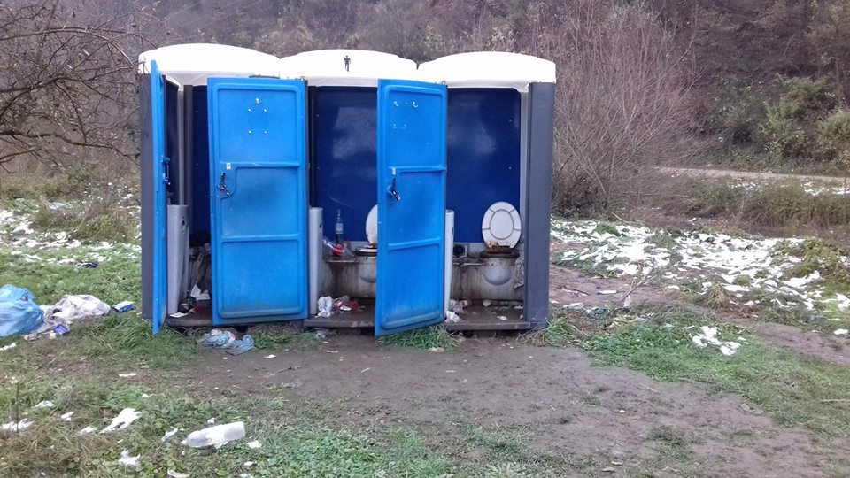
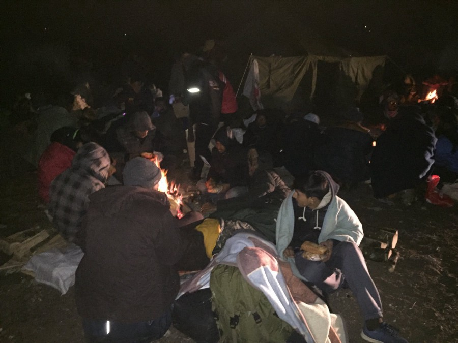
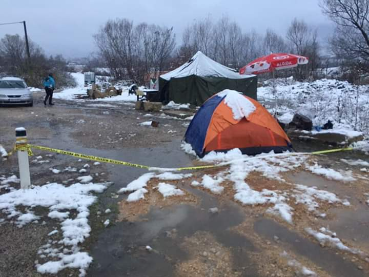
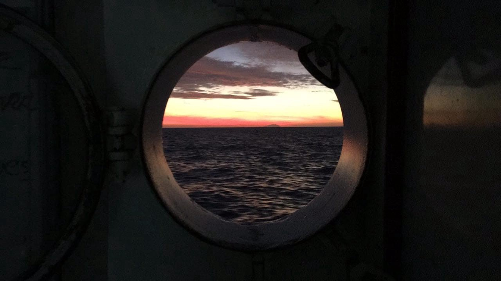
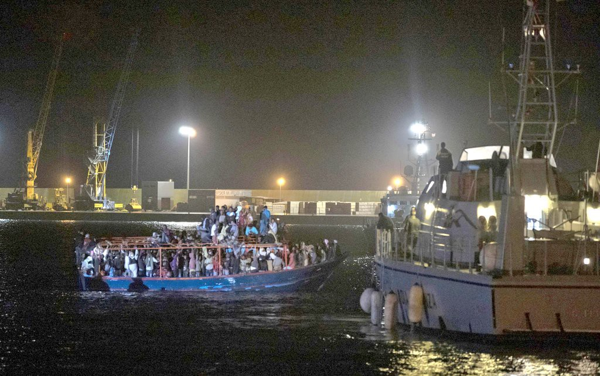

### : AYS خلاصه هفتگی بیرون راندن و رفتار غیر انسانی با پناهندگان در اروپا
#### AYS Weekly News Digest in Persian

](assets/27a8c9879ef1/1*gSCdNpH4gRsEG7tzXDq2SA.jpeg)

عکس: [SOS Team Kladuša](https://www.facebook.com/SOSTeamKladusa/?ref=br_rs)
### بوسنی و هرزگوین

بر طبق عکس های منتشر شده از سازمان AYS در مورد جا به جایی کمپ های Velika Kladuša بعد از اولین بارش برف ، IOM و UNHCR ،دو تا از بزرگترین سازمان های بین المللی مسئول نگهداری از پناهندگان و مهاجران در بوسنی هستند \( اگرچه تا حالا آنها بیش از هشت میلیون یورو از اتحادیه اروپا دریافت کرده اند برای کمک در بوسنی \)، سرانجام موفق شدند که چادرها را از مناطق باتلاقی جا به جا کنند \.

یک اتوبوس در روز چهارشنبه بعد از ظهر آمد تا افرادی را به صورت داوطلبانه به Miral جا به جا کنند ،یک کارخانه توسط صاحبش داده شده تا برای پناهندگان استفاده شود \.مردم کمپ گفتند که قرار بوده یک اتوبوس دیگر در طول شب بیاید ،اما نیامد \.به نظر می‌آید که IOM مجبور نبوده است که به مردم خبر دهد تا چه موقع اتوبوس می‌آید ،وقتی هنگامی که اتوبوس آمد ،اکثر مردم در شهر بودند و هیچ اطلاعی نداشتند \.

](assets/27a8c9879ef1/1*q6nfWQ00oKEqAUgwAhGOfQ.jpeg)

عکس: [SOS Team Kladuša](https://www.facebook.com/SOSTeamKladusa/?ref=br_rs)

البته کسانی هم هستند که نمی خواهند به Miral بروند ،اما در هر صورت هیچ زمان مشخصی نیست برای جا به جایی افراد \.البته قابل ذکر است که مکان Miral از قابلیت گرمایش برخوردار است با دسترسی به دوش آب گرم و غذا ،بعضی از نگرانی ها شامل این میشود که اینجا برای مردمی که از اقوام مختلف هستند که بخوابند در یک جای خیلی بزرگ با این جمعیت به این بزرگی بدون هیچ حریم خصوصی \.با خیلی از مردم ما صحبت کردیم که آنها ترجیح میدادند در چادرهای خود بمانند و در آنجا بیشتر حس حریم خصوصی و امنیت می‌کردند \.

](assets/27a8c9879ef1/1*GdYER6JwsVOxNhyK7_5hDw.jpeg)

عکس: [SOS Team Kladuša](https://www.facebook.com/SOSTeamKladusa/?ref=br_rs)

در حال حاضر حدود 80–100 نفر هنوز در منطقه کمپ چادری وجود دارند \.بر طبق نظرات ،غذا دهی به پناهندگان در آن منطقه متوقف شده است \.قبل از آن غذا در یک رستوران محلی به نام Kod Latana توسط پناهندگان و مردم منطقه تهیه میشده است \.

حدود 300 نفر درحال حاضر در این ساختمان بزرگ صنعتی زندگی میکنند ،و حالا دسته ی 200 نفری بعدی در حال آمدن هستند \.بر طبق رسانه های محلی ،چندین چادر بزرگ اضافه هم در همان منطقه نصب شده است برای مردم بیشتر ،در صورت لزوم \.

بعد از اینکه آنها امکانات را دیدند ،دو داوطلب از Umino گفتند که غذای ناهار بیرون از ساختمان داده میشده و اکثرا فقط آقایان بودند که در آنجا ظاهر شدند \.

همچنین یک سازمان مشابه از Trnovi \(نزدیک Velika Kladuša\) گزارش داده است که امسال در ماه مِی یک کمپ نصب شده است ،جایی که مردم در یک شرایط نامطلوب خیلی بدی زندگی میکردند و توالت ها از روز اول که کمپ باز شده پاکسازی و خالی نشده اند \.

عکس: Umino

یک ویدیوئ توصیفی از منطقه Trnovi ،قبل از جا به جاییه افراد به کارخانه Miral ،میتواند اینجا دیده شود \.

سازمان MFS\-Emmaus, یک سازمانی که در بوسنی توسط UNHCR ساپورت می‌شود ،پخش غذا و پوشاک بدون هیچ ارتباط شخصی با مردم توسط افرادی که میخواستند خود جوش کمک کنند \.مثل همیشه در این شرایط ،هیچ‌گاه نباید فراموش کنیم که این‌ها همگی بدون هیچ سوال نیازی و درخواست قبلی از مردم اتقاق افتاده است ،و تنها نتیجه این رفتار باعث افزایش نا امیدی میان پناهجویان بود \.

هنوز گزارش‌هایی به AYS ارسال میشود در مورد به عقب فرستادن پناهندگان به صربستان ،با استفاده از همان مسیری که آنها طی کردند تا به بوسنی برسند \.

بعضی از مردم گزارش دادند که پلیس بوسنی ،مخصوصا در منطقه حدود Doboj که می‌شود شمال شرقی این کشور ،مردم را از قطارها پیاده میکنند \.

طبق نوشته ای که ما در گزارش دیروز داشتیم ،گزارشهایی دریافت کردیم از منطقه Bijeljina در مرز صربستان است ،که پلیس تلفن ها و پول های مردم متوقف کرده را هنگام بازرسی از آنها میگیرند \.

در همین زمان ،پناهجویان را در مسیر Sarajevo به Bihać مجبور به پیاده شدن از اتوبوس ها می‌کردند و رهایشان میکردند در منطقه نزدیک Ključ که در شمال غربی ترین نقطه این کشور قرار دارد \.

علاوه بر این ، دیروز ،گروهی از مردم که حدود 60 نفر هستند در Velečevo در شما غربی ، در این شهر مردم رو از اتوبوس ها به مسیر Bihać پیاده کردند \.

افراد منطقه ای نزدیک به Ključ و صلیب سرخ برای پناهجویان غذا ،پوشاک و وسایل مورد نیاز تهیه می‌کنند \.سازمان MSF هم مقداری کمک آورده است ،گروه داوطلبانی که از Bihać به سمت پایین آمده اند \. بخشی از آنها هم صلیب سرخ منطقه ای است ،اما هیچ یک از بزرگترین سازمان‌های بین المللی و مقامات در این منطقه دیده نشده اند \.

> مردم مجبورند که روی زمین بخوابند و آنها را بدون غذا ،آب ،سرویس بهداشتی و کمک‌های پزشکی رها کرده‌اند \. \. \. شهروندان و صلیب سرخ تلاش میکنند برای کمک به پناهجویان از زمانی که شروع به پیاده کردن پناهجویان از اتوبوس ها کرده اند \.ما شیفت های 24 ساعته در این منطقه تشکیل داده ایم و منتظر اتوبوس ها و مردم هستیم \.ما چندین موارد دیگر هم داشته ایم که پلیس آنها را در Bihač دستگیر کرده و به این منطقه آورده ،بدون هیچ دلیلی و آنها رو بر روی زمین رها کرده اند \.ما ،در این روستا ،هیچ ظرفیتی و شرایطی نداریم که از مردم مراقبت کنیم \.مردمی که کمک میکنند به پناهجویان، خیلی خسته اند و بیش از این توان ندارند \(داوطلبان صلیب سرخ به AYS گفته اند\) \. 

عکس: Red Cross Ključ

این عمل غیرقانونی در بوسنی قابل اجراست که هیئت مدیره اتوبوسها اجازه دارند که در Sarajevo ،فقط پناهجویان را در نزدیکیه Ključ پیاده شان کند \.مردم مجبورند که خودشان راهشان را پیدا کنند ،که بلیط بخرند و به عقب برگردند ،یا تا Bihać پیاده بروند تا برسند \.در این مورد خاص ،مردم منطقه پول جمع آوری کردند تا برای 30 نفر بلیط Sarajevo بخرند \.و بقیه مجبورند صبر کنند در این مورد \.

در Sarajevo ، یک کمپ باز شده اخیرا که توسط IOM مدیریت میشود ،مردمی که تلاش کردند تا وارد کمپ شوند اما به دلایل نا معلوم از ورود آنها به کمپ جلوگیری شده است \.اصلا واضح نیست که جرا این اتفاق می افتد ،و اینکه موضع IOM در این مورد چیست یا اینکه نردم باید چه کاری انجام دهند ،و این تنها کمپی است در این بخش از کشور \.

خیلی سخت است برای گفتن که تا چند مدت می‌خواهد پلیس بوسنی این روند غیر قانونی را ادامه دهد ،اما چیزی که واضح است این است که این روند چیزی جز به وجود آمدن فاجعه انسانی نیست \.
### دریا

9 انسان زندگی خودشان را در دریای مدیترانه غربی با یک کشتی شکسته از دست دادند \.فقط یه پسر کوچولویی از گینه ، از این فاجعه در روز دوشنبه جان سالم به در برد ،گزارشات نشان میدهد که این کشتی حدودا یک هفته بر روی آب دریا بوده بدون هیچ موتوری \.

شرایط بد آب و هوایی و کم بودن مقدار غذا ،دلیل اصلی از بین رفتن این افراد بوده است ؛اجساد دو نفر از این قربانیان در ساحل Cádiz ,Spain پیدا شده اند \.

### ایتالیا

صدها پناهنده در منطقه ی Cara از Mineo در \(Catania ,Sicily\) زندگی میکنند ،امروز صبح دست به اعتراض دسته جمعی زدند و جاده ی اصلی منطقه را برای چندین ساعت بستند \.

این اعتراض باعث شد که هزینه ی مربوط به سرویس های حمل و نقل کاملا متوقف شود \.

در حال حاضر ،زمینه ی پذیرش افراد حدود 1\.500 نفر است ،80 نفر کسانی هستند که اجازه اقامت را دریافت کرده اند و بنابراین باید آنجا را ترک کنند \.اما به دلیل اعتراضی که مردود شدگان انجام دادند ،قبول شدگان هیچ پولی برای خروج از CARA دریافت نمی کنند \( منظور هزینه ی بلیط است \) \.

Sicily, ایتالیا
### اتریش

دیوان عالی اتحادیه اروپا در برابر محدود کردن حقوق پناهجویان در اتریش ،حکم دیوان برابر قانون و مقررات سال 2015 ،دیده شده که اتریش در حال حاضر کمترین میزان کمک های اجتماعی را به پناهندگان می‌دهد \.طبق صحبت های دولت اتریش که نمایش داده‌اند در اتریش کاهش سخت مهاجرتی به تازگی دیده میشود \.دیوان دادگاهیه اتحادیه اروپا دستور داده است که قوانین پناهندگی برگردد در روز چهارشنبه به صورت قبل ،زیرا که شاخص نشان میدهد پناهندگان حداقل میزان کمک‌های اجتماعی را دریافت میکنند نصبت به کسانی که در اتریش متولد می‌شوند \.
### فرانسه

**We strive to echo correct news from** **the ground through collaboration and fairness\.**

**Every effort has been made to credit organisations and individuals with regard to the supply of information, video, and photo material \(in cases where the source wanted to be accredited\) \. Please notify us regarding corrections\.**

**If there’s anything you want to share or comment, contact us through Facebook or write to: areyousyrious@gmail\.com**

_Converted [Medium Post](https://medium.com/are-you-syrious/ays-%D8%AE%D9%84%D8%A7%D8%B5%D9%87-%D9%87%D9%81%D8%AA%DA%AF%DB%8C-%D8%A8%DB%8C%D8%B1%D9%88%D9%86-%D8%B1%D8%A7%D9%86%D8%AF%D9%86-%D9%88-%D8%B1%D9%81%D8%AA%D8%A7%D8%B1-%D8%BA%DB%8C%D8%B1-%D8%A7%D9%86%D8%B3%D8%A7%D9%86%DB%8C-%D8%A8%D8%A7-%D9%BE%D9%86%D8%A7%D9%87%D9%86%D8%AF%DA%AF%D8%A7%D9%86-%D8%AF%D8%B1-%D8%A7%D8%B1%D9%88%D9%BE%D8%A7-27a8c9879ef1) by [ZMediumToMarkdown](https://github.com/ZhgChgLi/ZMediumToMarkdown)._
