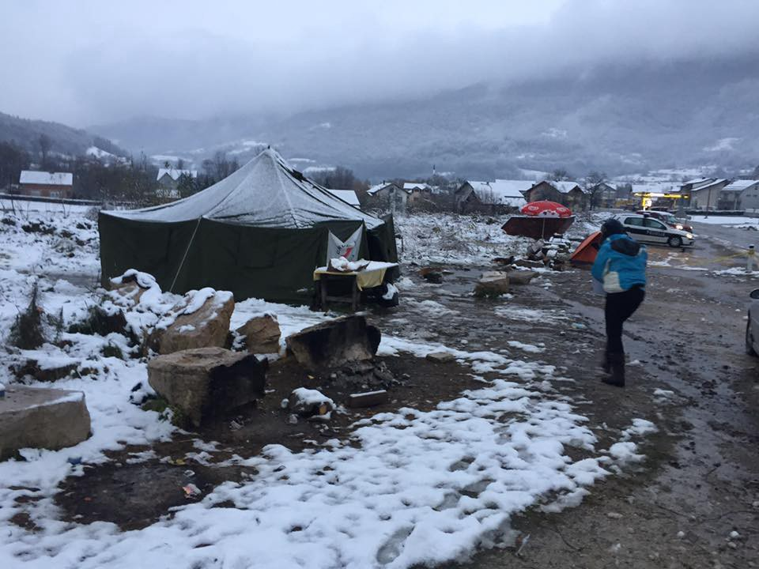
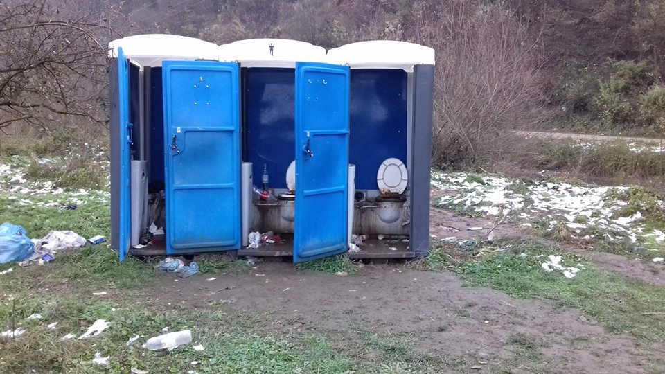
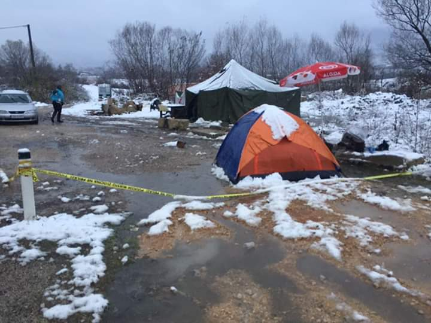
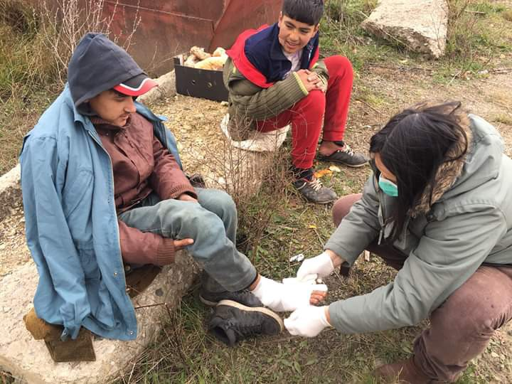
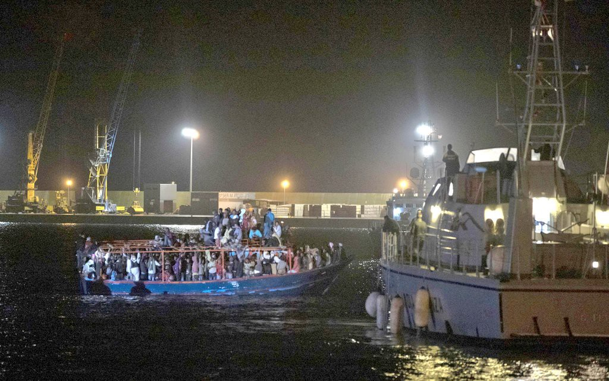

### الملخص الأسبوعي \(ا\.ي\.س\) : عمليات الإخلاء والمعاملة اللاإنسانية للاجئين في أوروبا
#### **AYS Weekly News Digest in Arabic**

### البوسْنة والهَرْسَك

بعد نشر \(ا\.ي\.س\) مجموعة من الصور من المخيم المؤقت في فيليكا كلادوشا بعد أول تساقط للثلوج ، والمنظمة الدولية للهجرة ومفوضية الأمم المتحدة لشؤون اللاجئين ، وهما منظمتان دوليتان كبيرتان مسؤولتان عن اللاجئين والمهاجرين في البوسنة \(حتى الآن ، حصلوا على أكثر من ثمانية ملايين يورو من أوروبا الاتحاد للمساعدة في البوسنة\) ، وأخيرا نقلت الخيام من منطقة المستنقعات\.

جاءت حافلة بعد ظهر الأربعاء لنقل الأشخاص الذين أرادوا طواعية الذهاب إلى ميرال ، وهو مصنع تم منحه للاجئين لاستخدامه من قبل المالك\. وقال سكان المخيم إن حافلة أخرى ستأتي خلال الليل لكن لم يأت أحد\. يبدو أن المنظمة الدولية للهجرة لم تعلم الناس عندما كانوا قادمين ، وكان الكثير منهم في المدينة في الوقت الذي وصلت فيه الحافلة لإخراجهم\.

](assets/f5b8200541a2/1*q6nfWQ00oKEqAUgwAhGOfQ.jpeg)

صورة: [SOS Team Kladuša](https://www.facebook.com/SOSTeamKladusa/?ref=br_rs)

هناك من يفضلون عدم الذهاب إلى ميرال ، وحتى الآن ليس من المؤكد ما إذا كانوا سيضطرون إلى التحرك في الأيام المقبلة\. على الرغم من حقيقة أن ميرال منشأة دافئة مع إمكانية الوصول إلى الاستحمام الدافئ والطعام ، إلا أن البعض لا يزال يشعر بالقلق من أنه من غير الآمن أن ينام الناس من مختلف الأعراق المختلفة في مثل هذا المكان المشترك الكبير دون أي خصوصية\. قال الكثير من الأشخاص الذين تحدثنا إليهم إنهم يفضلون البقاء في خيامهم في المخيم المؤقت مع أصدقائهم حيث يبدو أنهم يشعرون بأنهم يتمتعون بمزيد من الخصوصية والأمن\.

](assets/f5b8200541a2/1*GdYER6JwsVOxNhyK7_5hDw.jpeg)

صورة: [SOS Team Kladuša](https://www.facebook.com/SOSTeamKladusa/?ref=br_rs)

هناك ما يقرب من 80 إلى 100 شخص ما زالوا في المخيم الميداني في الوقت الحالي\. وفقا لبيانات ، توقف توزيع المواد الغذائية هناك\. ولا يزال يقدمه المطعم المحلي الصغير “كود لاتانا” ، والذي يتم طبخه وإعداده من قبل السكان المحليين واللاجئين أنفسهم\.

حوالي 300 شخص كانوا يعيشون بالفعل في هذا المبنى الصناعي الكبير ، والآن وصل 200 شخص آخر\. وفقا لوسائل الإعلام المحلية ، سيتم وضع خيام كبيرة إضافية في نفس المنطقة من أجل استيعاب المزيد من الناس ، إذا لزم الأمر

بعد زيارتهم للمنشأة ، قال متطوعان من ومينو أن الغداء كان يخدم خارج المبنى وأن معظم الرجال كانوا موجودين\.

وذكرت المنظمة نفسها من ترنوفي \(ليست بعيدة عن فليكا كلادوشا\) أن مخيمًا افتتح في مايو هذا العام ، حيث يعيش الناس في ظروف غير إنسانية ولم يتم تنظيف وطهاره مراحيض متحركة منذ فتح المنبى

صورة: Umino

يمكن العثور هنا على [فيديو](https://www.facebook.com/zehida.bihoracodobasic/videos/1332979410172443/) وصفي للحالة في ترنوفي قبل نقل السكان إلى مصنع ميرال

م\.ف\.س\_يماوس ، وهي منظمة تدعمها مفوضية الأمم المتحدة السامية لشؤون اللاجئين في البوسنة ، بتوزيع الطعام والملابس دون أي اتصال اجتماعي أو شخصي مع الأشخاص الذين كانوا يقدمون المساعدات لهم\. وكما هو معتاد في هذه الحالات ، يجب ألا ننسى أنه بدون أي تحقيق سابق في الاحتياجات وبدون تنظيم التوزيع بشكل صحيح ، فإن النتيجة الوحيدة الممكنة هي إهدار للتبرعات وإحساس متزايد بالإحباط بين طالبي اللجوء

تواصل \(ا\.ي\.س\) تلقي المزيد من التقارير حول الأشخاص الذين قرروا العودة إلى صربيا ، باستخدام نفس الطريق الذي وصلوا إلى البوسنة\. أفاد بعض الأشخاص أن الشرطة البوسنية ، وخاصة في المنطقة المحيطة بدوبوج \(شمال شرق البلاد\) ، تخرج الناس من القطارات\. كما كتبنا في الملخص بالأمس ، تلقينا تقارير من منطقة بيلينا \(الحدود مع صربيا\) لمصادرة الشرطة للهواتف والمال من الأشخاص الذين توقفتهم وتفتيشهم ، والذين سمح لهم بمتابعة هذه الحلقات

وفي الوقت نفسه ، يُجبر طالبي اللجوء على مغادرة الباصات من سراييفو إلى بيهاتش ويتركون من تلقاء أنفسهم في المنطقة القريبة من كلاغوي \(الجزء الشمالي الغربي من البلد\) \. وعلاوة على ذلك ، فمنذ يوم أمس ، توجد مجموعة تضم حوالي 60 شخصا في فيليزيفو \(في الشمال الغربي\) ، وهي المدينة التي أوقفوا فيها وأجبروا على ركوب حافلات سراييفو — بيهاتش\. يقدم السكان المحليون من مدينه كلوج القريب والصليب الأحمر الطعام والملابس والأشياء الأخرى المطلوبة\. جلبت منظمة أطباء بلا حدود بعض المساعدة ، وكذلك مجموعات من المتطوعين الذين نزلوا من بيهاتش\. وفضلاً عن ذلك ، ووفقاً للصليب الأحمر المحلي ، لم تصل أي من السلطات أو المنظمات الدولية الكبرى في المنطقة إلى الموقع

> يضطر الناس للنوم على الأرض ، ولا يترك لهم طعامًا أو ماءًا في مكان لا توجد به مراحيض قريبة أو أي مساعدة طبية … 

> … يحاول المواطنون والصليب الأحمر المساعدة منذ ذلك الوقت أخذ الناس من الحافلات بدأت\. قمنا بتشكيل نوبات على مدار 24 ساعة في هذا المجال ، في انتظار الحافلات والناس\. حتى أن لدينا العديد من الحالات حيث قامت الشرطة في بيهاتش باعتقال أشخاص في المدينة وجلبتهم إلى هنا دون سبب وتركواهم في الميدان\. نحن ، في القرية ، لا نملك القدرة على رعاية الناس\. وقال أحد متطوعي الصليب الأحمر لوكالة الأنباء “آيز”: “إن الأشخاص الذين يساعدونهم مرهقون للغاية ويخرجون من الإمدادات”\. 

يتم تنفيذ هذه الممارسة غير المشروعة في البوسنة بالطريقة التي يسمح بها الناس على ركوب الحافلات في سراييفو ، إلا أن تؤخذ من الحافلات بالقرب من مدينه كلوج\. يجب أن يجد الناس طريقهم بأنفسهم ، أو يشتروا تذكرة حافلة للعودة ، أو يواصلون السير باتجاه بيهاتش\. في هذه الحالة بالذات ، جمع السكان المحليون المال لشراء تذاكر لسراييفو لحوالي 30 شخصًا\. سيتعين على الآخرين الانتظار عند هذه النقطة

صورة: Red Cross Ključ

في سراييفو ، حيث افتتح المخيم مؤخرا وتديره المنظمة الدولية للهجرة ، والناس الذين يحاولون الدخول إلى المخيم والتسجيل يتم منعهم من القيام بذلك بدون أي تفسير واضح\. ليس من الواضح لماذا يحدث هذا ، وما هو موقف المنظمة الدولية للهجرة أو ما ينبغي على الناس فعله في هذا الوضع ، مع الأخذ في الاعتبار أنه المخيم الوحيد في هذا الجزء من البلاد\.من الصعب معرفة المدة التي ستستمر فيها الشرطة في البوسنة في هذه الممارسة غير المشروعة ، لكن ما هو واضح هو أن كارثة إنسانية في طور الإعداد

### **البحر**

فقد تسعة أشخاص حياتهم في البحر أثناء غرق السفينة في غرب البحر الأبيض المتوسط\. ولم ينج إلا الشاب المراهق من غينيا من المأساة التي تم ترصدها يوم الاثنين ، حيث ذكر أن القارب كان على في البحر لمده اسبوع دون محرك\.وكانت الظروف الجوية سيئة ونقص الغذاء والماء الأسباب الرئيسية لوفاة الآخرين معه ؛ تم العثور على جثتي اثنين من الضحايا قبالة ساحل كاديز ، اسبانيا

](assets/f5b8200541a2/1*KDKPEmnNmCe0jERKC_nhvg.jpeg)

صورة: [Mediterranea Saving Humans](https://www.facebook.com/Mediterranearescue/photos/a.275129009774997/292455398042358/?type=3&theater)
### **إيطاليا**

احتج مئات من طالبي اللجوء الذين يعيشون في كارا مينو \(كاتانيا ، صقلية\) هذا الصباح عن طريق سد الطريق الرئيسي الرابط لبضع ساعات في المنطقة\. تم إطلاق الاحتجاج بالإعلان عن قطع التمويل لخدمات البنية والنقل\.في الوقت الحالي ، يستضيف المبنى حوالي 1500 شخص ، 80 منهم حصلوا على تصاريح الاقامه ، وبالتالي ، يجب ترك المبنى، لكنهم يرفضون القيام بذلك إذا لم يحصلوا على الأموال التي يستحقونها ، من أجل مغادرة كارا \(تكلفة تذكرة النقل\)

صقلية, البحر

### **النمـــــــــسا**

المحكمة العليا في الاتحاد الأوروبي تحظر القيود النمساوية على حقوق اللاجئين \. \.أصدرت محكمة العدل الأوروبية حكمًا ضد لائحة عام 2015 التي منحت النمسا الحد الأدنى من المساعدات الاجتماعية للاجئين\. قدمت حكومة النمسا عددا من التخفيضات الصارمة للاجئيين في الآونة الأخيرة\. ثم أمرت محكمة العدل الأوروبية \(ي\.س\.ج\) النمسا بالتراجع عن لوائح يوم الأربعاء التي منحت اللاجئين مساعدات اجتماعية أقل بشكل ملحوظ من النمساويين المولودين في النمسا
### فرنسا

**We strive to echo correct news from** **the ground through collaboration and fairness\.**

**Every effort has been made to credit organizations and individuals with regard to the supply of information, video, and photo material \(in cases where the source wanted to be accredited\) \. Please notify us regarding corrections\.**

**If there’s anything you want to share or comment, contact us through Facebook or write to: areyousyrious@gmail\.com**

_Converted [Medium Post](https://medium.com/are-you-syrious/%D8%A7%D9%84%D9%85%D9%84%D8%AE%D8%B5-%D8%A7%D9%84%D8%A3%D8%B3%D8%A8%D9%88%D8%B9%D9%8A-%D8%A7-%D9%8A-%D8%B3-%D8%B9%D9%85%D9%84%D9%8A%D8%A7%D8%AA-%D8%A7%D9%84%D8%A5%D8%AE%D9%84%D8%A7%D8%A1-%D9%88%D8%A7%D9%84%D9%85%D8%B9%D8%A7%D9%85%D9%84%D8%A9-%D8%A7%D9%84%D9%84%D8%A7%D8%A5%D9%86%D8%B3%D8%A7%D9%86%D9%8A%D8%A9-%D9%84%D9%84%D8%A7%D8%AC%D8%A6%D9%8A%D9%86-%D9%81%D9%8A-%D8%A3%D9%88%D8%B1%D9%88%D8%A8%D8%A7-f5b8200541a2) by [ZMediumToMarkdown](https://github.com/ZhgChgLi/ZMediumToMarkdown)._
