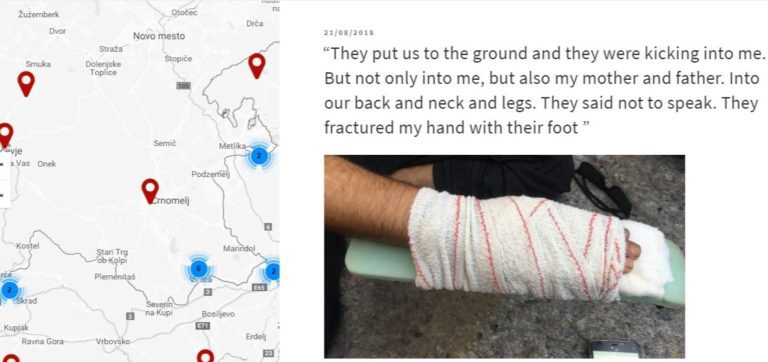
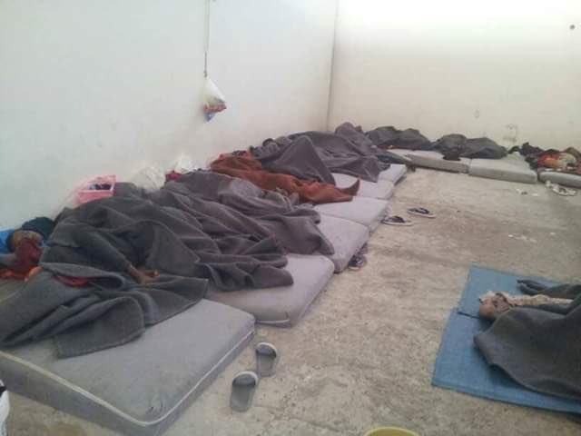
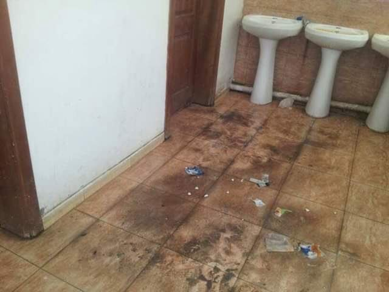
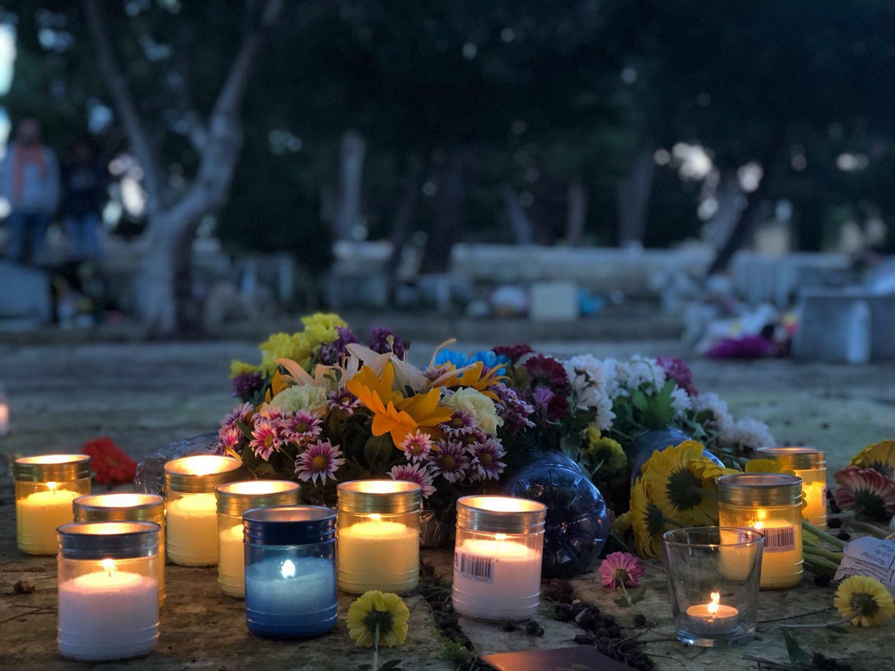
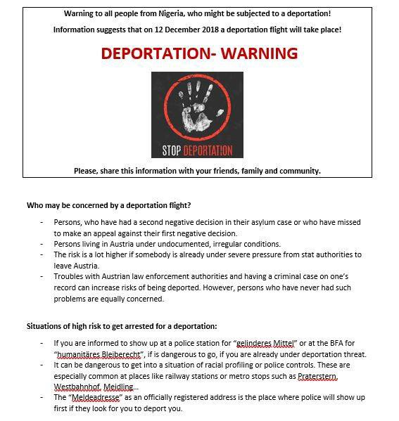
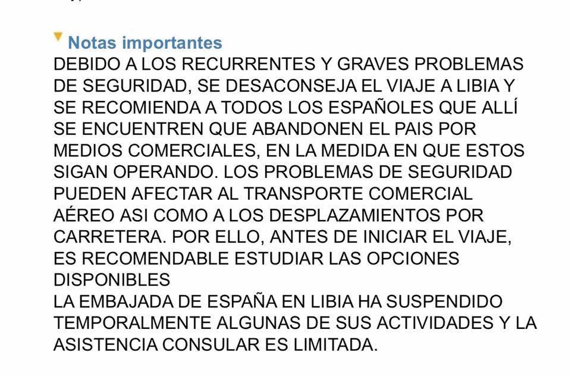
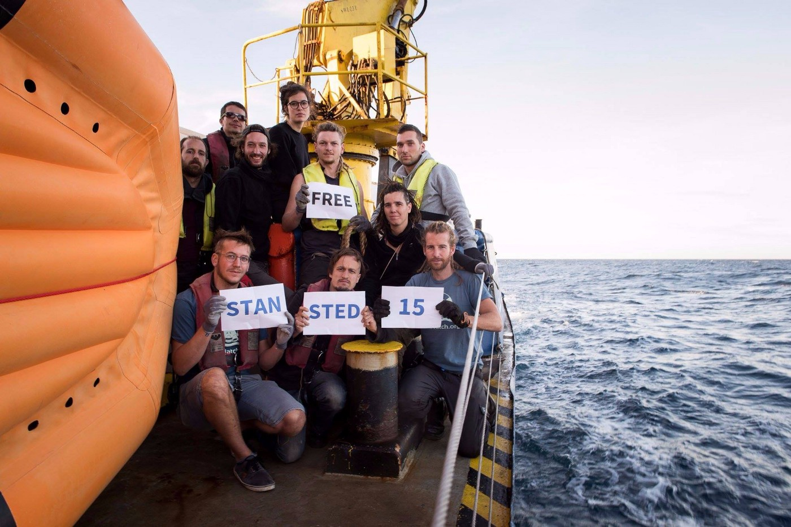

### AYS Daily News Digest 26/11/18: Night deportations, detention, push backs and denial of the police
#### The police vs\. reports of illegal pushbacks, Slovenia case / No concrete reactions to the dire situation at the Abu Salim detention centre in Tripoli / lawsuit against Greek authorities over a death / flu epidemic in Velika Kladuša, BiH / help needed in France / 15 people in the UK could be sentenced to life imprisonment for preventing deportation / more news

](assets/df87a8d965ac/1*l6U5mWX3B0fVcWHkw2Iegw.jpeg)

“The sea has become a cemetery, and these islands are the tombstones“\. Moving words shared by members of the local community on Malta, in support to the many who’s lives continue to be lost at the hands of a cold, uncaring migration policy\. — [LIFELINE](https://www.facebook.com/seenotrettung/?tn-str=k%2AF&hc_location=group_dialog)
#### FEATURE

Recently, we have been receiving a lot of calls for help in finding missing relatives and friends who were on the move and whose contact got lost in the western Balkans\. A worried cousin recently updated the situation of their relative saying they had found out that the Turkish mafia which is operating in the area between Slovenia and Bosnia has allegedly abducted their relative, along with other people, taking them away, asking for ransom\. It is difficult to establish a way to know the exact number of people who have lost their lives in the woods and rivers, trying to cross them\.
In addition to this, people are constantly reporting pushbacks and ill treatment by officials in the region\. The area between Serbia, Bosnia and Herzegovina, Croatia and Slovenia seems to have become a black hole for refugees and migrants, who are not allowed to travel legally and in a legitimate way or to apply for international protection, though the Croatian MOI representatives, like an automated machine, keep repeating this is possible, even stating at conferences that Croatia supports only legal migration and that asking for international protection is possible at the Croatian borders\. By now, everyone knows it is not so, but seemingly rooted in the law, geographically in a tricky position, the Croatian police has so far answered very few of the many critiques coming their way\.

Unlike them, their Slovenian counterparts seem to follow what is being reported and written about them, and they have even reacted to a report of police abuse and \(chain\) pushbacks that the Border Violence Monitoring Team [documented](https://www.borderviolence.eu/violence-reports/august-21-2018-1600-caught-and-attacked-by-the-police-in-the-inner-slovenian-land-in-a-forest-by-the-town-crnomelj-viz-map-below/) \.

The police _totally reject the claims made, as it has been established that the events described cannot be placed in our area\._ They reject any possibility of having taken part in unlawful procedures, and — of course — repeat that:

_No irregularities and no unlawful or inappropriate police conduct were identified in procedures with foreigners\. Police officers strictly respect their rights and all human rights\. All foreigners are given humanitarian aid \(food, clothing, etc\. \) and, if appropriate, medical care\. If they are seeking asylum, they can file an application for international protection\._

\(…\) _information was inaccurate — the individuals making the allegations had either not been processed by our police officers at all or they were unable to provide the date of procedure or the place where they had crossed the border or say the police of which country brutalised them\._

In their [**answer to the Police**](https://www.borderviolence.eu/a-letter-from-the-slovenian-police/) that you should definitely read, the team argues that the police should have been able to properly investigate and find the evidence and traces of these people being processed by the Slovenian police, as the case documents provided more than enough material and information for officials, with all the access the every type of data, to do so\. They also said:

> _A quick look into the database revealed some more cases in which, allegedly, the Slovenian police was involved in unlawful behaviour\. In 2018 alone there are **28 cases of push\-backs involving Slovenian police officers** \. We have collected these reports for you below\. In 22 of the cases, requests for asylum were deliberately ignored\. In seven cases, the persons seeking asylum reported they had been physically abused by Slovenian police officers\. Seven cases involved minors\. Most of the interviewees claim to have been body\-searched, some to have been stripped of their clothes\. Many were taken to a police station were they had to sign documents they did not understand, for only rarely was a translator provided\._ 

> _We would like to use this opportunity to ask the Slovenian police for their position regarding this information\. We assume it to be in your own interest that all of these cases are looked into, so that — should it turn out that unlawful push\-backs are indeed not something entirely made up — appropriate measures can be taken to prevent them from happening in the future\._ 

> _All of the cases below are so\-called chain push\-backs\. That means that Slovenian police officers deport people on the move to the border with Croatia, where they are transferred to the Croatian police who then continue to deport them to Bosnia or Serbia\._ 

#### LIBYA
### Devastating consequences to the young lives of Libyan detainees

■■■■■■■■■■■■■■ 
> **[MOAS](https://twitter.com/moas_eu) @ Twitter Says:** 

> > #SaturdayStats: according to the latest @refugees update, as of November 22nd the Libyan Coast Guard has intercepted 14,595 #refugees and #migrants in the Central #Mediterranean. #MOAS remains gravely concerned about the safety and wellbeing of all those returned to #Libya. https://t.co/M3sikq6Ztv 

> **Tweeted at [2018-11-24 17:14:58](https://twitter.com/moas_eu/status/1066379660206968832).** 

■■■■■■■■■■■■■■ 

More than 500 people live in Abu Salim detention centre in Tripoli, including some who are very ill after having been smuggled in\. Among them, there are 20 children and four babies\.

](assets/df87a8d965ac/1*dq6bpMN24u2zdYLkLJmWpQ.jpeg)

Photos via [**Sally Hayden**](https://twitter.com/sallyhayd)

More than 10,000 refugees and migrants have reportedly been sent back to Libya and locked up indefinitely under EU policy, aimed at stopping migration to Europe\.

■■■■■■■■■■■■■■ 
> **[Sally Hayden](https://twitter.com/sallyhayd) @ Twitter Says:** 

> > Lyrics to this song, reportedly written &amp; recorded by refugees in Abu Salim detention centre, Tripoli, Libya: 
[soundcloud.com/user-60656923/…](https://soundcloud.com/user-60656923/abu-salim-dc-song-about-libya-sahara-those-whove-lost-their-lives) https://t.co/6CmsfDytQY 

> **Tweeted at [2018-11-25 18:10:07](https://twitter.com/sallyhayd/status/1066755928396128256).** 

■■■■■■■■■■■■■■ 

“I have seen signs of malnutrition in Libyan jails & the authorities are not fixing it\. DCIM has 8,000 staff on its payroll but, strangely, no money to feed people who should, for the vast majority of them, never have been detained” — said V [incent Cochetel‏](https://twitter.com/cochetel) of the UNHCR, responding to the facts published by Sally Hyden, who has been in contact with some of the detained people\.

> Three months today since refugees in a Libyan detention centre first contacted me\.
 

> Talking to a 20yo Eritrean who says he’s lost 14kgs since entering into a DCIM\-run “official” Tripoli detention centre, because of how little food they’re given\. He’s been imprisoned since trying to cross to Italy eight months ago\. 

■■■■■■■■■■■■■■ 
> **[Sally Hayden](https://twitter.com/sallyhayd) @ Twitter Says:** 

> > Asking more detainees in Libya about people becoming mentally ill from the trauma of what they've been through. One said the majority started being like that after being turned back from the sea, because they didn't expect it. [twitter.com/sallyhayd/stat…](https://twitter.com/sallyhayd/status/1058775298903343104) https://t.co/jxMVU6ZCcO 

> **Tweeted at [2018-11-05 14:20:49](https://twitter.com/sallyhayd/status/1059450466793340929).** 

■■■■■■■■■■■■■■ 

#### MALTA

[LIFELINE](https://www.facebook.com/seenotrettung/?tn-str=k%2AF&hc_location=group_dialog) team writes: “Yesterday, our crew joined the community in Malta to commemorate those who died at sea in search of peace & safety\. April 2015 saw two of the biggest Mediterranean shipwrecks claim over 1,000 lives, the few recovered bodies laid to rest in an unmarked grave at Addolorata cemetery\.”

](assets/df87a8d965ac/1*BbhDKeoke9PlXQSB0am1Ow.jpeg)

“The sea has become a cemetery, and these islands are the tombstones“\. Moving words shared by members of the local community in support to the many who’s lives continue to be lost at the hands of a cold, uncaring migration policy\. — [LIFELINE](https://www.facebook.com/seenotrettung/?tn-str=k%2AF&hc_location=group_dialog)
#### GREECE

](assets/df87a8d965ac/1*IXl35xunKSOck53UF6t2LQ.jpeg)

[Aegean Boat Report](https://www.facebook.com/AegeanBoatReport/?tn-str=k%2AF)
### Greece sued over a death in Moria

Nearly two years after an Egyptian migrant died at the Moria reception and identification centre on the eastern Aegean island of Lesvos, his family has filed a lawsuit against Greek authorities over his death, saying it was caused by the negligence of responsible officials, Greek media [report](http://www.ekathimerini.com/235042/article/ekathimerini/news/greece-sued-over-migrant-death?fbclid=IwAR0WF3oewNyWiOZBotKr__yLbu0scJmO63bKgWxwMXhqh9ZzvI0lBBs3usk) in more detail\.

■■■■■■■■■■■■■■ 
> **[Mobile Info Team](https://twitter.com/mobileinfoteam) @ Twitter Says:** 

> > Statistics and graphics about Dublin procedures from Greece to other countries. Vast majority of them are under the family reunification criteria. Available in English, Arabic and Farsi:
[mobileinfoteam.org/family-reunifi…](http://www.mobileinfoteam.org/family-reunification-statistic) https://t.co/uXFZ3AjeOk 

> **Tweeted at [2018-11-26 09:52:28](https://twitter.com/mobileinfoteam/status/1066993081113817088).** 

■■■■■■■■■■■■■■ 

**BALKAN WEATHER forecast for Tuesday, 27\.11\.**

**Montenegro**

Moderately to entirely cloudy, showers accompanied with thunder in places\. During the afternoon in mountains, rain turning into snow which will descend to the lower regions towards the end of the day and during the night\. In the afternoon in the north, and at the end of the day or during the night, strong to very strong wind blowing drom the north and northeast\. The highest daily temperature from 0 to 12 and highest daily from 2 to 17 degrees\.

**Serbia**

Cloudy and colder with local rain\. During the day rain turning into snow in the mountains, and during the night snow and sleet in the lower regions with a further decrease in temperatures \. The wind will be weak to moderate blowing from the northwest\. The **lowest temperature from 4 to 7** and highest daily from 7 to 11 degrees\.

**BiH**

Predominantly cloudy\. Before noon rain in the south and northwest\. In the afternoon weak rain in the lower regions of central, east and southeast Bosnia, snow and sleet in the higher areas\. During the day a fall in temperatures with rain gradually turning into sleet and snow in the west and south\-west\. In the evening and during the night, sleet and snow in the lower regions of Bosnia\. In Herzegovina moderately cloudy in the morning and in the afternoon cloudy with rain\. In Bosnia weak to moderate wind from the north and in Herzegovina moderate Bura\. The **temperature will be from \-1 to 6, and to 10 in the south** \.

**Croatia**

Predominantly cloudy with local rain, mostly in south Dalmatia\. A **drop in temperatures in Gorski Kotar during the morning with rain turning into sleet and snow** , and towards noon possibly also in the lower regions inland\. Inland the wind will be moderate from the north and northwest, locally with strong gusts, and in Slavonia from the northwest\. Alongside the coast strong to very strong Bura, possibly stormy\. The temperature inland will be from 1 to 6, along the coast from 6 to 11 and the highest daily 14 degrees\.
#### SERBIA

A group of 19 Afghans including four unaccompanied or separated children complained to Info Park’s staff that they had suffered violence from Bulgarian police on several occasions during their transit through the country, Info Park reports, reporting also that over the weekend 60 new arrivals were encountered in Belgrade\. In the evening hours, on both days Info Park’s field team counted a total of 504 refugees and migrants present in the parks and the streets of Savamala neighborhood\.
#### BOSNIA AND HERZEGOVINA
### Flu among refugees and migrants in Velika Kladuša

A doctor working in the area mentioned has published a warning text explaining the severe medical situation that hundreds of refugees are currently in\. So far, this is the only source we have found reporting a flu epidemic among the people in Velika Kladuša\. Here is the entire text:

> _Today, in only a couple of hours, 53 refugees and migrants were seeking help from the volunteer medical team \(VMT\) of S\.O\.S\. Ljuta Krajina in Velika Kladuša\. Thirty of them needed help for different injuries and skin conditions, while 23 refugees and migrants came with symptoms of flu\. Medical volunteers of S\.O\.S\. started reporting about a flu epidemic from last Friday \(23\.11\. \) when the first ten refugees and migrants came to them with symptoms of flu\. Every day since Friday, about ten new patients visited our medical volunteer with flu symptoms, but today the number of new flu\-infected patients increased to 23\. No need to say that most of the flu\-infected patients came from the makeshift camp of Trnovi \(not winterized\) where they sleep on the ground in a wetland covered often only with polyvinyl\. Also, no need to say that you will not find information on the epidemic in the reports about healthcare of refugees and migrants composed by UN agencies\. Partly the reason for this silence is the non\-existence of a proper humanitarian or regular health service for refugees and migrants in BiH \(so the documentation and information are generally missing\), partly the reason lies in the coverup style of reporting practicing by UN agencies in BiH\. Until now not one of the epidemics that occurred in Velika Kladuša camps were reported in public, including a very serious epidemic of gastroenteritis that occurred this August when 2/3 of the Trnovi camp \(approximately about 300 people\) were suffering from vomiting and diarrhea \(many of them went to the toilet more than 20 times per day\) but this dramatic medical event did not find its place in any official report\. \(photography: S\.O\.S\. volunteers in medical action in Talakić street of Velika Kladuša, BiH\)_ 

> _Dimitar Anakiev, MD_ 

> _GP and Global Health spec\._ 

#### CROATIA

Similar to other countries, like Germany, the Croatian practice with asylum seekers, mostly those from Maghreb, now includes sending those who had received a negative decision by the Court after the first appeal to the detention centre in Ježevo throughout the duration of the decision procedure\. This is a recent trend that probably aims at controlling the movement of asylum seekers during the process\.
#### AUSTRIA

](assets/df87a8d965ac/1*hxTy-sgduK7U54SCDBvBxw.jpeg)

Infographics: [Wiener Vernetzung gegen Abschiebungen](https://www.facebook.com/plattform.refugees.welcome/?tn-str=k%2AF&hc_location=group_dialog)
#### FRANCE
### Aid needed across the country

Volunteers across France are calling for action in order to be able to help and provide basic amenities to all the people staying outside\.

> Refugees in Paris are in desperate need of our help this winter\. There are currently around 1500 refugees on the streets of Paris, including some families and many minors\. There is no refugee ‘camp’ in Paris, instead, people are scattered around the city, sleeping under bridges, in parks or on the pavement\. There are simple standpipes in the street to provide water but few places to shower or wash clothes\. 

[Refugee Aid Network’s fundraiser for Paris refugees](https://www.facebook.com/donate/631673463901790/2123860264498002/) 
[Refugees in Paris are in desperate need of our help this winter\. There are currently around 1500 refugees on the…www\.facebook\.com](https://www.facebook.com/donate/631673463901790/2123860264498002/)

Help them help the refugees in Paris\.

> It is currently 3 degrees at night in Calais; that’s the temperature inside your fridge\. It’s only going to get colder and for people sleeping rough, the weather is going to make their already dire living conditions totally unbearable\. 

> A dedicated group of volunteers are working out of the Help Refugees / L’Auberge des Migrants warehouse to bring firewood and fuel to displaced people in Calais\. 

#### SPAIN
### Officials to send the 12 saved people back to the country that enables their suffering

An executive in the case of the rescued people on board of Nuestra Madre de Loreto is “negotiating” with the Libyan authorities “the landing” of a total of 12 migrants rescued by the fishery of Santa Pola \(Alicante\), among whom are two minors, according to the government delegate in the Valencian Community\. Folowing that decision, they should “disembark in a Libyan safe harbor, which is the maritime rescue zone that corresponds to the area where these immigrants were rescued” \. The country, however, is not considered a safe harbor [because of the numerous documented abuses against the migrant population](https://www.eldiario.es/desalambre/Libia-noche-violaban-delante-matar_0_789171121.html) in the country\.

[Proactiva Open Arms](https://www.facebook.com/proactivaservice/?tn-str=k%2AF&hc_location=group_dialog) recalls how unsafe Libya is and again draws attention to the double standards European countries continue having when it comes to human rights and safety\.

“ Yes, if you are marine, fisherman or on board of a vessel, you can go to the country where diplomats were evacuated even to the Italian Ambassador\. To which secure port will they be sending Nuestra Madre de Loreto?”
#### GERMANY
### Fear of night deportations in German ‘anchor centres’

> “We stay awake until three o’clock or even until five o’clock, we cannot sleep, we whisper together\. \.We are all depressed, we all have mental stress and we are thinking about how we are going to continue\.” — _23\-year\-old man from Afghanistan staying inn one of the ‘anchor centres’ in Bavaria_ 

Following an order of the Bavarian State Government, what used to be ‘transit centres’ are now called “anchor centres”\. Anchor stands for “Arrival, Decision and Repatriation”\. This should be done without unnecessary bureaucracy and as quickly and effectively as possible; the decision\-makers are personally present in the centers as well: the Federal Office for Migration and Refugees \(Bamf\), the Administrative Court, the Return Advisory Service and the Employment Agency\. Everything should be done in one go\. Since August this year, every newly arrived refugee in Bavaria has been lodged in one of the seven ‘anchor centres’ in Bavaria\. This represents the implementation of what the Federal Interior Minister has in mind for all of Germany\. The maximum length of stay is six, for certain groups up to 24 months\. Since the beginning of August there has also been an ‘anchor center’ in Saxony, since the end of September also one in the federal state of Saarland, media [report](http://taz.de/Ankerzentren-in-Bayern/!5548527/?fbclid=IwAR3342jpHJd7tpD76G1ghw8kU84wo81oHBie51gKE-QYSOe2-QPAtmcjD5M) \.

Although the camp is not a prison, it is a closed\-off place: no one is allowed to enter except for the authorities and other organisations, such as Caritas Social Counseling\. Relatives or friends of those in the anchor center wishing to visit them will be rejected\.

> In recent months, the provision of counseling for refugee accommodation has expanded, but critical organizations are being denied access\. — _Jana Weidhaase, Bavarian Refugee Council, officially banned from the centre_ 

### Rewarding ‘voluntary’ returns

Covered housing costs of refugees in their home country for twelve months if they leave before the end of the year\!
 — this is the deal the German Ministry is proposing in the wave of forcing through the international community’s idea number one: [Assisted Voluntary Return and Reintegration](https://www.iom.int/assisted-voluntary-return-and-reintegration) \.

> “Your country\. Your future\. Now\!“ 

— This is written in capital letters on posters\. Below, hidden in an email address: “Voluntary return”\. The Ministry of Interior has translated the slogan into several languages, including Arabic and Russian\. The poster series currently ‘decorates’ the walls of stations in several German cities\. 
[Reportedly](https://taz.de/!5553085/?fbclid=IwAR1SWuhEa7QR2G4sk0ZLV2_XQLlY8W68W8dv9J7TUrJ_zfWKORa_J0h0pM4) , half a million euros in tax money has been spent on this promotional activity\.

The campaign has already received a lot of critiques\.

#### UK

In two weeks, 15 people in Britain could be sentenced to life imprisonment for non\-violent civil disobedience\. They tried to prevent a deportation\.

> “Such a penalty is absurd and shows that the rule of law is no longer separated from the political agenda\. An example is to be made to prevent others from similar non\-violent measures to defend human rights\. We admire the courage of these people“ — [_Sea\-Watch_](https://www.facebook.com/seawatchprojekt/?tn-str=k%2AF&hc_location=group_dialog) 

Photo credit: Chris Grodotzki

From this week on, we are publishing a **weekly overview in Arabic and in Persian** of some of the most important stories we covered during the previous week\. Share it with your Arabic and Persian speaking friends\. 
Here is last week’s **Arabic version: [الملخص الأسبوعي \(ا\.ي\.س\) : عمليات الإخلاء والمعاملة اللاإنسانية للاجئين في أوروبا](%D8%A7%D9%84%D9%85%D9%84%D8%AE%D8%B5-%D8%A7%D9%84%D8%A3%D8%B3%D8%A8%D9%88%D8%B9%D9%8A-%D8%A7-%D9%8A-%D8%B3-%D8%B9%D9%85%D9%84%D9%8A%D8%A7%D8%AA-%D8%A7%D9%84%D8%A5%D8%AE%D9%84%D8%A7%D8%A1-%D9%88%D8%A7%D9%84%D9%85%D8%B9%D8%A7%D9%85%D9%84%D8%A9-%D8%A7%D9%84%D9%84%D8%A7%D8%A5%D9%86%D8%B3%D8%A7%D9%86%D9%8A%D8%A9-%D9%84%D9%84%D8%A7%D8%AC%D8%A6%D9%8A%D9%86-%D9%81%D9%8A-%D8%A3%D9%88%D8%B1%D9%88%D8%A8%D8%A7-f5b8200541a2)** 
and **Persian: : [AYS خلاصه هفتگی بیرون راندن و رفتار غیر انسانی با پناهندگان در اروپا](ays-%D8%AE%D9%84%D8%A7%D8%B5%D9%87-%D9%87%D9%81%D8%AA%DA%AF%DB%8C-%D8%A8%DB%8C%D8%B1%D9%88%D9%86-%D8%B1%D8%A7%D9%86%D8%AF%D9%86-%D9%88-%D8%B1%D9%81%D8%AA%D8%A7%D8%B1-%D8%BA%DB%8C%D8%B1-%D8%A7%D9%86%D8%B3%D8%A7%D9%86%DB%8C-%D8%A8%D8%A7-%D9%BE%D9%86%D8%A7%D9%87%D9%86%D8%AF%DA%AF%D8%A7%D9%86-%D8%AF%D8%B1-%D8%A7%D8%B1%D9%88%D9%BE%D8%A7-27a8c9879ef1)**

**We strive to echo correct news from the ground through collaboration and fairness\.**

**Every effort has been made to credit organizations and individuals with regard to the supply of information, video, and photo material \(in cases where the source wanted to be accredited\) \. Please notify us regarding corrections\.**

**If there’s anything you want to share or comment, contact us through Facebook or write to: areyousyrious@gmail\.com**

_Converted [Medium Post](https://medium.com/are-you-syrious/ays-daily-news-digest-26-11-18-night-deportations-detention-push-backs-and-denial-of-the-police-df87a8d965ac) by [ZMediumToMarkdown](https://github.com/ZhgChgLi/ZMediumToMarkdown)._
