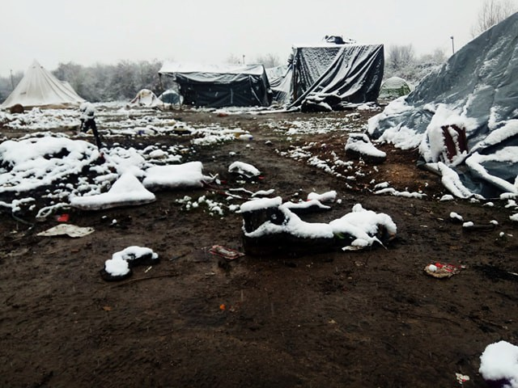
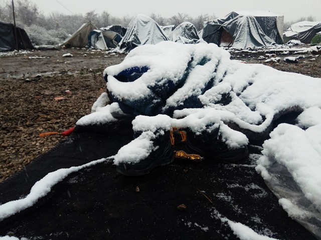
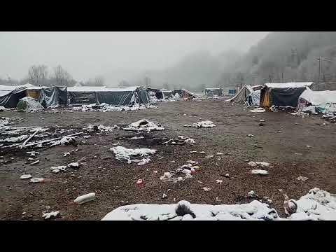
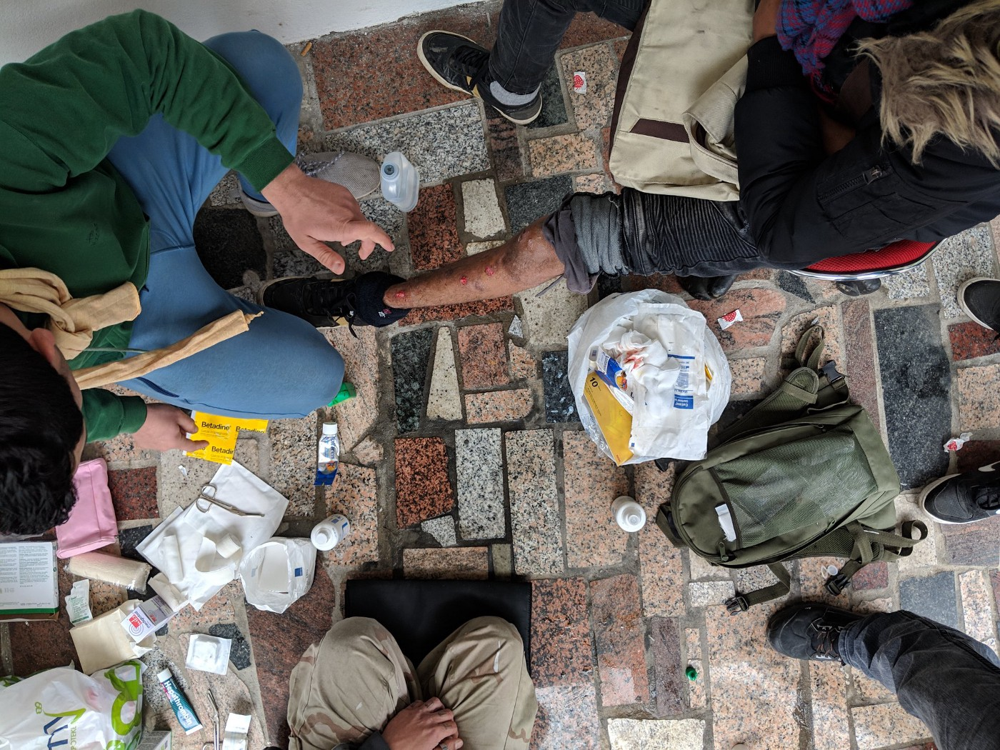
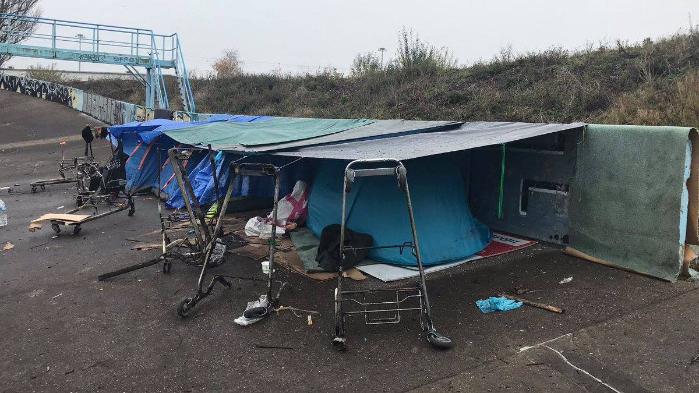
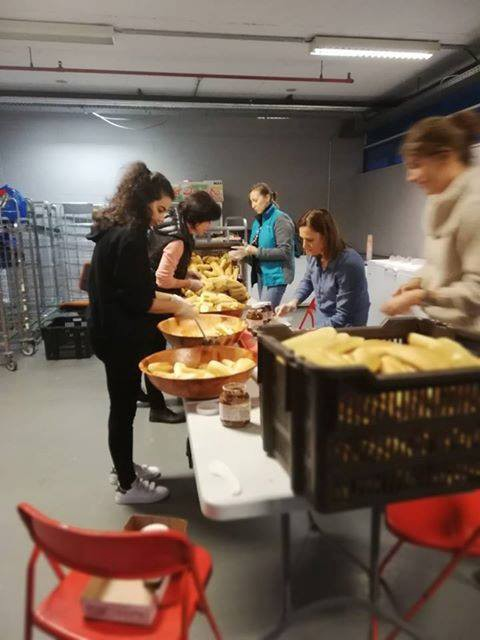

### AYS DAILY DIGEST 27/11/2018: It’s no dream, it’s a nightmarish reality of Europe today\!

_Volunteers describing the situation in Samos, in Velika Kladuša, in Calais, Paris, Brussels // The EU does not want to give up on the idea of disembarkation platforms // People coming back from Bosnia to Serbia…// AYS weekly digest now in Arabic and Farsi\!_

](assets/22d61557f81/1*xEJJI_Dez3twAXd4dTw3_A.jpeg)

Dunkirk on Saturday the 24th of November\. Photo by [VZWGent4Humanity refugee support](https://www.facebook.com/BelgiumGent4Humanity/?__tn__=%2CdkCH-R-R&eid=ARCSRQ6G2-g62Th4jJTekHclRoc_Okj_ZdQMl1eTDbuAK2Wu3E45t4n7jhCdCo3l9Ryhlf1NI3U1bNN8&hc_ref=ARROkSzMX_VPaj1QPatg8SgdGWVhTryUkQvZCMnVzzoYRJ8nD8tWAh93bzDrUwrJMDc&fref=nf)
### Feature: Statement from a volunteer on Samos

“I lost the words to describe the situation on Samos a long time ago\. Over 270 children with no family live at the camp, or outside of it\. The lucky ones are in a container, where eight beds need to accommodate 25\.

The unlucky ones have to find a place in the forest, which is uphill, and are often not even given a tent\. They have no access to water, toilets, showers or electricity\. It’s winter here and it’s been raining for three days\.

These are traumatized children who have been through a lot to get here, on their own, only to find that the most basic rights of the child don’t apply to them\.

The Greek government is in charge of this “crisis,” but it’s clearly unable to do much, at least not anytime soon\. There are procedures and protocols to follow and political discussions to have — but while that process goes on, we are allowing this to happen in front of our eyes and no one seems to be able to do anything about it\.

Is this Western civilization?

Tonight, five of them will leave, and we will go wave goodbye to them at the ferry\. We will be there, sleepy and cold, relieved that they can finally leave this living hell and hoping that they will be able to build a life, and a future, out of here\. Hoping that life will heal the physical, mental and emotional wounds that their stay on Samos inflicted on them\.

Tomorrow morning we will open the doors of our youth center for those who are still here, those who only have flip flops, those whose families are being bombed as I’m writing this, those whose tents got flooded, and those who lost everything and everyone\.

We’ll be here for them, hoping to provide a small relief from their day and helping them build their future\. Hoping that soon they’ll have proper food, a toilet, electricity and a roof over their head\.

Welcome to Europe, 2018\.”
### LIBYA

According to the [UNHCR numbers](https://reliefweb.int/sites/reliefweb.int/files/resources/66997.pdf?fbclid=IwAR39zt6_N2IkdvrhH9xNL2WgiGzSl5XPPQFqIx5a5sLL82LSeKjzVdLghNg) , by the beginning of this week there was 57,354 registered asylum seekers and refugees in Libya\. Out of this number, 3,572 people are in one of the accessible Libyan detention centres\.

■■■■■■■■■■■■■■ 
> **[Open Arms ENG](https://twitter.com/openarms_found) @ Twitter Says:** 

> > "I jumped into the water because I am not afraid of dying, I am afraid of Libya. I arrived in #Libya when i was 12, now I am 16. Libyans imprison people for money, I was not able to shower while I was there. My mother died." #NuestraMadredeLoreto  #united4med https://t.co/LS6O0YgXRX 

> **Tweeted at [2018-11-27 09:16:54](https://twitter.com/openarms_found/status/1067346517097361408).** 

■■■■■■■■■■■■■■ 

On Tuesday November 27th, the European Parliament Civil Liberties Committees’ session was dedicated to Libya\. Lawyers struggled to provide a detailed analysis of whether stalled EU plans to offload rescued migrants in north Africa were legal — but ultimately backed the controversial concept\.

But [EUobserver has obtained](https://euobserver.com/migration/143513?fbclid=IwAR3JhF7prcBd5CR85h8AdIJqeBKnBVzTe2JUXMTnWGd5xtvvCkdOY9qxy4E) a full copy of the 10\-page confidential report, which attempted to provide a legal analysis of stalled EU plans to set up so\-called [‘regional disembarkation platforms’ in north Africa](https://euobserver.com/migration/142223) and controlled centres in Europe\.

Among other things, the document states that “controlled centres and/or disembarkation platforms of a similar nature could be, in principle, lawfully established in the European Union territory… and that it “could lawfully be established outside of the European Union, in order to receive migrants rescued outside the territory of the Union’s member states\.”

By now, two possibilities were mentioned — to establish platforms in one of the North African states and in the Balkan region\. However, none of the mentioned countries showed any interest in hosting such platforms, nor did any of the EU member states\. But the EU says it is pressing ahead anyway\.

“The disembarkation arrangement, the discussion, is proceeding in the Council,” said Vincent Piket, a senior official in the EU’s foreign policy branch, the EEAS\.

The concept comes from the IOM and the UNHCR\.
### SEA

**106,269 people entered Europe by the sea so far this year\.** At the same time, **2,119 died** while dreaming of reaching the country where they will be safe and able to start a new life, according to the [IOM data](https://www.iom.int/sites/default/files/MedUp/mediterranean_developments_27nov2018.pdf?fbclid=IwAR13K3ggHzbIn0ffneITwLRIgeQjKKuMXv45u9cP5vDRRxsI4Y5rD35JJok) \.

During November, 110 people are known to have lost their lives in the Western Mediterranean\.

With winter here, the number of people who will die on the road, in the front of the closed borders, could easily increase\.

](assets/22d61557f81/1*3K9mrcggtdk2PqepOZweMw.jpeg)

[sea\-eye](https://www.facebook.com/seaeyeorg/?__tn__=%2CdkCH-R-R&eid=ARBUT7XeXHYRqGnMrdKwBy2fwvjYR9bhp2yIDnfvkBtnidXHQBPGV5FnqdYQun8fGQqlkuyeQKJCuTxp&hc_ref=ARSoYSN-GxMYYHlXFzAevHmuxBJnnhKRYvL-85tCo54oo0agyQbJWpJwoVPxiKJ-bIA&fref=nf&hc_location=group)
### ITALY

This year, [**22,923 people**](https://reliefweb.int/.../relie.../files/resources/66986.pdf) arrived to Italy\.
### BALKAN WEATHER forecast for Wednesday 28\.11

MONTENEGRO

During the day, changeably cloudy and windy\. In the north, predominantly cloudy with sleet and snow from time to time\. In the morning hours higher chances of precipitation; during the day less precipitation\. The wind will be amplified and very strong, in the south and centre with stormy gusts, blowing from the north and northeast\. The lowest temperature will be from \-6 to 10 and highest daily \-4 to15 degrees\.

SERBIA

Cloudy, windy and colder, snow throughout the country with formation of some snow covers in the centre and south\. The wind will be weak to moderate, locally strong, blowing from the north and northwest\. The lowest temperature will be from 0 to 4 and highest daily from 2 to 4 degrees\.

Warning; formation of snow covers\.

BiH

Cloudy with snow, with most of the precipitation before noon\. During the second part of the day a gradual decrease in precipitation\. Before noon cloudy in Herzegovina\. In most part of Herzegovina it will be less cloudy in the second part of the day, but not in the north\. In Bosnia weak wind from the north and in Herzegovina moderately strong Bura\. Temperature in Bosnia between \-4 and 1 and in Herzegovina between 4 and 9 degrees\.

CROATIA

During the morning cloudy land inwards, with isolated snow flurries\. In the afternoon precipitation will cease and clouds will also decrease\. Alongside the coast partly sunny wilt chase of some rain in the south\. The wind will be moderate with strong gusts blowing from the north and northeast\. Along the coast, a strong and stormy Bura will be blowing, with hurricane\-like gusts at the foot of mount Velebit\. The lowest temperature will be from \-4 to 8 and highest daily from \-2 to 11 degrees\.
### GREECE

This week, **[717 people](https://reliefweb.int/.../relie.../files/resources/66998.pdf) arrived on the Aegean islands** \. At the moment, at least **16,500 hundred people are stuck on the islands** \. Most of them are from Afghanistan \(33%\), Iraq \(18%\), and Syria \(13%\) \.

Approximately 20 percent of the children on the islands are unaccompanied or separated from their families, mainly Afghan and Syrian children\.

Decongestion is still very slow\. This week, only 877 people left with authorization from the authorities\.
### SERBIA

More people are arriving to Serbia, too\. Some are coming from Bulgaria or Macedonia, but many arrive from Bosnia\. After they tried to continue their journey, were pushed back, and could not find even a decent camp in Bosnia, many people decided to go back to Serbia or to try another way\. Some are also going back to Greece\.

According to the available data, 26 attempts to cross into the country were prevented on November 23rd and 25th\. Of this number, 24 were intercepted within Hungarian territory and returned to Serbia, while two were prevented from crossing the heavily\-guarded barbed wire border fence between the two countries\.

Those who are coming from Bulgaria complain about violence\. This was the case with a group of 19 Afghans, including four unaccompanied or separated children, who approached [Info Park](https://www.facebook.com/infoparkserbia/) ’s staff saying that they have suffered violence from Bulgarian police on several occasions during their transit through the country\.

At the moment, according to the Info Park team, there are about 504 people in the parks and the streets of the Savamala neighborhood\.

Many people are close to the EU border, hoping to cross soon\. Nevertheless, border police continues with push backs: 219 all together this week — 130 from Croatia, 53 from BiH, 27 from Hungary and 9 from Romania\.

At the moment, there are **4,030 registered** refugees, asylum\-seekers and migrants in Serbia, an increase from 3,711 two weeks ago\.

One story — which we are publishing a bit late — illustrates the alarming conditions in Serbia\. On November 14th, a young Syrian man died in the hospital in Belgrade despite receiving all possible treatment\. Reportedly, he had not been able to properly treat an injury sustained on the way to Serbia, resulting in major complications\.
### BOSNIA

Winter has begun in Bosnia\.

Makeshift camp in Velika Kladusa\. Photo AYS

While the IOM and UNHCR have established several camps across the country, the conditions are not ideal\. In the camp Ušivak, near Sarajevo, it is very cold\. People sleep in containers \(up to 8 people per container\) or under big tents\. The heating system that is provided is insufficient since the place is located in the shadow of a mountain\.

Additionally, in this camp, as well as in camp BIRA near Bihać, there is no hot water, and the only showers are located outside\. It is close to impossible to use them without getting a dangerous chill\. What’s more, they are unsafe — especially for women and children\. No activities are provided for people in any of the camps, so far\.

In Kladuša, the recently established transit center in the Miral factory is becoming a place of horror\. Women and children are especially vulnerable and completely unprotected\. People have no privacy, and nothing is provided for them but food\. These poor conditions contribute to a tense atmosphere where fights happen often\. About 600 people are living there, and it is run by the IOM\.

Due to this unbearable situation, some people, even families, have left the camp and returned to the makeshift camp in Velika Kladuša\. Here, conditions are less than humane, but still, there are once again around 100 people staying in shelters they constructed themselves\.

[SOS Team Kladuša](https://www.facebook.com/SOSTeamKladusa/) and [No Name Kitchen](https://www.facebook.com/NoNameKitchenBelgrade/) teams are providing basic help\. While NNK runs NFI and showers, SOS Team helps in the local restaurant where every day about 350 people come to eat\. They also provide first aid help daily, treating on average 25 patients per day with wounds from border violence, flu, diarrhea etc\.

Photo by SOS Team Kladusa

They also provide NFI \(non food items\) like blankets, shoes and clothes — these days there are a lot of people with wet clothes and shoes or completely without shoes, which is especially problematic with the worsening weather\.

Everything is needed in Kladuša, from food to NFIs\. If you can help, please contact SOS Team or NNK team\.

Help is needed in other places in Bosnia, too\. If you can donate, please help to local charity pomozi\.ba which provides food for people in Ušivak camp, as well as people in Sarajevo\.
### FRANCE

[Care4Calais](https://www.facebook.com/care4calais/?__tn__=%2CdkCH-R-R&eid=ARC6VctlCuU5jVYxAxAcyzNij7I80TdD_hnKhjN4_LnJTs91tBwGnfAQHfIYH5_VY6fdgD_9tf1AwKAs&hc_ref=ARTuP_7ml0y7fhUFQSE7lPp6wmzkZ9mMcM2YJ12BLRCTQkS5xY1LsszTE3pCr-3bWOU&fref=nf) needs help to provide snug packs\.

“A tall and smiley man Ali, whom we see each week, had received a snug pack and said: _you help so much, what matters are the little things given with a big heart, that’s why we are grateful for your help\._

Another man, Dave, young and cheeky, was happy to receive a brown set of gloves, his face grinning when he waved his hands around\.

But there were those our stock didn’t stretch to\. An older man who missed distribution had hoped for a scarf\. When a volunteer gave up her scarf he couldn’t believe the kind gesture and said, _God bless you, thank you sister for all you do_ \.”

You can buy a snug pack to keep a refugee warm for just £5, and even get some Christmas shopping done at the same time [here](http://www.care4calais.org/vouchers) \.

[VZWGent4Humanity refugee support](https://www.facebook.com/BelgiumGent4Humanity/?__tn__=%2CdkCH-R-R&eid=ARCSRQ6G2-g62Th4jJTekHclRoc_Okj_ZdQMl1eTDbuAK2Wu3E45t4n7jhCdCo3l9Ryhlf1NI3U1bNN8&hc_ref=ARROkSzMX_VPaj1QPatg8SgdGWVhTryUkQvZCMnVzzoYRJ8nD8tWAh93bzDrUwrJMDc&fref=nf) went to Dunkirk on Saturday the 24th of November\.

“Refugees were risking dangerous burns trying to keep warm\. Some had created makeshift shacks as a protection against the cold, and our first aid team did what they could to help a refugee in a tiny tent because it was the only way for him to have any privacy when being examined and treated\.

Do you ever stop and wonder if this is only a bad dream, and we’ll all wake up soon enough? Sadly we know the truth\. It’s no dream, it’s a nightmarish reality\! \! \!”
### BELGIUM

It is amazing what people can do when they get together\. One of the examples is what is happening for month now in Brussels where most of the help is provided by civilians\.

[Serve the City Brussels](https://www.facebook.com/stcbrussels/?__tn__=%2CdkCH-R-R&eid=ARBANTg0GJp1nihVkmNKu8zhrZJOpcH93VA4vyWhY_mAiWpOsXTYivXeIj_i1BdIeVY5p78TMRQmJbkW&hc_ref=ARRgozL_H8rddf3uypdvli6YtiRJszGN3lL2IbLSn43z_CtZFV9ZgS2dDypxUK-ir8g&fref=nf&hc_location=group) serves an average of 350 breakfasts and dinners every day\. You can [join them](https://doodle.com/poll/wv5mfv4awb3ytwq3) if you want\. The Centre is located at Blue Star, 6 rue du Planeur, 1130 Evere \(near Bordet Station\) \.

From this week on, we are publishing a **weekly overview in Arabic and in Persian** of some of the most important stories we covered during the previous week\. Share it with your Arabic and Persian\-speaking friends\. 
Here is last week’s:

**Arabic : [الملخص الأسبوعي \(ا\.ي\.س\) : عمليات الإخلاء والمعاملة اللاإنسانية للاجئين في أوروبا](%D8%A7%D9%84%D9%85%D9%84%D8%AE%D8%B5-%D8%A7%D9%84%D8%A3%D8%B3%D8%A8%D9%88%D8%B9%D9%8A-%D8%A7-%D9%8A-%D8%B3-%D8%B9%D9%85%D9%84%D9%8A%D8%A7%D8%AA-%D8%A7%D9%84%D8%A5%D8%AE%D9%84%D8%A7%D8%A1-%D9%88%D8%A7%D9%84%D9%85%D8%B9%D8%A7%D9%85%D9%84%D8%A9-%D8%A7%D9%84%D9%84%D8%A7%D8%A5%D9%86%D8%B3%D8%A7%D9%86%D9%8A%D8%A9-%D9%84%D9%84%D8%A7%D8%AC%D8%A6%D9%8A%D9%86-%D9%81%D9%8A-%D8%A3%D9%88%D8%B1%D9%88%D8%A8%D8%A7-f5b8200541a2)** 
**Persian: : [AYS خلاصه هفتگی بیرون راندن و رفتار غیر انسانی با پناهندگان در اروپا](ays-%D8%AE%D9%84%D8%A7%D8%B5%D9%87-%D9%87%D9%81%D8%AA%DA%AF%DB%8C-%D8%A8%DB%8C%D8%B1%D9%88%D9%86-%D8%B1%D8%A7%D9%86%D8%AF%D9%86-%D9%88-%D8%B1%D9%81%D8%AA%D8%A7%D8%B1-%D8%BA%DB%8C%D8%B1-%D8%A7%D9%86%D8%B3%D8%A7%D9%86%DB%8C-%D8%A8%D8%A7-%D9%BE%D9%86%D8%A7%D9%87%D9%86%D8%AF%DA%AF%D8%A7%D9%86-%D8%AF%D8%B1-%D8%A7%D8%B1%D9%88%D9%BE%D8%A7-27a8c9879ef1)**

**We strive to echo correct news from the ground through collaboration and fairness\.**

**Every effort has been made to credit organizations and individuals with regard to the supply of information, video, and photo material \(in cases where the source wanted to be accredited\) \. Please notify us regarding corrections\.**

**If there’s anything you want to share or comment, contact us through Facebook or write to: areyousyrious@gmail\.com**

_Converted [Medium Post](https://medium.com/are-you-syrious/ays-daily-digest-27-11-2018-its-no-dream-it-s-a-nightmarish-reality-of-europe-today-22d61557f81) by [ZMediumToMarkdown](https://github.com/ZhgChgLi/ZMediumToMarkdown)._
