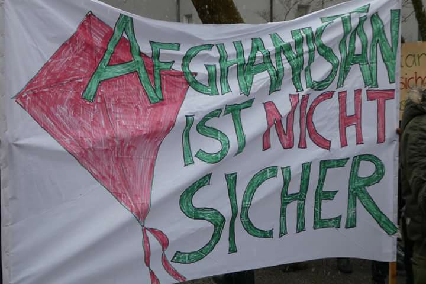

### AYS Daily News Digest 28/11/18: EU countries reject trawler with 12 refugees

_Refugee dies in Slovenian river//Deportations to Afghanistan continue//New hunger strike at Yarl’s Wood removal centre//_

Photo by Seawatch
#### Feature

A group of 13 NGOs has called on Malta and other EU countries not to send back to Libya 12 people rescued by a trawler\.

The Nuestra Madre de Loreto trawler has been stranded in waters north of Libya since last Thursday, awaiting permission to disembark the 12 people\.

The \#DontLetThemDrown group of NGOs said it was extremely concerned about reported negotiations between European Union member states and Libya regarding the possible disembarkation in Libya of the migrants rescued some days ago\.

> “Returning rescued migrants and refugees to Libya would expose them to serious human rights violations, which is a serious violation of international and European law\. International human rights law prohibits states from sending persons to countries where their life or freedom are in danger, or where they face a real risk of torture or inhuman and degrading treatment” 

The NGOs Open Arms, Sea Watch and Mediterranean also said on Tuesday that Libya can’t be considered a safe port and that people could be tortured or trafficked if returned\.

Grouped in the \#United4Med alliance, the three groups say Spain should urge Malta and Italy to open their ports to the refugees\.

Spain’s foreign minister said Monday that the two Mediterranean countries had rejected the migrants because their rescue took place in waters under Libya’s jurisdiction\.

Sea Watch added that 37 were picked up by the Libyan Coast Guard, while the 12 left in the water said they would rather die than go back to Libya\.

Separately, 562 people were rescued by the Spanish Coast Guard from twelve different boats\. Three bodies were recovered at sea\.
#### Greece
### Four bodies recovered in northern Greece

The bodies of four young people were identified yesterday morning, along the Alexandroupolis — Komotini railway line according to the No Border network\. Authorities believe that the victims were killed by a passing train on Monday, 26 November, but this was not noticed by the driver\.

[Ekathimerini](http://www.ekathimerini.com/235132/article/ekathimerini/news/four-migrants-hit-by-greek-train-may-have-been-asleep-on-lines?fbclid=IwAR2VY_y-fPqJ_J8nWW0YO7fjqZR9jhlgY-x5xHcYpGyYIyao2_gFJd5oH7Q) reports the four refugees killed by a train in northern Greece may have been sleeping on the tracks when they were hit, as blankets were found at the point of impact, suggesting that people had wrapped up for sleep\.

Police also said on Wednesday that a Syrian man was killed overnight and six more people injured when a car used by a smuggling gang that was crammed with nine people crashed on a northern highway near the town of Kavala\.
### Changes to Skype

The Mobile Info Team says the Skype timetable according to which you should inform the Greek authorities about your wish to apply for asylum has changed\. The new timetable for all languages can be found [here](http://bit.ly/2DZy3VE) \. You can click [here](http://www.mobileinfoteam.org/skype) for more information about how to apply through Skype\.

Mobile Info Team says:

> “Please keep in mind that it might take a long time until you are able to get registered through Skype, as the system is not working very effectively\. We have heard of asylum seekers unsuccessfully trying to get through on Skype for weeks and months\. Please check first with your lawyer or social worker if you really need to call Skype”\. 

Idomeni, 2016\. Photo by Bordermonitoring\.eu
#### Bosnia and Herzegovina
### Refugee dies trying to cross borders

One man from Algeria has died in a river in Slovenia, attempting to reach European countries from Bosnia\. [Slovenian police](https://www.24sata.hr/news/u-prelasku-slovenske-granice-utopio-se-migrant-iz-alzira-602099?fbclid=IwAR1PfekuXUgar9Y7RZdUfLjoAy4r0Mcy-rV5DGcAIl5mU-KmWLm6c9owz40) reports that he died while trying to cross the Reka river, which is extremely cold at this time of year\. They also report that they were alerted of the man’s death by his friends in the village of Topolc\.

The Slovenian authorities launched a search and rescue mission during which the man’s body was recovered and the cause of death was determined to be drowning\. His identity is yet to be determined\.

However, in a separate report made by a group of refugees to AYS, it appears that a young man who was a member of their group drowned in another river called Nanoščica, in the villages very close to Postojna, which is some distance from the Reka river, where the authorities have said they recovered the body\.

One of the young men who was with the victim at the time of his death, told AYS: _“After the Slovenian police continued to follow us — the first of our group waded into the river and he swam across to the other side\. And at that same moment a second guy also jumped into the river to try to swim across\. From one second to the next he disappeared into the river\. After this the Slovenian police called the firefighters to attempt to remove the body\.”_

The group of six were then arrested and pushed back to Croatia\. All of them came back with their hands numbered by the police in Slovenia, as they claim\.

They are now back in Bosnia being treated for injuries inflicted on them by the Croatian police\.

Photo AYS

It remains unconfirmed whether the body recovered by the Slovenian authorities is the same, or whether it is the body of another person who also drowned\.

With temperatures dropping below freezing at night, the routes taken from Bosnia through Slovenia and Croatia are becoming more and more dangerous\.
### Deportations to Afghanistan

Photo by ECADA — European Citizens Against Deportation to Afghanistan

Afghanistan border police refused to receive a young Afghan returnee who was also a heart patient\. The Afghan asylum seeker was deported from Sweden to Afghanistan late yesterday evening and arrived in Kabul today early in the morning\. Upon arrival, and considering the condition of the returnee, the authorities at the airport refused to receive him because he would not be given adequate treatment in Afghanistan, and that could affect the safety of the boy\.

This news comes just as the Geneva Conference on Afghanistan focuses in part on how to return refugees to Afghanistan\. [UN High Commissioner for Refugees Filippo Grandi](https://www.unhcr.org/news/latest/2018/11/5bfd95cb4/finding-solutions-afghan-displacement-key-future-grandi-says.html) said:

“ _The question of Afghan displacement and solutions for Afghan displacement, continue to be central to any debate about the future of Afghanistan_ ”\.

Despite, the difficult security context in Afghanistan, the CDU/CSU led German states are looking to accelerate deportations according to [_Spiegel_](http://www.spiegel.de/politik/deutschland/bundeslaender-wollen-vermehrt-nach-afghanistan-abschieben-a-1240669.html) _\._ The goal is to deport not only a certain category of people, including delinquents, but all groups of people\. The Ministry of the Interior also argues that security has not deteriorated\. The [Bavarian refugee council](https://www.fluechtlingsrat-bayern.de/start.html?fbclid=IwAR3-I8j7ssWe3jFrTsvzHVI3kYBtF2eYh4A4GcPQQsiVxSTT9t-Kh2Fxkhk) meanwhile warns that the next deportation to Afghanistan will probably take place on Tuesday, 4 December\.
#### UK
### New hunger strike at Yarl’s Wood

43 women are participating in a hunger strike at Britain’s only women’s removal centre, to protest against their indefinite detention and they describe living in the centre as a form of “hell”\. [The Independent](https://www.independent.co.uk/news/uk/home-news/yarls-wood-women-hunger-strike-detention-centre-home-office-flight-a8653111.html) reports some of the women have been living in the UK for more than 20 years and could still be deported\. One woman says “they are going to drag them by force”, adding that she received poor legal advice and was unable to apply for asylum immediately\.
#### UN Migration Pact
### Italy could reject UN migration pact

_La Repubblica_ reports Italian Interior Minister Salvini said Italy won’t sign the UN migration pact and won’t take part in an intergovernmental conference in Marrakech next month to adopt the package\. Ansa reports PM Conte however denied Italy is making a U\-turn, saying the Global Compact is “absolutely compatible with government’s strategy and shared plan with EU partners”, but he called for Parliament to debate the issue and make a final decision on the outcome as Switzerland has done\.

Le Figaro meanwhile leads with an article covering the spread of international opposition to the UN’s migration pact, which is due to be formally approved on 10 December\. In an interview with Le Figaro, UN Secretary\-General’s Special Representative for Migration, Louise Arbour, reminds countries criticising the pact that they “participated in its drafting”\. She also reiterates the pact will not be binding\.

From this week on, we are publishing a **weekly overview in Arabic and in Persian** of some of the most important stories we covered during the previous week\. Share it with your Arabic and Persian speaking friends\. 
Here is last week’s **Arabic version: [الملخص الأسبوعي \(ا\.ي\.س\) : عمليات الإخلاء والمعاملة اللاإنسانية للاجئين في أوروبا](%D8%A7%D9%84%D9%85%D9%84%D8%AE%D8%B5-%D8%A7%D9%84%D8%A3%D8%B3%D8%A8%D9%88%D8%B9%D9%8A-%D8%A7-%D9%8A-%D8%B3-%D8%B9%D9%85%D9%84%D9%8A%D8%A7%D8%AA-%D8%A7%D9%84%D8%A5%D8%AE%D9%84%D8%A7%D8%A1-%D9%88%D8%A7%D9%84%D9%85%D8%B9%D8%A7%D9%85%D9%84%D8%A9-%D8%A7%D9%84%D9%84%D8%A7%D8%A5%D9%86%D8%B3%D8%A7%D9%86%D9%8A%D8%A9-%D9%84%D9%84%D8%A7%D8%AC%D8%A6%D9%8A%D9%86-%D9%81%D9%8A-%D8%A3%D9%88%D8%B1%D9%88%D8%A8%D8%A7-f5b8200541a2)** 
and **Persian: : [AYS خلاصه هفتگی بیرون راندن و رفتار غیر انسانی با پناهندگان در اروپا](ays-%D8%AE%D9%84%D8%A7%D8%B5%D9%87-%D9%87%D9%81%D8%AA%DA%AF%DB%8C-%D8%A8%DB%8C%D8%B1%D9%88%D9%86-%D8%B1%D8%A7%D9%86%D8%AF%D9%86-%D9%88-%D8%B1%D9%81%D8%AA%D8%A7%D8%B1-%D8%BA%DB%8C%D8%B1-%D8%A7%D9%86%D8%B3%D8%A7%D9%86%DB%8C-%D8%A8%D8%A7-%D9%BE%D9%86%D8%A7%D9%87%D9%86%D8%AF%DA%AF%D8%A7%D9%86-%D8%AF%D8%B1-%D8%A7%D8%B1%D9%88%D9%BE%D8%A7-27a8c9879ef1)**

**We strive to echo correct news from the ground through collaboration and fairness\.**

**Every effort has been made to credit organizations and individuals with regard to the supply of information, video, and photo material \(in cases where the source wanted to be accredited\) \. Please notify us regarding corrections\.**

**If there’s anything you want to share or comment, contact us through Facebook or write to: [areyousyrious@gmail\.com](mailto:areyousyrious@gmail.com)**

_Converted [Medium Post](https://medium.com/are-you-syrious/ays-daily-news-digest-28-11-18-eu-countries-reject-trawvler-with-12-refugees-39b1e3f46034) by [ZMediumToMarkdown](https://github.com/ZhgChgLi/ZMediumToMarkdown)._
