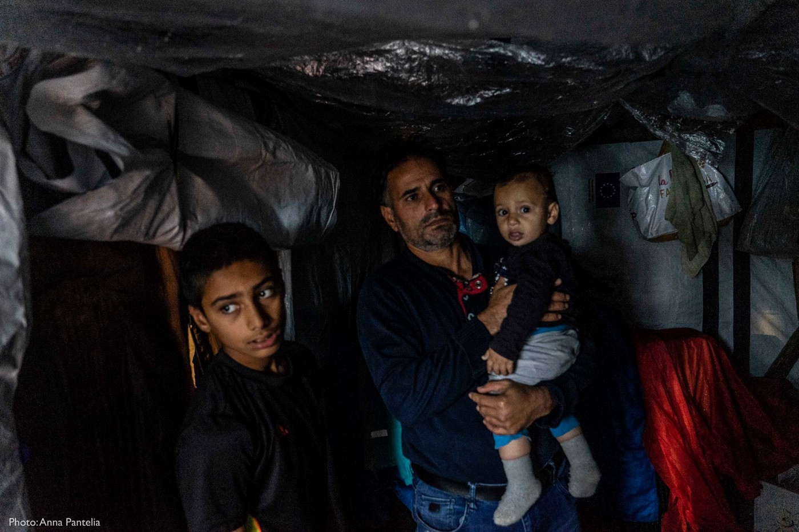
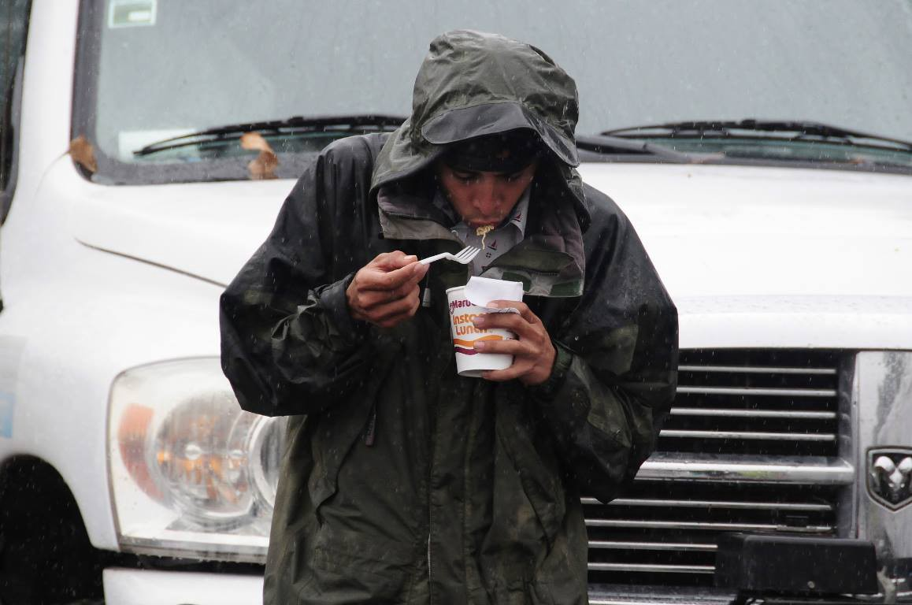
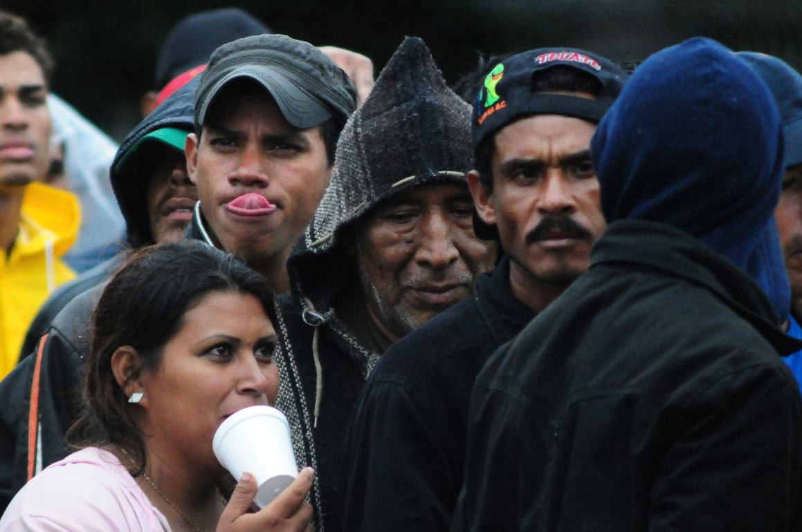
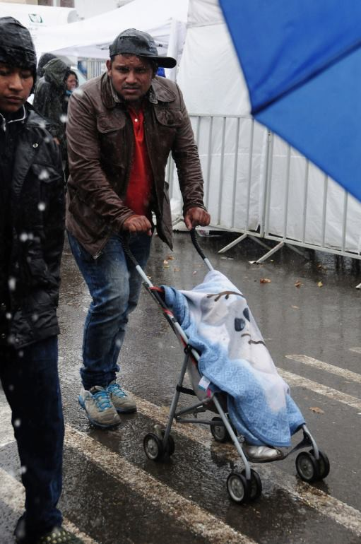
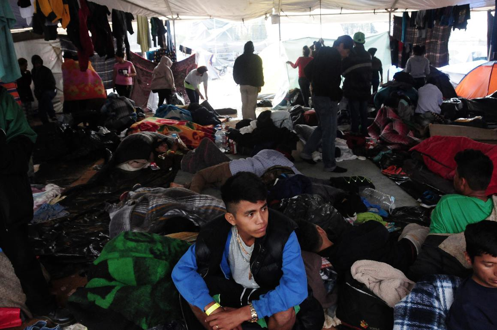
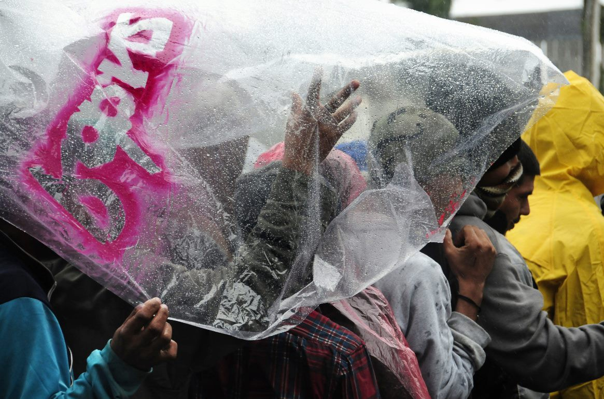

### AYS Daily Digest 30/11/18: Denmark unveils plan for Nauru\-style deportation center on Lindholm island

_Traffickers arrested in Morocco // On\-the\-ground reports from Bosnia // Humanitarian Corridor brings 70 more refugees to Rome // Salvini Decree goes into effect // Anti\-deportation demonstrations in Rennes // Unaccompanied minors at high risk of sexual abuse in Paris_ // _Photos from Tijuana, where asylum seekers wait under heavy rains // And more…_

](assets/fb6773ba4118/1*ou1U4eTxDcXqALhJPwoyRw.jpeg)

The island where the detention center will be held\. Source: [Nyheder](http://nyheder.tv2.dk/politik/2018-11-30-udviste-kriminelle-udlaendinge-skal-ud-paa-en-oe?fbclid=IwAR1sbruDMM5xmiwdcz8l7tEM2x6WIFnvYFhlAYQV-5FbkuMBIxIayukitrE)
#### FEATURE —

As part of their yearly budget, the Danish government has unveiled a new plan, seemingly modelled on Australia’s offshore detention centers, to house asylum seekers in removal centers on the isolated island of Lindholm\. The center will be established over the course of the next three years and will eventually house asylum seekers from the controversial Kærshovedgård deportation center\.

Australia’s Nauru Island has been a travesty — first and foremost for the people detained there, whose rights and dignity have been violated a hundred times over, but also for Australian taxpayers\. Denmark’s desire to replicate such a failed model is unfathomable\. However, the Danish government is already justifying their proposal for an offshore detention center by relying on rhetoric about threats to community safety, stressing the criminality of the people who will be held on Lindholm — despite the fact that the vast majority of those currently held at Kærshovedgård are not criminals at all\. In fact, as of October 1st, over 150 out of 241 Kærshovedgård residents were asylum seekers whose claims had been deemed insufficient\.

“We send the criminals who are living on an island where there are no other people they can bother,” said Justice Minister Søren Pape Poulsen\. “It is good for security and it is good for the citizens who have experienced how these people have been very disturbing… There has been too much turmoil and insecurity around Kærshovedgård\.” The mayor of the town rejects this characterization, saying that crime has not risen in the region\. It seems more probable that the government just wishes to keep the spectacle of asylum rejections and detentions out of the public eye\.

Though the plan has not yet passed into law, it is supported by Denmark’s second\-most powerful political party, the populist DPP\. The budget could be rejected, which would trigger parliamentary elections, but this has never happened before\. It appears that this ill\-conceived, dehumanizing plan is all but guaranteed to be put into action — the only thing left to do is register dissent\.

](assets/fb6773ba4118/1*yePkvvY6Z7DwExfZNIhSmg.jpeg)

Nauru Island, home to a brutal detention center\. Source: [Free the Children NAURU](https://www.facebook.com/childrennauru/photos/a.930616530389206/973018722815653/?type=3)
#### Morocco

On Twitter, Ali Zoubeidi [reports](https://twitter.com/alzoubeidi/status/1068427627629854720?s=21&fbclid=IwAR1izsZBiPspO4BuSk5ryofpGf0ssgce3Fdns0m8kA_kjGbA3NWiQBjqEtQ) the arrest of six human traffickers and confiscation of three motorized inflatable rafts and 60,000 euro in Nador\.

■■■■■■■■■■■■■■ 
> **[Ali Zoubeidi](https://twitter.com/DrAZoubeidi) @ Twitter Says:** 

> > Arrestation de 6 trafiquants à #nador , confiscation de 3 zodiacs avec moteur et 60000 euros .le rôle de la communauté frontalière est omniprésent dans ce réseau démantelé . 
#migrantsmuggling #migration #maroc 

> **Tweeted at [2018-11-30 08:52:51](https://twitter.com/alzoubeidi/status/1068427627629854720).** 

■■■■■■■■■■■■■■ 

#### Sea

Spanish ship Salvamento Marítimo rescued 550 people in the Alboran Sea yesterday, according to [Jésus Merída\.](https://twitter.com/jesusmerida_/status/1068472879438802944?s=21&fbclid=IwAR1xsvnA2ERLjhaT9n_j3cc0UI2NSTuhIGzB2Hj5L-ZbvgMoG342lR-7qbU) One woman was found dead\. The survivors have been brought to Malaga\.

The blockade against civilian rescue operations continues in the Mediterranean\. See a statement from the captain of Seawatch 3 below:

■■■■■■■■■■■■■■ 
> **[Sea-Watch International](https://twitter.com/seawatch_intl) @ Twitter Says:** 

> > The anti-humanitarian blockade against #Mediterranean #SeaRescue efforts continues: 
After 5 days of denied entry to #Tunisia|n waters the #SeaWatch3 is forced to head out of the area of operations to refuel.
Our captain's statement: https://t.co/htylto1rlY 

> **Tweeted at [2018-11-30 13:33:49](https://twitter.com/seawatch_intl/status/1068498334216843265).** 

■■■■■■■■■■■■■■ 

**Updates and commentary on the situation for Nuestra Madre Loreto:**

The crew continues to refuse to return 12 refugees aboard the fishing boat to Libya\. No European country will allow the fishing boat to dock\.

■■■■■■■■■■■■■■ 
> **[vincent cochetel](https://twitter.com/cochetel) @ Twitter Says:** 

> > The return of these 12 persons to #Libya would be against international law. Let’s find a port to disembark, process each case quickly &amp; share responsibility for different solutions. The fate of 12 persons should not be a source of tensions among States [repubblica.it/cronaca/2018/1…](https://www.repubblica.it/cronaca/2018/11/27/news/migranti_il_comandante_del_peschereccio_che_ha_soccorso_12_naufraghi_rischiamo_di_morire_tutti_-212781530/) 

> **Tweeted at [2018-11-30 09:52:09](https://twitter.com/cochetel/status/1068442550560788481).** 

■■■■■■■■■■■■■■ 

■■■■■■■■■■■■■■ 
> **[Michel Forst](https://twitter.com/ForstMichel) @ Twitter Says:** 

> > We need a solution for fishing vessel #NuestraMadreDeLoreto stuck since 23Nov with 12 migrant survivors on board who say they would prefer to die than be returned to #Libya. #Spain, #Italy &amp; #Malta should collaborate to indicate safe place. @[lorenzodago](https://twitter.com/lorenzodago) @[seawatchcrew](https://twitter.com/seawatchcrew) @[RescueMed](https://twitter.com/RescueMed) https://t.co/odNsiQ6X5Q 

> **Tweeted at [2018-11-29 18:17:45](https://twitter.com/forstmichel/status/1068207400807743489).** 

■■■■■■■■■■■■■■ 

The 3 rescue boats currently operational in the Mediterranean have released a joint [statement](https://mediterranearescue.org/news/united4med-chiede-soluzione-immediata-per-peschereccio-spagnolo-caso-grave-a-bordo/?fbclid=IwAR1x3bm0MpdRp64bb0cxUEtQHkysNWq4TpsqBPYiD1p0lSb5bfp_SxaZO7g) :

> The condition of the people on board the vessel Nuestra Madre de Loreto is critical\. The ships of Mediterranea and Open Arms, on the spot for several hours, are asking Malta for the urgent evacuation of one of the survivors of the sinking now in a state of unconsciousness\.
 

> The United4Med, Mediterranean, Open Arms and Sea\-Watch alliance organizations are asking European governments to take responsibility for what is happening at this time and to find a shared solution to ensure that these people can safely land in a safe haven and receive the necessary assistance on their terms\. 
 

> The weather conditions, already very hard these days, are likely to worsen rapidly and this would also endanger the stability of the boat by subjecting the crew and the survivors to further risk\.
 

> On board the vessel there are over the crew, which has been living this dramatic condition for days, 12 people in precarious health conditions, including 2 minors, who survived a shipwreck and who show evident signs of torture suffered in the detention camps in Libya\. 
 

> We can not allow the unavailability of European governments to find a solution on them\. We strongly demand that Spain, Malta and Italy agree to find a safe haven of land in the shortest possible time\. 

> The crews of Mediterranea, Open Arms and Sea\-Watch\. 
 

> Rome, 30 November 

#### Greece

**Islands:**

There are 17,500 refugees now on the Greek Islands, according to the Aegean Boat Report’s latest figures\.

](assets/fb6773ba4118/1*mdOQmoshm30uq0EnCxYztQ.jpeg)

Torrential rains flooded the Olive Grove, next to Moria\. Source: [Anna Pantelia](https://www.facebook.com/pantelia.anna/posts/2080559915329643)

Urgent call for volunteers on Lesvos: The Boat Refugee Project is looking for volunteers to join its team in Moria in December\. More information [here](https://www.facebook.com/stichtingbootvluchteling/posts/2128460280817341?hc_location=ufi) \.

There’s a new health initiative for refugees living in the smaller Pikpa refugee camp on Lesvos\. Find out more [here](https://m.facebook.com/pikpalesvos/photos/a.1650078085267616/2228654630743289/?type=3&source=48&hc_location=ufi) \.

■■■■■■■■■■■■■■ 
> **[Bruno Tersago](https://twitter.com/BrunoTersago) @ Twitter Says:** 

> > #Greece - Frontex ship rescued 48 migrants off coast #Samos // Greek Coast Guard saved 5 migrants off coast Symi [hcg.gr/node/19180](http://www.hcg.gr/node/19180) 

> **Tweeted at [2018-11-30 11:33:47](https://twitter.com/brunotersago/status/1068468126755495936).** 

■■■■■■■■■■■■■■ 

Frontex picked off 48 migrants off the coast of Samos, while the Greek Coast Guard rescued another 5 people off the coast of Symi\. On [November 29th](https://www.facebook.com/AegeanBoatReport/photos/a.285312485325196/483263315530111/?type=3&theater&hc_location=ufi) , the Coast Guard picked up 43 people near Samos, while a boat carrying 49 passengers landed on the island’s shores\.

**Athens:**

[](https://www.facebook.com/nobordersmusik/posts/515519725602321?__xts__[0]=68.ARBW8iT6oZfAzjjSWOueI5sw4N6k4205Ptc_lIb4qchpXVD7VgWfiKPrBptkZwQp7wB4BHqFqyLtkHoVVjgafVsTh4CYye0W5CiOEwVv8vNCeiOaiHSTYCyTeRyaP7Q27EGJLLvHW8D_W5KUcWo66GbVCtZafyFKgIZdaq5JQtDAQagHpN_qbEtIYAfH0YjMuzOBBrcOg-VQBjlLtVVN4B6nY1dbAVYGfer8y4ujmqFJZ7e68XEMmCAkHK9Wvkdn51O_DmuyhQVjh8yArCOCnKXofg6V7AObqx-6TcHXwy6_aeSAMGUo1kKmwfFQc3_Z_EntlE_R5nB1CvrGxtM8Kx70qGPnbHqR6OoXxvWOHTS4Yq_CAG_eQIo1Do_eNVzfVbV-NGNcgG6N0EKOtDhmzVlfM3Rg--lTyGNOHepXaSoLPfEbtPpKo0V09jkqsQdwdQXTVtUJdBGBMmiD2lAHF00J2t3K-V52gyz2pHCyuEXDli9QTAffs5xPZdqIMmTiAmUdW26jF8Qxjf7iu4_poA8)

“I’m one of this community\. This family\. Musikarama\.” Watch the video for some beautiful Greek folk music and one participant’s story\.

**Information for refugees:**

If you have asylum in Greece, can you find work in another European country? Answer: it’s possible, but complicated — and difficult\. The Mobile Info Team [explains](https://www.facebook.com/mobileinfoteam/posts/2325035524391830) in detail, in Urdu, Pashto, and English\.

The organization Faros, which supports unaccompanied refugee youth in Athens, has released a new video with helpful information for children about what their rights are as children, how they deserve to be treated, and where to ask for help \(In Farsi with English subtitles\):

#### Italy

A lot of news from Italy today, by turns hopeful and sobering\.

**The Humanitarian corridor successfully brought 70 more refugees from Lebanon to Rome\.** This is an invaluable initiative that spares displaced people the danger, anxiety, expense, and inevitable trauma that accompanies an overland crossing\. Watch live footage of the arrivals below:

**No Name Kitchen released a new statement on the group’s expulsion from Rome\.**

](assets/fb6773ba4118/1*aspUN_0mKo8uJmyBOX9niA.jpeg)

Unloading crates of apples\. Source: [No Name Kitchen](https://www.facebook.com/NoNameKitchenBelgrade/photos/pcb.629667964098158/629664497431838/?type=3&theater)

“ _Almost one year after our arrival, we have to leave Rome\. The informal camp, known as Baobab, was closed 20 days ago, and the present situation in Rome doesn’t allow us to keep working in the streets of Rome\. The day when our colleagues from Baobab experience can create a new camp where we are needed, we will be back again, with our van and all our motivation\._

_We would like to summarise this last year at Roma Tiburtina, highlighting what the daily life at the camp meant for the more than 30 volunteers that have been working for the No Name Kitchen\. We need to point out that it hasn’t been an easy task\. It is the opposite\. However, we feel satisfied, not for having cooked, bringing water or firewood to the camp, but for having been part of their family\. We have made a difference at no cost\. The love we have shared is priceless\. In conclusion, our presence has been our best contribution to the life at the camp\._ ”

Read the statement in full [here](https://www.facebook.com/NoNameKitchenBelgrade/posts/629667964098158?hc_location=ufi) \.

**A top\-secret Italy\-Niger accord signed last year must go public, the Administrative Tribunal of Lazio ruled\.**

The contents of the diplomatic & military cooperation deal, which was signed between Italy and Niger in September 2017, will [have to be published](https://cild.eu/blog/2018/11/28/laccordo-italia-niger-deve-essere-pubblico/?platform=hootsuite&fbclid=IwAR32UlqQHc2vlqrDfMacTvvlJAz50IijKgcBg5INho53kqPAt1YiG3xqtWQ) by December 16, 2018\. This ruling is a success for Italian civil liberties groups, which sued the government after the accord remained classified\. Meanwhile, Italian troops are already on the ground in Niger\.

So far, only one aspect of the agreement has been [made public](https://www.lastampa.it/2018/11/27/italia/niente-accordo-top-secret-il-tar-rende-pubblica-lintesa-tra-italia-e-niger-DrSivyTpawjlDvEHYBY9IL/pagina.html?fbclid=IwAR0iBkFj4RMZf0Nq5YjnYCTnba3CgKiDTv0jgbwVYOYR6-XL21LuFKcC0cw) thus far: Italian troops will train and support their counterparts in Niger to contain “illegal migration flows to Europe from West and Subsaharan Africa\.”

In other words, more policies of border externalization from the EU, which regularly pays the countries just beyond its borders to manage migration so that the EU doesn’t have to risk its image as a paragon of human rights and international law\.

**The “Salvini Decree” was [voted into law](http://www.infomigrants.net/en/post/13670/italy-clamps-down-on-immigration-as-new-security-decree-becomes-law?fbclid=IwAR0iBkFj4RMZf0Nq5YjnYCTnba3CgKiDTv0jgbwVYOYR6-XL21LuFKcC0cw) , likely creating a more hostile climate for asylum seekers across Italy\.**

In the name of security, the new decree further politicizes citizenship in a number of ways: extending the application procedure from 2 to 4 years, requiring applicants to speak Italian, and stripping the citizenship of Italians convicted of terrorism\.

The law also includes measures that facilitate the following: asylum revocation for people convicted of crimes including non\-violent theft and criminalized begging; suspension of asylum proceedings for those who are involved in a criminal case; further criminalization of squatting; expansion of the use of surveillance against squatters, and finally, restrictions to the SPRAR system for unaccompanied minors and beneficiaries of international protection\.

**Finally, a new calendar featuring the images from \#Medfaces campaign was released\.**

](assets/fb6773ba4118/1*HXkAOv2NePS6YpuO_kmgIA.jpeg)

The 2019 calendar\. Source: [Medu](https://www.facebook.com/MEDUonlus/photos/pcb.10156813174879817/10156813174129817/?type=3&theater)

The calendar also includes testimonies collected upon landings in Pozzallo, Italy\. For more information, or to purchase a calendar, click [here](http://mediciperidirittiumani.org/sostieni/?fbclid=IwAR1kEiqQfrgRycR0fEq-Lp0FOCJw-W5pHZfOlrFx5sMQ1cdF_NZNG-fRAxo#) \(information in Italian\) \.

**BALKAN WEATHER FORECAST for the weekend**

MONTENEGRO

Saturday is overcast and mostly dry\. Fog and moderate to strong frost in the basins in the north\. The wind will be weak to moderate blowing from changeable directions\. The lowest temperatures will be from \-11 to 8 and 2 to 15 degrees\.

Sunday will be changeably cloudy with sunny intervals\. Alongside the coast city more cloudy, and possibly some rain at places, and in the north there will be fog in the valleys during the morning\. The wind will be weak to moderate mainly blowing from the south and east\. The lowest temperatures will be from \-8 to 8 and the highest daily from 5 to 16 degrees\.

SERBIA

Saturday: in most parts of the country, there will be weak to moderate frost, and strong frost in the east\. During the day lightly to moderately cloudy and cold\. The wind will be weak to moderate blowing from the southeast\. Lowest temperatures will be from \-10 o \-4 and the highest daily from 4 to 8 degrees\. For Sunday more or less the same forecast, frost in the morning, overcast during the day moderate southeastern winds and cold\.

BiH

The weekend will be predominantly sunny throughout the country\. In the morning hours there is a possibility of fog in the basins, and in the evening cloud formations from the west\. The wind in Bosnia will be a weak southern one and in Herzegovina a weak Bura will be bowing\. The lowest temperatures will be from — 3 to 9 and the highest daily from 5 to 15 degrees\.

CROATIA 
Moderately to predominately cloudy with a gradual decrease in cloudiness on Saturday\. In the mountainous areas some snow could fall or rain that will freeze in contact with the cold soil\. Alongside the coast, weak rain will fall, mainly over the islands and south Dalmatia\. The wind will be mostly weak, alongside the coast a moderate southern wind\. Lowest temperatures wil be from 0 to 5 and highest daily from 10 to 14 degrees\.

Sunday will be partly sunny and warmer\. More cloudy alongside the coast with a chance of some rain locally, in the higher areas the rain could freeze in contact with the soil\. Land inwards possibly fog in the morning\. The wind land inwards will be weak to moderate from the southwest and southeast; alongside the coast a southern wind turning to a southwestern one\. The lowest temperatures will be from \-5 to 9 and highest daily from 4 to 15 degrees\.
#### Bosnia

](assets/fb6773ba4118/1*rLyK8hcvFaZRQ1n8afIGWQ.jpeg)

A volunteer bandages a refugee’s feet\. Source: [Gypsy Kokè](https://www.facebook.com/GipsyKoke/)

**Report from Kladuša:**

“ _SOS volunteers spend every days of trying to support materially but also to encourage and embrace the a lots of people who need concrete care but also deep care of their soul\._

_Every day SOS’s volunteers take care of the realization and organization of meals, the distribution of dry and warm clothes and shoes, but they also work to treat the injuries caused by the passage in the forests or inflicted by the Croatian police at the border, providing basic medical care: the team of Sos Kladuša have in fact opened a first aid point for those in need\._

_Still not enough to feed the people and keep them from freezing_ \.”

See the original post [here](https://www.facebook.com/GipsyKoke/posts/818905995118454) \.

Sarajevo on a winter’s night\. Photo: BASIS

**Report from Sarajevo:**

“It has been cold the past three\-four days, but not as bad as the forecast first said \( \-14\) \. Now the temperature will go up again, at least for a bit\. People are still both arriving and leaving, but the trend seems to be pointing towards a more steady number\.

Snug packs have been distributed \(thanks to Catch a Smile\) and a second big blanket distribution was done two nights ago to make sure that everyone has two blankets each\. Support \(from BASIS and AidBrigade\) in squats continues as temperatures drop, people who intend to stay throughout the winter needs to make it warmer for the upcoming cold months\. If someone is encountered on either the streets or distro evening time, they are suggested places where to sleep — as it is full in the camp, no buses are going there after around 8 pm, and it is too cold to sleep out in the open\.

During the evening distributions, everybody is cold, the difference is that us, the volunteers, can go back home and recover easily\. Not everyone have the same possibility\. Food packs might soon become reality instead of street distro\-food for those who can manage to cook for themselves\. The first case of frostbite has already been seen\. It is hard to tell people off while they are cold — but we need to have a threshold as the stock is far from unlimited\. Winter has just started…”
#### Croatia

The artists Žarka Radoja and Mario Cvjetković will be presenting a new piece of performance art tomorrow, **Saturday December 1 at 8pm in Zagreb\.** The piece deals with the loss of identity, both individual and collective, that accompanies forced migration\. More information, in English and Croatian, on the events page below:

#### Austria

Refugee youth are being relocated from the controversial Drasenhofen housing site after the Children and Youth Prosecutor’s office determined that the facility was unsuitable, according to [Die Presse\.](https://diepresse.com/home/innenpolitik/5539183/Fluechtlinge-aus-Drasenhofen-werden-abgesiedelt?fbclid=IwAR0-QG3qDvfKe1v_nQHFC5Sh04hEW-xrsdPP0M2ar6HOi3-hT-GiNabFCoY)

“Even young people in the asylum procedure and those with a legally negative asylum decision have — as all other young people — a right to adequate youth\-friendly care, even if they are accused of misconduct,” said youth advocate Gabriela Peter Schofsky\-Orange in response to the decision\. Refugees could still be moved back to the facility in the future if the improvements made are judged to be sufficient\.
#### France

**Sexual abuse of minors on the streets of Paris:**

Minors sleeping rough on the streets of Paris are at especially high risk of falling prey to sexual predation and abuse, according to [InfoMIE](http://www.infomie.net/spip.php?breve3014&lang=fr&fbclid=IwAR1rIGRcz7Y-4y89eVHssqVImnozCiQJEsK1e-m0C3BwF6DBi-woDsAaDjg) \. Those who have just arrived in the city and don’t have their bearings yet are probably the most vulnerable — “They’re so lost that they’re likely to accept help from the first person who offers it,” says Anjela, who works for the organization Utopie56\. Utopie56 and other associations who are regularly in contact with refugee youth on the streets try to emphasize that “no one who gives them something should be asking anything in exchange” after seeing reports of men \(but also women\) offering children a warm shower, food, or a new sleeping bag — in exchange for sexual favors or domestic labor\. One barrier to ending this predatory behavior is, unsurprisingly, the shame that such instances of abuse engender, which can prevent many survivors from speaking up about it, even to adults at trusted associations\.

**Footage from a demonstration at the Rennes detention center — protesting the deportation of Ali, a Sudanese man:**

**Help the Refugee Info Bus continue its work:**

The Refugee Info Bus provides wifi, phone charging stations, and information to refugees in Northern France — all utterly crucial services for people on the move\. They’ve just launched their winter fundraiser and are trying to raise enough funds to continue providing support to folks in the region\. Find out more below, or donate directly at this [link](https://secure.thebiggive.org.uk/donation/to/66921/29932/Refugee+Info+Bus/+Phone+Charging+and+Wifi+in+France+for+Refugees?fbclid=IwAR2YOmPSv2z2o5bTUqVsOYNuv69PgWwd4TeThWpi9qW76DSlbMyJf_U7Csw) \(note: donations are no longer being doubled but support is still critical\! \)
#### Mexico

Finally, in Tijuana, over 5,000 asylum seekers waited in heavy rains after U\.S forces engaged in violent pushbacks this past week\. Carlos Verela, a photographer from the city, went to talk with some of them\. “They have a dream,” Verela reported, but “they’re trapped\.” See a selection of his stunning photos below\.

**We strive to echo correct news from the ground through collaboration and fairness\.**

**Every effort has been made to credit organizations and individuals with regard to the supply of information, video, and photo material \(in cases where the source wanted to be accredited\) \. Please notify us regarding corrections\.**

**If there’s anything you want to share or comment, contact us through Facebook or write to: [areyousyrious@gmail\.com](mailto:areyousyrious@gmail.com)**

_Converted [Medium Post](https://medium.com/are-you-syrious/ays-daily-digest-30-11-18-denmark-unveils-plan-for-nauru-style-deportation-center-on-lindholm-fb6773ba4118) by [ZMediumToMarkdown](https://github.com/ZhgChgLi/ZMediumToMarkdown)._
