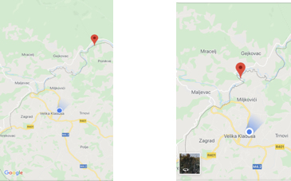

### NOVEMBER ILLEGAL PUSH\-BACKS AND BORDER VIOLENCE REPORTS

_The following document presents testimonies of illegal push\-backs where displaced people are expelled into the Bosnian territory from the borderlands and interior of Croatia and Slovenia\. All testimonies are gathered from oral interviews via a standardised framework used by the grassroots organisations working in Velika Kladuša\._

**REPORT \[1\] Group of Seven — Pakistan — Report conducted on 5/11/18**

**Type of incident:** PUSH\-BACK — DEPORTATION — VERBALLY THREATENED — ROBBED — PHYSICAL VIOLENCE — DAMAGE OF PHONES

**Approximate location where the group was caught by the Croatian police**

**Location:** The group was stopped by police outside of the village of Rapain Klanac, close to Brinje, on the E65 highway\. After this point they were taken to a nearby police station and thereafter driven back to the Bosnian border where they were pushed back somewhere along Ulica Ive Andrica, close to the village of Vojni\.

**Victimes:** Number of victims: 7 — Interview was conducted in English with one group member

Names: Osama and Ali

Country of origin: Pakistan/Kashmir

All are ages above 20 and below 50

No minors involved

Sex: Males

**Date and time:** Apprehended at approximately 2:20 in the afternoon of 2/11/18, returned to border area outside of Velika Kladusa around 2:00 am the following day\.

**Details:** Expressed intention to seek asylum in the country: No

**DESCRIPTION OF INCIDENT**

The group of seven men \(six from Pakistan and one from the disputed territory of Kashmir\) left from by foot on the 22nd of October towards Croatia with the intention of crossing over to Slovenia and then continuing on to Italy\. On the afternoon of November 2nd the group had progressed to the portion of the E65 highway outside of the town of Brinje\. At approximately 2:20, the group was approached by two, large Croatian policemen who yelled at them to stop\. The group listened to the orders and stopped\. The two policemen approached them further and began to beat the group members, one by one\. Nadim, from Pakistan, was the first to be beaten\. After this, Osama, who was the primary interviewee of this report, was beaten second\. He described the beating as follows:

_Shoes…_ \(begins to mimic kicking\) _and boxing_ \(begins to mimic punching\)

Osama described being hit on the his head, on his legs, on his arm during this beating\. One at a time, the group was hit by the two police men with their fists and by kicking\.

Sometime after, a police van was brought to the scene\. The group was then taken two at a time to the van, and kicked as they were brought inside:

_Two two kick, two two kick, two two kick_

During this exchange, the police either stole or confiscated the bags, telephones, and money of several members of the group\. Osama himself had 130 € taken from him while another member of the group had been holding 900 € with which the group had been intending to pay a smuggler with in Slovenia\. All of this money was taken from them and not given back\.

Osama and his group was made to sign a document by the Croatian police and were photographed as well\. They were not provided a translator and were not able to understand what they signed\. They were also asked how long they stayed in Bosnia and how long they had been walking in Croatia\.

They were later brought back to the Bosnian border close to Velika Kladuša and were told to “Go\!” by the police\. One at a time, they were taken out of the van and kicked by a policeman as they ran back to Bosnia

_One one kick, one one kick_

During the pushback, the policemen cursed at the men, saying “ _Fuck you\!_ ” as they kicked the group out of the van\. This occurred early in the morning of November 3rd, at approximately 2:00 am, and the group walked back to Velika Kladuša from this point\.

**PHOTOS OF INJURIES**

**REPORT \[2\] Group of Thirteen — Bangladesh — Report conducted on 12/11/18**

**Type of incident:** The group was apprehended by Slovenian police close to the town of Vinica, along Route 218\. Upon their return to the Bosnian\-Croatian border, the group was pushed back at an area close to the town of Sturlić, approximately 20 miles from Velika Kladuša \(approximate location below\) \.

**Approximate location where the group was caught by the Slovenian polic** e

**Location:** The group was apprehended by Slovenian police close to the town of Vinica, along Route 218\.

**Approximate location where the group was pushed back by the Croatian police**

Upon their return to the Bosnian\-Croatian border, the group was pushed back at an area close to the town of Sturlić, approximately 20 miles from Velika Kladuša \.

**Victims:** Number of victims: 19

Interview conducted in English with two Bangladeshi group members

Names: Faisal, Ali

Country of origin: Bangladesh/Pakistan

Minors involved: The majority of the group was aged around 30 years old however there were two minors present, of whom one was sixteen and one was seventeen\.

Sex: Males

**Date and time:** The group was apprehended by Slovenian police on the morning of 8/11/18 and was brought back to Kladuša on the evening of 10/11/18

**Details:** Expressed intention to seek asylum in the country:

Documents signed: Yes

**DESCRIPTION OF INCIDENT**

On the day of November 5th, a group of 30 people left from an area in between Bihać and Velika Kladuša, approximately 25 km away from the latter city, with the intention of crossing into Croatia and continuing their route through Slovenia and then Italy\. This group was split into several subgroups, of which Faisal and Ali were a part of\. There were 14 people were in their group, thirteen were Bangladeshi and one person was Arab\.

They walked for five days through Croatia and by the morning of the sixth day, around 5:00, they prepared to cross a river bordering Slovenia\. Of their group, 4 men from Pakistan who they had run into on the route could not swim and stayed behind\. The rest swam to the other side utilizing plastic trash bags which they inflated with their belongings inside to use as flotation devices\. Upon reaching Slovenian soil were greeted by Slovenian police officers who had apparently spotted the group from afar with binoculars\. The Slovenian police saw the others waiting on the Croatian side of the river and called the Croatian police to come pick them up\.

The group \(13 people\) were taken into a car and brought to a police station in Slovenia where they were made to fill out paperwork, without the presence of a translator\. They asked for asylum but were refused\. The 16 and 17 year old who were present in the group specifically stated in their paperwork that they were intending to apply for asylum in Slovenia to which the Slovenian police present replied no and crossed out their handwriting on the paperwork and wrote\-in Italy as their intended destination\. Furthermore, the police claimed that everyone in the group was over 18 and that there were no minors present\. The group spent one night in the jail in Slovenia and on the next day were taken to the Croatian border and given to the Croatian police in the morning around 10:00\. There they were taken to an unspecified place in Croatia and kept collectively, all 14 people, in a van for the entirety of the day without being offered and food, water, or access to a bathroom\. Faisal remarked that:

_I told them all of these people are very hungry can you give us some food “The Croatia police tell me, ‘give me money I give you food’”_

Faced with the lack of access to a toilet, group members were forced to urinate into soda bottle\. Around 11:30 or 12:00 at night they began to drive to the Bosnian border in a convoy of 3 vans with approximately 30 people between the three\. The respondents remarked that the other vans contained refugees and migrants that were picked up after them, with some from Afghanistan and Pakistan and, later, one group of Arabic people as well\. There was also one van filled with police officers that was present by the time the reached the border\. Their driver had a black ski mask covering his face\.

Upon arriving at the Bosnia\-Croatia border, the respondents described seeing the doors to their van opening, and then being blinded by flashlights shone into their eyes by the officers present\. They then described being taken out of the van three people at a time and being beaten by the police officers present:

_“3 people, door close, fighting fighting, finish, and another three people\. Step\-by\-step\.”_

The respondents were unable to identify any distinguishing characteristics of the officers present due to the fact that during this process, flashlights continued to be shone into their eyes\. They also described the smashing of their mobile phones as well as the stealing of their power banks and over 500 EUR prior to the beatings\. Faisal and Ali remembered seeing Croatian police officers on each side of the road, in two big lines\. The road was described as having a downward incline and in a position above the line of police, the respondents described a large drum of water being placed strategically to leak down the road, making the surface more slippery for the men being pushed back:

_“The water came from a drum, water downhill, from drum, pouring downhill, and police on each side…They put the water down for slipping”_

Faisal described himself as slipping 10 times during the pushback\. The men described how during this ordeal, the officers present would wait for them to slip and fall down, at which point they would come and beat the individual:

_“Fall down, and then the police come and beat you”_

They were forced to run through this line of police officers, downhill on the slippery ground, for approximately 15 meters until they reached the safety of the forest in Bosnian territory\. Flashlights were shined in their eyes throughout this process\. Ali described a family being present within the group of people being pushed back, possibly from Iran, consisting of one lady, one child, and three men\. He said that the police did not hit the women of the family, only the men\.

Faisal described himself as being hit in the eyes, the front of the head, the back of the head, on his legs, and on his arms during the pushback\. After getting out of the van, he described himself as running and then slipping several times\. Upon slipping, he remembered three police officers holding him, while two beat him with sticks\. Both group members reported being shouted at by the police officers to “Go\! Go\! Go\!” while being hit by them with batons and fists\. After finally reaching the relative safety of the forest, he collapsed and layed on the ground for 10 minutes in exhaustion\.

_“I am jump for jungle, 10 minutes I am sleeping here”_

After exiting the forest on the Bosnian side of the pushback point, the group came upon a man who told them that he would take groups to Kladuša for 40 EUR for every 4 people\. They only had 20 EUR on them at this point, but the man accepted and took them\.

**DESCRIPTION OF THE PERPETRATORS**

The respondents described one of the officers present during their processing in the Slovenian police station as having shoulder length, brown hair, and standing at perhaps 5 feet tall\. Ali, reported that he remembered her police code number as: 00448801\. He said that in total, there were perhaps 7 other officers present in the police station during their time there\.

**REPORT \[3\] Group of Eight — Egypt and Syria — Report Conducted on 14/11/18**

**Type of incident:** PUSH\-BACK — DEPORTATION — VERBALLY THREATENED — ROBBED — PHYSICAL VIOLENCE — DAMAGE OF PHONES

![**Approximate location of the group when apprehended by Croatian police \[zoom in & zoom out\]**](assets/d5494997a456/1*Pe-icA-0a_9G-s2Eb4Ih6A.png)

**Approximate location of the group when apprehended by Croatian police \[zoom in & zoom out\]**

**Location:** The group was attacked by policemen on the bridge running over the Dobra river on the road D6, next the the E65 highway outside of Karlovac\. They were then taken to the city of Karlovac, approximately 10 minutes away by car, to a police station which had a basketball court\. Finally, the group was taken to a secluded area of the Bosnian\-Croatia border, approximately five hours by walking outside of Velika Kladuša\.

**Victims:** Number of victims: 8

Country of Origin: The group consisted of individuals from both Egypt and Syria

The interview was conducted in English with four individuals from Egypt and one individual from Syria

Gender: Male

Minors present: Two minors were present in the group, aged sixteen and seventeen

**Date and time:** The group was apprehended by Croatian police in Karlovac in the afternoon of 13/11/18 and were taken back to the Bosnian\-Croatian border late in the evening on the same day\.

**Details:** Expressed intention to seek asylum in the country: Yes

Documents signed: Yes

**DESCRIPTION OF INCIDENT**

On 11/11/18 a group of eight men from Syria and Egypt crossed the Croatian border from Velika Kladuša with the intention of crossing the the country into Slovenia\. They walked for two days before eventually crossing the E6 bridge over the Dobra river on the outskirts of the Croatian city of Karlovac\. While walking across the bridge, at which point it was very early in the morning and dark, the group was apprehended by a group of six police officers\.

The group reported that when they were caught on the bridge, they were immediately subject to physical violence from the police officers\. They reported that the officers did not seek to communicate with them apart from the shouting of epithets such as “motherfucker” and “fuck you”\. After this physical exchange, the group remarked that they were forced onto the ground where the police officers put their feet onto their faces and backs to keep them in place\. Hisham, who is sixteen years old, remember that while the officer had his foot placed on his back, he struggle to breathe\.

Shortly thereafter, the group was taken to the police station in Karlovac which they reported was a 10 minute drive away from the bridge\. Upon arriving in the police station they were placed in a basketball hall inside the station, handcuffed, and hit again by muscular “commando” officers in black ski masks with batons and with fists\. The group was kept handcuffed in the basketball court for two hours before being processed and were forced to stay standing the whole time\. They ended up staying in the police station until the evening time\. No water or food during their time in the police station and, likewise, they were not given access to a toilet\.

The group left in a police van from this point at around 1:00 am and after approximately 30 minutes of driving they arrived to what was described as an “officer’s building”\. Here, the group changed cars and were also made to sign several documents which were in Croatian\. There was no translator present\. Mohamed later remarked that:

_“We don’t know what \[we signed\]”_

During this point, the several members of the group asked to apply for asylum in the country to which an officer present responded to them that “Asylum in Croatia is full”

At some point during the group’s time in this complex, an officer approached the van and sucked in his breath rapidly, in a way that was described to be similar to Hannibal Lecter in the movie Silence of the Lambs, and screamed at the group “We will kill you\!” Around this time, another officer started rattling his baton against the side of the van in an attempt to intimidate the passengers\. The group remarked that they were kept in this complex for around an hour, in complete darkness for the majority of the time, during which they were unsure about their safety:

_“We felt like maybe they would kill us”_

When they were finally brought back to the border, the group was taken “one\-by\-one” out of their van by officers, who locked the door behind them, and then procedurally beaten by six police officers who were present at the scene, while one man, who was unmasked, observed\. The group was not able to provide a detailed description of the unmasked officer due to the presence of flashlights which were being shone in their face\. The group remarked that each person was beaten for roughly five minutes, before being pushed across the border, at which point the next person would be taken from the van\.

According to the group, the officers were placed in a line, more or less, that had an officer position every two meters\. When a group member would go by them, there would be one officer who hit them with a stick, two officers who hit them with their feet and also batons, and another officer who would punch them\. They all described as being hit in their face and their sides\. Perhaps the most difficult part of their description of the pushback was having to get past the last police officer before the border, who was described as “very big” and almost like a “professional boxer”\. This large officer waited for them in the middle of the pathway that was formed by the line of other police officers and, according to the testimony of this group, hit them like they were a “punching bag” in their kidneys and in the face:

_“Everybody was beat in the kidneys, we don’t know why kidneys”\._

In addition to these beatings, the officers at the border broke several of the group’s phones and chargers and also stole several power banks as well as a tablet\. No money was taken from the group because, as reported by several of the group members, they were hiding their money in their underwear\. While the officers were going through their belongings in search of items to steal and/or break, the group reported that the officers would pull out an item and say with exaggeration “Ooh a tablet\!” and then smash it onto the ground while laughing\. This is consistent with the other observation from the group that while they were being hit by the Croatian police at the border, they felt humiliated at the lighthearted nature with which the violence was conducted\. The group reported that while they were being struck by the Croatian police batons and cried out, all they could hear was laughter:

_“When we cry they laugh”_

It was very dark when they were walking through the forest after their pushback, and as a result they fell down into a “lake” by accident\. Their clothes got wet from this and, given that it took the group five hours to walk back to Velika Kladuša from the pushback point, they were left feeling extremely cold and tired\.

**INFORMATION ABOUT THE PERPETRATORS**

When they brought back to the border, the group was beaten by six police officers, while one man, who was unmasked, observed\. The group was not able to provide a detailed description of the unmasked officer due to the presence of flashlights which were being shone in their face\. They described the rest of the officers as wearing black uniforms and having their faces covered by black ski masks\.

**REPORT \[4 a \] Group of 65 — Afghanistan — Reported conducted on 9/11/18**

**Type of incident:** PUSH\-BACK — DEPORTATION — VERBALLY THREATENED — ROBBED — PHYSICAL VIOLENCE

**Location:** The incident happened approximately 15 km north of Velika Kladuša in Croatia, the group was then returned to a section of the Bosnian\-Croatian border which was around an hour’s walk outside of the city center of Velika Kladuša\. The subjects interviewed did not have access to a phone nor GPS during this ordeal and accordingly did not have a precise understanding of the location of this incident\.

**Victims:** Number of victims: Approx\. 65 with the majority being from Pakistan and approximately 10 or 11 being from Afghanistan

Interview was conducted in English with two group members

Names: Adnan, Abbas

Country of origin: Afghanistan

Aged above 20 and below 25

No minors involved

Sex: Males

**Date and time:** The group left from Velika Kladuša in the early morning hours of 8/11/18 and were returned to the border outside of Velika Kladuša in the late evening darkness of the same day\.

**Details:** Declared intention to seek asylum: No

Papers signed: No

**DESCRIPTION OF INCIDENT**

The group left at approximately 1:00 am from an area outside of Velika Kladuša and walked for four hours until 5:00 am\. After this they slept in the forest, woke up, and walked again for about an hour until they came upon a road\. Adnan remarked that the group rested to the side of the road for just one or two minutes before a light green, jeep\-like “army car” with either five or six special forces officers inside came upon them\. This car was soon followed by another, similar, car with another 6 officers inside\.

At this point, most of the people in the group tried to escape by running to the nearby forest\. The officers shouted “Stop, stop\!” and one of them fired a gun three times — two shots in the air and one in the ground, towards the general direction of the group\. After this, much of the group stopped running\. Adnan remarked that

_“All people they catch”_

After this the officers called the more police and took pictures and videos of the individuals present, loaded them up into cars, and brought them back to the border\. The victims described that their car was very crowded, with approximately 25 persons crammed inside\. Then, at the border, the subjects interviewed described their van being emptied five people at a time\. The officers would take five people out of the car, lock the door, and beat them “very badly”\. Adnan described upon exiting the car that there were four police officers positions in a line after the car:

_“Every 3 meters or five meters there was a police officer”_

During this exchanged, he described one of the officers screaming at him “I am Croatia police, I am crazy\!” When asked whether or not they asked for asylum in Croatia, the respondents remarked

_“No we didn’t ask because every time before they did not give us”_

Adnan was in the last group that was taken out of the van while Abbas was in the group before him\. They described the police officers as wearing black masks and only being able to see their nose, eyes, and lips\. One of the police officers was described as quite big\. When Abbas was taken out of the van he told the officers “Please, okay, okay, don’t beat me” and tried to avoid the punches when they approached him\. Despite this, three policemen beat Abbas on the back of his head and on the sides of his body\. During this beating the police hit him so hard he fell down onto the ground\.

After the beatings finished and the group was left at the border, several of the officers said to everyone loudly “motherfuckers” and guns in the air twice\. Adnan remarked that they were “very angry”

On the road back to Kladuša a woman from Croatia talked to the group and they asked whether or not she could bring them back to Kladuša\. After one hour she came back, some of the people went with her but she demanded a payment of 5 EUR per person for the ride\.

When asked as to whether he talked to his parents about what had happened to him, Adnan responded as follows:

_“No \[I won’t tell them about what happened in Croatia\] because if I told them that they beat us they would be very emotional\. I don’t want to make my family emotional\. Because I am emotional, no problem, but why make my father \[and\] my mother?”_

**INFORMATION ABOUT THE PERPETRATORS**

Adnan reported that the group was initially stopped by a group of either five or six “special forces officers” in a light green, jeep\-like “army car” which was soon followed by another, similar, car with another 6 officers inside\.

**REPORT \[4 b \] Group of 65 — Pakistan and Afghanistan — Reported conducted on 9/11/18**

**Type of incident:** PUSH BACK — DENIED ACCESS TO ASYLUM PROCEDURES — DEPORTATION — VERBALLY THREATENED — ROBBED — PHYSICAL VIOLENCE

**Red represents the approximate location of initial capture, 20km into Croatia** \.

**Location:** The group of men were caught by Croatian police officers in the Croatian interior near to the motorway number 1\. Border violence and pushback occurred on the Croatian territorial frontier with Bosnia, equidistant from Sturlic and Velika Kladuša\.

Approximate coordinates: 45°07'57\.3"N 15°46'40\.3"E

**Victims:** Number of victims: 70 \(approximate number, interview was conducted with one victim, Pakistani male in mid 20s\)

Names: Anonymous

Country of origin: Pakistan \(approx 55\), Afghanistan \(approx\. 15\)

Age: 15–45

Minors in the group: Yes \(7, including youngest who was 15 year old Pakistani boy mentioned in report\)

Sex: Males

**Date and time:** Approximately midnight on 08/11/2018

**Details:** Expressed intention to seek asylum in the country: Yes

Documents signed: No

**DESCRIPTION OF INCIDENT**

The group concerned in this incident crossed on foot from Bosnian territory into Croatia in darkness on the night of the 7th November\. They walked for an entire night and rested the following day in the woods\. As night fell on the second day they began to walk again\. The interviewee said they had come around 25 km into the Croatian interior\.

They were walking in the dark along a track/pathway when they heard some shouts from nearby\. From the location of the voices there came four officers dressed in a light green military style uniform described by the respondent as “special forces”\. The officers carried handguns in their waist holsters and one withdrew his weapon and shot three rounds into the air above their heads\.

The group of men and boys were ordered to wait on the path, guarded by the four officers with guns\. After a short period they heard some vehicles arriving on the road nearby, they carried 15–20 Croatian police dressed fully in black\. The new officers ordered the men and boys to sit down, and the respondent described how;

_“They take our cell phones, money, power banks, cigarettes, everything”_

The men and boys were frisked by the officer dressed in black\. Then the police took photos of the group\. This was done with a phone, and the victims were simply photographed as a group, without any details being taken or due processing\. During this time one of the police officers even took a selfie including his face and the line of 70 victims stood behind him\. When asked if he, or any other of the group requested asylum in Croatia, the respondent shared that;

_“When someone want to speech, they say “eh, sit down\!”,… everyone scared of what will happen next \(if they speak\)”_

After the frisks, photographs and coerced silence, the men were loaded into 3/4 combi vans that arrived on the scene as they were being searched\. The Croatian police loaded around 25 people into the back of each vehicle, making the rear passenger area cramped and a possible danger to life with so little oxygen\.

They drove for approximately 30 minutes before arriving to a small road running between trees and bushes\. Off the road was a gravel area with large concrete cubes/blocks\. From their walk back to Bosnia after the assault, the respondent describes this location as approximately 20 km southwest of Velika Kladuša, on the border area leading to Sturlic\.

The sequence of events at the border were described as follows\. The back of the combis were opened and the men and boys in the back were beckoned out in groups of five\. They were pushed towards the direction of Bosnia, kicked and shoved by the officers\. Then as they drew level with the concrete blocks they were ambushed by 6/7 seven more officers waiting\. The perpetrators were dressed in black Croatian police uniforms and were carrying batons\. They hit, punched and kicked the victims\. The respondent shares how a seventeen year old Pakistani boy was hit across the mouth with a police baton by one officer\. Meanwhile an older Pakistani male aged 45 protested, asking them not to hit him because of his poor health, but the police continued to beat him\.

To add further injury to the victims, the police had tied trip wires between the trees \(measuring one foot above the ground, and virtually invisible at night\) \. As the victims fled towards Bosnia they were tripped and fell, landing on an assortment of sharp bushes, brambles and sticks that the officers had put on the ground\. The respondent described how the officers chased them and laughed, shouting loudly;

_“Go, go\!”_

The victims fled and made their way back to the improvised camp in Velika Kladuša\. The police retained all the possessions taken when they were searched in the jungle\.

**INFORMATION ABOUT THE PERPETRATORS**

The initial officers to arrive on the scene were four Croatian officials dressed in military green uniforms described as “special forces”\. They discharged the shots with the handgun over the heads of the victims\. They also held the men in the forest while the other perpetrators arrived\.

The following officers were a division of 15–20 dressed in black Croatian uniforms\. They participated in the frisk, theft and denial of access to asylum procedure\.

At the border near Maljevac six officers dressed in black and armed with batons engaged in the brutalisation, beating, and pushback into Bosnia\.

**INJURIES AND MEDICAL TREATMENT**

The group was of such as scale that the report only identifies a portion of the injuries described\. Some of which were lacerations to minors face due to baton strikes, and contusions to the torso of a 45 year old male with heart complications\.

**REPORT \[5\] Group of 5 — Syria — Interview recorded on 7/11/18**

**Type of incident:** WITNESSING OF A VIOLENT PUSHBACK

**Location:** The event occured along the Bosnian\-Croatian border, between the village of Buhača, Croatia and Zagrad, Bosnia\-Herzegovina\.

**Victims:** The subject interviewed witnessed, along with four other members of his group, the violent pushback and beating of two groups of people\. The two groups were described as twelve men from Pakistan and four men from Arab countries respectively

Minors present: The subject interviewed is 17

**Date and time:** This event occurred during the early morning hours of 7/11/18

**DESCRIPTION OF INCIDENT**

On the evening of November 7th, Mahmood travelled along with his group of 4 other people from Velika Kladusa towards the Croatian border with the intention to cross the country towards Slovenia and then onwards to Italy\. Along the way, they met another group of people who were intending to cross and followed them for a while\. At a certain point, the two groups split up, with one vearing left and the other heading right\. At around 5:30 the group arrived at an area approximately 500 meters away from the border, hidden within a forest, with an elevated position and a view of the border\. At this point the group settled down to rest for around four hours\. At this point, Mahmood described seeing a police car drive back and forth several times on the Croatian road which they could view from their resting place\. Scared, the group remained silent for an hour as they waited for the car to leave, however, another police car soon joined the former\. The group saw a female Croatian police officer exit the vehicle\. Eventually, the second leaves and comes back some time later, but this time Mahmood reported that the officers present began to take people out of the back of the car and beat them:

_They open the car, go out one by one\. Just one and close the door, they beat him so much, after, leave him\. And second, out, one by one, one and close the door, not the whole group, one by one\. Twelve people in the car\. There is a third car that is come, four people from Algeria is inside\. Same thing, one and close the car, beat, beat, beat, beat, so hard\. And leave him\._

Mahmood described witnessing the police officers beat the men primarily in the head and on the mouth\. At the end of the beatings, he reported that some of the officers began to fire their guns in the air to make those present scared and run away\. The cries of the men being beaten stuck with Khalid\. In his own words:

_“In my life, I have never heard a voice so mad, they screamed like this\. In my life”_

After watching these beatings, Mahmood’s group waited for the police to leave before calling out to the injured men to join them\. Thereafter, they washed out the men’s wound with water and provided them with food:

_“We give them water, we give them food, someone was bleeding a lot\. We gave him some medicine”_

From there, they walked back to the relative safety of Velika Kladuša\. Mahmood later described the terror he felt witnessing this event and reflecting on his own status as a refugee pursuing asylum in Europe:

_“\[I felt\] very scared\. Too many police, and disappoint, and morale down, and we can’t cross the border…It’s too many police…and it’s beating so much and make too many people bleeding\. It’s not simple beat\. It’s like some people had destroyed heads”_

Regardless, Mahmood reiterated his determination to keep trying:

_“It is very important, I will try\. If I can cross the border, I will do it\. If I can’t I will come back, and I will do it again — every day and every day\.”_

**REPORT \[6\] Group of 4 — Algeria & Syria — Report conducted on 11/12/18**

**Type of incident:** PUSHBACK — PHYSICAL VIOLENCE — THEFT OF PERSONAL ITEMS — DESTRUCTION OF PERSONAL ITEMS

**Approximate location of the group when captured**

**Location:** The group was caught by the Croatian police along the Glina River approximately 20 km north of Velika Kladuša\. They were then returned to an area along the Bosnian\-Croatian border, between the village of Buhača, Croatia and Zagrad, Bosnia\-Herzegovina\.

**Victims:** Number of victims: 4\. Interview was conducted in English with one group member

Names: Hisham

Country of origin: Algeria/Syria

All are ages above 20 and below 50

No minors involved

Sex: Males

**Date and time:** The group left Velika Kladuša during the night of 6/11/18 and we returned to the border during the early morning hours of 7/11/18

**DESCRIPTION OF INCIDENT**

Hisham and his group of three other people left Velika Kladuša for Croatia on the night of November 6th\. The group was comprised of two Algerian and two Syrian men however they also coordinated their movement with another group of four men in a different location\. After crossing the border, his group walked for approximately six or seven hours towards the town of Glina with the intention of getting on a bus somewhere in the town\. Somewhere around this time, after walking a distance of approximately 20 km, the group was “caught” by a group of six police officers:

_The police say “Stop, stop\!” and fired their guns in the air three times\. We stay on the ground and after the police beat \[us\] with their fists\._

The police asked the group where they were from and when they responded individually with “I am from Syria” or “I am from Algeria” they beat them more, for approximately 10 minutes\. During this time, they searched through all of their clothes, broke 3 phones, and stole approximately 400 € from the group\.

After they were caught the group was put into a van and brought back in a convoy of two other cars carrying police officers to a portion of the border close to Velika Kladuša\. Once the reached this destination, the van carrying the group was positioned in such a way in relation to the other cars that a sort of barrier was formed\. Hisham remarked that when the van doors opened he could see that a blockade was formed by the other cars “like a pyramid, \[or a\] corner”\. In his own words, Hisham remarked that,

_When they open the door, you can’t go away, \[you can only\] look at the police\. You see the police, thirteen police\._

He then described his group, with him being the first, being taken out one\-by\-one from the van and beaten by a group of thirteen police officers\. The respondent described the majority of the officers as wearing black ski masks however he remarked that there were perhaps four without masks, but the flashlights that they were shining into his eyes prevented him from being able to distinguish any identifying characteristics of their faces\.

Hisham was the first one to be taken out of the car and described being beaten by the police for approximately 10 minutes over the course of a distance of around 20 meters\. While attempting to pass the line of officers, he described being hit with batons by the police officers as he was passing\. Around halfway, he remembered being intentionally pushed down onto the ground and then being hit by all thirteen officers present with batons and fists:

_“Halfway they push you down and beat you again, all police\.”_

He then got up again and scrambled the remaining distance towards the border, all the while being hit\. When he finally reached the safety of the Bosnian side of the border, a police officer screamed to him “Motherfucker, go to Bosnia and never come back”\. Hisham stated that his rib was broken during the course of this attack\.

After the police left them at the border, Hisham remembered walking alone in the darkness without any sense as to where he was:

_No light, no nothing\. You can’t see a single thing…I don’t have GPS or anything…When I could hear the police beating people again, when I heard the screams, I came back\. I feel this is not Bosnia, this is Croatia, and go another way\. Maybe 10 minutes, after this I see the light\. I hear some people say “Hey, hey, come here, this is the way, come on”\. I make that\. And drink \[their\] water\._

The respondent had tried to cross five times in total before this attempt and voiced his frustration at the brutality of the police response he has experienced:

_Inside the migrant you find everything\. The good, the bad, the drinker, the junkie, the doctor, the engineer, everything\. But you must make a filter\. Don’t judge someone when you see him drink or take drugs\. First, talk with him\. You can’t judge a book by the first page and the last page\. You must read the whole book\. Maybe you see me take drugs or you see me drinking\. I am not a bad person, I have my own problems… I am without my country, I am leaving my family, I am leaving everything, my work, to try this plan\._

Finally, Hisham remarked on his perception of violent pushbacks in Croatia:

_“From my experience, what I read in books, what I listen to in the news, when you catch someone inside some country without papers, just take him outside the border\. Don’t touch him, he is not an animal, he is a human like you\. Why did 13 police beat me for ten minutes in the dark, in the night? It is not legal, brother\.”_

**INFORMATION ABOUT THE PERPETRATORS**

The group was “caught” by a group of six police officers\.The victim reported that there was a group of thirteen police officers present during his pushback and that the majority of the officers wore black ski masks over their faces however there were perhaps four without masks, but the flashlights that they were shining into his eyes prevented him from being able to distinguish any identifying characteristics of their faces\.

INJURIES AND MEDICAL TREATMENT

Hisham reported that he had a cracked rib as a result of the attack at the border\. Another member of his group \(picture below\) had his nose badly hurt during the course of the pushback\.

**REPORT \[7\] Group of 3 — Syria — Report conducted on 24/11/18**

**Type of incident:** PUSH\-BACK — VERBALLY THREATENED — PHYSICAL VIOLENCE — DAMAGE OF PERSONAL ITEMS

**Approximate location of the group when caught by Croatian police officers**

**Location:** The group left on foot from a secluded area of forest outside of Velika Kladusa and was stopped after walking approximately six kilometers into the interior of the country\.

**Approximate location of the group when pushed back by Croatian police officers**

The group was then taken to an area of the Bosnian\-Croatian border close to the official border checkpoint in Maljevac and pushed back to Bosnia\.

**Victims:** Number of victims: 3\. Interview was conducted in English with one group member with the assistance of a translator

Names: Hamoud

Country of origin: Syria

Aged above 20 and below 45

No minors involved

Sex: Males

**Date and time:** The event occurred on the night of 23/11/18, around 11:00 pm and continued into the early morning hours of 24/11/18\.

**Details:** Papers signed: None

Expressed intention to seek asylum in Croatia: No

**DESCRIPTION OF INCIDENT**

On the night of November 23rd, Hamoud walked with his group of two other people from an area close to the official border checkpoint between Maljevac and Velika Kladuša with the intention of passing through Croatia and continuing on to Slovenia\. The group walked approximately 6 or 7 kilometers into Croatia before entering an open field lined with trees\.

Hamoud then described his group as hiding underneath several of the sparsely placed trees as several Croatian police officers drove a car close to their position, got out, and appeared to be looking for people\. The respondent inferred that there was another team placed elsewhere observing the field from afar with the assistance of technology, because after some minutes, the police officers on the ground talked over the radio with another group of people and then began to approach their position more precisely\. Shortly thereafter, the group was spotted by the police officers, approached, and taken out of their hiding place\. At this point, Hamoud described one of his group members as being taken by the officers and beaten and slapped in the face\.

They demanded that the group give up their phones and searched through their bags for any sort of technology\.

_“First they asked about phones, knives, anything sharp, next they beat\. Power banks stolen, cables too\.”_

The respondent reported that he had two phones on him and readily gave the police one which he had been using for GPS, but kept hidden the existence of a second, smaller phone in his bag\. The second phone was special to him and he was afraid it would be broken\. The rest of the group also gave their phones to the police officers\. When the officers present discovered this second, hidden phone, Hamoud described one of the officers as standing up, walking over to him, and giving him a single, direct kick with his army boot directly into the eye socket , after which the officer began punching Hamoud with his closed fists in the body\. The officer had a mask on and was perhaps 2 meters tall\. The respondent described the blows to his body as leaving him with some difficulty to breathe,

There was just one car at first but then after two more came\. In total, the respondent remembered six police officers as being present\. The officers came in at east one large van which returned the group to the border\. One of the other cars was equipped with a large searchlight\.

The group was then loaded into the van which was waiting for them and brought back a short distance to a secluded portion of the Bosnian\-Croatian border outside of Velika Kladusa\. On the way to this point the driver sped of the van up rapidly and then made an emergency stop which forced the group in the back of the van to slam against the side of the van walls since they had no form of seatbelts on\. \[Hamoud had a mark on the back of his ear which he attributed to this act and described blacking out for a moment after hitting his head on the van\] They were then brought out of the van one\-by\-one and beaten by five members of the Croatian police\.

_One brings you from the car, the other stays inside the car, and four officers start beating \[us\] and the final one, in front of a valley, and down is Bosnia and he catch him, start giving him some kicks and pushes him so he falls down\.”_

One of the officers held the men by their arms, while another held them closer to the neck and walked them to the line of the border and then started to kick the men, hit them with batons, and with closed fists\. He described being hit for a period of ten minutes in the ribs, knees, back of the head, and the face\.

_“You try to escape and you find four persons already behind you and you find the final one at the line of the border\. He is just waiting for you, the last kiss\.”_

During the interview, a person in background let out a high pitched scream in response to one of their friends to which Hamoud commented that:

_“There was screaming even more higher than this\. No mercy\. You can’t even breathe…\.You can’t breathe\. Just screaming\. High screaming, that’s it\.”_

The respondent remarked that when he tried to avoid the hits from the police officers, they kicked the back of his knees so he would fall down, asked him if he was trying to escape, and then hit him even harder\. Hamoud remarked that:

_“The worst thing is that they are insulting us, they start laughing and make jokes when they are starting to beat us…In this moment, you start to feel that you are not even human\. You just try to escape, just to run and go and then they make you fall down again and start beating you\. And this is the worst part, you just want to survive and they make you fall down and start laughing and start beating more and more\.”_

Hamoud was the last to be taken out and described the rest of his group as waiting for him somewhere after the border\. After being this ordeal, Hamoud and his group were exhausted but walked back the 5km back to the Trnovi camp in Velika Kladuša and fell asleep\.

**INFORMATION ABOUT THE PERPETRATORS**

The respondent remembered six police officers as being present during his group’s initial capture by the Croatian police\. They arrived at slightly different times in two cars, one of which was a mid\-sized police car while the other was a van which they were later transported in\. Later, at the border, Hamoud described seven total police officers as being present during his pushback, with five officers clad in black ski masks as taking part in the violence against him and his group members\.

**INJURIES AND MEDICAL TREATMENT**

The respondent had superficial bruises on his body and ear due to the beatings and the sudden braking of the transport van\. In addition, his eye was swollen, bruised, and scabbed over as a result of the kick to the face he received from a Croatian police officer\.

**REPORT \[8\] Group of 9 — Iraq and Syria — Report conducted on 13/11/18**

**Type of incident:** PUSH\-BACK — DEPORTATION — VERBALLY THREATENED — ROBBED — PHYSICAL VIOLENCE — DAMAGE OF PHONES

![**Approximate location where the group was stopped by Croatian authorities \[zoom in & out\]**](assets/d5494997a456/1*BV-K4e6G0kVQB0JW4_WeAg.png)

**Approximate location where the group was stopped by Croatian authorities \[zoom in & out\]**

**Location:** The group was apprehended by Croatian authorities next to the Kolpa river bordering Slovenia in the north\-eastern part of the country\. They were later taken to a secluded area of the Bosnian\-Croatian border outside of Velika Kladuša and pushed back\.

**Victims:** Number of victims: 9

Interview was conducted in English with the use of a translator

Names: Sweda and Moha

Country of origin: Syria

No minors involved

Gender: Male

**Date and time:** The group was apprehended by Croatian police in the morning of 11/11/18 and brought back to the border area outside of Velika Kladuša in the late evening of the same day\.

**Details:** Expressed intention to seek asylum in Croatia: Yes

Made to sign papers: Yes

**DESCRIPTION OF INCIDENT**

The group of nine set out by foot from Velika Kladuša in the first few days of November with the intentions of cross through to Slovenia and then from there into Italy\. During their journey across Croatia, the group encountered a group of five bears as well as a number of hunters which they begged not to informed the police about their presence\. After about of week of walking, the group approached the Kolpa river bordering Slovenia in the early morning hours\. When they arrived, they found the river to be flowing much heavier than they had anticipated\. One member of the group, Sweda, tested out the feasibility of crossing the river when they arrived to this point, however the rest of the group was tired so they lit a fire to make tea\. When Sweda returned, he saw that the group had made a fire and sat down with them\. Soon, the group saw flashlights coming down from the mountain and inferred that someone had seen their fire and informed the police about their presence\. They immediately put out their fire\. The respondents explained that there were several police officers which passed close to their campsite, however they remained undetected and the officers continued past them unaware\. At this point, an argument broke out in the group about their next actions; several group members wanted to attempt to cross the river immediately from their position, others wanted to pass the river closer to a waterfall downstream, while an elderly man in the group decided that he wouldn’t be able to cross and would wait for the police to find them\. The son of this man also decided to stay\.

As several of the group members were preparing to inflate plastic bags to use as flotation devices in their crossing of the river, they turned their heads and saw several police officers coming down from the mountain with their pistols drawn\. They ordered the group to stop, which they did\.

The group was then taken to a nearby police station in which they reported that they were given access to an Arabic translator over the phone, photographed, and made to fill out paperwork which they could understand since it was in Arabic\. One of the respondents remembered that their paperwork was titled “Declaration of Refugee”\. Several group members asked for asylum, but the police responded negatively and told the group that if they presented themselves to the police station then perhaps they could give them asylum, but since they were caught in the forest they could not offer them asylum\.

The group stayed In police station for roughly three hours before they were put in a van which began to drive them back to the Bosnian\-Croatian border\. Sweda, one of the group members, has a device implanted in his ear as a result of injuries sustained from having been close to a double suicide bombing in his home town in Syria\. On the way back to the border, he told the officers in the van about this injury, to which the police told him that they wouldn’t be beaten up and that the officers would just chase them to the other side of the border When they arrived at the destination, the door to the van was opened and they were told several times by the police officers that “This is the road to Kladusa\.”

The group was then taken out two at a time by a Croatian police officer who would look the van door of taking the pairs out\. Upon stepping out of the vehicle, the couples would find that there were other cars and other policemen standing behind the vehicle with masks and batons and gloves\. The Croatian police officers were situated in two lines which ran from either side of the van down the road which led to Bosnia, meaning they had to run in between them to get to the Bosnian side of the border\. What surprised the group, however, was that in between the lines of officers were obstacles which they described as similar to the types of fences horses jump over in competitions\. The group explained that they were expected to jump over the obstacles in order to get through the police line and reach Bosnian soil\.

_“When you want to pass they start hitting you and hitting you, beating you up, when you run away you find an obstacle where you have to jump, \[like a horses obstacle\]_ \.

_When you jump you find another two, they start beat you up, beat you up, until the second obstacle, when you jump on the second obstacle, you find another two \[police officers\] \.”_

The respondents remarked that after they completed the obstacles, two final policemen who were equipped with big batons started chasing the men until they were on the Bosnian side of the border\. One of the group members, an Iraqi man, ran through the police line fell down while jumping over an obstacle at which point several Croatian police officers began to start “kicking him and beat him\.” Although this man was not present during the testimony collection, the respondents presents remarks that the middle of his face was had been targeted in particular\. The men also reported that they had two mobile phones and two power banks stolen from them during this process\.

After the group made it to the Bosnian side of the borders in their respective pairs, they made the roughly 5 km journey back to Velika Kladuša on foot and treated their wounds\.

**INFORMATION ABOUT THE PERPETRATORS**

The respondents described the officers who pushed them back to Bosnia as clad in black or dark blue uniforms and as wearing black ski masks over their faces\.

**INJURIES AND MEDICAL TREATMENT**

One of the respondents had a wound on his head which he attributed to the strike from a police baton, however he did not seek medical treatment for this\.

**REPORT \[9\] Group of 20 — Syria — Reported conducted on 9/11/18**

**Type of incident:** PUSH BACK — DENIED ACCESS TO ASYLUM PROCEDURES — DEPORTATION — ROBBED — PHYSICAL VIOLENCE

![**Approximate location of where the group was violently pushed back \[left\] and initially apprehended \[right\] by Croatian authoritie** s](assets/d5494997a456/1*ygWZwpAVU5l6yuigl6FaXw.png)

**Approximate location of where the group was violently pushed back \[left\] and initially apprehended \[right\] by Croatian authoritie** s

**Location:** The group was apprehended in Croatia along the Kolpa river, close to the Slovenian border, near the town Vukova Gorica\. The group was then pushed back to the Bosnian border closed to Buhača

**Victims:** Number of victims: around 20 men, interview with one of them

Names: Anonymous

Country of origin: Syrian

Age: 26

Minors in the group: no able to answer

Families : at least 3 families

Sex: Males

12th times trying the game

**Date and time:** The group was pushed back on 08/11/2018 around 2\.30 am

**Details:** Expressed intention to seek asylum in the country: Yes

**DESCRIPTION OF INCIDENT**

The interviewee and his group left from Velika Kladuša with a family \( a couple and their two children — 5 and 3 years old \) and another man aged 36 years old on 27/10/18\.

They walked 10 days in Croatia before arriving at the Kolpa river near the village of Balkov\. The 36 years old man swam across the river to reach Slovenia, which he did during the night\. The river was flowing quickly, and he had a difficult time of crossing and went underwater for some time\.

The person interviewed stayed with the family on the Croatian side for two days screaming the name of their friend\. They didn’t know if he managed to cross or not\. At one point a Slovenian police car passed on the opposite of the river and saw them, at which point it was inferred that they called the Croatian police\.

Soon the Croatian police arrived with a police van in which five policemen were present, dressed in plain clothes\. The person interviewed asked for about his friend but he didn’t get an answer\.

The group was then driver to a police station, about an hour from the place where they were\. They stayed around 30 minutes at the police station\. The officers there took a picture of him carrying a panel with his name, surname and date of birth\. His phone, his power bank and his passport were taken there\. The interviewee asked “ I need asyl in Zagreb” to which one of the policemen answered “Asyl in Croatia is just in television”\.

The interviewee recognised the rank of 2 policemen at the police station, one wore the rank of “probationer with college” and another one wore the rank of “ senior police officer”\.

From the police station, he went into the back of a van with around 20 other men from differents nationalities\. The respondent reported that he had almost no oxygen\. The family went with two other families in another van\. They drove about two hours to Buhača, to a small path located in between two groups of houses \( 500m in between these two groups of houses\) near a forest\.

One by one the men inside the van were made to go out and were beaten with batons\. When the interviewee got out of the van, he asked for his passport to which the police responded by tearing up the document, throwing it away, and beginning to beat him with a silver baton and kicking him in his back\.

The next person which was beat was also pepper sprayed in his eyes\.

The officers committing these acts were wearing ski masks but the interviewee recognised two differents ranks — instructor in headquarters of intervention police and commander of intervention police\.

**INFORMATION ABOUT THE PERPETRATORS**

At the police station, one wore the rank of “probationer with college” and another one wore the rank of “ senior police officer”\.

The perpetrators were wearing face masks and the person interviewed recognised two differents ranks — instructor in headquarters of intervention police and commander of intervention Police, according to the information found on internet “ [https://en\.wikipedia\.org/wiki/Law\_enforcement\_in\_Croatia](https://en.wikipedia.org/wiki/Law_enforcement_in_Croatia) ”\.

**REPORT \[10\] Group of 12 — Iranian Kurdistan — Reported conducted on 18/11/18**

**Type of incident:** PUSH\-BACK — THREATEN WITH A WEAPON — VERBALLY THREATENED — ROBBED — PHYSICAL VIOLENCE — FORCED TO UNDRESS

**Location:** The group left Bosnia around Čapljina and was apprehended by police in an unknown location, where taken by police to an unknown location and were later taken back to the Bosnian\-Croatian border outside of Velika Kladuša and pushed back

**Victims:** Number of victims: 5

Country of origin: Kurdish \(Iran\)

Age: 24, 24, 17, 30, 43

Family : none involved

Minors in the group: one of the victims was 17 years old

Sex: male

**Date and time:** The group left from Bosnia by foot on 13/11/18 and was pushed back to Bosnian on 17/11/18

**Details:** Expressed intention to seek asylum in the country: No

Documents signed: No

**DESCRIPTION OF INCIDENT**

The group left from Sarajevo to Mostar, then from Mostar to Čapljina on the 13th of November\. They crossed the Bosnian\-Croatian border walking at night with a group of eight \( four Kurdish persons and four Iranian persons\) \. They walked approximately six hours and stayed one day hidden in a forest waiting for a smuggler\.

One group of four persons went into a taxi first, heading toward the Slovenian border\. They arrived around 4:00 am and were waiting for the second group to come, but they did not find them\. The 17 years old, was part of this first group\. After waiting some time, they began to walk, for approximately one hour, but ended up walking towards a village which they felt unsafe in, so they decided to go back to forest\. Around 6:00 am, the group was walking at which point two policemen hidden behind trees revealed themselves and turned on their headlamps which had a blistering lights\.

One of them put a gun on the temple of the interviewee, another member of the group got afraid and stepped back, then a policeman beat him with a stick on the leg and on the head, which made him fall down on the ground\. They all put their hands up and were fastened two by two with handcuffs and were brought inside the back of a police van\.

After 15 minutes of driving, they arrived at a small police station\. When they go out of the van, still in handcuffs, a policeman kicked one of the Kurdish men and said “ Go back to Afghanistan\!”\. They also insulted the whole group with the words “bitch” and “motherfucker” in English\. The officer then brought them to a small jail room which had wooden beds on both sides\. They asked them to get undressed and checked their clothes, bags, and phones\. The policemen kept the phones, power banks, and papers in a yellow plastic bag\. \.

The group asked for food but were refused\. They had to slap at the door for one hour to get water to drink\.

“If you want food you should pay us” said one of the policeman\. The respondent reported that the room was quite cold and had only two beds for four persons\. They spent 36 hours there\.

“I think they were waiting for more person coming, that’s why they keep us there” said the interviewee\.

There were four policemen, the interviewee described them as two old men and one police quite fat\. At night, it was only men but during the day, in the morning, two policewomen were also present\.

Eight other refugees arrived to the police station later — one Kurdish man from Iran, six men from North Africa, and one man from Albania\.

In the morning, one by one, the group filled forms with their names, surnames, dates of birth, origin and languages\. The A4 form had translations in Farsi, Arabic and English\. Later, a picture of each group member was taken on a phone with these papers\.

On the evening of November 16th, they were all brought into the back of a van without any windows\. They were then driven to another police station but there, only the person from Albania went out and one Iranian Kurd went in\. Outside were standing three men with black ski masks, the respondent recognized on their uniforms the rank of probationer with secondary school and probationer with college\* \. One man’s face was uncovered and the interviewee recognised the rank of police sergeant\*, and the emblem of the Croatian police on his sleeve\. The police sergeant was a big man with white skin and short blond hair\.

\( \* [https://en\.wikipedia\.org/wiki/Law\_enforcement\_in\_Croatia](https://en.wikipedia.org/wiki/Law_enforcement_in_Croatia) \)

The group was twelve at this point in the back of the van and were driven for around an hour to the border near Velika Kladuša where the van was parked next to a small forest\. The group in the van, could hear their phones being destroyed, but then the ventilation was turn on and they were no longer able to hear what was happening outside\. Next, the police sergeant opened the door, one person went out and then they closed it again\. When it was the interviewee’s time to get out, he saw all the bags on the floor, the policemen told him to take his bag\. After he picked up his bag, they began to beat him and he ran directly towards forest which sloped downhill\. A few meters after progressing, he fell down in the darkness above a one meter handmade wood barrier\. The way this barrier was made and the emplacement make the interviewee think that the policemen made it on purpose\.

When he stood up, he tried to run again but two officers switched on their headlamps and began to kick and beat him with a baton\. After he escaped, a new group of two police officers revealed themselves and did the same\. It was like a “tunnel of policemen”\. He had to run forward because on the right, it was the forest and on the left it was a valley\.

The group estimate the number of policemen present at that time as fifteen policemen\. They were laughing and shouted :

_“Merkel is waiting for you”_

While he was running, the interviewee witnessed the 17 years old Kurdish boy being beat by one policeman with a baton on the breast\.

At the end of “this tunnel” of policemen, the interviewee and the group were physically pushed into a swamp, they try to run but the mud was about a meter deep\. The respondent witnessed a policeman taking the head of one man from North Africa and dunk his head into the water three times, the person could not breath\. The police followed them into the swamp\. To get out at the opposite end they had to climb up through the mud\.

They kept trying to escape but were only five persons at this point and one lost his shoes into the mud while another was badly beaten in the leg\. Two people had to carry this man until they reached an empty house in the forest\. The interviewee, who had a lighter, made a fire inside the house\. The 17 year old Kurdish boy was coughing blood\.

In the morning, they went to find their bags, but nothing was there anymore\. They found a taxi who brought them back to Velika Kladuša for 20€ to the camp\. There, they found one of their friends who was in the van with them\. He had to run alone after the police beat him and injured his elbow\. In Kladuša he went to the hospital to know if his elbow was broken or not, but he had to wait before behind able to know because he needed an X\-Ray that they could not produce at the hospital since it was the weekend\.

**REPORT \[11\] Group of 3 — Tunisia — Reported conducted on 21/11/18**

**Type of incident:** PUSH BACK — PHYSICAL VIOLENCE

**Location:** The group was apprehended in the Croatian interior, 4 km from Slunj and were brought back to Buhača , near the Bosnian\-Croatian border, where they were pushed back

**4 km away from Slunj, Croatia where the group was caught by Croatian authoritie** s

**The approximate location in Buhača, Croatia, where the group was pushed back**

**Victims:** Number of victims: 3 persons, interview made with 2 of the 3 persons

Interview conduct in french, translated by MD\.

Country of origin: Tunisia

Age: 32 , 35 and 42 years old

Minors in the group: no

Families : no

Sex: Males

**Date and time:** The group left from Velika Kladuša on 17/11/18 at 8\.00 pm and were apprehended on 19/11/18 and brought back to Bosnia\.

**Details:** Expressed intention to seek asylum in the country: No

**DESCRIPTION OF INCIDENT**

The three men interviewed left from a place located seven kilometers away from Velika Kladuša on foot at 8\.30 pm on November 17th with a group of ten persons\. They walked all night, rested for three hours time and began to move again\. At one point, there was a disagreement with the rest of the group, and they split up with the men from Tunisia leaving to go another way\. About 20 kilometers away from the Bosnian border, the group found an abandoned house where they spent the night, At around 5:00 in the morning of the 19th, the group decided to walk on the road D1 to go to Slunj\. Four kilometers before the city, a Ford police van \(white with the a blue stripe\) stopped the men, after which the three of them were frisked on the edge of the road\. The officers took three of their phones, their power banks, their money \(400€ in total\), their chargers, a razor machine and lighters and put them into a packet\. They checked all their bags\.

There were eight police officers in total — seven were male and one was female\. Six of them were from the police officer intervention group, the persons interviewed recognised the yellow square on their shoulders and two of them were leaders of the intervention group, the interviewed person recognised two squares on their shoulders\. They had a pistol and tear gas spray bottle on their belt\.

After about 30 minutes, a second van \(a white volkswagen van with a blue stripe, a back side without window, and with only 3 seats in the front\) arrived\. Two persons were in this van, one was about 1’70m tall with black hair, white skin, and wore a blue navy uniform with the one yellow square on the shoulder signifying the rank of leader of intervention group\. The second officer present wore the same uniform but had only one yellow square \( rank of police officer in intervention group\) \. He stood around 1’85m tall, had white skin, blond hair and green eyes\.

The group was taken into the back of the van, which had no window, leaving them in darkness\. The driver drove fast and suddenly braked several times\. When they stopped, they were forced to go outside where six policemen were waiting\. They all wore blue navy uniforms\. They were close to a forest, near the area of Buhača\.

The policemen asked them to come and take their bags a bit further\.

One of the group reported that he went towards the policemen but he got threaten with a baton, then began to run and fell down, at which point two policemen kicked him on the ground and beat him with their batons\. He managed to escape and saw one of the policeman put the packet with their phone on a stone and beat it with a baton\. After that, he took out the phones and throw them to the interviewees while they were running\.

Another group member responded that the policemen were asking him to come to them, but while he was walking, one of the policeman behind him kicked him in the back of his knee to make him fall down\. Then he escaped and hide himself behind a tree\.

The group of policemen left, then one of the group members went to take back their bags, but everything was broken and the money was stolen\.

The group of 3 persons reported that they were still in Croatia at this point and didn’t know how to leave from their location\. They walked around but were afraid to be caught again by the police\. Eventually they found woman who explained to them how to go back to Bosnia\.

**INFORMATION ABOUT THE PERPETRATORS**
1. There were seven policemen and one policewoman\. Six of them were from the police officer intervention group, the persons interviewed recognised the yellow square on their shoulders

Two of them were leaders of the intervention group, the interviewed person recognised two squares on their shoulders\.

They all had pistols and tear gas spray bottles on their belts\.

2\. Drivers : Two persons were in the Volkswagen van, one was around 1’70m tall with black hair, white skin and wore a blue navy uniform with one yellow square on the shoulder signifying the rank of leader of intervention group, the second one wore the same uniform but had only one yellow square \( rank of police officer in intervention group\) \. He was around 1’85m tall with white skin, blond hair and green eyes\.

3\. Six policemen were present at the border pushback point and wore blue navy color uniforms

**REPORT \[12\] Group of 2 — Morocco — Reported conducted on 16/11/18**

**Type of incident:** PUSH\-BACK — VERBALLY THREATENED — ROBBED — PHYSICAL VIOLENCE

**Location:** Leave : near Kladuša, from a marchandise transport company

Apprehended : inside a company near Delnice

**Location of the 2nd police station — Delnice, Croatia**

1st Police station : The respondent was not able to identify this location

2nd police station : Delnice , Croatia

Push back : At the Bosnian\-Croatian border between Buhača, Croatia and Zagrad,BiH

**Victims:** Number of victims: 2

Country of origin: Morocco

Age: 27

Minors in the group: no

Sex: Male

**Date and time:** Apprehended on the 14/11/2018 pushed back

**Details:** Expressed intention to seek asylum in the country:

Documents signed: Yes at the first police station

Refused to sign paper he didn’t understand, second police station\.

**DESCRIPTION OF INCIDENT**

The interviewee and his cousin left in a truck from a place near Velika Kladuša, out of a shipping company\. They crossed the border inside the truck\. The truck driver had to load goods at another company and stopped there\. The employees then found the two men in the truck at which point they asked the them to come out and called the police\.

The police checked the truck to see if the truck’s tarpaulin was destroyed but it remained untouched, since the respondent had prior experience sneaking into trucks\. The police officers first went to ask if the truck driver took any money from them and, if so, what amount\. Then they asked the same question to the interviewee and his cousin to which the interviewee answered that he had experience with trucks in Morocco and that the driver did not know about their presence in the truck\.

They checked the tarpaulin again and took the two people to a police station in a Dacia Duster\. The police station was described as a small old police station with only two rooms\. There, they filled a form up with name, surname, date of birth, origin which the interviewee signed along with his cousin\. Their fingerprints were also taken\.

Then they were driven in a big car to a second police station, which the respondent identified as being in Delnice, about an hour away from the first\. They couple were not able see anything from the car since there were no windows in the back\. The respondent described the police station as having three or four rooms like a jail on the first floor\. He remembered being brought to the basement after entering at which point there were three policemen standing in the dark\. The first question they asked was if the two men spoke English, they answered that they could only speak Arabic\.

When they were at the police station, the interviewee and his cousin were separated to different places to be interviewed\. Whenever the officers asked questions, the two persons were beaten up with a baton\. The interviewee spoke about “torture”\. The main question he was asked was about the way they had gotten into the truck and if they had paid the truck driver as a smuggler\. According to the interviewee, the men interrogating him did not believe that the two men were able to enter the truck without the assistance and support of the truck driver and that’s why they began to beat him\.

_\[The officers told me\] “speak this man is bring you here with money or I beat you” and he beat me so much and \[I told him\] “no no, this man, \[the truck driver\], not bring me here with money\. I put myself here with my cousin is with me\.“_

According to the interviewee, the interrogators offered to give them asylum if they admitted that the truck driver had helped them to cross the border in exchange for money\. He reported that they said to him in exact words:

_We accept your asylum, we take you to the camp with paper, with everything, just tell us that this man take the money and put it inside, it’s simple\._

He expressed being beaten up at the second police station with an electric baton as well as being beaten in the head many time by a baton\. Four papers were presented to them to sign at the police station, the two men asked for translation because they could not understand but they did not get it\. In response, they refused to sign it, and were beaten again\.

From the second police station, they were driven for approximately two and a half hours back to the Bosnian\-Croatian border\. The driving conditions were bad, and the respondent relayed that they wanted to throw up:

_“We want to throw up, they don’t care about we are inside the car, if you die or alive, they don’t care”\._

When they arrived to the border, they were taken out one by one from the van\. The interviewee declare that a policewoman said to him

_“Next time if we arrest you or catch you , we will beat you so much, kill you or put in prison”_

When he went out of the van, it was the dark and he could not see much\. He walked about two meters forward and then several police officers began to beat him with batons\. The respondent described that the place he was pushed back at had a handmade, wooden wall in which people trying to run away from the Croatian border police had to climb up over\. Afterwords, there was a river below\.

After the two men got away from the Croatian border police they began to walk back through a forest in which they passed a small road and found a taxi who asked 50€ to bring them back to Velika Kladuša\. They did not have money anymore but offered two broken phones which they had found on the forest floor\. According to the interviewed person, at the place where they were pushed back, they is a lot of evidences \( Broken phones, broken jackets, etc\) \.

**INFORMATION ABOUT THE PERPETRATORS**

At the second police station : A woman without face mask , a blue eyes big man with 4 letter written on a badge \( the interviewee would think about “Leon”/”Lino” \. Two other tall policemen were also present but wearing face mask

**REPORT \[13\] Group of 2 — Syria — Reported conducted on 2/11/18**

**Type of incident:** PUSH\-BACK — VERBALLY THREATENED — ROBBED \(MONEY, PHONES, PASSPORT\) — PHYSICAL VIOLENCE — DETAINED IN A VAN WITH LACK OF OXYGEN

**Location:** The group was caught by the police in Croatia, only few kilometres away from the Bosnian border\. The violent incident happened by the Croatian border with Bosnia, nearby official border checkpoint outside of Velika Kladuša\.

**Approximate location where the group was attacked by the Croatian police\.**

**Victims:** Number of victims: 2\. Interview was conducted with both men in English\.

Names: Houmam and Fathi \(interviewed\)

Country of origin: Houmam and Fathia are from Syria

Age: 22 and 29 years old

Minors in the group: three minors were present during the deportation but were not physically attacked

Sex: Males

**Date and time:** The men were caught by the Croatian police on 29/10/18, around 11:00 pm\. They were then pushed\-back and violently attacked by the Croatian police on 30/10/18, at around 1:00 am\.

**Details:** Expressed intention to seek asylum in the country: No

Documents signed: No

**DESCRIPTION OF INCIDENT**

Houman and Fathi walked together from Velika Kladuša \(Bosnia and Herzegovina\) to Croatia, from where they supposed be picked up by a taxi, organised by a people smuggler\. Houman said that they trusted only a smuggler to help them reach asylum in Europe because there was no safe and legal way of transit for them\. While they were waiting for their car, they were caught by the Croatian police, who started shouting at them to sit down on the ground and insulting them\. Then, the men were made to get naked and were body searched, at which point their possessions were taken by the police:

_“They told us to sit down, searched our bodies and stole our staff, my phone, money, passport, clothes\. They got us naked and were kicking us from the back\. They were telling us: “You don’t go to Europe, fuck you, go back to Bosna\!”_ \(Houmam\) \.

_“They also took our Syrian ID and threw it away\. I said to them that this was my Syrian ID, and the officers responded: “Fuck you and Syria\.” I told him that I was Syrian Kurdish and that I did not want to cause any problems\. But they just kept telling me to go”_ \(Fathi\) \.

Shortly thereafter, the men were transported in a van back to the Bosnian border\. Along the way, the van stopped and picked up other groups of people who were later pushed back with them at the border\. There was a lack of oxygen in the van which was driven in a fast and aggressive away for three hours, even though they were initially detained only just few kilometres away from the Bosnian border:

_“They put us into the big van that was not open and did not have any windows\. They told us to go into the car and they were driving very fast and kept breaking up, so I had a problem, I started being sick and vomiting … Maybe three hours, they were driving with us around\. In one car, we were 15 or 20 people”_ \(Houmam\) \.

Once they arrived at the border with Bosnia, the men described that the police opened a door of the van and began pointing a strong torch light into everyone’s eyes, so they could not see anything later\. Then the officers, who were clad in ski masks and black clothes, told to the people to exit the van one by one, and individually attacked them, while pushing them back to Bosnia:

_“I could see nothing for five minutes I went out of the car because they pointed a torch into my eyes\. Also, there was a hill by that border, and they pushed me out of that hill\. I could not see anything\. And I was rolling down from that border\. I go here for life not for money\. I wanted to speak to them\. When they realised that I could speak English, they told me: “You speak English? Ok, come here\.” And they started beating me\. … I said to the police that I did not want to stay there, that I just wanted to go\. They just told me: “Fuck you, and go\!” They had big metal sticks and were wearing masks\. They hit me into legs, back, chest, and my face, they were also punching me and kicking me”_ \(Houmam\) \.

_“By the car, two police were beating us\. When they finished, another two police were beating us\. And one police was holding me and another was kicking me\. But before they started attacking us, they pointed really strong torch into our eyes, so when I got out of the car, I could not see anything, Oh my god\. And they just kept shouting: “Go, go, go, go Bosna\!”_ \(Fathi\) \.

Houmam said that the police were only attacking the men who were visibly older than 18 years old and did not hurt the minors who were also being deported\.

At the end of the interview, Houmam said that he did not want money or wealth in Europe, but he needed safety\. Now, after the European Union closed its borders in front of him and violently returns to Bosnia, he is considering going back to Syria:

_“If I have no problem in Syria, I would not go to Europe\. I have everything I need in Syria\. Just there is a war, and that is the problem\. But maybe I don’t want to go to Europe anymore, I will go back to Turkey and from there to Syria\. Police is very dangerous here because they treat me like I am dangerous, but I am not dangerous\. But if I go back to Syria, I will have to join Assad’s army and yes, I will be made dangerous\. Croatia is dangerous, so now, I will also turn into a dangerous person because i will have to return back to Syria and join the army for eight years and fight”_ \(Houmam\) \.

**INFORMATION ABOUT THE PERPETRATORS**

Houma and Fathi were attacked and pushed back to Bosnia by a group of Croatian border police officers, wearing black uniforms and masks\.

**INJURIES AND MEDICAL TREATMENT**

Both Houma and Fathi said that they had bruises and pain around their legs, back and arm\. Since the interview was conducted with the group one week after they were pushed back, they did not hold any visible injuries\.

**REPORT \[14 \] Group of 7 — Pakistan — Reported conducted on 2/11/18**

**Type of incident:** PUSH\-BACK — DEPORTATION — VERBALLY THREATENED — ROBBED \(MONEY, PHONES, PASSPORT\) — PHYSICAL VIOLENCE — DETAINED IN A VAN WITH LACK OF OXYGEN

**Location:** The group was caught by the police in Croatia, only few kilometres away from the Bosnian border with Slovenia \(Vinica\) \.

**Approximate location where the group was caught by the Croatian police\.**

The violent incident happened close to the Croatian border with Bosnia, nearby the official border checkpoint outside of Velika Kladuša\.

**Victims:** Number of victims: 7\. Interview was conducted with one group member, 16 years old boy in English\.

Names: Bizhan \(interviewed\)

Country of origin: Pakistan

Age: 16–19 years old\.

Minors in the group: 3 minors involved; two 17 years old boys and Bizhan, who is 16 years old\.

Sex: Males

**Date and time:** The men were caught by the Croatian police on 02/11/18\.

They were later physically attacked and pushed back by the Croatian police on 02/11/18, at around 9:30 pm\.

**Details:** Expressed intention to seek asylum in the country: No

Documents signed: No

**DESCRIPTION OF INCIDENT**

Bizhan and six other individuals, three of them minors, travelled by foot from Bihać \(Bosnia and Herzegovina\) to Croatia\. They wanted to walk the whole way to Italy, where they intended to apply for asylum\. The boys walked for fifteen days, five of which they had no food and water for\. While they were walking in a forest inside of Croatia, they were detected by a group of seven Croatian police officers\.

When the police caught the boys, they questioned them about where they were going to\. They responded honestly, saying to the police that they were travelling to Italy and did not want to stay in Croatia\. The police responded to them aggressively:

_“They say no, you are not going to Italy, you go back to Bosnia\. I told them that I was a poor man, but they were just beating me\. They hit me into my eyebrow, they pushed me that I fell”_ \(Bizhan\) \.

After this, the police gave the group the order to sit down on the ground and frisked their bodies\. The officers took all their mobile phones, power banks and money while body searching them\. Boys were then transported to the place that Bizhan called a “deportation center”, which, according to his description, was a police station where they were investigated by a different group of four Croatian police officers\.

Then, they were driven for two hours to the Bosnian border for their deportation in a van that Bizhan described as “closed combi”\. According to Bizhan, it was very cold inside of the van and there was a lack of oxygen, so that they had problem to breath\. When they arrived at the border of Croatia with Bosnia, Bizhan’s older brother asked the police if they could return them their mobile phones\. One officer responded to this by threatening him with a pistol:

_“When my brother asked if they could give us our mobiles back, the Croatian police man pulled his gun out and placed it to the head of my brother\. They just said to us to go back to Bosnia”_ \(Bizhan\) \.

Next, the group was told to come out of the van, one by one, and again physically attacked by border police officers clad in ski masks and black clothes, while being pushed back to Bosnia\. The officers were aware of the boy’s young age, but refused to pay attention:

_“I said to them I was 16, and they said: “No 16 years old\!” and slapped my face\. I was crying\. …Two \[officers\] had guns and they were shooting into the air and saying: “You go to Bosnia, if not, I will fight you\.” Three men were crying\. But he \[police\] was saying to us: “Go, go, go\!” … I did not eat food for four days\. My shoes were full of water and I had wet clothes\. After they pushed us back, I was walking on the road and drunk a water from the road from the ground from my hands because no one gave me water or food\. When I came here to Bosnia, one man gave me water, after two hours, one group gave me food and to my brother”_ \(Bizhan\) \.

Bizhan and others then walked back to Velika Kladuša, where they stayed one night on the street\. The following day, the NNK volunteer which conducted this interview met Bizhan who explained what had happened to them the previous night\. He showed them his bandaged hand and explained that he felt a big pain\. The volunteer walked with him to a hospital in Velika Kladuša, where he was refused to be treated by a medical staff with the words: “No doctor here for you”\. Two days later, Bizhan was treated by MSF\.

**INFORMATION ABOUT THE PERPETRATORS**

Bizhan described the police in the following way:

_“They had blue uniforms, those who caught us\. One was very big, age maybe 46\. One man was young, and two men very big and strong, those who were beating me were strong\.”_

**INJURIES AND MEDICAL TREATMENT**

Bizhan had a fractured hand and several bruises on his knees caused by the physical attack by batons\.

**REPORT \[15\] Group of 6 \-Pakistan — Reported conducted on 3/11/18**

**Type of incident:** PUSH\-BACK — VERBALLY THREATENED — ROBBED \(MONEY, PHONES, PASSPORT\) — PHYSICAL VIOLENCE — DETAINED IN A ROOM AND VAN WITH LACK OF OXYGEN

**Approximate location where the group was caught by the Croatian police\.**

**Location:** The group was caught and firstly attacked by the police in Croatia, a few kilometres away from the border with Slovenia \(viz\. map below\) \. They were pushed back and again physically attacked along the Croatian border with Bosnia, nearby the official border checkpoint outside of Velika Kladuša\.

**Victims:** Number of victims: 6\. Interview was conducted with one group member\.

Names: Hashim \(interviewed\)

Country of origin: Pakistan

Age: Hashim is 22 years old and others are between 13–30 years old\.

Minors in the group: 1 minor involved — 13 year old boy\.

Sex: Males

**Date and time:** The men were caught by the Croatian police on 02/11/18 at approximately 11:00 pm\. They were later physically attacked and pushed back by the Croatian police on 03/11/18, at around 4:00 am\.

**Details:** Expressed intention to seek asylum in the country: No

Documents signed: No

**DESCRIPTION OF INCIDENT**

Hashim and other five men, including one 13 year old boy, travelled by foot from Bihać \(Bosnia and Herzegovina\) to Croatia\. Hashim said that they did not have an intention to stay in Croatia and apply for asylum there\. They wanted to pass through the Croatian land and continue through Slovenia to Italy\. The men wanted to cross a river at the Croatian\-Slovenian border but, because the river was too fast and deep, they got scared of drowning and decided to walk back\. On the way back, still nearby the border, they were stopped by a group of four Croatian police officers\.

When the officers caught Hashim and his friends, they only asked them where they were walking\. After that, the officers talked between themselves in the Croatian language, so the men did not understand their conversation\. According to Hashim, the police then started acting aggressively towards them and taking their private possessions:

_“They started beating us\. Their behaviour was very bad\. One young guy was very stupid, he was throwing our bags from a mountain, and we had everything in our bags\. They threw it from the mountain … They were telling us rubbish things about our families, like mother fucker and things like this”_ \(Hashim\) \.

According to Hashim, the officers told the men that if they gave them all their money, they would set them free\. Hashim and his friends handed the police all of their money \(500 euros in total\) \. Then, the officers took their money and called another police unit, dressed in black clothes and balaclava masks\. Hashim referred to this police unit “military” because, according to him, they looked like soldiers\. An officer from this “military” unit told all of the men to enter their car, without specifying what was going to happen to them next\. When the men were walking towards the car, the “military” officers were verbally attacking Hashim and others, kicking into their legs and pushing them, so that one of Hashim friends fall on the ground on his face\.

The car firstly took the men to a police station in a city, which Hashim could not identify because the van in which they were transported had dark windows, so he could not follow the directions\. When they arrived at the police station, the officers took all of the men into a cell, where they were detained for several hours:

_“Inside of room of the jail there was no air, you could not breath\. The room was absolutely packed with people\. if I stayed there one night, I would die\. Absolutely closed and dangerous, there was no air, not possible to breath\. They took our food, we had little bit of food in our bag, and water, but they took it and threw it outside_ ” \(Hashim\) \.

After three hours, the same officers clad in black clothes and ski masks came to the cell and told the group to follow them\. All twenty people from the cell were told to enter a van and were then deported straight to the border with Bosnia, without accessing any legal procedures\. The journey to the border took around three and a half hours\.

At the border, the people inside of the van were told to get out, one by one, and then were physically attacked by the same officers who were transporting them while being pushed back to Bosnia:

_“Military \[Croatian police\] were standing in two lines\. And then, start hitting us while people running\. They don’t care, they hit into eyes, head, on the back, they don’t care\. There is nobody asking them questions or taking any action against them\. They are beating humans like animals\. … They were beating usand laughing\. They were kicking us and laughing, they were enjoying, like we were football”_ \(Hashim\) \.

According to Hashim, a 13\-year old boy was also attacked and had pain in his knee and legs\. At the end of the interview, Hashim expressed his confusion about the police action towards people trying to reach asylum in the EU territory:

_“I am completely confused why they were beating us\. I understand that we are illegal, we are refugees, we are using their borders, and their land\. But we don’t want to hurt anyone\. We don’t want to stay in Croatia\. Despite of that, I don’t know why they are beating us\. They don’t have right to beat us\. There are the rights we have, even animals have the rights and we are humans”_ \(Hashim\) \.

**INFORMATION ABOUT THE PERPETRATORS**

The group was initially caught by a group of four Croatian police officers in blue uniforms\. One of the men who was acting aggressively towards the group had a shaved head and another one was young\. The men were then deported by officers clad in black clothes and masks, whom they referred to as “military”\.

**INJURIES AND MEDICAL TREATMENT**

Hashim said that he had pain in his body but because he wore a thick jacket, he did not have any visible marks on his body\. Others, including a 13\-years old boy had a pain in their knee, legs and back\.

**REPORT \[16 \] Group of 7 — Egypt and Pakistan — Reported conducted on 8/11/18**

**Type of incident:** PUSH\-BACK — NAKED BODY SEARCH — ROBBED

**Approximate location where the group was caught by the Croatian police\.**

**Location:** The group was caught by the police in the Croatian interior, nearby Rijeka\. They were later pushed back from Croatia to Bosnia in a place which was approximately 18 km away from the official border checkpoint outside of Maljevac/Velika Kladuša\.

**Victims:** Number of victims: 7\. Interview was conducted with one group member in English\.

Names: Idris \(interviewed\)

Country of origin: Egypt and Pakistan

Age: Idris is 28 years old\.

Minors in the group: No

Sex: Male

**Date and time:** The men were caught by the Croatian police on 07/11/18\.

They were later physically attacked and pushed back by the Croatian police on same day of 07/11/18, at around 11 pm\.

**Details:** Expressed intention to seek asylum in the country: No

Documents signed: No

**DESCRIPTION OF INCIDENT**

Idris walked alone from Velika Kladuša to Croatia, where he wanted to apply for asylum\. He walked almost 180 km through difficult forest and mountain terrains until he neared Rijeka\. Idris said that he had a pain in his ankle and struggled to continue his journey\. Close to Rijeka, he was caught by four Croatian police officers — three men and one woman — wearing black uniforms\.

Idris told the officers that he had a pain in his ankle and asked them if they could help him to reach medical assistance\. But the police did not react to his request and told him to take off his clothes and frisked his body\. The officers found Idris’ money \(20 euros\) together with his phone, which they stole:

_“I asked him, why did they act to me like that? I am not dangerous, I am not a thief\. I don’t want to stay in Croatia, only \[passing\] in jungle\. I need asylum in Europe and stay in Europe\. But the police only said to me: “This is my job”_ \(Idris\) \.

The officers then transported Idris in a van to the Bosnian border for his deportation, without letting him access any legal procedures or obtain medical help\. Idris said that the van stopped on the way to the border and picked up six more Pakistani men, who were later pushed back with him to Bosnia\. Once they arrived at the border, the police told the men to get out of the car and started attacking the men from Pakistan with batons while telling them to go back to Bosnia\. The officers did not physically hurt Idris\.

After the push\-back, Idris walked around 18 km with his injured ankle, which was bleeding, back to Velika Kladuša, where he was later treated by a team of doctors from Medecins Sans Frontieres\. At the end of the interview, Idris explained that he could not go back to Egypt due the violent government\. This was his sixth attempt to reach asylum in Europe and he said that he will keep trying despite all difficulties or injuries:

_“This is my future, I must dream, I must, I must\. I tell you my sister, maybe I finish my dream, maybe I finish my life\. I need to finish my dream and my future, I need to see Europe\. And if this is not finished, I finish my life\. Maybe death, maybe walk”_ \(Idris\) \.

**INFORMATION ABOUT THE PERPETRATORS**

A group of four Croatian police officers — three men and one woman — dressed in black clothes stopped Idris outside of Rijeka

**INJURIES AND MEDICAL TREATMENT**

Idris had a sprained ankle from a long walk\. He also had a blister around his ankle that kept bleeding\.

**REPORT \[17\] Group of 10 — Morocco, Iran and Algeria — Reported conducted on 8/11/18**

**Type of incident:** PUSH\-BACK — DENIED ASYLUM PROCEDURES — ROBBED \(MONEY, POWER BANKS\) — DAMAGE OF PHONES — PHYSICAL VIOLENCE — DETAINED IN A VAN WITH LACK OF OXYGEN — THREATENED BY GUNS

**Approximate location where the group was caught by the Croatian police\.**

**Location:** The group was caught and firstly attacked by the police in the Croatian interior \(viz\. map below\) \. They were then pushed back and again physically attacked on the Croatian border with Bosnia, approximately 15 km away Velika Kladuša\.

**Victims:** Number of victims: 10\. Interview was conducted with one group member with the help of a translator from Arabic to English\.

Names: Ibrahim \(interviewed\)

Country of origin: Morocco, Iran, Algeria\.

Age: 21–56 years old

Minors in the group: No\.

Sex: Males

**Date and time:** The men were caught by the Croatian police on 05/11/18 at around 12:00 am\. They were later physically attacked and pushed back by the Croatian police on the same day, 05/11/18, at sometime between 2:00 and 3:00 am\.

**Details:** Expressed intention to seek asylum in the country: Yes

Documents signed: No

**DESCRIPTION OF INCIDENT**

Ibrahim and other 9 man, including one 56 years old man, travelled by foot from Velika Kladuša \(Bosnia and Herzegovina\) to Croatia\. They were walking through a forest in the Croatian interior at night when they were detected by five Croatian police officers\. The officers were dressed in black clothes and wore ski masks and for this reason Ibrahim referred to them as “commandos”\. The officers started shouting at the men to stop and shot their guns\. Ibrahim explained that while he could hear the sound of guns, he could not identify whether the officers were shooting into the air or around them\.

Once the police stopped the men, they called other officers who arrived in two vans\. Ibrahim speaks basic English and understood the officers asking him what his name was, and where he was from\. The police then strip searched all of the men and frisked their bodies\. Ibrahim said that the police found all their phones, which they destroyed, as well as money and power banks which they stole\. Ibrahim said out loud, “I need azyl in Croatia” and hoped that he could access a legal assistance in Croatia\. But when he tried to speak out, the police only told him to be silent\.

The men were then transported in one van to the Bosnian border to be deported\. They were not firstly taken to a police station or given the option to access legal assistance asylum procedures\. According to Ibrahim, the journey to the Bosnian border took around one hour:

_“There was no oxygen and car driving fast and I was vomiting”_ \(Ibrahim\) \.

The men arrived at the border tired and feeling sick after a fast drive with lack of oxygen\. One officer opened the door of a van and told the men to exit the car one by one\. Ibrahim could see that there were men in black clothes and masks waiting for them outside at the border\. Each of them, including a 56 years old man, was then physically attacked by these men in black uniforms while they were running back to Bosnia:

_“At the border, they were shouting at us: “Go, go, go, go\!” and beating us by batons\. Open car and one by one, pa pa pa pa by baton\. I fell and broke my leg”_ \(Ibrahim\) \.

Ibrahim’s friends then helped him to walk with a broken leg fifteen kilometers back to Velika Kladuša\.

**INFORMATION ABOUT THE PERPETRATORS**

Five Croatian police officers dressed in black uniforms and wearing black masks over their faces and heads initially apprehended the group\.

**INJURIES AND MEDICAL TREATMENT**

Ibrahim had a broken leg caused by a fall while the officers were attacking him with batons and pushing him\. Ibrahim’s friend had a pain in his shoulder and legs after the physical attacks by batons\.

**REPORT \[18\] Group of 16 — Bangladesh — Reported conducted on 8/11/18**

**Type of incident:** PUSH\-BACK — SEARCHED NAKED — ROBBED \(MONEY, POWER BANKS\) — DAMAGE OF PHONES — PHYSICAL VIOLENCE — DETAINED IN A VAN WITH LACK OF OXYGEN

**Approximate location where the group was caught by the Croatian police\.**

**Location:** The group was caught in a forest close to Mracelj, Croatia\. They were later pushed back and physically attacked on the Croatian border with Bosnia, at a point close to Velika Kladuša\.

**Victims:** Number of victims: 16\. Interview was conducted with one group member in English\.

Names: Mehsi \(interviewed\)

Country of origin: Bangladesh

Age: Mehsi is 36 years old and others 20–40 years old

Minors in the group: No

Sex: Males

**Date and time:** The men were caught by the Croatian police on 07/11/18 at approximately 10:30 am\. They were later physically attacked and pushed back by the Croatian police on the same day of 07/11/18, at around 11:30 am\.

**Details:** Expressed intention to seek asylum in the country: No

Documents signed: No

**DESCRIPTION OF INCIDENT**

Mehsi was walking in a group of 16 people, all from Bangladesh, to Croatia\. Their intention was to continue further to Italy, where Mehsi wanted to apply for asylum and find work\. When they were walking through a forest in the Croatian interior, close to Mracelj, they were detected by five Croatian police officers clad in black clothes and masks \(two of whom had stars symbols on their uniforms\) \.

The police asked the men where they were going, and they answered that they wanted to cross Croatia and continue to Italy\. But the police only said to the men: “You won’t go to Italy\.” The officers then told the men to take off all of their clothes, except for their underwear, and frisked their bodies:

_“They touched my whole body\. They were touching me everywhere”_ \(Mehsi\) \.

Mehsi said that the officers took all their money, cigarettes, and destroyed their phones with batons\. Then, the police told the men to enter a van without specifying where they were going to transport them\. According to Mehsi, it was difficult to breath inside of the van because all 16 people were squeezed into a small space and the van did not have any windows or ventilation\. After a 20 minute journey, the van stopped at the Croatian\-Bosnian border, close to the official border checkpoint in Maljevac/Velika Kladuša\.

When they arrived at the border, Mehsi realised that he was going to be pushed back to Bosnia, without accessing any legal assistance or procedures\. He was scared that he was going to be attacked by the police\. The officers opened the door of a van, and asked Mehsi to come out first:

_“I speak to the police: “Brother, please, no fight, no fight”\. But he was just telling me: “Fuck you, fuck you, fuck you\!”\. They took us one by one from the car, and I was the first one\. Five police were fighting me\. And after me, the next person … Police was beating me with sticks to my head, and to my body\. I fell down and they were kicking, maybe 5 or 8 minutes\. I told him \[officer\]: “Please, sir, don’t beat me”\. And he was just saying: “Fuck you, fuck you”\. I don’t know why the Croatian police speak to me like this”_ \(Mehsi\) \.

Mehsi noticed that there were seven police officers present during the push\-back\. All were dressed in black uniforms and wearing masks, so the men could see their faces and identify them\. Five of them were physically attacking the men with batons while shouting at them to go back to Bosnia and insulting them, “Fuck you\!”\. Two other officers who had star symbols on their uniforms, one of which was a woman and one of which was a man, were standing by and watching the violent push\-back\. Mehsi told that he was sure that all were from Croatia because they were greeting each other in the Croatian language, “Dobro, kako si? Dobro”\.

**INFORMATION ABOUT THE PERPETRATORS**

Seven Croatian police officers dressed in black uniforms and wearing black masks\. Two of them, who were just observing the attack by the border, had star symbols on their uniforms, one was a woman and one was a man\. Five who were perpetuating violence against the men were all male officers\.

**INJURIES AND MEDICAL TREATMENT**

Mehsi had an injured lip, a bulb on his head, bruises on his back, swollen ankle, and little cut behind on his head behind his ear\. These injuries were caused by a physical attack by 5 Croatian police officers with batons\.

**REPORT \[19\] Group of 6 — Afghanistan and Pakistan — Reported conducted on 7/11/18**

**Type of incident:** PUSH\-BACK — DENIED ACCESS TO THE ASYLUM PROCEDURE — SEARCHED NAKED — ROBBED \(MONEY\) — DAMAGE OF PHONES — VERBALLY ATTACKED — PHYSICAL VIOLENCE

**Approximate location where the group was caught by the Croatian police\.**

**Location:** The group was caught in a forest in Croatia, close to Gojkovac\. They were later pushed back and physically attacked along the Croatian border with Bosnia, between the villages of Crni Potok and Ponikve\.

**Victims:** Number of victims: 6\. Interview was conducted with one group member in English\.

Names: Farsad \(interviewed\)

Country of origin: five men from Pakistan and one from Afghanistan

Age: Farsad is 21 years old, others are between 17 and 35 years old\.

Minors in the group: One 17 year old boy

Sex: Males

**Approximate location where the group was attacked and pushed back to Bosnia\.**

**Date and time:** The men were caught by the Croatian police on 03/11/18 at approximately 10:00 am\. They were later physically attacked and pushed back by the Croatian police on the same day of 03/11/18, in between 11:00 and 12:00 am\.

**Details:** Expressed intention to seek asylum in the country: Yes

Documents signed: No

**DESCRIPTION OF INCIDENT**

Farsad and other five men from Pakistan and Afghanistan travelled from Velika Kladuša \(Bosnia and Herzegovina\) by foot and crossed to Croatia\. They left Velika Kladuša around 3:00 am, and by approximately 10:00 am they were walking through a forest on a small road where they were detected by a group of four Croatian police officers\. Farsad and others tried to hide behind a tree because they feared being brought back to Bosnia\. Nonetheless, the officers saw them and started shouting at them to come out\.

When the men came out from the bush, the police officers asked them whether there were more people from their group hiding in a forest and if they had knives\. Farsan said that the police were treating them like they were criminals:

_“We said that no, we did not have any more people\. He was shouting at me: “Yes, you have\!”\. But we did not, we were just 6 people\. After they asked us if we had some knife and checked our food and everything\. He asked us where we bought our food and drink\. I said to him that in Bosnia\. He said that I lied\. But who would give it to me in Croatia, I bought it in Bosnia”_ \(Farsad\) \.

The police officers told the men to sit by the road and take off their clothes, except their underwear\. Then, the police frisked their bodies\. Farsad said that the police found their five phones, broke four of them, and stole one of them which was newer\. They also took around 350 euros from the men\. Finally, the officers took the men’s bags and threw them into the forest, with all their possessions they had inside\.

Farsan tried to speak to the police and ask whether they could access asylum procedures in Croatia\. But when he tried to speak out, the officers told him to be silent and keep quiet\. A boy, who was 17 years old, told the police that he was underaged and asked for asylum in Croatia\. The officers only responded to him that he should have stayed with his mother because he was a child\. After 30 minutes of sitting almost naked in the cold, a van arrived with three police officers, one of whom was a woman\. These three officers told the men to get dressed and enter the van and then drove them to the Bosnian border for their deportation:

_“They directly deported us\. No police station, the process was illegal”_ \(Farsad\) \.

Once the men arrived at the border with Bosnia, they were told to get out of the van one by one and were physically and verbally attacked and told to cross a river back to Bosnia:

_“They were saying to me: “You are Pakistan, you are like dog, like bullshit, terrorist\.” One officer tortured this poor guy \[pointing at 17 years old boy\], boxing him into legs and gave him two sticks\. They said to us by the border: “This is the river, go to the river, go, this is Bosnia\.” But I said, “How we could go to the river?”\. But they said to us that if we don’t go, they would hurt us\. Where we could go? In Bosnia, we do not have any home\. But he was saying that it was not his problem that we had to go\. He \[police\] said: “do not stay in Croatia, go\!” … After, we are coming to the river, it was like three or four foot water\. After we crossed the river”_ \(Farsad\) \.

**INFORMATION ABOUT THE PERPETRATORS**

The men were attacked and pushed back to Bosnia via a river by three police officers, one of whom was a woman around 35 years old, dressed in black uniforms\.

**REPORT \[20\] Group of 7 — Iran — Reported conducted on 7/11/18**

**Type of incident:** PUSH BACK — DENIED ACCESS TO ASYLUM PROCEDURES — DEPORTATION — VERBALLY THREATENED — ROBBED — PHYSICAL VIOLENCE

**Approximate location of initial capture south of Slunj, near the village of Novo Selo, Croatia\.**

**Location:** The victim \(and six others in the group\) were caught by Croatian police officers in the Croatian interior, south of the town of Slunj, near the village of Novo Selo\.

The border violence and pushback occurred on the Croatian frontier with Bosnia, opposite from Zagrad\.

**Approximate location of the pushback on the Croatian\-Bosnian border near Zagrad, BiH\.**

Approximate coordinates \(of pushback\): 45°11'02\.4"N 15°46'35\.4"E:

**Victims:** Number of victims: 7

\(interview was conducted in English with one victim, an Iranian male aged 27\)

Names: Anonymous

Country of origin: Iran

Age: 27–35

Minors in the group: No

Sex: Males

**Date and time:** 18:00 on 06/11/18

**Details:** Expressed intention to seek asylum in the country: Yes

Documents signed: No

**DESCRIPTION OF INCIDENT**

The seven men concerned in this incident were travelling on foot through the eastern area of Croatia before they encountered the police\. The interviewee shared that their intention was to arrive at the northwestern city of Rijeka, on the Croatian coast\.

At 17:00 on 05/11/18 the group of Iranian males left the makeshift camp \(known as Miral\) in Polje, and walked south from the municipality of Velika Kladusa in Bosnia to reach the border area with Croatia\. The group crossed at dusk and the victim said they spent approximately six hours resting overnight in the forest before continuing on foot into the interior of Croatia\. The following morning \(06/11/18\), at first light, the men continued their journey and walked for around twelve hours\. The respondent shared how they were walking in exposed woodland around 20 km south of Slunj, when they were observed by a stationary white police van\. The time was approximately 16:00\.

_“We couldn’t hide, it was fall”_

Unable to conceal their position from the police, the men tried to move away from the vehicle, heading in the opposite direction into the forest\. They followed a track in the woods, but as it bent round a low hill, they were apprehended by four Croatian police officers dressed in black uniforms\. Of the police the respondent said;

_“\(they were\) border police, it was obvious”_

The four officers made them sit down on the track and wait in silence whilst they called another colleague\. Soon another male officer dressed in the same black uniform arrived on the scene and they were ordered;

_“Stand up and follow me”_

The seven men were marched in escort by the five officers and brought to a village a short distance away\. The men were ordered again to sit down, this time on the roadside in a semi\-residential area where there were houses\. The respondent shared how they were forced to sit on the floor, while local Croatians walked past\. The police frisked and removed their belongings in front of the civilian witnesses\. At this time the victim asked the police for the opportunity to make an asylum claim in Croatia\. But the police only responded by laughing and insulting them in Croatian\.

_“The same thing happened before \(when asking for asylum\)… they \(the Croatian police\) didn’t even listen”_

The respondent tried to reiterate his intention for asylum, telling the police that he was being persecuted in Iran for his Christian faith\. He asked the officers;

_“Aren’t you Christian?”_

To which he said they replied:

_“We hate all of you, doesn’t matter if you’re Christians, only because you are from the Middle East”_

After the body searches and theft of possessions the men were loaded into a white combi vehicle\. This was brought by an officer as they were sat crouched in the village\. All seven individuals were put into the rear passenger area of the van\. The man interviewed described how the heat in the back of the combi was raised by a thermostat to make the journey to the border nauseous\.

The trip took around 30 minutes and when the van stopped, the back doors were opened to the passenger area\. It was dark outside and the victim said that they arrived to the rural border area \(Croatian farmland on the border with Bosnia\) at around 18:00\.

At the back of the van was stood a circle of four officers dressed also in black\. They wore face masks, so the respondent could not make out any identifying features\. One of the officers beckoned them out one by one\.As each victim descended the Croatian officials beat them with police issue batons and kicked at their shins with reinforced black boots\. They struck them over the head and about their torso with the truncheons, and stamped at the victims ankles and lower legs\. Once the four officers at the rear had finished with each man, they shouted at the victim to pass through a small gap in the bushes \(in the direction of BiH territory\) \. The respondent shared how:

_“They \(the Croatian officers\) told us to run”_

The men were pushed through into the small track and believed they were being set free back into Bosnia\. But at the end of the short path, four more officers in black were concealed\. The further ambush also wore black Croatian police uniforms and were wearing face masks\. They struck they men with batons and kicked/tripped them as they emerged from the bushes\. The whole ordeal lasted around 10–15 minutes, after which the eight officers returned to their vehicles and left\.

All the men were severely injured and disorientated\. It was dark and they sat crouched in some bushes, waiting to see if the Croatian officers would return\. When they felt it was safe to move they began walking, trying to find their bearings and return to Velika Kladusa\. However it was dark and they were unable to recognise the terrain\. The men spent a further night sleeping outside in the cold \(with open wounds and bruising from the attack by Croatian police\) \. In the morning they began walking again, hoping to find their way\.

However, the group accidentally walked into Croatian territory, bewildered by the open farmland\. When the men saw a woman trying to make a phone call \(which they believed was to the police\), they realised they had crossed back into Croatia\. They headed in the opposite direction and eventually found a road leading back through the west side of Zagrad into Bosnia\. By this route they returned to the improvised sheltered accommodation near Velika Kladusa\.

**INFORMATION ABOUT THE PERPETRATORS**

The officers that initially seized them were made up of four Croatian officials dressed in black, described by the victim as border police\. These perpetrators were joined by one other colleague and were in the possession of a white combi vehicle\. They participated in the theft, frisk and denial of asylum procedure in the village \(to which local Croatian civilians were witness\) \.

At the border a further eight officers dressed in black Croatian uniforms enacted the violent pushback, using batons and kicks to inflict severe contusions to the seven victims\.

**INJURIES AND MEDICAL TREATMENT**

The injuries sustained are consistent with lateral strikes applied with extreme forced using a blunted smooth object such as a baton/truncheon\. The scars are consistent with form of assault described above and were treated the following morning on 07/11/2018 at Miral \(improvised camp\) by the MSF field clinic\.

**REPORT \[21 \] Group of 7 — Bangladesh, Iran, Pakistan — Reported conducted on 8/11/18**

**Type of incident:** PUSH BACK — DENIED ACCESS TO ASYLUM PROCEDURES — DEPORTATION — VERBALLY THREATENED — ROBBED — PHYSICAL VIOLENCE

**Approximate location of initial capture on the Croatian border with Slovenia\.**

**Location:** The victim and his group were caught by Croatian police officers near to the river border with Slovenia\.

Border violence and pushback occurred on the Croatian territorial frontier with Bosnia, near to Maljevac\.

**Approximate location of the pushback and violence on the Croat\-Bosnian border near to Maljevac\.**

Approximate coordinates: 45°11'45\.4"N 15°47'37\.2"E

**Victims:** Number of victims: 7

\(interview was conducted with one group member from Bangladesh in his mid 20s\)

Names: Anonymous

Country of origin: Bangladesh, Iran, Pakistan

Age: 17–35

Minors in the group: No

Sex: Males

**Date and time:** The group was pushed back at approximately 00:30 am on 07/11/2018

**Details:** Expressed intention to seek asylum in the country: Yes

Documents signed: No

DESCRIPTION OF INCIDENT

The group of six men and one minor had been walking through the Croatian countryside for ten days before they were seized by police in the north of the territory\. The respondent shared how they had been following the road route number 71 and had reached the Kolpa River\.

While walking near the southern bank on a small tarmac road the group passed a local Croatian dressed in civilian clothing\. The person walked back into a house and began making a call on their mobile \(which the group believe was to alert the police\) \. Very soon after, while on the same road, four officers from the Croatian police dressed in black approached the group and shouted at them to stop\. When asked about the following events the interviewee describes how the police ordered the group to:

_‘“Sit down”… \(then\) they searching us, investigation… \(they\) take mobile, money, they don’t \(give\) back\.”_

The men were frisked and the theft included the removal of 50 euros from one Bengali man and 100 euros from a Pakistani male\. To this the respondent described the perpetrators as;

_“Bullshit police, I’ve never seen like before”_

The group of seven were ordered to stand in a line and wait for a van to be brought\. There was no processing, details taken, or a receipt of arrest given\. The minor, aged 17, was grouped in with the young adult males and received no special protection\. They waited like this until three vehicles arrived driven by Croatian officers\. There was one white combi van and two patrol cars\.

All seven victims were loaded into the rear passenger area of the combi and driven for around three hours\. When the van stopped, the men were unloaded in the dark one by one\. It was around half past midnight and the victims could see very little\. Immediately behind the van was an ambush of six Croatian police officers dressed in black\. They wore face masks and had black pistols in holsters at their waist\. The officers used batons to beat the men as they exited the combi\. The six men and one minor were all beaten in this fashion\. The officers assaulted them and then pushed them away from the rear of the combi, shouting;

_“Leave this place”_

When asked about the ordeal, the respondent said that there was no opportunity to make an asylum claim during the entire interaction with the police\. Though he and the others attempted to ask they were consistently ignored\.

_“They don’t have any system to apply for asylum, I asked three times and they don’t accept me”_

One officer asked the victim:

_“Why do you leave your country?_

To which he replied

_“I have political problem”_

The Croatian officials only laughed and continued to ignore the intention to seek asylum\.

INFORMATION ABOUT THE PERPETRATORS

The initial perpetrators were made up of four officers dressed in black\. They participated in the seizure of possessions \(theft\), the denial of access to asylum procedure and began the collective expulsion by bringing the transport vehicles\. At the border a further six officers dressed in black and wearing face masks completed the pushback using batons\.

INJURIES AND MEDICAL TREATMENT

The victim described how some members of the group sustained lateral bruising to the upper back as a result of heavy baton strikes\. The other members of the group were also recipients of similar injuries and one man had gone to the local hospital in Velika Kladusa to have his arm checked for potential fractures to the fibula bone\.

**NOTE: All names have been changed with the respect to anonymity of those who have been interviewed\.**

**_No Name Kitchen, SOS Ljuta Krajina and Balkan Info Van\._**

_Converted [Medium Post](https://medium.com/are-you-syrious/november-illegal-push-backs-and-border-violence-reports-d5494997a456) by [ZMediumToMarkdown](https://github.com/ZhgChgLi/ZMediumToMarkdown)._
