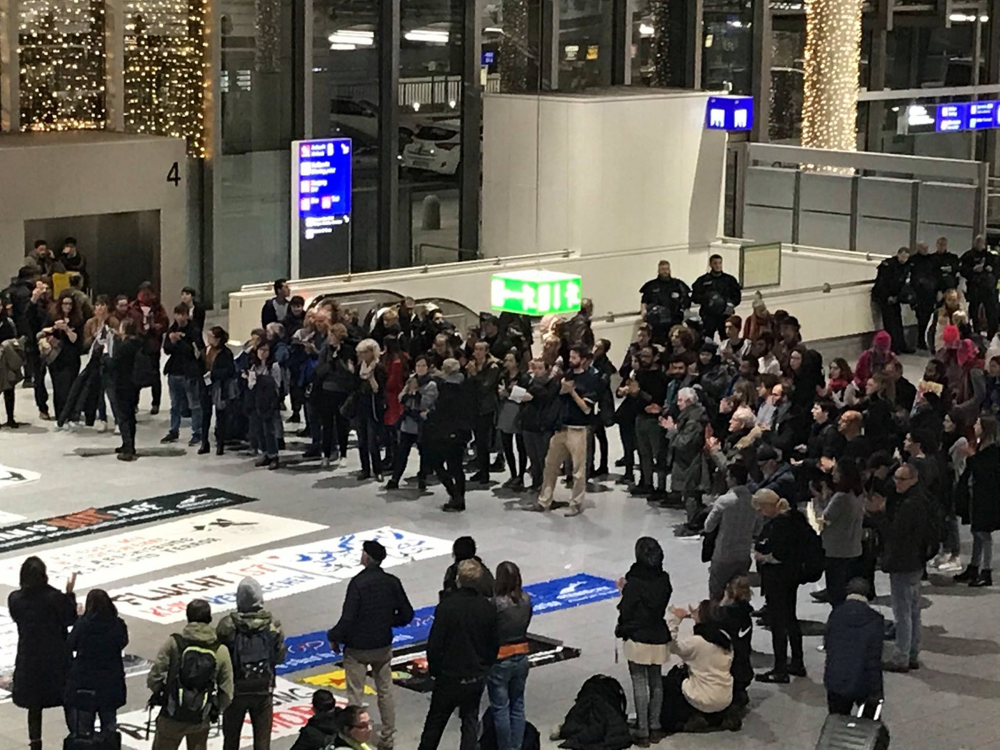

### AYS Daily News Digest 4/12/18: Denmark’s concerning aims for isolation
#### _What is going on in Denmark? / ERCI activists to be released on bail / Possible deportations in Austria, protest against German deportations to Afghanistan / Makeshift camp in V\. Kladuša dismantled / New deaths off the Libyan coast — join the London protest against torture / Alarming mental health situation on Nauru / more news_

 \)](assets/4bd06e5c0ceb/1*Zuu_Pw5War2_xT2l-HHibQ.jpeg)

Protesting deportations in the Frankfurt airport \(Photo: [Hessischer Flüchtlingsrat](https://www.facebook.com/fr.hessen/?tn-str=k%2AF) \)
#### FEATURE

Denmark has been taken over by fear\. 
Today, many refugees will probably be quite confused when their case worker starts talking about returning to their native land, shortly after they have been granted asylum\.

The country started its change in regards to others by voting at the beginning of 2017 that “there can’t be more then 50% non\-Danes in a specific area, you aren’t a Dane if one of your grandparents is from a non\-western country\.” Then, the immigration minister, [Inger Støjberg, celebrated the 50th amendment](https://www.facebook.com/IngerStojberg/photos/a.276535912386133.68727.207401585966233/1397458950293818/?type=3) to tighten immigration controls with a cake\. Among those who opposed everything that followed, drastically changing the image of Denmark as a free, open and advanced society, [as we wrote earlie](ays-special-denmark-once-a-fairy-tale-country-98604c09492a) r, were groups like Welcome to Denmark, [flygtningebørn\.dk](http://xn--flygtningebrn-lnb.dk/) , NoDeportations, Folkebevægelsen for Asylbørns fremtid \(The Movement for Asylumchildrens Future\) and Refugees Welcome, who together kept helping asylum seekers in their legal processes and building awareness of inhumane deportations\.

The Danish system first changed in 2015, when all permits were reduced from 5–7 years to 1–2 years, a special short\-term status for certain Syrian refugees was introduced, and a new article 19\(1\) was passed, making it possible to revoke a person’s refugee status by citing even minuscule improvements in their home country’s situation\. This law has paved the way for similar policies in a number of other EU countries\.
### “Aimed at temporary stay”

> Refugees will from now on be told very clearly that they should not expect to stay in Denmark but rather prepare themselves for return as soon as this is possible\. 

Only the security situation in the home country and family attachment will be assessed when considering a person’s application for international protection, and the government announces directly that it will be “to the limit of the conventions,” Refugees Welcome initiative in Denmark [reports\.](http://refugees.dk/en/news/2018/december/new-restrictions-for-refugees-in-the-finance-act-2019/?fbclid=IwAR2rbZtz_cyjaluAQRyJjSi0s1RtTGUWofS2Jwk-54f_ee_wJaTCO6oHM1k) 
According to the new measures, refugees are [not eligible for free education](http://refugees.dk/en/focus/2018/august/more-than-4-000-refugees-in-denmark-do-not-have-free-access-to-education/) \. This is not mentioned in the agreement, so it is unclear whether all refugees will lose their access to free education in the future\.

> Many refugees are already surviving below a minimum level of existence, where they can’t even pay food and medicine\. 

The small island Lindholm in the bay of Stege has been used for research on swine fever and foot and mouth disease, and today you must be put in quarantine after visiting the island\. From 2021 on, it will be the new home for people who have been given an expulsion order from Denmark that can’t be carried out in the near future \(for example, because the security situation in someone’s home country is too bad to deport them\), Danish groups report\.

> “Until we can get rid of them, we now move them on the island of Lindholm in Stege Bay, where they will be obliged to stay at the new exit center at night\. And there will be police around the clock\. Please share the good news\!” These racist comments were openly posted by the Danish People’s Party\. 

The Danish Institute for Human Rights \(a state institution\) recently [published a report](http://refugees.dk/en/news/2018/october/integration-benefit-violates-danish-constitution-and-human-rights/) showing that the present level of refugee benefits are already a breach of the Danish constitution and human rights\.

There are enough rights and opportunities to go around, say many people involved with different refugee initiatives and support group that are planning demonstrations against the recent political moves in Denmark\.

A [recent report from a state institution](https://menneskeret.dk/udgivelser/familier-paa-integrationsydelse) documents that refugees in Denmark do not have their basic needs covered\. 
Apart from everything else that the report documents, it is also clear that family reunifications will become barely possible, contingent on a given family’s economic situation\. Now, a mother or father will be expected to save up money for flight tickets and visa fees if or when a permission for family reunification is granted\.

](assets/4bd06e5c0ceb/1*at8IvQMhHAbBQP8xtIhNZw.jpeg)

by: [حقوقنا في الدنمارك](https://www.facebook.com/%D8%AD%D9%82%D9%88%D9%82%D9%86%D8%A7-%D9%81%D9%8A-%D8%A7%D9%84%D8%AF%D9%86%D9%85%D8%A7%D8%B1%D9%83-2332902223386875/?__xts__%5B0%5D=68.ARDEs1TJbguTz0OhWa_ZNZMoAtOLsoWhJEDStBcfACSUiH8q8oSEzxp0bE7mL3IHmZFCY8o0FCcDd7cKKsVkNX25kv82PrFLHHnn35nuUwBs0b_55pxiuDpGx3XKJYXT4lhjKGh2Fq6FFxtjCaTN9tJwuEvU6Fh09_9HkFGn8P_ZZL5jOGOgqgI92ON8S-HHmmO8M93WkmhB_Ky9Fj8dqjizdpXndw5y5PFG_Y2o1ofCFBTAYAO-CWw8SgehSZUwkxfdHr_Bzr0mp3JX2JcfWC5TsBFysEIk4NYuPLFmgO5LcovKhqHAVpEznRrJcwyhoFoDWIajFyRsuBj86HQ1qHb58Gm1&__tn__=k%2AF&tn-str=k%2AF)

Read more on the situation in the deportation centre Sjælsmark under ‘Denmark’ in this News Digest\.

Recently, a status widely shared among the refugees and asylum seekers in Denmark says:

“Dear Danish government, give back my fingerprints — and keep Denmark for yourself\.”
#### SYRIA

> 18\.7 thousand children under 5 are severely malnourished
 

> 1\.55 million pregnant and lactating women require preventive nutrition services
 

> 4 million people are at risk of becoming food insecure
 

> 2 million children \(36%\) are out of school 
 

> 3\.3 million children are exposed to explosive hazards
 

> 1\.5 million people are living with permanent war\-related disabilities
 

> 108 attacks on hospitals and medical personnel in 2017
 

> 3\.4 million children \(5–17 years old\) in need of health assistance 

 , via [Humans of Aleppo](https://www.facebook.com/humansofaleppo/?__xts__%5B0%5D=68.ARBE5-1vJhKbPyXtklPajI_UEXL52mDDxzX2TruqYL7ArZ07JjfIClSdpsj28LrBmujXNva6KkKrLqrYQkaOTTxU4z-Uencs0BYy7RG68VH-qyNHBbdRZEuQ3O3f_vlScSHB0xkWGgszzqFml3bV6T9CI8ibeb1_Mbr_tMq22PFK0FDhLsGwrpb3shPof8X0CgQFHoBxNtAM3fruoDPcCW7cQit-Z8PGcTIWK8iV8TDbODgC1qvYRf9Uwy363mXsdNC8V1nDBwNf12lpmdT0_fBogogz3ch3GtooYiwp7gsHwCURwREHKJWY1uDPniarLhdvD7hNQksD_HfivlObYXK1LzEfjDJTXf0cbTMafNMWECCD&__tn__=k%2AF&tn-str=k%2AF)](assets/4bd06e5c0ceb/1*j8jYYt2PkW6g0XvfAyc68w.jpeg)

[Full report](https://www.unicef.org/emergencies/files/2018-04_-_UNICEF_response_to_the_Syria_Crisis.pdf) , via [Humans of Aleppo](https://www.facebook.com/humansofaleppo/?__xts__%5B0%5D=68.ARBE5-1vJhKbPyXtklPajI_UEXL52mDDxzX2TruqYL7ArZ07JjfIClSdpsj28LrBmujXNva6KkKrLqrYQkaOTTxU4z-Uencs0BYy7RG68VH-qyNHBbdRZEuQ3O3f_vlScSHB0xkWGgszzqFml3bV6T9CI8ibeb1_Mbr_tMq22PFK0FDhLsGwrpb3shPof8X0CgQFHoBxNtAM3fruoDPcCW7cQit-Z8PGcTIWK8iV8TDbODgC1qvYRf9Uwy363mXsdNC8V1nDBwNf12lpmdT0_fBogogz3ch3GtooYiwp7gsHwCURwREHKJWY1uDPniarLhdvD7hNQksD_HfivlObYXK1LzEfjDJTXf0cbTMafNMWECCD&__tn__=k%2AF&tn-str=k%2AF)
#### MOROCCO

The [Association Marocaine des Droits Humains — Section Nador](https://www.facebook.com/AmdhNador/?__tn__=%2CdkCH-R-R&eid=ARDTkxxMhxB62_rMoBOVlHSWbw7-7Cdldp06YiIqaLrZETGn8G6KklTRo8uJdo8zqnJdofEiZqUIOFwF&hc_ref=ART8QtN0CSDbSOrqd-YCzLDr46pcDPebiRjUWEKu4gDH6lWzuyWS3hKaOzBmo6VeQhU&fref=nf&hc_location=group) reports that the Arekmane Centre in Nador is becoming the largest centre of permanent, illegal detention of Sub\-Saharan migrants in the entirety of Morocco and perhaps even throughout the Maghreb\.

> Hundreds of migrants have been detained inside this centre under high surveillance since October 2018 before their deportation from Casablanca Airport\. 

People do not know the conditions of detention of migrants within this centre\. **AMDH Nador has been prohibited from accessing the centre twice\.** 
The Attorney General, the minister of justice, and the president of the CNDH — to whom a complaint was filed — did not investigate these cases\.

> At present, dozens of migrants have been detained for at least 7 days\.
 

> Despite all this, at the Marrakesh Summit, state media and some NGOs continue to say that Morocco respects the rights of migrants\! 

#### LIBYA

It is [reported](https://uk.reuters.com/article/uk-europe-migrants-libya-idUKKBN1O310E?fbclid=IwAR0wr486kXO3w2EBY_Q3khtAQiP10SoV24ZvzyoqNruyx4R9AbKTj-1tGfc) that **fifteen migrants have died in a boat off the Libyan coast after spending 12 days at sea without food or water** , an Egyptian survivor said on Tuesday\.

Only 10 survivors suffering from severe dehydration were taken to a detention centre, Libyan IOM representative confirmed, adding:

> “Alarming we still do not see solid steps to address irregular unsafe movements across the Mediterranean Sea\.”

Everyone else wonders: what regular way is being offered to these people so they don’t have to resort to “irregular, unsafe movements” to cross the Mediterranean at all?

■■■■■■■■■■■■■■ 
> **[Missing Migrants Project](https://twitter.com/MissingMigrants) @ Twitter Says:** 

> > At least 114 people lost their lives in the Western Mediterranean during the month of November, the month in which the most deaths have been recorded by @[MissingMigrants](https://twitter.com/MissingMigrants) since we started documenting deaths in 2014: [bit.ly/2BQWzG7](https://bit.ly/2BQWzG7) #[MissingMigrants](https://twitter.com/MissingMigrants) https://t.co/Koo4535k0s 

> **Tweeted at [2018-12-04 16:08:49](https://twitter.com/missingmigrants/status/1069986894480588800).** 

■■■■■■■■■■■■■■ 

#### GREECE
### Islands

[Aegean Boat Report](https://www.facebook.com/AegeanBoatReport/?__tn__=%2CdkCH-R-R&eid=ARDJoiOBJATRIQLANG1wAn7f06hsW2qdIAdLzP8BQFK_5vdrCPFKQpsJOEWhHr___Vf3ifdWohCtGupI&hc_ref=ARQVnVY-OhPRgpsFbZ-dyZaZp-aecMrkt9wyTJr1n_7xUaDHTPGxx5FyZr1SEmCgbno&fref=nf&hc_location=group) team reports that 105 people in total landed this Tuesday morning at Lesvos and Agathonisi\.

As for the officially registered people on the islands, here is the usual report:

#### No legal aid for people on the islands

The Greek Appeals Committees have recently sped up the examination of appeals on the islands and make decisions within a couple of days or two weeks, notwithstanding the inability of the State to appoint a legal representative to applicants, AIDA reports\. People there have had no effective access to legal representation for months, due to persistent and severe shortages in the state\-funded legal aid scheme for asylum appeals\. [See more\.](http://www.asylumineurope.org/news/04-12-2018/greece-asylum-seekers-left-without-legal-aid-islands?fbclid=IwAR2OGNRY3k_yRIbpJGZS7-HJktX7s5-bJgM0R5FHORnCInyoVNH07r7UiMY)

However, in spite of the growing number of people and still\-deteriorating conditions, the UN Commissioner, among other things, \(under\) [stated](http://www.ana.gr/home/article/315229/Kalutera-proetoimasmena-ta-nisia--alla-uparchoun-perithoria-beltiosis) that “the Greek islands are better prepared for winter this year, but there is room for improvement\.”
### Jailed activists ordered out of police custody

Good news for three jailed activists in the case of criminal accusations brought by Greek prosecutors against solidarians on Lesvos for their efforts to rescue migrants and asylum seekers at sea\. The release on bail of Sarah, Sean, and Athanassos was ordered by the investigator in the case and will occur in the coming days\. In the next few months, the judicial council will reportedly decide whether a court case will take place or not\. Read more on the case [here\.](https://www.hrw.org/news/2018/11/05/greece-rescuers-sea-face-baseless-accusations?fbclid=IwAR2wvqt4KsbHmAq5d3sMG1x5BTUwezrGa6Bpx_7X0MSaCux9DQSWzA9CGjw)

■■■■■■■■■■■■■■ 
> **[Διεθνής Αμνηστία](https://twitter.com/AmnestyGreece) @ Twitter Says:** 

> > «Ενώ καλωσορίζουμε τα νέα ότι θα επιστρέψουν στις οικογένειές τους σήμερα το βράδυ, μετά από πάνω από 100 μέρες μέσα στη φυλακή, το γεγονός ότι αντιμετωπίζουν ακόμη παράλογες κατηγορίες και, ενδεχομένως, μεγάλες ποινές φυλάκισης, είναι εξοργιστικό.»
[amnesty.gr/news/press/art…](https://www.amnesty.gr/news/press/article/21886/na-aposyrthoyn-oi-katigories-diakinisis-stoys-anthropoys-poy-diesozan) 

> **Tweeted at [2018-12-04 18:57:20](https://twitter.com/amnestygreece/status/1070029300945117189).** 

■■■■■■■■■■■■■■ 

### Volunteering

[Refugee 4 Refugees](https://www.facebook.com/Refugee4Refugees/?__tn__=%2CdkCH-R-R&eid=ARA-saB21NLeKBybS7h_Fq4b7q5pxPGhNxBUvOmzvCGpM6RHb-NsFnKjkcpQvvmblI5Vuf-rTwR02Z1i&hc_ref=ART-HSVAtYU61jmNYxhsuP3kxfdS8GQT-1mkRJfo2LeABBFQKgOwEEPhatpp_5XFfpY&fref=nf) is looking for volunteers in December:

> Preferably you’re 20 years or older and have a driving license for a manual car and you can stay for at least 2 weeks\. Are you the perfect fit? Please fill out this form to apply: [https://refugee4refugees\.org/volunteer/](https://l.facebook.com/l.php?u=https%3A%2F%2Frefugee4refugees.org%2Fvolunteer%2F%3Ffbclid%3DIwAR327DAwOsdQ3lx1WVLIzvbOGPOjUHcnUkcvXkWmAcu3lIaX_aGkIx-Y_ys&h=AT0JEzDImxAn4rvMeLFrHSdp11sCsfkYrayRh_VY_dJBNcyIlACGdddTfLbRyKw6-OLFnxm82dcOInMczuZ93Owuv1mEjLVHXP40KU3-uGwjdlNN6n9PErKRe_HgdK9PJwasAEO6tx_493ZtVmkAaesf) 

[Movement On The Ground](https://www.facebook.com/movementontheground/?__tn__=%2CdkCH-R-R&eid=ARC3eiKynagv6ODWS3d0IrZtncnnFyM6T85bf8waIB4pXUQmsFCAQjeEofxwi3swYbZRsX4Dv6hJxujx&hc_ref=ARSAgso4S3cjHJQVhlIPDvcr3jqH7Mlc_K5OQI7GBZ-oAgMb_B-ozyH-L5_q3u9SEGg&fref=nf) is also looking for volunteers:

> Are you a jack of all trade? A talented handyman with experience in construction work? We need you\! Send us your application to volunteer@movementontheground\.com\. We are currently looking for a few handymen who can help us out with technical work around the campUS’s asap\! 

](assets/4bd06e5c0ceb/1*c5AQmqb7nZ_7RlbZrVIpuw.jpeg)

Photos: [NoBorders](https://www.facebook.com/nobordersnetwork/?tn-str=k%2AF)

Stories turn up on daily basis all along the Balkan route where the locals and people on the move come in contact through different ways, their lives intertwined because of the risky forms of travelling people are forced to use to in order to reach their final destination — safety\.

A whole village in Greece has been discussing the act of a group of immigrants who did not want to steal to warm up, [Greek media](http://www.thessnews.gr/article/112305/metanastes-piran-xyla-apo-kleisto-kafeneio-gia-na-zestathoun-kai-afisan-deka-eyro-stin-porta-foto?fbclid=IwAR2t_0iqMbxtrkYvTUsV9i_Y9CAvcixAnEYXkv-IZ1juEgiDEVxJgMUoHX0) and [volunteers](https://www.facebook.com/nobordersnetwork/?__tn__=%2CdkCH-R-R&eid=ARC-GKvw6lMAWeRf2HeQmS0ozoisaSTG1fH7uQSKDZgXasY5qJOOiBs8uWP5A_u-WY3JPm91NhHZ3wdk&hc_ref=ARRCW5mVI39pBuv_08KSLv9v340s7qTvdVhN6Y1LRjCOfIvTGr6tkCyHUkhObOXd4nM) report\. 
Instead, the group left a 10 euro note to pay for the wood they took from its owner\.

“Refugees took woods from a closed coffee shop to warm up and left ten euros at the door\. The whole village is talking today about the act of a group of asylum seekers who left an envelope with 10 euros, to pay for the wood they took without the knowledge of coffee shop owner, at Nea Vissa — Orestiada, near Evros borders, where the temperature fell below zero,” volunteers say\.

> “It was written in English, I went to a neighbor to translate it, I was surprised seeing a white envelope and my surprise was even greater when I saw the money in it”

— said Dimitris Kazantzis, owner of the cafeteria\.
#### BALKAN WEATHER report of 4/12, forecast for December 5

**MONTENEGRO**

Predominately sunny\. Increasingly cloudy in the north during the morning\. The wind will be moderate to strong blowing from the north and decreasing in strength in the afternoon\. Lowest temperatures will be from \-4 to 10 and highest daily from \-1 to 16 degrees\.

**SERBIA**

Moderately to entirely cloudy in most parts of the country, in the east and south rain at some places during the morning\. Predominantly sunny in the north during the morning, moderately cloudy in the afternoon\. The northeastern wind will be moderate in the mountains and in the east strong from time to time, and will turn into a southeastern wind towards the end of the day\. Lowest temperatures from \-1 to 4 and highest daily from 4 to 8 degrees\.

**BiH**

Predominantly sunny in most parts of the country\. In the basins of Bosnia and along the rivers fog or light clouds\. In Bosnia the wind will be weak to moderate blowing from the west and northwest, and in Herzegovina a moderate Bura\. The lowest temperatures will be from \-3 to 10 and highest daily from 3 to 15 degrees\.

**CROATIA**

In some parts of the country predominately sunny; moderately cloudy in others\. Foggy in the west inland during the morning\. The wind will be mostly weak, before noon moderate blowing from the northeast \(with a northwestern wind in the east\) \. Alongside the coast, moderate to strong Bura with stormy gusts locally\. The lowest temperatures will be from \-2 to 11 and highest daily 4 to 15 degrees\.
#### BOSNIA AND HERZEGOVINA
### A man\-made humanitarian crisis continues to unravel, regardless of temporary solutions

As we reported time and time again in earlier news digest editions, the situation in Velika Kladuša and Bihać remains dire for those stranded in the country’s western part, closest to Croatia, the EU border country that agreed to play ‘gatekeeper’ for the union\.

The makeshift camp Trnovi is being dismantled and closed, sending everyone who was still staying there to the Miral company’s facility in the part of Velika Kladuša called Polje\.

They had 30 minutes in the morning between the police arrived and the time they burned the tents\. Employees of the Komunalija cleaning company cleaned up the area\. — Photo: AYS

Close to 600 people are [reportedly](https://www.klix.ba/vijesti/bih/zatvara-se-migrantski-kamp-trnovi-u-velikoj-kladusi-uklanjaju-se-satori-i-cisti-teren/181205018?fbclid=IwAR3Fa2HnxuXthyLM1UbQqMCIYHA_IK8UjQllW0gaB70uHuBGUMNlTQmRBis) staying there already\.
This improvised camp \(Trnovi\) was formed by the municipality in May this year to concentrate the people previously staying in the central city park\.

The authorities claim everyone from the student home Borići in Bihać was transferred to the reception centre Bira\. They claim the infrastructure is being rebuilt in order to accommodate 550 families\.

 \)](assets/4bd06e5c0ceb/1*0WkGBgr1y979J5SvWkKlZA.jpeg)

Borići camp in the former student dormitory building \(Photos: [Zilvia Marauan](https://www.facebook.com/zilvia.marauan?__tn__=%2Cd%2AF%2AF-R&eid=ARDi_x_-CIeDCwUYn6NLberHrxgnjRXyLf_Om4tFLHUmd4z_iTixfb8T86O9FTV6z4PZQxmMJIiP2riI&tn-str=%2AF) \)

In spite of growing tendencies to overlook this crisis — caused by lack of political will and failed reporting — even some of the [Croatian media](http://novilist.hr/Vijesti/Hrvatska/HLADNOCA-ZAUSTAVILA-MIGRANTE-Izbjeglice-u-Bosni-u-zadnji-cas-spasene-od-smrzavanja?meta_refresh=true) reported on the dire conditions and helpless position people are left in, overwhelming the community’s capacity to cope, despite the recent opening of the old factories’ facilities:

> “It would be wrong to conclude that these nameless people, who have nothing, could now be considered taken care of in a pleasant place: in spite of respectful endeavors of NGOs and international agencies taking care of the refugees \(sic\! \), the spaces those people will be spending winter months are only improvised, unpleasant warehouses, provisionally arranged just so they don’t die of hunger and cold in them\. The refugee crisis is, therefore, not nearly over: it is, literally, only frozen\. Until, in few months, it defrosts and continues again\.”

 \)](assets/4bd06e5c0ceb/1*YOpvDGHkug_SIRsAyN_PWg.jpeg)

Bihać, ‘camp’ Bira \(Photos: [Zilvia Marauan](https://www.facebook.com/zilvia.marauan?__tn__=%2Cd%2AF%2AF-R&eid=ARBvNdrRgEdU650yT-U95A_vxqWap81Lwpsxx0le83P6eaF6NsqkYxSutFMJXcJldTkrZywjvtGG6mrn&tn-str=%2AF) \)
#### ITALY

This Tuesday morning nine migrants from Syria were found inside a rail freight train transport containers near Altavilla Vicentina, [One Bridge To Idomeni](https://www.facebook.com/onebridgetoidomeni/?__tn__=kC-R&eid=ARDNQQEMBYsVgLCvwzz-fBOdGB9oj5XlhkzxiPj1dWPIdYKovOG12VdLcbyE0DKVvQytYZLW2ipp7pZV&hc_ref=ART1QG0Pjt7BZpM2pGfU8dZ27v22j09iXIVCLDFta4CoLp5YBxLzj8Akvqbg7YNSeUo&fref=nf&__xts__%5B0%5D=68.ARCbrjx3C5x_qalgvz-UfTMTyUEkwSKpCK58elKq7vhFhRCO31wpLkng1SP16FXm2Tiy_v_JFe-zhTCtwzXxe1tB_VcYC1iYOQwbETGarRI3Ad-y6gXSrKsob8Qu2cfEEeZoHFB_ot5eAAutK1FoKBudJioGfwAkz2ehAKkIe2teNba9fNa0i3UmHdUMJmP9ZesHqCoswDrweU9HfqPXh4VQ9Lu0d21lqSwbL7Psd92Y5s5Scs_DY7HAyr7sfBM0qrYDJF-lTDtz02fkDgBAaMRP5ciJguWHcZOBTz4cBxP6j6ilvZxjOgiR18aWdKYSwFatNeYPmpeUTG9jWa9DCMQ2Eg) reports\.
### Salvini goes towards mayors via letter to the local press

By writing to around 50 newspaper addresses in the north of the country, Italy’s minister Salvini is working progressively to persuade the Italian people that his decree is somehow a good thing, [Italian media](https://www.lastampa.it/2018/12/02/italia/salvini-scrive-a-venti-quotidiani-locali-per-spiegare-la-strategia-sui-migranti-lQW5EGkbIrzO4t1GKHUBXI/pagina.html) report\. This happens after some municipalities already said they would not respect the decree\.
Prior to this decision, it was the municipality and mayors who could choose to take part to the SPRAR network \(second\-level reception centres\) \. Now, Salvini is arguing that mayors have more power to choose whether they want to implement first\-level reception centres in their territory or not\. Since there is only one level of reception now \(not considering hotspots\), if certain mayors are persuaded not to receive migrants, they would be left with fewer options for housing, if any at all\.
### **Benches with people too close to the Nativity?**

In Udine, on the occasion of Advent, the Christmas decorations and a crib have been installed, on Piazzetta del Pozzo, near the sidewalk, “only” 4 meters from the two public benches generally used by foreign citizens — mainly asylum seekers — to be together, talk and meet\. Now the benches are to be removed, allegedly for “aesthetic reasons\.”

_”Are the benches really damaging the Christmas spirit?”_ asked the former councilor before talking about policies close [to the culture that led to the racialized laws](http://www.udinetoday.it/politica/panchine-anti-bivacco-natale-leggi-razziali-del-torre-udine.html) , media [reported](http://www.udinetoday.it/cronaca/natale-presepio-eliminate-panchine-anti-bivacco-migranti.html?fbclid=IwAR0g42hh8GanSAMpsN_qOUJtfDiPdwfDdCoGNMpE-4gr11lu9BPNHOpVy8c) \.
#### AUSTRIA
### Stop the deportations

### Human Rights Award 2018 for LIFELINE captain

The President of the Austrian League for Human Rights explained her decision for the award: “This year’s winner of the Human Rights Award, Claus\-Peter Reisch, has rescued fleeing people as a captain of the ‘Lifeline,’ which brought him criminal proceedings in Malta\. Nevertheless, he does not give in\.

> At a time when politics — all over Europe, but especially in Austria — promotes inhumane tendencies, Claus\-Peter Reisch at the forefront of his team not only saves lives, but gives courage to all those who refuse to just watch what is going on\. “ 

■■■■■■■■■■■■■■ 
> **[Claus-Peter Reisch](https://twitter.com/ClausReisch) @ Twitter Says:** 

> > Khalid Timan kam über das Meer und ist nun in Sicherheit. Seine Schule hat dieses Bild von ihm gesendet. Ich bin froh, dass unsere Crew Khalid retten konnte. Er macht unsere Gesellschaft reicher! #safepassage https://t.co/aWeV3kMaWB 

> **Tweeted at [2018-12-04 09:54:17](https://twitter.com/clausreisch/status/1069892640576032769).** 

■■■■■■■■■■■■■■ 

#### GERMANY
### Against deportations

A [protest](https://www.facebook.com/events/322181978507088/) was held at the Frankfurt airport against the dubious decisions underlying deportations to Afghanistan, where a war has been going on as long as anybody remembers, and in many ways is still getting worse\.

 \)](assets/4bd06e5c0ceb/1*z_yXifwpIvAiIgKUoTpxuA.jpeg)

Tuesday’s anti\-deportation protest in Frankfurt \(Photos: [Hessischer Flüchtlingsrat](https://www.facebook.com/fr.hessen/?tn-str=k%2AF) \)

On Monday afternoon ahead of the announced deportation flights, people posted invitations and gathered in public spaces to oppose these decisions\.

■■■■■■■■■■■■■■ 
> **[SFR - Flüchtlingsrat](https://twitter.com/sfr_ev) @ Twitter Says:** 

> > In diesem Moment wird Hr M aus #Zwickau nach #Afghanistan abgeschoben! Wir fordern von @[SMIsachsen](https://twitter.com/SMIsachsen) und Fr Köpping: stoppen Sie die #Abschiebung eines Menschen der ein ganzes Leben in #Sachsen aufgebaut hat! Er arbeitet, spricht Deutsch - was wollt ihr mehr?[bit.ly/2RxakiE](https://bit.ly/2RxakiE) 

> **Tweeted at [2018-12-04 11:44:21](https://twitter.com/sfr_ev/status/1069920339495403520).** 

■■■■■■■■■■■■■■ 

Mr\. M\.’s employer said on Facebook: “A young man and a trusted employee who never had anything to go to school with was suddenly torn from his new life\. We lose a wonderful colleague with him\.“ His lawyer filed an application for asylum in the early afternoon, which has already been rejected\.

The number of people deported from Saxony to Afghanistan will therefore increase to at least eleven\. Ten were returned to the war zone during previous deportations\. How many more people from Saxony yesterday sat in the plane, is not known at the time, the Saxon Refugee Council [reported](https://www.saechsischer-fluechtlingsrat.de/de/2018/12/05/pm-update-abschiebung-von-herrn-m-nach-afghanistan-vollzogen/?fbclid=IwAR0CFUMqtWGC5eXMjvdVpXegNIkpzzFIDFVu6fC_FLP_mvoM2AGcdoSQztY) \.

#### FRANCE
### Calais

](assets/4bd06e5c0ceb/1*Uvj4INAmP3vfl5tQETHqpA.jpeg)

Info & text by: [Refugee Info Bus](https://www.facebook.com/RefugeeInfoBus/?__tn__=%2CdkCH-R-R&eid=ARBxqhQALaKpAxsCNJzn4QUEqvPy4eAd-uFvWcl5b86EBS9qEqqJ_riYxB44tz3ffIb1Jjl8wpAxAc35&hc_ref=ARTYE4M-X_FF6-95lqpA8muj0eAPKvwcge2bHjigJoyTXK3ptJfXPipwrGTqUEJfMb4&fref=nf)

> Testimonies from refugees and volunteers are a powerful tool, providing insight into the contextual situation for refugees sleeping rough in Calais and Dunkirk: the use of tear gas amongst the most shocking, with no reason or prior warning, at close proximity\. The report titled ‘Police Violence in Calais: Abusive and Illegal Practice by State Authorities’ will be published by @Refugee Info Bus and @L’Auberge des Migrants and will be available to read in full at [www\.refugeeinfobus\.com](https://l.facebook.com/l.php?u=http%3A%2F%2Fwww.refugeeinfobus.com%2F%3Ffbclid%3DIwAR2Qf6CqHbPe9XU0qRoPQt9RblTg33KIw0KPTE5GuoMR0iYvJaRIeK0GqhU&h=AT2nGKeJsTPXZm_czlVXRrf2qq89zq8Xr0rsMvarLozWfn-6wvKrht9lro89IV7-GxsqD9r4oCB_6qgh3f-VII02HHuOHk8fDGTXyU-mOxrbZaI9RY2TCyoe7xJOCAUCEJOlUDc) 

### Paris

[Vestiaire pour les migrants\. Paris](https://www.facebook.com/vestiairemigrants/) is in a serious need of donations:
Toiletries: Shampoo, Shower Gel, soap, body cream, toothbrush, toothpaste, razors and shaving cream, tissues, deodorant, nail clippers, notebooks, pens\.
Also, they need medicine for Scabies: Stromectol, spregal, Ascabiol, Ascaflash, a\-by, dexeryl, xyzall\.
Clothes: shoes size 40–45, trousers size 38 to 46, socks, underwear, boxers, belts, backpacks, sleeping bags, winter jackets, shirts and T\-shirts size S and M, caps, hats\.

Usually, you can bring the donations in the following hours \(contacting them beforehand\):

> **_Wednesdays 15–18h_** 
 

> **_Saturday and Sundays 9\- 14h_** 

Contact info:

> _VESTIAIRE POUR LES MIGRANTS_ 
 

> _12, rue Saint Bruno 75018 Paris_ 
 

> _Église Saint Bernard de la Chapelle_ 
 

> _Téléphone 06 03 02 83 72_ 
 

> _mail : vestiairemigrants\.paris@gmail\.com_ 

#### DENMARK

■■■■■■■■■■■■■■ 
> **[Firefund](https://twitter.com/firefundnet) @ Twitter Says:** 

> > Campaign launched for the refugees in Sjælsmark detention center (Denmark) - go support the hell out of them! ✊🏽

[firefund.net/cos](https://www.firefund.net/cos) 

> **Tweeted at [2018-12-04 09:38:30](https://twitter.com/firefundnet/status/1069888665508290560).** 

■■■■■■■■■■■■■■ 

### Support activists from Sjælsmark in their struggle for tolerable living conditions\!

The government’s ambition to create “motivational” measures has resulted in unlawful and unfair terms\. Many of the residents at Sjælsmark cannot go home\. They are forced to live in a suspended military barracks\. Housing conditions are quite unsuitable\. The windows are leaky, and children and residents feel the wind coming in\. Parents only have access to new clothes for their children every six months, even though they have expressed that the children are freezing\. In addition, there is a limited possibility of washing clothes, with only 5–6 washing machines \(which are often broken\) available for about 200 people\. Children and young people are not allowed to go to school\. That is, they cannot attend a proper Danish primary school — instead, they are left to the sparse teaching organized by the Red Cross\. It prevents them both from playing with other children and developing their learning\.

The dietary conditions in Sjælsmark are critical\. Firstly, residents are restricted to one serving; secondly, the food is so bad that parents and children complain of abdominal pain\. Threats to children’s health and well\-being are compounded by the inedible food offered by the canteen\. Parents cannot prepare a healthy diet for the children as there are no kitchen facilities or refrigerators in Sjælsmark\. In addition, they can’t eat in their rooms\. The children do not have toys or televisions in their rooms\. Additionally, there is no access to vacuum cleaners, so the children must play in dirty rooms\.

We collect financial help in order to assist the residents of Sjælsmark in their protests and important demonstrations to improve children’s lives and conditions\. Here are the official requirements prepared by the residents:

> Close Sjælsmark\!
 

> Access to Danish Folkeskole /nursery/kindergarten\!
 

> Change the meal scheme\!
 

> Access to kitchens where you can cook\!
 

> Better access to the healthcare system\!
 

> Reopening of cases after a maximum of 12 months\!
 

> Permission to work / to a traineeship/education\!
 

> To get financial help back\!
 

> Clothes more often than every six months\!
 

> How long should we stay in Sjælsmark? 

Residents of Sjælsmark receive no financial help from the state\. 
They reside in a suspended military complex on a field far from other cities\.
#### UK
### London protest against Libyan torture

[@afrilivesmatter](https://twitter.com/afrilivesmatter) is organising a **protest this Saturday in London** against the treatment of refugees and migrants in Libya\. It’s planned to go from Europe House, to the FCO and to the Libyan embassy\.

#### AUSTRALIA
### Alarming mental health situation

The mental health crisis on Nauru is the worst that the medical teams working there have seen so far\. Almost half of [@MSF](https://twitter.com/MSF) ’s Nauruan patients have psychosis, with many requiring psychiatric hospitalisation that was not available\. They appealed to the Nauruan Government to meet the needs of their own population\.

■■■■■■■■■■■■■■ 
> **[MSF International](https://twitter.com/MSF) @ Twitter Says:** 

> > The mental health crisis on #Nauru is the worst we've seen in any of our projects.

12 adults and children we've treated on #Nauru were diagnosed with resignation syndrome, existing in a semi-comatose state and unable to eat or drink. [bit.ly/2PfpYwV](http://bit.ly/2PfpYwV) https://t.co/0wv4e30wLB 

> **Tweeted at [2018-12-04 05:34:00](https://twitter.com/msf/status/1069827136066732032).** 

■■■■■■■■■■■■■■ 

The MSF claims that while many of the refugees and asylum seekers they treated in Nauru had experienced trauma, **it was the Australian policy of indefinite processing that devastated their mental health\.**

We also publish a **weekly overview in Arabic and in Persian** of some of the most important stories we covered during the previous week\. 
Please, share it with your Arabic and Persian speaking friends\. 
Here is last week’s **Arabic version: [خلاصة الأسبوع \(ا\.ي\.س\) عمليات الاحتجاز والترحيل في المانيا](%D8%AE%D9%84%D8%A7%D8%B5%D8%A9-%D8%A7%D9%84%D8%A3%D8%B3%D8%A8%D9%88%D8%B9-%D8%A7-%D9%8A-%D8%B3-%D8%B9%D9%85%D9%84%D9%8A%D8%A7%D8%AA-%D8%A7%D9%84%D8%A7%D8%AD%D8%AA%D8%AC%D8%A7%D8%B2-%D9%88%D8%A7%D9%84%D8%AA%D8%B1%D8%AD%D9%8A%D9%84-%D9%81%D9%8A-%D8%A7%D9%84%D9%85%D8%A7%D9%86%D9%8A%D8%A7-6804834bae5b)** 
and **Persian: : [خبرهای هفتگی آر\. یو\. س: بازداشتگاه‌ ها در سه منطقه ی آلمان](%D8%AE%D8%A8%D8%B1%D9%87%D8%A7%DB%8C-%D9%87%D9%81%D8%AA%DA%AF%DB%8C-%D8%A2%D8%B1-%DB%8C%D9%88-%D8%B3-%D8%A8%D8%A7%D8%B2%D8%AF%D8%A7%D8%B4%D8%AA%DA%AF%D8%A7%D9%87-%D9%87%D8%A7-%D8%AF%D8%B1-%D8%B3%D9%87-%D9%85%D9%86%D8%B7%D9%82%D9%87-%DB%8C-%D8%A2%D9%84%D9%85%D8%A7%D9%86-eff619e8ee0d)**

**We strive to echo correct news from the ground through collaboration and fairness\.**

**Every effort has been made to credit organizations and individuals with regard to the supply of information, video, and photo material \(in cases where the source wanted to be accredited\) \. Please notify us regarding corrections\.**

**If there’s anything you want to share or comment, contact us through Facebook or write to: areyousyrious@gmail\.com**

_Converted [Medium Post](https://medium.com/are-you-syrious/ays-daily-news-digest-4-12-18-denmarks-concerning-aims-for-isolation-4bd06e5c0ceb) by [ZMediumToMarkdown](https://github.com/ZhgChgLi/ZMediumToMarkdown)._
