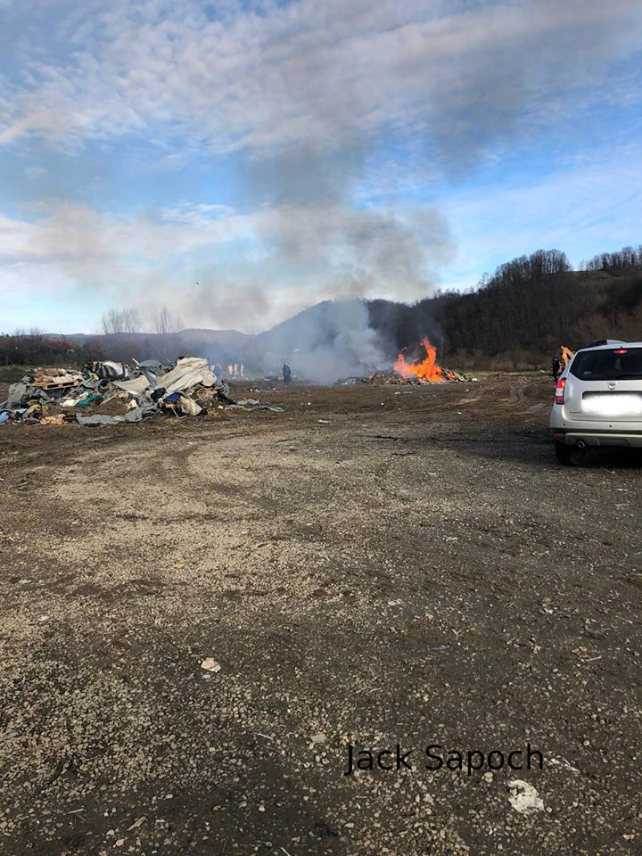

### AYS Daily Digest 5/12/18: As Marrakesh Refugee Summit Approaches, Chaos in Countries of First Entry
#### _Tragedy in the Bekaa Valley // On International Volunteer Day, Lesvos 3 out on bail // Family given asylum interview date for five years hence // Velika Kladusa razed // New report documents police violence in Calais // Masked and hooded on a deportation flight — standard practice in France? // German Interior Minister kept return deal with Greece and Spain secret from his own parliament // and more…_

](assets/d3f06a212040/1*sEWyicLgqPCSzfYI5NlxUA.jpeg)

Source: [Nador New](https://www.facebook.com/Nador.new2019/?__tn__=%2CdkCH-R-R&eid=ARCD6kukuAZvYb-VSVrUYoeMX4mxPNyYI3rRxr4jsTL9uiPeYb71t3nHdX25n_oEoCISJyhU1Ynb76Yx&hc_ref=ARQ49z9_Pd2SfuIUW1rAmoHM61mj3RJAra-GRghuA6Lkf26gvDnUBac5w8k6DkMl8XA&fref=nf&hc_location=group)
#### FEATURE

As the Marrakesh Conference on refugees and displaced people approaches, various nations both within and outside the E\.U\. are getting cold feet\. The conference, which will be held on December 10 and 11, is the culmination of two years of negotiations, discussion, and compromise, as Head of Eurasylum Solon Ardittis [writes](https://www.newsdeeply.com/refugees/community/2018/12/05/whats-to-fear-in-the-u-n-global-compact-for-migration?fbclid=IwAR2BhkXD4n0X0dG8w8Q7DiHsi_mpzeCQBug-ojHJAFxwrd9R0Cspn3BE8B8) in an excellent primer\. But now, with the 30\-page compact that is the product of countless hours of meetings set to be adopted next week, a growing list of countries that includes Austria, Bulgaria, Hungary, the Czech Republic _,_ Poland, Slovakia, and the U\.S\. have signaled their unwillingness to sign\. What’s more, Italy is on the fence, and Belgium is beset by internal, compact\-related discord so serious that their government is on the verge of collapse\.

The Marrakesh conference comes at a time when the asylum services of E\.U\. countries of first entry are at their breaking point\. AIDA and ECRE are [reporting](http://www.asylumineurope.org/news/04-12-2018/spain-severe-delays-registration-asylum-applications) that Spanish authorities are experiencing “severe delays” in registering asylum seekers, with families forced to sleep outside overnight to register and people repeatedly being turned away\. **Those who are finally successful in making it to the front of the line are given a date — not for their interview, but merely to lodge their asylum claim\.** The dates that are currently being handed out are as late as 2020\. According to both Spanish police and the ombudsman, “the system has collapsed\.” A group of French and Spanish NGOs have called for an immediate reform of the Dublin Regulation, which places an undue burden on peripheral E\.U\. countries, [here](http://www.forumrefugies.org/s-informer/communiques/augmentation-des-arrivees-en-espagne-l-europe-doit-sortir-la-reforme-de-dublin-de-sa-paralysie) \.

■■■■■■■■■■■■■■ 
> **[ECRE](https://twitter.com/ecre) @ Twitter Says:** 

> > #AIDA @[ecre](https://twitter.com/ecre) Spain: Severe Delays in Registering Asylum Applications
🇪🇸 Ombudsman initiates action in reaction to long waits for asylum application in Madrid
▶️200 ppl (+children) forced to sleep outside police station to wait
▶️Appts. given for Dec 2020! 
[bit.ly/2AUL12G](http://bit.ly/2AUL12G) https://t.co/hZJZCiunHk 

> **Tweeted at [2018-12-05 12:35:50](https://twitter.com/ecre/status/1070295683662516226).** 

■■■■■■■■■■■■■■ 

The situation in Greece, where asylum seekers routinely queue overnight outside the various asylum service offices only to be told to “come back tomorrow,” is hardly better\.

After crossing the border into Greece, one Turkish family of 4 \(parents, a 4\-year old son, and a severely disabled 9\-year old daughter\) spent six months in an unofficial camp in Lavrio\. During that time, they tried but were unable to register for asylum\. Finally, today, they were moved to an apartment in Athens and successfully registered — only to discover that their interview date has been scheduled for five years from now\.

Five years of limbo, stress, uncertainty, and anxiety\.

Five years during which their lives will effectively be on hold\.

This glacial processing time is likely due to be the dramatic increase in Turkish nationals seeking asylum in Greece in the past calendar year after widespread political unrest and the persecution of dissidents\. There are not enough Turkish translators in place to process these claims, and the system has been characteristically slow to respond, leaving families like this one stranded, unable to accept that their case will not be resolved — whatever its outcome — for half a decade\.

Meanwhile, in Morocco, any trace of the visible refugee presence is being hastily swept under the rug in preparation for the upcoming summit\. It’s ironic that a conference intended to bring about better treatment for displaced people is being held in Morocco, where migrants from Sub\-Saharan Africa are routinely subject to dehumanizing and illegal treatment by the country’s authorities — but then again, leaders would be hard pressed to find a conference location that _wouldn’t_ inspire a sense of hypocrisy\.

“Only a few days away from the Marrakesh summit, the arrests, refoulements, and expulsions continue,” Nador New posted on Facebook today\. The group reports that the Nador authorities are attempting to empty out an illegal detention center called Arekmane and deport its inhabitants “in order to temporarily camouflage \(the government’s\) violations\.” A group of Malians, Guineans, and Côte d’Ivoirians who were being held in the detention center were deported today, and around 140 Cameroonians were reportedly pushed back to the south of Casablanca yesterday\.

Even if it were — miraculously — unanimously passed next week, it’s impossible to say what tangible impact the Marrakesh compact will have on the lives of displaced people like the Turkish family waiting in Greece, or the African migrants struggling to survive in Morocco\. But when decisions about the fate of refugees remain in the hands of out\-of\-touch lawmakers with little understanding of the range of struggles that come with being displaced, when years of endemic procedural chaos in individual countries’ asylum systems has been seen as the price of doing business, when E\.U\. countries in the north have routinely and continually ignored the greater burden that the Dublin regulation places on their Mediterranean counterparts, and when a country’s authorities can welcome dignitaries with one hand and shoo away desperate people with the other — it’s hard to be too hopeful\.
#### LEBANON

Tragedy strikes the Bekaa settlement, as two refugees are killed in a fire that destroyed many others’ homes as well:

■■■■■■■■■■■■■■ 
> **[Mireille Girard](https://twitter.com/UNHCRGirard) @ Twitter Says:** 

> > Deeply hurt by the death of 2 #refugees, including a 6 year old boy, in a fire that mercilessly blazed through an informal settlement in the Bekaa, burning down 24 tents. Families lost all they had, on the eve of winter. We're standing by them at this very difficult time. https://t.co/wYj4FJjjCc 

> **Tweeted at [2018-12-04 21:23:10](https://twitter.com/unhcrgirard/status/1070066004519280642).** 

■■■■■■■■■■■■■■ 

#### SEA

Salvamento Marítimo [reports](https://twitter.com/salvamentogob/status/1070413201383280640?fbclid=IwAR1xDhb8GRTh_Ch-jLIt_aV4EYdvNsm3NGVcC5BdPPTQnxSQImhQyxA8QWc) on the latest numbers for the Alborán Sea: 115 people from three separate boats were picked up by Guardamar Calíope y Salvamar Spica and moved to Almería, while 70 people were picked up from seven boats off Cartagena, and 11 people on a single boat were rescued off of the Balearic Islands and transferred to Palma\.

MSF’s [comment](https://twitter.com/MSF_Sea/status/1070221347144515584?fbclid=IwAR0I69PWStTwFDhjAM_5MNx7sVr6DAQzLwrejSwPGUIpI5kuheDoyntxHtA) on yesterday’s shipwrecks, which we reported on [here](ays-daily-news-digest-4-12-18-denmarks-concerning-aims-for-isolation-147eddef42) : “At least 14 die off coast of L [ibya](https://twitter.com/hashtag/Libya?src=hash) as increasingly alarming reports confirm what [Aquarius](https://twitter.com/hashtag/Aquarius?src=hash) teams have witnessed: search & rescue capacity is insufficient, and boats in distress are being ignored or refused help\.”

IOM Libya also [responded](https://www.iom.int/news/iom-responds-latest-humanitarian-tragedy-coast-libya#.XAgoSMIs6-k.twitter) to the tragedy: “We continue to advocate for alternatives to detention for migrants returned to Libyan shores, specifically for those most vulnerable\.” A physician for the organization noted that all of the survivors were suffering from extreme cases of dehydration and exhaustion after being marooned at sea for over 10 days\.

SeaWatch 3 celebrates International Volunteer Day by thanking “all those who use their time and energy to save human lives\.”

■■■■■■■■■■■■■■ 
> **[Sea-Watch International](https://twitter.com/seawatch_intl) @ Twitter Says:** 

> > It's #InternationalVolunteerDay and we thank all those who use their time and energy to save human lives! Without the tireless work of more than 500 activists from all over the world, it would not have been possible to save more than 37.000 people out of distress at sea! #IVD2018 https://t.co/p3SAN1HE1A 

> **Tweeted at [2018-12-05 16:57:17](https://twitter.com/seawatch_intl/status/1070361479902363650).** 

■■■■■■■■■■■■■■ 

From Alarmphone, a call for donations\. Alarmphone does vital work alerting rescue boats and NGOs to the presence of ships in distress in the Mediterranean\.

■■■■■■■■■■■■■■ 
> **[Alarm Phone](https://twitter.com/alarm_phone) @ Twitter Says:** 

> > Against deterrence and racist hatred we work toward an open #Europe and a society based on #solidarity without exclusion and #deportation. In order to be able to pursue these goals in the future and to continue operating our hotline we call for donations:
[alarmphone.org/en/campaigns/c…](https://alarmphone.org/en/campaigns/call-for-donations/) https://t.co/Jw5f8Fb6Gv 

> **Tweeted at [2018-12-05 19:30:06](https://twitter.com/alarm_phone/status/1070399935089164288).** 

■■■■■■■■■■■■■■ 

#### GREECE
### Islands

[According](http://www.amna.gr/ota/article/315452/Schediasmos-na-meinoun-kato-apo-50000-oi-aitountes-asulo-ston-kataulismo-tis-Morias-?fbclid=IwAR27hTTM3YUhbT_hK4s3yVC-8B12TOwEn72ajpM8ORXojt9h3d0EFNfsxLs) to the Ministry of Migration, there will be under 5,000 asylum seekers staying in Moria by week’s end\. Around 100 camp residents will be transferred to the mainland today, and 800 more will follow them this weekend, leaving about 4,900 residents in Moria and an additional 1,200 in Kara Tepe\. Note that according to the same figures, there are still well over 4,000 asylum seekers on Samos, many times over the hotspot’s official capacity\. According to [Aegean Boat Report](https://www.facebook.com/AegeanBoatReport/photos/a.285312485325196/485976815258761/?type=3&__xts__[0]=68.ARBinjB30Byysjqly3-PfLYWBeNcxgeXyaG328uUwsVJX8-v140VBGvgZaz2-Cl7ShMI2tzYdwHup66JJxe0sqgDeVOPfy-ve_xOWjEKWu--rjioYpX1pZRnKB_anOrZvero2DtytpxoLo_2bfNwFMyhCdM1KrQSM9HystnWAMCvQaxyxY7jVll1DlFPofbGEN6jfGccq96drAQd_c7feIqi9ivJlgl51JegUwectWGI3t_x8EdTGUbYUicTpkiddXTtFYqCxo_Ym7ODtZWguzq7dwZIlrIvrla92Nkyb3pysj9aMNr31fiOq5IYU3MMHt4SCkHQuoE0SS51o0msNb4&__tn__=-R&hc_location=ufi) , 40 more people arrived there today after a boat sent out a distress signal late last night\.

ABR also reports the arrival of 54 people, including 22 children, to Chios, whose Vial hotspot currently houses around 1,400 people\.

](assets/d3f06a212040/1*TZvqDYFbRxbBPDcoLeLpkw.jpeg)

Source: [Aegean Boat Report](https://www.facebook.com/AegeanBoatReport/photos/a.285312485325196/485807718609004/?type=3&theater)
#### BALKAN WEATHER REPORT

**Montenegro**

Predominately sunny with moderate cloud cover\. Slightly overcast in the low\-lying areas to the north during the morning\. The wind will be weak to moderate, changing direction, moderate to stronger northwestern wind in the morning\. Low temperatures will be from \-10 to 8 C° and highs 2 to 15 C°\.

**Serbia**

Light to moderate cloud cover with intermittent sun in most places\. The wind will be weak to moderate from the southeast\. In the evening and during the night moderately cloudy in the far north\. Low temperatures from \-5 to 0 C°and highs 3 to 7 C°\.

**BiH**

Predominately sunny in the morning with fog in the low\-lying areas in Bosnia\. During the day clouds will come from the west and in the afternoon rain is expected in many parts of the country\. The wind in Bosnia will be weak, blowing from the east and in Herzegovina a weak to moderate Bura\. Low temperatures will be from \-6 to 6 C°and highs 3 to 13 C°\.

**Croatia**

Moderate to predominant cloud cover with some local rain\. In the interior the possibility of sleet and snow in the morning\. The wind will be weak, moderate in the east, from the southeast\. Along the coast a weak Bura will be blowing, becoming a northwestern wind in the afternoon\. Low temperatures will be from \-4 to 9 C° and highs 3 to 14 C°\.
#### BOSNIA AND HERZEGOVINA

Velika Kladusa is no more\. The informal settlement has been razed and cleared, and its residents have been taken to official camps in the surrounding area\. “Despite the fact that the settlement at Kladusa had become a tough place to live, many people were happy in their shelters, due maybe to the security of the known, its freedom and the location of the place itself,” [reports](https://www.facebook.com/NoNameKitchenBelgrade/posts/632516990479922) No Name Kitchen, which will continue its operations, operating showers and tea and distributing cold weather gear\.

Please read [yesterday’s AYS digest](ays-daily-news-digest-4-12-18-denmarks-concerning-aims-for-isolation-4bd06e5c0ceb) for more information on the settlement’s closure\.

The end of Velika Kladusa\. Source: No Name Kitchen/Jack Sapoch
#### FRANCE
### Calais

Refugee Info Bus has released a new report documenting use of force by police against migrants in Calais\. Volunteers have recorded nearly 1,000 incidents of human rights abuse in the past year, including instances of physical violence towards children as young as 13\. Read the full report at the Info Bus [website](https://www.refugeeinfobus.com/refugee-info-bus-refugee-rights-eur?fbclid=IwAR2QXtDjpLgRwViD7tHWHc9IkjIo89dctktkj8-zGWT14kc-feNCtCrgqfU) , and while you’re there, use their template to contact the French Minister of the Interior and denounce this violence\.

Watch the accompanying video below:

### Deportations

Al Jazeera France has released an extremely disturbing [video](https://www.facebook.com/asso.utopia56/posts/2189133287785118?hc_location=ufi) of a man being deported by airplane whose identity has been completely obscured by a mask and helmet, screaming for help as his fellow passengers look on in shock and confusion\. “Help me\! I need help\!” he cries in French as police officers on either side of him grip his arms, completely blank\-faced\. In the video, David Rohi calls this practice “routine\.” “The state organizes this type of expulsion,” he says, “It’s not at all an isolated incident\. It must be known that France deports many people each year this way — restraining, masking, and muzzling them — which is obviously completely shocking and can be generally situated within a policy that is very, very repressive toward migrants\.”
### Paris

Solidarité Migrants Wilson [reports](https://www.facebook.com/permalink.php?story_fbid=1034464743420964&id=598228360377940) that its volunteers had to reduce their standard portion size last night in order to feed everyone who had lined up for food — 400 people last night alone\. Unfortunately, police brutality in France isn’t limited to the north\. The group also reports coming across a number of refugees whose belongings had been stolen by police — an incident confirmed by a number of French passers\-by\.

Given that the very supplies that might help refugees get through a frigid Parisian night are being arbitrarily confiscated, **SMW has organized a clothing donation for this Friday December 7 and Saturday December 8 at 10am and 6pm\. Location: [Décathlon](https://www.facebook.com/hashtag/d%C3%A9cathlon?source=feed_text&epa=HASHTAG&__xts__%5B0%5D=68.ARCaj2yaziZGAN6cT3PQlndO4L2BL9KJWnYaupBmBqjEWWQEkZcZ2BQ-t6I6DFAzF2c6TN1aucJFFg7hC7FPJscl_IrUE_A4tv4L9dSt1CkRls7c0yZMfYCmbUsvkASkxn-a9r2Xlu3PmKebz24T3qIvghlO-a6tGmbqGIq8l6iIulMlaGMXvXKpzlPp4pGHNTvzvJq_DSwQ32fC8pmxPwx_NXXqjsooO572ERXdY_XlTYfglJAoNvWJbqohvEFvR6JtW9hQhLUO0P1WlnRC8rpT7oVvbkBtCLABW_2-lnFhkDiwiLAzYYFYp-Rk3vSjx4gDpWWwyGO3z6cNrSM7aP0ziQ&__tn__=%2ANK-R) Rosa\-Park, 203 Boulevard Macdonald, 75019 Paris\.** Sign up [here](https://doodle.com/poll/vuwwhdy37gthmx23?fbclid=IwAR0Qux-djW57Fr3tZRUOue8HMYaF0emPBQz1sWOODl0kTt5i59ZnpSioly8) \.

Refugee Aid Network has organized another winter donation program \(see more below\) and they just need 400 more pounds to reach their goal\! Please, help out if you can:

#### GERMANY

Buzzfeed News Germany has [leaked documents](https://www.buzzfeed.com/amphtml/marcusengert/seehofer-schaeuble-bundestag-zurueckweisungen?__twitter_impression=true&fbclid=IwAR2KFotZvZlI4B_Mw2FwM1Pj7IquZWQp57aUch3XDTptXuegxHSAKopViOo) detailing an agreement made in secret between Interior Minister Horst Seehoffer and Spain and Greece, and the German Parliament is none too pleased\.

The deal concerns the speedy return of refugees caught crossing the German border who previously arrived in Europe through Greece or Spain and had their fingerprints taken in one of the two countries\. The Bundestag, Germany’s federal parliament, is arguing that this multilateral compact affects E\.U\. law and that Seehoffer has thus violated the parliament’s rights by keeping the agreement and its details confidential\.

The leaked documents can be found in full [here](https://www.documentcloud.org/documents/5427859-Abkommen-Mit-Griechenland.html?fbclid=IwAR1WRPntxsBnuDkfco4Jo1wWLFYPtSGqICnofwtQzfE0ZqWFw-6Pno8xoNw) and [here](https://www.documentcloud.org/documents/5427858-Abkommen-Mit-Spanien.html?fbclid=IwAR1YrTRsV2kyxBps9hrxD7rbfsLDbRonidhnwS6GhqTYKCz1c4QALendUZ0) \.

We also publish a **weekly overview in Arabic and in Persian** of some of the most important stories we covered during the previous week\. 
Please, share it with your Arabic and Persian speaking friends\. 
Here is last week’s **Arabic version: [خلاصة الأسبوع \(ا\.ي\.س\) عمليات الاحتجاز والترحيل في المانيا](%D8%AE%D9%84%D8%A7%D8%B5%D8%A9-%D8%A7%D9%84%D8%A3%D8%B3%D8%A8%D9%88%D8%B9-%D8%A7-%D9%8A-%D8%B3-%D8%B9%D9%85%D9%84%D9%8A%D8%A7%D8%AA-%D8%A7%D9%84%D8%A7%D8%AD%D8%AA%D8%AC%D8%A7%D8%B2-%D9%88%D8%A7%D9%84%D8%AA%D8%B1%D8%AD%D9%8A%D9%84-%D9%81%D9%8A-%D8%A7%D9%84%D9%85%D8%A7%D9%86%D9%8A%D8%A7-6804834bae5b)** 
and **Persian: : [خبرهای هفتگی آر\. یو\. س: بازداشتگاه‌ ها در سه منطقه ی آلمان](%D8%AE%D8%A8%D8%B1%D9%87%D8%A7%DB%8C-%D9%87%D9%81%D8%AA%DA%AF%DB%8C-%D8%A2%D8%B1-%DB%8C%D9%88-%D8%B3-%D8%A8%D8%A7%D8%B2%D8%AF%D8%A7%D8%B4%D8%AA%DA%AF%D8%A7%D9%87-%D9%87%D8%A7-%D8%AF%D8%B1-%D8%B3%D9%87-%D9%85%D9%86%D8%B7%D9%82%D9%87-%DB%8C-%D8%A2%D9%84%D9%85%D8%A7%D9%86-eff619e8ee0d)**

**We strive to echo correct news from the ground through collaboration and fairness\.**

**Every effort has been made to credit organizations and individuals with regard to the supply of information, video, and photo material \(in cases where the source wanted to be accredited\) \. Please notify us regarding corrections\.**

**If there’s anything you want to share or comment, contact us through Facebook or write to: areyousyrious@gmail\.com**

_Converted [Medium Post](https://medium.com/are-you-syrious/ays-daily-digest-5-12-18-as-marrakesh-refugee-summit-approaches-chaos-in-countries-of-first-entry-d3f06a212040) by [ZMediumToMarkdown](https://github.com/ZhgChgLi/ZMediumToMarkdown)._
