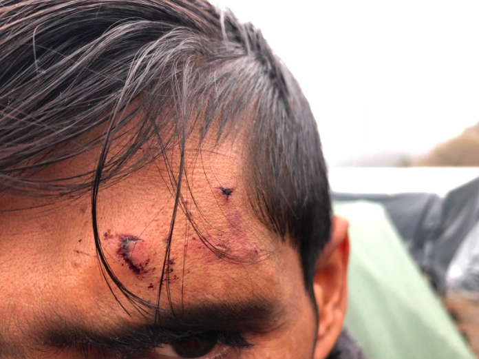
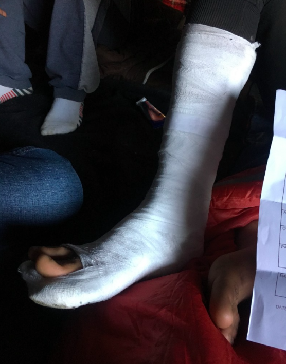
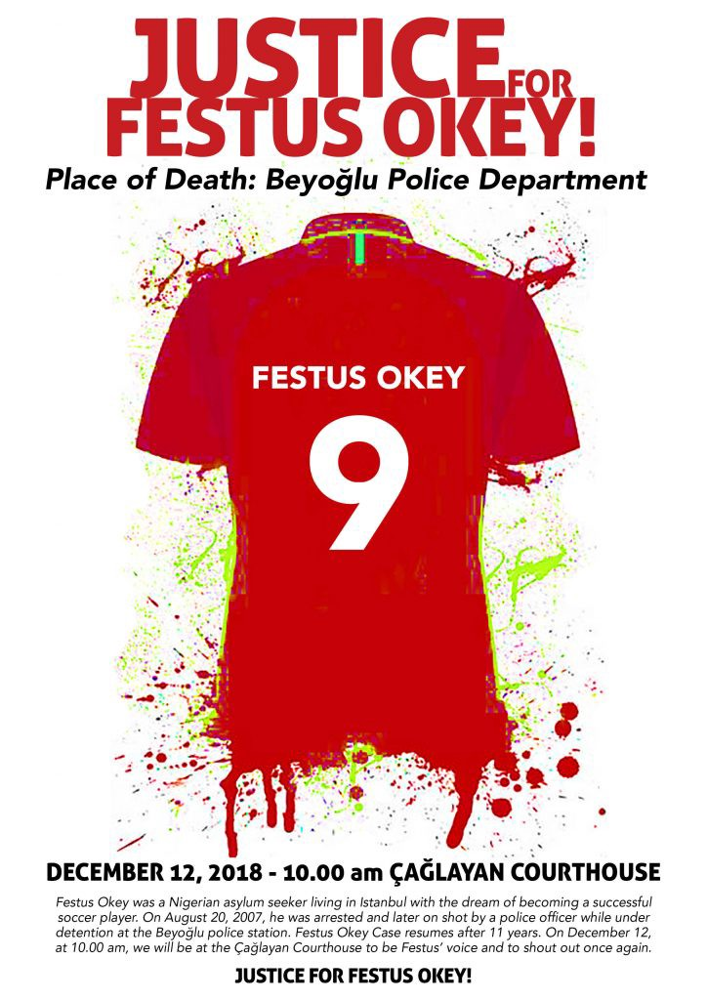
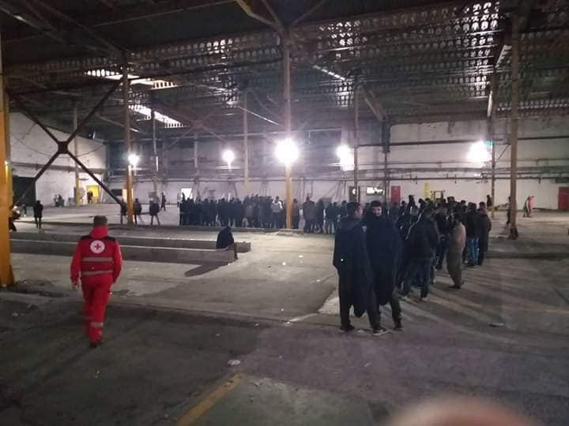
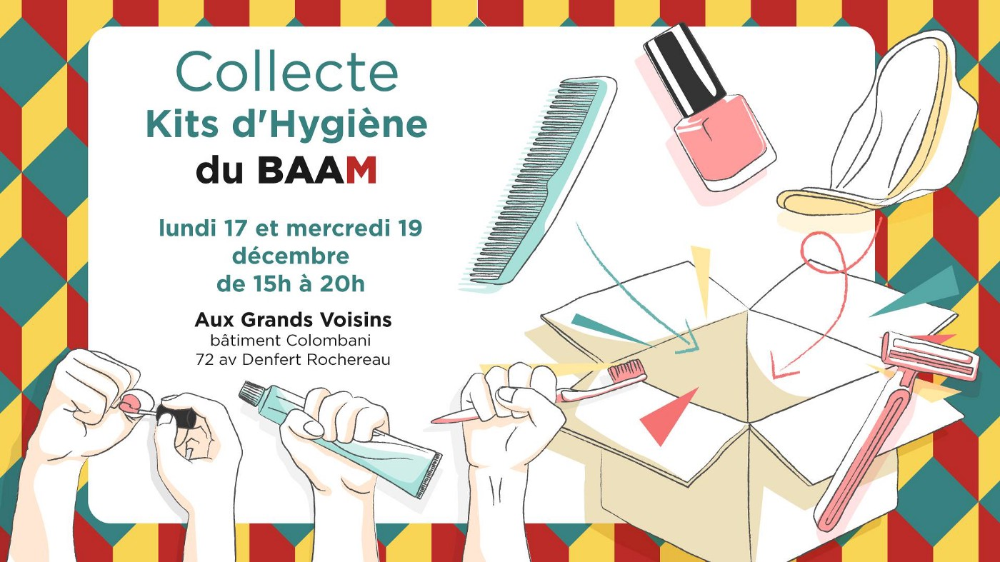

### AYS Daily Digest 06/12/18: Another month of brutality on the Balkan borders

[Are You Syrious?](https://medium.com/@AreYouSyrious?source=post_header_lockup)

Dec 7

_Demonstration for Festus Okey // NGOs demand end to detention in Aegean // Volunteers needed on Samos // Report on Greek mainland camps // Asylum interviews backlogged till 2023 // Deportations in Germany // Winter needs in Paris // Italian police take breakfasts // And more news…_
### FEATURE: November report on border violence

Photo NNK

This past month Croatian and Slovenian police broke people’s ribs, beat people with truncheons, shocked them with electric batons, smashed cellphones, forced people to walk through water in the freezing cold, handcuffed people in the back of vans and knocked them against the walls, shot guns in the air near groups of terrified people, and even set up trip wires which they chased people into\.

These are just some of the incidents documented in a [monthly report](november-illegal-push-backs-and-border-violence-reports-d5494997a456) on violence and illegal push\-backs on the Croatian\-Slovenian\-Bosnian borders published by AYS this week\. Information was compiled by solidarity workers with No Name Kitchen, SOS Ljuta Krajina, and the Balkan Info Van\. Twenty one violent push backs were documented in November with hundreds of victims\. The report is very detailed, featuring photo evidence, first hand testimony from each attack, the approximate location of where the incident took place, and descriptions of the perpetrators\.

There is a disturbing pattern to these push backs\. Refugees are taken to the border in vans, typically at night\. After they are dropped off in Bosnia or right on the edge of the border, they are beaten by police officers\. In most of the incidents the police were wearing black ski masks, or otherwise obscuring their faces by shining flashlights in the faces of their victims\. In the majority of cases the victims described being forced to walk through some type of gauntlet where they were hit, kicked, and beaten with truncheons by police standing in a line\. Many people described being mocked by the police as they were attacked\. A young Syrian man named Hamoud described how the Croatian police laughed while beating him and his companions:

_“The worst thing is that they are insulting us, they start laughing and make jokes when they are starting to beat us…In this moment, you start to feel that you are not even human\. You just try to escape, just to run and go and then they make you fall down again and start beating you\.”_

“ _“At the border, they were shouting at us: “Go, go, go, go\!” and beating us by batons\. Open car and one by one, pa pa pa pa by baton\. I fell and broke my leg\.” Photo Credit: NNK_

Another man recounted being told by Croatian police that they were going to kill him before he was taken out of van and beaten by a group of six officers\. At the end of his ordeal he had to get through one officer he described as “very big, like a professional boxer,” who punched him repeatedly in the kidneys\.

> “When we cry, they laugh\.” 

One young man named Houmam, who had attempted the border crossing before and been beaten, despaired that he would eventually have to return to Syria where he would be forced to fight for Assad\.

_“If I have no problem in Syria, I would not go to Europe\. I have everything I need in Syria\. Just there is a war, and that is the problem\. But maybe I don’t want to go to Europe anymore, I will go back to Turkey and from there to Syria\. Police is very dangerous here because they treat me like I am dangerous, but I am not dangerous\. But if I go back to Syria, I will have to join Assad’s army and yes, I will be made dangerous\.”_

There were also many instances of police abusing minors, and rejecting claims that anyone was under 18 in the groups they pushed back\. However, in one instance the victims described that the police only beat the people who appeared to be over 18 years old, so perhaps there is some hope for child protection in Croatia\.

When will the EU wake up to the abuse being committed by Croatian and Slovenian authorities? The brutality of Croatian and Slovenian border police is not only ignored, it is even praised in some corners\. Now\-former US attorney Jeff Sessions [visited Croatia](https://www.total-croatia-news.com/politics/28554-sessions-praises-relations-with-croatia) in May of this year, where he discussed migration with Croatia’s Interior Minister Davor Božinović\. Sessions praised Croatia’s border police, who he said were preventing “criminals and terrorists” from entering the country\.

As right\-wingers stoke fear about Muslim terrorists, they ignore the men in black uniforms and masks who are already terrorizing people in the EU — the border police\.

A cell phone destroyed in an incident of border violence on 24/11/18\. Photo Credit: NNK

_“When my brother asked if they could give us our mobiles back, the Croatian police man pulled his gun out and placed it to the head of my brother\. They just said to us to go back to Bosnia”_ \(Bizhan, 16 years old\. \)

Read the full report here: [**_November — Illegal Push Backs and Border Violence_**](november-illegal-push-backs-and-border-violence-reports-d5494997a456)
### SYRIA

■■■■■■■■■■■■■■ 
> **[The Syria Campaign](https://twitter.com/TheSyriaCmpgn) @ Twitter Says:** 

> > THREAD: 1,230 refugees returned to Syria from Lebanon today. Lebanese General Security reported that @[UNHCRLebanon](https://twitter.com/UNHCRLebanon) was present for the operation. Can UNHCR do anything to protect these refugees after today? The answer is no. 

> **Tweeted at [2018-12-06 16:52:43](https://twitter.com/thesyriacmpgn/status/1070722718050512899).** 

■■■■■■■■■■■■■■ 

■■■■■■■■■■■■■■ 
> **[The Syria Campaign](https://twitter.com/TheSyriaCmpgn) @ Twitter Says:** 

> > And UNHCR’s presence isn’t just a signal to Syrian families. It’s also a signal to the international community that Syria is safe and ready for return. But it’s not. People continue to be detained and forcibly disappeared by the Syrian regime 

> **Tweeted at [2018-12-06 16:52:44](https://twitter.com/thesyriacmpgn/status/1070722719631720449).** 

■■■■■■■■■■■■■■ 

■■■■■■■■■■■■■■ 
> **[The Syria Campaign](https://twitter.com/TheSyriaCmpgn) @ Twitter Says:** 

> > What’s to stop countries everywhere, including European ones, from saying - well if UNHCR says it’s okay then why shouldn’t we return the Syrian refugees we’re hosting? 

> **Tweeted at [2018-12-06 16:52:44](https://twitter.com/thesyriacmpgn/status/1070722720411865095).** 

■■■■■■■■■■■■■■ 

### TURKEY
#### New trial date set for Turkish officer who killed Nigerian man

In August of 2007 a Nigerian asylum seeker named Festus Okey was shot and killed by a police officer in the Beyoğlu police station\. Following the killing, there were a number of irregulaties in the case, including the disappearance of Okey’s blood\-stained shirt, which would have established crucial evidence\. In 2011, the officer who killed Okey was convicted on the lesser charge of manslaughter, and sentenced to four years imprisonment\. Yet the officer never served time, and the court became entangled in a debate over Okey’s identity\. But how does a confusion over identity excuse a murder, or change the facts of this case?

Recently, Istanbul’s 21st High Criminal Court has re\-opened the case, and announced a start date of December 12th\. Migrant and refugee solidarity groups are calling for a demonstration on the day of the trial at the Çağlayan Courthouse to demand justice for Okey\.

#### Rain destroys fence on Bulgarian\-Turkish border fence

It seemed that the rainfall acted in solidarity on the Bulgarian\-Turkish border, when heavy fortified border fences were knocked down in a storm today\. The fence collapsed in areas of Malko Turnovo on December 6th, according to officials\. This is the second time the fence has collapsed due to rain\.

The Bulgarian government began construction on the fence in 2013, in response to Syrian refugees passing through the country\. Since it began, the project has been widely criticized as a waste of taxpayer money, coming in at a hefty 650,000 Euro per kilometer\.

According to Bulgarian officials, there will be increased police presence in the areas until the fence is repaired\.
### SEA
#### Aquarius forced to end search and rescue mission

SOS Mediterranee and MSF announced today that they are suspending their operation with the SAR ship Aquarius\. In a press release they explained that they were compelled to end their mission because of the increasing criminalization of sea rescue\.

“This is a dark day,” [said MSF’s general director Nelke Manders](http://Nelke Manders,) \. “Not only has Europe failed to provide search and rescue capacity, it has also actively sabotaged others’ attempts to save lives\. The end of Aquarius means more deaths at sea, and more needless deaths that will go unwitnessed\.”

Salvini’s policy of turning away rescue ships with refugees, coupled with the repeated prosecution of rescue workers by Italy and Malta has made it very difficult for rescue groups such as SOS Mediterranee to do their work\. As SAR ships are driven out of the Mediterranean, the journey from Libya has become more perilous\. An estimated 2,133 people have drowned trying to cross the Mediterranean this year, with the majority of victims hailing from Libya\.

The Aquarius and other SAR ships have frequently clashed with Italian officials over their refusal to take people back to Libya\.

According to MSF, the Aquarius rescued nearly 30,000 people in international waters between Libya, Italy, and Malta since the start of its search and rescue mission in February 2016\.

The group is trying to return to the SAR zone with a new ship as soon as possible\. Tomorrow at 10:30am they will give a press conference in Paris\.
### GREECE
#### New arrivals \(numbers via Aegean Boat Report\)

A boat arrived on Chios before midnight on 5/12\.
There were 54 people on board, 22 children, nine women, and 23 men\.
#### Open the islands

An [open letter to Greek and EU authorities](https://www.hrw.org/news/2018/12/06/greece-eu-move-asylum-seekers-safety#) was published today, demanding that Greece end its cruel policy of detaining people on the Aegean islands and transfer people off the island camps\. The letter was signed onto by 20 human rights and advocacy groups, including Human Rights Watch and Amnesty International\. As the letter noted, the weather is turning for the worse and the Greek authorities alongside UNHCR are once again unprepared to meet people’s most basic needs\. If the situation does not change it is likely that people will die from exposure to the elements, or from asphyxiation while trying to warm themselves in tents, as has happened in previous years\. From the letter:

> Greece, with the support of EU institutions and countries, should end its inhumane containment policy and facilitate the transfer of asylum seekers from the Aegean islands… The Greek and European authorities should show genuine, humane leadership in addressing the deplorable conditions for the people trapped on the Greek islands\. Women, men, and children seeking protection in Europe should be treated in accordance with their rights and not be forced to spend another winter in squalid and unsafe camps\. 

■■■■■■■■■■■■■■ 
> **[Tdh Europe](https://twitter.com/TdhEurope) @ Twitter Says:** 

> > On Greek islands, over 12,500 people still live in tents &amp; containers unsuitable for winter. 

We urge the Greek gov't &amp; #EU to move to dignified shelter or relocate to other countries all #AsylumSeekers. 

👉[tdh-europe.org/news/greece-eu…](http://tdh-europe.org/news/greece-eu-move-asylum-seekers-to-safety/7403) 👈 #OpenTheIslands #RefugeesGr #HumanRightsDay https://t.co/VDamyQqs2N 

> **Tweeted at [2018-12-06 12:21:05](https://twitter.com/tdheurope/status/1070654359871152128).** 

■■■■■■■■■■■■■■ 

No Borders Kitchen on Lesvos needs more people to help with their crew\. They are asking that only people who are familiar with self\-organized and autonomous groups [contact them](https://www.facebook.com/NBKLesvos/?__tn__=%2CdkCH-R-R&eid=ARCwkbVPl_1i3TMk1fyyAicA_W4iDUli7nCyCVgVk6IhwyWmLaDpORo25jfeEMLXlFfD8lwdLOhGwXQt&hc_ref=ARRAyyBTpw1fFRTT1wu_S4QiAUXY95kBtcsewe1yrh6J17Il7ph4tjhPJWFs_AmNNcU&fref=nf) \.
#### Volunteers needed on Samos

 this past weekend for a Vaccination Campaign in the camp 💉 Children aged 6 months to 16 years old could get the MMR vaccine \(Measles, Mumps & Rubella\), key not only to their health, but to their enrolment in Greek public school\.”](assets/1b0045ee03a1/1*VgcbFB2p7cf-vmHUNyvutA.jpeg)

Photo Credit: Samos Volunteers\. “We partnered up with [Médecins Sans Frontières](https://www.facebook.com/medecinssansfrontieres/?__tn__=%2CdKH-R-R&eid=ARDyVakuQV9TNVDc3ngL8eNQBp6JtewF5HAYtj6plEWtvvZbnGuiq7LRJMsS1QHC1UUP4691_Up3-BX3&fref=mentions) this past weekend for a Vaccination Campaign in the camp 💉 Children aged 6 months to 16 years old could get the MMR vaccine \(Measles, Mumps & Rubella\), key not only to their health, but to their enrolment in Greek public school\.”

As AYS has reported this week, conditions on Samos have reached new lows\. An estimated 5,000 people are living in a filthy hillside camp originally intended for 700\. Most of the people are living in summer tents that are totally unsuitable for the cold weather and frequent rain\. There is a need for more volunteers at the moment, especially people who have prior teaching or volunteering experience, and are willing to make a long\-term commitment\. People who are interested can apply through [Samos Volunteers](https://samosvolunteers.org) , which provides basic aid and facilitates classes for adults, or [Still I Rise](https://www.facebook.com/stilliriseNGO/) , a children’s education center on the island\.

Those with medical and nursing experience should contact the [Med Equaliteam](https://medequali.team) , the only medical group with a continuous presence on the island\. With only one doctor for the entire camp, medical volunteers are direly needed\!
#### Remote mainland refugee camps unprepared for transfers from Aegean Islands

There is undoubtedly an urgent need to transfer residents of overcrowded and under\-resourced camps from the islands to the mainland, as a number of NGOs declared today\. However, we must not allow this to happen without scrutiny of the conditions of the places to which people are being moved\. The reality is that many people are not being transferred into UNHCR flats but rather to camps on the mainland\. These are often in remote locations far from Athens where the asylum offices and services are\. These camps, which already see thousands living in squalid, secluded, and forgotten conditions are sure to get worse as the numbers of people transferred increases\. NGOs are often not allowed into the camps; needing explicit permission from the municipality which is not easily gained\. These moves threaten to hide the problem rather than solve it as media attention remains focused on the islands, namely on the Lesvos camp of Moria\.

Sources who have visited the Malakasa camp say that preparations have been made for the extra arrivals — approximately 800 people — due to arrive from the islands\. However, the only preperations made were a few extra containers placed in the camp, without any improvement of the provision of food or medical services\. With these extra people the number of residents will almost double to around 2,000\.

Likewise, sources familiar with Oinofyta camp where the residents — including a large number of children — live in an old factory with internal hardboard walls, leaking ceilings, and overflowing toilets, have recently seen hundreds more arrivals due to the island transfers\. Both these camps are over an hours drive away from Athens\.

These are not temporary conditions\. Asylum procedures are taking longer and longer as Greece struggles with the number of people trapped within its borders — increasingly interview dates are given as far away as 2023 \(see below\) \. People are expected to wait out the remainder of their asylum applications in these conditions where there is little or no access to legal aid, whilst their transfer is sold as a positive move\.

We must not let this go unnoticed\. AYS will follow this up with a feature on the camps shortly\.

_\(This statement was written by an AYS team member in Athens\. \)_

_See our previous special on life in one of the remote refugee camps on the Greek mainland — [**Oinofyta Camp: The overwhelming sense of nothingness**](ays-special-oinofyta-camp-the-overwhelming-sense-of-nothingness-c37d4037a65)_
#### Greek asylum interviews backlogged for years

When refugees apply for asylum in Greece, they are often being given interview dates for 2020, and even up to 2023\. According to the Greek asylum service \(GAS\), there aren’t enough caseworkers to handle the number of claims\.

According to GAS, there is no need to speed up the process because refugees now have “full access to health care” in Greece, even without a social security number \(AMKA\) \. The refugee\.info group posted the following advice for refugees in Greece: “If you have serious health issues and have documents to prove it, you can ask for an earlier interview date with the help of a legal NGO\. However, it is very unlikely that you will get a positive answer\.”

See [refugee\.info](https://www.facebook.com/refugee.info/photos/a.1063678090359004/2041980315862105/?type=3&theater) for this story in Arabic, as well as more information on how to apply for your health care without an AMKA card\.

[Message from](https://www.facebook.com/481351218685655/photos/a.578873295600113/1177121155775321/?type=3&theater) the Greek Asylum Service: The Regional Asylum Office of Athens, on Saturday, the 8th of December 2018, will be accepting beneficiaries of international protection from 7:00 to 10:00, EXCLUSIVELY for the issue of travel documents \(TDV\) \.
### ITALY
#### Courageous riot police prevent refugees from receiving breakfast

Volunteers from [Baobab Experience](https://www.facebook.com/BaobabExperience/?__tn__=%2CdkCH-R-R&eid=ARBIennlhBj6PEpNlz6qga-u2KYkixHkSZocME3ozM3X3qX-5qDyyMWxcuwTpdHH1d5Z6Njf3i1VPq7b&hc_ref=ARQFjvUxj1tolgtwbe13PvNEG4u4i34TJIa5xZVgRDUTad4PjqtP3QLYbkobGPZNYSc&fref=nf) were giving out breakfast at the Tiburtina metro station in Rome this morning when the riot police showed up\. In the spirit of Christmas, the police decided to stop the distribution of hot food and proceeded to harass the refugees there, detaining six of them\. They also seized some “dangerous” blankets, according to a statement from the group\. As Baobab noted, many of the people who were waiting for breakfast are refugees who are now living homeless after having been evicted from the “Baobab camp,” which was set up in an empty lot in the capital\.

](assets/1b0045ee03a1/1*8VJfydjZaQ54ddbQ2TcbEA.jpeg)

Italian police clearing out the breakfast distribution\. Photo Credit: [Baobab Experience](https://www.facebook.com/BaobabExperience/photos/a.855775474499206/1944836718926404/?type=3&theater)

The group declared their intention to continue with food distribution, and to demonstrate solidarity with refugees and migrants in Italy despite this harassment\.

> From tomorrow we will resume serving breakfast at Piazzale Spadolini and all the other necessary services that we intend to continue to perform until everyone is welcomed to the last migrant\. 

> That is why we also ask for the solidarity of all with support tomorrow morning at 7\.30, and every day onwards to ensure breakfast\. We will also be there on Saturday at 12 to lunch together\.
 

> [https://www\.facebook\.com/events/344063949716126/?ti=as](https://www.facebook.com/events/344063949716126/?acontext=%7B%22action_history%22%3A%22null%22%7D&__tn__=KH-RR1%5D-R-R&eid=ARBIHfRSVsmQ1O_FeAdOe0Ii71ymPJCuI3qNuWeZmLIVu50lu6zHxF9h5Kxm_KaDQv2Z8N7hyJpVpqQy&__xts__%5B0%5D=68.ARAewWgXhNEoN7Y6OGqiZuR1FHjyYja4bAOxGVrbrAu_xgYBSHjdcf-PFvtfbCiRG1v9ihbwdzSD447kRqrmjAI9i6fy96fU6tLdOpbTZ1UyK1udZwhgL3AMMlE9RehBMTJDfmKdym4zEcUYww6a8nOZCUb-BBaiXyOgzADnUtcu3r_2j5kKR1OKEMePBFGvye9YCgHYt9TlCD5SXu5mVAHrLEEilDdIYf2GLYjTHQ) 

### BOSNIA

Photo Credit: Red Cross Bihac

A solidarity group shared some photos taken by the Red Cross of Bihac today\. While the Red Cross and IOM often take photographs to highlight their supposedly good efforts, this photo shows how unacceptable the accommodation provided by them often is\. This particular “accommodation space” is an asbestos\-ridden former factory, which is unheated\. As the group [Along the Balkan Route](https://www.facebook.com/lungolarottabalcanica/?__tn__=%2CdkCH-R-R&eid=ARDZev1swCp5I6O_7_LFw0ZXXKiWuN7BlDbmGVkgfl0IJLVqX9is9zITtO8lSqzHxq5GqeuCJho9_Ycb&hc_ref=ARR2DRhnQynHJaMRK6cJQBoKXng1KkCwQoKDQAujkqlW4gBa73384EwGfTt-DMDaUDU&fref=nf&hc_location=group) wrote, “the creation of \[these spaces\] is not dictated by emergency but by a strategic approach that seeks to make people invisible\.”
### BALKAN WEATHER REPORT

_\(FOR 07/12\)_
#### MONTENEGRO

Predominantly sunny and moderately cloudy at high altitudes, fog and clouds at low altitudes during the morning in the north parts of the country\. The wind will be weak to moderate and changeable\. The lowest temperatures between — 8 to 6 and highest daily from 5 to 16 degrees\.
#### SERBIA

In the morning it will be cold whit moderate frost at some places\. During the day moderately cloudy in most parts of the country, in the north chance of rain\. The wind will be weak to moderate blowing from the south and southwest\. The lowest temperatures between \-7 to 0 and highest daily from 5 to 10 degrees\.
#### BiH

In most parts of the country, predominately sunny and lightly to moderately overcast\. Fog alongside the rivers and in the basins\. In the afternoon and during the evening it wil become more cloudy\.The wind will be weak from he south and southwest, also weak Bura in the morning\. The lowest temperatures will be from \-3 to 8 and highest daily from 7 to 14 degrees\.
#### CROATIA

Partly sunny and warmer, with fog in the morning, from land inwards\. In the afternoon it will become more cloudy, and in the evening there is chance of rain in some parts of the country\. The wind will be weak to moderate from the southwest, at places strong, and alongside the northwestern wind turning into a stronger south\-western and southern wind\. The lowest temperatures will be from \-3 ono 9 and highest daily from 8 to 16 degrees\.
### GERMANY

On December 4th, 14 people were deported to Afghanistan from Germany\. According to the German advocacy group [Flüchtlingsrat Sachsen](https://www.saechsischer-fluechtlingsrat.de/en/) , the people who were deported were not guilty of any criminal offense, but were subject to deportation because they had made false statements about their identity\. As the group pointed out, such offenses cannot justify deportation to a war zone\. Despite widespread in the country, European countries including Germany continue to deport refugees back to Afganistan\. There have been multiple instances of people being threatened, assaulted, and killed after being deported to Afghanistan\. In September of this year, a 47 year old father [was murdered by the Taliban](https://www.independent.co.uk/news/uk/home-news/zainadin-fazlie-deport-home-office-taliban-afghanistan-shot-dead-refugee-a8536736.html) in Kabul after being deported from the U\.K\.

The city of Potsdam signed onto a collective agreement endorsed by over 25 municipalities pledging to accommodate more refugees than stipulated by the German distribution scheme\. This pledge was created to show support for the Sea Rescue Initiative [Seebrücke](https://www.facebook.com/SeebrueckeSchafftsichereHaefen/?__tn__=K-R&eid=ARBq1pGyasoMbRTkKKLwmSy0Y9CZ4_C7LFelBGfZ1aOiPhZzKruRj7TqDV_67_YGbm_PjjtL1MLo0hQr&fref=mentions&__xts__%5B0%5D=68.ARCWtPlbWVN6GX0PYaHBg4Cx4IGJDq5ksWIGwXGqibW9BHfmsLkld2MR7zoTGiZfg5t_4WpYAqJn0RL6_Hzc8kCdTX59nP-JnLU3iMS50wBKtWrLeHBSOqPsFSvA4mJXLX2gBxJhNeVdGLueUuWFEYhAzFXX-jH53TM5y5nlzGGlOdHWgo6qBVNIesGP3i2XAhv5OFVdiXto088vIeuoM2Qf5CK4Z7GzzZxgkCtKCVGr5kAVuq_6Qe2esF5DlY3_yloQ6h_geqc2nP9OpLqON0hzhAFvJEhY-ZJM6xtK6HdZJ_N9XvX2q8G9PrguptDQL3NFQD9SfMG0h0JKhfFaIjYvrWef) \.
### FRANCE

A French volunteer group helped provide cleaning supplies and trash bags to a group of refugees who were sleeping rough\. They posted [a video](https://www.facebook.com/calaisaction/videos/515385395611191/) of the final result, dozens and dozens of completely full trash bags\. Prior to the clean up, the municipal trash service refused to go to the area because it was “too dirty\.”

BAAM is organizing a collection point in Paris for hygeine items on the 17th and 19th of December\. Find details below\.

Solidarity Migrants Wilson is also organizing a winter item collection in Paris\. It will be at Decathlon Rosa Parks, 203 Boulevard Macdonald, 75019 Paris on Friday the 7th and Saturday the 8th from 10am to 6pm\. See more details [here](https://www.facebook.com/permalink.php?story_fbid=1035381403329298&id=598228360377940) \.
### UK
#### UK tribunal decides some refugees in the country may be ineligible for deportation to Italy

In the UK, under the Dublin procedures, refugees can be immediately deported to any EU country if evidence is found that they had been there previously\. However, part of this law is now in question due to a recent legal decision\. In a case brought by the UK legal advocacy group [Right to Remain](https://righttoremain.org.uk/some-dublin-removals-to-italy-may-breach-article-3/?fbclid=IwAR2cCTK4pDUuKXBL3hkK19V8cL4pG2Q8zCfMn6fGRZgurDYIX86w1pjAtOw) , the tribunal determined that two out of three refugees who were scheduled for deportation could not be sent to Italy\. Their ruling was based on Article 3 of the European Convention on Human Rights, which protects individuals from being subjected to torture, inhumane, and degrading treatment\.

As one of the lawyers for right to remain pointed out, “the evidence before the Tribunal in this judicial review predated the latest Italian government’s anti\-migrant policies\.With that unhappy development, and with the findings in this test case, lawyers are in a strong position to argue against Dublin removals to Italy in the case of vulnerable individuals\.”

This ruling confirms what is obvious to anyone familiar with the situation for refugees in Italy — just because it flies an EU flag does not mean that it is “safe”\! While this case may not affect a great number of people, it is a step in the right direction to slow down out of control deportations from the UK\.

> The details of the individuals may be helpful for others to see if their situation is similar, and therefore potentially could benefit from this case\. You can read the full case [here](https://2h12ms1eq7wnva373scllpi9-wpengine.netdna-ssl.com/wp-content/uploads/2018/12/SM-Ors-judgment-4.12.2018.pdf) \. 

We also publish a **weekly overview in Arabic and in Persian** of some of the most important stories we covered during the previous week\. 
Please, share it with your Arabic and Persian speaking friends\. 
Here is last week’s **Arabic version: [خلاصة الأسبوع \(ا\.ي\.س\) عمليات الاحتجاز والترحيل في المانيا](%D8%AE%D9%84%D8%A7%D8%B5%D8%A9-%D8%A7%D9%84%D8%A3%D8%B3%D8%A8%D9%88%D8%B9-%D8%A7-%D9%8A-%D8%B3-%D8%B9%D9%85%D9%84%D9%8A%D8%A7%D8%AA-%D8%A7%D9%84%D8%A7%D8%AD%D8%AA%D8%AC%D8%A7%D8%B2-%D9%88%D8%A7%D9%84%D8%AA%D8%B1%D8%AD%D9%8A%D9%84-%D9%81%D9%8A-%D8%A7%D9%84%D9%85%D8%A7%D9%86%D9%8A%D8%A7-6804834bae5b)** 
and **Persian: : [خبرهای هفتگی آر\. یو\. س: بازداشتگاه‌ ها در سه منطقه ی آلمان](%D8%AE%D8%A8%D8%B1%D9%87%D8%A7%DB%8C-%D9%87%D9%81%D8%AA%DA%AF%DB%8C-%D8%A2%D8%B1-%DB%8C%D9%88-%D8%B3-%D8%A8%D8%A7%D8%B2%D8%AF%D8%A7%D8%B4%D8%AA%DA%AF%D8%A7%D9%87-%D9%87%D8%A7-%D8%AF%D8%B1-%D8%B3%D9%87-%D9%85%D9%86%D8%B7%D9%82%D9%87-%DB%8C-%D8%A2%D9%84%D9%85%D8%A7%D9%86-eff619e8ee0d)**

**We strive to echo correct news from the ground through collaboration and fairness\.**

**Every effort has been made to credit organizations and individuals with regard to the supply of information, video, and photo material \(in cases where the source wanted to be accredited\) \. Please notify us regarding corrections\.**

**If there’s anything you want to share or comment, contact us through Facebook or write to: areyousyrious@gmail\.com**

_Converted [Medium Post](https://medium.com/are-you-syrious/ays-daily-digest-06-12-18-another-month-of-brutality-on-the-balkan-borders-1b0045ee03a1) by [ZMediumToMarkdown](https://github.com/ZhgChgLi/ZMediumToMarkdown)._
