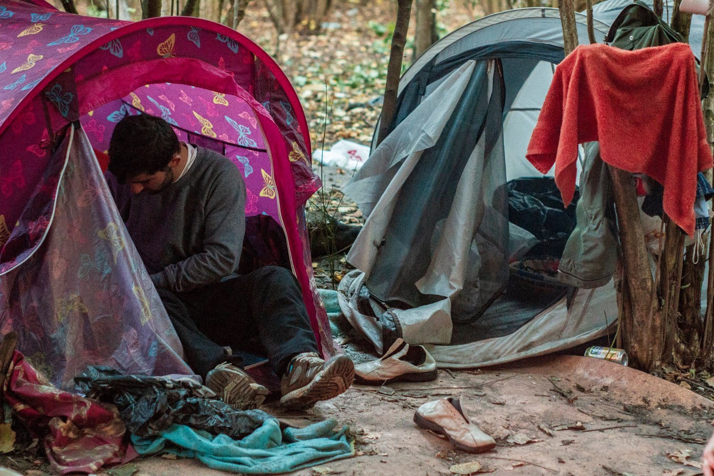
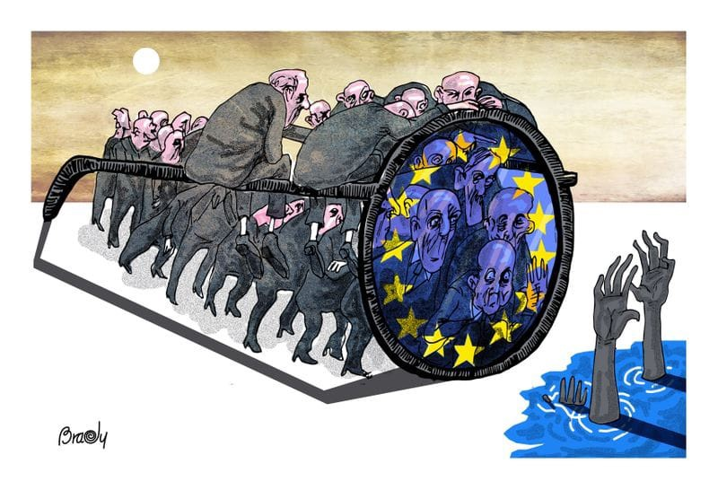
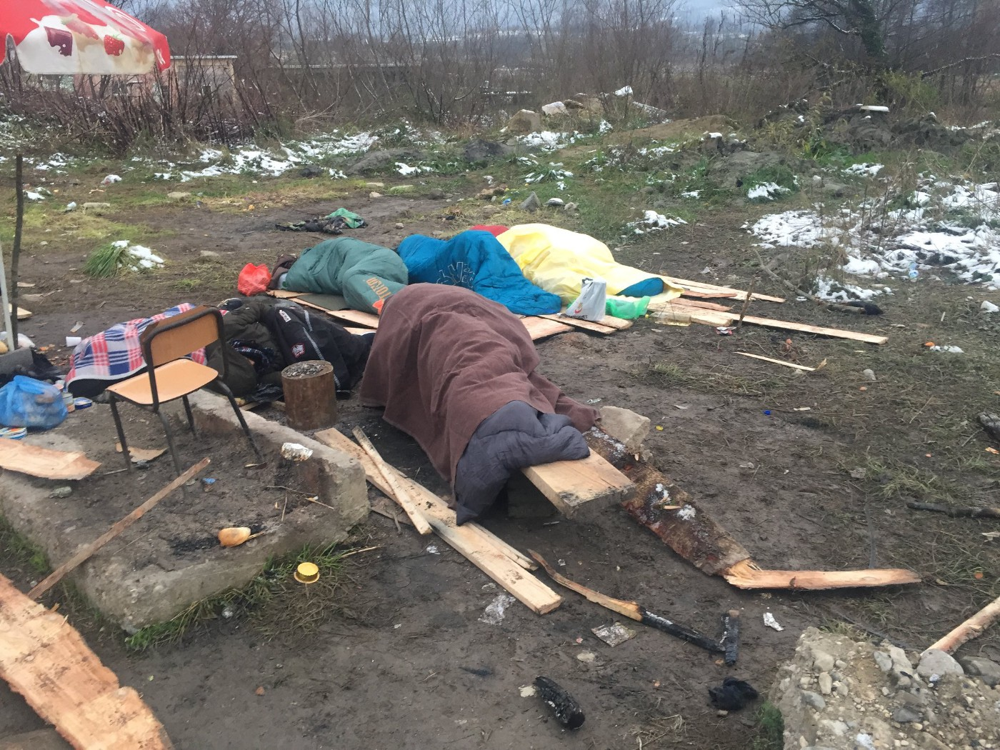
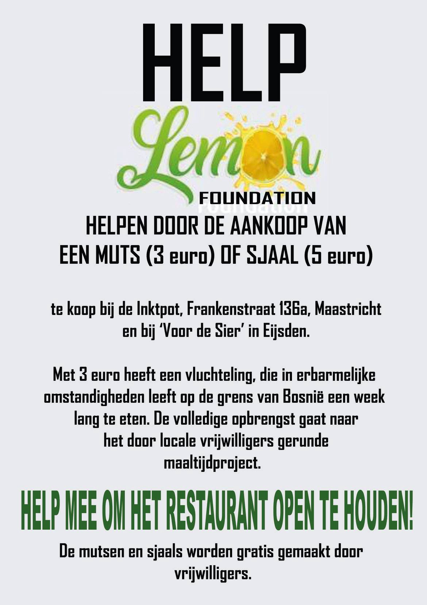

### AYS DAILY DIGEST 7/12/2018: Frontex in the Balkans?\!

_Above 70 percent of people in Yemen do not have enough food // Forced returns of Syrians from Lebanon // UNHCR to open centre in Tripoli together with the government // Strengthening of the FRONTEX mandate // Single men discriminated against at registration in Belgium // Bosnian police continues unlawful internal push\-backs // More people going back from Bosnia to Serbia due to lack of decent accommodation // Despite all the difficulties, solidarity still lives in Bosnia_

This photo is from France, but could be Belgium, Bosnia, Serbia, Greece, Italy… anywhere in Europe where basic human rights of the people on the move are neglected\. Photo by Help Refugees\.
### FEATURE

**This week, the leaders discussed how to continue with the fortification of the European Union\.** They reached several important decisions\. The first one is about “ [cracking down on migrant smuggling](https://www.consilium.europa.eu/en/press/press-releases/2018/12/06/migrant-smuggling-council-approves-a-set-of-measures-to-fight-smuggling-networks/?fbclid=IwAR2KfOCTLlHmyT80f87JS0R2Bx9aHN0cJn6EVLw1EAjFyXTC2kVlIj7Kpfc#) ”\.

The European Council approved _“a comprehensive and operational set of measures with a law enforcement focus to step up the fight against migrant smuggling networks”\._

How and if this will have any effect on saving people’s lives remains to be seen in the future\. From what can be read from the press statement, it does not look like Europe is becoming a more open and more friendly space \- except for the rich and powerful\.

At the same time, the EU leaders considered “ _return policy and its cooperation with third countries as part of its comprehensive approach to migration”_ \.

The conclusion is that Frontex will have a “ [stronger mandate](https://www.consilium.europa.eu/en/press/press-releases/2018/12/06/european-border-and-coast-guard-council-reaches-partial-agreement-on-returns-and-cooperation-with-third-countries/?fbclid=IwAR0U_YhkYa_MvTuofgngZBdip0A1oRNPQAGCrkzfXhwVcW6UcJ5SffjHcbM) ”\.

> “The proposed rules will allow Frontex to provide technical and operational support to member states in return operations\. The agency will provide support at the request of the member state concerned or on its own initiative and in agreement with the member state concerned\. The support will cover all areas of return, from preparatory activities to return, post\-return and post\-arrival activities\. It also includes assisted voluntary return\. 

> The agency will also be able to assist member states in the identification of third\-country nationals and the acquisition of travel documents\.” 

The “strengthening cooperation with third countries” means that they will be able to deploy troupes of border management officers and return teams from Frontex for operations in the territory of third countries\.

Serbia, Bosnia, Albania and other Balkan countries have either signed or are in the process of signing new agreements allowing more involvement of the EU border agency in supporting the management of the migration flow\. The public in these countries is largely unaware of what is written in these agreements, and all they asked from their government and the EU is to help stop the humanitarian disaster, especially in Bosnia, not to come and bring a force that will deport people and prevent them from exercising freedom of movement\.

Additionally, the Council concluded that Frontex will also be able to _“deploy experts as liaison officers, who will form part of the local or regional cooperation networks of immigration liaison officers and security experts of the EU and the member states\. Priority will be given to the deployment of liaison officers in countries of origin and transit\.”_

Migratory myopia\. By Brady Izquierdo Rodríguez
### YEMEN

**There are around 20 millions Yemenis, or over 70 per cent of the population, living above the food security crisis threshold,** according to the Integrated Food Security Phase Classification \(IPC\) of 6 December\. Of those, 9\.8 million people have been categorised as being in an emergency situation, and 250,000 face a catastrophic situation \(the direst IPC classification\) \.

Food insecurity results from the ongoing conflict, the lack of affordability of food items due to the economic crisis and the absence of income/payment of civil servant salaries, all of this far away from the media around the world\. At the same time, people from Yemen are trying to reach safety in Europe, but often end up being stuck in the Balkans, for example in Bosnia, where the Croatian Border Patrol continues with violent pushbacks of all the people, including people from countries like Yemen where living is impossible\.
### SYRIA

**When it comes to Syria,** where the situation has not improved much and where people are still running away, **international lawyers are trying to open war crimes cases\.** One war crimes prosecutor, who was involved in the prosecution of war criminals from the Balkans, told the media that the evidence of war crimes in Syria is the strongest since Nazi war crimes in World War II\. He believes that there is a possibility that the ptosecution of President Bashar al\-Assad is inevitable\.

At the moment, the Commission for International Justice and Accountability \(CIJA\), is working with Syrians in the country gathering evidence\.

It is again time for the broader international community, as well as for Syrians, to look back into the records of war crimes prosecution in the Balkans, to see the good and bad sides, and to explore ways of dealing with the past\.
### LEBANON

**According to the [Syrian Observer](https://syrianobserver.com/EN/news/47348/lebanese-security-forcible-returns-refugees-to-syria.html) , Syrian refugees in Lebanon are being tricked by the Lebanese security into promising to return but instead they are arrested and handed over to the Bashar al\-Assad regime\.**

“ _The Syrian Center for Legal Studies and Research said that the raids had affected the Arsal region in northern Lebanon, with about 750 Syrians arrested, including women and children and entire families,”_ the Syrian Observers reports\.
### LIBYA

**UNHCR has opened a new facility in Tripoli which is supposed to offer a safe alternative to detention for people who are waiting for resettlement or evacuation\.** The centre has been set up in coordination with the Libyan government\. Apparently, vulnerable people will be brought here and it will be managed by the Libyan interior ministry, UNHCR, and UNHCR’s partner LibAid\.

The aim is not to really help people who are put in life\-threatening situations in Libya, but rather to “offer viable alternatives to the dangerous boat journeys along the Central Mediterranean route,” the UNHCR explains\.

It is estimated that at the moment there are 5,200 human beings detained in different centres across Libya, including 3,950 in need of international protection\.

Many of the people who survived detention in Libya, but also journalists and human rights activists, have reported several times that authorities in this country and smugglers are linked\. Looks like decision makers in the EU and the UNHCR do not read the news\.

■■■■■■■■■■■■■■ 
> **[Sally Hayden](https://twitter.com/sallyhayd) @ Twitter Says:** 

> > A 28 year old detainee says he didn't know MSF was doing rescues in the Mediterranean at all. He also thinks his only option for getting out of Libya is paying smugglers to try the sea again. https://t.co/ydBK4xLA4y 

> **Tweeted at [2018-12-07 19:17:59](https://twitter.com/sallyhayd/status/1071121662232412160).** 

■■■■■■■■■■■■■■ 

Journalist Sally Hayden reports about the living conditions of these people daily\. She spoke with several of the young detainees who told her about how dangerous it is for them to be in this country\. She also recorded that for people to leave Libya, smugglers ask from 1500 to 2500 dollars\.

One of the people she interviewed told her that people know the risks involved in going to the sea, but the alternative is waiting for months and months in detention\.

■■■■■■■■■■■■■■ 
> **[Sally Hayden](https://twitter.com/sallyhayd) @ Twitter Says:** 

> > Interesting that another detainee in Libya is saying most people trying to cross the Mediterranean didn't actually know there were rescue boats. He says they believe fishing boats can help them, &amp; most people still there have already tried once or twice now. https://t.co/WWOcCuA6RM 

> **Tweeted at [2018-12-07 21:25:33](https://twitter.com/sallyhayd/status/1071153765561061376).** 

■■■■■■■■■■■■■■ 

### GREECE

**Official data show that this year, over 29,500 people arrived in Greece by sea\.** Most of them are from Syria, Afghanistan and Iraq, while over half of the new arrivals are women and children\.

In November, slightly fewer people arrived on the islands — 2,075 in comparison to October, when 4,073 people arrived\.

Most of the people arrived on Lesvos, followed by Samos, the Dodecanese
islands, Chios and Crete\.

At the same time, the EU — Turkey agreement still lives and in November alone it allowed the return of many people\. Most of them are from Pakistan \(over 39 per cent\), but there is 19 per cent of Syrians, too\.

In total, 337 Syrians have been returned to Turkey to date\. Thirty\-six of them have been returned on the basis that their asylum claims were found inadmissible in the 2nd instance\.

Last week, the Council of Europe emphasized again the need for Greece to improve its law and practice on the prosecution of torture, [Redress reminds](https://redress.org/news/council-of-europe-torture-reform-needed-in-greece/) \.

The required reforms would provide greater access to justice for the victims of torture and ill\-treatment in Greece, particularly migrants and refugees\. Greece is a major point of entry for those trying to reach Europe\.
### BALKAN WEATHER forecast for Saturday 08\.12

**MONTENEGRO** 
Moderately to entirely cloudy, mostly dry in the morning, during the day rain from time to time, showers, in the south thunder, in the higher mountains in the north sleet and snow\. During the late afternoon sleet and snow are also expected in the lower regions in the north\. Towards the end of the day, precipitation will cease and it will clear up\. The wind will be blowing from the south, locally moderate to amplified, alongside the coast and in the north locally strong, during the afternoon turning into a northern and northeastern wind, getting stronger towards the end of the day, The lowest temperatures will be from \-2 to 9 and the highest daily from 2 to 15 degrees\.

**SERBIA** 
In the morning cloudy with rain in the south and west and during the day and in the evening in the south and east, while precipitation will stop in the north and west\. In the mountains, rain turning into the snow until the end of the day\. The wind will be weak to moderate from the south and southeast, during the day it will become stronger and turn into a western and northwestern wind\. The lowest temperatures will be from \-5 to 5 and the highest daily from 4 to 10 degrees\.

**BiH** 
Cloudy with rain, in the morning in Bosnia and before noon in other parts of the country\. In the mountains sleet and snow\. As the day progresses and the temperatures drop, rain will turn into sleet in eastern Bosnia\. In the afternoon precipitation will cease locally and during the evening in more parts of the country, it will also start clearing up\. The wind in Bosnia will be weak to moderate from the south and southwest and in Herzegovina a moderate to strong bura\. The lowest temperatures will be from 1 to 10 and the highest daily from 4 to 12 degrees\.

**CROATIA** 
Predominantly cloudy with occasional rain, abundant precipitation along the coast and sleet and snow inland in the mountains\. From the middle of the day onward, cessation of precipitation and partial clearing up\. Inland from time to time a moderate southwestern wind will be blowing, sometimes a northwestern and north\-eastern wind, and along the coast a moderate to strong south wind and southwestern wind turning into bura\. The lowest temperatures will be from 2 to 12 and the highest daily from 6 to 14 degrees\.
### BOSNIA

**The police in the Bihać area continues the unlawful practice of internal push\-backs\.** Since October, they have been preventing people from coming to this area, or arresting people in the streets of Bihać and just driving them out of the Una\-Sana Canton \(the administrative area of which Bihać is the capital\) \. This practice is racist and against all the existing laws in Bosnia, but so far none of the INGOs involved in helping people in Bosnia have tried to prevent this practice or even raise their voice against it in public\.

This is where people stay after police take them off buses or just drive them from Bihac\. Photo Red Cross Kljuc

At the same time, IOM and UNHCR are helping only to transport people who are brought to the area of Ključ or back to Sarajevo or, if vulnerable, to one of the camps around Bihać\. Very often vulnerable people wait for days for the transports\. There were four children who stayed out in the open for days\.

Those who come back to Sarajevo can go to the Ušivak camp, run by the IOM, or the Delijaš Asylum Center\. In the city, about 100 people are living in squats and with locals\. Luckily, people in Bosnia are still open\-hearted and trying to help as much as they can\.

In Velika Kladuša, most of the people have now been moved to temporary accommodation in the Miral factory and, at the moment, nobody is staying in the Trnovi makeshift camp\. However, people from Miral, but also people accommodated by locals or those who are living in squats, are coming to [Latan’s place](ays-special-locals-of-velika-kladuša-put-international-organisations-to-shame-5d4ba6b8eb2b) for food\. It is run by a group of locals and supported by the international volunteers from [SOS Team Kladuša](https://www.facebook.com/SOSTeamKladusa/) \. Around 400 people eat there every day\. Friends from the [Lemon Foundation](https://www.facebook.com/lemonfoundation/) are running a campaign to support the small solidarity restaurant\. It is a real story about solidarity and humanity\.

If you can, please help them to keep running this place\. Soon, a free shop and a day centre will open nearby\.

### SERBIA

[**INFO Park Belgrade**](https://www.facebook.com/infoparkserbia/) **confirms reports from Bosnia about an increase of people who are going back to Serbia\.** This week, their volunteers met with three Iranians from the same family who arrived in Serbia from Tehran three months ago, while the visa\-free regime was still in force\. After that, they crossed to Bosnia and stayed in Velika Kladuša, unsuccessfully trying to cross into Croatia seven times\.

During their last attempt, they became victims of the Croatian police, even the women and children\. The police smashed their telephones and confiscated their money — approximately five thousand euros\. Finally, the family made the decision to go back to Serbia where they will stay in one of the camps\.
### BELGIUM

**Last week in Belgium a huge argument was raised in the public about the decision by the immigration department to limit registration to no more than fifty applications per day\.** In practice, this limit will affect single men who are traveling alone, since the priority will be given to families with children, women and vulnerable people\.

Geert De Vulder, the spokesman of the immigration department, [told the local media](https://www.vrt.be/vrtnws/en/2018/12/06/we-can-cope-with-more-than-50-asylum-applications-a-day/) that the limit is resulting in chaos among young, single men: _“We are now trying to gain control of the chaos\. We are dispatching officials to the queue \(outside the office\) to provide information\. Single men who are ill or with a mental or physical challenge are receiving support\. It’s above all women and children that are being let in \(to the office to register\) \.”_
### FRANCE

**The situation in France is getting worse\.** It is incredible that reports about it are coming in day after day, month after month and year after year, and the government in this European country remains ignorant\. They just ignore human rights\. And, as we can see with the ongoing protests, they are doing the same to their own people, too\.

Nevertheless, people on the move are left to live in extremely degrading conditions\.

In [Dunkirk it has been raining for days now](https://www.facebook.com/HelpRefugeesUK/posts/754848194875856?__xts__%5B0%5D=68.ARB-C8P_n5PocdUwNN2NJvo4y1M1eJFwfF26sL8HygxZPyGGtyWZ09kZXCoRnGr7ska0IEn16SHCooVYENGLb_lKJH3-nSSKaFRNjLh03poH5p5S0qKnj6LzR4IB_rk5mpjqtjC85mihVlIcjkH2afJBJKUh1KqFHcA4FaGFbcimdU0NTRGKN1Qe0-u-xxw4H5j1ct67wBFovseFvjwAMuGoQj0hVW6bTKz4BVZqt2Wj0_6EBq6EeIcmNOjz-K6ZIiS4jHUDPk-ex9ni3YxC3-tNf2wn4g746t8k-67YMeu4_cXl7uR7UQsMiztHJIv8HuIs0u7M9q5D49jS9SE9lo0&__tn__=-R) \.

_“Imagine being soaking wet, drenched in the cold with holes in your shoes, with nowhere to go and get dry\. This is what life is like for many of the people living in Grande\-Synthe\. As the news media focuses its attention on the increased number of dinghies going across the channel, families are left sleeping in the mud without protection\. Right now, we desperately need shoes to distribute to people in Calais & Dunkirk\.”_

In Paris, it is not much better\. People stay in an area called Rat Park\.

_“There are single men, young boys that are underage, mothers over the age of 45, women with babies, a couple who are expecting a baby soon, all living in Rat Park\. We counted the tents there last night, 54 and rising\. We estimate that there are 2\.5 people in each tent, 135 people\.”_

> The December version of ‘ [The Asylum Seeker’s Guide in Paris](http://www.guideasile.wordpress.com) ’ is here\! It is available in French, English and Arabic \. 

### GERMANY

**On Saturday morning, a lesbian, disabled Roma woman was deported to Albania\.** _”She could not even take her clothes, some money or her prostheses for her amputated leg with her,”_ the [press release states](https://www.facebook.com/queernl/photos/a.892738534175494/1954269458022391/?type=3&theater) \.

Moreover, she reports having been handcuffed and gagged during the deportation, having to lie on the ground for two hours at the airport and having suffered several haematomas\.
### UK

**In London, l [awyers have successfully stopped](https://righttoremain.org.uk/some-dublin-removals-to-italy-may-breach-article-3/?fbclid=IwAR3KtZEgX2vJPF_xXd8FGo2cyo9fpcGdRO8Fb6oM3646D_qzTu-8o2bQQcA) \(for now\) the Home Office’s decision to try and return two vulnerable people to Italy, a decision based on the Dublin Regulations\.**

The case is called SM & Ors v SSHD\. SM is the initials of one of the people seeking asylum in this joint case — there are three people’s cases considered, and the judgment refers to them by just their initials\. The “Ors” in the case name is short for “others” because the case is about three different cases, not just SM’s\. “SSHD” stands for the Secretary of State for the Home Department, meaning the case was against the Home Office\.

We also publish a **weekly overview in Arabic and in Persian** of some of the most important stories we covered during the previous week\. Please, share it with your Arabic and Persian speaking friends\. 
Here is last week’s **Arabic version: [خلاصة الأسبوع \(ا\.ي\.س\) عمليات الاحتجاز والترحيل في المانيا](%D8%AE%D9%84%D8%A7%D8%B5%D8%A9-%D8%A7%D9%84%D8%A3%D8%B3%D8%A8%D9%88%D8%B9-%D8%A7-%D9%8A-%D8%B3-%D8%B9%D9%85%D9%84%D9%8A%D8%A7%D8%AA-%D8%A7%D9%84%D8%A7%D8%AD%D8%AA%D8%AC%D8%A7%D8%B2-%D9%88%D8%A7%D9%84%D8%AA%D8%B1%D8%AD%D9%8A%D9%84-%D9%81%D9%8A-%D8%A7%D9%84%D9%85%D8%A7%D9%86%D9%8A%D8%A7-6804834bae5b)** 
and **Persian: : [خبرهای هفتگی آر\. یو\. س: بازداشتگاه‌ ها در سه منطقه ی آلمان](%D8%AE%D8%A8%D8%B1%D9%87%D8%A7%DB%8C-%D9%87%D9%81%D8%AA%DA%AF%DB%8C-%D8%A2%D8%B1-%DB%8C%D9%88-%D8%B3-%D8%A8%D8%A7%D8%B2%D8%AF%D8%A7%D8%B4%D8%AA%DA%AF%D8%A7%D9%87-%D9%87%D8%A7-%D8%AF%D8%B1-%D8%B3%D9%87-%D9%85%D9%86%D8%B7%D9%82%D9%87-%DB%8C-%D8%A2%D9%84%D9%85%D8%A7%D9%86-eff619e8ee0d)**

A new one will be published on Monday\.

**We strive to echo correct news from the ground through collaboration and fairness\.**

**Every effort has been made to credit organizations and individuals with regard to the supply of information, video, and photo material \(in cases where the source wanted to be accredited\) \. Please notify us regarding corrections\.**

**If there’s anything you want to share or comment, contact us through Facebook or write to: areyousyrious@gmail\.com**

_Converted [Medium Post](https://medium.com/are-you-syrious/ays-daily-digest-7-12-2018-frontex-in-the-balkans-31e907b469c7) by [ZMediumToMarkdown](https://github.com/ZhgChgLi/ZMediumToMarkdown)._
