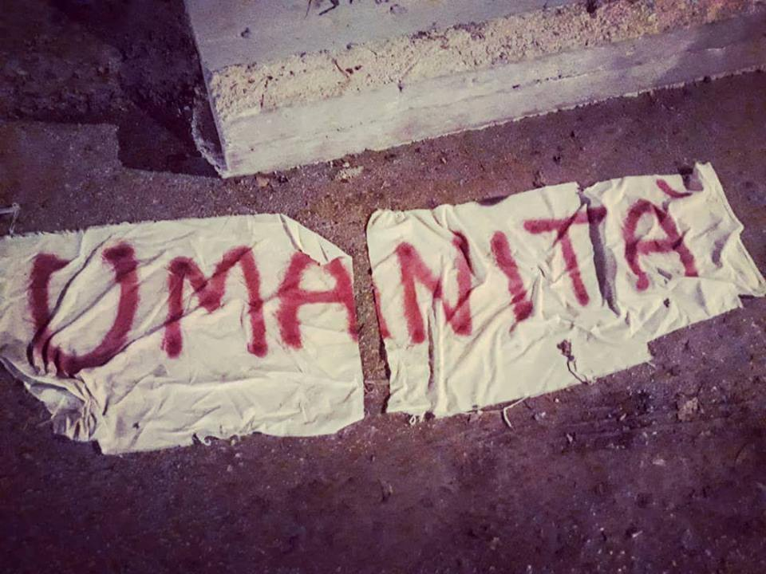
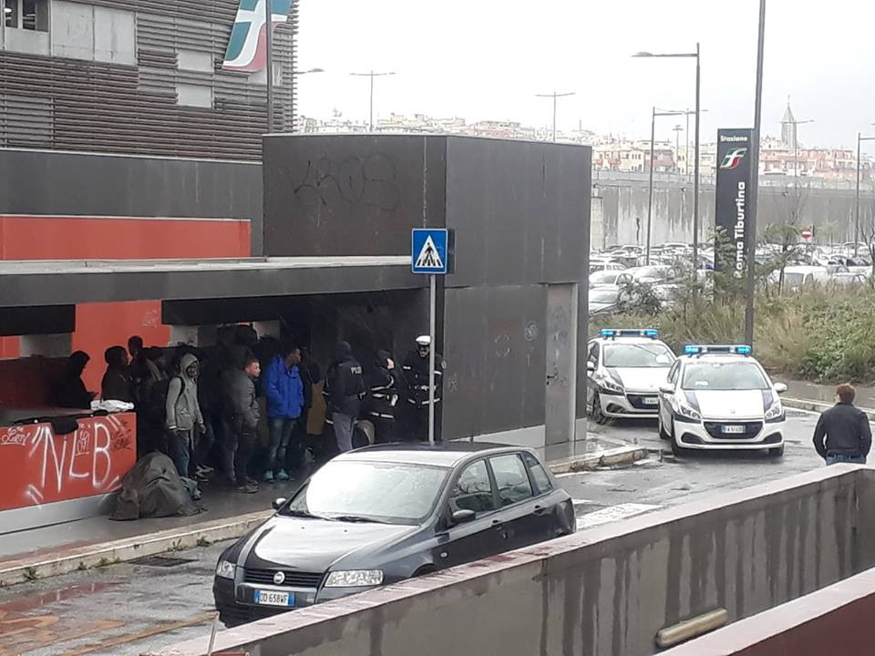
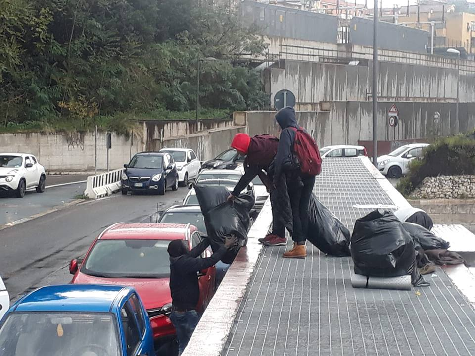
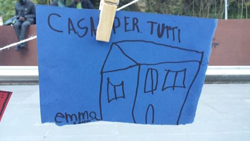
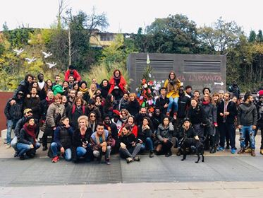

### AYS SPECIAL: Baobab Experience — You Can’t Stop Solidarity
#### After the evictions of the 13th and 20th November, when around 180 and 50 migrants were evacuated from Piazzale Maslax, Rome, Baobab keeps being targeted by police raids and identification operations\. But the solidarity around the centre is overwhelming\.

Credit: Baobab Experience

Since 2015, Baobab has been supporting people in transit in Rome with all possible support offered: tents, blankets, sleeping bags, clothes, food, legal and medical assistance, language classes etc\.

Since 2015, they have been threatened by police and local politicians because of the strong symbol of solidarity they represent\. Ever since then the number of local and international volunteers supporting the vision has been growing, as well as the solidarity around the activists and migrants living in the camp\.

More than 80,000 people on the move \(1,000 just this year\) found shelter at Baobab until today\. In 2018 legal teams have taken care of 260 legal practices, while 165 people, between the ages of 18 and 58, were supported and orientated in their search for employment\.

Over the past years, many threats and evacuations have carried on, but the centre always found a way to keep going, never giving up on solidarity\.

On the 13th of November this year, the last big eviction displaced around 180 people; only around 125 found a place in centres offered by the social services of the municipality of Rome, while around 50 people were left sleeping rough\. These last people were evicted again, identified again, brought to the Questura again and released again in the week after and, since then, the presence of the police in front of Stazione Tiburtina is constant throughout the day\.

Credit: Baobab Experience

On Thursday 6th December, I had a chat with Andrea Costa, spokesperson and representative of Baobab, who told me that the very same morning, police was again present at their spot on front of Tiburtina, identifying — again \- around 50 people sleeping rough and again disturbing the activity of the volunteers distributing food\.

I asked Andrea who are the people mostly present in the camp now, and he replied that the group is very diverse: people on the move; people who reach Rome after landing recently in Italy; people who were pushed back due to the Dublin Convention; people leaving centres where there are no cultural mediators \(Baobab offers this service as well\); people with regular humanitarian protection being expelled by first and second level reception centres due to the new [Salvini Decree](https://www.reuters.com/article/us-italy-politics-immigration-security/italys-salvini-gets-win-with-new-asylum-and-security-rules-idUSKCN1NY1JN) ; young men who just turned 18 and were expelled from the minors protection system\. The number of families is fewer than a few months ago and when they arrive they are immediately redirected to the centre managed by Intersos in town, which can fully take care of their various cases\.

People in transit are offered a hot breakfast and dinner \(no lunch\), medical and legal assistance, clothes, sleeping bags, Italian classes and cultural tours and activities\. Everything is run by volunteers and activists, with the collaboration of other NGOs like [MEDU](https://www.facebook.com/MEDUonlus/) , [Intersos](https://www.facebook.com/Intersos.org/) , [MSF](https://www.facebook.com/msf.italiano/) , [MDM](https://www.facebook.com/mdm.mideast/) , [DAC — Diritti al cuore](https://www.facebook.com/dirittialcuoreonlus/) and countless other volunteers, like scout groups and Case del Popolo, local but also European and international\.

The collaboration with local authorities remains temporary and uncertain, as there are no signs on their side that show the will to find shelter to those still left sleeping rough\.

Baobab is, nevertheless, supporting other realities in Rome that fight for the right to housing and the right to work of other migrants not residing in the camp and stands in solidarity with them\. Andrea also clearly states that Baobab is and will be a community of activists fighting for the rights of migrants\.

](assets/80ee99d1b43a/1*-FEyHOBejp2gqUioL3clbw.jpeg)

Credit: [Danilo Balducci](https://www.facebook.com/danilobalducciphotography/?__tn__=%2CdK*F-R&eid=ARDam45Szen0lIDnKZ0YEghmpkZQ7cOHynqHOO61jDdMsWcW76STBFGUBNceOF_X4v6E4KT90qutXkqa)

I asked Andrea about the future actions and events where Baobab will be present\. He mentioned that on the 8th December the inauguration of [**Spauracchio** — **L’Albero Migrante**](https://www.facebook.com/events/344063949716126/) was planned, in front of Tiburtina station, at the same time when the Christmas lights and trees would be lit in Piazza San Pietro and Piazza Venezia\. This represents a challenge to institutions and their will to keep turning a blind eye to the situation of migrants in the country\.

Everyone is welcome to stop by and add their Christmas wishes and thoughts\.

Credit: Baobab Experience

Another public action launched by Baobab is a petition, available [here](https://www.change.org/p/virginia-raggi-comune-di-roma-baobab-experience-a-comune-e-fs-info-point-migranti-e-hub-di-prima-accoglienza-subito?fbclid=IwAR2qW2p9An7KmiBPV3D-1bLmX89_Ahefg5tQpdtdnhYVTSFqoKwEZdW4nIo) , to demand the creation of a **permanent information point for migrants** in the Tiburtina area, as well as the creation of **a hub for reception** \.

Finally, I asked Andrea about the future actions that need to be taken on a political and social level\. His answer focused on two things:
- Increasing concrete assistance and solidarity at a European level \(he mentions solidarity actions coming from Ceuta y Melilla, Greece, the Balkans\);
- Increasing political action \(especially after the first tangible effects of the new Decree, see the above petition and public requests\) \.

We ended the conversation by talking about solidarity and how much this has increased after the tragic actions implemented by the government\. In this political scenario that lacks any serious political figure and human policy, there are many more people who decide to actively remain human to each other\.

We stand as one\.

Visit [Baobab’s website](https://baobabexperience.org) to keep track of their activities, events and campaigns\.

**\(by Cristina Guglielmini, AYS Info Team\)**

**We strive to echo correct news from the ground through collaboration and fairness\.**

**Every effort has been made to credit organizations and individuals with regard to the supply of information, video, and photo material \(in cases where the source wanted to be accredited\) \. Please notify us regarding corrections\.**

**If there’s anything you want to share or comment, contact us through Facebook or write to: areyousyrious@gmail\.com**

_Converted [Medium Post](https://medium.com/are-you-syrious/ays-special-baobab-experience-you-cant-stop-solidarity-80ee99d1b43a) by [ZMediumToMarkdown](https://github.com/ZhgChgLi/ZMediumToMarkdown)._
