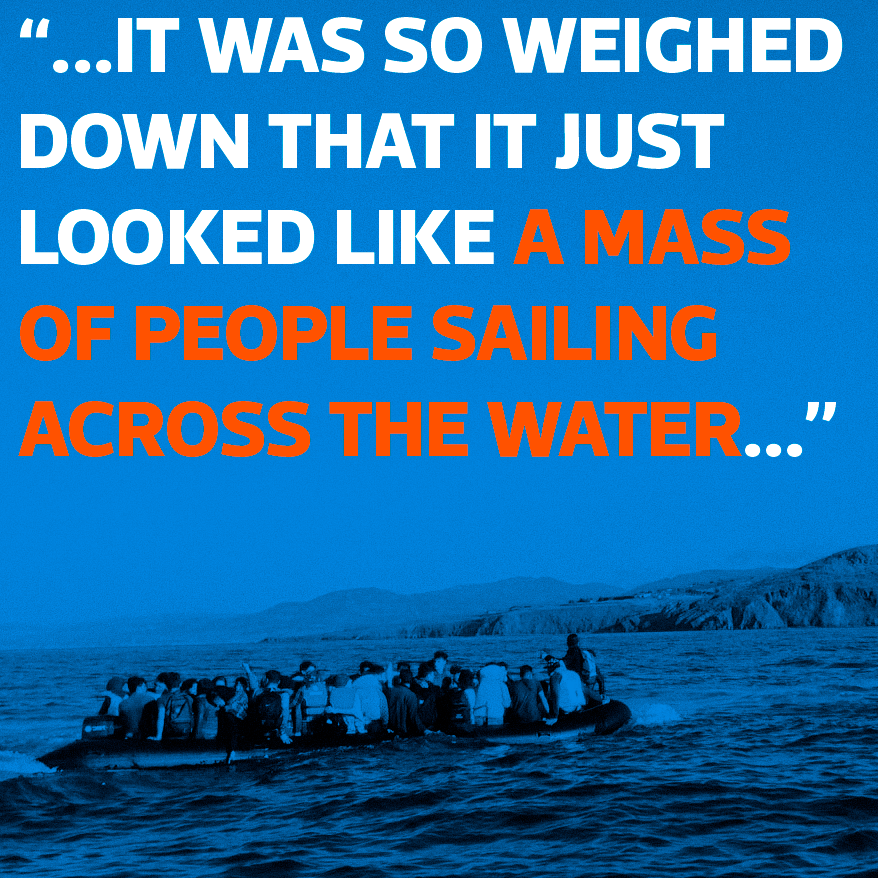
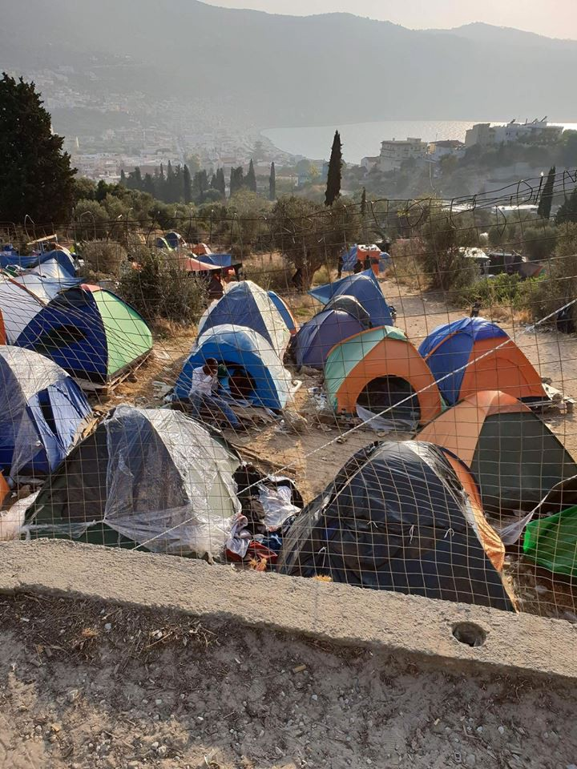

### AYS Weekend Digest 8–9/12/2018 Police violence in Northern France

Yemeni women demand seat at peace talks in Stockholm /// 6626 civilians died in Syria in 2018 so far /// More people “rescued” by North African coast guards /// Demonstration on Lesvos /// New project started on Samos /// Dire conditions for migrants in Paris /// Mass deportation planned in Sweden

 / Art Against\)](assets/1d37a776367b/1*8jJUEXjn13WF7gnTARvUKA.jpeg)

\#Resist \(by [Yassin Latrache](https://www.instagram.com/yas_caricature/) / Art Against\)
#### FEATURE — POLICE VIOLENCE IN NORTHERN FRANCE

A new report has been compiled by grass roots organisations in northern France, [Police violence in Calais: Abusive and illegal practices by law enforcement officers\.](https://l.facebook.com/l.php?u=https%3A%2F%2Fdocs.wixstatic.com%2Fugd%2F5eb73a_ae875cd65dcc434588a7a69ed4cf3167.pdf%3Ffbclid%3DIwAR0hxF6JAuI5Oq9zba8E6BaUHoTn2SjC77AK3Q-nGbOTjJkkutdGT1S4tWI&h=AT27stsVgIB1iI4Edo6DmWvu-VssyXi4xx-SdgtLwmr0Eeo-SZg_TqwnlMwX-2L-jPFa3kMC56aHmEvBvWr6Pmr94dfVllToTa-P9eCWsTnGfduH6Fc0EufS8tPu2AimVvXS4LAe5dYabuq5zA) It covers the period from the 1st of November 2017 to the 1st of November 2018 and describes, through collected data and testimonies, intimidation tactics, and physical and psychological violence inflicted by law enforcement officers\. These tactics include — dispersals and barriers to movement, identity checks, detentions, disproportionate use of chemical agents, physical coercion/aggression, intimidation and harassment, evictions, and the destruction and confiscations/theft of personal belongings\.

Nor are children spared from violence at the hands of French state actors\.

> I arrived at Rue des Verrotières and saw about twenty CRS officers standing in a line in the field beyond the two pylons\. They had full armour and shields\. I could see beyond the line of CRS that there were other CRS clearing tents from the woods and putting them into a truck\. The line that they formed was intimidating and they continued to speak on a megaphone saying “Police, clear the area”\. All the refugees retreated to near the pylons\. One man climbed up the pylon saying he was going to jump if they came closer… The CRS fired tear gas from guns and filled the sky with smoke and the burning embers\. I couldn’t breathe and I went further away… 

> I saw through the smoke a boy being carried by his friends, covered in blood\. He had been hit in the eye and they had no way of getting him to hospital\. A vehicle drove through and they got him to hospital but I found out later that he lost his eye\. His friends were crying; it was a group of minors and the boy himself was 16\. 

> _\(Testimony from a British volunteer, Rue des Verrotières, 25th January 2018\)_ 

This is just one example of the many used in this report to highlight what is happening in Calais\. As [reported previously](ays-daily-digest-06-12-18-another-month-of-brutality-on-the-balkan-borders-1b0045ee03a1) by AYS these practices are also common along the Balkan route with serious injuries and violence towards children common\.

This week the world will celebrate Human Rights Day\. Moreover this year it marks the 70th anniversary of the adoption of the Universal Declaration of Human Rights by the UN\.

Article 1 of the Human Rights Convention clearly states:

> All human beings are born free and equal in dignity and rights\. 

And we ask — where on this earth is this true? It is such a beautiful statement, but clearly not one that has been read or understood by the governments of the EU\. Macron, Conte, Plenković and all other European heads of state: if you are silent you are still complicit, it is time to catch up\!

With this anniversary we celebrate the increasing number of human rights infringements \(read: police brutality\) from “security” forces throughout Europe towards migrants; new lows in the inhumane conditions that asylum seekers and migrants are forced to suffer in hot spots, makeshift camps and detention centres; the adoption of policies explicitly aimed to reduce the chances of people arriving safely — or just alive — in Europe; the rise to power of far\-right and fascist parties; the criminalisation of solidarity and rescue operations\.

It is not acceptable to beat and repress people just because they are poor and vulnerable, it is not even legal, and we will bear witness to your crimes, we will record them day by day, until you are held accountable\.

Happy anniversary human rights\!

YEMEN
#### Women sidelined in peace talks held in Stockholm

UN\-sponsored peace talks started on Thursday in the Swedish capital\. Only one woman is present at these talks, media outlets [report](https://www.middleeasteye.net/news/yemeni-women-demand-seat-table-peace-talks-begin-stockholm-1916031264?fbclid=IwAR1ceRzExSNbJWUf5jEfmrwELX3FuobcjYEBDBcCAQCQghcnWZIbo9Zje2k) \.

Activists of the [Women for Yemen Network](https://twitter.com/search?q=women4yemen&src=typd) have campaigned for representation of women at the negotiation table\.

From their [statement](https://nobelwomensinitiative.org/women-for-yemen-network-joint-statement-in-advance-of-the-yemeni-peace-talks-in-sweden/) :

> After four years of devastating war, the people of Yemen demand peace\. It is women who are the most\-affected by the war and their voices need to be heard in the peace negotiations\. We, as the Women for Yemen Network, call for women to be represented in peace talks\. 

> \[…\] Many issues, essential to building a lasting peace, are being neglected in the current peace negotiations\. When women are present at the peace table, they ensure that the lived experiences of women and their communities are reflected in the final peace agreement\. 

> No true peace will happen without addressing the following issues: 

> **Ensuring women’s role in the peace process:** 

> \- \[…\] women should comprise least with 30 percent of negotiators at the peace table\. 

> \- Support, financially and politically, for women\-led initiatives and organisations working on peace for Yemen at the grassroots level and in the diaspora\. 

> **Restoring normalcy in Yemen:** 

> \- Institute an immediate ceasefire\. 

> \- End the Saudi and UAE\-led land, air and maritime blockade on Yemen\. 

> \- Ensure that humanitarian aid reaches the conflict\-affected areas and that international aid focuses on income generation for families and communities\. 

> \- Release all illegally\-detained persons and abductees held by all parties to the conflict\. 

> \- End the three\-year, Houthi\-imposed siege of Taiz\. 

> **Landmines:** 

> \- Start the demining process and ensure that there is a clear map of where the landmines are located\. 

> **Child soldiers:** 

> \- Release, immediately, all children enlisted in military operations and ensure that their physical and psychological needs are met\. 

> **Transitional Justice:** 

> \- Ensure that the principle of transitional justice is adhered to and that compensation is provided for as a prerequisite to sustainable peace\. 

Read the full statement [here](https://nobelwomensinitiative.org/women-for-yemen-network-joint-statement-in-advance-of-the-yemeni-peace-talks-in-sweden/)

SYRIA
#### 6626 civilians killed in the country in 2018

[Syrian Network for Human Rights](http://sn4hr.org/blog/2018/12/01/52896/?fbclid=IwAR1V344wpAxT0auHdodh0yX8Mrrc9eF7j8z43FqUvDBPn4zcSaiofR-6df8) \(SNHR\) have compiled a [report](http://sn4hr.org/wp-content/pdf/english/231_civilians_were_killed_in_Syria_in_November_2018_en.pdf) on civilian deaths stating that 6626 civilians are known to have died so far this year in Syria\. 4628 of these were killed by the Syrian\-Russian Alliance Forces\. This month alone 231 people have been killed, 79 of them by the Alliance\. The report notes that 90% of the attacks carried out by the Alliance are against ‘civilians and civilian objects’ which goes against International Human Rights Law\. They call for an international investigation and prosecution of guilty parties for war crimes including extrajudicial killings\.

> In addition, the report calls for the implementation of the “Responsibility to Protect \(R2P\)” norm, especially after all political channels have been consumed through all agreements, as well as Cessation of Hostilities statements and Astana agreements\. The report stresses that action should be taken under Chapter VII of the Charter of the United Nations, and the “Responsibility to Protect” norm, which was established by the United Nations General Assembly, should be implemented\. 

> The report calls on the European Union and the United States of America to support the International, Impartial and Independent Mechanism that was established in accordance with General Assembly Resolution 71/248, adopted on December 21, 2016\. And establish local tribunals that enjoy a universal jurisdiction, and address the war crimes that were perpetrated in Syria\. 

> Also, the report calls on the Commission of Inquiry \(COI\) and the International, Impartial, and Independent Mechanism \(IIIM\) to launch investigations on the incidents included in this report and past reports\. The report stresses that SNHR is willing to cooperate and provide more evidences and data\. 

Since it was founded, SNHR has focused on documenting civilian victims killed by the different parties in the conflict\. They have created a database of the victims’ names, sex, age, occupation, the method of killing, who killed them, and the type of weapon used\.

TURKEY
#### İmece İnisiyatifi Çeşme is looking for a volunteer coordinator

The group [İmece İnisiyatifi](https://www.facebook.com/imeceinisiyatifi/) , based in Cesme, on the Western Turkish coast, and working across the area around Izmir, is looking for a volunteer coordinator:

> Missions:
 

> \- Coordinate the teams of international volunteers \(5–12 people\) 
 

> \- Organise the work, handle the emergencies, security and behaviours
 

> \- Do the recruitment and welcoming
 

> İmece gives a lot of space to initiative so do not hesitate to talk with us about specific projects\. 

> \- English required, Arabic or Turkish a plus
 

> \- 6 months of stay minimum
 

> \- initiative, independence, flexibility
 

> \- Capacities to live in community and soft leadership 

> For more information and applications,send your CV at : contact@imeceinisiyatifidernegi\.com 

Look at the map of the group’s activity [HERE](https://www.google.com/maps/d/u/0/viewer?ll=38.408514827516875%2C27.280035918749945&fbclid=IwAR14SarAJ6nHETmiwRXi-w4XurJ10E-31pQQKyrbtS5JPnBZtSBqfqwQT5g&z=8&mid=1wkRJz_C5jfeXxpXvF1VLhG-tY42_5AUH) \.

LIBYA
#### 2 dead bodies and 10 people brought back to Libya by the country’s coast guard

Local [media report](https://www.libyaobserver.ly/news/10-migrants-missing-10-rescued-boat-capsizes-libyan-shores?fbclid=IwAR0_b-Ovq5ZeeK6aMke1x9bbY3crE4ovbSFhNyDFy4y-Lm1YpIjKQKCY1KI) that the Libyan coastguard rescued 10 migrants over the weekend, they also recovered two bodies and are still searching for 10 people who were lost from a boat that capsized off Misrata shores\. They had been at sea for 12 days since they left Sabratha after their engine failed\. The survivors have been taken to the Red Crescent centre in Misrata\.
#### 114 people resettled in Europe

In good news UNHCR’s resettlement programme is seeing some results\.

■■■■■■■■■■■■■■ 
> **[UNHCR Libya](https://twitter.com/UNHCRLibya) @ Twitter Says:** 

> > During 1st week of December 3 flights with 114 Eritrean, Sudanese &amp; Syrian #refugees left 🛫 #Libya towards Norway 🇳🇴 &amp; Canada 🇨🇦 thanks to UNHCR's resettlement program. Families going to 🇳🇴 hosted at a first stage @UNHCR's ETC in Romania &amp; will continue to 🇳🇴 at a later stage. https://t.co/e4D1JYJiDo 

> **Tweeted at [2018-12-08 13:05:15](https://twitter.com/unhcrlibya/status/1071390251053125632).** 

■■■■■■■■■■■■■■ 

But for every person you can see in this picture, you have to wonder how many more there are locked up in detention and unable to receive the support they need to take part in this process?

A breakdown of UNHCR’s other work and their understanding of the situation can be found [HERE](https://reliefweb.int/sites/reliefweb.int/files/resources/2018_12_07_LBY_UNHCR%20Dashboard.pdf?fbclid=IwAR3NunPf_o7h0E3Gplt-prQZEC3taiJ8wjdmUyd_UL9DS8-G2aD7YQ4MXZI) \. Of the 649,103 people of concern we can see that they have managed to reach only a small number\. If people cannot receive adequate support in Libya, and if their safety cannot be insured, then they should not be returned there\. Under both the Refugee Convention and International Human Rights law, this is exceptionally clear\.

MOROCCO
#### 72 people brought back to Morocco

Local [media report](https://mobile.telquel.ma/2018/12/09/72-migrants-secourus-pres-de-nador-entre-le-maroc-et-lespagne_1621266?fbclid=IwAR0DiwG9r9U88rRY7KLh2tJiaDqONpuTVp97HsZi2RQbqhSE--JMfU6G12M) that on Saturday the 8th of December 72 people were picked up by the Royal Navy and brought to safe harbour in Nador\.

The [Association Marocaine des Droits Humains — Section Nador](https://www.facebook.com/AmdhNador/?__tn__=%2CdkCH-R-R&eid=ARA-gipmt8GyRcnFrjgjojMDttoa3BDiGAfOL33TzeS6PHAg5b4Y6tK3sbEskfXLMf_5akOIvH9jmhlD&hc_ref=ARSIbXqg3ABYZyTY1UNWFPCF3WTuQ5UVS8CJ_gzSgSQNxnbVdFD0NmHNeD0r2ItP7KE&fref=nf) stated that dozens of migrants were arrested in Messnana, the closest land area to Spain, and returned to Tiznit, where there are [detention facilities](https://www.google.com/url?sa=t&rct=j&q=&esrc=s&source=web&cd=12&ved=2ahUKEwjz9beM6ZTfAhWIkCwKHd5uC-oQFjALegQIBhAC&url=https%3A%2F%2Fwww.cear.es%2Fwp-content%2Fuploads%2F2018%2F03%2FREPORT-MUROS-FRONTERA-SUR.pdf&usg=AOvVaw3YWJRRTR5nbXnPmtK9_M0x) \.

> The Moroccan authorities continue their violations on the ground and in Marrakech they play the game of respect for the rights of migrants\. 

GREECE
#### Arrivals

From the [Aegean Boat Report](https://www.facebook.com/AegeanBoatReport) :

Four boats arrived on the Greek islands during the weekend\.

[Three arrived on Lesvos](https://www.facebook.com/AegeanBoatReport/posts/487570918432684) Friday night/Saturday morning, carrying 119 people\. The first boat was picked up by Frontex outside Molivos, Lesvos north, at 03:30\. It was transported to Petra port\. It carried 44 people \(20 children, 11 women, 13 men\) \. The second boat was picked up by Frontex outside the airport, Lesvos south, at 09\.00\. Hellenic Rescue Team assisted at the scene\. 40 people were on board\. The third boat landed in Tsonia, Lesvos north east, 09\.20\. 35 people \(18 children, 9 women, 8 men\) \.

[One boat landed](https://www.facebook.com/AegeanBoatReport/photos/a.285312485325196/487851148404661/?type=3&theater) on Chappel, Lesvos north, at 21\.30 on Saturday\. 36 people were on board \(16 children, 10 women, 10 men\) \.

From [Refugee Rescue / “Mo Chara”](https://www.facebook.com/RefugeeRescueUK/posts/1989610857773021?hc_location=ufi) :

Photo by Refugee Rescue / “Mo Chara”

> At around 14:12 our team decided to call in a suspected dinghy\. Though it was my first time spotting one, after a minute or two of deliberation there was very little doubt as to whether the vessel was a ‘dinghy’…\. It exhibited every characteristic I had been taught about in the frequent Refugee Rescue spotting trainings\. The course was zigzagged, and the dinghy itself was almost impossible to see\. It was so weighed down that it just looked like a mass of people sailing across the water\. At 14:37 the dinghy was confirmed and help was on its way\. The dinghy landed around 14:50\. _\(Gabbie, former land crew volunteer\)_ 

Over the weekend, RR land crew assisted 115 people, including 54 children\.

> This year, over 6500 people have passed via the North shore of Lesvos on their journey to seek shelter and refuge\. These people cannot be reduced to a number\. Or, worse, simply forgotten at the fringes of Europe\. 

Please consider supporting Refugee Rescue this coming Wednesday, when your donation will be amplified during the Global Giving Bonus Day — thank you\.
#### New project starting on Samos

 \)](assets/1d37a776367b/1*k0bBaNoX5VRVE7Qn3w8IoA.jpeg)

“As you can see in the pictures, most of the people are living in summer tents — the camp was built for 650 people but there are around 5000 \( \! \! \) now…” \( [Refugee4Refugees](https://www.facebook.com/Refugee4Refugees/?__tn__=%2CdkCH-R-R&eid=ARAtUpySVjY6QhlD6eO77qVs4xrUvQnvdRdEL8FbLzqtblMI2b4rAmGp2sKni75cUD_AyuyZlDVNGT1R&hc_ref=ARTgXLYotLwP-pBc1J0_jQes9tRBV4r5jSoZc4NMeVeNBSWcpitIQBWkEI_embLdyLo&fref=nf&hc_location=group) \)

[Refugee for refugees](https://www.facebook.com/Refugee4Refugees/?__tn__=%2CdkCH-R-R&eid=ARAtUpySVjY6QhlD6eO77qVs4xrUvQnvdRdEL8FbLzqtblMI2b4rAmGp2sKni75cUD_AyuyZlDVNGT1R&hc_ref=ARTgXLYotLwP-pBc1J0_jQes9tRBV4r5jSoZc4NMeVeNBSWcpitIQBWkEI_embLdyLo&fref=nf&hc_location=group) is starting a new project on Samos as the situation on the island is worsening by the day\.

They are looking for volunteers for their new warehouse on the island\. Apply [here](https://refugee4refugees.org/volunteer/) \. They are also looking for donations, please donate [here](https://refugee4refugees.org/donate/) \.

Read more about the situation in Samos in our previous digests \( [1](ays-weekend-digest-1-2-12-2018-more-talk-but-no-action-over-situation-in-greeces-hotspots-64eadb792f) , [2](ays-daily-digest-27-11-2018-its-no-dream-it-s-a-nightmarish-reality-of-europe-today-3035ecc5748f) \)
#### Demonstration in Mytilene on Monday

 \)](assets/1d37a776367b/1*nXD2F2yWDnS_7lOH1G3AZQ.jpeg)

Border kill\! demonstartion \( [Thick as Thieves AFA Lesvos](https://www.facebook.com/192190568392938/photos/gm.2077961595849797/193030574975604/?type=3&theater) \)

An international call for “a day of simultaneous resistance, without borders, against the hardening of capitalism and authoritarian society” on Monday the 10th of December\.

> It becomes urgent to converge our resistance, one day per month, from 10 December 2018 and, thereafter, every 10th of every month, at the same time, all over the world, parallel to our daily local struggles\. 

Read the full statement in Greek, English, French and German [here](https://athens.indymedia.org/post/1592897/?fbclid=IwAR1klWDY1BxpuN2rR5ixFs4CvZFGL200GhsoL8OINdKTV3UwtDcLAtVWjlM) \.

The group [Thick as Thieves — Antifascist Action Lesvos](https://www.facebook.com/Thick-As-Thieves-AFA-Lesvos-192190568392938/) launch a demo in Saphous square, Mytilene, for 18:00\.

 \)](assets/1d37a776367b/1*_UPpx-r9WLzLNQ1MRBJpIA.jpeg)

\( [Thick as Thieves AFA Lesvos](https://www.facebook.com/192190568392938/photos/gm.2077961595849797/193030574975604/?type=3&theater) \)

ITALY
#### Petition in support of migrants promoted by psychologists of Lombardy

After the calls for solidarity and action launched by psychologists in Sicily and Piedmont, a [petition](https://www.change.org/p/opinione-pubblica-nessuna-protezione-sicurezza-di-nessun-tipo-gli-psicologi-della-lombardia-con-i-migranti?recruiter=56520822&utm_source=share_petition&utm_campaign=share_for_starters_page&utm_medium=whatsapp) was recently launched by psychologists in Lombardy \(the region around Milan\), who express their serious concerns with regard to the consequences of the new law approved last week, Melting Pot Europa [report](https://www.meltingpot.org/Psicologi-con-i-migranti-con-il-Decreto-Salvini-nesssuna.html?fbclid=IwAR3-vmaaDEIc290btkYli9VTOIkwte_FeBuewjvrYb_85SCrYszLgQgJB8k) \.

> Around 40,000 people in Italy — and 900 only in Milan — will be left without a place to stay and without access to psycho\-social support programs in the next weeks\. 

> Psychologists have played an important role within the processes of reception and health care of vulnerable people, that is for a large number of asylum seekers and refugees\. These people are recognised as vulnerable because they show the signs of the traumas they suffered: exploitation, abuses and violence of different nature, sexual violence included, malnutrition, impossibility to access basic health services, physical and psychological humiliation, detention and push backs… 

Read the whole [article](https://www.meltingpot.org/Psicologi-con-i-migranti-con-il-Decreto-Salvini-nesssuna.html?fbclid=IwAR3-vmaaDEIc290btkYli9VTOIkwte_FeBuewjvrYb_85SCrYszLgQgJB8k) , and sign the petition \(in Italian\) [HERE](http://chng.it/M2hFrRvR) \.
#### Public meeting in Rome’s University to discuss the new “Salvini” law

Students from the education department of Roma Tre University in Rome launched a public meeting for Wednesday 12th of December, at 14:00, to discuss the consequences of the new law\.

Read more \(in Italian\) [HERE](https://www.facebook.com/events/579744532490520/) \.

SPAIN
#### Welcome guide for migrants and refugees\!

Welcome2europe have created a [guide for refugees and migrants who arrive in Spain](http://w2eu.info/spain.en.html?fbclid=IwAR2g374mkp0bEGMhQWWEqSq1F6Px1LCVZVsvrS0l92RhMSsyXH2ovP2imSk) \. It includes information particular to the place you enter including Ceuta, Melilla or mainland Spain as they all have different processes\. There are also people and groups you can contact for help and advice\.

> In general we would like to support you to get to your destination and to get your right to stay\. We welcome you to Europe and wish you much power in your ongoing future\! 

BALKANS
#### Balkan weather forecast for Monday 10th December

MONTENEGRO

Predominantly sunny in the South with weak to moderate clouds and changeably cloudy in the North with precipitation in some places\. During the morning possible fog in the basins\. Northern wind locally moderate to strong\. Lowest temperatures will \-4 to 9 and the highest daily from 0 to 17 degrees\.

SERBIA

Mostly sunny in the North, cloudy with local precipitation, also sleet and snow in the mountains\. After noon it will clear up in the west and centre\. The wind will be weak to moderate blowing from the northwest and will weaken during the evening\. In the night snow could fall in the lower regions and in the southeast\. The lowest temperatures will be from 0 to 5 and highest from 4 to 9 degrees\.

CROATIA

Sunny with slight rain in some parts of the country\. Temperatures from 5 to 10, up to 15 on the coast\.

BOSNIA AND HERZEGOVINA

Sunny in the north, snow in Sarajevo and surrounding areas\. Temperatures above 0, between 4 and 8 \(Bihac area\) \.

SERBIA
#### Update on the number of people present

Data from [UNHCR](https://data2.unhcr.org/en/documents/details/67186) :

Total \(observed\) arrivals — November: 1,275

Total \(observed\) arrivals of unaccompanied/separated children — November: 178

Total occupancy of government centres — end November: 3,891

Total presence of refugees/migrants/asylum\-seekers — end November: 4,165

SWITZERLAND
#### Protest in Berne against deportations and forced returns

Several hundred people, including both asylum seekers and activists from the Migrant Solidarity Network, protested in Berne on Saturday the 8th December against the deportation of migrants for the freedom of asylum seekers to choose whether to return to their country or not\. They also spoke out against detention and the policy of Dublin returns\.

> Those who flee often do so with the awareness of embarking on a journey that could cost them their lives\. The repatriations bring these people back to the starting point, from which they wanted or had to flee at any cost\. Expulsions often also violate the physical and psychological integrity of those affected\. In the countries of origin, these people run the risk of persecution, poverty and social isolation\. 

More information about the protest can be found in Italian [here](https://www.tio.ch/svizzera/attualita/1340242/rimpatrio-migranti-la-folla-davanti-a-palazzo-federale?mr=1&ref=https%3A%2F%2Ft.co%2FpxzxlfSb5V%3Famp%3D1&fbclid=IwAR13a2FzlG-X1AD2xnRM-KQ9CKr0aCqJ4ayxjYuK44gjbsUnYE6CGKbjbRg&mr=1&ref=https%3A%2F%2Fl.facebook.com%2Fl.php%3Fu%3Dhttps%253A%252F%252Fm.tio.ch%252Fsvizzera%252Fattualita%252F1340242%252Frimpatrio-migranti-la-folla-davanti-a-palazzo-federale%253Fmr%253D1%2526ref%253Dhttps%25253A%25252F%25252Ft.co%25252FpxzxlfSb5V%25253Famp%25253D1%2526fbclid%253DIwAR13a2FzlG-X1AD2xnRM-KQ9CKr0aCqJ4ayxjYuK44gjbsUnYE6CGKbjbRg%26h%3DAT3kLKilvvUgOYzfXBFOvST4WVVhLSg_XPtU6jlwE2YX8RIRP6dglvy6u9X0p1OjTB_g_dk6L6X5IVanSPQ-jWIqo0QppKfROIbCaLiuUyk9SZKtO6RdrjxKqyrx6v55GcTubp2KkIpw83TbBA) \.

SWEDEN
#### Mass deportation to Afghanistan planned for Tuesday 11th December

A mass deportation is planned from Sweden back to Afghanistan Tuesday 11th of December\. The number of asylum seekers facing deportation is not confirmed yet\. Sweden is one of the countries with the highest number of returns to Afghanistan at the moment\. Follow [Afghanistan Migrants Advice & Support Org](https://www.facebook.com/permalink.php?story_fbid=2242514095778862&id=195295217167437&hc_location=ufi) for more updates\.

THE NETHERLANDS
#### Families with young children will not be sent back to Italy

The Netherlands will not send families with young children back to Italy for now, according to [local media](https://nos.nl/artikel/2262783-nederland-stuurt-jonge-asielgezinnen-voorlopig-niet-terug-naar-italie.html?fbclid=IwAR1cq1uEBijR9cplRk5LLew8xTvnUroHOSph5No0aMsVQjbQWteGLw2-vrU) \. The Immigration and Naturalization Service \(IND\) therefore wants to investigate whether there is shelter provided before sending people back under the Dublin Convention\. In the first half of this year there were 3950 Dublin cases in the Netherlands\. The Netherlands asked Italy to take back 1150 people because Italy was their country of entry\. About 180 cases were successful, according to [ECRE figures](http://www.google.com/url?sa=t&rct=j&q=&esrc=s&source=web&cd=2&ved=2ahUKEwjvg-6L4JTfAhXPRBUIHWeaAogQFjABegQICBAC&url=http%3A%2F%2Fwww.asylumineurope.org%2Fsites%2Fdefault%2Ffiles%2Faida_2018halfupdate_dublin.pdf&usg=AOvVaw2oTV4FTLS3NzZRiDqjPyKD) \. The IND states that a maximum of 80 people were returned to Italy from July to October\. A precise figure is not available\. The highest administrative court will consider Dublin cases to Italy today \(10th Dec\) \.

FRANCE

[Paris Refugee Ground Support](https://www.facebook.com/PRGS.team/videos/vb.1806225229657589/540400056428936/?type=2&theater) have posted a video of the appalling conditions that people are facing in Paris\.

How difficult can it be for [one of the world’s largest economies](https://www.focus-economics.com/countries/france) to house people in winter?

UK

On Thursday 13th December [Refugee Rights Europe](http://refugeerights.org.uk/) will [present](https://www.eventbrite.co.uk/e/universal-declaration-of-human-rights-70th-anniversary-refugees-in-europe-tickets-52170033976?fbclid=IwAR1EZ0rcsiH_tGSBQEfvLxWw0sIPRmfnGzaUBCiLsorpBFdVDIhX9LiG7Ok) in London the second edition of their new report “The State of Refugees and Displaced People in Europe” to shine the spotlight on the human rights situation for refugees and displaced people in Europe, and reflect on the way forward\.

**We strive to echo correct news from the ground through collaboration and fairness\.**

**Every effort has been made to credit organizations and individuals with regard to the supply of information, video, and photo material \(in cases where the source wanted to be accredited\) \. Please notify us regarding corrections\.**

**If there’s anything you want to share or comment, contact us through Facebook or write to: areyousyrious@gmail\.com**

_Converted [Medium Post](https://medium.com/are-you-syrious/ays-weekend-digest-8-9-12-2018-police-violence-in-northern-france-1d37a776367b) by [ZMediumToMarkdown](https://github.com/ZhgChgLi/ZMediumToMarkdown)._
