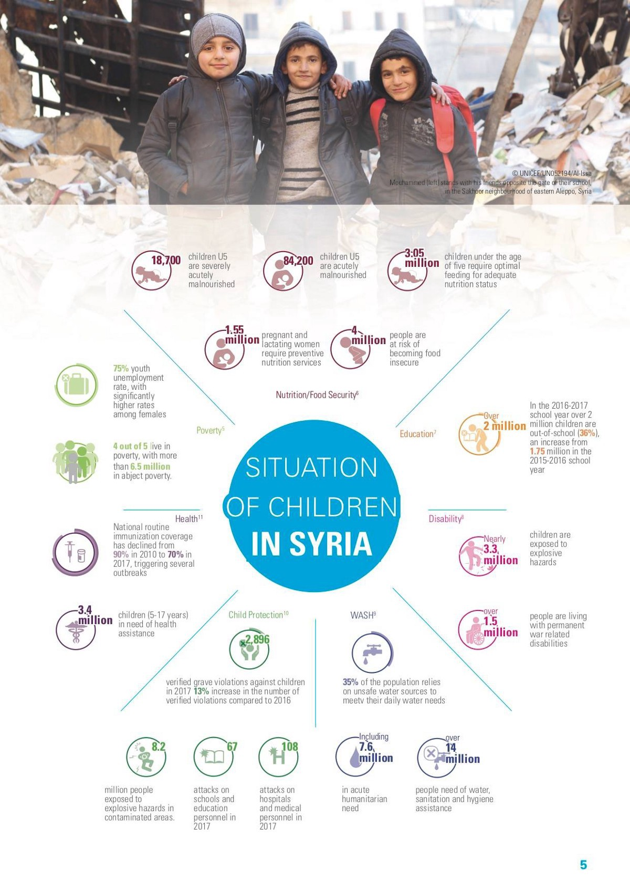
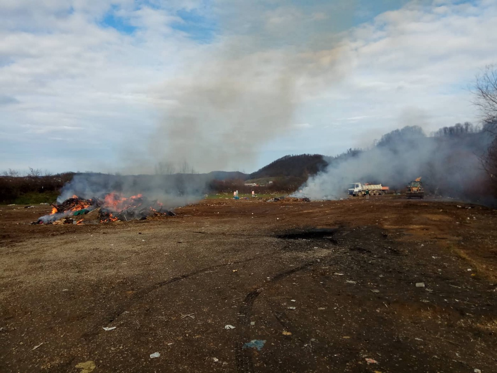
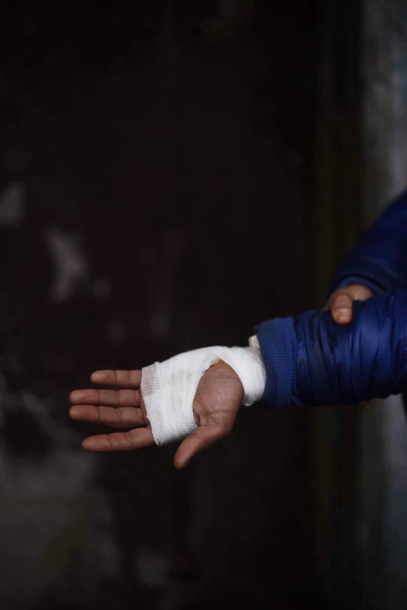
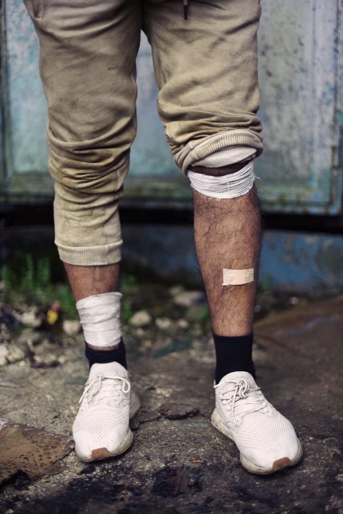
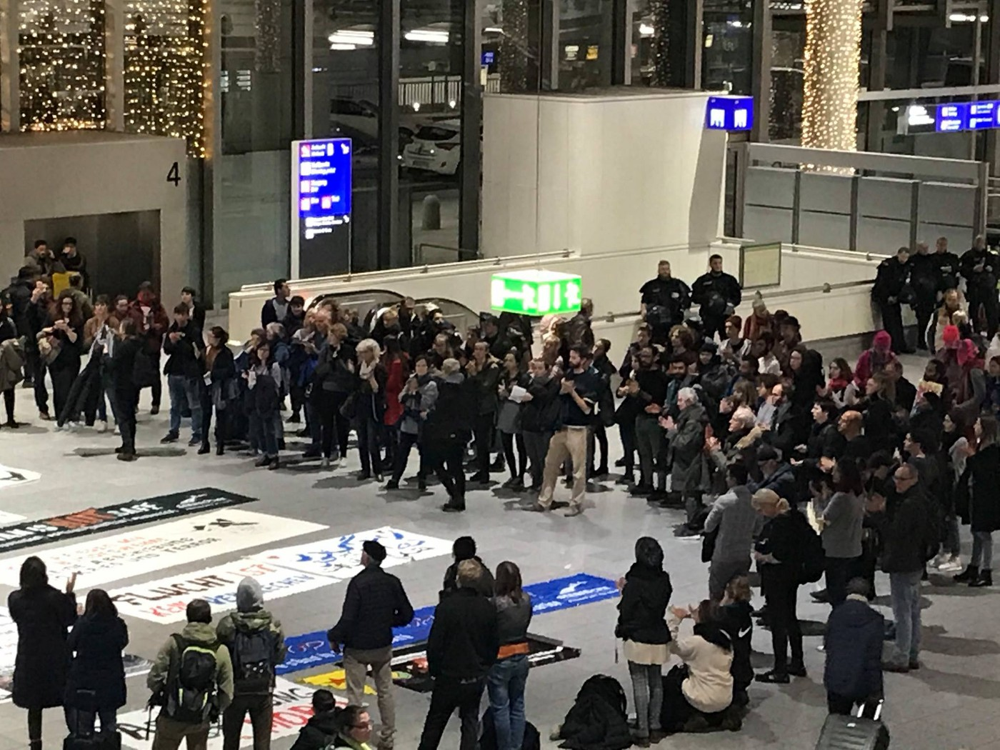
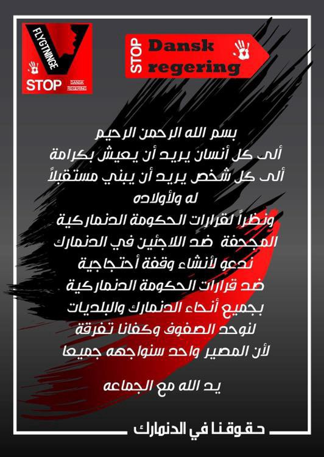

### خلاصـــــــــــة الاسبـــــــــــــــــــــــــــــوع \(ا\.ي\.س\)
#### الترحيل و عنف الشرطة وقوانين مكافحة الهجرة AYS Weekly News in Arabic, 03–09/12/18

](assets/30ad27d6325a/1*z_yXifwpIvAiIgKUoTpxuA.jpeg)

[Hessischer Flüchtlingsrat](https://www.facebook.com/fr.hessen/?tn-str=k%2AF)
### سوريا

**18\.7 ألف طفل دون سن الخامسة يعانون من سوء التغذية الحاد**

**1\.55 مليون امرأة حامل ومرضعة تتطلب خدمات التغذية الوقائية**

**4 ملايين شخص معرضون لخطر انعدام الأمن الغذائي**

**2 مليون طفل \(36٪\) خارج المدرسة**

**3\.3 مليون طفل يتعرضون لمخاطر المتفجرات**

**1\.5 مليون شخص يعيشون مع إعاقات دائمة مرتبطة بالحرب**

**108 الهجمات على المستشفيات والعاملين في المجال الطبي في عام 2017**

**3\.4 مليون طفل \(من 5–17 سنة\) في حاجة إلى مساعدة صحية**

■■■■■■■■■■■■■■ 
> **[The Syria Campaign](https://twitter.com/TheSyriaCmpgn) @ Twitter Says:** 

> > THREAD: 1,230 refugees returned to Syria from Lebanon today. Lebanese General Security reported that @[UNHCRLebanon](https://twitter.com/UNHCRLebanon) was present for the operation. Can UNHCR do anything to protect these refugees after today? The answer is no. 

> **Tweeted at [2018-12-06 16:52:43](https://twitter.com/thesyriacmpgn/status/1070722718050512899).** 

■■■■■■■■■■■■■■ 

### لبنان

نشأ حريق في أحد مخيمات اللاجئين حول منطقة يمّونة ، في وادي البقاع ، مما أسفر عن مقتل اثنين من اللاجئين السوريين \(رجل يبلغ من العمر 46 عامًا وصبي يبلغ من العمر 7 أعوام\) وتدمير ما يقرب من 24 خيمة وممتلكات\.

نشأ الحريق في الساعة الثالثة صباحاً بعد بسبب الشرارة التي ، كانت تتلامس مع حاوية وقود ، مما أدى إلى انتشارها
### ليبيا

أفادت إحدى الناجين المصرية يوم الثلاثاء أن خمسة عشر مهاجرا لقوا حتفهم في قارب قبالة الساحل الليبي بعد أن أمضوا 12 يوما في البحر دون طعام أو ماء\.

■■■■■■■■■■■■■■ 
> **[Mireille Girard](https://twitter.com/UNHCRGirard) @ Twitter Says:** 

> > Deeply hurt by the death of 2 #refugees, including a 6 year old boy, in a fire that mercilessly blazed through an informal settlement in the Bekaa, burning down 24 tents. Families lost all they had, on the eve of winter. We're standing by them at this very difficult time. https://t.co/wYj4FJjjCc 

> **Tweeted at [2018-12-04 21:23:10](https://twitter.com/unhcrgirard/status/1070066004519280642).** 

■■■■■■■■■■■■■■ 

أكد ممثل المنظمة الدولية للهجرة الليبية أن 10 فقط من الناجين الذين يعانون من الجفاف الشديد قد تم نقلهم إلى مركز احتجاز

مقلقاً أننا ما زلنا لا نرى خطوات صلبة للتصدي للحركات غير الآمنة غير المنتظمة عبر البحر المتوسط\.”

الجميع يتساءل: ما هي الطريقة المعتادة التي يتم تقديمها لهؤلاء الناس حتى لا يضطروا إلى اللجوء إلى “حركات غير منتظمة وغير آمنة” لعبور البحر الأبيض المتوسط على الإطلاق؟

■■■■■■■■■■■■■■ 
> **[Missing Migrants Project](https://twitter.com/MissingMigrants) @ Twitter Says:** 

> > At least 114 people lost their lives in the Western Mediterranean during the month of November, the month in which the most deaths have been recorded by @[MissingMigrants](https://twitter.com/MissingMigrants) since we started documenting deaths in 2014: [bit.ly/2BQWzG7](https://bit.ly/2BQWzG7) #[MissingMigrants](https://twitter.com/MissingMigrants) https://t.co/Koo4535k0s 

> **Tweeted at [2018-12-04 16:08:49](https://twitter.com/missingmigrants/status/1069986894480588800).** 

■■■■■■■■■■■■■■ 

### تركيا

حوالي 7000 شخص عبروا حدود إفروس بين اليونان وتركيا من يناير إلى سبتمبر هم مواطنون أتراك\. ووفقاً للأرقام اليونانية ، فإنه حتى 31 أكتوبر / تشرين الأول ، قدم3807 مواطنين أتراك طلبات للجوء في اليونان ، بينما قرر النصف الآخر عدم المضي قدماً في عملية اللجوء الخاصة بهم في البلاد من أجل مواصلة السير شمالاً إلى بلدان أوروبية أخرى\.

والناس الذين يفرون من نظام أردوغان هم في الأساس قضاة وموظفون عسكريون ومحترفون في مجال الأعمال أو أكاديميون وعملاء من المجتمع المدني ، ويضطهدون بسبب انتمائهم الواضح لحركة غولن ، ويختارون الهروب من البلد بصورة غير قانونية بسبب سحب جوازات سفرهم

تقدم حوالي 4000 تركي بطلب اللجوء في اليونان حتى الآن هذا العام\. لكن معظم الوافدين الأتراك لا يسجلون وجودهم في اليونان ، ويخططون بدلاً من ذلك للتوجه إلى أوروبا أكثر وأكثر من تركيا\.

لرؤية المزيد انقر [هنا](https://ahvalnews.com/greece-turkey/soaring-number-turks-fleeing-erdogan-arrive-greece-wsj?amp&__twitter_impression=true&fbclid=IwAR2EGwcz8FCoG2ZbjvIIzcNHozmy9YOdtGTasPqmqWXOtNUuXYCfKor-q3g)
### الجزيرة
#### لا يوجد مساعدات قانونية للناس في الجزر

وقد سرعت لجان الاستئناف اليونانية في الآونة الأخيرة النظر في الطعون في الجزر واتخاذ القرارات في غضون يومين أو أسبوعين ، على الرغم من عدم قدرة الدولة على تعيين ممثل قانوني لمقدمي الطلبات ، حسب تقارير الوكالة\. لم يحصل الأشخاص هناك على إمكانية الوصول الفعلي إلى التمثيل القانوني لعدة أشهر ، بسبب النقص المستمر والشديد في نظام المساعدة القانونية الممول من الدولة لطلبات اللجوء **\. شاهد المزيد**

■■■■■■■■■■■■■■ 
> **[Tdh Europe](https://twitter.com/TdhEurope) @ Twitter Says:** 

> > On Greek islands, over 12,500 people still live in tents &amp; containers unsuitable for winter. 

We urge the Greek gov't &amp; #EU to move to dignified shelter or relocate to other countries all #AsylumSeekers. 

👉[tdh-europe.org/news/greece-eu…](http://tdh-europe.org/news/greece-eu-move-asylum-seekers-to-safety/7403) 👈 #OpenTheIslands #RefugeesGr #HumanRightsDay https://t.co/VDamyQqs2N 

> **Tweeted at [2018-12-06 12:21:05](https://twitter.com/tdheurope/status/1070654359871152128).** 

■■■■■■■■■■■■■■ 

### البوسنة والهرسك

اخلاء فليكا كلادوسا \. تم تجريف المنطقة ولم تعد رسمية ، وتم نقل سكانها إلى المعسكرات الرسمية في المنطقة المحيطة\. “على الرغم من حقيقة أن الكمب في كلادوسا أصبحت مكانًا صعبًا للعيش ، وكان كثير من الناس سعداء في الملاجئ ، ربما بسبب الامن والحريه\. و مطبخ \(بدون اسم\) سيوفرمستلزمات الاستحمام والشاي وتوزيع معدات الطقس البارد

Velika Kladuša
### طريق البلقان

وكما ورد قبل بضعة أيام ، توفي الشاب الجزائري نسيم ، وهو طالب لجوء جزائري يبلغ من العمر 25 عاماً كان مسافراً على طول الطريق ، أثناء محاولته عبور نهر بين سلوفينيا وإيطاليا\.

[No Name Kitchen](https://www.facebook.com/profile.php?id=309778972753727&ref=br_rs) قدم تقارير بعد جمع شهادات مباشرة من الأصدقاء الذين كانوا معه في ذلك اليوم وتم ترحيلهم بشكل غير قانوني إلى كرواتيا ، ومنع حتى من رؤية جسد صديقهم للمرة الأخيرة

يبدو أن الشرطة الكرواتية اعتبرت أن الوضع لم يكن مؤلماً بما فيه الكفاية ، وعندما أخذوا المهاجرين إلى الحدود مع البوسنة ، في الليل ، جعلوا هؤلاء الشباب يتركون السيارة واحدة تلو الأخر ، يضربون كل واحد منهم\. وكان الصبي الذي تحمل وطأة هذا الوضع المتطرف هو الشخص الذي نقل إلى المستشفى قبل ساعات من انهياره بسبب وفاة نسيم\. قام أحد رجال الشرطة ، وهو يرتدي قناع — كما يفعل جميعهم — ، بضرب رأس الصبي باستخدام يديه وضرب وجهه بركبته

](assets/30ad27d6325a/1*c7CpBSTP_1s0j7cxuXf-dw.jpeg)

[No Name Kitchen](https://www.facebook.com/NoNameKitchenBelgrade/?__xts__%5B0%5D=68.ARBh7y8lWgbmEyJ1OqBoNxWRsdbXj-scwg6Pal1ruSBw2ki3wp6KowkvG-f5M6fP19JB1LqsDF3wEwP22HACM5488zFdyYDyXwQc7SJ3cc1_BisaYCnYH883sp6saSQPVZ3-uxo4LU9OewxWoaCpuFGn0gDH4j2fNQl73uXANme0TRM5pXxUWCezNI_-qyZIpGZ734Mrv-1rpnC8q0nj6E_c3nHz5f6expujJrTvYqC48iIwN9mu7nnsaAGBZGuVQ8NpL3WABKsRx9liPJ7ffpwrecvHBid6_tnB3CYLibJd5dGCIma6HslNXOHKw7q_bmKjNQ327Rsu3g5AwFdT-W4&__tn__=k%2AF&tn-str=k%2AF)
### ايطاليا
#### شرطة مكافحة الشغب تمنع اللاجئين من تلقي الإفطار

كان متطوعون من [باوباب إكسبير](ays-special-baobab-experience-you-cant-stop-solidarity-80ee99d1b43a) ينج يقدمون وجبة إفطار في محطة مترو تيبورتينا في روما هذا الصباح عندما ظهرت شرطة مكافحة الشغب\. باعياد الميلاد ، قررت الشرطة وقف توزيع الطعام الساخن وشرعت في مضايقة اللاجئين هناك ، واحتجزت ستة منهم ، وفقا لبيان صادر عن المجموعة\. وكما لاحظ باوباب ، فإن العديد من الأشخاص الذين كانوا ينتظرون وجبة الإفطار هم لاجئون يعيشون الآن بلا مأوى بعد طردهم من “مخيم باوباب” ، الذي أقيم في مكان فارغ في العاصمة

أعلنت المجموعة عزمها على الاستمرار في توزيع الغذاء ، وإظهار التضامن مع اللاجئين والمهاجرين في إيطاليا على الرغم من المضايقة\.
### فرنسا
#### كاليه

أصدرت منظمه باص معلومات اللاجيئن تقريراً جديداً يوثق استخدام الشرطة للقوة ضد المهاجرين في كاليه\. سجل المتطوعون ما يقرب من 1000 حالة من انتهاكات حقوق الإنسان في العام الماضي ، بما في ذلك حالات العنف الجسدي تجاه الأطفال في سن 13 عامًا\. اقرأ التقرير الكامل في موقع باص المعلومات على الويب ، وأثناء وجودك هناك ، استخدم النموذج الخاص بهم للاتصال وزير الداخلية الفرنسي وشجب هذا العنف

\.شاهد الفيديو المرفق أدناه

### ألمانيا
#### ضد عمليات الترحيل

أُقيمت مظاهرة في مطار فرانكفورت ضد القرارات المشكوك في أمرها ، والتي تتعلق بعمليات الترحيل إلى أفغانستان ، حيث تستمر الحرب ، ولا تزال الأمور تسوء

Hessischer Flüchtlingsrat
### المملكة المتحدة
#### المحكمة البريطانية تقرر ان بعض اللاجئين في البلاد قد يكونون غير مؤهليين للترحيل إلى إيطاليا

في المملكة المتحدة ، بموجب إجراءات دبلن ، يمكن ترحيل اللاجئين على الفور إلى أي دولة من دول الاتحاد الأوروبي إذا تم العثور على أدلة بأنهم كانوا هناك من قبل\. ومع ذلك ، جزء من هذا القانون هو الآن موضع شك بسبب قرار قانوني صدر مؤخرا\. في قضية رفعتها مجموعة الدفاع عن الحقوق في المملكة المتحدة “الحق في البقاء” ، قررت المحكمة أنه لا يمكن إرسال اثنين من أصل ثلاثة لاجئين كان من المقرر ترحيلهم إلى إيطاليا\. استند حكمهم إلى المادة 3 من الاتفاقية الأوروبية لحقوق الإنسان ، والتي تحمي الأفراد من التعرض للتعذيب والمعاملة اللاإنسانية والمهينة\.وباعتبار أحد المحامين الذين أبدوا حقهم في البقاء ، أشار إلى أن “الأدلة المعروضة على المحكمة في هذا الاستعراض القضائي سبقت سياسات الحكومة الإيطالية الأخيرة المناهضة للمهاجرين\. ومع هذا التطور غير السار ، ومع النتائج في قضية الاختبار هذه ، فإن المحامين موجودون في موقف قوي لمناهضة إزالة دبلن إلى إيطاليا في حالة الأفراد الضعفاء “\.يؤكد هذا الحكم ما هو واضح لأي شخص مطلع على وضع اللاجئين في إيطاليا — لمجرد أنه يطير علم الاتحاد الأوروبي لا يعني أنه “آمن”\! في حين أن هذه الحالة قد لا تؤثر على عدد كبير من الأشخاص ، إلا أنها خطوة في الاتجاه الصحيح لإبطاء عمليات الترحيل خارج المملكة من المملكة المتحدة\.قد تكون تفاصيل الأفراد مفيدة للآخرين لمعرفة ما إذا كانت حالتهم متشابهة ، وبالتالي يمكن أن تستفيد من هذه الحالة
#### قصة
### شهر آخر من الوحشية على حدود البلقان

وفي الشهر الماضي ، قامت الشرطة الكرواتية والسلوفينية بكسر الضلوع ، وضربت الناس بالعصى ، وصدمتهم بالعصى الكهربائية ، والهواتف الخلوية المحطمة ، وأجبروا الناس على السير في الماء في البرد القارس ، وقيدوا يديهم في مؤخرة العربات ، وطرحوهم على الجدران ، اطلاق النار في الهواء بالقرب من مجموعات من الناس بالرعب ،وحتى قيدو الناس ب أسلاك لطردهم

هذه ليست سوى بعض الحوادث التي تم توثيقها في تقرير شهري حول العنف والقيود غير القانونية على الحدود الكرواتية السلوفينية\-البوسنية التي نشرتها \(ا\.ي\.س\) هذا الأسبوع\. تم جمع المعلومات من قبل عمال التضامن مع مطبخ \(بدون اسم\) ، \(س\.و\.س\) و معلومات البلقان فان\. تم توثيق عشرين ظهراً عنيفاً في نوفمبر / تشرين الثاني مع مئات الضحايا\. والتقرير مفصل للغاية ، ويضم أدلة صور ، وشهادة مباشرة من كل هجوم ، والموقع التقريبي لمكان وقوع الحادث ، ووصف للمعتدين\.هناك نمط مزعج لهذه الدفعات\.

يتم نقل اللاجئين إلى الحدود في الشاحنات ، عادة في الليل\. بعد أن يتم إسقاطهم في البوسنة أو على حافة الحدود ، يتم ضربهم من قبل رجال الشرطة\. وفي معظم الحوادث كانت الشرطة ترتدي أقنعة سوداء للتزلج ، أو تحجب وجهها بطريقة أخرى عن طريق إشعال المصابيح الكاشفة في وجوه ضحاياها\. وفي معظم الحالات ، وصف الضحايا أنهم أجبروا على السير من خلال نوع من القفاز حيث تعرضوا للضرب والركل والضرب بالهراوات من قبل الشرطة واقفين في صف\.

> وصف العديد من الناس بأنهم تعرضوا للسخرية من الشرطة أثناء مهاجمتهم\. وصف شاب سوري يدعى حمود كيف ضحكت الشرطة الكرواتية أثناء ضربه ورفاقه:”أسوأ شيء هو أنهم يهينوننا ، يبدؤون بالضحك 

### الدانمــــــــــــــارك
#### “المقصود من هذا الإقامة المؤقتة”

سيتم إبلاغ اللاجئين بوضوح من الآن فصاعداً بأنه يجب ألا يتوقعوا البقاء في الدنمارك ولكنهم يجهزوون أنفسهم للعودة في اسرع وقت ممكناً\.

لن يتم تقييم الوضع الأمني في البلد الأم والترابط العائلي إلا عند النظر في طلب الشخص للحماية الدولية ، وتعلن الحكومة مباشرة أنه سيكون “في حدود الاتفاقيات” ، وفق مبادرة الترحيب باللاجئين في الدانمرك\.

ووفقاً للخطط الجديدة ، فإن اللاجئين غير مؤهلين للحصول على التعليم المجاني\. لم يتم ذكر ذلك في الاتفاقية ، لذلك ليس من الواضح ما إذا كان جميع اللاجئين سيفقدون إمكانية وصولهم إلى التعليم المجاني في المستقبل\.

إذا كنت طالب لجوء في الدنمارك ، يرجى قراءة المعلومات لمعرفة التغييرات الجديدة التي ستؤثر عليك\. للمزيد انقر هنا: [http://refugees\.dk/](http://refugees.dk/)

**Every effort has been made to credit organizations and individuals**

**Please notify us regarding corrections**

**If there’s anything you want to share or comment, contact us through Facebook or write to: areyousyrious@gmail\.com**

_Converted [Medium Post](https://medium.com/are-you-syrious/%D8%AE%D9%84%D8%A7%D8%B5%D9%80%D9%80%D9%80%D9%80%D9%80%D9%80%D9%80%D9%80%D9%80%D9%80%D9%80%D8%A9-%D8%A7%D9%84%D8%A7%D8%B3%D8%A8%D9%80%D9%80%D9%80%D9%80%D9%80%D9%80%D9%80%D9%80%D9%80%D9%80%D9%80%D9%80%D9%80%D9%80%D9%80%D9%80%D9%80%D9%80%D9%80%D9%80%D9%80%D9%80%D9%80%D9%80%D9%80%D9%80%D9%80%D9%80%D9%80%D9%88%D8%B9-%D8%A7-%D9%8A-%D8%B3-30ad27d6325a) by [ZMediumToMarkdown](https://github.com/ZhgChgLi/ZMediumToMarkdown)._
