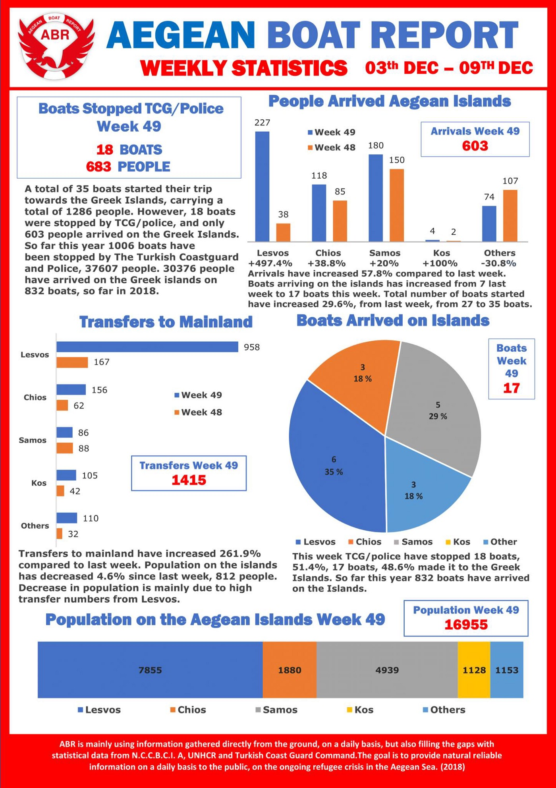
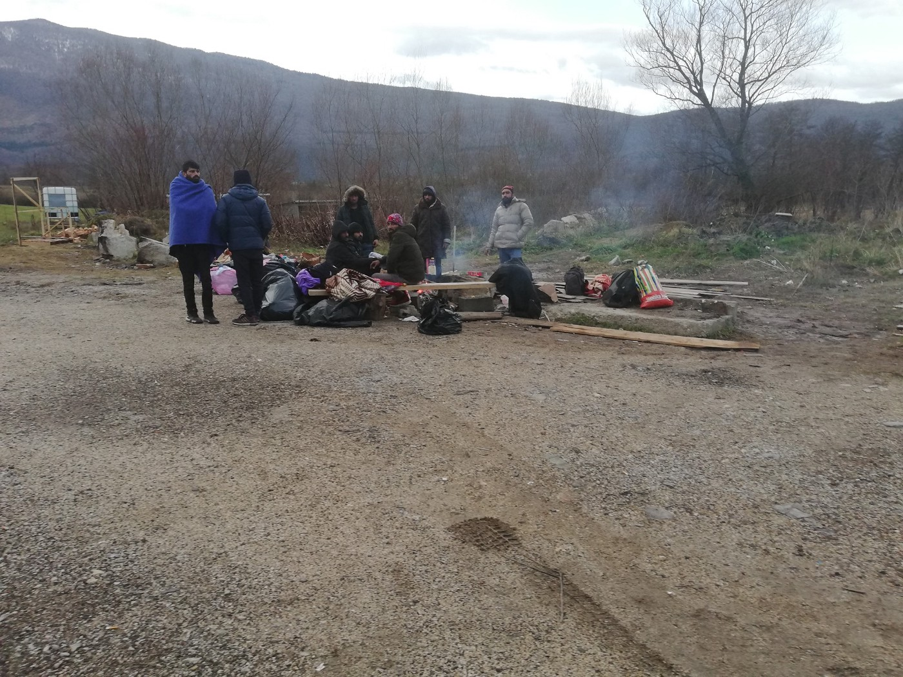
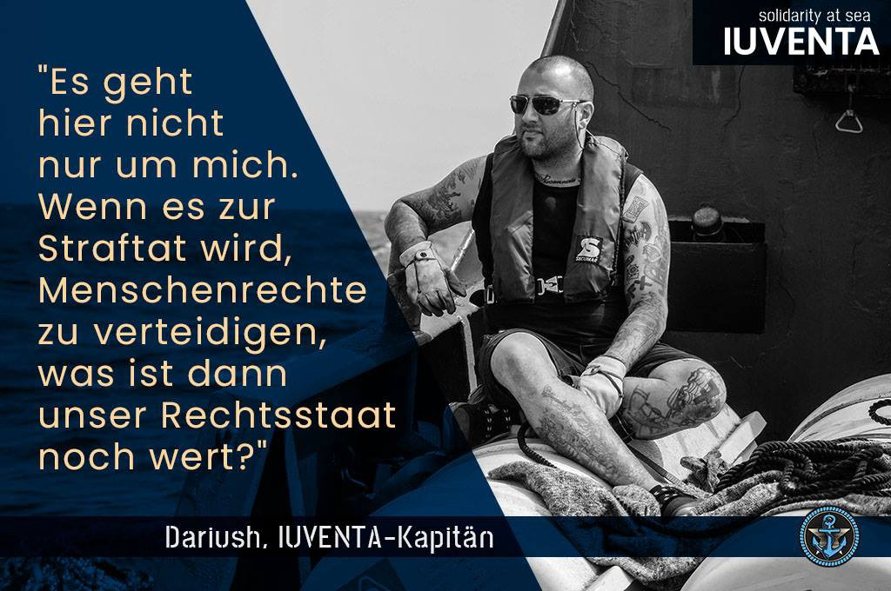
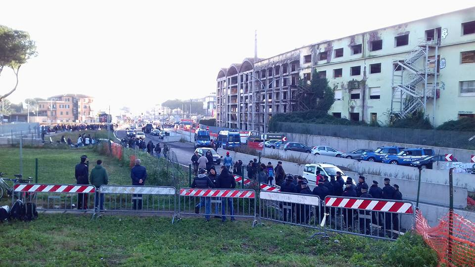
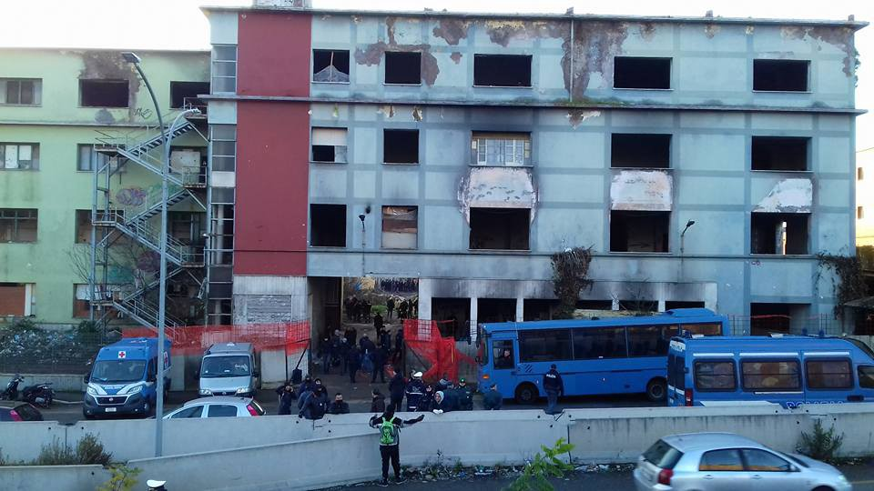
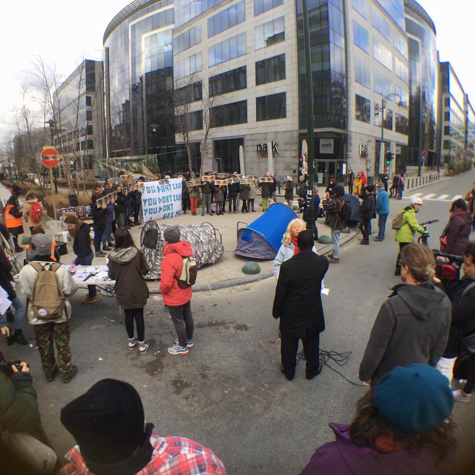
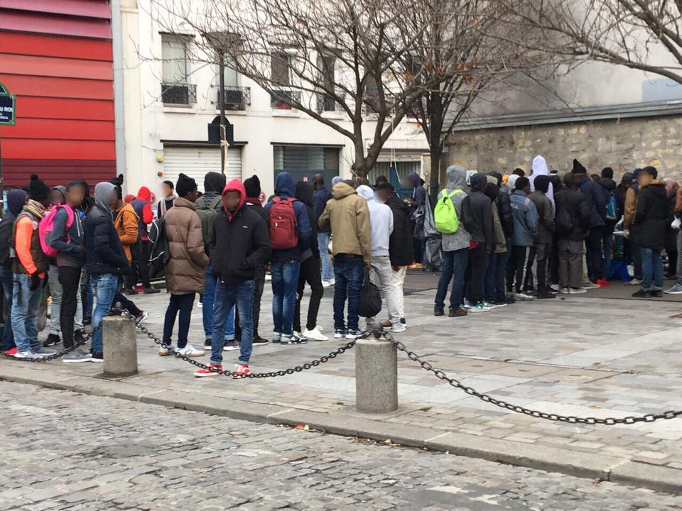
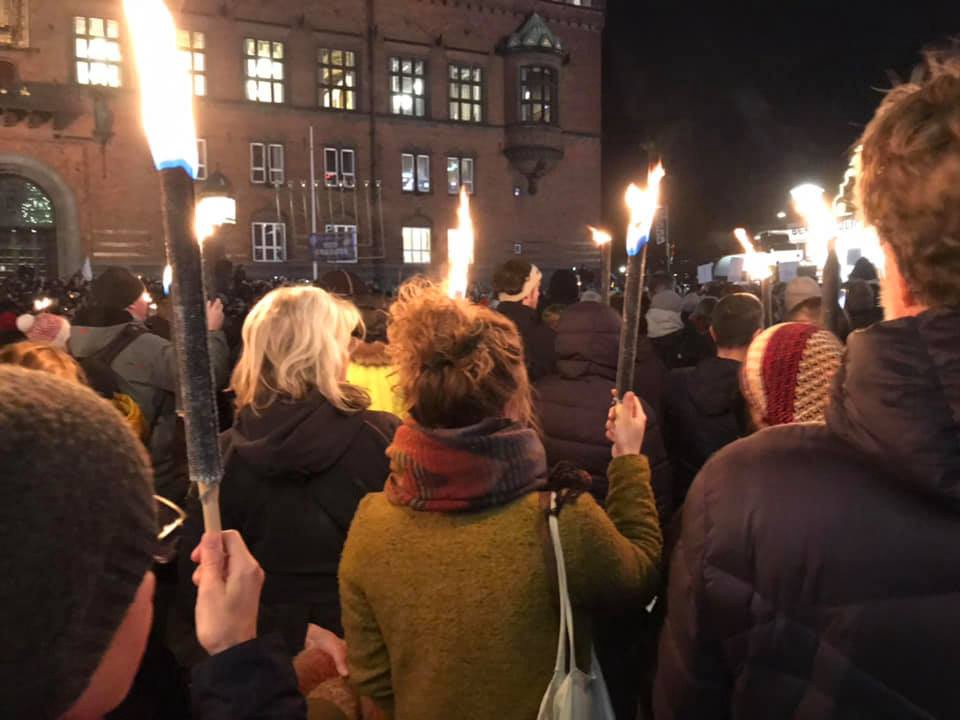
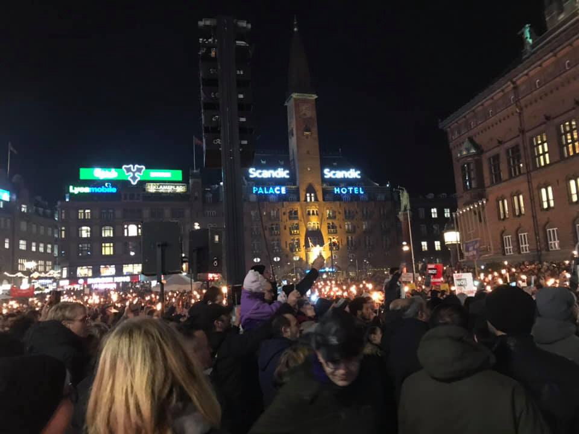

### AYS Daily News Digest 10/12/18: Human Rights — Nice anniversary, but no implementation
#### State of things for human rights of people fleeing danger and those helping them / Stansted 15 defendants guilty of terror charges / Demands for ‘decongestion’ on Samos / push backs on the increase from Hungary and Romania / MSF appeals to the UN in Libya / support protest ahead of the coming verdict in Briançon / violent treatment of refugees in Bosnia / more news

[Are You Syrious?](https://medium.com/@AreYouSyrious?source=post_header_lockup)

Dec 11

](assets/c18f22ae03d0/1*m0iEUZjgBuO54BCAWHZOJg.jpeg)

Photo: [FOTOMOVIMIENTO 15M](https://www.facebook.com/Fotomovimiento.org/?tn-str=k%2AF&hc_location=group_dialog)
#### FEATURE

The Universal Declaration of Human Rights was signed 70 years ago and today it makes for a beautiful occasion for many officials under different acronyms to show off at conferences and to recreate ‘historical photos’\. 
However, it is not the only historical thing they help to recreate and it does not look well for humans or their rights\. Ending the second decade of the 2000s with some of the basic rights being questioned for millions of people does not make this day a celebratory one, but rather a wake up call\.

> Today, it is especially dire for people fleeing violence and danger, and since recently, it has been getting tight for those helping them\. What used to be celebrated as a historical move of ‘being on the right side of history’ is today a criminal act\. 

Unfortunately, recent rhetoric and political discussion refer to people on the move as a homogeneous population, forgetting that it is an individual experience and story and that nationality, legal status and the motivation for leaving countries of origin vary widely from person to person\.
Regardless of why people have left their places of origin, they need protection from violence and exploitation and not the sort of treatment and approach we are witnessing in the Balkans and across Europe, which has strengthened corrupt officials, smugglers and criminal gangs who profit from vulnerable people whose only option \(that they know of\) is usually the one they are taking\. This violent and discriminatory approach to people fleeing their homes criminalizes them and pushes them into the hands of those who exploit them\.

> To talk or to be silent, to suffer or to respond to the violence, to constantly ask oneself how to trust the institutions which mistreat people\. — 

This is the case all across Europe — from the “organized” collaboration with Libya that tortures people, “organized” police violence in the north of France, “bouncers” of the EU on Croatian borders beating people up while “organizing” securitisation, to Salvini’s carabinieri in Rome kicking people out in “organized” raids and eviction, leaving at least 1059 people stranded in the streets of the city, open to exploitation by gangs\.

> It is now a question of continuing to denounce, be outraged, and demand justice, respect and rights for displaced people\. 

The rule of \(out\)law against people and, ultimately, in favour of criminals, seems to be an ongoing reality created by officials not capable of listening or of putting in place more humane policies\.

> Today, December 10th, is Human Rights Day\. And today, as on all other days, we want to draw attention to the human rights violations at the EU’s external borders\. The violence and arbitrariness to which refugees are subjected are not in line with the values that the EU propagates\. But it looks like a strategy of keeping the number of “illegal border crossings” low, as this article in the New York Times suggests\. Today, we would like to ask you one question: On whose behalf is this happening? — [_Rigardu e\.V\._](https://www.facebook.com/rigardu/?__tn__=%2CdkCH-R-R&eid=ARA8VATsbr3UiVvgBQ2K8aC7CWDFskxEc2HHfwak1ajMhLFZGPzmkalLrGyE7k-8ksICI6SMwZFAC6Lz&hc_ref=ARS7goqsv0-HIgw7WoDjfXAaJoIIiV0g3jbi7SkHl_sjqwEF6MZ1Vb9ioSYTRcjkPyA&fref=nf&hc_location=group) 

#### GENERAL

United Nations agencies and NGO partners released the 2019–2020 Regional Refugee and Resilience Plan \(3RP\), a USD 5\.5 billion plan designed to support national efforts in **Turkey, Lebanon, Jordan, Egypt and Iraq** to deal with the continued impact of the **Syria crisis** \. According to the 3RP, they _plan to implement a wide\-ranging response targeting over nine million people across the five countries\. Such support includes helping to address on\-going protection challenges for refugees, getting more children into some form of education, enhancing basic services and economic opportunities, especially for women, and leveraging the expertise of 3RP partners to strengthen the response capacity of national and local actors\._ 
Go [here](http://www.3rpsyriacrisis.org/?utm_source=hootsuite&utm_medium=twitter&utm_term&utm_content&utm_campaign) for more information and a link to their annual report\.
#### LIBYA

■■■■■■■■■■■■■■ 
> **[Sally Hayden](https://twitter.com/sallyhayd) @ Twitter Says:** 

> > Three detainees taken forcibly from a detention centre in Khoms on Friday still haven’t come back. Others there think they’ve been sold to traffickers. They say seven people have been taken in total since they were screened by UNHCR in August. [twitter.com/sallyhayd/stat…](https://twitter.com/sallyhayd/status/1071173258622451714?s=21) 

> **Tweeted at [2018-12-10 10:34:23](https://twitter.com/sallyhayd/status/1072077057390272513).** 

■■■■■■■■■■■■■■ 

#### MALTA

As confirmed to AYS volunteers last week by residents of the camp, women staying at a centre for migrants have been moved to the men’s compound in Ħal Far because of overcrowding\. This situation is temporary, and the women will be transferred back to Dar il\-Liedna or another centre once accommodation space is once again available, the ministry spokeswoman said to the [media](https://www.timesofmalta.com/mobile/articles/view/20181210/local/lack-of-space-pushes-migrant-women-into-mens-compound-in-hal-far.696349?fbclid=IwAR2v5G1a1HFDehJsF0YLJCmiLQhrrv6k9NXAk3Gsn_ML9CwHyj4N0Mq-Yps) \.

■■■■■■■■■■■■■■ 
> **[Marc Tilley](https://twitter.com/TilleyMarc) @ Twitter Says:** 

> > One week after #NuestraMadreLoreto was allowed to disembark in Malta, following 10 days adrift with @[openarms_found](https://twitter.com/openarms_found), 12 rescuees will be leaving Marsa Detention Centre tomorrow to continue their asylum applications in the safety of Spain. 27 from the same rescue were not so lucky https://t.co/rI7O0bugXH 

> **Tweeted at [2018-12-10 18:18:17](https://twitter.com/tilleymarc/status/1072193802239205377).** 

■■■■■■■■■■■■■■ 

#### GREECE

### Chios

 \)](assets/c18f22ae03d0/1*oaR7wkI_sEHQ5KVisH-ReA.jpeg)

“ distributing toiletries to more that 70 families on Saturday the new arrivals told us that they have lost everything on their journey”, volunteers write \(Photo: [Janne Hegna](https://www.facebook.com/janne.hegna?__tn__=%2CdlCH-R-R&eid=ARAPR1MfqxiZYFz4kPwYVwwBhyX2NDmm2d6PcYBRTB2e53OF0clImyot1GMp7RSHGRWJ-nutYVYOGlLH&hc_ref=ARTFktUgbyp7yK30tqC5cvuLEMSgyHvgfTbJeM_tRvE9NDLE887HQ1HqQE33h8cmDRQ) \)
### Demands for ‘decongestion’ on Samos

An out\-of\-court protest against the Minister of Migration and the administrator of the Samos CBC was filed by the Bar Association of Samos and co\-signed by 11 Samos based organisations, [RefuComm](https://www.facebook.com/refucomm/?__tn__=kC-R&eid=ARDJ_W6z1GFA17MaxUzNHbv8OYZclvxA2n3yRtS5W5RSQUNVmpAZ44JThuLd2WPe1xavV3EykNeFX0av&hc_ref=ARSJ88Mo5lnPxAwtoWrHRV2vavO4B7p8P-EhkFNNLjSTrHxGgLA8ecuw8zXSNeiJyXk&fref=nf&__xts__%5B0%5D=68.ARCPfcPPozdh62jVtGRszPjenGACZI_KPTa_cUj6xzVj-AKyDaw7aYzpv55E0jn-a7r20OFOQguPiLhI-VIu-1kdeqcVcTT5aRhh4d2s3qh4kYmXSakdwpIyE4BlR_XMhSAU0cNF7ziUhJYhcnFBCzsBLiY1hOGWzzhvbfAl0O-J_hKlXRGXYTtX4d2amGc9Rz6cCUuopslWpxS07tUUe--CUa1wV1Fz8q4BmrR_jPyd8QFx9dQhwkj0Sb8w6q6SqpzqdArpJbNbN8Qs-GOZfZIx11E-FhQzWICcYCKd-I2QWpMh3CLgrpQeo4ISIEpSTjJRUBEdoeODNvWZiSyoYT0) reports\.

The Associations demand:
- The immediate removal of at least 2,500 refugee migrants and the decongestion of the Samos CBC\.
- Immediate expulsion of offenders and immigrants whose appeals were rejected and still remain in the city\.
- The implementation of the Geneva Convention and the international rules and conventions on refugees and immigrants\.
- The implementation of administrative laws relating to safety, health and the environment\.

### Athens

Blankets, clothing and information about organized shelters will be given to all the vulnerable groups in the streets of Athens during the upcoming cold days, officials announce\.

> **_A heated hall will be open to the public at 66 Sophocleous Street this weekend\._** 
 

> **_People in need can call the help number 1595 for information\._** 

### Praxis closing down?

NGO management of Praxis “dismisses 130 colleagues & leaves 150 minors to their fate”, [NoBorders‏](https://twitter.com/Refugees_Gr) team reported\. AYS is still waiting to receive an answer to what is going on and we will report on that as soon as we know more\.
#### SERBIA

752people were registered in November with the intention of seeking asylum in Serbia, 34 people initiated the procedure by actually submitting the application, and one person was granted asylum, Info Park reports\. 
The number of reported collective expulsions fell from 1,839 in October to 1,001 in November\. While reported push backs are on the decrease from Bosnia\-Herzegovina and Croatia, they are on the increase from Hungary and Romania\. Still, just like in October, the biggest number of pushbacks reported in November was from Croatia \(660\) \.
#### BOSNIA AND HERZEGOVINA

Alarming news coming from several sources speak of employees of the private security company Bakrac, engaged by the IOM in the camp BIRA near Bihać, using force against the people in the camp, including minors\. 
Sources claim that on Sunday, two security guards were beating up a 15\-year\-old boy\. Some other boys were taken away by the security and beaten up behind the buildings or in front of the camp\. 
Private security companies have been contracted in all of the official camps ran by IOM and reportedly there is no presence of the police\. 
As people working for these private agencies have no professional training on how to work with vulnerable people, and they are not aware of the UN protocol for working in the camps, it is not clear why and how IOM made the decision to subcontract private security agencies in this EU and UN\-funded mission\. We hope to receive their official comments on this worrying information reaching our team in the past days\.
### Internal push backs

The police from the Bihać area continues with internal push\-backs, trying to prevent people from entering the city and the area\. On Sunday, which was rainy and cold, a group of nine men were left by the roadside near Ključ\. The night before, according to their statements, they were beaten up by the Croatian border police, who confiscated their money and phones, and pushed them back to Bosnia\. After walking for hours, they entered Bosnia only to be stopped by the police and pushed back toward Sarajevo, near Ključ\. When the AYS team found them, they were lost, frozen and completely disoriented\.

> They told us they had previously stayed in Bihać, where they were registered in one of the official camps run by the IOM, but they left for ‘the game’\. According to the rules, people who leave and try to cross but do not make it can come back to the camp, but the local police did not allow it\. In Ključ, they were left by the roadside\. Local Red Cross volunteers assisted them\. 

This practice of internal push backs started in October\. The police in Bihać claims they do that due to the lack of accommodation capacities in the area\.

Photo: AYS

[Umino](https://www.facebook.com/umino.org/?tn-str=k%2AF) is preparing for another much needed donation trip to Velika Kladuša\.

#### SEARCH AND RESCUE AT SEA

■■■■■■■■■■■■■■ 
> **[MISSION LIFELINE](https://twitter.com/SEENOTRETTUNG) @ Twitter Says:** 

> > 70 years of the Universal Declaration Of #HumanRights: 16,958 lives lost to a cruel EU border policy. Many more unreported, or forcibly returned to a future of systematic abuse. When our friends are targeted for bringing compassion to this cold, unforgiving world, we stay defiant https://t.co/grKuzHS3Eq 

> **Tweeted at [2018-12-10 12:44:17](https://twitter.com/seenotrettung/status/1072109747199971328).** 

■■■■■■■■■■■■■■ 

Human rights defenders need your support, today more than ever\.

### Indefinite arbitrary detention for those found at sea and brought back to Libya

More than 90 people rescued in the central Mediterranean Sea last month by the merchant ship Nivin are still being held in [Libya](https://www.doctorswithoutborders.org/what-we-do/countries/libya) after they were forcibly removed from the ship by Libyan security forces in Misrata\.

Teams from Doctors Without Borders/Médecins Sans Frontières \(MSF\) [reportedly](https://reliefweb.int/report/libya/refugees-and-migrants-forced-disembark-libya-are-still-risk?fbclid=IwAR1hkvdjzaOOx3iXh3owpGSLCn-E9a9U6q3vY9E24lZKW1yL7Fw_QQyfzZE) carried out more than 90 medical consultations on board the Nivin, treating chemical burns caused by a mixture of spilled fuel and seawater, skin infections, and generalized pain\.
The [MSF program manager for Libya wrote an open letter today to Ghassan Salamé, special representative and head of the United Nations support mission in Libya](https://reliefweb.int/node/2910078) ,

> “\(…\) by refusing to set foot again in the prisons of Libya, were upholding their rights — the right to flee, and the right to seek protection and land in a place where their claims could be examined and their lives would not be in danger\.” 

■■■■■■■■■■■■■■ 
> **[MSF Sea](https://twitter.com/MSF_Sea) @ Twitter Says:** 

> > 2015: High Rep &amp; VP of EU Commission @[FedericaMog](https://twitter.com/FedericaMog) assures #UNSC that "no #refugees or #migrants intercepted at sea will be sent back against their will."

2018: EU enables Libyan coastguard to intercept more than 14k and forcibly return them to #Libya.

#HumanRightsDay https://t.co/oJPouNKasF 

> **Tweeted at [2018-12-10 14:36:11](https://twitter.com/msf_sea/status/1072137909107593216).** 

■■■■■■■■■■■■■■ 

■■■■■■■■■■■■■■ 
> **[Sea-Watch International](https://twitter.com/seawatch_intl) @ Twitter Says:** 

> > Since 8 o'clock this morning, on #HumanRightsDay, @[seawatchcrew](https://twitter.com/seawatchcrew) is recalling every single one of the 800 confirmed dead at Europe's #Mediterranean border. For they are #OurDead. [our-dead.eu](http://our-dead.eu) 

> **Tweeted at [2018-12-10 09:19:14](https://twitter.com/seawatch_intl/status/1072058147441913858).** 

■■■■■■■■■■■■■■ 

#### ITALY
### Eviction in Rome

To start off the Human Rights day, at 5:30 in the morning the Italian police started an eviction in Rome\.

](assets/c18f22ae03d0/1*abT9ufgJ3vl6uMaBtTBnCg.jpeg)

Photo by: [Melting Pot Europa](https://www.facebook.com/meltingpoteuropa/?tn-str=k%2AF)

Dozens of trucks and armored police and Carabinieri were in front of the structure occupied in Via Tiburtina as the former Penicillina factory was cleared out, though by that time reportedly most of the people and things were already out of the premises\. The people who used to stay there are mostly asylum seekers, people under international protection, people whose residency status was irregular and migrants previously forced out of the official centres\.

](assets/c18f22ae03d0/1*3Vhbd4VM7F-dzIg0wcyzLQ.jpeg)

Photos from Rome by: [Melting Pot Europa](https://www.facebook.com/meltingpoteuropa/?tn-str=k%2AF)

Around 100 people were reportedly inside when the eviction started\.
Until recently, about 600 people were [reportedly](http://www.rainews.it/dl/rainews/articoli/roma-al-via-lo-sgombero-ex-penicillina-migranti-in-strada-con-bagagli-0e1d98b4-94c7-4bef-aa3a-15a7791fcf02.html?fbclid=IwAR3LeQzHmNuqQlA9e6TAOF7vGNv4djuPwn1TyIxnvNCBfrNV6ERI0xaxxwc) staying at the facility\.
Alternative lodging was mentioned, but no concrete places were named\.
Apart from many refugees, Italians of ‘weaker social status’ were also living there, all together marginalized people not many are willing to stand up for\.

“In the coming weeks, more evictions are planned in Rome and in many other Italian cities\. From words to deeds “, said the Italian minister Salvini\.
If you want to know more, don’t read his statements, ask [Alterego — Fabbrica dei diritti](https://www.facebook.com/fabbricadeidiritti/?__tn__=%2CdkCH-R-R&eid=ARB-qd1uuPlGtVfWNsAHnJU4yrF6B-kwYB0ZZUjH9Cv9xXcxMRk1oJtZug8_Ci1TeIkvIYtQIZlSUkuC&hc_ref=ARSKYbhkiEkGl6bKlzY2uZ1dzfVEIwTtKFH05AO5b6hCGpbT1ZkSJwg13AjvX0nMzNI&fref=nf) , they know\.

Who will stand up for their human rights or ask about these people days after the noise around the eviction is silenced?
#### FRANCE
### On Human Rights Day, a reminder of the [report](https://docs.wixstatic.com/ugd/5eb73a_ae875cd65dcc434588a7a69ed4cf3167.pdf?fbclid=IwAR2t4GYvfVoozVVu0mR_0TuG0zGbt-Yabem8z-GD45GTrXtAR7QYFai9q4c) that exposes a year of poor treatment of displaced people in Calais

The authors of this report claim that “in Calais, the use of force is not proportional, nor necessary, and the maintaining of order has become a pretext to justify all the abusive activities\.”

> This report gives recommendations regarding the current unsustainable situation in northern France, characterised by violence and widespread human rights abuses against displaced people\. 

**Detention** : a high numbers of arrests of displaced people, who were subsequently transported to the police station in Coquelles, sometimes held for several hours before release without any information, or often placed in the neighbouring detention centre

**Disproportionate use of chemical agents:** Between 1st November 2017 and 1st November 2018, 244 acts of police violence against displaced people were reported to our volunteers, in and around Calais, and 153 of these incidents involved the use of a chemical agent upon displaced people\.

**Violence — physical and psychological:** The most frequently reported types of physical violence reported were those of kicking, punching, and beating with police\-issued batons\. Over the period of study, 124 reports of physical violence by police officers against displaced people were made to volunteers, with many individuals requiring medical attention as a result\.

> “Exhaustion plays out as a combination of repeated forceful spatial displacement and the stretched temporality of years of uncertainty which is not resolved after being granted official protection\.” 

**Intimidation and harrasment** : volunteers often received reports of verbal intimidation and aggression from police officers, such as threatening displaced people, or telling them to go back to their countries\.

**Damage, destruction and confiscations / theft of personal belongings:** police officers throwing displaced people’s belongings, in addition to association property, such as water barrels, on top of campfires\.

37confiscations were documented over the period of study, as well as 61 reports of destruction of individuals’ belongings\.

**In order for violent practices that violate human rights to cease,** 
**we ask for:** 
**• An official reminder to the police of the ethical obligations incumbent upon them, and the limits of their legal framework for intervention\.** 
**• Regular information for displaced people regarding police operations, in languages accessible to them, from state authorities\.** 
**• The organisation of regular, independent missions that observe and monitor police practices\.** 
**• Facilitated access to information about their rights, complaints and psychological care, notably for victims of violence\.** 
**• The opening of dignified reception and accommodation facilities in Calais, with additional resources allocated to the protection of children\.**

Find and read the entire report [**here**](https://docs.wixstatic.com/ugd/5eb73a_ae875cd65dcc434588a7a69ed4cf3167.pdf?fbclid=IwAR2t4GYvfVoozVVu0mR_0TuG0zGbt-Yabem8z-GD45GTrXtAR7QYFai9q4c) \.
### Briançon

In solidarity with the French people prosecuted for helping people on the move, a gathering ahead of the coming verdict, planned for December 13, will be organized in front of the court in Briançon \(Hautes\-Alpes department in the Provence\-Alpes\-Côte d’Azur region\), along with a press conference\.

> Our mountains will not become a cemetery\! 

](assets/c18f22ae03d0/1*8ABt7nvHvIuzMX8I3FtjEw.jpeg)

by: [HDR 05](https://www.facebook.com/hauteduranceenresistance/?tn-str=k%2AF)

](assets/c18f22ae03d0/1*GaizGoeEQjwH-X-ROHgEGw.jpeg)

Protest photos: [L’Auberge des Migrants](https://www.facebook.com/AubergeMigrants/?tn-str=k%2AF)

“The December version of ‘The Asylum seeker’s Guide to Paris’ is [here](https://guideasile.wordpress.com/?fbclid=IwAR1Yj59IzMLjtYcRrG8px9zyg6ffMeFBETauVtzfUrJfp7YNS4kf_J-8gwc) \!
It is available in French, English and Arabic on our website: [www\.guideasile\.wordpress\.com](https://l.facebook.com/l.php?u=http%3A%2F%2Fwww.guideasile.wordpress.com%2F%3Ffbclid%3DIwAR2o22BbNGDT6ZSF9BpI2CAu5LoWyW_hOYsPFlgGpSSnfLr2B_TXUS-g70Q&h=AT3A0XDoh-c3fGBl25IQzm_n26TEROWAISpFl6A6tNYo7CF7Hw7HRA5yPjwA47kgX3gaC2XQZ_rskHXO36MG3cmnjPz_wDSTx-PLr4lTlK-JiaG1YGJr5YYSeeDPJatdtA) 
People in exile can download the guide very quickly if they have a smartphone\. We also print the guide in paper format; in several hundred copies each week\. If you are in exile, you know exiled people to whom the paper version would be useful and / or if you want to distribute the guide, we can give you the guides in paper format\.
Have a nice week\!”

 \)](assets/c18f22ae03d0/1*5uVOCQjoZ_49oIJudiVxFQ.jpeg)

Young people in the lines for food distribution are larger in numbers, SAJE groups reports \(Photos: [SAJE](https://www.facebook.com/lesajeparis/?__xts__%5B0%5D=68.ARAb-qY58KAoMfRvFDrm-0DQN03kW5TScv3izTMV1PmKRzlefU7S5Oy3tFORQDJqzTic5BgSs78t1zAxKNCE3ee8e1GxkURle9kwQSWUsW_JUdx7ZoJCgiL5VvFWhDwRlHios8CJuyURMHcgElcbboTSNt7Z6IQlagzIBGNlwNc9Dx2orYlLKm0Udz2rOp3bJ6lyd91qIX94DnSbcHHIusGJUKc-yxqgM3N2ViKz8Z4e0EBQ2FgPztEpwxpe7z4ibgBgv_0RKlpLZPZwQm1YSHE3bhXeO4xPhmTp_s9bzJpUBt0EnnESI9CfRRH3U50mGiJp8beXkmKFKrwH2p484JEbOeBcwfHQP7QkUlm9XmyUEba_1Hga4s8&__tn__=k%2AF&tn-str=k%2AF) \)

[Solidarité migrants Wilson](https://www.facebook.com/Solidarit%C3%A9-migrants-Wilson-598228360377940/?__tn__=%2CdkCH-R-R&eid=ARCVEvbmkO2upjCGbjmQ-gzpqKYqQmAMSJk9aYoeeeOIkln5Dk5n-RzyojYxlxXINPrNPP5OYm7DEqVZ&hc_ref=ARQXKX30kHL56oVhN1iAm08aW0YgDgy8VCzt53OXXuvoZILxPxaR7lNiz9y6W9ByA3o&fref=nf) announces hot food distribution at the church of Saint Geneviève at 139, avenue du Président Wilson 93210, La Plaine Saint Denis\. Volunteers willing to help can come at 19h45 in order to organize the distribution\.
Whoever can contribute with fruit, water, juice, hygiene packs — always welcome\!
#### GERMANY

The State Office for Refugee Affairs \(LAF\) systematically delays registration, medical care and asylum procedures for the newly arrived in Berlin, [Flüchtlingsrat Berlin](https://www.facebook.com/Fl%C3%BCchtlingsrat-Berlin-109674169087407/?__tn__=%2CdkCH-R-R&eid=ARB8CSA3P7ckH12nI6dO1KJMPNKb4e_7NRhZhLQ54VYp3jeSOL0K0gCoE9BZ5NWSOReVs-MMT2dj7ARy&hc_ref=ARRLF2VTz4DxuMY6lhnsM0qNfc3WuAzNbRFTZmU5nhe0kDBlwSqIi5vrtt1hL_q5evc&fref=nf) reports\. For weeks, asylum seekers have to wait under dehumanizing circumstances in the emergency shelter of the “arrival center” in the hangar of Tempelhof Airport\. During this time, they do not receive access to healthcare and social benefits under the Asylum Seekers Benefits Act\.
#### DENMARK

](assets/c18f22ae03d0/1*AOEm2cWoLAAiIRQO-QwDPg.jpeg)

Protests in Denmark, photos: [Camilla Lynge](https://www.facebook.com/camilla.lynge.16?__tn__=%2CdlCH-R-R&eid=ARB6QYq2jMQE0WdglfRkXfbAhnfHmGY1EEZnReyGJNSe8do7OOqEuuy_MQd_XxsLXBzRJ61Jy0pMSDIR&hc_ref=ARTr0QanWKeFFksFwXVYVKwJNR4dA6ZqfKhL7F2zmqnVRkiFFwz6JA3fR8RsMhilCRU)

As we reported earlier, the political atmosphere in Denmark has greatly changed and has affected some of the most basic human rights of the refugees and immigrants especially\. Here are some of the [answers to the most common questions](http://refugees.dk/en/news/2018/december/new-restrictions-for-refugees-in-the-finance-act-2019/qa-for-refugees-right-now/?fbclid=IwAR0ttnsUzRxHi8GRKKAkVNQJAPGqyQYFZaSWYJhXW1PdyJOXaQWrkVFEAAo) asked by refugees:

> **_What is the risk of being sent back if you are still in danger of persecution?_** 
 

> _If you have asylum pursuant to article 7\(1\) you are still reasonably safe here\. But they could call people in for an interview and decide that you are no longer in danger according to the Refugee Convention, if the situation in Syria changes \(for example if amnesty is given to people who fled form military service\) \._ 

> **_\- Do you think Syria will be considered a safe country for returns in the short run? \(months, few years\)_** 
 

> _Yes, some areas will probably be considered “safe” quite soon, so that people with asylum under art\. 7\(3\) can be returned\. But it might take a long time to actually carry this through in practice\. And all cases must go through Refugee Appeals Board first\._ 

> **_Which advice do you have for the ones with refugee status in Denmark right now?_** 
 

> _Continue your education or job\! No matter if you are going to stay or go back, it will be an advantage\. If you are still here legally after 8 years you can apply for permanent residence \(after only 4 if you live up to ALL of the hard conditions \+ the supplementary ones\) \. Some will be able to get it\. As far as we can see, it will still be possible to apply for permanent residence if and when you live up to the criteria, even if it says “med henblik på midlertidigt ophold” on your residence card\. — by refugees\.dk_ 

#### UK
### Stansted 15 defendants guilty of terror charges

Following guilty verdicts today in the case of 15 people tried in relation to their attempt to prevent what they believed was the unlawful deportation of a group of people at Stansted Airport last year, [Amnesty International has reiterated its strong concern](https://www.amnesty.org.uk/press-releases/stansted-15-verdict-crushing-blow-human-rights-uk?fbclid=IwAR1nwBRzqiN1GgTpA0n5AR0ny5PwWB3U6fgD_mixLfl4YFvrTSQ4EP264B4) over the decision to charge the human rights defenders with a terrorism\-related offence\.

> The 15 people — known as the “Stansted 15” — took non\-violent direct action at Stansted in March 2017 to prevent the deportation of 60 people on a charter flight bound for Ghana and Nigeria\. 

The Stansted 15’s actions prevented the flight from leaving\. Of the 60 individuals due to have been deported, ten are currently pursuing asylum claims in the UK, and at least one has since been granted permission to remain in the UK\.

Amnesty has launched a [solidarity campaign](https://www.amnesty.org.uk/write-for-rights/action/stansted-15?utm_source=TWITTER&utm_medium=social&utm_content=20181210125100&utm_campaign=Write+for+Rights&post_ID=1980807562) with the 15 who are now facing possible lengthy prison sentences\.

More [support statements](http://www.lgsmigrants.com/?fbclid=IwAR07sgeH66Mzi3cz0YfzXOXiUOxd5VJ5BRBklNbdX0q7Qe-F_pwXywErppk) followed\.

■■■■■■■■■■■■■■ 
> **[End Deportations](https://twitter.com/EDeportations) @ Twitter Says:** 

> > The #Stansted15 have been convicted under terror-related legislation - for preventing an unjust and barely legal deportation flight. https://t.co/Pgtv4d83VH 

> **Tweeted at [2018-12-10 12:34:17](https://twitter.com/edeportations/status/1072107231460642816).** 

■■■■■■■■■■■■■■ 

Speaking of human rights, everyone has the right to information in languages they understand and in accessible formats for people who don’t read\.
What we can do so far is to also publish a **weekly overview in Arabic and in Persian** of some of the most important stories we covered during the previous week\.

Here is the [Arabic Weekly News Summary for the week of December 3–9](%D8%AE%D9%84%D8%A7%D8%B5%D9%80%D9%80%D9%80%D9%80%D9%80%D9%80%D9%80%D9%80%D9%80%D9%80%D9%80%D8%A9-%D8%A7%D9%84%D8%A7%D8%B3%D8%A8%D9%80%D9%80%D9%80%D9%80%D9%80%D9%80%D9%80%D9%80%D9%80%D9%80%D9%80%D9%80%D9%80%D9%80%D9%80%D9%80%D9%80%D9%80%D9%80%D9%80%D9%80%D9%80%D9%80%D9%80%D9%80%D9%80%D9%80%D9%80%D9%80%D9%88%D8%B9-%D8%A7-%D9%8A-%D8%B3-30ad27d6325a) \. 
Find here the [Persian Weekly News Summary](%D8%AE%D9%84%D8%A7%D8%B5%D9%87-%D9%87%D9%81%D8%AA%DA%AF%DB%8C-%D8%AE%D8%A8%D8%B1%DB%8C%D9%87-%D8%A2%D8%B1-%DB%8C%D9%88-%D8%B3-%D8%AA%D8%A8%D8%B9%DB%8C%D8%B6-%D8%AE%D8%B4%D9%88%D9%86%D8%AA-%D9%BE%D9%84%DB%8C%D8%B3-%D9%88-%D9%82%D9%88%D8%A7%D9%86%DB%8C%D9%86-%D8%B6%D8%AF-%D9%85%D9%87%D8%A7%D8%AC%D8%B1%D8%AA%DB%8C-1a44a0e29978) for the same week\.
Please, share it with your Arabic and Persian speaking friends\.

**We strive to echo correct news from the ground through collaboration and fairness\.**

**Every effort has been made to credit organizations and individuals with regard to the supply of information, video, and photo material \(in cases where the source wanted to be accredited\) \. Please notify us regarding corrections\.**

**If there’s anything you want to share or comment, contact us through Facebook or write to: areyousyrious@gmail\.com**

_Converted [Medium Post](https://medium.com/are-you-syrious/ays-daily-news-digest-10-12-18-human-rights-nice-anniversary-but-no-implementation-c18f22ae03d0) by [ZMediumToMarkdown](https://github.com/ZhgChgLi/ZMediumToMarkdown)._
