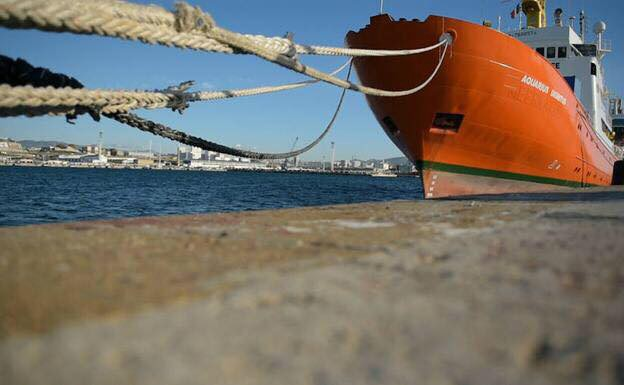
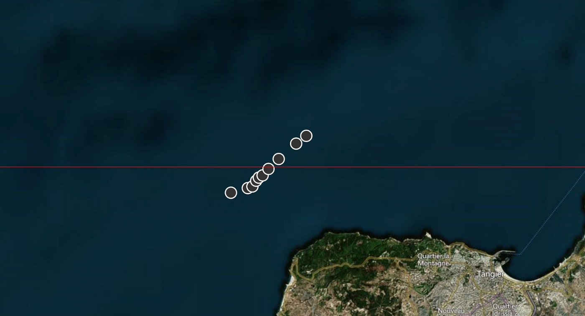
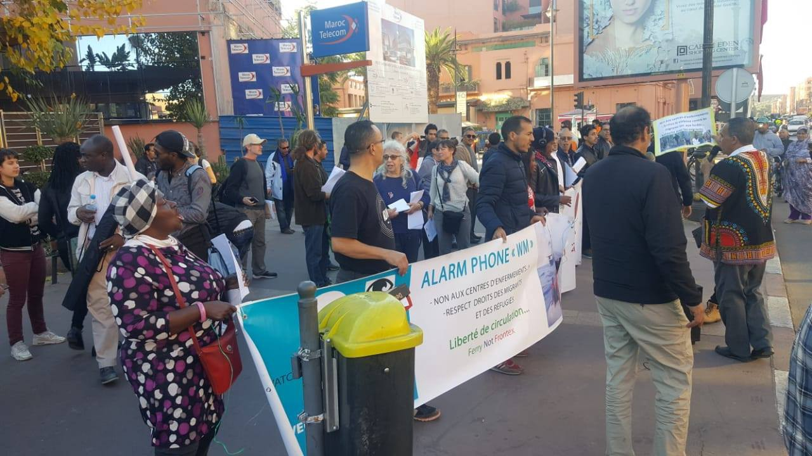
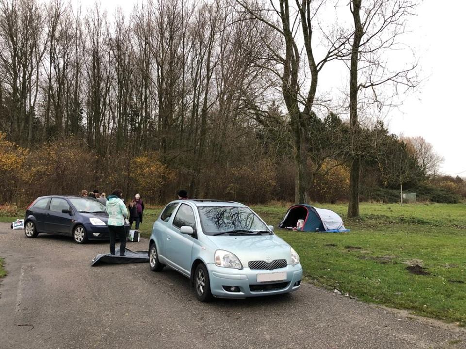

### AYS Daily News Digest 12/12/18: Criminalisation of sea rescue continues

_Afghan man murdered near Moria//”Difficult conditions” in Nador detention centre//Temperatures continue to drop in northern France and in the Balkans//_

Proactiva Open Arms
### Criminalisation of sea rescue continues

Proactiva Open Arms states that the prosecutor of Ragusa in Sicily has published the conclusions of investigations against its captain and head of mission for events that happened last March, leading to a new accusation of “facilitating illegal immigration” \. Proactiva Open Arms denounces the criminisalisation of rescue organisations, while migrants that end up in Libya continue to face violence and human rights violations\.

MSF has already been forced to stop search and rescue operations in the Mediterranean Sea\. In a [speech](https://www.msf.org/migration-not-crime-saving-lives-not-crime) , MSF President Johanne Liu said European governments “have actively sabotaged the efforts of others to save lives”:

> We must face reality: inhumane policies designed to deter migration do not stop people on the move\. These policies strengthen the corrupt officials and criminal gangs who profit from vulnerable people\. These policies criminalise and throw vulnerable people into the hands of those who ruthlessly exploit them\. 

> Whether these policies are simply ill\-informed or are the manifestation of deliberate collusion with corruption and criminality, the end result is the same: they fail to stop migration — and they kill people\. 

2,160 people have been reported dead or missing so far in 2018 in the Mediterranean according to the IOM\. [Migrants at Sea](http://migrantsatsea.org) notes that Operation Sophia has only rescued 106 people over the past five months whereas the Libyan Coast Guard has intercepted and pulled back over 14,000 migrants and refugees in 2018\.
#### Morocco/Spain
### Alarmphone warns of dangerous situation near Morocco

Photo by Alarmphone

Watch The Med Alarmphone says it has been warned of a dangerous situation for seven people aboard a boat leaving from Morocco\. The people called at 5:30 in the morning on Wednesday, saying they had lost control of the boat\. Spanish authorities said they could not do anything as the boat was still in Morrocan waters while Morrocan authorities did not answer at all\. Later, GPS data showed that the boat had moved into international waters, allowing a rescue by Spanish authorities\. The Alarmphone’s calls for rescue however have been ignored\. This report was published early Wednesday morning and it is unclear whether the boat has been rescued or not\.

61,093 people have arrived to Spain until 9 December, up 132% in comparison to the same period last year according to UNHCR\. Between January and October, 21% came from Morocco, 21% from Guinea and 16% from Mali\.
### “Very difficult conditions” in Nador detention centre

The Nador [Association Marocaine des Droits Humains](https://www.facebook.com/AmdhNador/?__tn__=%2CdkCH-R-R&eid=ARD0cBFb_yJbBVoe7zBLRO4-i4RD_z092LoUcckyrQQ9ALDXhAxQ84AMXi8J2jAn8CfCdvLDFS8qzsFR&hc_ref=ARQu425FZnZ26oJHCpFSimleVSZntboIV54NnLzhjj6INZr58pj_bqRY2WyaEocRoN8&fref=nf&hc_location=group) has published a video showing conditions in the local detention centre\. It says that the ten rooms are overcrowded, with even sick migrants detained in “very difficult conditions”\. Two of them are extremely sick and without adequate care\.

### Protest against migration compact in Marrakesh

Photo by Alarm Phone

Alarm Phone protested against the Global Compact for Migration in Marrakesh:

> “Hundreds of activists came together in order to protest against the international pact on migration\. Thanks to the efforts of civil society, this counter\-summit with its more than 110 activities was a key moment in the struggle for the freedom of movement”\. 

At the end of the event, the participants signed a declaration denouncing the Marrakesh migration pact and the migration policies of the countries from the global north and south\.
#### Greece
### 40 people reach Lesvos

A boat with 40 people was picked up by Frontex in Lesvos south on Wednesday morning according to [Aegean Boat Report](https://www.facebook.com/AegeanBoatReport/) \.
### Afghan man murdered near Moria

[Ekathimerini](http://www.ekathimerini.com/235619/article/ekathimerini/news/dead-man-near-moria-believed-to-be-22-year-old-afghan) says a 22\-year\-old Afghan man was found dead on Wednesday near the Moria camp\. According to local reports, the man had been attacked by a group of assailants\. The attackers are said to have stolen €90 in cash that the victim had been carrying, though it remains unclear if robbery was the motive for the assault\. There is a strong police activity surrounding the Moria camp as a result according to activists\.
### Volunteers needed

Medical Volunteers International is urgently looking for doctors in January for its locations in Thessaloniki, Lesvos and Athens\. For more information check out their [website](http://www.medical-volunteers.org) or send your CV to their team\-coordinator Kai: kai@medical\-volunteers\.org\. Other volunteer needs can be found on [Greecevol](https://v4r.info/) \.
#### France
### Condemnation of Cédric Herrou cancelled

A French court cancelled the condemnation of Cédric Herrou and another activist for helping migrants\. They are sent back to an appeals court to be judged again\.
### Dropping temperatures in northern France make living conditions even tougher

Help Refugees says temperatures in Calais are dropping to lows of \-3°C this week and people are still sleeping outside with little to no protection\.

It says emergency accommodation centres need to be opened to protect people before the temperatures plummet even further and is asking for [material](http://choose.love/) or financial donations\. Their teams are looking to prevent hypothermia for refugees sleeping on the streets and woods of Calais while the Refugee Community Kitchen continues to provide hot food\.

Photo by Refugee Women’s Centre

The Refugee Women’s Centre meanwhile sent a letter to the Sous\-Préfet of Dunkirk and to the city hall to express “deep concern for families without shelter, in the current weather conditions”: Seven families presented themselves at the buses leaving to accommodation centres last Friday, but there was not enough space\. The Refugee Women’s Centre was able to find temporary solutions through private donations\.
#### Balkans
### Huge amounts of snow announced in the Balkans

Info Park’s newletter says “the situation of refugees and migrants sleeping rough in the parks and streets in central Belgrade, those staying outside in makeshift camps along Serbia’s borders with Croatia and Hungary, as well as along Bosnia\-Herzegovina’s border with Croatia and elsewhere along the so\-called Balkans Route, could turn to much worse with the arrival of real winter weather that is expected in the second part of the week\. Huge amounts of snow are indicated for Croatia, Serbia, Bosnia, parts of Slovenia, Hungary and Austria in the next four or five days\.”
#### General

The [European Parliament](http://www.europarl.europa.eu/news/en/press-room/20181205IPR20933/humanitarian-visas-to-avoid-deaths-and-improve-management-of-refugee-flows) has proposed that E U countries should be able to issue humanitarian visas at embassies and consulates abroad, so that people seeking protection can access Europe without risking their lives\. It believes that

> Humanitarian visas would help to address the intolerable death toll in the Mediterranean and on the migration routes to the EU \(at least 30 000 persons have died at EU borders since 2000\), to combat human smuggling, and to manage arrivals, reception and processing of asylum claims better\. 

The European Commission now has to offer a proposal for legislation as a result\.

We also publish a **weekly overview in Arabic and in Persian** of some of the most important stories we covered during the previous week\.

Here is the [Arabic Weekly News Summary for the week of December 3–9](%D8%AE%D9%84%D8%A7%D8%B5%D9%80%D9%80%D9%80%D9%80%D9%80%D9%80%D9%80%D9%80%D9%80%D9%80%D9%80%D8%A9-%D8%A7%D9%84%D8%A7%D8%B3%D8%A8%D9%80%D9%80%D9%80%D9%80%D9%80%D9%80%D9%80%D9%80%D9%80%D9%80%D9%80%D9%80%D9%80%D9%80%D9%80%D9%80%D9%80%D9%80%D9%80%D9%80%D9%80%D9%80%D9%80%D9%80%D9%80%D9%80%D9%80%D9%80%D9%80%D9%88%D8%B9-%D8%A7-%D9%8A-%D8%B3-30ad27d6325a) \. 
Find here the [Persian Weekly News Summary](%D8%AE%D9%84%D8%A7%D8%B5%D9%87-%D9%87%D9%81%D8%AA%DA%AF%DB%8C-%D8%AE%D8%A8%D8%B1%DB%8C%D9%87-%D8%A2%D8%B1-%DB%8C%D9%88-%D8%B3-%D8%AA%D8%A8%D8%B9%DB%8C%D8%B6-%D8%AE%D8%B4%D9%88%D9%86%D8%AA-%D9%BE%D9%84%DB%8C%D8%B3-%D9%88-%D9%82%D9%88%D8%A7%D9%86%DB%8C%D9%86-%D8%B6%D8%AF-%D9%85%D9%87%D8%A7%D8%AC%D8%B1%D8%AA%DB%8C-1a44a0e29978) for the same week\.
Please, share it with your Arabic and Persian speaking friends\.

**We strive to echo correct news from the ground through collaboration and fairness\.**

**Every effort has been made to credit organizations and individuals with regard to the supply of information, video, and photo material \(in cases where the source wanted to be accredited\) \. Please notify us regarding corrections\.**

**If there’s anything you want to share or comment, contact us through Facebook or write to: [areyousyrious@gmail\.com](mailto:areyousyrious@gmail.com)**

_Converted [Medium Post](https://medium.com/are-you-syrious/ays-daily-news-digest-12-12-18-criminalisation-of-sea-rescue-continues-109486b7f623) by [ZMediumToMarkdown](https://github.com/ZhgChgLi/ZMediumToMarkdown)._
