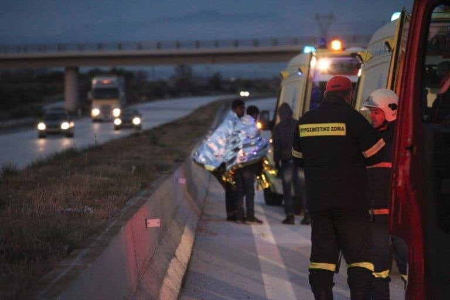
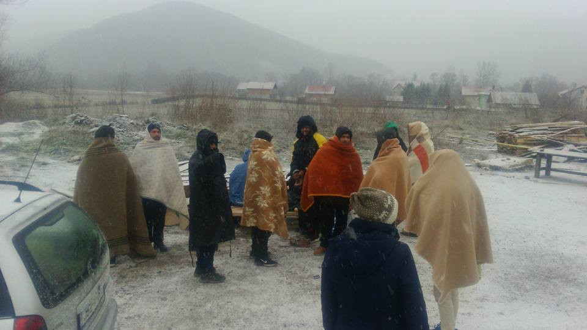
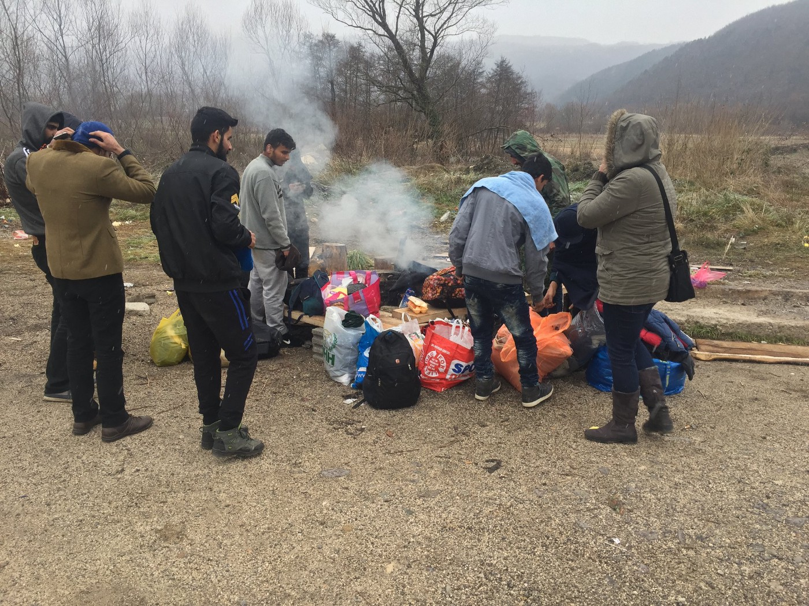
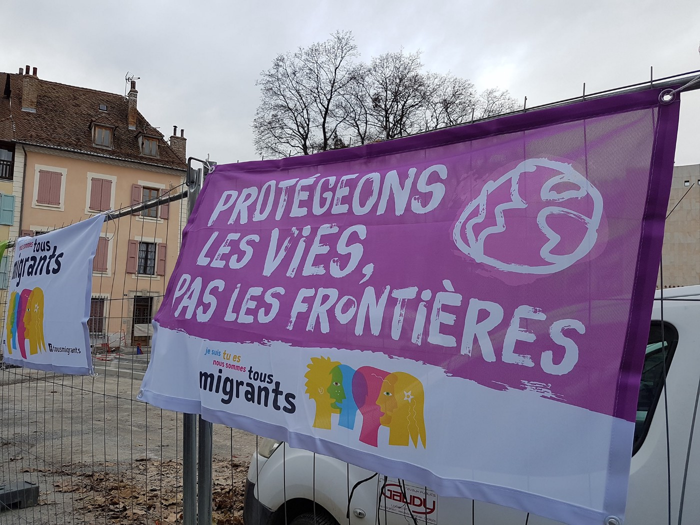
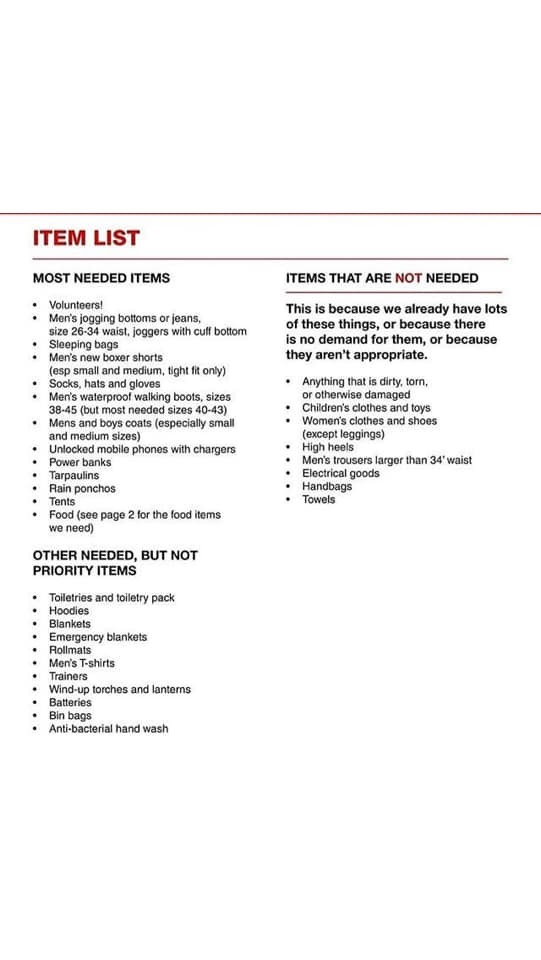

### AYS Daily Digest 13/12/18: EP debates about the situation in BiH

_Frontex soon to be deployed at the border / Hunger strike in Libyan detention center / Three people die in car accident in Greece / Police in BiH increases pressure on people and locals / And more news…_

](assets/87c32cbdc65b/1*KY5aKHdhCYEx5bRDrJOPRA.jpeg)

Photo by: [Sanella Lepirica](https://www.facebook.com/sanela.lepirica?__tn__=%2Cd%2AF%2AF-R&eid=ARCbqD3eS2tEI2qJZJc94pb0dSk90U7OdEr6SrXKG6NAmOq5vlyqgYlAFmtlINyXEr75rv4s15hQDRS-&tn-str=%2AF&hc_location=group_dialog)
### FEATURE: EP debates about the situation in BiH

Frontex staff will soon be deployed at the border between Bosnia and Herzegovina and Croatia\. Negotiations between both countries had been completed, EU Commissioner Vytenis Andriukaitis said on Thursday: “And an agreement will be signed soon\.” However, a Frontex presence in the border region has been reported for more than half a year now\.

In his statement in the European Parliament about the situation for people in BiH, Andriukaitis stated that currently around 5,100 people are housed in centres\. Around 1,000 people had not asked for assistance\.

Since June 2018, the EU allocated some two million Euro in humanitarian aid and 7\.2 million Euro through special measures and funding and pre\-membership support\. Various times he repeated that Croatia’s border to BiH is the longest in Europe\. “We all agree that the border between Bosnia and Croatia is the EU’s external border and Croatia is responsible to manage that border,” he said\. Bosnia deployed an additional 180 police officers to the borders\.

AYS appreciates that the European Parliament talked about the situation of refugees in Bosnia and Herzegovina\. We see it as alarming, however, that the member states still did not find an agreement on how to deal with people seeking refuge\. Just allocating money to certain countries and NGOs does not necessarily lead to better treatment\. Further, we demand that each report of police violence and unlawful push\-backs from Croatia to BiH is investigated\. People need to be given the opportunity to ask for asylum and their applications must be processed in a fair way\.
### LIBYA

Around 90 people from Somalia and Eritrea are currently detained in the Al Khoms detention center in Libya\. According to Care4Calais, more than 40 minors and ten women are among those people\. The men “are being used for forced labour, are being tortured and abused,” C4C states\. Even young children were separated from their mothers, who were held in other parts of the facility\.

“Five boys \(three of them under 18\) were taken away from the centre a few days ago and never returned\. The detainees are terrified as they believe these boys were sold to slave masters and traffickers and that they might be next\. They have started a hunger strike to demand that the five boys be brought back,” Care4Calais states\. In fear of being sold, too, the people ask the UNHCR to register them\.

### GREECE
#### Islands

■■■■■■■■■■■■■■ 
> **[Zuzanna Krzatala](https://twitter.com/zu_krzatala) @ Twitter Says:** 

> > “Welcome to Prison” inscribed on the main wall of Europe’s most notorious refugee camp, #Moria. 8,500 people crammed behind the barbed wire fencing (ingeniously used for laundry hanging) inside a former military base with a capacity of 3,000. https://t.co/FB9Y8hiZ0G 

> **Tweeted at [2018-12-11 02:20:26](https://twitter.com/zu_krzatala/status/1072315141277003776).** 

■■■■■■■■■■■■■■ 

As 60 refugees from Chios tranferred to mainland Greece, 57 people disembarked in the early hours of Thursday in Chios\. The first incident occurred in Komi at 03:51 at dawn, when a boat was found with 21 people \(10 men, six women, and five children\) followed by a second incident in the area of Nosokomeio, with 36 people: 18 men, 10 women, and eight children\.

■■■■■■■■■■■■■■ 
> **[Vassilis Tsarnas](https://twitter.com/VassilisTsarnas) @ Twitter Says:** 

> > #Greece: A racist attacked a Bangladeshi national, on #Lesvos, with an iron bar on 8/12, because he was asked not to park on a #disabled parking bay. He is cond/lly released &amp; no racist motivation was taken into account. But no worries, Lesvos has a new Prosecutor for #HateCrimes 

> **Tweeted at [2018-12-13 07:52:20](https://twitter.com/vassilistsarnas/status/1073123440205459458).** 

■■■■■■■■■■■■■■ 

#### Thessaloniki

Another tragic car accident claiming immigrants as victims occurred early in the morning on the Thessaloniki\-Kavala National Road, Greek media sites report\.
A car ran into a truck on the road to Kavala\.

The car caught on fire after the crash, resulting in the death of three people, while another six were injured\.

This crash adds to a chain of refugee victims in car accidents\. A recent report has pointed to specific incidents and reports about the role of police in their “wild car chasing” and the “recruitment” of underage migrants by traffickers in order to drive cars carrying refugees\.
#### Athens

■■■■■■■■■■■■■■ 
> **[City Plaza Squat](https://twitter.com/sol2refugees) @ Twitter Says:** 

> > Some photos from the #Antifa demo today in Athens, for the murder of Petrit Zilfe by fascist member of the Golden Down (Greek neonazi party). 

Petrit was a migrant from Albania! 

Never again fascism! https://t.co/uJ3Q7RHd2S 

> **Tweeted at [2018-12-13 18:52:23](https://twitter.com/sol2refugees/status/1073289547679711233).** 

■■■■■■■■■■■■■■ 

### BOSNIA AND HERZEGOVINA
#### More internal push backs

Police from Bihać once again pushed back a group of people from the city\. Some of the people have their documents and places in camps\. This is a practice that defies the law in Bosnia and Herzegovina, but so far nobody has done anything to stop it\.

This particular group was left by the road in the afternoon\. To go back to Bihać, they will have to walk since the police forbids local bus companies from taking people in, and they are trying to prevent the local population from helping anyone\. People are still resisting, but the police is putting more pressure\.

](assets/87c32cbdc65b/1*PdYLQL0kvt5uaYXr6q02mQ.jpeg)

Photos by: [Sanella Lepirica](https://www.facebook.com/sanela.lepirica?__tn__=%2Cd%2AF%2AF-R&eid=ARCbqD3eS2tEI2qJZJc94pb0dSk90U7OdEr6SrXKG6NAmOq5vlyqgYlAFmtlINyXEr75rv4s15hQDRS-&tn-str=%2AF&hc_location=group_dialog)

42 people were pushed back in this way over the last two days, local Red Cross volunteers claim\. Citizens of the nearby villages are providing much needed help\.

](assets/87c32cbdc65b/1*JWEFnD74WmIbuT9csnAGUw.jpeg)

Photos taken from the FB page of [Crveni Križ Općine Ključ](https://www.facebook.com/profile.php?id=100009318317491&__tn__=%2Cd%2AF%2AF-R&eid=ARCQT3jSVw1tryNOpWXSwK9r1Q-YNQHITrEONP36YbYLkhpe3-vWIeKefS2vh4uXQ5nLlo43WBrANQ95&tn-str=%2AF)

Talking about Bosnia at the EP plenary session on Thursday, they said that out of 22,400 people who were registered to enter Bosnia this year, there remain about 6,000 still in the country\.
### FRANCE

](assets/87c32cbdc65b/1*wFDxWUKQI3JjrKeDmzf-JA.jpeg)

Photo: [Refugee Women’s Centre](https://www.facebook.com/refugeewomenscentre/?tn-str=k%2AF&hc_location=group_dialog)

“ Tonight, it’ll be \-4°C here and we can happily and proudly say that all families in Grande\-Synthe will be sleeping indoors,” [Refugee Women’s Centre](https://www.facebook.com/refugeewomenscentre/?tn-str=k%2AF&hc_location=group_dialog) team reports\. 
“On most days, the state has organised buses to take people from informal camps in Dunkirk and Calais to accommodation centres in the region\. Because people living in informal camps in northern France are usually there illegally, with no intention to legalize their situation \(as they try to make their way to England\), the French state is providing shelter for one month in those centres\.

After a month, if the person hasn’t done any administrative procedure in France, they lose their spot in the accommodation centre\. People’s duration of stay seems to vary: sometimes it’s much shorter, often it’s longer\.

As the management of those centres has been outsourced to different organizations, the living conditions, duration of stay, location, and access to information differ widely from one place to another\.

Some of them are former hotels that have been purchased by the state and turned into an accommodation centre, others are flats completely spread across a few buildings or a town, one of them is an annex to a church, while another is a building in a medical compound awaiting demolition\. The list goes on\. They are of many sizes and styles, some more comfortable than others\. Mostly, they are in rural places, rarely inside of a city, but often next to a shop or a bus stop\. Some live in the middle of Lille, others by the motorway where there’s no phone signal\. It’s very uneven, and unpredictable when people get on a bus\.”
#### Prison for helpers in Briançon

As we announced earlier, a press conference and a gathering was organized in front of the court\. The people affected with the claims and charges at court were sentenced to 12 months’ imprisonment, eight of which were suspended, and six months of suspended imprisonment — guilty of aiding the entry into a territory by a person in an irregular situation\.

](assets/87c32cbdc65b/1*mEvQDTUL8BoCyf7E6MMY8Q.jpeg)

Photo: [HDR 05](https://www.facebook.com/hauteduranceenresistance/?__tn__=%2CdkCH-R-R&eid=ARDE5MqYdgrQSA2Kj2bSIbYtOfea2Wk3tyllTOR2VJM4fVFfQz5hzwqO0QGK0tJfUJOiBDSE-KoHnCe6&hc_ref=ARSFbEjbcY1Kjm2TzOOJhwO8diCHYppkcM20GCIzNvNb2Zwe6RW8ydACufmIr5pJ1oE&fref=nf)

**Benoit Ducos, Théo Buckmaster, Bastien Stauffer, Lisa Malapert and Eléonora Laterza** were given a six month suspended sentence for aiding the illegal entry of a foreigner into France\. **Mathieu Burellier,** also prosecuted for rebellion, was sentenced to 12 months in prison, eight of which were suspended and put to the test for two years with the obligation to compensate the victims and to work\. **Jean\-Luc Jalmain** , also tried for participation in a gathering, is sentenced to 12 months in prison including eight suspended\.

_SHAME_ \!

](assets/87c32cbdc65b/1*O0fvCcIvrUOpdIJMsYYAZQ.jpeg)

Photo: [Élie Ducos](https://www.facebook.com/profile.php?id=100007387035486&__tn__=%2Cd%2AF%2AF-R&eid=ARBI6KSvUAEl3oXql8PutXx-OTwAuf65hRt0JzOAZHyQBfZLVhNYX7EnE0mI3TV6BVt4ZRe_xZlKxzcL&tn-str=%2AF)

The “ **7 de Briançon** ” announced that they would appeal the decision, media [report](https://www.ledauphine.com/hautes-alpes/2018/12/13/7-de-briancon-une-centaine-de-personnes-en-soutien?fbclid=IwAR03Lq4jw0k9Pf-qv8rt8USG687DRBm8Z6EvqxB3tYOid1tPzZQGUAwGOvM) \. Activists also [wrote](https://valleesenlutte.noblogs.org/post/2018/12/13/1312-contre-les-frontieres-rendu-du-proces-des-34-de-briancon/?fbclid=IwAR0Qpd3ds8kOHqJsIZkM8HdrprL6MNLkJPGzEJgtzU_xyZaJKW5ubNyP7uE) about it and many are writing letters of support for them\. Read a public release from [Tous Migrants](https://www.facebook.com/tousmigrants/?__tn__=%2CdkCH-R-R&eid=ARAP35MZmdQ1W1Vv3DxcSwgxK5-CwSySYmwio6h-hbdRIEliKgFApPVFJOMI_oPR8HOT6wP4QmI4ol0p&hc_ref=ART00wdgFe2_DyzD955sCfzv-mq0OYSpa-XLJSYneWvOoH1sW2Ch0UL4Bez9qD4PvV0&fref=nf) [here](https://www.facebook.com/tousmigrants/posts/2312894625608770?hc_location=ufi) \.

](assets/87c32cbdc65b/1*gn97aTnTn-PpQ57nlzX5Kw.jpeg)

Photos: [HDR 05](https://www.facebook.com/hauteduranceenresistance/?__tn__=%2CdkCH-R-R&eid=ARDE5MqYdgrQSA2Kj2bSIbYtOfea2Wk3tyllTOR2VJM4fVFfQz5hzwqO0QGK0tJfUJOiBDSE-KoHnCe6&hc_ref=ARSFbEjbcY1Kjm2TzOOJhwO8diCHYppkcM20GCIzNvNb2Zwe6RW8ydACufmIr5pJ1oE&fref=nf)
#### Paris

Om the occasion of International Migrants Day, which will take place on December 18th, the Migrant Support Office \(BAAM\) calls people to gather and walk together to show support for the thousands of people who take all the risks to win a barricaded Europe\.

> A policy of non\-reception of Migrants has spread throughout Europe, resulting in the constant multiplication of physical, symbolic and administrative barriers\. These barriers are all obstacles that aim to control the arrival of foreigners\. The obsession with borders has gradually immured Europe, which no longer hides its preference for a world of camps, places of confinement that constitute real obstacles to freedom of movement and settlement\. Yet it is illusory to believe that European states and their policies can block human movements\. — _BAAM_ 

**The gathering is to begin at the corner of the rue du Temple and Place de la République \(in front of Camaïeu\) at 17:30h\.**

### UK

Initiatives are being organized to collect donations in different parts of the country, follow groups such as [Calais — People to People Solidarity — Action from UK](https://www.facebook.com/groups/CalaisMigrantSolidarityActionFromUK/?ref=gs&tn-str=%2AF&fref=gs&dti=882751941799554&hc_location=group_dialog) for more information and to get in touch with people who organize it\.

We also publish a **weekly overview in Arabic and in Persian** of some of the most important stories we covered during the previous week\.

Here is the [Arabic Weekly News Summary for the week of December 3rd–9](%D8%AE%D9%84%D8%A7%D8%B5%D9%80%D9%80%D9%80%D9%80%D9%80%D9%80%D9%80%D9%80%D9%80%D9%80%D9%80%D8%A9-%D8%A7%D9%84%D8%A7%D8%B3%D8%A8%D9%80%D9%80%D9%80%D9%80%D9%80%D9%80%D9%80%D9%80%D9%80%D9%80%D9%80%D9%80%D9%80%D9%80%D9%80%D9%80%D9%80%D9%80%D9%80%D9%80%D9%80%D9%80%D9%80%D9%80%D9%80%D9%80%D9%80%D9%80%D9%80%D9%88%D8%B9-%D8%A7-%D9%8A-%D8%B3-30ad27d6325a) th\. 
Find here the [Persian Weekly News Summary](%D8%AE%D9%84%D8%A7%D8%B5%D9%87-%D9%87%D9%81%D8%AA%DA%AF%DB%8C-%D8%AE%D8%A8%D8%B1%DB%8C%D9%87-%D8%A2%D8%B1-%DB%8C%D9%88-%D8%B3-%D8%AA%D8%A8%D8%B9%DB%8C%D8%B6-%D8%AE%D8%B4%D9%88%D9%86%D8%AA-%D9%BE%D9%84%DB%8C%D8%B3-%D9%88-%D9%82%D9%88%D8%A7%D9%86%DB%8C%D9%86-%D8%B6%D8%AF-%D9%85%D9%87%D8%A7%D8%AC%D8%B1%D8%AA%DB%8C-1a44a0e29978) for the same week\.
Please, share it with your Arabic and Persian speaking friends\.

**We strive to echo correct news from the ground through collaboration and fairness\.**

**Every effort has been made to credit organizations and individuals with regard to the supply of information, video, and photo material \(in cases where the source wanted to be accredited\) \. Please notify us regarding corrections\.**

**If there’s anything you want to share or comment, contact us through Facebook or write to: areyousyrious@gmail\.com**

_Converted [Medium Post](https://medium.com/are-you-syrious/https-www-facebook-com-photo-php-fbid-10212084107038699-set-pcb-10212084188400733-type-3-theateray-87c32cbdc65b) by [ZMediumToMarkdown](https://github.com/ZhgChgLi/ZMediumToMarkdown)._
