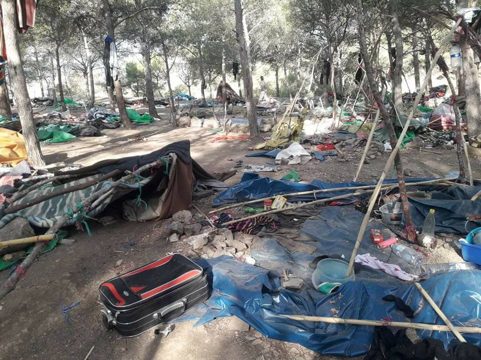
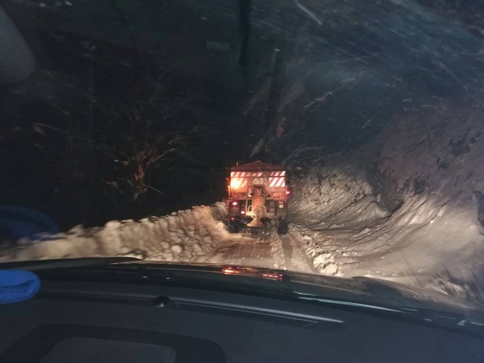
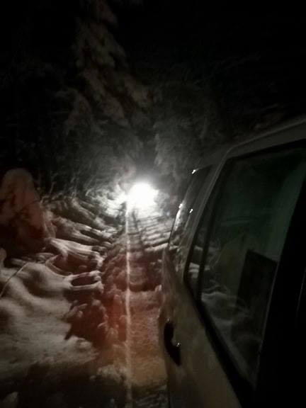
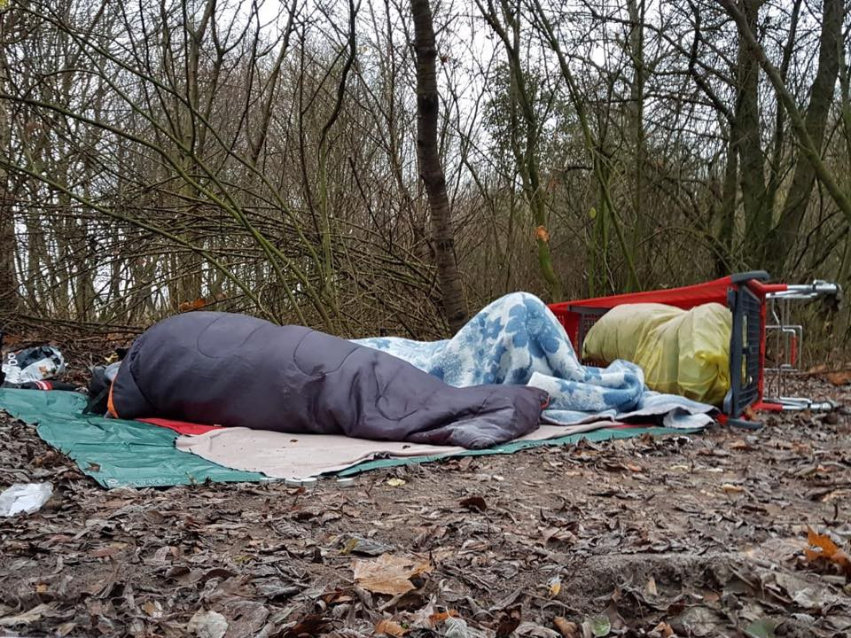
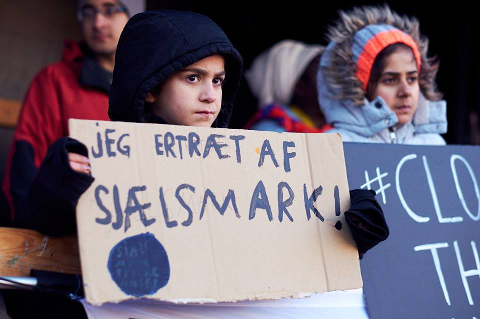

### AYS Daily News Digest 17/12/18: What is a signed agreement for people freezing in&out of the camps?
#### A boy dies in Bira camp, Bosnia / protest for the people in Sjælsmark / EUBAM and Operation Sophia prolonged / A report on Inadequacies and Delays in Spain’s Asylum Procedure / Protest at Sjælsmark in Denmark / People across UK taking a stand on the Stansted 15 verdict / more news

 France](assets/7f3f0dec3891/1*rRPUJ8stKN6QPESUKdTX5A.jpeg)

Photo: [Mobile Refugee Support](https://www.facebook.com/MobileRefugeeSupport/?tn-str=k%2AF&hc_location=group_dialog) France
#### FEATURE — Death in a camp

Residents of the BIRA camp, Bihać, informed an AYS volunteer that a boy aged 16 died under still unclear circumstances on December 13\.

Before the ambulance was called, they say, he complained about abdominal pain\. The cause of death is not clear, and the information was not mentioned in public\. According to some of the residents, he died of an overdose, while some others have doubts about this cause, mentioning he had pain in his stomach for days and could not eat\. He died in the hospital in Bihać\. IOM, which runs this center, released no information on the event\. The boy lived in the part of the camp where only minors are placed, in one of the containers\. The area is guarded by a private security agency and does not resemble what an area for minors should probably look like\. There are around 2,110 people living in this camp, including over 100 minors, but reportedly none of them were informed of what happened within the camp in this case\.
#### SYRIA

Heavy rains have **flooded and destroyed more than 602 tents, displacing 3,500 Syrian and Iraqi refugees** in the Al\-Sad refugee camp, in northeastern Syria, media [report\.](https://www.middleeastmonitor.com/20181214-3500-syria-iraq-refugees-displaced-again-after-rain-wipes-out-their-tents/?fbclid=IwAR1dVSCcdf7c36_r-o51HOg6AQg7Fc8TTOfUzjj8L5eG3i7rSj10mkydnyY) Residents reportedly called for a temporary dam to be set up to channel the water away from the camp\.
#### LIBYA

The EU Council has expanded the powers of its border management assistance mission \(EUBAM\), [reportedly](https://www.libyaobserver.ly/news/european-union-expands-authorities-border-mission-libya?fbclid=IwAR2MUnqmh-mlD68g5y5O6KbjgiYcvC21au4m9FxELeaUCnA2V4-JM7kasCs) to include active support for the Libyan authorities in “contributing to efforts to disrupt organised criminal networks involved in smuggling migrants, human trafficking and terrorism”\.
The mission’s revised mandate will run until 30 June 2020 and the EU has also allocated a budget of €61\.6 million for the period from 1 January 2019 to 30 June 2020\. The [EUBAM Libya](https://eeas.europa.eu/csdp-missions-operations/eubam-libya_fr) mission’s headquarters are located in Tripoli\.

> EUBAM provides capacity\-building in the areas of border management, law enforcement and criminal justice\. — _from an official statement\._ 

Along with that, the EU agreed last Friday to extend their naval mission, known under the name [Operation Sophia](https://www.theyworkforyou.com/lords/?id=2018-06-13a.1735.0) , off the Libyan coast for the three coming months\. As the [media](http://www.spiegel.de/politik/ausland/fluechtlinge-europaeische-union-peilt-schmutzigen-deal-mit-libyen-an-a-1089670.html) predicted before the start of the mission, Sophia has turned out to be another deal, similar to the Turkey\-EU deal, only dirtier in the sense of the evident consequences of such operations and the constant turning a blind eye to the fact that the EU cannot turn people in distress back to a country where reported and documented violation of basic human rights is taking place\.
#### MOROCCO

[Association Marocaine des Droits Humains — Section Nador](https://www.facebook.com/AmdhNador/?__xts__%5B0%5D=68.ARBpHyvF9-jtUmk8Ubfq1HnLJBRbHqD9NDHhPgAzWN4VjgnaGz1lYmTMJ76EtuupSznZg-QusptII0Qi0E00UYJple18-uAb8WwqKhmVhthLPX5-Gf4gU3k1swJFhSnfc6RCJ2LtgBKUF_aA_7nXimOoddpzSfiea89AWgcDJZmYExfNLDX9OgLnaZuUu_7mo9Yb3J44JanBmfHPkazfBL7mUAZ8fCUKyrhFyQX1x6ebrYNLdQtANTWf7cjCOtqPQwviBtQ2Jp5g2uXKNu6DharJd_79ueKN6moJo8TWDH59jBgF9IaBonzo88MDKu3MKunGdKSBVnKTD5pRr1gW-NSTlkDA&__tn__=k%2AF&tn-str=k%2AF) reports that the Moroccan forces of order have engaged in an organized raid and evictions of migrants across Nador\. They report that 9 of the wounded people staying in a hospital were reportedly arrested\. Around 4 pm during the day, in a message sent to an AYS volunteer, people were still hiding in the forest from the police\. Later, in another message, it was said that it was “okay” again\. 
More information in the coming AYS Special\.

](assets/7f3f0dec3891/1*GQcfclDJSQZwPntVDeWinQ.jpeg)

Photos: [Association Marocaine des Droits Humains — Section Nador](https://www.facebook.com/AmdhNador/?__xts__%5B0%5D=68.ARBpHyvF9-jtUmk8Ubfq1HnLJBRbHqD9NDHhPgAzWN4VjgnaGz1lYmTMJ76EtuupSznZg-QusptII0Qi0E00UYJple18-uAb8WwqKhmVhthLPX5-Gf4gU3k1swJFhSnfc6RCJ2LtgBKUF_aA_7nXimOoddpzSfiea89AWgcDJZmYExfNLDX9OgLnaZuUu_7mo9Yb3J44JanBmfHPkazfBL7mUAZ8fCUKyrhFyQX1x6ebrYNLdQtANTWf7cjCOtqPQwviBtQ2Jp5g2uXKNu6DharJd_79ueKN6moJo8TWDH59jBgF9IaBonzo88MDKu3MKunGdKSBVnKTD5pRr1gW-NSTlkDA&__tn__=k%2AF&tn-str=k%2AF)

At the same time, “the EU is intensifying its support to Morocco to address irregular migration in response to increased migratory pressure along the Western Mediterranean Route,” read part of the announcement that confirmed the EU will pledge a further €148 million to financially assist Morocco on the migration front\.
#### TURKEY

#### SEA
### Guide for families and friends who lost someone in the Mediterranean

The [Boats 4 People](http://boats4people.org/) \(B4P\) coalition published, in May 2017, an [information guide](https://www.meltingpot.org/Morti-e-dispersi-in-mare-Una-guida-informativa-per-le.html) addressed to families — and their supporters — of people who died or disappeared in the central Mediterranean while crossing to Italy\. It is available in: [**Italian**](http://www.boats4people.org/guide/it/) \| [**English**](http://boats4people.org/guide/en/) \| [**French**](http://boats4people.org/guide/fr/) \| [**Arabic**](http://boats4people.org/guide/fr/) \| [**Tigrinya**](http://boats4people.org/guide/ti/)

> The information guide for families and those accompanying them helps to restore dignity to missing persons or deaths at sea during the Mediterranean crossing, it also offers essential support to family members, because behind every missing person at sea there is always a mother, a father, a relative, children, relatives and friends condemned to expectation, anguish and hope\. 

■■■■■■■■■■■■■■ 
> **[Sea-Watch International](https://twitter.com/seawatch_intl) @ Twitter Says:** 

> > Unpack #gifts? We're unpacking our plane again! 
We had already brought our #Moonbird into the hangar to spend the winter there. Now weather suddenly improves, crossings become more probable. So from Thursday on, we'll assist people in need from the water as well as from the air. https://t.co/6eH0fPq6PO 

> **Tweeted at [2018-12-17 16:46:58](https://twitter.com/seawatch_intl/status/1074707538380234752).** 

■■■■■■■■■■■■■■ 

#### EU

On Monday, the United Nations General Assembly adopted a new refugee accord in an attempt to better manage those seeking international refuge in the wake of the 2015/2016 European migrant crisis\. This refugee compact follows [the compact finalized last week at a UN migration conference in Morocco](https://www.dw.com/en/un-migration-compact-formally-adopted/a-46662546) that deals with all forms of migration\. The UN General Assembly is [reportedly](https://www.dw.com/en/un-refugee-compact-what-you-need-to-know/a-46762949?fbclid=IwAR22LQp6rIJcUgfYBu5fbR2eZmR0blHgU6A5pNSJxU5-lLM2z2bDlNlJmP8) also due to endorse that accord this week\.

The United States found itself isolated in the General Assembly, as only Hungary backed the US and voted against an annual resolution on the work of the U\.N\. refugee agency, while 181 countries voted in favour and three abstained\. The resolution has generally been approved by consensus for more than 60 years\.
Although it is not binding, we should be aware that some of the founding documents establishing human rights were also not binding documents when they were signed\.
### Member states \(intentionally?\) ‘untrained’ on the right to seek asylum?

In the case of [M\.A\. v\. Lithuania](https://hudoc.echr.coe.int/eng?fbclid=IwAR2mRABfrBitRYpPc27xGEUqymm86lGU0f8_8Yk1ZJxi9d6UtHdt7-C0HF0#{%22appno%22:[%2259793/17%22],%22documentcollectionid2%22:[%22GRANDCHAMBER%22,%22CHAMBER%22],%22kpdate%22:[%222018-12-11T00:00:00.0Z%22,%222018-12-11T00:00:00.0Z%22],%22itemid%22:[%22001-188267%22]}) , the European Court for Human Rights recalled that **the willingness to apply for asylum does not need to be expressed in any particular form** and that member States should provide trained border officers, capable of detecting and understanding asylum requests, **even in cases where asylum seekers are not in a position to clearly communicate their intention to seek asylum\.**
#### GREECE
### If you ‘separate voluntarily’, you might not be able to do family reunification

Over the last few months, [Mobile Info Team](https://www.facebook.com/mobileinfoteam/?__tn__=%2CdkCH-R-R&eid=ARAwj3UHrWeicJ1-zMgawDHnwFqbKJIC3y6Glm-bVuM0U4THh0EKSvZWiTXxqXevV6cdAjiDbKoQO1An&hc_ref=ARQRcCyhid9JD-JPMlQn5HArPMSg6JqO-3ly_cOlYLesWWEmxhrf1VzedcZOhhBPqCU&fref=nf&hc_location=group) has spoken with a lot of people in cases where family members have separated voluntarily\. Separating voluntarily is when a family is together in Greece and then one family member leaves Greece illegally and applies for asylum in another country\. When this happens, it is likely that it will not be possible for the remaining family in Greece to do family reunification to their family member in the other country\. For example, in 2018 we haven’t seen Germany accepting any cases in which voluntary separation has taken place\. Sweden also has a strict policy of not accepting any family reunification cases where a family member has voluntarily separated\. The argument made by these countries is that if a family is already together in Europe and then splits up, they show that they don’t want to be together, so there is no need to reunite the family again\.

> By law, states are not obliged to reunite family members that separate voluntarily 

### Samos

> We need volunteers for the upcoming winter months\. Come teach a class, help us run the Alpha Centre or the laundry station, and be part of our daily activities 

> The link to apply is below\! 

[www\.samosvolunteers\.org/volunteer](http://www.samosvolunteers.org/volunteer?fbclid=IwAR0WEcfdR3Yyygqiw3UNue8dxeo9JKjlyGcR_gJVBDAsVm9wNdmXksd4lCg)
#### BALKAN WEATHER FORECAST for 18\.12\.

**Montenegro**

In the south the weather will be changeable, with more clouds in the morning but predominantly dry and with longer sunny intervals during the afternoon\. In the north predominately cloudy, locally with snow; in the afternoon the precipitation will mostly come to an end\. The wind will be amplified to strong, locally with strong to stormy gusts, blowing from the north\. The lowest temperatures will be from \-10 to 6 and the highest daily \-5 to 12 degrees\.

**Serbia**

Cloudy and cold with some snow locally, in the evening and during the night the precipitation will halt\. In he north it will be mostly dry and foggy for most part of the day\. The wind will be blowing from the north and northwest and will be of low intensity\. The lowest temperatures between \-9 to \-2 and the highest daily from \-4 to 2 degrees\.

**BiH**

Predominately cloudy before noon\. In Bosnia possibly some light snow\. Along the basins and rivers there will be fog and low clouds\. In the afternoon it will gradually clear up and no precipitation is expected\. In Bosnia weak winds from changeable directions and in Herzegovina moderate to amplified Bura\. The lowest temperatures will be from \-12 to \-3 and the highest daily from \-4 to 7 degrees\.

**Croatia**

Partly sunny and changeably overcast\. Some rain is expected in Dalmatia early in the morning\. The wind will be mostly weak, along the coast moderate to strong and stormy at the foot of Mount Velebit\. The lowest temperatures will be from \-8 to 7 and the highest daily from 0 to 11 degrees\.
#### BOSNIA AND HERZEGOVINA

Another group of migrants was forbidden to cross into the Una\-Sana canton \(bordering with Croatia\) coming from Sarajevo\. They were assisted by Red Cross volunteers in Ključ, who reported about the event\.

](assets/7f3f0dec3891/1*q97g9HFYRGxA37Cq8Jc-IA.jpeg)

Photo previously published by the [Crveni Križ Općine Ključ](https://www.facebook.com/profile.php?id=100009318317491&__tn__=%2Cd%2AF%2AF-R&eid=ARCiE7AyCsS_c7uAAwE03wpkSZr84-gtFR4w6A9_vNeZPnb2U7DF2AgogSdCO9jkdQu3CGCBPLt0a0Di&tn-str=%2AF&hc_location=group_dialog)

They also reported on another avoided accident, when a group of 20 people got lost in the dangerous winter conditions within the region, trying to reach Croatia\. They were rescued from the snow\-covered hills by the Bihać teams of mountain rescue, Red Cross, and other organizations that helped\.

](assets/7f3f0dec3891/1*DQLF66XQtoDpPRslBl4GCA.jpeg)

Photos: [Crveni Križ Općine Ključ](https://www.facebook.com/profile.php?id=100009318317491&__tn__=%2Cd%2AF%2AF-R&eid=ARCiE7AyCsS_c7uAAwE03wpkSZr84-gtFR4w6A9_vNeZPnb2U7DF2AgogSdCO9jkdQu3CGCBPLt0a0Di&tn-str=%2AF&hc_location=group_dialog)

In Ušivak camp and some other camps in Bosnia, the water in the outside showers is reportedly cold, and apart from having no privacy whatsoever, people feel more than ever abandoned to get sick or die trying to reach safety\.
#### CROATIA
### Dual approach to a dual role

Croatian [media report](http://www.seebiz.eu/hrvatska-migrantska-politika-schengensko-dokazivanje-briselskoj-birokraciji/ar-186435/?fbclid=IwAR3Db9YyK5md6FJFE3QvtrA7GIHv1hdBWm4lLJ4ak-hgU8HwgXZNg5Xig2o/) on a ‘duality’ in the official attitudes of Croatian policymakers\. Croatia is trying to prove itself Schengen\-border\-worthy through the active preserving of their \(external EU\) border, something their MEPs kept repeating at the recent EU Parliament discussion on the mistreatment and violence the Croatian police keeps perpetrating against migrants after they have crossed into Croatian territory\. Croatia stands firm in its rhetoric that ‘legitimate and legal migrations are possible and the only kind of migrations the country supports’\. However, anyone who is slightly familiar not only with the reality of the situation and the possibilities open to people on the move, but also with the basic principles of international and in this case national law, knows this is not the case and is merely a rhetorical spin that the poorly informed average citizen supports\.
Please, read \(and encourage your Croatian friends to read\) an analysis of the current situation, political decisions and plans regarding refugees in this article that features an interview with Drago Župarić Iljić in [this text](http://www.seebiz.eu/hrvatska-migrantska-politika-schengensko-dokazivanje-briselskoj-birokraciji/ar-186435/?fbclid=IwAR3Db9YyK5md6FJFE3QvtrA7GIHv1hdBWm4lLJ4ak-hgU8HwgXZNg5Xig2o/) \.
#### FRANCE

[Mobile Refugee Support](https://www.facebook.com/MobileRefugeeSupport/?__tn__=%2CdkCH-R-R&eid=ARBsCdvp8cYTr_Z3oXuzjK4BUgTu6cTno13XFAtWwM8u-NhEbjf8USRZKzdw52c8fQNTPEQY5eOB9M5J&hc_ref=ARSdGVEsplLHsb8DBVQuQya6YV1LvIEIBLi-bdTKAre4HVmxAzWccE8LRDHaEz9EDAc&fref=nf&hc_location=group) report that there are currently around 200 displaced people in the area where they work, living in small scattered camps\. Police continue to patrol the area, forcing people to camp further afield and out of sight\. Over this week our teams have distributed over 150 sleeping bags and, in collaboration with [Help Refugees](https://www.facebook.com/HelpRefugeesUK/?__tn__=%2CdKH-R-R&eid=ARDQ5A775sZH33pk0nCCSe0h4h7ExcJdLe3r2mNJQxqs_e2ckBIM60leeilv1vYOVOx86rmZJxn6bsc9&fref=mentions&hc_location=group) , over 100 tents\.

> Our team on the ground each day take a selection of winter essentials such as gloves, hats and scarves\. Soon we will begin our night patrols again as hypothermia once again becomes a very serious risk\. — _MRS team_ 

#### SPAIN
### Inadequacies and Delays in Spain’s Asylum Procedure

Summary returns at the land border; peculiarities of operations of security forces in contiguous waters; returns of people that land on islets and rocks through the readmission agreement signed with Morocco in 1992\. Further, the report reveal various problems for migrants during their stay in Melilla; restriction of movement; and finally, the situation of unaccompanied foreign children and young people\. These are only some of the serious issues outlined in a [report](http://www.asylumineurope.org/sites/default/files/resources/sacar_del_laberinto_sjm.pdf) made by the [Spanish JRS](http://Servicio Jesuita a Migrantes) \.

They place emphasis on a growing problem when it comes to unaccompanied refugee minors: “In some cases, a lack of documents or inaccurate medical tests mean they are not recognised as children, while if recognised, deficiencies in care have been found in child protection centres\. SJM also discusses the period for which families can be separated from their children while identity checks are carried out, and urges that it be shortened\.”

A joint [press release](http://www.forumrefugies.org/s-informer/communiques/augmentation-des-arrivees-en-espagne-l-europe-doit-sortir-la-reforme-de-dublin-de-sa-paralysiehttp:/www.forumrefugies.org/s-informer/communiques/augmentation-des-arrivees-en-espagne-l-europe-doit-sortir-la-reforme-de-dublin-de-sa-paralysie) by Spanish and French NGOs has called for prompt reform of the Dublin system with a view to alleviating pressure on the Spanish asylum system, [reliefweb](https://reliefweb.int/report/spain/melilla-and-madrid-inadequacies-and-delays-spain-s-asylum-procedure?fbclid=IwAR3NKWhxhCF1ZHqrW1mv2m_eruOHLNYFK4A__1Sm53fkBRM20LZXicm5P2k) reports\.

■■■■■■■■■■■■■■ 
> **[ACNUR España](https://twitter.com/ACNURspain) @ Twitter Says:** 

> > Llegadas a España, semana 49 (3-9 diciembre) [ow.ly/j1pf50jXE06](http://ow.ly/j1pf50jXE06) https://t.co/ZxmZg0aqwf 

> **Tweeted at [2018-12-17 16:00:31](https://twitter.com/acnurspain/status/1074695845906391045).** 

■■■■■■■■■■■■■■ 

#### DENMARK
### The protest we were previously announcing is taking place\!

Here’s the link to the protest event:

[Manifestation \#4: Support the children in Sjælsmark](https://www.facebook.com/events/346828412795886/?active_tab=about) 
[Edit descriptionwww\.facebook\.com](https://www.facebook.com/events/346828412795886/?active_tab=about)

If you are from Denmark, here’s what you can do:
1. Spread the word on social media and in your circles about the conditions of Sjælsmark and the upcoming demonstrations\.
2\. Visit Sjælsmark and listen to the residents\.
3\. Meet up to the demonstrations — invite your network, give a hand where it is needed and help with the dismantling of the demonstrations after the residents of Sjælsmarks\.
4\. Join the facebook group [Support for Sjælsmark protest / Støtte til protesterne I Sjælsmark](https://www.facebook.com/groups/559198101200113/?__xts__%5B0%5D=68.ARCagY-L-OflPXvE-Z77Lzax_H2gSHamS0afZcs4e2BcsRg8LVi0ImW2FSwtn1x-STGGTluIqh4xGy68YxcP7J_43oErdk2B8p5Jep008rpn3M7zP3kiBuAy8eN16jJYwjXL250YlqBwlO9H3mfSTc8yPels1LIKYqCrHB012toYHXl8QjDbMnuS8IJBiLqZaR_9OWa6cGPd47v4Tjp5TqRfbEABIWs9DqscMWvh&__tn__=K-R-R) to help plan the demonstrations and organize around Sjælsmark\.
5\. Low events that collect for the residents of Sjælsmark \(Folkekøkken, støttebar, collections, etc\. \)

#### UK
### UK in action \!

The [Stansted 15](http://enddeportations.com/2018/10/activists-accused-of-blocking-stansted-flight-go-on-trial-over-terror-charge/) are 15 activists who successfully grounded a mass deportation charter flight in March 2017 by locking themselves down in front of the aircraft’s wheel\.
On International Migrants Day more actions are planned in 17 cities in Britain and Ireland\. Many of the actions are being organised by local groups, in coordination with [End Deportations](https://twitter.com/EDeportations) and [Unis Resist Borders Controls](https://twitter.com/UnisNotBorders) , [Right to Remain](https://righttoremain.org.uk/stansted-15-day-of-actions-international-migrants-day/?fbclid=IwAR1DDVj8WjX6QXDU1IcUc7fq4nkkPRz__wB4q5bbIjaYy2oZvpFBd61Kfdg) reports\.

Here are the confirmed events \(each city name links to an event on Facebook\): [Aberystwyth](https://www.facebook.com/events/482232068848397/?ti=cl) , [Belfast](https://www.facebook.com/events/2175265235926197/) , [Birmingham](https://www.facebook.com/events/285701548753610/) , [Brighton](https://www.facebook.com/events/1032809280238739/) , [Bristol](https://www.facebook.com/events/1796614357115511/) , [Colchester](https://www.facebook.com/events/844908685679684/) , [Derry](https://www.facebook.com/events/222032292021450/) , [Glasgow](https://www.facebook.com/events/1036916286509529/) , [Lancaster](https://www.facebook.com/events/308318683356062/) , [Leeds](https://www.facebook.com/events/339051770208796/) , [Leicester](https://www.facebook.com/events/2081279961918126/) , [Liverpool](https://www.facebook.com/events/1466939670116682/) , London [morning](https://www.facebook.com/events/205700513668343/) and [afternoon](https://www.facebook.com/events/2268667363399676/) , [Manchester](https://www.facebook.com/events/2009470015807743/) , [Newcastle](https://www.facebook.com/events/287974138524460/) , [Nottingham](https://www.facebook.com/events/2123925307923071/) , [Oxford](https://www.facebook.com/events/264928347531105/) , [Sheffield](https://www.facebook.com/events/520124241827247/) , [Wolverhampton](https://wolverhampton.cityofsanctuary.org/) \.
Not on the list, but want to plan an action in your city? Contact [Unis Resist Border Controls](https://www.facebook.com/UnisResist.BorderControls/) and get involved\!
### Keeping a living memory

Seeking Sanctuary is a group that aims to raise awareness about people displaced from their homes and to channel humanitarian help from faith communities and community organisations via partnerships with aid workers\.

Its special concern is for the 1,000 or so people who are stuck in north\-eastern France trying to reach the UK\. There have been 19 cases involving 162 people between November 8 and last Saturday, Kent Online reports:

[Migrants’ memorial for those who perished](https://www.kentonline.co.uk/dover/news/migrants-memorial-for-those-who-perished-195494/?fbclid=IwAR1YMD4QNUg8n9pM9JfkW-lwf0bO2OudXi1TVAPivR1l6gIuzI-TH0xTJ2c) 
[Some 40 people attended an inauguration of a new memorial for more than 200 migrants who have died in the past 20 years…www\.kentonline\.co\.uk](https://www.kentonline.co.uk/dover/news/migrants-memorial-for-those-who-perished-195494/?fbclid=IwAR1YMD4QNUg8n9pM9JfkW-lwf0bO2OudXi1TVAPivR1l6gIuzI-TH0xTJ2c)

**We strive to echo correct news from the ground through collaboration and fairness\.**

**Every effort has been made to credit organizations and individuals with regard to the supply of information, video, and photo material \(in cases where the source wanted to be accredited\) \.** 
**Please notify us regarding corrections by email \(areyousyrious@gmail\.com\) or via Facebook, Twitter and Medium\.**

_Converted [Medium Post](https://medium.com/are-you-syrious/ays-daily-news-digest-17-12-18-what-is-a-signed-agreement-for-people-freezing-in-out-of-the-camps-7f3f0dec3891) by [ZMediumToMarkdown](https://github.com/ZhgChgLi/ZMediumToMarkdown)._
