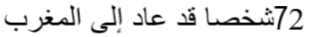
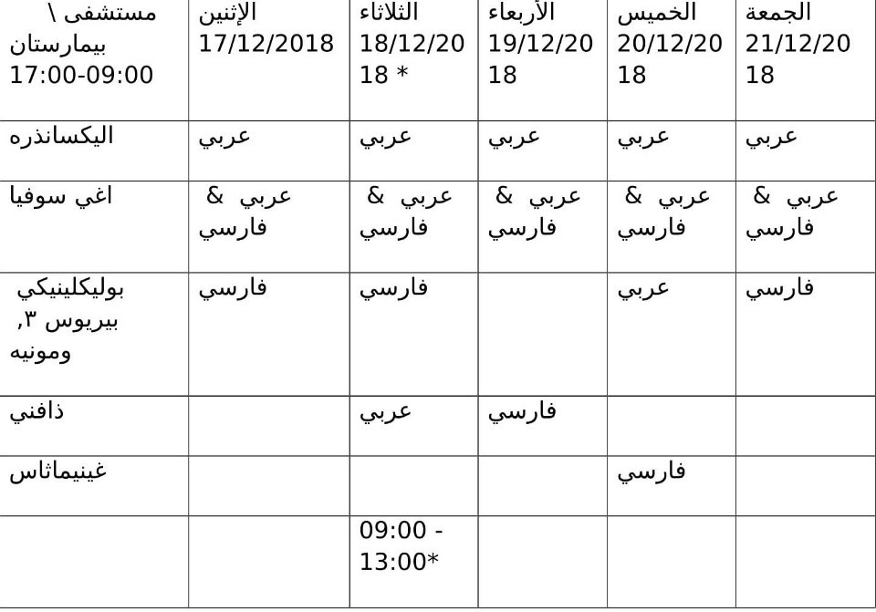

### اقتراح التأشيرة الإنسانية لمكافحة حصيلة الموت غير المبرر على الحدود الأوروبية \#SafePassage
#### AYS Weekly News Digest in Arabic, December 10–16

](assets/fabaeb9104ff/1*NchxtL-CQDVgONlTw6LHgA.jpeg)

Photo: [Mobile Refugee Support](https://www.facebook.com/MobileRefugeeSupport/?__tn__=%2CdkCH-R-R&eid=ARBsCdvp8cYTr_Z3oXuzjK4BUgTu6cTno13XFAtWwM8u-NhEbjf8USRZKzdw52c8fQNTPEQY5eOB9M5J&hc_ref=ARSdGVEsplLHsb8DBVQuQya6YV1LvIEIBLi-bdTKAre4HVmxAzWccE8LRDHaEz9EDAc&fref=nf&hc_location=group)
### **سوريا**

قامت الشبكة السورية لحقوق الإنسان بتجميع تقرير حول وفيات المدنيين يذكر أن 6626 مدنياً قد ماتوا حتى الآن هذا العام في سوريا\. 4628 منهم قتلوا على أيدي قوات التحالف السوري الروسي\. في هذا الشهر قُتل 231 شخصًا فقط ، 79 منهم من قبل الحلف\. ويشير التقرير إلى أن 90٪ من الهجمات التي نفذها الحلف هي ضد المدنيين والأهداف المدنية التي تتعارض مع القانون الدولي لحقوق الإنسان\. ويدعون إلى إجراء تحقيق دولي ومقاضاة الأطراف المذنبة بارتكاب جرائم حرب ، بما في ذلك القتل خارج نطاق القضاء
### **المغرب**

وذكرت وسائل الإعلام المحلية أنه في يوم السبت الموافق الثامن من ديسمبر / كانون الأول ، تم اختيار أفراد من البحرية الملكية في البحر الأبيض المتوسط ، وتم جلبهم إلى ميناء آمن في الناظور\.وذكرت جمعية ماروكيينا في قسم الناظور أنه تم إلقاء القبض على العشرات من المهاجرين في ميسنانا ، وهي أقرب منطقة برية إلى إسبانيا ، وعادوا إلى تيزنيت، حيث توجد اماكن الاحتجاز

### **تركيا**
#### اميكا تبحث عن منسق متطوع

تبحث مجموعة اميكا، ومقرها في كيسمه ، على الساحل الغربي الغربي ، وتعمل في جميع أنحاء المنطقة حول إزمير ، عن منسق متطوع

البعثات:\- تنسيق فرق المتطوعين الدوليين \(من 5 إلى 12 شخصًا\) \- تنظيم العمل والتعامل مع حالات الطوارئ والأمن والسلوكيات\- هل التوظيف والترحيب تقدم اميكا مساحة كبيرة للمبادرة ، لذا لا تتردد في التحدث معنا حول مشاريع محددة\. \- الإنجليزية المطلوبة ، العربية أو التركية زائد\- 6 أشهر كحد أدنى من الإقامة\- المبادرة والاستقلال والمرونة\- القدرات للعيش في المجتمع والقيادة

لمزيد من المعلومات ، أرسل سيرتك الذاتية على العنوان الالكتروني:

@imeceinisiyatifidernegi\.com

انظر إلى خريطة لمشاهده نشاطات المجموعة هنا
### **اليونان**
#### مطالبات بـ “إزالة الاحتكار” في ساموس

تم تقديم احتجاج خارج المحكمة ضد وزير الهجرة وإدارة ساموس سي بي سي من قبل نقابة المحامين في ساموس وشاركت في توقيعه 11 منظمة من منظمات “ساموس” ، تقارير رييف كوم\. تطالب الجمعيات: التخلص الفوري من 2500 مهاجر لاجئ على الأقل وإزالة احتقان سمبوس سي بي سي\. الطرد الفوري للمجرمين والمهاجرين الذين رفضت طلباتهم وما زالوا في المدينة\. تنفيذ اتفاقية جنيف والقواعد والاتفاقيات الدولية المتعلقة باللاجئين والمهاجرين\. تنفيذ القوانين الإدارية المتعلقة بالسلامة والصحة والبيئة\.إغلاق براكسيس؟ أفاد فريق بلا حدود

أن “إدارة المنظمات غير الحكومية لـ” براكسيس “ترفض 130 زميلاً وتغادر 150 قاصراً إلى مصيرهم”\. لا يزال \(ا\.ي\.س\) ينتظر الحصول على إجابة على ما يجري وسوف نبلغ عن ذلك في أقرب وقت نعرفه أكثر
#### موريا

مقتل رجل أفغاني بالقرب من موريا [إيكاثيمريني](http://www.ekathimerini.com/235619/article/ekathimerini/news/dead-man-near-moria-believed-to-be-22-year-old-afghan) يقول إنه تم العثور على رجل أفغاني يبلغ من العمر 22 عاما ميتا يوم الأربعاء بالقرب من موريا\. وفقا لتقارير محلية ، تعرض الرجل لهجوم من قبل مجموعة من المهاجمين\. ويقال إن المهاجمين سرقوا 90 يورو نقداً كانت الضحية تحملها ، رغم أنه ما زال من غير الواضح ما إذا كان السرقة هو الدافع وراء الهجوم\. هناك تحقيق شرطة قوي يحيط بمخيم موريا كنتيجة للناشطين\.

### **البلقان**

كميات هائلة من الثلوج التي أعلن عنها في الرسالة [الإخبارية ل “بارك إنفو](ays-daily-news-digest-12-12-18-criminalisation-of-sea-rescue-continues-109486b7f623) ” في البلقان تقول “إن وضع اللاجئين والمهاجرين ينامون في الحدائق والشوارع في وسط بلغراد ، وأولئك الذين يقيمون في الخارج في مخيمات مؤقتة على طول حدود صربيا مع كرواتيا والمجر ، وكذلك على طول البوسنة”\. — قد تتحول حدود هيرتسيغورج مع كرواتيا وأماكن أخرى على طول طريق البلقان المزعوم ، إلى أسوأ بكثير مع وصول الطقس الشتوي الحقيقي المتوقع في الجزء الثاني من الأسبوع\. يشار إلى كميات هائلة من الثلوج في كرواتيا وصربيا والبوسنة وأجزاء من سلوفينيا والمجر والنمسا في الأيام الأربعة أو الخمسة المقبلة “\.
### صربيا

تم تسجيل 752 شخصاً في نوفمبر / تشرين الثاني بقصد الحصول على اللجوء في صربيا ، وبدأ 34 شخصًا الإجراء بتقديم الطلب بالفعل ، وتم منح شخص واحد حق اللجوء ، حسبما ورد على موقع [انفو بارك](ays-daily-news-digest-10-12-18-human-rights-nice-anniversary-but-no-implementation-138b9e2cec98) \. انخفض عدد حالات الطرد الجماعي المبلغ عنها من 1،839 في أكتوبر إلى 1،001 في نوفمبر\. وفي الوقت الذي يتناقص فيه تراجع الدعم من البوسنة والهرسك وكرواتيا ، فإنهما يتزايدان من هنغاريا ورومانيا\. ومع ذلك ، كما هو الحال في شهر أكتوبر ، كان أكبر عدد من عمليات الإيقاف التي تم الإبلاغ عنها في نوفمبر من كرواتيا \(660\) \.وتتحدث أنباء مفزعة قادمة من عدة مصادر عن موظفي شركة الأمن الخاصة باكراك ، التي تعمل من قبل المنظمة الدولية للهجرة في المخيم بيرا بالقرب من بيهاتش ، باستخدام القوة ضد الناس في المخيم ، بما في ذلك القاصرين\. وتزعم المصادر أن اثنين من حراس الأمن قاموا يوم الأحد بضرب صبي يبلغ من العمر 15 عامًا\. وقد اقتاد الأمن بعض الأولاد الآخرين وتعرضوا للضرب خلف المباني أو أمام المخيم\. تم التعاقد مع شركات أمنية خاصة في جميع المخيمات الرسمية التي تديرها المنظمة الدولية للهجرة ، وبحسب ما ورد لا يوجد أي وجود للشرطة\. وبما أن العاملين في هذه الوكالات الخاصة لا يتلقون تدريباً مهنياً حول كيفية العمل مع الأشخاص الضعفاء ، وهم ليسوا على علم ببروتوكول الأمم المتحدة للعمل في المخيمات ، فليس من الواضح لماذا وكيف اتخذت المنظمة الدولية للهجرة قرار التعاقد من الباطن مع وكالات الأمن الخاصة في هذه البعثة الممولة من الاتحاد الأوروبي والأمم المتحدة\. نأمل في تلقي تعليقاتهم الرسمية على هذه المعلومات المقلقة التي تصل إلى فريقنا في الأيام الماضية\.

](assets/fabaeb9104ff/1*LuGHh8_t9x_hMiI-RB4lpw.jpeg)

Photo by: [Sanella Lepirica](https://www.facebook.com/sanela.lepirica?__tn__=%2Cd%2AF%2AF-R&eid=ARCbqD3eS2tEI2qJZJc94pb0dSk90U7OdEr6SrXKG6NAmOq5vlyqgYlAFmtlINyXEr75rv4s15hQDRS-&tn-str=%2AF&hc_location=group_dialog)
### **فرنسا**
#### [عنف الشرطة في شمال فرنسا](ays-daily-digest-11-12-2018-at-least-30-000-people-have-died-at-eu-borders-since-year-2000-1b5fe79007d)

تم جمع تقرير جديد من قبل المنظمات الشعبية في شمال فرنسا ، عنف الشرطة في كاليه:

الممارسات المسيئة وغير القانونية من قبل ضباط إنفاذ القانون\. ويغطي الفترة من 1 نوفمبر 2017 إلى 1 نوفمبر 2018 ويصف ، من خلال البيانات والشهادات المجمعة ، تكتيكات التخويف ، والعنف الجسدي والنفسي الذي يلحقه ضباط إنفاذ القانون\. وتشمل هذه الأساليب — التشتيت والحواجز التي تحول دون الحركة ، ومراقبة الهوية ، والاحتجاز ، والاستخدام غير المتناسب للعوامل الكيميائية ، والإكراه البدني / العدوان ، والترهيب والمضايقة ، وعمليات الإخلاء ، وتدمير ومصادرة / سرقة الممتلكات الشخصية\.

ولا ينجو الأطفال من العنف على أيدي عناصر الدولة الفرنسية\.وعلى الرغم من انخفاض درجات الحرارة ، فإن الناس في كاليه ما زالوا ينامون بصعوبه\. “مرة أخرى ، انخفاض حرارة الجسم هو خطر كبير” ، “مساعدة اللاجئين” يحذر ، مطالبين بفتح مراكز الإيواء في حالات الطوارئ\. سيستمر مطبخ اللاجئيين في تقديم وجبات دافئة ، والخشب\.

المشاكل لا تؤثر فقط على الرجال العزاب ولكن أيضا على الأسر\.

أفاد مركز نساء اللاجئات في غراند سينث أنه في يوم الجمعة الماضي ، طلبت سبع عائلات من السلطات أن يتم نقلهم إلى مراكز الإيواء — ولكن لا توجد أماكن متاحة\.
### السويد
#### **ستوكهولم**
#### المرأة و محادثات السلام التي عقدت في ستوكهولم

بدأت محادثات السلام التي ترعاها الأمم المتحدة يوم الخميس في العاصمة السويدية\. امرأة واحدة فقط موجودة في هذه المحادثات ، حسبما ذكرت وسائل الإعلام\.قام نشطاء من منظمة “نساء من أجل اليمن” بحملة لتمثيل النساء على طاولة المفاوضات\.
### **جنرال**

أصدرت وكالات الأمم المتحدة العامة وشركاؤها من المنظمات غير الحكومية الخطة الإقليمية للاجئين والقدرة على التكيف \(2019–2020\) ، وهي خطة بقيمة 5\.5 مليار دولار تهدف إلى دعم الجهود الوطنية في تركيا ولبنان والأردن ومصر والعراق للتعامل مع الأثر المستمر لهذه الخطة\. أزمة سوريا\. وفقًا لـ 3RP ، فإنهم يخططون لتنفيذ استجابة واسعة النطاق تستهدف أكثر من تسعة ملايين شخص في جميع أنحاء البلدان الخمسة\. ويشمل هذا الدعم المساعدة في مواجهة تحديات الحماية المستمرة للاجئين ، وإيصال المزيد من الأطفال إلى شكل من أشكال التعليم ، وتعزيز الخدمات الأساسية والفرص الاقتصادية ، وخاصة للنساء ، والاستفادة من خبرات شركاء 3RP لتعزيز قدرة الاستجابة الوطنية والمحلية\. ممثلين\. اذهب هنا لمزيد من المعلومات ورابط لتقريرها السنوي\.
### **خاصية**

سيتم قريبا نشر المناقشات حول الوضع في موظفي شركة بيخ فرونتكس على الحدود بين البوسنة والهرسك وكرواتيا\. وقد تم الانتهاء من المفاوضات بين البلدين ، وقال مفوض الاتحاد الأوروبي فيتينيس يوم الخميس: “وسيتم توقيع اتفاق قريبا”\. ومع ذلك ، تم الإبلاغ عن وجود فرونتكس في المنطقة الحدودية لأكثر من نصف عام الآن\. وذكر في بيانه في البرلمان الأوروبي عن الوضع بالنسبة للأشخاص في البوسنة والهرسك ، أنه يوجد حاليا حوالي 5100 شخص في المراكز\. حوالي 1000 شخص لم يطلبوا المساعدة\. منذ يونيو 2018 ، خصص الاتحاد الأوروبي حوالي مليوني يورو كمساعدات إنسانية و 7\.2 مليون يورو من خلال إجراءات خاصة وتمويل ودعم ما قبل العضوية\. وكرر في مرات عديدة أن حدود كرواتيا مع البوسنة والهرسك هي الأطول في أوروبا\. وقال “نتفق جميعا على أن الحدود بين البوسنة وكرواتيا هي الحدود الخارجية للاتحاد الأوروبي وكرواتيا هي المسؤولة عن إدارة تلك الحدود”\. وقد نشرت البوسنة 180 فردا إضافيا من الشرطة إلى الحدود\. يقدر \(ا\.ي\.س\) ، أن البرلمان الأوروبي تحدث عن وضع اللاجئين في البوسنة والهرسك\. لكننا نعتبرها مزعجة ، بحيث أن الدول الأعضاء لم تجد بعد اتفاقية حول كيفية التعامل مع الأشخاص الذين يبحثون عن ملجأ\. إن تخصيص الأموال لبعض الدول والمنظمات غير الحكومية لا يؤدي بالضرورة إلى معاملة أفضل\. علاوة على ذلك ، نطالب بالتحقيق في كل تقرير عن العنف الذي تمارسه الشرطة وعمليات الإبعاد غير القانونية من كرواتيا إلى البوسنة والهرسك\. يحتاج الناس إلى منح الفرصة لطلب اللجوء ويجب أن تتم معالجة طلباتهم بطريقة عادلة\.اقتراح التأشيرة الإنسانية لمكافحة حصيلة الموت غير المبرر على الحدود الأوروبية \#سيف باسج طلب البرلمان الأوروبي من المفوضية تقديم اقتراح تشريعي بحلول 31 مارس 2019 حتى E\.U\. يمكن للدول الأعضاء البدء في تقديم تأشيرة إنسانية\. وأفاد البرلمان الأوروبي أن حوالي 90٪ من الأشخاص الذين تم منحهم الحماية الدولية فيما بعد قد وصلوا إلى الاتحاد الأوروبي من خلال وسائل غير نظامية\. ووفقًا للبيان ، “يؤكد أعضاء البرلمان الأوروبي على أنه على الرغم من العديد من الإعلانات والطلبات حول المسارات الآمنة والقانونية لطالبي اللجوء إلى أوروبا ، فإن الاتحاد الأوروبي يفتقر إلى إطار منسق لإجراءات الدخول المحمية”

**We strive to echo correct news from the ground through collaboration and fairness\.**

**Every effort has been made to credit organizations and individuals with regard to the supply of information, video, and photo material \(in cases where the source wanted to be accredited\) \.** 
**Please notify us regarding corrections by email \(areyousyrious@gmail\.com\) or via Facebook, Twitter and Medium\.**

_Converted [Medium Post](https://medium.com/are-you-syrious/%D8%A7%D9%82%D8%AA%D8%B1%D8%A7%D8%AD-%D8%A7%D9%84%D8%AA%D8%A3%D8%B4%D9%8A%D8%B1%D8%A9-%D8%A7%D9%84%D8%A5%D9%86%D8%B3%D8%A7%D9%86%D9%8A%D8%A9-%D9%84%D9%85%D9%83%D8%A7%D9%81%D8%AD%D8%A9-%D8%AD%D8%B5%D9%8A%D9%84%D8%A9-%D8%A7%D9%84%D9%85%D9%88%D8%AA-%D8%BA%D9%8A%D8%B1-%D8%A7%D9%84%D9%85%D8%A8%D8%B1%D8%B1-%D8%B9%D9%84%D9%89-%D8%A7%D9%84%D8%AD%D8%AF%D9%88%D8%AF-%D8%A7%D9%84%D8%A3%D9%88%D8%B1%D9%88%D8%A8%D9%8A%D8%A9-safepassage-fabaeb9104ff) by [ZMediumToMarkdown](https://github.com/ZhgChgLi/ZMediumToMarkdown)._
