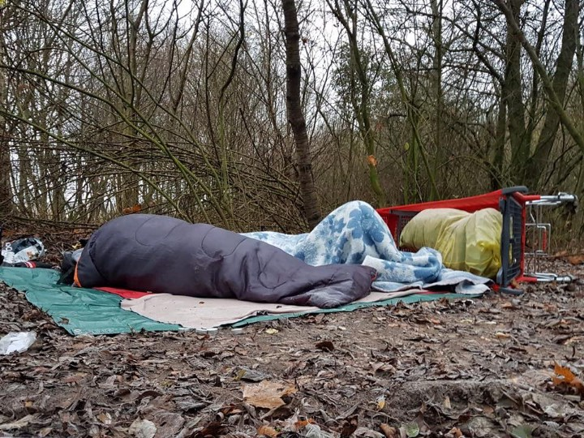
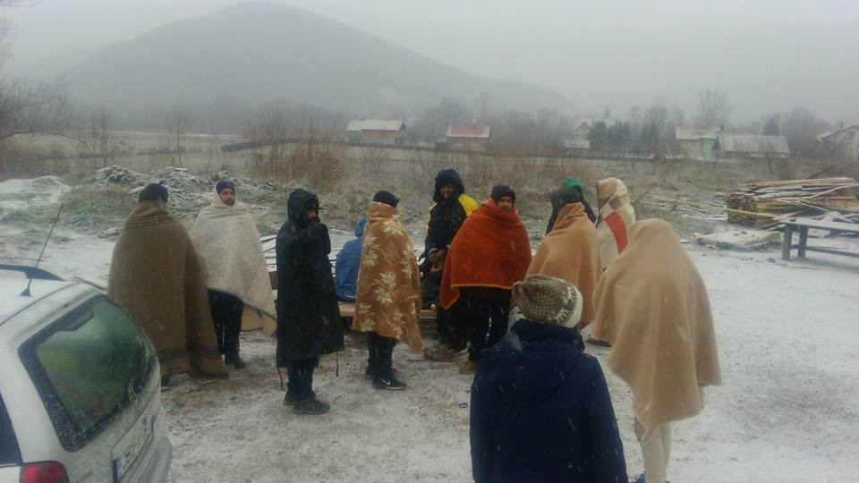

### خلاصه خبری هفتگیه آر\.یو\.س : شواهد و مدارک جمع آوری شده ی دیپورت کردن پناهندگان از کرواسی
#### AYS Weekly News Digest in Persian, December 10–16

### سوریه
#### شش هزار و ششصد غیرنظامی در این کشور در سال 2018 کشته شدند

شبکه بین المللی حقوق بشر سوریه گزارش داد که مرگ و میر های غیرنظامی اعلام کرده است که 6626 غیرنظامی در سال جاری در سوریه جان خود را از دست داده اند \. 4628 نفر از آنها توسط نیروهای اتحاد شوروی سوری کشته شده اند \. این ماه فقط 231 نفر کشته شده اند ، 79 نفر از آنها توسط اتحاد کشته شده اند \. این گزارش اشاره می کند که 90 درصد حملات انجام شده توسط اتحادیه علیه “غیر نظامیان و غیرنظامیان” است که علیه حقوق بشر بین المللی مقابله می کند\. آنها خواستار تحقیقات بین المللی و تعقیب احزاب جنجالی برای جرایم جنگی از جمله قتل های غیرقانونی هستند\.
### **مراکش**
#### هفتاد و دو نفر به مراکش بازگشته اند

رسانه های محلی گزارش دادند که در روز شنبه 8 دسامبر 72 تن از نیروی دریایی سلطنتی برده شدند و به بندر امن در ناادر وارد شدند

انجمن مروکینز دایرویت هومینز \- بخش نادر اظهار داشت که تعداد زیادی از مهاجران در مسننا، نزدیکترین منطقه به اسپانیا بازداشت شده اند و به تیزیتی بازگشته اند، جایی که امکانات بازداشتی وجود دارد\.

### ترکیه

İmece İnisiyatifi Çeşme به دنبال داوطلب هماهنگ کننده است

گروه İmece İnisiyatifi، مستقر در Cesme، در سواحل غربی ترکیه و کار در سراسر منطقه در اطراف ازمیر، به دنبال یک داوطلب هماهنگ کننده :
ماموریت ها

\- هماهنگی تیم های داوطلبان بین المللی \(5 تا 12 نفر\)
\- سازماندهی کار، رسیدگی به اورژانس، امنیت و رفتارها
\- انجام استخدام و استقبال
مؤسسه برای طرح ابتکاری فضای بسیار زیادی را فراهم می کند، دریغ نکنید با ما درباره پروژه های خاص صحبت کنید\.

\- انگلیسی مورد نیازاست ، به علاوه عربی یا ترکی
\- 6 ماه حداقل اقامت
\- ابتکارعمل، استقلال، انعطاف پذیری
\- ظرفیت زندگی در جامعه و رهبری
برای اطلاعات بیشتر و برنامه های کاربردی، CV خود را ارسال کنید :

[contact@imeceinisiyatifidernegi\.com](mailto:contact@imeceinisiyatifidernegi.com)
### **یونان**
#### تقاضا برای " تغییر" در ساموس

اعتراضات بی سابقه علیه وزیر مهاجرت و مدیر ساموس سی بی سی توسط انجمن حقوقی ساموس ثبت شده و توسط 11 سازمان ساموس امضا شده است ، گزارش شده از رفوکام
#### تقاضاهای انجمن ها

حذف فوری حداقل 2500 مهاجر پناهنده و کاهش هزینه های ساموس سی بی سی \. اخراج فوری مجرمان و مهاجران که تجدید نظر آنها رد شد و هنوز هم در شهر باقی می ماند \. پیاده سازی کنوانسیون ژنو و قوانین و مقررات بین المللی برای پناهندگان و مهاجران\. اجرای قوانین اداری مربوط به ایمنی، بهداشت و محیط زیست

بسته شدن پراکسیس ؟ تیم ن\.بردر گزارش داد که مدیریت غیر دولتی پراکسیس صدوسی نفر از کارگران را اخراج کرد و 150 تن از افراد زیر سن قانونی را به سرنوشت خود رساند\.

آر\.یو\.س هنوز منتظر پاسخ به آنچه که در حال وقوع است را دریافت می کند و ما آن را به زودی اطلاع خواهیم داد
### **بالکان**
#### در بالکان مقدار زیادی بارش برف اعلام شده

در خبرنامه پارک اطلاعاتی بالکان

"وضعیت پناهندگان و مهاجران ساکن در پارک ها و خیابان های مرکزی بلگراد، کسانی که در اردوگاه های موقت در کنار مرزهای صربستان با کرواسی و مجارستان، و همچنین در کنار بوسنی زندگی می کنند مرز گرجستان با کرواسی و دیگر نقاط در مسیر مسیر به اصطلاح بالکان، با ورود آب و هوای زمستانی واقعی که در نیمه دوم هفته انتظار می رود، بسیار بدتر می شود\. در چهار یا پنج روز آینده، مقدار زیادی برف برای کرواسی، صربستان، بوسنی، مناطق اسلوونیایی، مجارستان و اتریش پیش بینی شده است \. "

### **بوسنی**

صربستان هفتصد و پنجاه و دو نفر در ماه نوامبر با هدف درخواست پناهندگی در صربستان ثبت نام کردند، 34 نفر این پرونده را با ارسال درخواست خود آغاز کردند و به یک نفر پناهندگی داده شد\. تعداد اخراجی های جمعی گزارش شده از هزاروهشتصدوسی و نه نفر در ماه اکتبر به هزارویک نفر در نوامبر رسید\. در حالیکه فشارهای گزارش شده از سوی بوسنی و هرزگوین و کرواسی کاهش یافته است، از مجارستان و رومانی افزایش یافته است\. با این حال، که در ماه اکتبر، بیشترین تعداد دیپورت که در ماه نوامبر گزارش شد، از کرواسی ششصد وشست نفر بود

خبرهای هشدار دهنده از منابع مختلفی از کارکنان شرکت امنیتی خصوصی بارکراتس صحبت می کنند که توسط سازمان بین المللی مهاجرین در اردوگاه بیرا در نزدیکی بیهاچ مورد استفاده قرار می گیرند و از نیروهای علیه مردم اردوگاه ، از جمله افراد زیر سن قانونی استفاده می کنند\. منابع ادعا می کنند که در روز یکشنبه دو نفر از محافظان یک پسر 15 ساله را ضرب و شتم کردند \. بعضی پسران دیگر توسط امنیت دستگیر شده و در پشت ساختمان ها و یا در مقابل اردوگاه مورد ضرب و شتم قرار گرفته اند\. شرکت های امنیتی خصوصی در تمام اردوگاه های رسمی توسط سازمان بین المللی مهاجرت منعقد شده اند و گفته می شود حضور پلیس وجود ندارد\. به عنوان افرادی که برای این آژانس های خصوصی کار می کنند، آموزش حرفه ای در مورد نحوه کار با افراد آسیب پذیر ندارند و از پروتکل سازمان ملل متحد برای کار در اردوگاه ها آگاهی ندارند، روشن نیست که چرا و چگونه آی\.ا\.ام تصمیم به قرارداد با ادارات امنیتی خصوصی در این ماموریت اتحادیه اروپا و سازمان ملل متحد را گرفته اند \. ما امیدواریم نظرات رسمی خود را در مورد این اطلاعات نگران کننده به تیم ما در روزهای گذشته ارسال شود

### **موریا اکاتیمرینی**

یک مرد افغان در نزدیکی موریا اکاتیمرینی کشته شده است\. یک مرد بیست و دو ساله افغان در روز چهارشنبه در نزدیکی اردوگاه موریا کشته شد\. بر اساس گزارشات محلی، این مرد توسط یک گروه مهاجم مورد حمله قرار گرفته است\. گفته شده است که مهاجمان پول نقد 90 یورو را که قربانی در جیب داشته است را به سرقت برده اند، هرچند هنوز معلوم نیست که سرقت از انگیزه حمله است\. به گفته فعالان، یک گروه پلیس قوی در اطراف اردوگاه موریا وجود دارد
### فرانسه
#### ویژگی \- خشونت پلیس در شمال فرانسه

گزارش جدید توسط سازمان های عامیانه در شمال فرانسه، خشونت های پلیس در کاله انجام شده است: اقدامات خشونت آمیز و غیرقانونی توسط افسران انتظامی\. این دوره را از اول نوامبر 2017 تا اول نوامبر 2018 پوشش می دهد و از طریق داده های جمع آوری شده و شهادت ها ، تاکتیک های ترساندن و خشونت های جسمی و روحی که مأموران اجرای قانون آن را اعمال می کنند را شرح می دهد\.

این تاکتیکها عبارتند از: پراکندگی و موانع حرکت ، بررسی هویت ، بازداشت ، استفاده بیش از حد از عوامل شیمیایی، اعمال فشار / تجاوز، تهدید و آزار و اذیت، اخراج و تخریب و مصادره / و سرقت وسایل شخصی

کودکان نیز هم از خشونت موجود در دست بازیگران دولت فرانسه ترسیده شده اند

با وجود درجه افت درجه حرارت به پایین درمنفی 3 درجه ، مردم در کاله هنوز هم در شرایط خشن در آنجا میخوابند \. "یک بار دیگر، هیپوترمی یک خطر خیلی بزرگ است" ، به پناهندگان کمک کنید که باعث باز شدن مراکز اضطراری شود \. آشپزخانه پناهندگان همچنان وعده های غذایی گرم و منابع انسانی مثل چوب را توزیع میکنند \. این مشکلات نه تنها بر مردان مجرد بلکه بر خانواده ها هم تاثیر گذاشته است \. مرکز زنان پناهندگاه در گرند سیتنه اعلام می کند که تنها جمعه گذشته ، هفت خانواده از مقامات خواستند که به مراکز اقامتی منتقل شوند اما هیچ مکانی در دسترس نبود

### استکهلم
#### مذاکرات صلح در استکهلم با حضور زنان برگزار شد

مذاکرات صلح با حمایت سازمان ملل متحد در روز پنج شنبه در پایتخت سوئد آغاز شد \. رسانه ها گزارش می دهند که تنها یک زن در این مذاکرات حضور داشته است \.
فعالان زنان برای شبکه یمن برای نمایندگی از زنان در میز مذاکره شرکت کردند
### **عمومی**

سازمان ملل متحد و شرکای سازمان های غیر دولتی برنامه پناهندگی سال 2019 و2020 و انعطاف پذیری منطقه ای به نام 3RP را منتشر کرده اند که یک طرح 5\.5 میلیارد دلاری برای حمایت از تلاش های ملی در ترکیه، لبنان، اردن، مصر و عراق برای مقابله با ادامه تاثیر بحران سوریه است\. با توجه به 3RP، آنها قصد دارند واکنش گسترده ای را که بیش از 9 میلیون نفر در سراسر پنج کشور انجام می دهند، اجرا کنند\. چنین حمایتی شامل کمک به حل و فصل مشکلات حفاظتی برای پناهندگان، افزایش تعداد فرزندان به نوعی آموزش و پرورش، ارتقاء خدمات اساسی و فرصت های اقتصادی به ویژه برای زنان است و استفاده از تخصص شرکای 3RP برای تقویت ظرفیت پاسخ ملی و بازیگران محلی است
### **خاص**

بحث های ای\.پی در مورد وضعیت کارکنان فرانتکس بی بی سی به زودی در مرز بین بوسنی و هرزگوین و کرواسی مستقر خواهند شد

ویتنی آندریوکیتیس، کمیسیون اتحادیه اروپا، روز پنج شنبه گفت: "و توافق نامه به زودی امضا خواهد شد\." با این حال، حضور فرانتکس در منطقه مرزی بیش از نیمی از سال گزارش شده است\. او در بیانیه خود در پارلمان اروپایی درباره وضعیت افراد در بیهاچ اظهار داشت که در حال حاضر حدود پنج هزارو صد نفر در مراکز اداره می شوند\. حدود هزار نفر از آنها درخواست کمک نکرده بودند\. از ماه ژوئن 2018، اتحادیه اروپا کمک های بشردوستانه و 2\.2 میلیون یورو را از طریق اقدامات ویژه و حمایت مالی و پیش از عضویت، تقریبا دو میلیون یورو اختصاص داده است\. بارها تکرار کرد که مرز کرواسی به بیهاچ ، طولانی ترین در اروپا است

وی گفت: "ما همه موافقیم که مرز بین بوسنی و کرواسی مرز خارجی اتحادیه اروپا است و کرواسی مسئول مدیریت این مرز است\." بوسنی صدوهشتاد نفر مجتمع پلیس دیگر را به مرزها اعزام کرد\. آر\.یو\.س قدردانی می کند که پارلمان اروپا درباره وضعیت پناهندگان در بوسنی و هرزگوین صحبت می کند\. اما ما آن را به عنوان هشدار می بینیم، که کشورهای عضو هنوز هم در مورد چگونگی مقابله با افرادی که به دنبال پناهندگی هستند، نیافتند\. صرفا تخصیص پول به برخی کشورها و سازمان های غیردولتی نیازی به انجام درمان بهتر نیست\. علاوه بر این، ما خواستار آن هستیم که هر گزارش خشونت پلیس و فشارهای غیرقانونی از کرواسی به بیهاچ بررسی شود\. به مردم باید فرصتی برای درخواست پناهندگی داده و درخواست های آنها باید به روش عادلانه مورد پردازش قرار گیرد

پیشنهاد ویزای انسان دوستانه برای مبارزه با مرگ ناخواسته در مرزهای اروپا برای عبور امن \. پارلمان اروپا خواسته کمیسیون برای ارائه پیشنهاد قانونی تا 31 مارچ 2019 \. بنابراین E\.U\. کشورهای عضو می توانند یک ویزای انسانی ارائه دهند\. EP گزارش داد که در حدود 90 درصد از افرادی که بعدها به آنها حمایت بین المللی اعطا شده، به اتحادیه اروپا از طریق روش های نامنظم رسیده اند\. براساس این بیانیه، "اعضای پارلمان بر این باورند که علی رغم بسیاری از اعلامیه ها و درخواست راه های امن و قانونی برای پناهجویان در اروپا، اتحادیه اروپا یک چارچوب هماهنگ از پروسه های ورود پناهندگان محافظت می کند\."

**We strive to echo correct news from the ground through collaboration and fairness\.**

**Every effort has been made to credit organizations and individuals with regard to the supply of information, video, and photo material \(in cases where the source wanted to be accredited\) \.** 
**Please notify us regarding corrections by email \(areyousyrious@gmail\.com\) or via Facebook, Twitter and Medium\.**

_Converted [Medium Post](https://medium.com/are-you-syrious/%D8%AE%D9%84%D8%A7%D8%B5%D9%87-%D8%AE%D8%A8%D8%B1%DB%8C-%D9%87%D9%81%D8%AA%DA%AF%DB%8C%D9%87-%D8%A2%D8%B1-%DB%8C%D9%88-%D8%B3-%D8%B4%D9%88%D8%A7%D9%87%D8%AF-%D9%88-%D9%85%D8%AF%D8%A7%D8%B1%DA%A9-%D8%AC%D9%85%D8%B9-%D8%A2%D9%88%D8%B1%DB%8C-%D8%B4%D8%AF%D9%87-%DB%8C-%D8%AF%DB%8C%D9%BE%D9%88%D8%B1%D8%AA-%DA%A9%D8%B1%D8%AF%D9%86-%D9%BE%D9%86%D8%A7%D9%87%D9%86%D8%AF%DA%AF%D8%A7%D9%86-%D8%A7%D8%B2-%DA%A9%D8%B1%D9%88%D8%A7%D8%B3%DB%8C-3c9b1df4f9e6) by [ZMediumToMarkdown](https://github.com/ZhgChgLi/ZMediumToMarkdown)._
