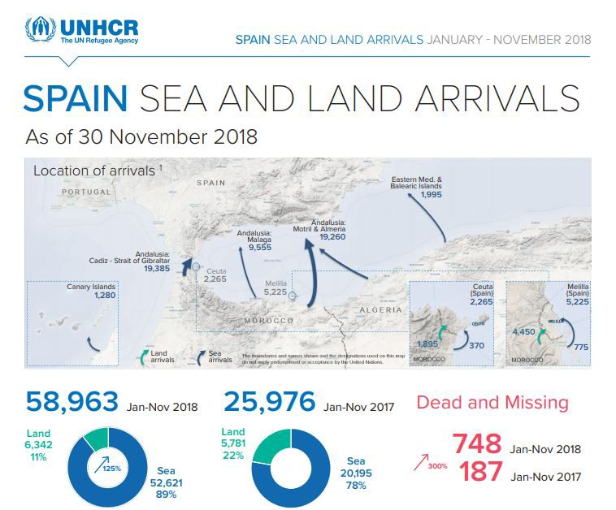

### AYS Daily Digest 21/12/18 — Italian authorities leave refugees to drown or be returned to Libyan hell

Refugees kidnapped in Nador Morocco//New arrivals in Spain//SAR ships begin operations//Unaccompanied minors in Greece//deportations from Germany//and more…

](assets/3976d068d48c/1*dpKNbT4-tKpgUsRBq7Ee6g.jpeg)

Photo Credit: [Proactiva Open Arms](https://www.facebook.com/proactivaservice/?__tn__=%2CdkCH-R-R&eid=ARCEaS0ky9xhEWTbMMMaYm9bPiDV5jJJFRsbr1_dNkKkZes3TNPUYOMHIn446ijmokwEcBFoFhPFmjnF&hc_ref=ARTytwRawg_V7I_asr1I74W07hZB3UkE7Ys7d9OiEGr2zxwbwgx46QH5baRaLHO7vGQ&fref=nf&hc_location=group)
#### Feature

Italian rescue coordination centers \(MRCC\) are increasingly ignoring refugee’s SOS calls, either ignoring them or turning them over to the criminal Libyan “coast guard”\.

Towards midnight on 20/12/18 the [Alarm Phone](https://www.facebook.com/watchthemed.alarmphone/) rescue coordination group received a call from a boat that had left from Libya\. The rudder was broken so the boat could not move, and the people aboard were in fear of sinking\. The rescue line was in regular coordination with the people on the boat, passing off the information, including GPS coordinates to MRCC Rome\.

Despite this, the Italian authorities failed to act for over 10 hours, according to Alarm Phone\. MRCC Rome eventually denied their responsibility for the boat, and handed the case over to the so\-called Libyan coast guard\. The people aboard the boat are now being retunred to hellish conditions in Libya\. As Alarm Phone wrote today, “Once more, this case shows how a cynical deterrence policy overrides the duty to rescue\.”

■■■■■■■■■■■■■■ 
> **[Alarm Phone](https://twitter.com/alarm_phone) @ Twitter Says:** 

> > Since yesterday evening we know of 20 ppl in urgent distress, but MRCC #Rome refers us to the so-called Libyan Coastguard who are not responsive. Once more this shows how a cynical deterrence policy overrides the duty to rescue. We call  to engage in a SAR operation immediately. 

> **Tweeted at [2018-12-21 08:12:43](https://twitter.com/alarm_phone/status/1076027671535120384).** 

■■■■■■■■■■■■■■ 

■■■■■■■■■■■■■■ 
> **[Alarm Phone](https://twitter.com/alarm_phone) @ Twitter Says:** 

> > We have repeatedly appealed to the MRCC #Rome to launch a SAR operation throughout the night but the 20 ppl have now been intercepted and will be returned inhumane conditions in #Libya. https://t.co/ExMHyTCsYB 

> **Tweeted at [2018-12-21 12:02:40](https://twitter.com/alarm_phone/status/1076085543270838272).** 

■■■■■■■■■■■■■■ 

■■■■■■■■■■■■■■ 
> **[MSF Sea](https://twitter.com/MSF_Sea) @ Twitter Says:** 

> > The forced return to #Libya of #refugees and #migrants attempting to cross the #Mediterranean is a violation of international law.

But this has happened 15,000 times this year with the help of #European funding. When will it stop?

[reut.rs/2Bu8Sqg](https://reut.rs/2Bu8Sqg) 

> **Tweeted at [2018-12-21 07:21:51](https://twitter.com/msf_sea/status/1076014872406704128).** 

■■■■■■■■■■■■■■ 

### Morocco

As has become common in many “transit” countries, criminal gangs and kidnappers routinely prey on migrants and refugees traveling through Morocco\. This week, the rights group [AMDH Morocco](https://www.facebook.com/AmdhNador/?__tn__=%2CdkCH-R-R&eid=ARD3-V2Inud8ZHfiXpEqWjSeo1XmBsB0THPvY9wo2CQ-RbMmnk5fixk6eaLuWQ3rjaq2vDM6zfGM1wRs&hc_ref=ARRzc5nBOSK9mfrCZ4fY60sx6HDU5WBl-CfdMCe3foHuWCK1o5oW6h_7tqiL8UM54ik&fref=nf&hc_location=group) received a call for help from a group of 60 Bangladeshi refugees who claim they are being held in Nador by a group of kidnappers\. “We’ve been locked in this house for 15 days\. They took all our money” read one of the messages received by AMDH\.

AMDH is publicly sharing this information, as well as the geo\-location of where the refugees are suspected to be held, in the hopes that it will prompt the authorities to take action\.

 \.](assets/3976d068d48c/1*h8zO9PTrcsAxzXwHZ6uplQ.jpeg)

A photo of the victims received by [AMDH](https://www.facebook.com/AmdhNador/?__tn__=%2CdkCH-R-R&eid=ARD3-V2Inud8ZHfiXpEqWjSeo1XmBsB0THPvY9wo2CQ-RbMmnk5fixk6eaLuWQ3rjaq2vDM6zfGM1wRs&hc_ref=ARRzc5nBOSK9mfrCZ4fY60sx6HDU5WBl-CfdMCe3foHuWCK1o5oW6h_7tqiL8UM54ik&fref=nf&hc_location=group) \.
### Sea — “There is no Christmas in the Mediterranean”

](assets/3976d068d48c/1*DWTUtok8GXNlVDiOz4FSjw.jpeg)

Photo Credit: [Proactiva Open Arms](https://www.facebook.com/proactivaservice/?__tn__=%2CdkCH-R-R&eid=ARCEaS0ky9xhEWTbMMMaYm9bPiDV5jJJFRsbr1_dNkKkZes3TNPUYOMHIn446ijmokwEcBFoFhPFmjnF&hc_ref=ARTytwRawg_V7I_asr1I74W07hZB3UkE7Ys7d9OiEGr2zxwbwgx46QH5baRaLHO7vGQ&fref=nf&hc_location=group)

25 people drowned in the Western Mediterranean while trying to reach Spain today\. 783 people have drowned this year trying to reach Spain, according to [figures from the UNHCR](https://twitter.com/ACNURspain/status/1076179294173495296?fbclid=IwAR1O9V99vj0XO8ufWOF72_c23jmf_2SgUgoRSs5PqrvDlX7lyfCo0K4GYnM) \. That is already three times the number of people who died last year\. In spite of dangerous conditions, the crossings from Morocco to Spain have continued uninterrupted\.

Within a mere 24 hours of arriving in the SAR zone, the Open Arms rescue ship has already saved over 300 people from 3 boats\. According to the group, there were many children and pregnant women among the people rescued\. “There is no Christmas in the Mediterranean,” the group wrote today\. “If you tell us about the successes of migration policies, we will tell you about the deaths thats were disappeared\.”

](assets/3976d068d48c/1*z7czV8j4FtapVcA7y7PNug.jpeg)

Photo Credit: [Sea\-Eye](https://www.facebook.com/seaeyeorg/photos/a.730635527042347/1702291316543425/?type=3&theater)

The Sea\-Eye ship Alexander has finally been cleared to start its mission after an extensive review by the Spanish port authority\. The Alexander will be the first NGO ship to operate under a German flag\.

The Sea Eye ships Sea\-Eye 2 and the Albrecht Penck are also set to begin SAR missions in the Mediterranean today\. You can learn more about the group and support them by following the links [here](https://www.facebook.com/seaeyeorg/photos/a.730635527042347/1702291316543425/?type=3&theater) \.

The EU will prolong the mandate of its naval security mission in the Mediterranean until at least the end of March, according to a statement released today\. The mission will not be changed in spite of Italy’s threat to pull out of the mission if people rescued at sea by the operation’s ships are not shared among EU member states\.
### Greece
#### Islands

New Arrivals \(figures via Aegean Boat Report\)

One boat landed in Pedi, Lesvos north east, 02:40\. There were 34 people aboard, no breakdown currently available\.

A boat landed in Kalo Limani, Lesvos North West at 05:00\. There were 48 people: 22 children, 14 women and 12 men\.

60 people arrived on Samos this morning\. \(No further information available\. \)
#### Mainland

In the Evros region of Greece, MSF is urgently calling upon the Greek authorities to respond to their obligations and provide access to healthcare for refugees in camps and detention centers in Evros\. You can see their full statement \(in Greek\) [here](https://twitter.com/MSFgreece/status/1076123848276361222?fbclid=IwAR3mbEtdKE0wW9AkJT-vNMBFk8PMsBZTQr3dpbehybvHZJmBuZQR5UiaOMo) \.
#### Unaccompanied minors in Greece: RSA Report

In Greece, unaccompanied refugee children are hardly afforded any more protection that adults are — in other words, next to nothing\. A new report from RSA Aegean reveals the scale of this situation in Greece\. According to the latest government statistics, there are 3,786 unaccompanied children registered in Greece\. \(The total number of unaccompanied children may be higher, as many are never registered as minors\. \)

Over half of these 3,786 unaccompanied children are living without long\-term or temporary accomodation\. RSA estimates that 570 of these children are living homeless, although the number could be higher\. RSA lawyer Eleni Velivassaki states in the report that,

> “The national authorities have been failing for years to increase sufficiently accommodation places and develop an effective protection system\. The result is seeing so many unaccompanied children living in the streets or being placed in ‘protective custody’, a form of detention that cannot be justified under international law and violates the right to liberty and security of the children”\. 

You can see the report in full [here](https://rsaegean.org/en/greece-hundreds-of-vulnerable-refugee-children-left-uprotected-and-homeless-2/?fbclid=IwAR3NPtx89JeJTAGfa7i79vnZXwXSShnRM0OUkRrGmFqOhF-iA0NHzOTiTGY) \.
#### Hate\-Crime victim returns to work

Last week, an immigrant in Greece was assaulted outside the grocery store he works at\. The man was viciously attacked after asking a customer not to park in a handicapped parking space, who responded by hurling slurs at the man, and attacking him with a metal rod\. Despite the obvious racist nature of this crime, the prosecutor declared that there was “no racist motive”\. Out of all the racially motivated attacks in Greece, only 2–3 have been prosecuted as crimes with racist motivations\.

The victim returned to work shortly after the attack\. Photo credit: AYS\.

The Refugees’ Refuge group is passing out hot meals in Athens every night over the next few weeks\. If you want to join in their efforts or donate, click [here](https://www.facebook.com/RefugeesRefuge/?__tn__=%2CdkCH-R-R&eid=ARCOL8k2yWR38JVncCkLittBZ8Evlsmk--pl_556WkVcUQAgY8zgkOR-cVa_0SadDRx1BfjOtr--kK9K&hc_ref=ARQrcxsULMQB0lPKn--vpJQ4-FViGZxe5H4e90XHZGyYOQxjcerd4dO2o6Afjxi8iBE&fref=nf) \.

The Mobile Info team for refugees in Greece will be on break until 7 January\.
#### Balkan Weather Report \(forecast for 22\.12\)
MONTENEGRO

Moderately to predominantly cloudy and mostly sunny\. During the morning there will be fog in the basins in the north\. The wind will be weak to moderate from changing directions\. The lowest temperatures will be from \-1 to 9 and highest from 3 to 14 degrees\.
#### SERBIA

Frost in the south and east during the morning\. During the day moderately to completely overcast with rain in the northeast\. The wind will be weak to moderate blowing from the southwest\. The lowest temperatures from \-4 to 4 and digest daily from 5 to 12 degrees\.
#### BiH

Cloudy with rain in the morning and in the evening\. The wind will be weak to moderate blowing from the south and southwest\. The lowest temperatures will be from 0 to 6 and highest daily from 5 and 11 degrees\.
#### CROATIA

Moderately to predominantly cloudy and warmer\. The wind will be moderate to strong blowing from het southwest and in Dalmatia a southern wind\. As the day progresses the wind will decrease in strength\. The lowest temperatures from 0 to 12 and highest daily from 8 and 15 degrees\.
### Germany

The German federal government in cooperation with police are working on a plan to hold people slotted for deportation in criminal prisons\. The highest civil court in the country previously ruled this practice illegal in 2014\. Despite this, federal authorities are trying to push through the measure, on the basis that a high number of people go missing before their scheduled deportations\. \(Apparently, when you tell people you’re going to fly them back to a war\-zone, they don’t always wait around for you\. \)

In Germany, theoretically only two groups of people are subject to deportation — people who have had their residency permit rejected, on note extended, and migrants who are convicted of crimes\. In the case of those who have had their residency rejected, people are not meant to be subject to deportation until they have overstayed in Germany for six months\. Despite these restrictions, Germany has carried out a number of deportations in recent months that seem to violate their own rules\. The following list of illegal deportations carried out in the last year has been provided by the German rights group [Pro Asyl](https://www.proasyl.de/news/so-sieht-merkels-nationale-kraftanstrengung-abschiebung-in-der-praxis-aus/?fbclid=IwAR3iQ7z6sWQjqLMnOWou2eGiIStWtAqDoUNBjt_kQpxF8d3yhNGoLYTsRJQ) :

> \(1\) Deportation of a kindergartener \(eventually stopped\)
 

> \(2\) Deportation of father while wife was giving birth \(deportation of father eventually stopped\)
 

> \(3\) Deportation of a person who had never received the negative asylum decision, deportation while appeal is still pending\.
 

> \(4\) Deportation of a cancer patient with a hollow nedle in the neck
 

> \(5\) Deportation straight out of court
 

> \(6\) Deportation out of rehab
 

> \(7\) Deportation out of school
 

> \(8\) Deportation of an especially well integrated person
 

> \(9\) Deportation of a family with babies and suicidal father 

Just last week, [German officials deported a Georgian family](https://m.wn.de/Muenster/Stadtteile/Roxel/3591755-Abschiebung-in-Roxel-Georgische-Familie-morgens-um-vier-Uhr-abgeholt?fbclid=IwAR0HBuKzwx0-5cjsJZbI-odmOcFSzDKJdTzaYulku462BFTvlZV9ehcoRXg) with minor children in the middle of the night, despite the night\-time deportation of children being forbidden by federal decree\.

**We strive to echo correct news from the ground through collaboration and fairness\.**

**Every effort has been made to credit organizations and individuals with regard to the supply of information, video, and photo material \(in cases where the source wanted to be accredited\) \. Please notify us regarding corrections\.**

**If there’s anything you want to share or comment, contact us through Facebook or write to: areyousyrious@gmail\.com**

_Converted [Medium Post](https://medium.com/are-you-syrious/ays-daily-digest-21-12-18-italian-authorities-leave-refugees-to-drown-or-be-returned-to-libyan-3976d068d48c) by [ZMediumToMarkdown](https://github.com/ZhgChgLi/ZMediumToMarkdown)._
