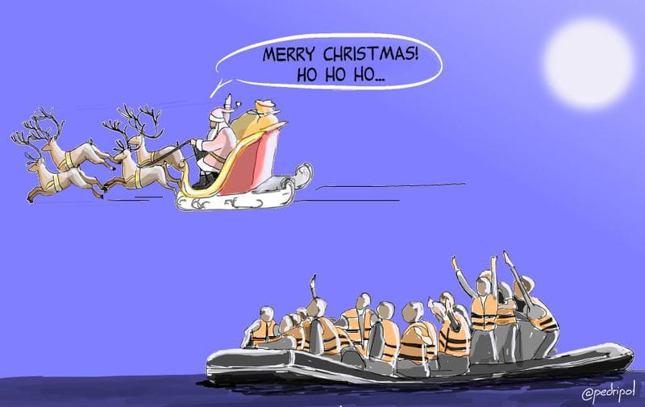
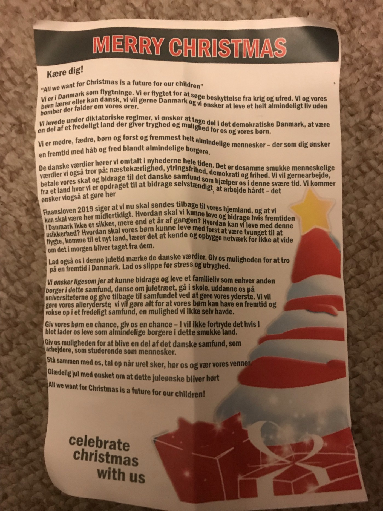

### AYS SPECIAL: Christmas letter to fellow humans

_On December18th, this Christmas letter was shared in 52 municipalities all over Denmark\. It was written by asylum seekers in this country, and their friend from solidarity movement\. The letter was issued on the same day when the Financial Act 2019 was passed in the Parliament\. The Act says that all the refugees can stay in Denmark only temporarily, and that no refugee should ever integrate without knowing they have to leave\. It is said this letter had to be writing, but it is important to read it\. It could have been written in any EU member country_

Merry Christmas… really? By Pedripol
#### All we want for Christmas is a future for our children

Dear you\!

We are in Denmark as refugees\. We fled to seek protection from war and violence\. We and our children are learning Danish language\. We really want to stay in Denmark, and we wish to live a regular life without bombs falling on our heads\.

We lived in dictatorships, we wish to be a part of the democratic society in Denmark, to be a part of a peaceful country which provides safety and possibilities for our children\.

**We are mothers, fathers and first of all ordinary humans who, like all of you, wishes a future with hope and peace amongst ordinary citizens\.**

In the news we hear about the Danish values\. Also we believe in these beautiful values; love to your next, freedom of speech, democracy and liberty\.

We want to work and pay our taxes, contribute to the Danish society which helps us in these hard times\.

Back in our countries we were raised to be independent, to work hard, and we want to do that here, too\.

In the Financial Act 2019 it’s written that we have to go back to our country of origin, that we only can be in Denmark temporarily\. How can we live and contribute if our future in Denmark ain’t secured more then a year at a a time? How can we live with this uncertainty? How can our children live with first being forced to flee, then arriving to a new country, get to know the country build networks and relations without knowing if all of this will be taken from them tomorrow?

Let us in this Christmas time to feel the Danish values\. Give us the opportunity to believe in a future in Denmark\. Relief from stress and the feeling of not being safe\.

We wish, like you all, to contribute and live a family life as any other citizen in this society, dance around the Christmas tree, go to school, educate in the universities, and give back to the society by doing our best\.

We want to do our best, we will do anything to make it possible for our children to grow up in a peaceful society, a chance we never got\.

**Give our children a chance, give us a chance — you won’t regret if you just let us live as regular citizens in this beautiful country\.**

Give us the possibility to be a part of the Danish society, as workers, as students as humans\.

Stand together with us, raise your voice when injustice happens, listen to us and be our friends\.

**Merry Christmas — with the hope that our Christmas wish will be heard\!**

**We strive to echo correct news from the ground through collaboration and fairness\.**

**Every effort has been made to credit organizations and individuals with regard to the supply of information, video, and photo material \(in cases where the source wanted to be accredited\) \. Please notify us regarding corrections\.**

**If there’s anything you want to share or comment, contact us through Facebook or write to: areyousyrious@gmail\.com**

_Converted [Medium Post](https://medium.com/are-you-syrious/ays-special-christmas-letter-to-fellow-humans-54ea042043f) by [ZMediumToMarkdown](https://github.com/ZhgChgLi/ZMediumToMarkdown)._
