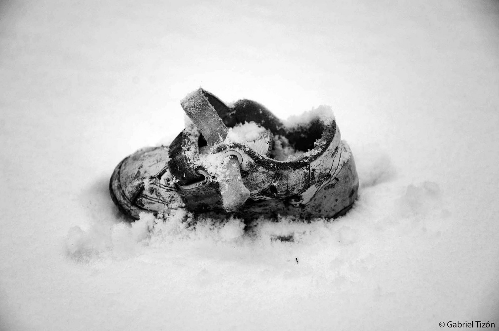
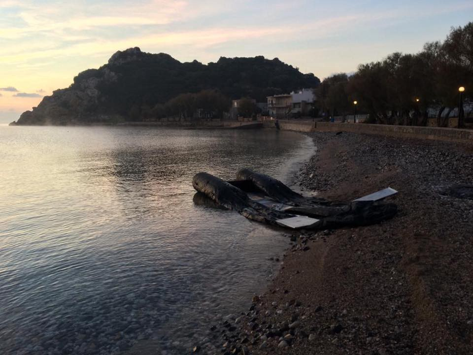

### DAILY DIGEST 24/12/2018: More money to strengthen the EU borders in 2019

[Are You Syrious?](https://medium.com/@AreYouSyrious?source=post_header_lockup)

Dec 25

_European Commission plans to strengthen border surveillance in member countries // Children and border violence // People are still dying in Afghanistan // New Turkish military offensive in Syria // About 70,000 asylum seekers registered in Greece // Austria considers denying asylum to anyone who used smugglers to get to Europe_

By Gabriel Tizon\.
### Feature

A couple of days ago, on December 20th, the European Commission \(EC\) made a decision that clearly shows the direction Europe is heading in next year — **more borders and more surveillance** \. For all\.

According to this [new decision](https://sofiaglobe.com/2018/12/20/european-commission-awards-additional-305m-euro-to-four-eu-countries-facing-migration-pressure/?fbclid=IwAR0ydhqjkaZMJx9V2NaldNY8kEUBfbXRh2MVRmVUHM-Iit1TfGoO7xOHcVo) , an additional 305 million euro will be directed toward “ _emergency assistance to support migration and border management in Greece, Italy, Cyprus and Croatia_ ”\. The money will be spent to “ _increase reception capacity, protect victims of human trafficking and strengthen border surveillance and management capacity_ ,” the Commission said\.

This emergency funding will be provided under the European Commission’s Asylum, Migration and Integration Fund \(AMIF\) and the Internal Security Fund \(ISF\), and is part of the 10\.8 billion euro for migration, border management and internal security already mobilized by the Commission for the period 2014–20\.

This decision comes almost at the same time as the [latest report by the Save the Children](https://www.savethechildren.net/article/hundreds-children-report-police-violence-eu-borders) which shows the results of tightening the borders in Europe\.

Based on testimonies gathered for the purpose of this research, they registered **more than 1,350 cases of children being pushed back across European Union borders between January and November this year** \. “ _Almost one\-third of these cases reportedly involved violence inflicted by police or guards at borders,_ ” the report concludes\.

The worst situation is for children travelling alone\. Some of them spoke of being threatened with weapons or being beaten by border guards, who were hitting and kicking them, often using batons; they have been bitten by dogs and humiliated, sometimes forced to take off their clothes and shoes\.

Many of these cases happened at the Croatian border\. However, after all the appeals and evidence offered by [activists](https://www.borderviolence.eu) and [the media](https://www.theguardian.com/world/2018/dec/17/croatia-violating-eu-law-by-sending-back-asylum-seekers-to-bosnia) , but also [human rights organizations](https://www.hrw.org/news/2018/12/11/croatia-migrants-pushed-back-bosnia-and-herzegovina) , the EC will award Croatia an additional 6\.8 million euro “ _to help reinforce border management at the EU’s external borders, in full respect of EU rules_ ”\.

Apparently, the money will be directed toward “ _strengthening border surveillance and law enforcement capacity by covering the operational costs of 10 border police stations through the provision of the daily allowances, overtime compensation and equipment_ ”\.

Partially, the money will be used for the establishment of the “ _monitoring mechanism_ ” that should “ _ensure that all measures applied at the EU external borders are proportionate and are in full compliance with fundamental rights and EU asylum laws_ ”\. If this means the violence will be stopped and perpetrators punished, we salute the decision\. But what we have learned so far is that these types of measures will only increase profit for smugglers and make migrations even more difficult\.

However, we have the whole year ahead to see how the EU will find a way to worsen further the situation for people on the move and what measure will be applied to continue violating one of the basic freedoms that we all have — freedom of movement, but also the right to asylum\.
### Afghanistan

In a “safe country,” which according to the governments of some EU member states Afghanistan is, **on Tuesday morning at [least 43 people were killed](https://www.bbc.com/news/world-asia-46674427?ocid=socialflow_twitter&ns_campaign=bbcnews&ns_mchannel=social&ns_source=twitter) in a suicide and gun attack on a government compound in Kabul** \.

The incident reportedly started with a suicide car bomb blast near the building’s entrance, before gunmen stormed inside\.
### Syria/Lebanon

[According to the local media](https://southfront.org/over-1000-refugees-returned-to-syria-from-lebanon/) , **over 1000 Syrian refugees crossed the border from Lebanon in an attempt to go back home on Monday** \. Apparently, they are returning voluntarily, as Watania Media Agency reports\. The operation was organized jointly with the UNHCR\.

Most of the people who returned are women and children\.

According to Lebanese officials, some 110,000 Syrians have returned to their homeland since July\.
### Turkey/Syria

At the same time, the war in Syria is still raging\. [**Turkey has sent reinforcements**](https://english.alarabiya.net/en/News/middle-east/2018/12/24/Turkey-sends-military-reinforcements-to-Syria-border-.html) **to the border with Syria after Trump ordered the withdrawal of ground forces\.** The army is headed towards Jarabulus and Manbij, which is held by a US\-backed Kurdish YPG militia viewed by Ankara as “terrorists” linked to Kurdish insurgents inside Turkey\.

Turkish President Recep Tayyip Erdogan warned Ankara would launch a third operation against the YPG and the last remaining elements of ISIS in Syria in the coming months\.
### Sea

For rescuers at sea, Christmas eve and Christmas morning were anything but calm\. For over [48 hours now](https://www.facebook.com/.../a.15261.../2280575722216658/...) , they have been looking for 12 people who are missing on a rough sea\. After the authorities refused to save the people, NGOs and volunteers started their rescue mission\.
### Greece

According to the [Aegean Boat Report](https://www.facebook.com/AegeanBoatReport/posts/496574277532348?__xts__%5B0%5D=68.ARBtGC2-VSIcV9ncLwaaNPIIrfVYPwHvGltVMJ3kYdCMrRZyoOs2TPcaTnH9dms_bYtczqHamAKxgDu4MK23ILu5zsXrWVsvmbRzQYB8wAwIkq0CJNvoX6Dm4CNSdyRVapNc7psIEmBztpwDdcjbMDqqJtDVXXyeAFDoATZRm4OJT245cTHKP0uVJQmfiDankHJ7JFLf59gfdo4WgrjneuuyPgJCGYZh-JnjGfyGIkMJ8q1c6MmSV2l78DG4CRuxX_IENKLOBtWg2llphnIkxVf3WW8gwZZq_DcxPjWGxgchQBdUo24dUeMki_I9Gr8cyZmSzn6iAj9XOTU-1q5xsj4&__tn__=-R) , since Monday morning six boats have arrived on the Aegean Islands: three on Lesvos and three on Chios carrying 134 people all together\.

**This week, 822 people arrived on the Aegean islands** , an increase from last week’s 598 arrivals and from last year’s 441 arrivals during the same period\.

Over the last week, [Watch The Med — Alarmphone](https://www.facebook.com/.../a.15261.../2280373905570173/...) , was alerted to six distress situations in the Aegean Sea\.

During this year we have been reporting extensively, together with many other groups, about the increase of the number of people arriving in Greece and the further deterioration of the living conditions in the existing centres, which have been overcrowded for a very long time\. [**According to the UNHCR**](https://data2.unhcr.org/en/documents/download/67410) **, at the moment there are around 69,300 people in Greece, and on the islands alone, the number is over 16,000\.** These are only people registered with the UNHCR and officials, but the real number could be much higher\.

Decongestion, which the Greek government has been promising for months now, is happening really slowly and with no real impact on the quality of life for people on the islands, especially Lesvos, Samos and Chios\.

After another landing in Chios\. Photo by Emma Vagabond Roberts

In total 3,060 people were transferred from Lesvos \(1,003\), Samos \(918\), Chios \(759\), Leros \(240\) and Kos \(140\) this month\.

When it comes to children, **there are at least 3,680 unaccompanied and separated children in Greece** \. Just a tiny part — about 1,200 — are placed in some type of shelters\. The others are in “protective custody” all over Greece, or in informal housing, or risk homelessness\.

Talking about living conditions, this year people in camps in Greece \(but it is not much different in many other countries in Europe\), again remained exposed to all types of violence, including sexual and gender\-based violence\.

This year, 14,012 people received refugee status or subsidiary protection in Greece, and 10,351 in the entire 2017\.

The relocation programme of asylum\-seekers from Greece to other EU Member States concluded in September 2017\. In total 22,000 people departed\.

The Dutch Solidarity Convoy [_Lets Bring Them Here_](https://www.facebook.com/groups/446386565554391/permalink/994734714052904/) arrived on Monday in Athens to demand that the Greek and Dutch governments make a bilateral agreement to relocate at least 1000 refugees to The Netherlands\.

And some good news, but also a call for support for three very big and important projects in Greece\. The first one is Khora Community Center\. Finally, [Khora found the new home](https://www.facebook.com/KhoraAthens/posts/1057303867775554?__xts__%5B0%5D=68.ARAqeNIRsI7BOhsiFBitqe904q7vHnwdQI73a-CjIY2h3Bp_mO_gndNMkYSaAy3IihxpOQdFTwJT8NNfcidcbu2pkyIyKnKw-iy39WeKazMZLuM5zAGCVYOMYFx9jTuxTUve6FNGipKUYF3EC0K6xpxElF1a3-5bCQf8_41AGulsTrf73GMfXb-YuGHSKQ89-jbrR97C9I_NyOdolcYckqPG8GBUW3c1MpEXLA-4x7qmUtIVLNfHbygzu3EfzOphz57q7M4QJu3eg7O4If0b7oqjwNS-Ukh5OFL6kpif_01Zw1fVj5WWj6SxYNTzCEwvCv20rFbpH834i_6vFl_FcAxQ-w&__tn__=-R) and soon they will re\-open their kitchen and cafe space\.

[City Plaza](https://best-hotel-in-europe.eu/?fbclid=IwAR1K_PqIpNPuRxjxlAQkyr_AARkyf_G-lQ-ePbqJm33-ylSYOF5F9RnD66I) continues to provide shelter to over 150 people under the motto “We live together — solidarity will win”\.

> “The hotel demonstrates every day anew that even in a situation of crisis and poverty it is possible to welcome people with open arms and to create dignified living conditions for all\. To that end, the refugees in the hotel need further support: for 1000 meals a day, medicine, for school materials and many other things\. And, first and foremost, in order to be and remain a political example: The City Plaza Hotel is a place of equality and solidarity, the lived antithesis to Fortress Europe and its borders of shame\. It is a symbol of hope\. Or simply: City Plaza is the best hotel in Europe\.” 

Amazing [project Scrap Coop](http://www.scrapcoop.org) , a free\-to\-use cooperative collaborative workshop in Athens, which opened their doors in October 2018, has a big new plan: to install solar panels on their roof\.

They estimate that yearly electricity bills are up to €15,000, which is a huge cost\. Their plan is to install solar panels and in that way save money and ensure a sustainable future for the workshop, guaranteeing that the tools stay on for years to come\.

If you can help, please [see here](http://www.chuffed.org/project/SolarPower-for-ScrapCoop) for more details\.
### WEATHER

MONTENEGRO

In the south and centre, sunny or lightly to moderately overcast\. In the north cloudy, cold and windy with occasional snow or blizzards\. The wind will be moderate to strong, during the morning with very strong gusts, blowing from the north and north\-east\. The lowest temperature from \-9 to 7 and the highest daily from \-7 to 12 degrees\.

SERBIA

Moderately to entirely cloudy, colder with locally some snow, in the morning locally sunny from time to time\. The wind will be moderate, strong from time to tome, blowing from the west and northwest\. The lowest temperatures from \-3 to 2 and the highest daily from 2 to 5 degrees\.

BiH

Cloudy in Bosnia with light snow\. Rain or sleet in the far north and northeast\. Predominately sunny in most parts of Herzegovina and predominantly cloudy in the north of Herzegovina\. In most of Bosnia the wind will be moderate, blowing from the west and northwest, and in Herzegovina and some parts of Bosnia there will be a strong northern wind\. Towards the end of the day, the wind will decrease in strength\. The lowest temperature from \-4 to 4 and the highest daily \-2 to 3 degrees\.

CROATIA

Moderately to predominantly cloudy with local rain\. In the afternoon the rain will cease and it will clear up starting from the north with a considerable drop in temperature\. Inland a moderate to strong southwestern wind turning into a northwestern and northern wind, along the coast a southern wind turning into a moderate to strong Bura with stormy gusts\. The highest daily temperature mostly between 10 and 15 degrees\.
### Slovenia

Friends in [Ambasada Rog in Ljubljana need help](https://www.leetchi.com/c/community-ambasada-rog?) \.

Even this year, the number of people registering in Slovenia and asking for asylum increased\. By June 1430 applications were filed\.

> “Ambasada Rog is a community space run for the last two years by refugees, activists, journalists, cultural workers, lawyers, unemployed, parents and everyone who believes in solidarity and the power of a community\. We understand Ambasada Rog as a space of mutual support and we all work on a volunteer basis\. Our work includes numerous activities: daily, we cook and provide a free meal for 20–25 people, we provide social and legal support to asylum seekers; we organize campaigns and protests, as well as educational workshops and events like exhibitions, concerts, dance classes and excursions\.” 

### Austria

According to the Austrian media, the Minister of the Interior Herbert Kickl suggested that the EU should deny asylum to anyone who used smugglers’ services to get to Europe\. Which is basically saying that hardly anybody who is on the road will be able to enter Austria, since almost everybody who is forced to travel in this way has to rely on smugglers at some point of their journey\.

According to Europol, more than 90 per cent of people who have come to Europe used smugglers\.

**We strive to echo correct news from the ground through collaboration and fairness\.**

**Every effort has been made to credit organizations and individuals with regard to the supply of information, video, and photo material \(in cases where the source wanted to be accredited\) \. Please notify us regarding corrections\.**

**If there’s anything you want to share or comment, contact us through Facebook or write to: areyousyrious@gmail\.com**

_Converted [Medium Post](https://medium.com/are-you-syrious/daily-digest-24-12-2018-more-money-to-strengthen-the-eu-borders-in-2019-2ead609965ed) by [ZMediumToMarkdown](https://github.com/ZhgChgLi/ZMediumToMarkdown)._
