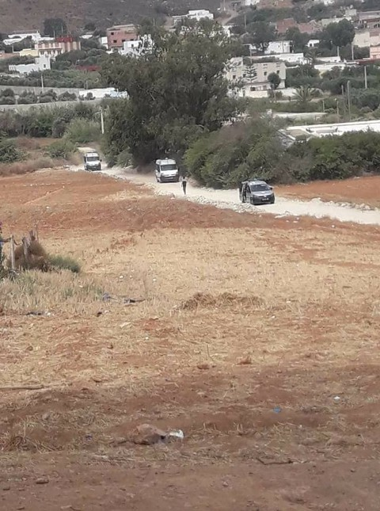
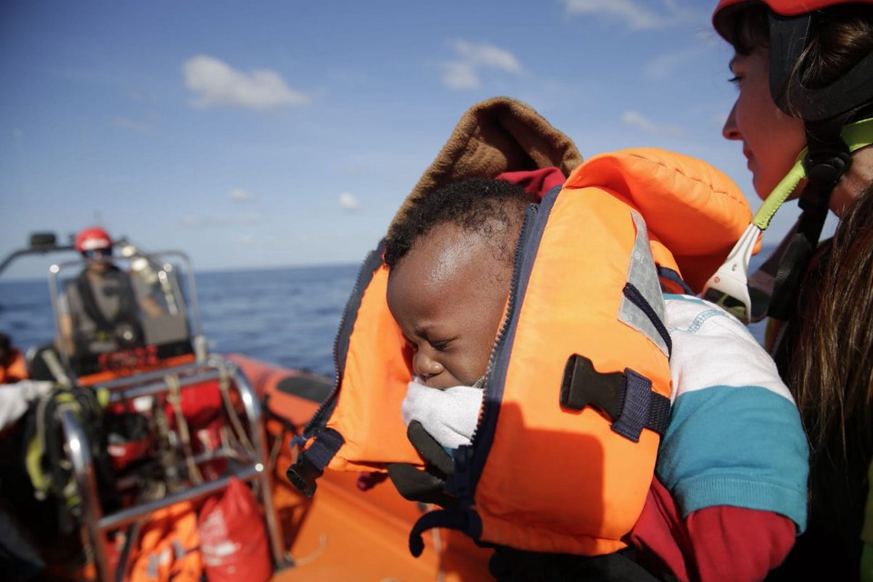
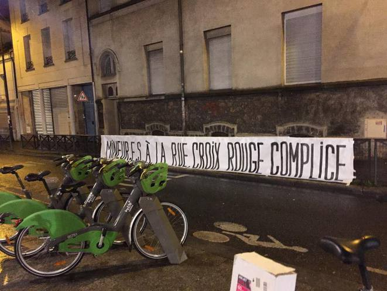

### ما زال البحر الأبيض المتوسط ​​هو الطريق الأكثر فتكًا
#### AYS Weekly News Digest in Arabic, December 17–23

](assets/f77530944236/1*bhpuA5cqnnkTi6Ja5BmYgw.jpeg)

[Proactiva Open Arms](https://www.facebook.com/proactivaservice/?tn-str=k%2AF)
### ما زال البحر الأبيض المتوسط ​​هو الطريق الأكثر فتكًا

> _وصل أكثر من ١١١\.٠٠٠ شخص إلى أوروبا عن طريق البحر في١٦ ديسمبر ، تقارير المنظمة الدولية للهجرة \(بواسطه انفو\.ميكرانت\) \. في الوقت نفسه ، تم تسجيل حوالي ٢٢٠٠ حالة وفاة\. ووفقاً لمشروعها للمهاجرين المفقودين ، فإن هذا يساوي تقريباً نصف حالات الوفاة البالغ عددها ٤٤٠٠ حالة في جميع أنحاء العالم\._ 

ولكن من المفترض أن يكون كلا الرقمين أعلى من ذلك ، حيث يصعب تتبعها أو حتى اكتشاف كل حادث\. يمكن رؤية زيادة كبيرة في عدد الوفيات على الطريق بين شمال أفريقيا وإسبانيا هذا العام\. في حين تم الإبلاغ عن ٢٢٤ في عام ٢٠١٧لتوفي في محاولة لعبور البحر هنا ، فقد كان هناك ٧٤٤ في عام ٢٠١٨حتى الآن\. مقارنة بالسنوات السابقة ، انخفض عدد الأشخاص الذين وصلوا إلى أوروبا من ٣٥٨٠٠٠ في عام ٢٠١٦\(٥٠٠٠ حالة وفاة\) و ١٦٨٠٠٠ في عام ٢٠١٧\(٣١٠٠حالة وفاة\) إلى ١١١٠٠٠

ولكن في نفس الوقت ، يجب ملاحظة أنه تم تسجيل أكثر من ٦٦٠٠شخص أثناء تنقلهم على أنهم ماتوا في أفريقيا منذ عام ٢٠١٣\.

> هذا العام وحده تم تسجيل ١٣٨٦حالة وفاة في القارة\. ومع ذلك ، هذه الأرقام ليست دقيقة بالضرورة — وربما أعلى\. 

“تستند السجلات” إلى استقصاءات أجرتها مبادرة آلية الرصد التابعة لمركز الهجرة المختلط “، تقول المنظمة الدولية للهجرة ، قائلة إن هذه الاستطلاعات لا تمثل سوى جزء صغير من العدد الإجمالي للأشخاص الذين يتنقلون في أفريقيا\. وهم يعترفون: “من المرجح أن يكون عدد الوفيات هذا أقل بكثير من العدد الحقيقي”\.

إن الجوع ، والجفاف ، والإيذاء البدني ، والمرض ، وعدم القدرة على الحصول على الأدوية هي أسباب الوفاة التي ذكرها المهاجرون الذين أبلغوا عن حدوث وفيات على الطرق داخل أفريقيا\.

بإضافة الرقمين ، يعني هذا أن ٣٦٠٠من بين ٤٤٠٠\- ٨٠بالمائة من الناس ، الذين يموتون أثناء الهجرة ، يغادرون من الدول الأفريقية\. بالأمس فقط ، أعلن الناظور عن حادثة أخرى قبالة شاطئ المغرب وأكثر من ٢٣٠شخصًا يحاولون الوصول إلى أوروبا\.
### **خاصية**

[“الفظائع التي لا يمكن تصورها” ، “القتل خارج نطاق القضاء” ، “الاعتداء الجنسي” ، “التعذيب” ، “العبودية”](ays-daily-digest-20-12-2018-european-union-connection-with-unimaginable-horrors-in-libyan-e337c27ccd13) ، و “الاحتجاز التعسفي” ، هي المصطلحات الرئيسية التي ذكرها التقرير الأخير عن ليبيا من قبل مكتب الأمم المتحدة لحقوق الإنسان \(و\.هـ\.س\.هـ\.ر\) \. ويدعم القادة في الاتحاد الأوروبي المسؤولين عن ذلك ، كما نعرفه\.

ويدعو التقرير دول الاتحاد الأوروبي إلى “إعادة النظر في تعاونها مع السلطات الليبية بشأن قضية الهجرة لتجنب الإسهام في مثل هذا الانتهاك المتفشي”\.

“ينبغي أن يشمل ذلك العمل على وضع حد للاحتجاز الإلزامي والتلقائي والتعسفي للمهاجرين واللاجئين في أوضاع غير نظامية ، والقضاء على التعذيب وإساءة المعاملة ، والعنف الجنسي والعمل الجبري في الحجز ، وإنهاء جميع ممارسات العودة التي تنتهك الحظر الصارم على الطرد الجماعي والإعادة القسرية ، “يقول التقرير\.

■■■■■■■■■■■■■■ 
> **[Sally Hayden](https://twitter.com/sallyhayd) @ Twitter Says:** 

> > More on the really bizarre &amp; distressing #migrantsday events in Libyan dcs today - in Tajoura, refugees were reportedly forced to reenact a boat sinking so the Libyan authorities could act out how they claim to come to their rescue, in front of visitors. 1/ https://t.co/n6pvGIopXN 

> **Tweeted at [2018-12-18 22:42:01](https://twitter.com/sallyhayd/status/1075159275301937152).** 

■■■■■■■■■■■■■■ 

إحدى الدول التي دعمت هذا النظام في ليبيا هي المملكة المتحدة\. وسيحاول صبي من أثيوبيا ، طالب لجوء في المملكة المتحدة ، إثبات أنه يخطط لمقاضاة الحكومة لدورها في تمويل مراكز الاعتقال في ليبيا حيث تعرض لإيذاء بدني وابتزاز وعمالة قسرية\.

للمرة الأولى على الإطلاق ، سيحاول شخص ما اتخاذ إجراء قانوني ضد وزارة التنمية الدولية الحكومية \(د\.ف\.ا\.د\) \.

يدعي المراهق أن “المسؤولين يتصرفون بشكل غير قانوني في تمويل مراكز الاعتقال ويجب أن يتوقفوا عن فعل ذلك”\. كما يطلب التعويض عن المعاناة التي تحملها هناك\.

وقال: “كانت الفترة التي احتجزت فيها واستعبدت في ليبيا جحيماً حياً”\. عثر الأطباء على ٣١ جروحًا مختلفة على هذا الجسم بعد مجيئه إلى المملكة المتحدة\.

■■■■■■■■■■■■■■ 
> **[MSF Sea](https://twitter.com/MSF_Sea) @ Twitter Says:** 

> > The forced return to #Libya of #refugees and #migrants attempting to cross the #Mediterranean is a violation of international law.

But this has happened 15,000 times this year with the help of #European funding. When will it stop?

[reut.rs/2Bu8Sqg](https://reut.rs/2Bu8Sqg) 

> **Tweeted at [2018-12-21 07:21:51](https://twitter.com/msf_sea/status/1076014872406704128).** 

■■■■■■■■■■■■■■ 

### **الموت في المعسكر**

أبلغ سكان مخيم بيرا ، بيهاتش ، أحد متطوعي \(أ\.ي\.س\) أن صبيًا يبلغ من العمر ١٦عامًا قد مات في ظروف غير واضحة في ١٣ ديسمبر\.

قبل أن يتم استدعاء سيارة الإسعاف ، كما يقولون ،كان يشتكي من الم في البطن\. سبب الوفاة غير واضح ، ولم يتم ذكر المعلومات علنًا\. ووفقاً لبعض السكان ، فقد مات بسبب جرعة زائدة ، في حين أن البعض الآخر لديه شكوك حول هذه القضية ، مشيراً إلى أنه كان يعاني من ألم في معدته لعدة أيام ولم يتمكن من تناول الطعام\. توفي في المستشفى في بيهاتش\. أصدرت المنظمة الدولية للهجرة ، المنظمة التي تدير هذا المركز ، حتى الآن أي معلومات عن هذا الحدث\. عاش الصبي في جزء المخيم الذي يوضع فيه قاصرون فقط ، في إحدى الحاويات\. تخضع المنطقة لحراسة من قبل وكالة أمنية خاصة ولا تشبه ما قد يبدو عليه مجال القصر\. هناك حوالي ٢١١٠ شخص يعيشون في هذا المخيم ، بما في ذلك أكثر من ١٠٠ قاصر ، لكن لم يتم إبلاغ أي منهم بما حدث داخل المخيم في هذه القضية\. لقد تلقينا بالإضافة إلى ذلك معلومات تفيد بأن نتائج التشريح لم تظهر بعد\.
### **سوريا**

تسببت الأمطار الغزيرة في إغراق ودمر أكثر من ٦٠٢خيمة ، مما أدى إلى تشريد ٣٥٠٠لاجئ سوري وعراقي في مخيم السد للاجئين ، في شمال شرق سوريا ، حسب تقارير إعلامية\. وورد أن السكان طالبوا بإنشاء سد مؤقت لتوجيه المياه بعيداً عن المخيم\.
### **المغرب**

جمعية \(المغرب\) — قسم الناظور يفيد بأن قوات النظام المغربية قد شاركت في غارة منظمة وإخلاء للمهاجرين عبر الناظور\. وأفادوا بأن ٩ من الجرحى الذين بقوا في المستشفى قد أُلقي القبض عليهم\. حوالي الساعة ٤ مساءً خلال النهار ، في رسالة أُرسلت إلى متطوع في \(ا\.ي\.س\)، كان الناس لا يزالون يختبئون في الغابة من الشرطة\. في وقت لاحق ، في رسالة أخرى ، قيل أنه كان “بخير” مرة أخرى\.

[هناك مزيد من المعلومات الخاصه قادمه ل \(ا\.ي\.س\) \.](ays-daily-news-digest-17-12-18-what-is-a-signed-agreement-for-people-freezing-in-out-of-the-camps-7f3f0dec3891)

](assets/f77530944236/1*zVj4SGgRA3D_OQHU95zTnA.jpeg)

[Association Marocaine des Droits Humains — Section Nador](https://www.facebook.com/AmdhNador/?__xts__%5B0%5D=68.ARBpHyvF9-jtUmk8Ubfq1HnLJBRbHqD9NDHhPgAzWN4VjgnaGz1lYmTMJ76EtuupSznZg-QusptII0Qi0E00UYJple18-uAb8WwqKhmVhthLPX5-Gf4gU3k1swJFhSnfc6RCJ2LtgBKUF_aA_7nXimOoddpzSfiea89AWgcDJZmYExfNLDX9OgLnaZuUu_7mo9Yb3J44JanBmfHPkazfBL7mUAZ8fCUKyrhFyQX1x6ebrYNLdQtANTWf7cjCOtqPQwviBtQ2Jp5g2uXKNu6DharJd_79ueKN6moJo8TWDH59jBgF9IaBonzo88MDKu3MKunGdKSBVnKTD5pRr1gW-NSTlkDA&__tn__=k%2AF&tn-str=k%2AF)

في الوقت نفسه ، “يكثف الاتحاد الأوروبي دعمه للمغرب للتصدي للهجرة غير النظامية استجابة لضغوط الهجرة المتزايدة على طول طريق غرب البحر الأبيض المتوسط” ، كما جاء في جزء من الإعلان الذي أكد أن الاتحاد الأوروبي سوف يتعهد بمبلغ ١٤٨مليون يورو أخرى للمساعدة المالية المغرب على جبهة الهجرة\.
### **البحر**

في نهاية العام ، نشر \(يكين دريتت\) بيانا يطالب فيه الاتحاد الأوروبي بالتوقف عن تجريم العمل الإنساني ، والبدء في إعطاء الأولوية لإنقاذ الأرواح وحماية الكرامة الإنسانية لجميع الناس\!

“يشكل هذا العام عاماً استثنائياً لحماية حقوق الإنسان — وفي الوقت نفسه تخفيض قيمة العملة — حيث أنه يصادف الذكرى السنوية السبعين لإعلان الأمم المتحدة لحقوق الإنسان\. ومع ذلك ، في ضوء سياسات الهجرة الحالية في الاتحاد الأوروبي ، لا يوجد سبب للاحتفال\. توفي أكثر من ٢\.١٠٠شخص هذا العام ، في محاولة للوصول إلى السلامة في أوروبا\. يجب على الدول الأعضاء في الاتحاد الأوروبي استخدام هذه الذكرى لتقييم سياسات الهجرة الأوروبية فيما يتعلق بالقيم التي اتفق عليها المجتمع الدولي بعد فظائع الحرب العالمية الثانية “\.

الطائرة كوليبري عادت فوق البحر\.

> _“حتى في فصل الشتاء ، يحاول المحتاجون عبور البحر الأبيض المتوسط\. في هذا الموقف الخطير ، مع شريكنا \(سي\.واتج\) \. نحن نقف بجانب الناس هناك “\._ 

### **الاتحاد الأوروبي**

وفي يوم الاثنين ، اعتمدت الجمعية العامة للأمم المتحدة اتفاقية جديدة للاجئين في محاولة لإدارة أفضل للذين يسعون إلى اللجوء الدولي في أعقاب أزمة المهاجرين الأوروبية ٢٠١٥\.٢٠١٦\. يتبع ميثاق اللاجئين هذا الاتفاق الذي انتهى الأسبوع الماضي في مؤتمر الأمم المتحدة للهجرة في المغرب الذي يتعامل مع جميع أشكال الهجرة\. ويقال أيضا إن الجمعية العامة للأمم المتحدة ستصادق على هذا الاتفاق هذا الأسبوع\.

وجدت الولايات المتحدة نفسها معزولة في الجمعية العامة ، حيث دعمت المجر فقط الولايات المتحدة وصوت ضد قرار سنوي حول عمل وكالة الأمم المتحدة للاجئين ، في حين صوت ١٨١ بلداً لصالحها وامتنع ثلاثة عن التصويت\. تمت الموافقة على القرار بشكل عام بتوافق الآراء لأكثر من ٦٠ عامًا\.

على الرغم من أنه غير ملزم ، يجب أن ندرك أن بعض الوثائق التأسيسية التي تثبت حقوق الإنسان لم تكن أيضًا مستندات ملزمة عند توقيعها
### **البوسنـــــــــــــــه والهرسك**

ووفقاً للمفوضية العليا لشؤون اللاجئين ، هناك ما يقدر بـ ٥٣٠٠ لاجئ ومهاجر في البوسنة والهرسك\. الغالبية العظمى منهم \(٤٠٠٠\) في كانتا أونا — صنعاء\. منذ بداية عام ٢٠١٨ ، تم تسجيل ٢٣٠٠٠وافد\. هناك المزيد من الأفراد المهتمين بمتابعة طلب اللجوء ، ولكن هذا النظام يعاني من زيادة طاقته وعدم كفاءته بسبب المتطلبات المتناقضة للعديد من طالبي اللجوء الذين عليهم تسجيل عنوان من أجل الحصول على القبول في مركز استقبال ، ولكنهم يتطلبون نوعًا ما من أوضاع الهجرة للتسجيل بشكل صحيح\.

](assets/f77530944236/1*dHSrP9VEAv6wO07v4nHlYw.jpeg)

Sarajevo, Photo: [Basis](https://www.facebook.com/BASIS-Bosnia-1487914718006023/)

وعلاوة على ذلك ، تتحدث المنظمات والمتطوعون ضد التقارير المتعلقة بالقيود المفروضة على حرية التنقل داخل البوسنة والهرسك\. هناك الآن تقارير سائدة عن منع الأفراد من ركوب القطارات والحافلات أو حتى إزالتها منها خلال الرحلة\.

الجو بارد جدا في البوسنة حيث تقطعت السبل بحوالي ٥٠٠٠ شخص في الوقت الحالي\. بعض منهم ، أكثر من ٤٠٠٠ ، يتم وضعهم في المراكز والمخيمات التي تم تأسيسها على مدى الشهرين الماضيين\. معظم المراكز تديرها المنظمة الدولية للهجرة ، مع وجود المفوضية\. حالة المعيشة هي الحد الأدنى\. الناس يبقون في المصانع القديمة والفنادق القديمة ، غير مناسبة للعيش الكريم\.

لقد أبلغنا هذا الأسبوع عن وفاة طفل في أحد المراكز ، بيرا في بيهاتش\. يوم الخميس ، نشرت وسائل الإعلام المحلية معلومات إضافية تقول إن الطفل ، بعد ١٦عاما من باكستان ، على الأرجح مات بسبب قصور في القلب\.

حاولت محطة التلفزيون المحلية الحصول على أي معلومات من المنظمة الدولية للهجرة حول هذا الموضوع ، ولكنها نقلت المسؤولية فقط إلى فريق جمهورية الكونغو الديمقراطية المسؤول عن الفئات الضعيفة\.

في سراييفو ، يقيم العديد من الناس في أماكن تجلس\. قامت مجموعة واحدة من المتطوعين ، \(ب\.أ\.س\.ا\.س\)، بتوزيع ١٦٥كيس للنوم خلال ليلة واحدة في ١٨مستقيما\.

في كلادوشا ، يأتي أكثر من ٥٠٠ شخص يومياً لتناول الطعام في مطبخ كود لاتانا الصغير\. يتوفر فريق كلادوشا لتقديم المساعدة الإضافية وتوفير الإسعافات الأولية الأساسية والمحلات المجانية\. لكنهم يحتاجون إلى مساعدة لمواصلة القيام بذلك\.
### **كرواتيا**

يقدم مركز دراسات السلام شكوى بشأن عمليات الإبعاد غير القانونية

وقدم مركز دراسات السلام شكوى إلى المدعي العام للدولة يحثها على فحص الأدلة في قضية الطرد الجماعي التي تم نشرها مؤخرا والتي نشرت على نطاق واسع من قبل الشرطة الكرواتية\. وقد نشر رصد العنف الحدودي أكثر من ١٣٠تسجيلًا ، مما يدل على وجود عمليات طرد غير قانونية في كثير من الأحيان من جانب الشرطة الكرواتية إلى الأراضي البوسنية\. آجا كوربار من فيلم \(ا\.ي\.س\) كان ضيفا في محطة التلفزيون الإقليمية \(ن١\) ، متحدثا عن عمليات الطرد الأخيرة\. ويشير كوربار إلى أن المنظمات قد حذرت من العودة غير القانونية والعنف المتزايد للاجئين من الأراضي الكرواتية منذ عام ٢٠١٦وتنتقد أن حالات اللاجئين لا يتم تقييمها بشكل فردي ، ولكن يتم إعادتها بشكل جماعي إلى أراضي دولة أخرى\.

](assets/f77530944236/1*VzdUh2Nvxoabj_zeIoa34w.jpeg)

[Border Violence Monitoring](https://www.facebook.com/borderviolencemonitoring/?tn-str=k%2AF)

صورة لطريق مراقبة الحدود دنيا مياباتوفيتش ، مفوضة المجلس الأوروبي لحقوق الإنسان ، تقول: “لا يسعني إلا أن أكرر توصيتي للسلطات بمعاملة المهاجرين الذين يدخلون البلد بما يتماشى مع المعايير الدولية ولضمان أن أولئك الذين يرغبون في دخول البلاد يمكنهم القيام بذلك بأمان” ذكرت المفوضية في كرواتيا: “تأخذ المفوضية السامية للأمم المتحدة لشؤون اللاجئين ادعاءات الاستخدام المفرط للقوة من قبل الشرطة على محمل الجد\. لقد شاركنا قلقنا مع السلطات الكرواتية وحثناهم على التحقيق في جميع الحالات المبلغ عنها ، والامتناع عن استخدام القوة “\.
### **إيطاليا**

بعد التقارير التي تفيد بأن إيطاليا لا تعتبر آمنة بالنسبة لعائدين بقانون دبلن والأخبار التي من المرجح أن يتم تكليف مساعدي الرابطة بتسهيل الهجرة غير الشرعية ، فإن الظروف تستمر في التدهور\. ومن شأن المرسوم الأمني ​​الذي من المرجح أن يدخل حيز التنفيذ في أوائل عام ٢٠١٩ أن يدفع بشكل فعال آلاف الأشخاص إلى الشارع\. الاثنين الماضي ، ١٠ديسمبر ، كان هناك اجتماع للمسؤولين الذين يرغبون في مواصلة هذه المشاريع التي تمنع الأشخاص الذين تلقوا الحماية الإنسانية من النوم خشية من أجل توقع ما سيحدث\.

> “لن يسمح مرسوم الأمن بعد ذلك بالاستقبال وإمكانية التكامل وسيزيل الخدمات الأساسية على سبيل المثال ، محو الأمية\. 

في القانون السابق تم نقل حاملي الحماية الإنسانية عند الخروج من مراكز الاستقبال الاستثنائية إلى نظام سبرار لدعم هؤلاء الناس في عملية التكامل الاجتماعي\. مع مرسوم الأمن ، لم يعد من حق حاملي الحماية الإنسانية الوصول إلى سبرار، وبالتالي من كاد ينهون مباشرة في الشارع\. ومن بينهم نساء وأطفال ومرضى وضحايا للعنف\. هناك حوالي ٣٠ ٢٥ ألف شخص سينتهي بهم المطاف في الأشهر القليلة القادمة في الشارع دون أي مساعدة ، مما سيزيد من انعدام الأمن والصراع الاجتماعي ، وبالتالي تحقيق الهدف الحقيقي للقانون الذي تريده سالفيني\.

المزيد هنا\.

وكما ذكرنا في وقت سابق من هذا الأسبوع ، فقد تم بالفعل انتقادات إيطاليا باعتبارها غير آمنة لعائدي دبلن من قبل العديد من منظمات حقوق الإنسان\. غير أن هذا لا يبدو ذا أهمية كبيرة لهؤلاء المهتمين بـ “حكم القانون” ، حيث تعتبر أفغانستان أيضاً آمنة وما لم نتحرك ، فمن غير المرجح أن يؤدي هذا العدوان الوحشي ضد الناس الذي يلوح في الأفق في عام ٢٠١٩ إلى التأثير على ما إذا كان سيتم تسليم الناس إلى أذرع الحكومة المنتظرة أم لا\.

■■■■■■■■■■■■■■ 
> **[Filippo Grandi](https://twitter.com/FilippoGrandi) @ Twitter Says:** 

> > The fact that less refugees and migrants arrive in Europe across the Mediterranean should not make us forget that many of those stranded in Libya continue to suffer terrible abuses. Rule of law however will not be possible without solving the conflict in Libya. 

> **Tweeted at [2018-12-23 07:25:20](https://twitter.com/refugeeschief/status/1076740523313057792).** 

■■■■■■■■■■■■■■ 

### **البرتغال**

هذا الأسبوع ، وصلت ست عائلات في الأصل من سوريا وجنوب السودان ، ٣٣ شخصا ، إلى لشبونة\. هذه هي المجموعة الأولى التي تضم ١٠١٠شخص تعهدت البرتغال بالاعتراف بها من تركيا ومصر بحلول أكتوبر ٢٠١٩، في إطار برنامج إعادة التوطين الحالي في الاتحاد الأوروبي\.

بالإضافة إلى ذلك ، قبلت البرتغال نحو ١٥٠٠من طالبي اللجوء من إيطاليا واليونان بين عامي ٢٠١٥ و ٢٠١٧في إطار برنامج إعادة توطين الاتحاد الأوروبي\.

وستدعم السلطات البلدية والمنظمات غير الحكومية في جميع أنحاء البرتغال اللاجئين ، الذين سيقدم لهم الدعم الأولي بالسكن والاحتياجات الأساسية أثناء تعلمهم اللغة البرتغالية ومتابعة العمل\.

سيتمكن اللاجئون من الوصول إلى الرعاية الصحية والتعليم ، بالإضافة إلى التدريب المهني \.
### **فرنسا**
#### اليوم الدولي للمهاجرين في باريس

تم تنظيم مظاهرة يوم الثلاثاء بمناسبة اليوم الدولي للمهاجرين في باريس ، احتجاجًا على تزايد النزعة القومية وتذكار كل الذين ماتوا أثناء محاولتهم الوصول إلى أوروبا\. كما تم وضع لافتات أمام الصليب الأحمر ، حيث يتم تقييم القاصرين ورفضهم في كثير من الأحيان ، مما يجبرهم على الاستمرار في العيش في الشوارع\.

تصوير أكسيويل دي ميردي

الصورة بواسطة سايه

تستمر عمليات توزيع المواد الغذائية والنظافة كل يوم للقاصرين الذين ينتظرون بالقرب من كروا روج

\. يمكنك مساعدة هذه التوزيعات من خلال المساهمة [هنا](https://www.helloasso.com/associations/saje-soutien-et-accompagnement-des-jeunes-en-exil/formulaires/1/widget?fbclid=IwAR3HbPlc4_Fe9R1EuFbUWXu4Zwiphh_8sHCPpNxrant1AHurGpfNMwN70Hs)

**We strive to echo correct news from the ground through collaboration and fairness\.**

**Every effort has been made to credit organizations and individuals with regard to the supply of information, video, and photo material \(in cases where the source wanted to be accredited\) \.** 
**Please notify us regarding corrections by email \(areyousyrious@gmail\.com\) or via Facebook, Twitter and Medium\.**

_Converted [Medium Post](https://medium.com/are-you-syrious/%D9%85%D8%A7-%D8%B2%D8%A7%D9%84-%D8%A7%D9%84%D8%A8%D8%AD%D8%B1-%D8%A7%D9%84%D8%A3%D8%A8%D9%8A%D8%B6-%D8%A7%D9%84%D9%85%D8%AA%D9%88%D8%B3%D8%B7-%D9%87%D9%88-%D8%A7%D9%84%D8%B7%D8%B1%D9%8A%D9%82-%D8%A7%D9%84%D8%A3%D9%83%D8%AB%D8%B1-%D9%81%D8%AA%D9%83%D9%8B%D8%A7-f77530944236) by [ZMediumToMarkdown](https://github.com/ZhgChgLi/ZMediumToMarkdown)._
