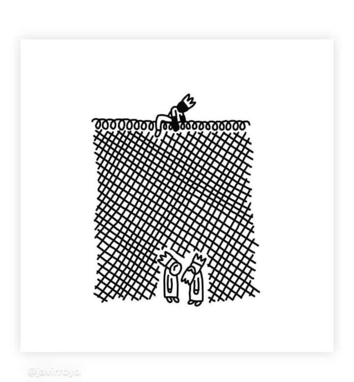
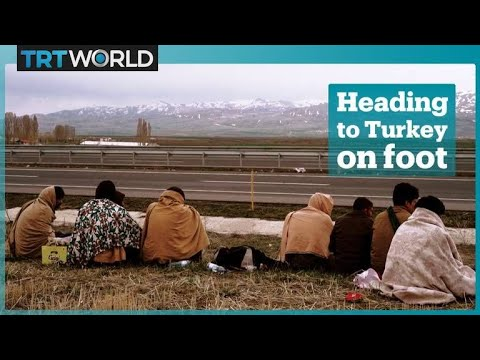
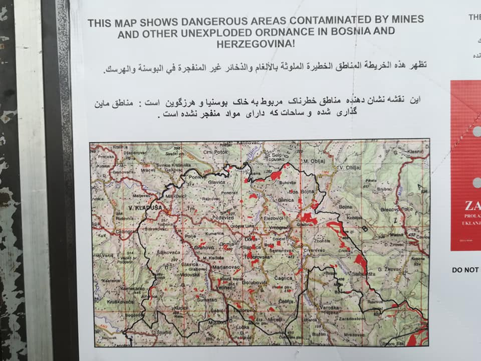
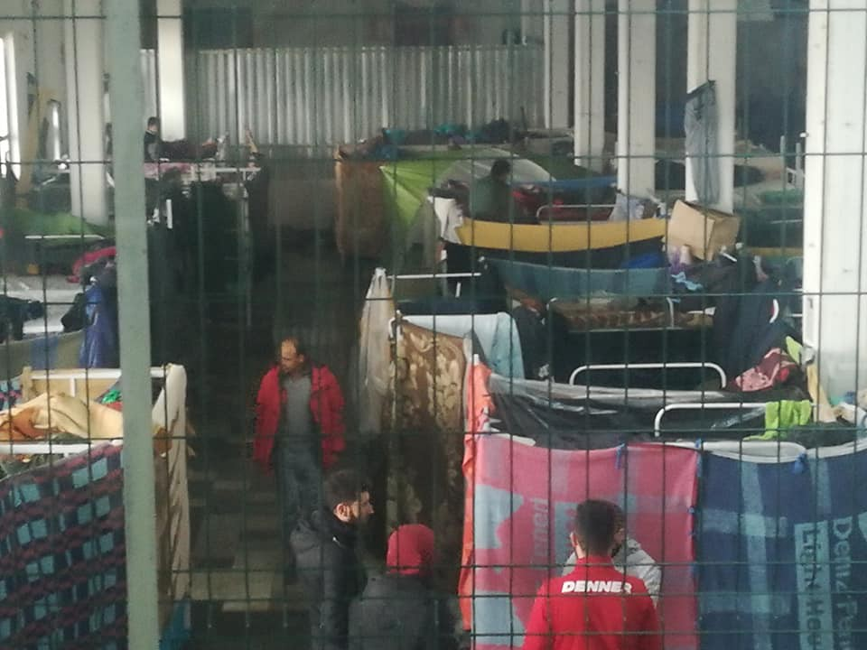
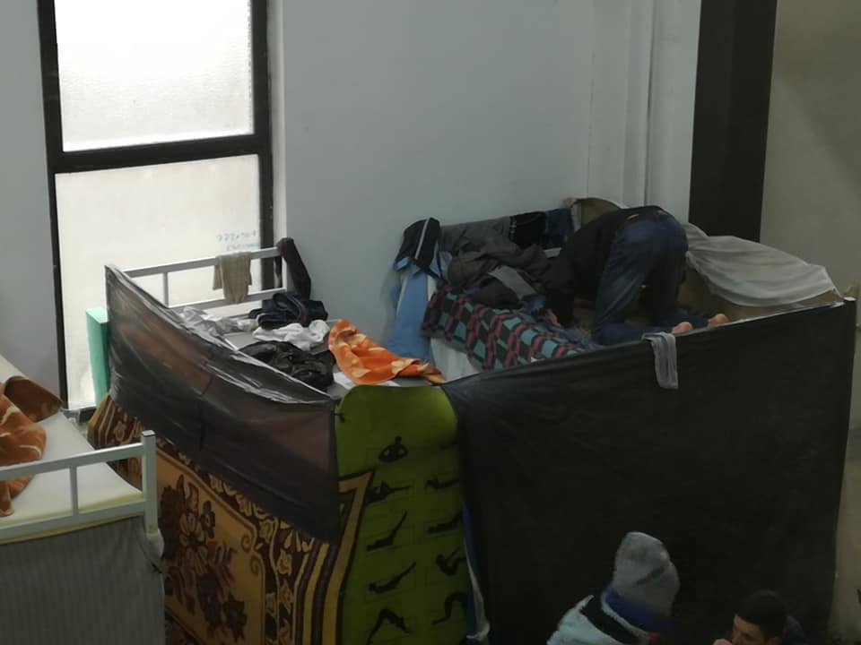
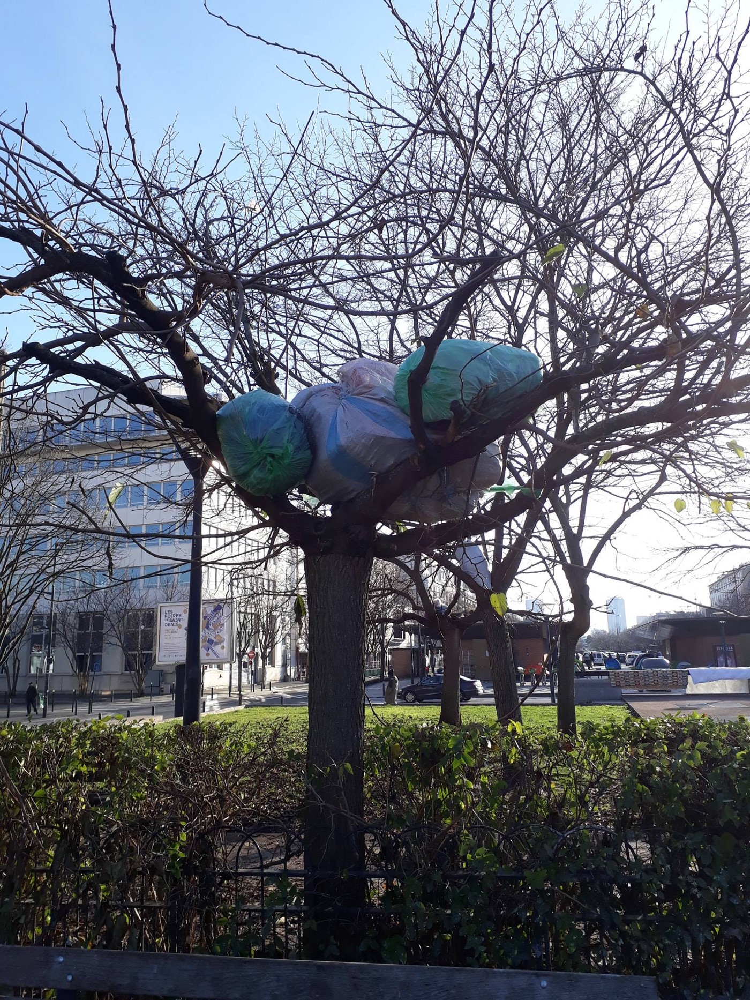

### AYS Daily News Digest 25/12/18: We bring no good tidings this year
#### Detained by both smugglers and officials; abuses of power and funds; evictions and confiscations of the few belongings people on the move have with them; lack of basic human of children’s rights — in short, this is the summary of this day, too\. Here’s news

Illustration by: Javi Royo
#### FEATURE

6300 children were surveyed as a part of a report by an international organization, out of which 1,376 children said that they had experienced so\-called violent rejections at the border\. Out of these 1,376, 934 were minors who were separated or traveled completely unaccompanied\.

Apart from the widely known mistreatment of young refugees in France and violence used against minors in Italy, violence experienced across the Balkan route is currently what is most worrying, considering the political, economical and other differences between the countries and considering that the EU finds it normal and a good practice to avoid laws and basis of the European civilization through the recently well\-reported border actions \(and those made within the Croatian teritory\! \)by the Croatian border police\. The states which lie on an external EU border, like Croatia, still feel abandoned when it comes to migration by those countries which do not have any external borders\.

> One particularly shocking case we heard of was that of an Afghan boy beaten so violently by the Croatian police that he still to this day doesn’t know whether his hand was broken or not\. He was denied medical attention\. 

Wherever you live, do what you can to put pressure on your politicians to stand for solidarity and joint action within the EU\!
#### AFGHANISTAN

According to [reports](https://ariananews.af/o-uuou-99/?lang=ps&fbclid=IwAR2GtYTkj3cSWoVzT4fi2TgpybJzIMN7oLAjipGLzb7M8cS6ZBmbwxUjyaU) , 15 people were killed by a suicide bomber in Kandahar\.
#### TURKEY

For single Afghan men seeking refuge in Turkey has always been a challenge, but in recent months, it has become all but impossible\.

Dozens of Afghan men and boys describe how the Turkish authorities now refuse to register them as asylum seekers\. Nor will the authorities issue them a kimlik — the Turkish identity card that gives refugees access to healthcare, education and work permits\. Read more [here](http://souciant.com/2018/12/turkey-must-not-ignore-non-syrian-refugees/?fbclid=IwAR1mkbE33jYKcVdz5pxCXcZRZx-SdtTsETqP5YnPxSH_-dLw0K85ZUrc4ic) \.
#### SEA SEARCH AND RESCUE
### SAR zone Malta

Heading north with 33 saved on board, reported early Monday afternoon Sea Watch vessel has left the border of the SAR zone Libya\. In search of Europe with an appeal to the German government, to ensure a Place Of Safety for the rescued at sea fleeing the Libyan hell\.”

■■■■■■■■■■■■■■ 
> **[Alarm Phone](https://twitter.com/alarm_phone) @ Twitter Says:** 

> > It's now over 2 days since 12 people are missing without rescue. Since
yesterday all contact with the people lost. @[salvamentogob](https://twitter.com/salvamentogob) delayed
rescue for too long! #Spain must continue. 

> **Tweeted at [2018-12-25 00:30:24](https://twitter.com/alarm_phone/status/1077360878608175104).** 

■■■■■■■■■■■■■■ 

> _12 people are missing at rough Sea for more than 36 hours and authorities are rejecting responsibility\. Salvamento Marítimo can no longer shift responsibility to Marine Royal and must conduct SAR operation by all means necessary\! Only SM has air assets such as helicopters, use them and save the lives of the boat people\! —_ [Watch The Med — Alarmphone](https://www.facebook.com/watchthemed.alarmphone/?__tn__=%2CdkCH-R-R&eid=ARBkHDMYcA9GEqvFbctlZ6YOUYmGf3pcBJYpmnXolz9pzE7UYGuDOgJ3BLLBizuyITG2sc2gh1cE87XM&hc_ref=ARQVPJZXYYag_2LphCdKQ50BZllq3bEd1BUs7no61LmFD1XVuOkvlDC4OYuzb2zSglI&fref=nf) 

#### GREECE
### Arrivals

314 people were rescued from early Friday until early Monday in eight incidents in the sea, in the region of Alexandroupolis and on the shores of Lesvos, Chios, Samos and Farmakonissi, the Greek Ministry announced on Monday\.

Aegean Boat Report has the aim to help local initiatives, where children are involved and they have started a fundraiser which you can get to know in detail and support by following this link: [Aegean Boat Reports Children’s Fundraiser](https://www.facebook.com/donate/220832525460104/)
### Athens

Public transport services in the Greek capital will be reduced over the holidays\. Please, [**see this link**](http://www.ekathimerini.com/235999/article/ekathimerini/news/athens-public-transport-to-slow-down-over-holidays?fbclid=IwAR0OFVFhr_Mve0q_c6ORgp71UMfgl1EFxZT5cNaqbwl0Kvgw8-z1Zrh5KVc) for details\.
### Thessaloniki

According to press releases, the Thessaloniki police arrested Monday night three Pakistani citizens who were suspected of holding two people from Bangladesh hostage in an apartment\. City police say the suspects allegedly demanded money from relatives in Bangladesh and threatened violence\.
### Smuggling arrests

Police in northern Greece have arrested a 34\-year\-old man and a 27\-year\-old woman from Romania for alleged migrant trafficking\. The arrests happened on Tuesday morning as the two suspects left a warehouse where 44 migrants who allegedly crossed the Greece\-Turkey border in small groups were being housed temporarily\.

Also, in Montenegro, 2 men are suspected of illegally transporting 6 migrants from Serbia to Montenegro, taking a large amount of money from them and also keeping them locked in a building on the outskirts of Bar, the police reported\.
#### BULGARIA

Info Park’s Newsletter paid attention to the situation in Bulgaria, reminding that a total of 2,503 refugees and migrants arrived in Bulgaria so far this year, as IOM recently reported, citing figures as of December 19\. November saw the largest number of arrivals — a total of 448, while in December there were only 152, including the week of December 13–19 when there were none\. Facilities in Bulgaria are accommodating a strikingly low number of people: on December 20 there were only 12 in Pastrogor registration and reception center \(RRC\) and 207 in the largest RRC in Harmanli\.

Bulgaria is known as the country with one of the most dangerous treatment of refugees who find themselves in the country, many of whom have been detained and beaten by the authorities, while the general climate in the society overall doesn’t support any other attitude towards migrants in general, so refugee related work had already become a risk a few years back\.
#### THE WEATHER FOR BALKAN, for 26/12

**Montenegro**

In the south and center sunny whit from time to time weak to moderate clouds\. In the north predominately cloudy whit light snow, and during the day it will partially clear up\. The wind will be blowing from the north, locally moderate to amplified, decreasing in strength in the afternoon\. The lowest temperatures from \-7 to 5 and digest daily from \-3 to 13 degrees\.

**Serbia**

Cloudy in the morning, locally sleet and snow and in the mountains snow\. Precipitation will be of low intensity\. Before noon in the north and west, and later during the day in the rest of the country — except for the far southwest — it will partially clear up\. The wind weak to moderate, in het north strong from time to time, blowing from the northwest\.

**BiH**

In the morning cloudy in most part of Bosnia whit some snow in the higher regions\. In the basins and alongside the rivers low clouds and fog\. Locally lightly to moderately overcast\. The wind in Bosnia will be weak from the southwest and in Herzegovina a northern wind\. The lowest temperatures from \-4 to 4 highest daily from 0 to 9 degrees\.

**Croatia**

Land inwards partially and alongside the coast predominantly sunny\. The wind will be weak to moderate from the northwest and north\. The lowest temperatures from \-5 to 7 5 to 9 degrees\.
#### SERBIA

Hungarian Authorities prevented 36 ‘attempts of illegal entry’ to the country and, as usual, employed the practice of push backs to Serbia\. As usual, most of them \(35\) were intercepted within the Hungarian territory, Info Park reports\.
#### BOSNIA AND HERZEGOVINA

Local authorities in Una Sana Canton are increasing their pressure on International Volunteers in Bosnia\. Various volunteer groups are having their documents checked more frequently for white cards — which permit them legally to stay and volunteer in Bosnia\. With needs still great for people on the move that are stuck at the border of Bosnia and Croatia, it will be unfortunate if this pressure prohibits them from continuing their work\.
### Sights from Velika Kladuša factory turned camp

 , today, from the ex\-factory falicities of [Miral](https://www.facebook.com/miralpvc/?ref=stream)](assets/31728603bde0/1*91Jp3v4-pKbxw5ze_L_gAQ.jpeg)

Photos: [Zarka Radoja](https://www.facebook.com/zarka.radoja?__tn__=%2CdlCH-R-R&eid=ARC3MV1WVq4oIKn0NIHBwBJu9YG9_njYOZcaz8q4pBHikfab18DKu9UzFolobo0xS6Oc23BPTGvJInTG&hc_ref=ARSkb-nquY_aoHpD8qxTAcbtoMXxyF5nFB5eIpiNSKZ4HXObTUYOeY8hZ08t4sagemU&hc_location=group) , today, from the ex\-factory falicities of [Miral](https://www.facebook.com/miralpvc/?ref=stream)
#### FRANCE
### Calais

The prefecture said the group of 8 people that were recently brought back to French shores from a dinghy, trying to cross to the UK, included two children\. The maritime authority reportedly didn’t provide the migrants’ nationalities\. The Channel has seen a recent spike in people on the move trying to cross from France to England in small boats\.

Volunteers documented eviction and confiscation of people’s belongings in the evening of December 24, celebrated by many as the Christmas eve\.

Tents, sleeping bags, blankets and wood for fire was taken away from the people who find themselves in the Calais area, stressing dramatic difference in treatment of people across Europe\.

](assets/31728603bde0/1*wENwNCQ6i1m6PgxE0GrQ0Q.jpeg)

Photo: [Utopia56 Calais & Grand Littoral](https://www.facebook.com/Utopia56-Calais-Grand-Littoral-258099198180444/?tn-str=k%2AF&hc_location=group_dialog)

> _Help us to distribute after these horrible evictions : [http://www\.utopia56\.com/fr/collecte\-0](http://www.utopia56.com/fr/collecte-0?fbclid=IwAR2e13kQIXgaA-Mh2LVp72_ULr4-RnUeEGllz_nhdjTqdMmzx8NX9cnWX1g) — [Utopia56 Calais & Grand Littoral](https://www.facebook.com/Utopia56-Calais-Grand-Littoral-258099198180444/?__tn__=%2CdkCH-R-R&eid=ARB6Vjy7lclHUQTvV-xz30epXeVcsLUp1rcewZ7Es6VmukY-TqeUx8GaRBQZmP2x6yxf26Qd7nA1f2k0&hc_ref=ART7aHDB0ghxsfq4ylpl3fkbbOybAWMUywppqSNeqNW2qW5nLCnrdJQnvLC2m3CilW8&fref=nf&hc_location=group)_ 

### Paris

](assets/31728603bde0/1*eYv58KtDrf04_6IamYtcWA.jpeg)

“The Christmas trees in Paris are decked with people’s belongings\. 
To keep the public from not seeing the extent of the refugee crisis, the refugee camps are allowed to form at night\. 
Every morning the police come to the camps and make all the people pack their tents, blankets, sleeping bags, and personal belongings away\. As the 300 odd people in this camp have nowhere safe to put their stuff, they put it out of harms way in the trees\.” — [Paris Refugee Ground Support](https://www.facebook.com/PRGS.team/?__tn__=%2CdkCH-R-R&eid=ARCcDhJpvFLZObnJsUsOHNQhU-C44PO0jdGcC4ZP4nB1RbMmymQdE8d0PtBYrzxsTquChTqK6PDMi87u&hc_ref=ARTyjHfzVratWUNUR7oeySbMnnONHceBpehmLdUB46Xdx9CmlCoVqUGQ_OludKgpGeE&fref=nf)

We also publish weekly summaries of some of the most important news reported during the past week in our Daily News Digest\. Here is the [Arabic](%D9%85%D8%A7-%D8%B2%D8%A7%D9%84-%D8%A7%D9%84%D8%A8%D8%AD%D8%B1-%D8%A7%D9%84%D8%A3%D8%A8%D9%8A%D8%B6-%D8%A7%D9%84%D9%85%D8%AA%D9%88%D8%B3%D8%B7-%D9%87%D9%88-%D8%A7%D9%84%D8%B7%D8%B1%D9%8A%D9%82-%D8%A7%D9%84%D8%A3%D9%83%D8%AB%D8%B1-%D9%81%D8%AA%D9%83%D9%8B%D8%A7-f77530944236) and [Persian](%D8%AF%D8%B1%DB%8C%D8%A7%DB%8C-%D9%85%D8%AF%DB%8C%D8%AA%D8%B1%D8%A7%D9%86%D9%87-%D9%85%D8%B1%DA%AF%D8%A8%D8%A7%D8%B1-%D8%AA%D8%B1%DB%8C%D9%86-%D9%85%D8%B3%DB%8C%D8%B1-%D8%A7%D8%B3%D8%AA-891216f90337) Weekly News Summary for the week of December 17–23\.
#### [ما زال البحر الأبيض المتوسط ​​هو الطريق الأكثر فتكًا](%D9%85%D8%A7-%D8%B2%D8%A7%D9%84-%D8%A7%D9%84%D8%A8%D8%AD%D8%B1-%D8%A7%D9%84%D8%A3%D8%A8%D9%8A%D8%B6-%D8%A7%D9%84%D9%85%D8%AA%D9%88%D8%B3%D8%B7-%D9%87%D9%88-%D8%A7%D9%84%D8%B7%D8%B1%D9%8A%D9%82-%D8%A7%D9%84%D8%A3%D9%83%D8%AB%D8%B1-%D9%81%D8%AA%D9%83%D9%8B%D8%A7-f77530944236) — Arabic
#### [دریای مدیترانه، مرگبار ترین مسیر است](%D8%AF%D8%B1%DB%8C%D8%A7%DB%8C-%D9%85%D8%AF%DB%8C%D8%AA%D8%B1%D8%A7%D9%86%D9%87-%D9%85%D8%B1%DA%AF%D8%A8%D8%A7%D8%B1-%D8%AA%D8%B1%DB%8C%D9%86-%D9%85%D8%B3%DB%8C%D8%B1-%D8%A7%D8%B3%D8%AA-891216f90337) — Persian

**We strive to echo correct news from the ground through collaboration and fairness\.**

**Every effort has been made to credit organizations and individuals with regard to the supply of information, video, and photo material \(in cases where the source wanted to be accredited\) \. Please notify us regarding corrections\.**

**If there’s anything you want to share or comment, contact us through Facebook or write to: areyousyrious@gmail\.com**

_Converted [Medium Post](https://medium.com/are-you-syrious/ays-daily-news-digest-25-12-18-we-bring-no-good-tidings-this-year-31728603bde0) by [ZMediumToMarkdown](https://github.com/ZhgChgLi/ZMediumToMarkdown)._
