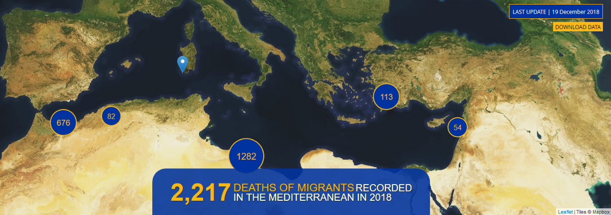

### دریای مدیترانه، مرگبار ترین مسیر است
#### AYS Weekly News Summary in Persian, December 17–23

](assets/891216f90337/1*bhpuA5cqnnkTi6Ja5BmYgw.jpeg)

[Proactiva Open Arms](https://www.facebook.com/proactivaservice/?tn-str=k%2AF)

> _گزارشی از آ\.ا\.ام از طریق اطلاعات مهاجرتی میگوید تا شانزده دسامبر بیش از صدویازده هزار نفرازطریق دریای مدیترانه به اروپا رسیده اند \.در همان زمان، حدود دوهزارودویست نفرمرگ و میر ثبت شد \._ 

با توجه به پروژه مهاجرین گمشده، این تقریبا نیمی از چهارهزاروچهارصد نفر مرگ و میر در سراسر جهان است \.اما هر دو عدد فرض می شود واحتمالا بالاتر مبباشد، زیرا پیگیری و یا جست وجو در مورد هر حادثه سخت است\. در سال جاری میلادی شاهد افزایش شدید مرگ و میر در مسیر میان آفریقای شمالی و اسپانیا هستیم\. در حالیکه دوسیت و بیست وچهار نفر در سال دوهزاروهفده گزارش شده اند که در تلاش برای عبور از دریا جان باخته اند ودر سال دوهزاروهجده حدود هفتصدوچهل و چهار نفر بوده اند که جان باخته اند \. در مقایسه با سال های گذشته ،تعداد افرادی که در اروپا وارد می شوند از سیصدوپنجاه وهشت هزار نفر در سال دوهزاروشانزده که پنج هزار مرگ و میر و صدوشست و هشت هزار نفر در سال دوهزاروهفده سه هزاروصد نفر مرگ و میر از حالا به صد و یازده هزار نفر رسیده است

اما در عین حال باید خاطرنشان کرد که بیش از شش هزارو ششصد نفر در راه از سال دوهزاروسیزده در آفریقا فوت کرده اند\.این سال به تنهایی هزاروسیصدوهشتادوشش مرگ در این قاره ثبت شده است\. با این حال، این اعداد لزوما دقیق نیستند و احتمالا بالاترهستند\. پرونده ها بر اساس نظرسنجی های انجام شده توسط مؤسسه مانیتورینگ مرکز مهاجرت انجام شده است، اظهار داشت که این سازمان ها اظهار داشتند که این نظرسنجی ها فقط یک درصد کوچکی از تعداد کل افراد در حال حرکت در آفریقا را نشان می دهند\.

> _آنها میگویند : این هزاران مرگ و میر احتمالا به میزان قابل توجهی از تعداد واقعی هستند\._ 

گرسنگی، کم آبی ، سوء استفاده فیزیکی، بیماری و عدم دسترسی به دارو، علت اصلی مرگ است که اغلب مهاجرانی را که در مسیرهای موجود در آفریقا گزارش داده اند، ذکر می کنند

با اضافه کردن دو عدد، به این معنی است که سه هزاروششصد نفر از چهارهزاروچهارصد نفر تا حدود هشتاد درصد از افرادی است که در حال مهاجرت از کشورهای آفریقایی جان خود را از دست میدهند\.دیروز نادر گزارش داد که حادثه دیگری در ساحل مراکش رخ داده و بیش از دویست و سی نفر در تلاش برای رسیدن به اروپا بوده اند\.
### **خاص**

> _“وحشت غیر قابل تصور”، “کشتار غیر قضایی”، “سوء استفاده جنسی”، “شکنجه”، “بردگی” و “بازداشت خودسرانه”، اصطلاحات کلیدی در آخرین گزارش مربوط به لیبی توسط دفتر حقوق بشر سازمان ملل یا ا\.اچ\.س\.ه\.ار و رهبران اتحادیه اروپا از کسانی هستند که مسئولیت آن را دارند، همانطور که ما آن را می دانیم\._ 

این گزارش از کشورهای عضو اتحادیه اروپا خواست تا بررسی همکاری خود را با مقامات لیبی در مورد مهاجرت به منظور جلوگیری از مشارکت در چنین سوء استفاده هایی گسترده کند

این باید شامل تلاش برای پایان دادن به بازداشت های اجباری، اتوماتیک و خودسرانه مهاجران و پناهندگان در شرایط غیرقانونی و ناامن، جلوگیری از شکنجه و بدرفتاری، خشونت جنسی و کار اجباری در بازداشت و پایان دادن به تمام اقدامات بازگشتی که موجب نقض ممنوعیت های شدید در مورد اخراج جمعی میباشد ،در این گزارش میباشد

یکی از کشورهایی که از این سیستم در لیبی پشتیبانی می کنند، انگلیس است\. و یک پسر از اتیوپی، پناهجو در انگلیس، سعی خواهد کرد اثبات کند که او قصد به شکایت از دولت دارد برای نقشش در تأمین مالی بازداشتگاه های لیبی که در آن او تجاوز جسمی، اخاذی و بردگی را تجربه کرده است، شکایت کند\.

برای اولین باراست که کسی سعی دارد که یک اقدام قانونی علیه وزارت امور بین الملل دولتی دی\.اف\.ای\.دی را آغاز کند

نوجوان ادعا می کند که مقامات به طور غیرقانونی در تأمین مالی بازداشتگاه ها عمل می کنند و باید این کار را متوقف کنند\. او همچنین خواستار جبران درد و رنجی که در آنجا به سر برد است

او گفت : دوره ای که من بازداشت و زندانی بودم در لیبی ،زندگی یک جهنم بود\. پزشکان بعد از اینکه او به انگلستان آمد، سی و یک جای جراحت مختلف را در بدن وی یافتند

■■■■■■■■■■■■■■ 
> **[Sally Hayden](https://twitter.com/sallyhayd) @ Twitter Says:** 

> > More on the really bizarre &amp; distressing #migrantsday events in Libyan dcs today - in Tajoura, refugees were reportedly forced to reenact a boat sinking so the Libyan authorities could act out how they claim to come to their rescue, in front of visitors. 1/ https://t.co/n6pvGIopXN 

> **Tweeted at [2018-12-18 22:42:01](https://twitter.com/sallyhayd/status/1075159275301937152).** 

■■■■■■■■■■■■■■ 

### **خاص — مرگ در کمپ**

ساکنان اردوگاه بیرا، بیهاچ، یک داوطلب آ\.یو\.س را مطلع کردند که یک پسر شانزده ساله در شرایط نامشخص در سیزده دسامبر درگذشت

آنها می گویند قبل از آنکه به آمبولانس تماس گرفته شود، او از درد شکمش گفته بوده\. علت مرگ روشن نیست و اطلاعات در عموم ذکر نشده است\. به گفته برخی از ساکنان، او به دلیل آوردوز فوت کرده ، در حالی که برخی دیگر در مورد این علت شک و تردید دارند، اشاره کرد که او در طول روز درد معده داشته و نمی توانسته غذا بخورد \.او در بیمارستان بیهاچ فوت کرد \.آ\.ا\.ام سازمانی که این مرکز را اداره می کند، تا کنون اطلاعاتی در مورد این رویداد منتشر نکرده است\. این پسر در بخشی از اردوگاه زندگی می کرد که در آن فقط یک کودک زیر سن قانونی قرار دارد\. این منطقه توسط یک سازمان امنیتی خصوصی محافظت می شود و شبیه آنچه که احتمالا به نظر می رسد یک منطقه برای افراد زیر سن قانونی است \.حدود دوهزاروصد وده نفر در این اردوگاه زندگی می کنند ،از جمله بیش از صد کودک، اما معلوم شد هیچکدام از آنها در مورد این که دراردوگاه این اتفاق افتاده اطلاع نداده اند\. ما علاوه بر این اطلاعاتی دریافت کرده ایم که نتایج کالبد شکافی هنوز گزارش داده نشده است

### **سوریه**

به گزارش رسانه ها، باران های سنگین بیش از ششصد و دو چادر را آب گرفت و تخریب کرد و سه هزار و پانصد پناهنده سوری و عراقی را در اردوگاه پناهندگان الساد در شمال شرقی سوریه جابجا کرده اند\. ساکنان گزارش دادند که سد موقت برای تغییر مسیر آب از اردوگاه ساخته شده است\.
### **مراکش**

انجمن مارکوئیای دز داریوس هومینز — بخش نادر گزارش می دهد که نیروهای ارتش مراکش در یک حمله سازمان دهی شده به اخراج مهاجران در سراسر نادر مشغول هستند\. گزارش ها حاکی است که نه نفر از زخمی شدن در بیمارستان دستگیر شده اند\. در طول روز در حدود ساعت چهار بعد از ظهر، در یک پیام ارسال شده به داوطلب آر\.یو\.س که مردم هنوز در جنگل از چشم پلیس پنهان شده بودند\. بعدا ، در یک پیام دیگر، گفته شد که دوباره وضعیت به حالت عادی برگشته

اطلاعات ویژه بیشتر در آینده در دسترس آر\.یو\.س خواهد بود

عکس ها: انجمن ام\.دی\.دی\.اچ — بخش نادر

در عین حال، اتحادیه اروپا تشدید حمایت خود را از مراکش برای مقابله با مهاجرت نامنظم در پاسخ به افزایش فشار مهاجرت در مسیر مدیترانه مدیترانه ای غربی خواند\. بخشی از اعلامیه ای که تأیید کرد اتحادیه اروپا قول داده است که صدوچهل و هشت میلیون یورو بیشتر کمک مالی کند برای مراکش در بخش مهاجرت
### **دریا**

در پایان سال، جوگندرتت بیانیه ای را منتشر کرد که خواستار شد اتحادیه اروپا برای متوقف ساختن اقدامات مجرمانه علیه انسان ها وباعث نجات جان انسان ها و حفظ شان آنها شود \!

امسال سالیست فوق العاده برای حمایت از حقوق بشر و به طور همزمان کاهش ارزش حقوق شر است و همچنین که هفتادمین سالگرد سازمان حقوق بشر سازمان ملل متحد است\. با این حال، با توجه به سیاست های فعلی مهاجرت اتحادیه اروپا، هیچ جایی برای جشن وجود ندارد\. بیش از دوهزار و صد نفر در این سال برای رسیدن به کشوری امن در اروپا جان خود را از دست دادند\. کشورهای عضو اتحادیه اروپا باید از این سالگرد برای ارزیابی سیاست های مهاجرت اروپایی در رابطه با ارزش های مورد توافق جامعه بین المللی پس از جنایات جنگ جهانی دوم استفاده کنند\.

هواپیمای کلیبری به بالای سطح دریا بازگشت

حتی در زمستان مردم برای عبور از مدیترانه در تلاش هستند\. در این وضعیت خطرناک، ما و شرکای ما به نام س\.و در آنجا کنار مردم ایستاده ایم

### **اتحادیه اروپا**

روز دوشنبه، مجمع عمومی سازمان ملل متحد یک توافقنامه پناهجوی جدید را در تلاش برای بهتر مدیریت کسانی که به دنبال پناهندگی بین المللی در پی بحران مهاجر اروپایی دوهزاروچهارده و دوهزار و پانزده هستند، تصویب کرد\. این جمع بندی پناهجویی به دنبال جمع بندی نهایی در هفته گذشته در کنفرانس مهاجرت سازمان ملل متحد در مراکش است که با تمام انواع مهاجرت برخورد می کند\. گزارش شده است که مجمع عمومی سازمان ملل نیز این هفته آن را تایید می کند\.

ایالات متحده خود را در مجمع عمومی جدا کرد، تنها مجارستان از ایالات متحده حمایت کرد و در برابر قطعنامه سالانه کار آژانس پناهجویان ایالات متحده رای داد، در حالیکه صدوهشتادویک کشور رای دادند و سه نفر باقی ماندند\. قطعنامه به طور کلی به توافق برای بیش از شست سال تصویب شده است\.

اگر چه این الزامی نیست، باید بدانیم که بعضی از اسناد مالی بنیادی که حقوق بشر را تأسیس کرده اند نیز مدارک الزامی نبوده اند درهنگام امضای آنها
### **بوسنی**

طبق گزارش یو\.ان ، حدود پنج هزاروسیصد پناهنده و مهاجر در بوسنی و هرزگوین وجود دارد\. اکثریت قریب به اتفاق آنها حدود چهارهزار نفر در کانتون یونسنا قرار دارند\. از آغاز سال دوهزاروهجده، بیست و سه هزار ورودی ثبت شده است\. افراد بیشتری در جستجوی پناهندگی هستند، اما این سیستم به دلیل الزامات متضاد برای بسیاری از پناهجویانی که باید آدرس را برای پذیرش در یک مرکز پذیرش ثبت نام کنند، بیش از حد و ناکارآمد است، اما نیاز به نوعی وضعیت مهاجرتی دارد به درستی خود را ثبت کنند

علاوه بر این، سازمان ها و داوطلبان در برابر گزارش های محدودیت های آزادی پناهندگان در بیهاچ سخن می گویند\. در حال حاضر گزارش های شایع از افرادی که درتعطیلات با قطارها و اتوبوس ها رد می شوند و یا آنها را به طور مستقیم از قطارها و اتوبوس ها پیاده میکنند

Sarajevo, photo: Basis

در بوسنی هوا بسیار سرد است که در آن حدود پنج هزار نفر در حال زندگی هستند\. برخی از آنها، بیش از چهارهزار نفر، در مراکز و اردوگاه هایی قرار دارند که طی دو ماه گذشته تاسیس شده اند\. اکثر مراکز توسط سازمان بین المللی مهاجرت، با حضور کمیساریای عالی پناهندگان سازمان ملل متحد اداره می شوند\. شرایط زندگی حداقل است و مردم در کارخانه های سابق و هتل های قدیمی زندگی می کنند که برای زندگی مناسب و معقول مناسب نیستند\.

این هفته ما در مورد مرگ یک کودک در یکی از مراکز بیرا در بیهاچ گزارش دریافت کردیم \.در روز پنج شنبه رسانه های محلی اطلاعات اضافی را منتشر کردند که گفته می شود که کودک شانزده ساله از پاکستان است و احتمالا در اثر نارسایی قلبی جان خود را از دست داده

ایستگاه تلویزیون محلی سعی کرد اطلاعات مربوط به این اتفاق را از سازمان بین المللی مهاجرت دریافت کند، اما آنها مسئولیت را به تیم دی\.آر\.سی که مسئول بخش خبرهای آسیب پذیر هستند، تغییر دادند\.

در سارایوو، بسیاری از مردم در حال سکونت هستند\. یک گروه داوطلب به نام بسیس، صدوشست وپنج کیسه خواب را در یک شب در هجده محوطه توزیع کرد\.

در کلادوشا، روزانه بیش از پانصد نفر در آشپزخانه کوچکی کد\.لاتانا غذا می خورند \.تیم اضطراری کلادوشا برای ارائه کمک های اضافی، ارائه کمکهای اولیه و فروشگاه رایگان ارائه می شود\. اما، آنها برای کمک به ادامه این کار نیاز به کمک دارند
### **کرواسی**
#### مرکز سی\.ام\.اس به دیپورت غیر قانونی مهاجران شکایت کرده است

مرکز سی\.ام\.اس شکایت را به وکلای دادگستری ارائه داد و از آنها خواسته تا شواهد را در پرونده اخراج شده از سوی پلیس کرواسی که اخیرا مستند شده و به طور گسترده ای منتشر شده است، بررسی کند\. نظارت بر خشونت مرزی بیش از صدوسی فیلم ضبط شده را منتشر کرده است که نشان می دهد پلیس کرواسی غیر قانونی و اغلب خشونت آمیز به محدوده کشور بوسنی دیپورت کرده است\. آسیه کوربر از سازمان آر\.یو\.س به عنوان مهمان درتلویزیون منطقه ای ن\.یک حظور داشت که در مورد اخراج های اخیر صحبت کرد\. کوربر اشاره می کند که سازمان ها از سال 2016 برای بازگشت غیرقانونی و به طور فزاینده خشونت آمیز پناهندگان از سرزمین کرواسی هشدار داده و انتقاد کرده اند که پرونده های پناهندگان به صورت جداگانه مورد ارزیابی قرار نمی گیرند، اما آنها به طور دسته جمعی به یک کشور دیگر دیپورت می کنند

عکس از نظارت بر خشونت های مرزی

دانا میاتوویچ، دبیر کمیساریای حقوق بشر اروپا، می گوید:

> من نمی توانم توصیه های خود را به مقامات تکرار کنم تا با مهاجرانی که به کشوری وارد می شوند را مطابق با استانداردهای بین المللی رفتار کنند و اطمینان بدهند به کسانی که می خواهند وارد کشور شوند، می توانند این کار را با خیال راحت انجام دهند 

سازمان یو\.ان کرواسی اعلام کرد:

> _کمیساریای عالی پناهندگان سازمان ملل متحد بسیار جدی به اتهام استفاده بیش از حد خشونت نیروی پلیس اعتراض می کند\. ما نگرانی هایمان را با مقامات کرواسی به اشتراک گذاشتیم و از آنها خواسته ایم که همه پرونده های گزارش شده را مورد بررسی قرار دهند و استفاده از خشونت را علیه مهاجرین اجتناب کنند_ 

### **ایتالیا**

پس از گزارش هایی مبنی بر اینکه ایتالیا برای دوبلین ایمن نیست و اخبار مربوط به کمک های گروه سار به تسهیل مهاجرت غیرقانونی، شرایط همچنان بدتر می شود \. فرمان امنیتی که احتمالا در اوایل سال دوهزارونوزده به اجرا در می آید، به طور موثر حدود هزاران نفر را به خیابان ها می کشد\. دوشنبه گذشته تاریخ ده دسامبر، یک جلسه با حضور مقامات برگزار شد که مایل به ادامه این پروژه ها هستند که مانع از افرادی که پناهندگی دریافت کرده اند و در خیابان میخوابند تا پیش بینی کنند چه اتفاقی خواهد افتاد\.

**فرمان امنیتی دیگر اجازه پذیرش و امکان الحاق پناهندگان به جامعه را نخواهد داد و خدمات ضروری مانند سواد آموزی را حذف خواهد کرد\.**

در قانون قبلی این گونه بود که ، افرادی که پناهندگی دریافت میکردند ،خارج میشدند از مراکزپناهندگی و پذیرش فوق العاده به سیستم اسپر منتقل میشدند ،که برای حمایت از این افراد در روند ادغام آنها به اجتماع بوده \. طبق فرمان امنیتی، افرادی که پناهندگی دریافت میکنند ،حق دسترسی به سیستم اسپر برخوردار نیستند و بنابراین بعد از دریافت کارت ،آنها مستقیما برای زندگی سر از خیابان در می آوردند \.در میان آنها زنان، کودکان، بیماران، قربانیان این خشونت هستند\. حدود بیست تا سی هزار نفر هستند که در چند ماه آینده بدون هیچ گونه کمک مالی در خیابان به سر می برند و این امر موجب ناامنی و اختلافات اجتماعی شده است و در نتیجه هدف واقعی قانون مورد نظر سالوینی به دست خواهد آمد

همانطور که ما در اوائل این هفته گزارش دادیم، ایتالیا از سوی چندین سازمان حقوق بشر مورد انتقاد قرار گرفته است\. با این حال، این به نظر نمی رسد که به اهداف مربوط به “حاکمیت قانون” اهمیت زیادی داده شود، زیرا افغانستان نیز یک کشور امن برای دیپورت کردن پناهندگانش در نظر گرفته شده است\. اگرچه ما برخورد می کنیم، ولی بعید است که حتی این اقدام شدید تجاوزکارانه علیه مردم که در حال حاضر در سال دوهزارونوزده به وجود می آید، دامن خواهد زد که آیا مردم به زوردولت انتقال داده خواهند شد یا خیر

■■■■■■■■■■■■■■ 
> **[Filippo Grandi](https://twitter.com/FilippoGrandi) @ Twitter Says:** 

> > The fact that less refugees and migrants arrive in Europe across the Mediterranean should not make us forget that many of those stranded in Libya continue to suffer terrible abuses. Rule of law however will not be possible without solving the conflict in Libya. 

> **Tweeted at [2018-12-23 07:25:20](https://twitter.com/refugeeschief/status/1076740523313057792).** 

■■■■■■■■■■■■■■ 

### **پرتغال**

در این هفته، شش خانواده در سوریه و سودان جنوبی،کلا سی وسه نفر، وارد لیسبون شدند\. این نخستین گروه از هزاروده نفری است که پرتغال قول داده است تا اکتبر دوهزارونوزده از ترکیه و مصر برنامه های اسکان مجدد در اتحادیه اروپا دریافت کند

علاوه بر این، پرتغال حدود هزاروپانصد پناهجو را بین سال دوهزارو پانزده و دوهزارو هفده تحت یک برنامه جابجایی اتحادیه اروپا، از ایتالیا و یونان پذیرفت\.

مقامات شهرداری و سازمان های غیر دولتی در سراسر پرتغال از پناهندگان حمایت خواهند کرد که با پشتیبانی از مسکن و نیازهای اساسی در اولویت دریافت زبان پرتغالی و پیگیری اشتغال خواهند بود\.

پناهندگان دسترسی به مراقبت های بهداشتی و آموزش و همچنین آموزش های فنی وحرفه ای خواهند داشت\.
### **فرانسه**

روز بین المللی مهاجران در پاریس

یک تجمع بزرگ در روز سه شنبه برای روز جهانی مهاجران در پاریس برگزار شد تا به اعتراض علیه افزایش ملی گرایی و به یاد آوردن همه کسانی که هنگام تلاش برای رسیدن به اروپا جان داده اند، اعتراض کنند\. اعلامیه ها نیز در مقابل صلیب سرخ نصب شده اند که در آن افراد زیر سن قانونی مورد ارزیابی قرار می گیرند و اغلب آنها را ریجکت کرده اند و مجبور به ادامه زندگی در خیابان ها می شوند

عکس توسط اکویلدمرده

توزیع اقلام غذایی و بهداشتی روزانه برای افراد زیر سن قانونی در نزدیکی کوریس روگ ادامه می یابد\. برای کمک به توزیع کنندگان میتوانید به مشارکت آنها بروید

**We strive to echo correct news from the ground through collaboration and fairness\.**

**Every effort has been made to credit organizations and individuals with regard to the supply of information, video, and photo material \(in cases where the source wanted to be accredited\) \.** 
**Please notify us regarding corrections by email \(areyousyrious@gmail\.com\) or via Facebook, Twitter and Medium\.**

_Converted [Medium Post](https://medium.com/are-you-syrious/%D8%AF%D8%B1%DB%8C%D8%A7%DB%8C-%D9%85%D8%AF%DB%8C%D8%AA%D8%B1%D8%A7%D9%86%D9%87-%D9%85%D8%B1%DA%AF%D8%A8%D8%A7%D8%B1-%D8%AA%D8%B1%DB%8C%D9%86-%D9%85%D8%B3%DB%8C%D8%B1-%D8%A7%D8%B3%D8%AA-891216f90337) by [ZMediumToMarkdown](https://github.com/ZhgChgLi/ZMediumToMarkdown)._
