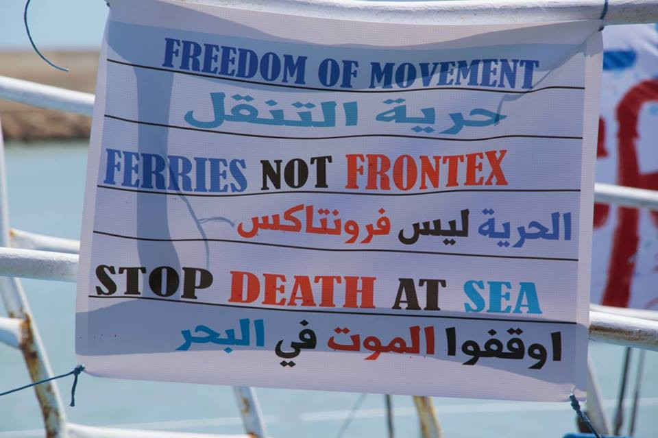
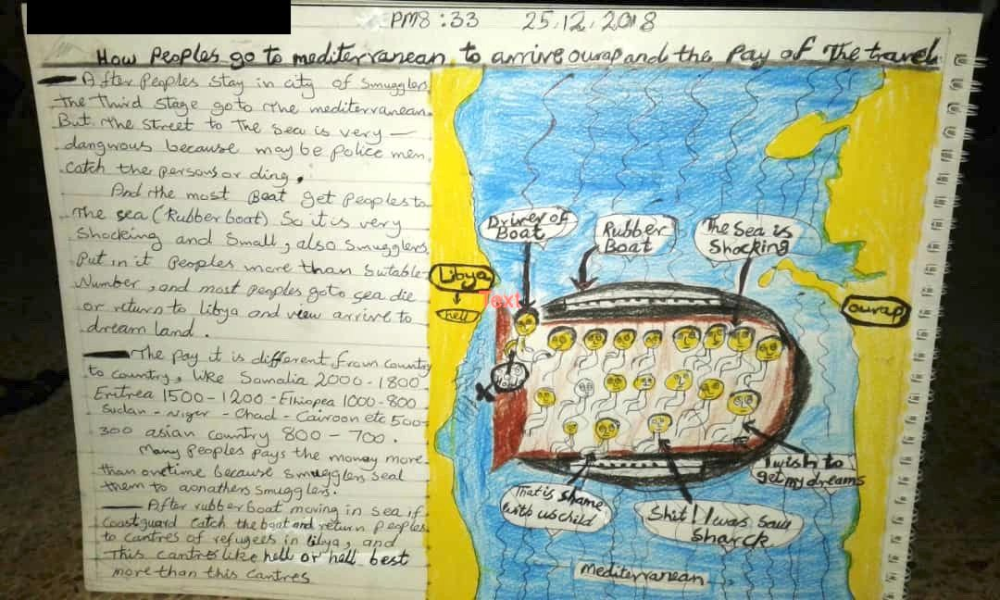

### AYS Daily Digest 27/12/2018: 32 people left at sea for over six days — the odyssey of Sea\-Watch

[Are You Syrious?](https://medium.com/@AreYouSyrious?source=post_header_lockup)

Dec 28

_Horrible weather conditions in Syria force people to displace // News from the Mediterranean // Donations and volunteers needed in Lesvos and Northern Greece // A van with 39 migrants was stopped in Croatia // Another death in Italy // And more information from the field…_

Credit: Watch the Med — Alarmphone
### FEATURE

Since Saturday, [Sea\-Watch has been stranded at sea](http://www.redattoresociale.it/Notiziario/Articolo/613199/Migranti-l-odissea-di-Sea-Watch-Da-6-giorni-in-mare-chiediamo-porto-sicuro) , without a safe port to disembark the 32 people on board, among them four women, four unaccompanied minors, and three children\. Conditions at sea are becoming more and more harsh, and people are starting to suffer from the deprivation of a week at sea\.

Five countries: Italy, Malta, Spain, Germany, and the Netherlands refused to allow the vessel to disembark in their territories, pushing Phillip Hahn, head of the mission, to call out to Germany and Europe to take on their responsibilities and “show the good example\.” Specifically, the NGO is pressuring Minister of Interior, Horst Seehofer, to “use” section 23 of the [Residence Act](https://germanlawarchive.iuscomp.org/?p=281) regulation to offer all those fleeing from Libya a secure permit to stay, in compliance with human dignity and the supposedly widely accepted European values\.

> “The supreme Land authority may order a residence permit to be granted to foreigners from specific states or to certain groups of foreigners defined by other means, in accordance with international law, on humanitarian grounds or in order to uphold the political interests of the Federal Republic of Germany”\. \(section 23, Residence Act\) 

More than 30 cities in Germany have stated that they are willing to welcome the people on board of the Sea\-Watch vessel\.

> “On Christmas, it is striking how the European countries lack any sort of humanity \[…\] \. We, nevertheless, celebrated Christmas with people from 17 different nationalities and 3 different religions on board\. Our Christmas gift to them was informing their relatives, one by one, that their beloved ones are still alive\. We protect people, what do our governments protect?” says Giorgia Linardi, spokesperson for Sea Watch in Italy\. 

Meanwhile, after a call of distress this morning, Sea\-Watch had to head south, towards Libya, to support SAR operations\. This is how the news was welcomed by people on board after a week at sea\.

■■■■■■■■■■■■■■ 
> **[Sea-Watch International](https://twitter.com/seawatch_intl) @ Twitter Says:** 

> > The crew expected it to be difficult to tell our 32 guests, that the ship is heading south again, towards #Libya, the country they just escaped, to find another boat in distress. Instead the answer was applause &amp; "we're happy if you help our brothers &amp; sisters!" #DefendSolidarity https://t.co/mmtVp4Nerl 

> **Tweeted at [2018-12-27 15:21:33](https://twitter.com/seawatch_intl/status/1078309918032187392).** 

■■■■■■■■■■■■■■ 

Europe needs to learn what it means to be “human” again\.
### SYRIA

Bad weather conditions and heavy rains are destroying the tents where the already internally displaced people are living in camps, in the outskirts of Idlib\.

### LIBYA

People on the move are drawing their journeys to Europe to describe them more clearly\.

](assets/1c795c51d4aa/1*38UjdnIKTZJXwAxEuUQuvw.jpeg)

Credit: Sally Hayden\. Original source: [https://twitter\.com/sallyhayd/status/1078013428265115649?s=19&fbclid=IwAR3d\- \_F8qr73SsOpeo\_criTouk6hrzN2FClen61\_A2QK6JekLuZVT8dJz\-I](https://twitter.com/sallyhayd/status/1078013428265115649?s=19&fbclid=IwAR3d-_F8qr73SsOpeo_criTouk6hrzN2FClen61_A2QK6JekLuZVT8dJz-I)
### SEA

According to IOM, [2,242 people have](https://missingmigrants.iom.int/region/mediterranean) died while trying to cross the Mediterranean in 2018, mostly fleeing from Libya and the Northern African region\. More than 700 of them lost their lives attempting to reach Spain, 15 just last week \(including two children\); 12 people are still missing, according to WatchTheMed — Alarm Phone, as reported yesterday in our [digest](ays-daily-digest-26-12-2018-humiliating-living-conditions-in-iom-run-centre-in-bosnia-174c30250862) \.

On the positive side, the [310 people rescued](https://www.france24.com/en/20181228-rescue-boat-set-arrive-spain-with-over-300-migrants?fbclid=IwAR3076i1MtAKfJzkoMqZyulEJs-xdWE6koSbsmivpTLC7Rez-rnjaHVQ4zw&ref=fb) by Proactiva Open Arms will reach the port of Algeciras tomorrow, December 28th at 8am\.

Sea\-Eye and Sea\-Watch are operating in the Central Mediterranean, in order to [rescue 72 people](https://www.facebook.com/seaeyeorg/posts/1710191859086704?hc_location=ufi) in distress at sea\. This morning the MRCC \(Maritime Rescue Coordination Centre\) in Rome communicated the need for help to the Libyan Coast Guard and, since then, no further information has been received on how the rescue operations have been developing\.
### GREECE
#### Arrivals

#### Islands

[Donations](https://www.facebook.com/Hamburger.Hilfskonvois/posts/2125812574107090?hc_location=ufi) are needed for Lesvos, in particular tents, sleeping bags, blankets, winter shoes, underwear, hygiene products, and common medicines\.

Support is also needed to [cover medical expenses](https://www.facebook.com/pikpalesvos/posts/2246365828972169?hc_location=ufi) of vulnerable refugees living at Pikpa’s\.
#### Mainland

Volunteers are needed in Northern Greece, to join a yoga, dance and fitness program from January 12th onwards, and to teach guitar or piano from February on\.

Get more information [here](https://www.facebook.com/groups/1666846223566047/permalink/2153042704946394/?hc_location=ufi) \.

AYS sources informed us that the municipality of Athens has opened a special heated place for homeless people to protect them from cold and it will be opened until Saturday, the 29th of December\. You can find the place at Sofokleous, 66\.
### BALKAN WEATHER REPORT
#### Friday, 28th December

_MONTENEGRO_

Predominantly cloudy and a little bit to moderately overcast\. In the north fog or low clouds during the morning alongside the rivers and in the basins\. The wind weak to moderate from changing directions, during the night northeastern wind\. The lowest temperatures from \-7 to 4 and highest daily from 4 to 16 degrees\.

_SERBIA_

Fog or low clouds during the morning\. Cloudy in the morning in the north, and some rain during the day locally in the rest of the country\. The wind will be weak from the west, turning into a northwestern and amplifying in the afternoon\. In the evening and during the night moderately to entirely cloudy, locally some rain, in the mountains snow and strong northwestern wind in the east\. The lowest temperatures from \-4 to 4 and highest daily from 5 o 11 degrees\.

_BiH_

Lightly to moderately overcast in, fog is expected in the centre and and east of the country\. In the afternoon clouds coming from the north and bringing some rain to the north, northeast and east fo the county\. The wind will be weak from the north and Northwest\. The lowest temperatures from \-5 to 1 and highest daily from 2 to 11 degrees\.

_CROATIA_

Partially sunny, changeably cloudy and a bit warmer\. Inland possibly some fog during the morning\. The wind weak, only in the northwest moderate, blowing from the northwest\. The lowest temperatures from \-6 to 9 and highest daily from 5 to 15 degrees\.
### CROATIA

At 6:15am\. on Christmas morning, on a narrow mountain road in the area of Vrgorac, the police stopped a van full of migrants\. The driver was 26\-year\-old A\.S\., who is originally from Srebrenica \(Bosnia\), but has Slovenian citizenship\. 
When the driver caught sight of the police ambush he slowed down without stopping and jumped out of the van\. He started running away and, according to unofficial information, the van crashed into the police car\.

Inside the vehicle there were 39 people from Iraq and Iran, including several women, some of them pregnant, and children\. Fortunately, everyone survived, but both vehicles were damaged\. The driver was caught\.
Some of the migrants were given first aid at the emergency ward in Vrgorac and later a woman in the 14th week of pregnancy and an eight\-year\-old child suffering from pneumonia were taken by ambulance to the hospital in Split\.
The driver was injured while fleeing over the rocky terrain\. He also ended up in the emergency ward with cuts to his legs and a broken arm\.

Original source [here](https://www.slobodnadalmacija.hr/dalmacija/split-zupanija/clanak/id/581576/drama-na-cesti-kraj-vrgorca-policija-zaustavila-kombi-pun-migranata-vozac-iskocio-i-poceo-bjezati-a-vozilo-se-zabilo-u-policijski-auto-trudnica-i-dijete-prebaceni-u-bolnicu?fbclid=IwAR3Xck5W5-rCS6EqSFZ-2c53TlIwFIMSOLYctDooPzApUEkHqf3XtG5Vxa8) \.
### ITALY

A young [Afghan man died](https://www.corriereadriatico.it/ancona/ancona_si_aggrappa_a_un_tir_per_sbarcare_giovane_afgano_resta_schiacciato_e_muore-4193274.html?fbclid=IwAR3bz7K4Q23TpUBdwpaHHefVv57ZhCNMoN1RzmTNRaDGXE8aX-xqbyUHx18) yesterday in Ancona\. He was crushed by the lorry he was hanging from, trying to disembark at the port\. Investigations are ongoing\.

This morning, the [Sudanese community in Rome took the streets](https://www.lasciatecientrare.it/la-campagna-lasciatecientrare-al-fianco-della-comunita-sudanese-di-roma/?fbclid=IwAR0Tyul5HZT9NMdHaZEcXuM4hpI2mit51nPkZt4LAWfS6MRyT5bDRaLM8aY) right below the Sudanese Embassy to express their solidarity with the people protesting in their country, against the violent, armed repression toward demonstrators and to raise awareness on the situation in Sudan, where just the past week 35 people lost their lives while protesting \(among them, 15 children\) \.

A lot of the people protesting this morning in Rome had been evacuated from via di Scorticabove in July this year and just recently accommodated in shelters, after months spent on the streets\.
### FRANCE

Opportunities for funding for refugees or aid groups for entrepreneur\-related projects are available [here](https://www.facebook.com/groups/172900819749383/permalink/746180609088065/) \.
### SPAIN

### UK

Around 23 people \(including three children\) from Iran were found in three different locations in Kent, south\-east of England on Thursday, after sailing from northern France in an inflatable boat, while 11 more were intercepted by the French authorities, trying to cross the Channel near Sangatte\.

All of them received medical assistance, but were immediately sent to immigration officials for interviews, while the three children are being looked after by social services\.

> Authorities on both sides of the Channel are worried about the sharp increase in the number of migrants trying to reach Britain by sea\. 

> Attempts to cross the Channel — one of the world’s busiest shipping lanes — have multiplied since October, with a particular spike recorded over the Christmas period\. 

> British authorities took in 43 people in English waters on Christmas Day and December 26\. 

Original source [here](https://www.france24.com/en/20181227-spike-illegal-channel-crossings-concerning-uk-minister?fbclid=IwAR2MP9QA0bbjkFhvvbagwgAjLqqnBcOEGNVCIKA8QYVJxK0sMmumL_J26GI&ref=fb) \.
### DENMARK

**We strive to echo correct news from the ground through collaboration and fairness\.**

**Every effort has been made to credit organizations and individuals with regard to the supply of information, video, and photo material \(in cases where the source wanted to be accredited\) \. Please notify us regarding corrections\.**

**If there’s anything you want to share or comment, contact us through Facebook or write to: areyousyrious@gmail\.com**

_Converted [Medium Post](https://medium.com/are-you-syrious/ays-daily-digest-27-12-2018-32-people-left-at-sea-for-over-six-days-the-odyssey-of-sea-watch-1c795c51d4aa) by [ZMediumToMarkdown](https://github.com/ZhgChgLi/ZMediumToMarkdown)._
