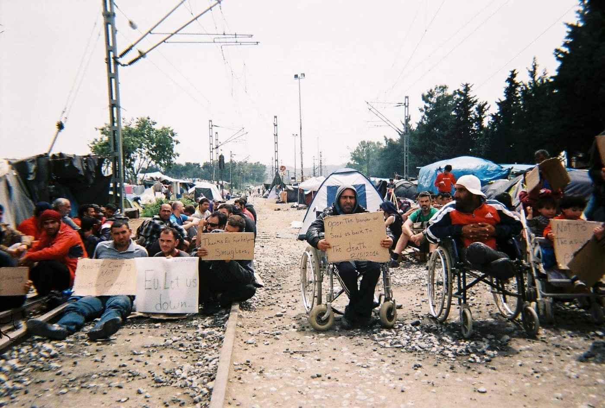
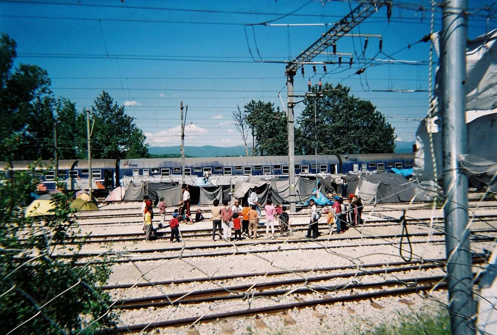

### AYS SPECIAL: **A Dream Story/ قصة حلم**

_A story about one journey from a country in war to a country in peace, over the Balkan route\._

Idomeni 2016\. Photo credits: Ali’s private archive\.

**2015:** There was never a year like this one\. They announced the opening of the Balkan route to help refugees reach Northern Europe\. At that time I was waiting for hope, for a way to follow my dreams out of the hell that was day by day building up around me\.

**March 2016:** Idomeni in Greece before they announced the closure of the Balkan route: it is not enough to say it is cold; the temperature is around freezing and there has been a total downpour the night before\. I am squatting on the ground with people I don’t know around a simple fire, desperate to hear news that would melt my heart and warm me up just a little\. One guy stands out amongst them and we begin to talk\. I never expected to go through something like this, a long journey with so many obstacles along the way\. A journey that evokes so many feelings; confusion, sadness mingled with hope and a silence unbroken by any noise\.

The conversation centres around to the Balkan route, the queues at the border crossing and the possibilities of making the crossing easier for everyone\. We talk about what awaits us after passing through the Balkan countries, as well as cursing the Macedonian border guards for their humiliating and inhumane treatment, and blaming them for the closure of the borders\.

It seemed that, since they first announced the closure, the route was gradually getting more and more narrow and there was no possibility of us being allowed to get across, perhaps because we arrived late, who knows?

Returning to the circle around the fire of plastic bags and empty water bottles, after I listened for a while I said, ‘this smoke is bad for the health and for the environment,’ and one of them replied, ‘this cold is what’s bad for the health, we just want to warm up, both us and the environment, just see what has become of us now\! After this, another one said something which I will never forget as long as I live: ‘I left my tent, I could not bear to watch my small children getting cold and weakened by illness, I wanted to stop crying in front of them, all this punishment for the sake of their futures\. Then the rain flooded the bottom of the tent, we could not sleep for the entire night\! I wanted to stop thinking of all of that and listen to news that could bring a little hope…

After more than two years, I began to believe that the Macedonian border guards were nothing more than slaves to their orders — they had to follow them\. The source of this principled decision had to extend throughout all European countries, and those men were a part of it, responsible for searching and humiliating refugees, assaulting them, pushing them back into Greece, crushing their dreams, for trivial reasons — perhaps an entry stamp into Turkey in the passport, or something similar\.

Idomeni 2016\. Photo credits: Ali’s private archive\.

**February 2017** : I meet Anikka Mayer for the first time, we talk in English and I tell her that I arrived in Germany two or three weeks previously and that I am looking for voluntary work with the Red Cross\. I tell her that I am waiting for the holiday to end so that I can register for a language course, but they did not allow me to join the language, or, as they call it, integration, course\.

**December 2018:** Two days ago, after more than a year and nine months from when I started volunteering with the Red Cross, my colleague Denise spoke to me, and this was really something quite amazing, as I still remember the first time we met, when she spoke to me in English, and I was not able to understand that level of conversation\. Now, we were talking only in German, I speak despite everything, even though I am not satisfied with my level, there are still mistakes in using some expressions and grammar…they say, no problem, we can follow your meaning\.

And now, less than two years later, I hope to complete a certified course, I have just about reached the language level that is demanded of me for work, but I must wait a number of weeks to receive the result of my exam\. I cannot start training or anything else without this result\. The course is eleven months and will start next February and without a sufficient language level and the certificate I cannot work or become independent or pay taxes…all of this needs appointments and a long wait and a lot of sitting around\!

Can anyone understand how complicated life is?

In general there are not so many people who were born or wrote or studied who had everything swiftly provided for them\. Yet when you question these people about these details, and you show them the life of refugees, you make them restless: their response? Apology and silence, saying, ‘there is a lot of bureaucracy here\.’

**_\(Ali Ahmad left his home in Syria Al\-Salamiyah in December 2015\. His journey took him through Turkey, Greece \(8 months\), where he was in Idomeni, later in Softex camp near Thessaloniki, and then about three months in the Balkans — Macedonia, Serbia, continued on to Hungary, Austria and finally Berlin, where he lives today\)_**

قصة حلم

2015: في سابقة لم يكن لها مثيل، أعلن عن فتح طريق البلقان وتوفير المساعدة لعبور اللاجئين إلى دول الشمال الأوربي، في ذلك الوقت كنت أنتظر الأمل وإمكانية مطاردة الأحلام خارج الجحيم الذي كان يزداد استعاره يوما بعد من حولي\.

03\.2016: إيدوميني اليونان قبل إعلان إغلاق طريق البلقان: كان صباحا أقل ما يقال إنه بارد، درجة الحرارة مقاربة للصفر، والمطر كان غزيرا في الليلة السابقة، أجلس القرفصاء مع أشخاص لا أعرفهم، حول نار بسيطة طمعا بسماع خبر يثلج القلب وكسب بعض الدفء، وحده الطيب الذي تبدى على محياهم جذبني إلى التوقف والحديث معهم، ولم أكن أتوقع يوما أن لحظة كهذه سيكون لي وقفات طويلة عندها، كانت مشاعر الحيرة والحزن الممزوج بالأمل تنبعث تلقائيا وبصمت لا تبدده ضوضاء\.

تمحور الحديث عن الحدود وطريق البلقان، قوائم العبور واحتمالات تسهيل العبور للجميع، كما تحدثنا عما ينظرنا عند المرور بدول البلقان، إضافة للعنِ حرس الحدود المقدوني على المعاملة المهينة واللاإنسانية وإلقاء اللوم عليهم بسبب إغلاقهم للحدود\.

على ما يبدو أن هذا الطريق كان يضيق شيئا فشيئا منذ اللحظة التي أعلن فيها عن ذلك، ولم يكن هناك من إمكانية أن يسمح بعبورنا، ربما لأننا وصلنا متأخرين، من يدري؟

عودة إلى تلك الحلقة حول نار من أكياس بلاستيكية وقناني ماء فارغة، بعد أن استمعت قليلا قلت: إن هذا الدخان مضر بالصحة والبيئة، فقال أحدهم: هذا البرد هو الذي يضر بالصحة، نريد أن نتدفأ، مالنا وللبيئة، ألا ترى ما نحن فيه الآن\. \.، بعدها قال آخر كلمات لن أنساها ما حييت: تركت خيمتي، لم أحتمل منظر أطفالي الصغار بردى ومنهكين من المرض، أردت التوقف عن البكاء أمامهم، كل هذا العذاب من أجل مستقبلهم، المطر غمر قعر الخيمة، ولم نستطع النوم طوال الليل، فقط\! أريد التوقف عن التفكير بكل ذلك وسماع خبر يبعث فيّ الأمل والقدرة على الاحتمال…

بعد أكثر من سنتين، بت مؤمنا أن حرس الحدود المقدوني لم يكونوا سوى عبيد تأتيهم أوامرهم من مرؤوسيهم وعليهم تنفيذ هذه التعليمات، لكن مصدر القرار الرئيسي كان يقبع في الدول الأوربية، وهؤلاء الأشخاص هم اللذين تولوا مهمات تفتيش وإهانة اللاجئين، والاعتداء عليهم بالضرب، ومن ثم دفعهم مجددا محطمي الأحلام إلى اليونان، كل ذلك كان لأسباب تافهة، مثل ختم دخول إلى تركيا قابع على جواز السفر\. \. إلخ\.

02\.2017: أقابل \(أنيكا مايرِ\) لأول مرة، نتحدث باللغة الإنكليزية وأخبرها أنني وصلت منذ أسبوعين أو ثلاثة إلى ألمانيا وأبحث عن عمل طوعي مع الصليب الأحمر إذا أمكن، وأخبرها أنني أنتظر انقضاء العطلة كي أسجل في دورة اللغة ولكن لم يسمح لي بعد أن ألتحق بدورة اللغة المسماة دورة الاندماج …\.

12\.2018: منذ يومين من الآن، بعد أكثر من سنة تسعة أشهر من العمل الطوعي مع الصليب الأحمر، يخبرني زميلي \(دينيس\)، هذا مدهش حقا، لا أزال أذكر أول مرة تقابلنا، عندما قدمت وتحدثت الإنكليزية معي، ولم أكن قادرا على مجاراتك حقا في الكلام، وها نحن الآن نتحدث فقط الألمانية، أقول بالرغم من كل شيء، لا أزال غير راض عن المستوى الذي أتحدث به، لا أزل أخطأ باستخدام أدوات التعريف من حين لآخر وغير ذلك من الأخطاء القواعدية…، يقول لا عليك من كل ذلك ونتابع حديثنا\.

ها أنا الآن: بعد أقل من عامين، أتطلع إلى إتمام دورة تعديل الشهادة، أنا تقريبا أنهيت مستوى اللغة المطلوب مني للعمل، لكن عليّ انتظار عدة أسابيع لأستلم نتيجة امتحاني، لا يمكنني البدء بفترة تدريبية أو غير ذلك دون هذه النتيجة، دورة تعديل الشهادة مدتها أحد عشر شهرا وستبدأ في شهر شباط القادم، بدون مستوى اللغة وتعديل الشهادة لا يمكنني العمل ولا الحصول على الاستقلالية ودفع الضرائب… إلخ، كل هذا يحتاج لمواعيد وانتظار طويل بل معقد كثيرا\!

هل هناك من يفهم تعقيدات هذه الحياة؟

غالبا ليس الكثيرين، فالذين ولدوا ودرسوا يألفون كل ما يستجد أمامهم بسرعة، وعندما أسألهم عن هكذا تفاصيل تعترض حياة اللاجئين وتسبب لهم الأرق والمعاناة يكون الاعتذار والصمت جوابهم، ويقولون: يوجد الكثير من البيروقراطية لدينا\.

علي أحمد، لاجئ سوري غادر

سوريا في كانون الأول ٢٠١٥، ولد

في مدينة السلمية، طريقه مر عبر تركيا، اليونان \(ثمانية أشهر\) حيث كان في إيدوميني ومن ثم مخيم سوفتكس بالقرب مدينة سالونيك، وثم لاحقا كان على طريق البلقان\. حيث عبر دول مقدونيا ثم صربيا وهنغاريا والنمسا وأخيرا وصل إلى

برلين، حيث يعيش الآن\.

**We strive to echo correct news from the ground through collaboration and fairness\.**

**Every effort has been made to credit organizations and individuals with regard to the supply of information, video, and photo material \(in cases where the source wanted to be accredited\) \. Please notify us regarding corrections\.**

**If there’s anything you want to share or comment, contact us through Facebook or write to: areyousyrious@gmail\.com**

_Converted [Medium Post](https://medium.com/are-you-syrious/ays-special-a-dream-story-%D9%82%D8%B5%D8%A9-%D8%AD%D9%84%D9%85-bc6a3ee08e6a) by [ZMediumToMarkdown](https://github.com/ZhgChgLi/ZMediumToMarkdown)._
