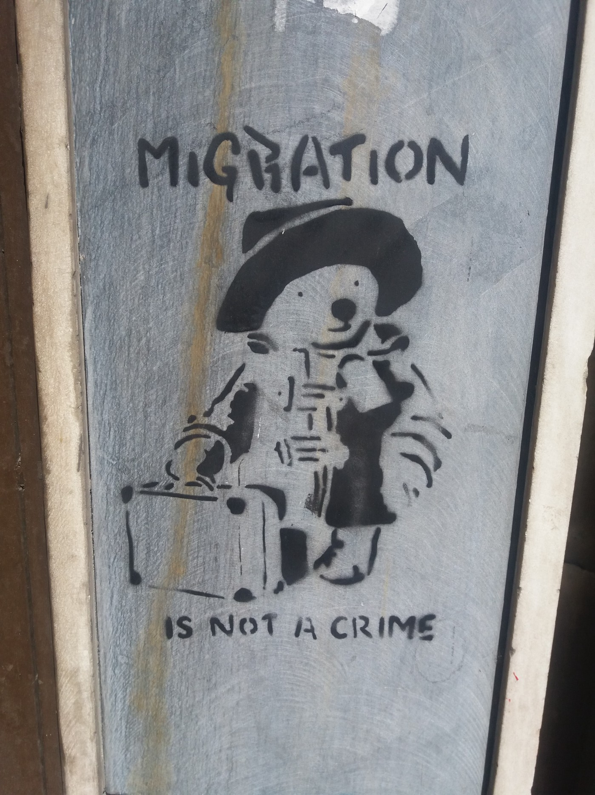

### AYS SPECIAL FROM ATHENS: One night in Exarcheia

The night I slept in Exarcheia was perhaps the turning point\. My phone had been stolen, I had been caught at the airport six times, each time returned\. I had even once dyed my hair blond and worn coloured lenses to appear more ‘European’ — it seems so ridiculous now\.

In Exarcheia I was surrounded by hashashin, every nation, class and colour united in smoking weed, perhaps the best form of integration there is\. It was cold, January 2017, and I was lucky, because it was the only night that I slept outside, unlike so many others\.

I woke the next morning and came across another guy, also young like me, with green eyes, from Latakia\. He had also slept on the street that night, but he looked so clean I could not believe he was sleeping rough\. Seeing him, a guy more or less my age in the same situation, made me realise that I was not alone and that there were so many others like me trying to find a way to survive\. After so many failures, sleeping on the street, losing so much money on wasted attempts to smuggle myself out of Greece, I began to understand that this was not the path for me\.

That morning at 5am I went to Katekhaki \(the Greek asylum service\) and I also received my first fine for not paying my metro ticket\. I took the fine, smiled, said, ‘efharisto poly’ _\(thank you very much in Greek\)_ and kept on towards Katekhaki, throwing away the paper fine on the way\.

This was the first fine of forty similar fines I would receive over the next two years, thanks to the incredible Greek system of fining people who clearly cannot pay their tickets\. As a conscientious member of Greek society now, I pay my monthly transport, but those fines amounted to 1,200 euros\. Of course, I never ever thought of that at the time\.

Why did I go to Katekhaki? Because six months previously I had not attended my asylum interview — I had been far too focused on the idea of getting out of Greece to find my brother in Sweden\. Besides, no one helped you in Greece, there was no accommodation, the only option for me was the squats\. It did not feel like a place that offered stability, or a future\. But now it seemed like I needed to change my plan, and so I went to Katekhaki and took my asylum card and the date for my interview, which was to be three months later\. I returned to Exarcheia, managed to stay in a squat for three days and there met a group of Spanish people who were to offer me my first place to stay\.

I began to plan\. To me, the most important things was finding a job, and so I thought about what seemed to me to be a previous life, but one that had given me experiences that now I could draw upon\.

In Damascus I had always been interested in technology — my brother had bribed me to do well in my exams with the promise of a laptop\. He tricked me and gave the laptop to someone else, but then relented and bought me a newer one; he could see how much it meant to me I think\.

I had studied technology in college for a while and then in Turkey I had managed to get some work at Vodaphone and had started to study coding\. Whenever I needed to learn something I went to one place: youtube\. Since Damascus, through Turkey and here in Greece, it is always the place I go to for learning new things, for inspiration and motivation\.

I began to work, buying old phones and then mending and updating them and selling them on\. I even made money online — just imagine 989 euros in my paypal, untouchable because there was no account for it to be transferred to\. No one would accept my Greek Asylum white card as valid ID\. I felt as if I was some sort of ethereal phantom, magically working online, but for no material benefit, except for the personal satisfaction of seeing the numbers on the screen and dreaming about what I would do with the money if it was physically in my possession\.

Many things have happened since then, many of which we will all experience in our lives as refugees — the struggle to find a job, a home, a way to build a life\. I realise I am not unique in this sense and this motivated me to try and help others in any way I can\.

For a year I was lucky to be involved with a youth centre which gave me accommodation in exchange for volunteering there\. I was always trying to think of new ways of making money within the narrow confines of Greek law where you cannot have a bank account unless you have a job\. I helped people write CVs, gave courses on computer software, computer literacy, anything that I felt could be helpful for people like me looking for a future here\.

I got a job, went to the training and got 99% on my coding exam, although to be honest it was my third retake\. Then the company told me to go home, because the Greek system did not issue my AFM \(tax number\) fast enough\. I tried everything, applying from different offices, with my company \(which arranges all the necessary visas, AFMs and accommodation for their foreign workers\), on my own, with a Greek person, anything\! In the Exarcheia office where I originally registered I went with a Greek friend to check on the progress of my AFM which I had submitted a month previously\. Eventually one clerk at the office whispered to my friend, ‘the person you need to talk to is in the toilet\. Wait until he comes out and try and get him before he goes into the office\.’ A couple of minutes later a large man with an even larger belly waddled out of the toilet, sideways\. My friend tried to speak with him, but all she received was a dismissive gesture and a grunt\. I had felt as if I had done everything, I had never given up, I had given so much of my time to learning and teaching others and had got this job, only to lose it because of a stupid bureaucracy\.

It seems so funny now, looking back on it, because a month after that we returned and I managed to get my AFM, from the same toad\-man\. It had arrived maybe 10 days after I had visited the first time, but they had never bothered to call me\.

In my despair my Greek friend put it in perspective\. She too had suffered from this system, it was not specifically discrimination because I was a refugee, but rather an inefficient system that makes it impossible even for ordinary Greeks to do apparently simple things\. Obtaining an AFM was my right as someone with residency, I had to be reminded that it would come eventually, that this was part of the journey, even if it felt as if Greece wanted me to personally suffer\.

That was two months ago\. Now, one AFM, a bank account and a 1,200 euro fine later, I am working as a software developer in a company that I dreamed of working for when I was in Syria\. I could not have done this in Germany, France, Belgium or Holland, and so, although I spent so much time and money trying to escape this country, it turns out that this is one of the few places I can actually get the experience I need to continue my career\.

What kept me going after that night in Exarcheia, before that in Turkey and Lesvos, was always having a plan and working out how to make it happen\. In every situation, even if it is new, or potentially stressful and unfamiliar, I see opportunities to explore, make new contacts, learn something new\. I truly believe that anyone can do what I have done, they just need focus, flexibility and a willingness to learn\.

Be independent, do not follow the bad habits of others, and recognize that sometimes what works for others may not work for you\. Make the most of your time and plan your day, week, month, even your year\. Wherever you go there are opportunities to learn\. Even in Athens, where I thought there was nothing, there are lots of different places that offer amazing training in languages and other skills\.

Live in the present, but always think about the next step, and trust yourself\. And use youtube\!

**_\(Written by one of many asylum seekers living in Athens\)_**

**We strive to echo correct news from the ground through collaboration and fairness\.**

**Every effort has been made to credit organizations and individuals with regard to the supply of information, video, and photo material \(in cases where the source wanted to be accredited\) \. Please notify us regarding corrections\.**

**If there’s anything you want to share or comment, contact us through Facebook or write to: areyousyrious@gmail\.com**

_Converted [Medium Post](https://medium.com/are-you-syrious/ays-special-from-athens-one-night-in-exarcheia-47ffe294a4cc) by [ZMediumToMarkdown](https://github.com/ZhgChgLi/ZMediumToMarkdown)._
