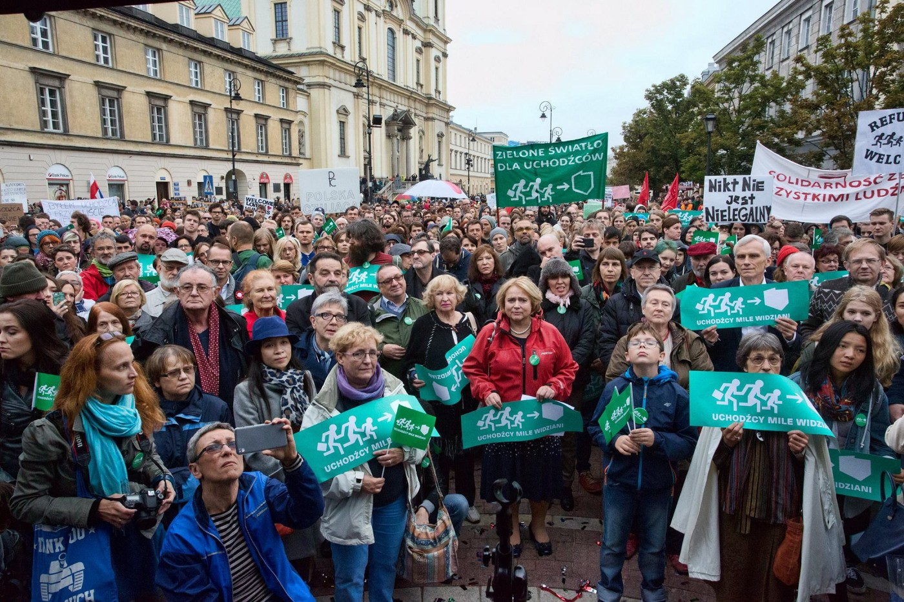

### AYS SPECIAL: **Notes from POLAND**

_Poland has gained notoriety over the past few years for its sharp rightwing turn, refusal to take in a single refugee from the small quota allocated by the EU \(7,000 people\), and its virulent anti\-immigration rhetoric, coupled with an ugly alliance with nationalists\. The situation is difficult, even harrowing at times, but there are some bright glimmers of hope to be found among the actions of local volunteer groups\._

Photo by Julia Rosciszewska: Varsovians demonstrate solidarity with refugees

Poland has made local headlines with its treatment of asylum seekers at the Eastern border\. Being the eastern\-most EU country, it is a highly desirable point of entry\. Guards at the border crossing in Brzesc\-Terespol \(Belarus\-Poland\) have been systematically denying people the right to submit their asylum claims\. Asylum seekers arrive through Belarus \(essentially a vassal state of Russia, and unsafe\) from Chechnya mostly, and spend all their savings as they ‘try their luck’, some as many as 60 times\. Under Polish law and the Geneva Convention, asylum seekers have the right to submit their claims at the border and this should have nothing to do with luck\.

The situation at this particular crossing is regularly monitored by a number of groups \(the [Helsinki Human Rights Foundation](https://humanrightshouse.org/human-rights-houses/warsaw/) , Amnesty International and some Polish groups\), but in 2015 and 2016 it became untenable \(by 2016, the number of asylum claims filed in Poland had fallen by 60%\) \. In 2017 a group of pro\-bono lawyers was formed to assist people with filing their claims, and complaints were drawn against the border guards in EU courts, with winning rulings \(ECtHR\) — but the unlawful practice was ongoing and EU verdicts flaunted as of this fall\.

A famous case concerned a Syrian citizen who had fled to Belarus in 2012, finished his studies there, decided to cross into Poland to request asylum for fear of being returned to Syria by Belarus and drafted, was turned away and told that “Terespol is not Europe”\. There is hope that the latest ruling by the Polish Supreme Administrative Court — issued in September 2018, in favor of people’s rights to submit asylum claims in Terespol and nullifying the border guards’ decisions — will be respected, and that the situation will change\. \(NB: 70% of asylum claims in Poland are filed by Chechens at the crossing in Terespol\. \)

**A brief overview of the current system:**

In Poland, the term “refugee” is used to refer to people who file claims for _Ochrona Miedzynarodowa_ \(International Protection\) upon entering the country\. The majority of refugees come to Poland from former Russian republics, with Chechens making up roughly 70% of applicants since the early 2000’s\. Since the beginning of the conflict in Ukraine, the second largest group are Ukrainians\. Among other nationalities are Tajiks, Uzbeks, Armenians, Georgians, Turks, Syrians, Iraqis, and Vietnamese\.

[There were a little over 5000](https://www.asylumineurope.org/reports/country/poland/reception-conditions) applications in 2017\. The rejection rate was 81%\.

Upon entering the country and successfully submitting a claim for protection, refugees are sent to either of two reception centers for basic processing, medical exams, etc\. This is also where people await deportation\. Afterwards, they are given the choice between living in an ‘accommodation center’ \(there are 9 in total\) or submitting a request for a small stipend in order to cover living expenses outside of the center from the Chief of the Office for Foreigners\.

Both options are hugely challenging: accommodation centers are typically located outside of smaller towns, oftentimes in old army bases, in the middle of a forest, with difficult access to public transportation \(eg\. a 3 km walk to the nearest bus stop\) \. Families are given their own room, but cooking facilities and bathrooms are shared, seriously impinging on privacy\. There are little to no activities, psychological support etc\. \(Those that exist are often organized by NGOs, as outlined below\. \) Integration is very difficult, there are few opportunities to practice language skills or to meet locals\.

The stipend for those who choose to live outside of the accommodation center is PLN 750 for a single person, 1200 for 2, and 1500 for a family of 4\. For context, the minimum wage in Poland is PLN 2000/month\. Refugees are also not allowed to work for the first 6 months upon arrival, and sometimes not at all until a decision in their case is reached\.

All children under the age of 18 residing in Poland have the right to education, and school is mandatory\. Pre\-schools are also free\. In practice, however, there are serious obstacles to accessing education\. Preschools are experiencing severe shortages and it is very difficult to secure a spot for a Polish family, let alone a refugee family\. Primary and secondary schools in turn lack a support system in place for foreign students \(in some areas, 2 hours of language instruction are mandated a week, in others up to 10 or none\) \.

Children do not know Polish, but are obliged to participate in classes in Polish, and to sit in exams in Polish\. Accommodation centers can provide language classes, but these are often organized by NGOs and the situation is currently in flux\. In theory, schools can also employ a teacher’s assistant who knows the language of their country of origin, to support them in their school work\. In practice, there are few qualified bilingual teacher’s assistants in Poland to serve in this capacity \(for the languages in question\) \.

Once protection is granted, refugees must leave the reception center within 2 months\. If they were receiving a stipend, it also is stopped 2 months after a positive decision is granted\. Refugees are then able to apply for support through a special fund, called IPI, to be spent on living expenses, language classes or rent\. After 12 months, they are completely cut off from any type of government support\. Case workers assigned to individuals and families through this program \(as well as non\-for\-profits\) agree this is not nearly enough time for people to become completely independent\. Refugees are also able to apply for public housing, but in practice they rarely meet the criteria, or face downright discrimination\.

As a result, according to a 2012 report by UNHCR, 5–10% of persons who were granted protection end up permanently homeless, while another 30–40% rely on shelters and on other forms of temporary or crisis support forms of housing\.

There are initiatives in Poland among volunteers to help find housing: [Refugees Welcome Polska](https://www.facebook.com/refugeeswelcomepolska/) , and other groups actively seek cheap housing or free rooms for those who reach out to them across Poland\. Needless to say, these efforts are a drop in the ocean\.

When it comes to work permits, refugees face discrimination both in accessing employment and often also while employed \(wages are withheld, etc\. \) While getting the right to work is relatively easy, there are no courses to help refugees understand the Polish labor market, no workshops on culture and customs, or language\.

A number of non\-profit organizations support refugees by providing resettlement services\. For instance [Refugee\.pl](http://refugee.pl) , which opened in 2014 \(after the main Polish humanitarian aid group, PAH, shut all operations supporting refugees within Poland\) once employed 30 people \(counselors, regular staff, kindergarden teachers for 2 of the accommodation centers\. \) However, following the last elections and the win by PiS \(the Law and Justice Party,\) all funds \(including EU FEMI budget funds\) have been frozen while the government rethinks its strategy on refugees and migration, two years and counting\.

Meanwhile, NGOs whose work depends on these funds have no access to them\. Refugee\.pl is the second NGO forced to crowdfund to continue operations\. The money raised covers rent, bills, the salaries of the remaining 2\.5 employees, food coupons and other forms of direct aid the organization provides\. One of the main forms of support offered is direct assistance in finding employment and housing \(obstacles are language, nationality and status\) and supplying food, clothing, shoes, household items and equipment\. Classes offered include Polish as well as a sewing class taught by a refugee; here a group of women gather weekly to spend time together and to learn towards starting their own small business\.

There are plans to start free weekly city sightseeing trips for women\. Other employees run a robust educational program where they travel to smaller areas and conduct workshops on refugees in Poland for local high schools\. Chlebem I Sola, another non\-profit organization, provides everything from help seeking furniture, housing, household items, to running a highly efficient and effective at\-home tutoring program for refugee children who attend school\. A similar program to help adults with their language learning is in development, and a new language course was just launched for mothers with young children: this group of refugees typically has no opportunity to attend classes, therefore the class is run in parallel with a creche staffed by volunteers\.

**_\(By Anna Purisch, Independent Volunteer\)_**

**We strive to echo correct news from the ground through collaboration and fairness\.**

**Every effort has been made to credit organizations and individuals with regard to the supply of information, video, and photo material \(in cases where the source wanted to be accredited\) \. Please notify us regarding corrections\.**

**If there’s anything you want to share or comment, contact us through Facebook or write to: areyousyrious@gmail\.com**

_Converted [Medium Post](https://medium.com/are-you-syrious/ays-special-notes-from-poland-ae65a3a83845) by [ZMediumToMarkdown](https://github.com/ZhgChgLi/ZMediumToMarkdown)._
