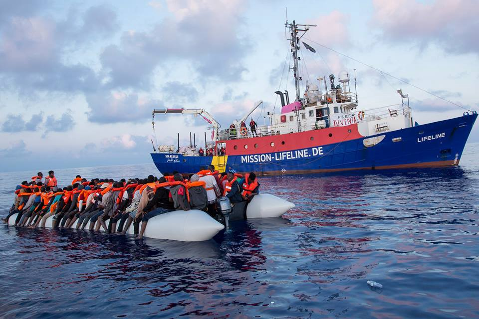
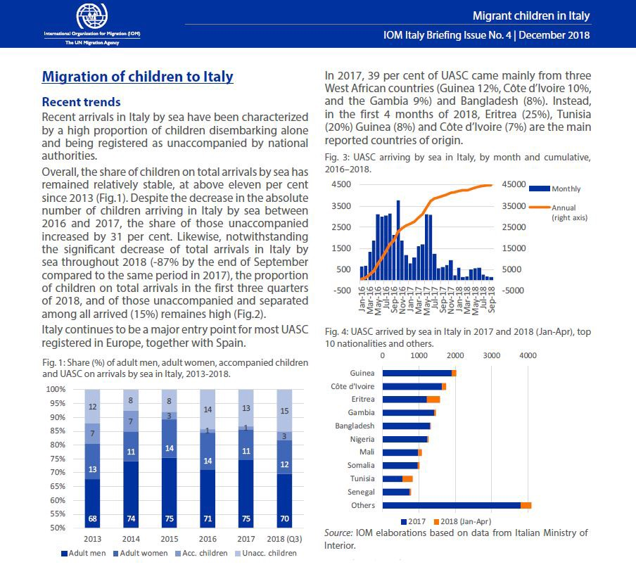
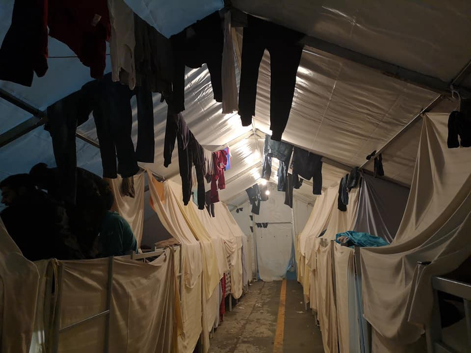
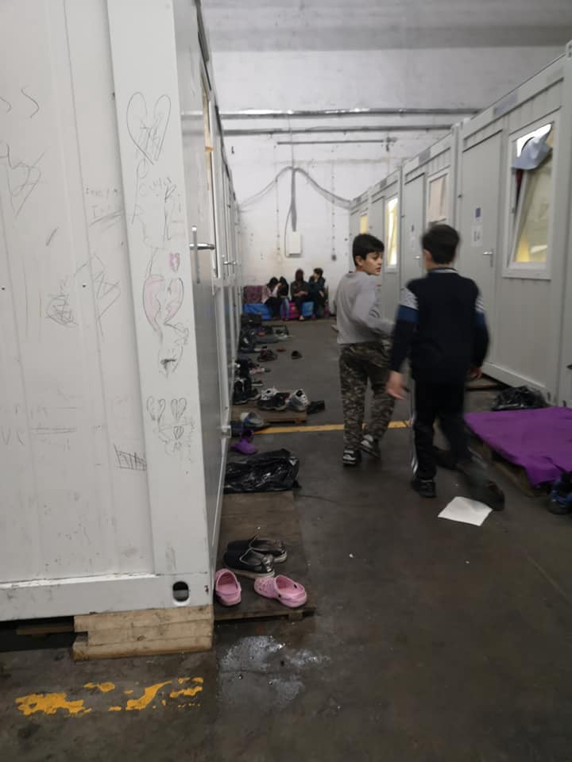
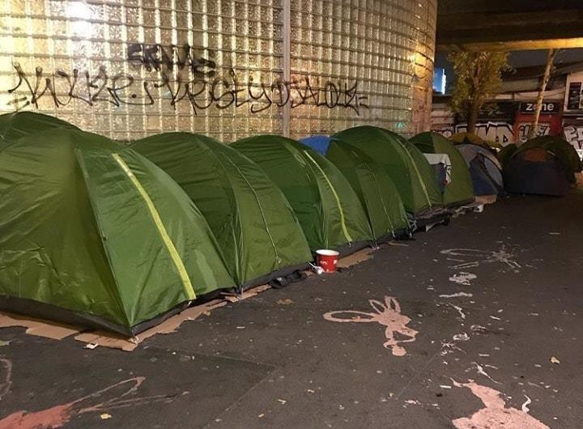

### AYS Daily Digest 28/12/18: EU turns its back on 32 stranded at sea

_Turkish troops gather outside Manbij//refugees detained in Turkey//45 people missing between Spain and Morocco//new arrivals in Greece//refugees attacked in Paris//unaccompanied minors in Italy//boat landings in the UK_

](assets/5a008763d67f/1*A68rxllsSNLuf-Y2HPWyGQ.jpeg)

Image Credit: [Pilar Collazo Gil](https://www.facebook.com/pilitaum?__tn__=%2CdCH-R-R&eid=ARD1tjPPylW56aqJBhxnuj5F0XfCwniBFyxCf8ITBkguZ96bfLU9ExfGWQiQvpCUscjneuesRpZOwObI&hc_ref=ARSluhjN3uZGXV2fEh9IUEBjzXz4eFKEqk-fg3ZbOLqCVwf8mI2VPHSrSfbOni3HmJk&fref=nf)
#### Feature: 32 people remain stranded aboard rescue ship after a week at sea

The Sea\-Eye rescue ship arrived in the Western Mediterranean SAR zone today\. Along with the Sea\-Watch 3 vessel, the Sea\-Eye is the only rescue ship currently working in the Mediterranean\.

There are still 72 missing in the central Mediterannean, according to Sea\-Eye\.

While the Sea\-Watch 3 is conducting SAR missions, they are still carrying 32 people who they rescued one week ago\. Among the 32 rescued people are many minors\. Sea\-Watch has reached out to authorities in Malta, Italy, Spain, the Netherlands, and Germany, to receive permission to disembark or relocate the people onboard\. So far, none of the countries have agreed to cooperate, leaving the 32 people still stranded at sea\. The EU and its member states have shown themselves increasingly willing to turn their back on people desperate for safety — often forcing refugees back into the Libyan hell from which they fled\. Today a number of civil and human rights organizations published an open letter condemning this inaction on the part of the EU, and demanding safe harbor for the 32 people\. From the [letter](https://aditus.org.mt/ngo-press-release-dont-look-the-other-way-allow-the-disembarkation-of-the-men-women-and-children-stranded-on-board-the-sea-watch-3/?fbclid=IwAR3mMciMlDSC4vS8xBQCuND1D5qVu5Sp8iuM0dpri3DKi1jj6i1EeuKVe2w) :

> The standard argument these days is that migrants rescued at sea should be returned to Libya, even if we know that they will be imprisoned in horrible conditions, tortured, raped, or sold as slaves\. This is a flagrant violation of our freely assumed commitment to ensure that no one is returned to a country where their safety is not guaranteed and where they are at risk of torture or other violations of their rights\. 

As the Sea\-Watch reminded us today, these are the figures for where rescued people are staying so far in 2018 — Italy: 22,935 Spain: 52,621 Greece: 29,567 Germany: 115\. As the numbers show, most refugees are being forced to stay in the countries of first arrival, with relocation, regardless of whether refugees have family in other European countries, happening at a very slow pace\. So much for European solidarity\.
### Syria

 IDP camps, in evacuation the effected families, and opening corridors to discharge rain water\.” Photo Credit: [Syria Civil Defence — The White Helmets](https://www.facebook.com/SyriaCivilDef/?__tn__=%2CdkCH-R-R&eid=ARDmdw4mXFWNckr8y0QI2QTaUX05To6VtJYxatyMqCdW7FAlqvtgxzYcPCrBI2J03GyVvYZJr_Pos-76&hc_ref=ARR6l9SOHnnW-Xi6HBbU2PCg8BCnLFzvgD7mWLGbbWO7GJ_n40ByiiOXUwZU4QRTZnk&fref=nf&hc_location=group)](assets/5a008763d67f/1*NfTJYPAgUFKzfM0-WMyM9A.jpeg)

“Our White Helmets teams continue their work in the southern [\#Aleppo](https://www.facebook.com/hashtag/aleppo?source=feed_text&epa=HASHTAG) IDP camps, in evacuation the effected families, and opening corridors to discharge rain water\.” Photo Credit: [Syria Civil Defence — The White Helmets](https://www.facebook.com/SyriaCivilDef/?__tn__=%2CdkCH-R-R&eid=ARDmdw4mXFWNckr8y0QI2QTaUX05To6VtJYxatyMqCdW7FAlqvtgxzYcPCrBI2J03GyVvYZJr_Pos-76&hc_ref=ARR6l9SOHnnW-Xi6HBbU2PCg8BCnLFzvgD7mWLGbbWO7GJ_n40ByiiOXUwZU4QRTZnk&fref=nf&hc_location=group)
#### Turkish forces gather outside of Manbij

Turkish forces who are part of the “Euphrates Shield” operation in Northern Syria have [collected outside of Manbij](http://www.syriahr.com/en/?p=110701&fbclid=IwAR3eFwCKSGJ6E2A_fIPjdFOKD5HleDfBkU3We0WUy6Gtr-8cTzrvptFMsgQ) in Syria, according to the Syrian Observatory for Human Rights \(SOHR\) \. These forces have apparently made contact with Turkish\-allied militias in Manbij, possibly to prepare them for a Turkish incursion into the region\.
#### Number of Syrians returning from Jordan drops

The amount of Syrians returning to the country through the Nassib border crossing with Jordan has [dramatically dropped in recent weeks](http://www.syriahr.com/en/?p=110662&fbclid=IwAR3Xi_qdpvEWFXWEtOaQllWu1X_lGWArcmUIBs8Axj9Wy_kkHUx3wBlF95A) , according to SOHR\. The suspected reasons for this decline are the increasing power of Assad’s security forces in the region, which has allowed the regime to force more young people into military service in Daraa province\.
#### Refugees trapped on Jordanian border plea for help in advance of coalition troops withdrawal

The civil administration in al\-Rokban camp is calling for support before a number of coalition troops plan to withdraw from the area\. The people living in this camp have already endured years of hardship and danger, and often receive food provions and aid convoys little more than once a year\. According to the open letter which was [published in part by SOHR](http://www.syriahr.com/en/?p=110663&fbclid=IwAR3LUFK-lOVhh8VRuQO15751CLbFNSnL8wtaouSbW672uoBoqHwhVgtjG5Q) , “Area 55 which is protected by the International Coalition represented by al\-Tanf base, houses more than 70,000 displaced people\. These people are threatened with an unknown fate in the event of withdrawal of the International Coalition\. Most likely, the fate will be the inevitable death, we call on the international community, the Security Council, the United Nations, and all Human Rights Organizations, to take their full role for the fate of those stranded in this big prison, the so\-called death camp \(al\-Rokban\), and to find solutions for them by opening safe roads to safe areas\.”
### Turkey

19 people were detained near the Turkish\-Bulgarian border today, according to Turkish security forces\. The people were attempting to cross over into Bulgaria when they were detained\.

In the Gaziantep province, an additional seven Syrians were detained for “illegally entering” into Turkey\.
### Sea

Photo Credit: Danilo Campailla / Mission\-LIFELINE

The alarm\-phone rescue line has received four calls for assistance in the past 24 hours\. Three of the boats that contacted the group were returned to Morocco \(two of them forcibly by the Moroccan Navy\) \. The fourth boat, carrying 45 people, is still missing between Spain and Morocco\.

■■■■■■■■■■■■■■ 
> **[Alarm Phone](https://twitter.com/alarm_phone) @ Twitter Says:** 

> > @[salvamentogob](https://twitter.com/salvamentogob) Last night we spoke with 4 different boats crossing to #Spain. 3 boats are back in Morocco: 2 picked by the Moroccan Navy &amp; 1 by themselves, while 1 person supposedly drowned in part due to the long wait for rescue.

1 boat with 45 ppl is still unaccounted for!

#safepassage 

> **Tweeted at [2018-12-28 12:17:07](https://twitter.com/alarm_phone/status/1078625892103012353).** 

■■■■■■■■■■■■■■ 

 \.](assets/5a008763d67f/1*QgI_0l9rGUR2CUtTH_tiLQ.jpeg)

“On the way to the port of algeciras, we found ourselves in front of a half\-sunken rubber boat\. Many of the people who were rescued from the Libyan coast by the Open Arms vessel watched it carefully\. Some have asked; “ where are the people?”\. Photo Credit: [Olmo Calvo](https://www.olmocalvo.com) \.
### Greece
#### New Arrivals \(numbers via [Aegean Boat Report](https://www.facebook.com/AegeanBoatReport/posts/499013747288401?__xts__[0]=68.ARBZ3scCVxIqKDVapzcdz9UGXotJQvzRk4yzynsZE886qBboTdk_DM6oe7bNQGPKs7oD_AuRPFMb1KDUgt47-kGvzFXIR_ohLEJQTgtrzGQS53d5ypJ1hhBjnFDqGz_RL_VxOSdX50TG0_vF-0YD-fgEyf3O-n9aW259d3uxo3wWzQnaRv7q9A_V5e28XK6zKmjL8yw-AKj7akxwhrjyNb9tz3ifXdKt8aTZ8RhXcOh7FmB8js7SLJ7TcYvjYkwmDrZ2r0QYRveKPI1J3gPKagB4_W1Wcal0dPOwSQEEYsdLmeElMKuL98unL4--KZG5TqfECW9TNY1kt1pNJq5-DAQrUtgDt4gDgnprEUYZXVrO4lEfMheD4g&__tn__=-R) \)

Two boats arrived on Lesvos this morning\. The first landed in Tsonia, Lesvos north east, at 06:30\. There were 47 people onboard, 21 children, 14 women, and 12 men\. The second boat was picked up outside the airport, Lesvos south, 08:00 by Frontex\. There were 37 people aboard, no breakdown currently available\.
#### 7 people feared drowned on boat headed towards Cyprus \(via [ABR](https://www.facebook.com/AegeanBoatReport/posts/499013747288401?__xts__[0]=68.ARBZ3scCVxIqKDVapzcdz9UGXotJQvzRk4yzynsZE886qBboTdk_DM6oe7bNQGPKs7oD_AuRPFMb1KDUgt47-kGvzFXIR_ohLEJQTgtrzGQS53d5ypJ1hhBjnFDqGz_RL_VxOSdX50TG0_vF-0YD-fgEyf3O-n9aW259d3uxo3wWzQnaRv7q9A_V5e28XK6zKmjL8yw-AKj7akxwhrjyNb9tz3ifXdKt8aTZ8RhXcOh7FmB8js7SLJ7TcYvjYkwmDrZ2r0QYRveKPI1J3gPKagB4_W1Wcal0dPOwSQEEYsdLmeElMKuL98unL4--KZG5TqfECW9TNY1kt1pNJq5-DAQrUtgDt4gDgnprEUYZXVrO4lEfMheD4g&__tn__=-R) \)

> On 27\.12\.18 at 16\.45, the Cyprus Joint Rescue Coordination Center was contacted by an American Cargo ship after they picked up a man floating in the sea north east of Cape Greco, Cyprus\. 

> A boat was reported missing by relatives on Wednesday night, heading out from Lebanon towards Cyprus\. Several attempts to contact the boat was unsuccessful\. Coastguard was informed, but without any location they did not know where to search\. 

> The man was transported by helicopter to Hospital in Larnaca\. According to the mans testimony, the boat started out from Lebanon with 8 people Wednesday 26\.12\.2018, heading towards Cyprus\. Due to bad weather, the boat sank, and seven people are missing, believed to have drowned\. The missing people are reported to be Syrian nationals\. 

> Search and rescue operations in the area have been without result thus far\. 

#### Syrian man arrested for people smuggling in Thessaloniki

A police chase on the Egnatia highway in Thessaloniki ended in the arrest of a 21 year old Syrian man, who stands accused of transporting 17 refugees in a car\. The people in the car were of Syrian, Palestinian, Egyptian, and Iraqi nationality, according to the Greek police, and none of them had documents giving them status in the country\.

Action for Women on Chios is looking for volunteers who speak Arabic or Farsi to join their team\. Follow the link [here](https://www.facebook.com/actionforwomenCH/posts/1509681245843026?__xts__[0]=68.ARA1SN-Ioq-355IvzCJjYN-7ykRPBKE53fiEzFrZd_SCWo2KB3jJHRYNEuaosnDxBuUsNo9JY1GMKNzYzoigKbha80v6v5KKMM9W8_RCjZqzDmeroFmu4ZmoKMPKpDGdza8IGLGOU7TrPwLZhjeacvdnqMtWxukZh6K4Ky1ZzWfRexls97lM41M9Pi01t1H-ooOQsBiwOxru1R_p16McCBfJGmo-UqWMFxrBXcXgP4f-3c01dv_tlvWb-5vmPkx1Ll32TqoC8JidJ7EphnXn11lU55zH1Gq2qXrkHqB185BACu_n3RJ7PaGyTyjvQGXRxgoZPHlsUbAxAaf4QCf-VGYBkmgtKZ0LcwgsKYAoCcOw6LbQhEi8QdLkvLScU1olQR5tLEkMP1KUgdBJ-E9hsSbfHHvDKbCRhDzKVJ0ZcbzFPM_6N6r6JVEIkdzSX1slUOxx_fdAiReAOEl8k_07rtwdtKImBDNIL1qUfkqll-jncRVIe-_ltEhScMu0a-NiUg&__tn__=-R) to apply\. Applicants must be over 21 and willing to volunteer for at least one month\.

Aegean Boat Report is raising money for various organizations to aid refugee children in Greece\. You can contribute through the link [here](https://www.facebook.com/AegeanBoatReport/posts/499013747288401?__xts__[0]=68.ARBZ3scCVxIqKDVapzcdz9UGXotJQvzRk4yzynsZE886qBboTdk_DM6oe7bNQGPKs7oD_AuRPFMb1KDUgt47-kGvzFXIR_ohLEJQTgtrzGQS53d5ypJ1hhBjnFDqGz_RL_VxOSdX50TG0_vF-0YD-fgEyf3O-n9aW259d3uxo3wWzQnaRv7q9A_V5e28XK6zKmjL8yw-AKj7akxwhrjyNb9tz3ifXdKt8aTZ8RhXcOh7FmB8js7SLJ7TcYvjYkwmDrZ2r0QYRveKPI1J3gPKagB4_W1Wcal0dPOwSQEEYsdLmeElMKuL98unL4--KZG5TqfECW9TNY1kt1pNJq5-DAQrUtgDt4gDgnprEUYZXVrO4lEfMheD4g&__tn__=-R) \. As the volunteer behind ABR’s daily reports wrote, “I’m hoping for a better tomorrow, not only for this fundraiser, but for people in general\. My heart goes especially to the children, who tonight are trying to sleep in a cold tent, no heating, nothing\. \. No parent should have to watch their children freeze, in a cold tent, water dripping, muddy\.”
### Italy

The IOM has published new data on the number of children and unaccompanied children arriving in Italy\. According to their findings, while the number of children arriving in Italy has remained relatively stable, the proportion of these children who are arriving unaccompanied has increased by 31%\.

### Balkan Weather Report \(for Sat\. 29\.12\)
#### MONTENEGRO

Predominantly sunny in the south, moderately to entirely cloudy in the north and fog during the morning in the basins\. The wind will be local, and moderate to strong, blowing from the south and southeast\. The lowest temperatures from \-5 to 6 and highest daily from \-2 to 15 degrees\.
#### SERBIA

In most parts of the country it will be cloudy, locally predominately sunny; in some places rain and in the mountains there will be some snow fall\. The wind will be weak to moderate, in the west and in the mountains from time to time strong, blowing from the northwest and decreasing in strength during the evening and night\. The lowest temperatures will be from \-2 to 6 and highest daily from 3 to 10 degrees\.
#### BiH

In most parts of Bosnia it will be predominately cloudy\. In the basins and alongside the rivers fog and low clouds\. In Herzegovina mostly sunny with moderate clouds, more cloudy in the north\. The wind will be weak to moderate, in Bosnia from the west and northwest and in Herzegovina from the north\. The lowest temperatures from \-5 to 5 and highest daily from 1 to 11 degrees\.
#### CROATIA

Partly sunny and changeably cloudy\. The wind will be weak to moderate in the south and alongside the coast a weak to moderate northwestern wind\. The highest temperatures between 5 and 9 degrees inland and from 10 to 15 in the coastal areas\.
### Bosnia

Two days ago, [AYS published the story](ays-daily-digest-26-12-2018-humiliating-living-conditions-in-iom-run-centre-in-bosnia-174c30250862) of what is considered to be the worst refugee “center” in Bosnia: the Miral camp\. Additionally, AYS spoke with more people living in Miral and we were told that among over 550 people there are 5 women and several kids\. All the others are single men\.

It is absolutely unaceptable to leave 5 women and children alone in this place which is compared to the hell by residents\. IOM, UNHCR, and others working inside \(MSF among others\) have to take into consideration safety of the people they have obligation to assist\.

While Miral may be the worst, hardly any of the so\-called accomodation centers in Bosnia \(majority run by the IOM\) have an acceptable standard of living\. Most of them are unheated, asbestos\-ridden former warehouses or factories\. Below are photos of the BIRA center in Bihac, located in a former factory\.

Bira\. Photos by an independent volunteer\.

2,110 refugees live in this space, including many unaccompanied minors \(over 150\) \. The volunteer who took these photos referred to the place as a “concentration camp”\. This is not to make a comparison to the camps of the holocaust, but under the legal definition of “concentration camp,” BIRA certainly fits the bill — — a space outside of rights, of law, and the norms of society\.

](assets/5a008763d67f/1*_EoP4IrZ_uhFRL8bYhICJw.jpeg)

Waiting in line for food at Bihac\. Photo Credit: [Lorena Fornasir](https://www.facebook.com/lorena.fornasir?__tn__=%2CdCH-R-R&eid=ARBA93cpmWPYHL8tl-rGD2bjTxlbW09dxFV8YnqMlfFcREdEtk0Po70Zi4-j4OZSwgkp94Ktz99_obkK&hc_ref=ARTG3NY3PAbNkvLj7KEFBcLfDcHJ2wm0xt2l0qjYa-62kWDVX5EurswLXSqf_YmWPEc&fref=nf&hc_location=group)

The situation is to some extent better in Sedra, a former hotel turned into the center for about 450 mostly families\. However, as some of the residents told us, heating is not good, some of the rooms do not have drinking water or any water, and people are left to do nothing the whole day\. IOM, which runs also this place, prize them selves about Sedra and life inside, but those who have to live there, do not completely agree\.
### Austria
#### Deportees’ lives threatened in Afghanistan

So far this year, 166 asylum seekers have been deported to Afghanistan from Austria\. An Austrian researcher has conducted interviews with some of these returnees in order to determine whether or not the court’s decision was fair\. Out of the 166 people, the researcher was only able to contact 33\. Many of the deportees were in hiding, or otherwise unwilling to participate in the study\.

[According to the responses](https://www.wienerzeitung.at/nachrichten/welt/weltpolitik/1007618_Das-Stigma-der-Erfolglosen.html?fbclid=IwAR05jiB1W7K7cLyZRTEXfVag1zSa40NGMAo6lyqpH_T189gbZGkbqJYKnFk) , all of the deported people who were contacted do not feel safe in Afghanistan\. Many of the people had been targeted by the Taliban for previous actions, or for reasons as arbitrary as “looking too Western”\. At least one of the survey participants commited suicide shortly after being deported\. Despite the EU’s willingness to forcibly deport people, Afganistan is more dangerous than ever\. An estimated 2,800 civilians were killed in attacks in the first nine months of 2018\.

This year, 166 asylum seekers had to return by the end of November\. But the number is still relatively small\. In the first ten months of 2018, 4,060 Afghans received a positive asylum decision, while 3207 people received a rejection\.
### France
#### Refugees attacked in their tent in Paris

A group of refugees were sleeping in a tent in Paris, when they were awoken around 2am by a vicious attack\. According to the victims, a group of around 15 people slashed their tent open, and began to beat and stab at the people inside\. The people in the tent had their phones and personal belongings stolen\. A volunteer group working with the victims has suggested that the attack may have been carried out by desperate addicts, but at the moment there is no corroborating information about who the perpetrators were, or what their motives may have been\.

](assets/5a008763d67f/1*pgPWDcqY7PkkIyS0RpdJ-A.jpeg)

Aftermath of the attack\. Photo Credit: [Paris Refugee Ground Support](https://www.facebook.com/PRGS.team/posts/2271924139754360?hc_location=ufi)

Tis is the contact number for Refugee Youth Service in Calais\. Please call them if you come across minors in the camps\. They will try and sort accommodation and safety in the short term, and help with family reunification, etc, following this\. \( \+33753348803\)

Solidarity Migrants Wilson is hosting a hot dinner for refugees in Paris on Tuesday, 1 January at 8pm\. The location is at the church level of saint geneviève located at 139 Avenue of President Wilson, 93210\. Follow [the link](https://www.facebook.com/permalink.php?story_fbid=1049279101939528&id=598228360377940) to volunteer or contribute\.

“The street camps in Paris are steadily growing\. The camps form in all sorts of places\. In basketball courts, under highway bridges and in parks\.” Photo Credit: Paris Refugee Ground Support
### UK

Two boats carrying a total of 12 people were intercepted after landing on the coast of Kent today\. The 12 people are currently being detained in the UK\. More people have been attempting the crossing from Northern France into the UK this week, with a number of attempted crossings happening over the Christmas weekend\. At least 221 people have attempted the channel crossing from France to England since the beginning of November this year\.

The Amnesty International director for migrant and refugee rights in the UK [stated](https://www.amnesty.org.uk/press-releases/uk-home-secretary-must-do-more-share-responsibility-refugee-plight?fbclid=IwAR3mMciMlDSC4vS8xBQCuND1D5qVu5Sp8iuM0dpri3DKi1jj6i1EeuKVe2w) , “The Home Secretary needs to understand that we’re in this situation because of the persistent refusal of our Government and others to share responsibility in providing asylum and safe passage to people fleeing desperate situations\. This has left people with no other option than to take extreme risks to find safety — often at the hands of ruthless or careless smuggling gangs\.”

**We strive to echo correct news from the ground through collaboration and fairness\.**

**Every effort has been made to credit organizations and individuals with regard to the supply of information, video, and photo material \(in cases where the source wanted to be accredited\) \. Please notify us regarding corrections\.**

**If there’s anything you want to share or comment, contact us through Facebook or write to: areyousyrious@gmail\.com**

_Converted [Medium Post](https://medium.com/are-you-syrious/ays-daily-digest-28-12-18-eu-turns-its-back-on-32-stranded-at-sea-5a008763d67f) by [ZMediumToMarkdown](https://github.com/ZhgChgLi/ZMediumToMarkdown)._
