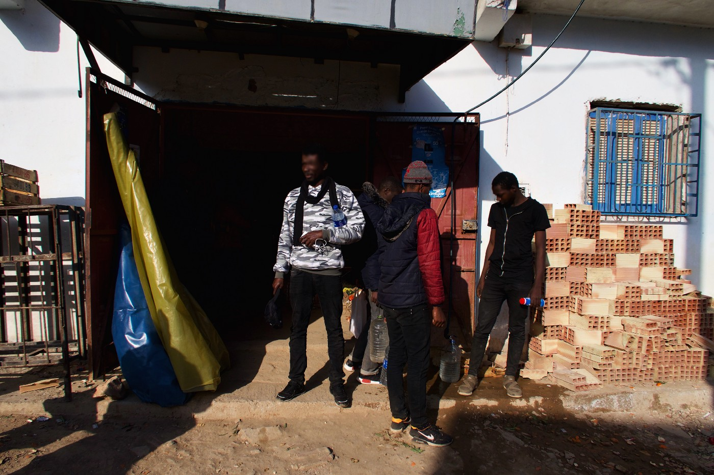
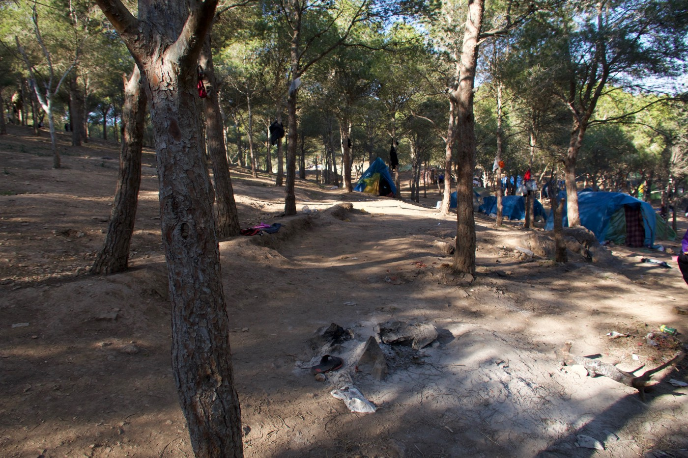
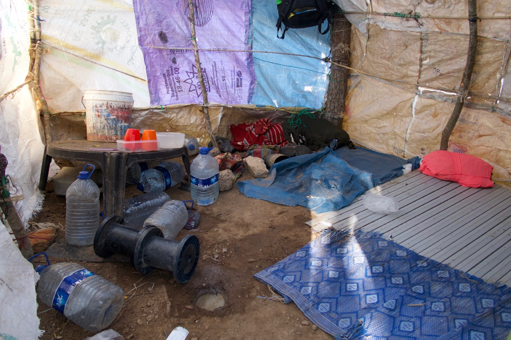
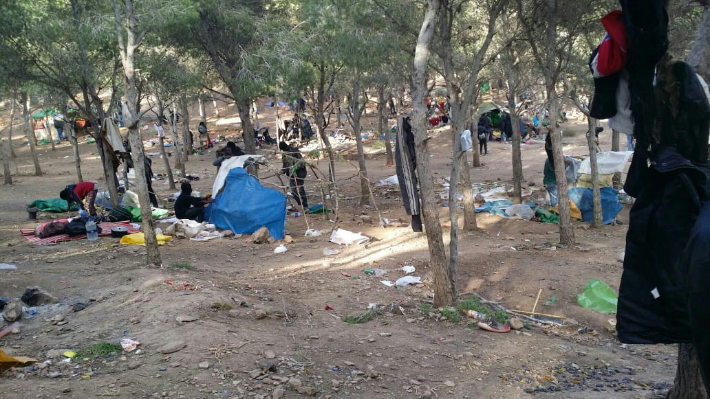
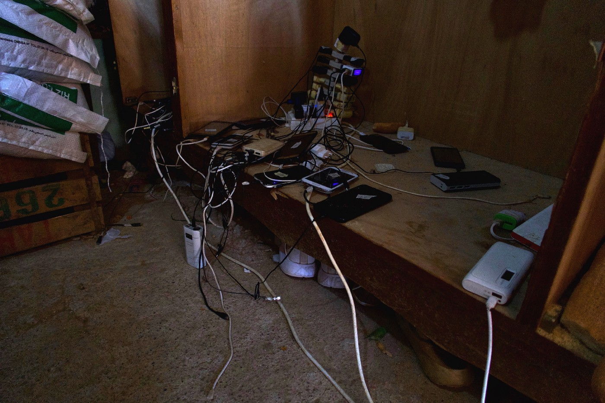

### **AYS SPECIAL FROM NADOR: “We know that what we do here is dangerous”**
#### **Abused, harassed and robbed — this is what everyday life is like for sub\-Saharan people on the move in Nador, Morocco\. Thousands of people are hiding in a forest, looking to cross the Mediterranean and reach Spain as a gateway to the European Union\. Meanwhile, parts of the local population, themselves living on the margins of society, are profiting from the situation\.**

Villages near the camps in the forest are profiting from the migrants who are stuck in the woods while waiting to continue their journey to the EU\. Meanwhile, police squads harass the people living here every morning\. Morocco and Libya, two countries where human rights are not respected, are the two biggest receivers of EU funding allocated for migration outside the block\. Photo: AYS

The bus from Nador stops in a small community on the outskirts\. This is the final destination\. Two men in a car are leaning out of the window, concerned about the fact that we are there\.

“ _It is dangerous around here\. What are you doing?_ ” they say, before driving away\.

Omar Nafi is the president of the [Association Marocaine des Droits Humains — Section Nador](https://www.facebook.com/AmdhNador/?ref=search&__tn__=%2Cd%2CP-R&eid=ARDLMR9it_ElksFCu3vVYViAPBteEnONyAG7Tq_8wHQyRzIA8HZeXSGHo-rkvvbV65QTF7bZxadA3rwE) \(AMDH Nador\) **,** Morocco’s biggest human rights organization\. According to him, the police has eyes everywhere\. Local people are reporting to them\. [AMDH Nador](http://Association Marocaine des Droits Humains - Section Nador) frequently updates their facebook page: human rights violations, illegal deportations, and police violence are among the most common news\.

Nador is a small town located 10 kilometers east of the Spanish enclave Melilla in Morocco\. The façades are painted in pale and faded colours, and the hotels are pretty much empty at this time of year\. Here, there are a lot of fast food restaurants, coffee shops with only men as customers, and young Moroccan boys living in the streets\.

But that is not something Momodou\* knows much about\. He lives in what its inhabitants call “the forest\.” “The forest” is located just up the hill from the bus stop\. It is the reason why the men in the car say it is unsafe\. This is a parallel universe as seen from the city\.

“ _We are our own doctors, lawyers, and everything…_ ” Momodou\* says\.

Momodou\*, 23 years old from the Gambia, speaks fluent English, as he used to work in tourism and perform his own music before he had to leave\.

According to Omar Nafi, president of AMDH Nador, it is neither easy nor desirable to draw attention to human rights violations in Morocco\. Working in “the forest” is almost impossible for both them and even more so for international organizations\.

“ _Amnesty was here, but they were told to leave \(…\) A Swiss church sometimes give food, but that’s it_ ”, Nafi explains\. _\(AYS have not gotten that confirmed by Amnesty\. \)_

In the village near “the forest” locals sell the bare necessities in small shops\. Some of the residents are working here, in return of free meals\. Photo: AYS
#### One nation

Momodou\* has been living in “the forest” for nine months now\. He says that it is impossible to enter without an invitation\. Jokingly he calls us spies, and photos have to be taken with consent\. A man of West\-African origin is the ‘big boss’ around here\. He came to Morocco more than a decade ago and started what Momodou\* calls a business: he helps people traveling\. The forest is what Momodou\* calls “one nation”; people look after each other, he says\. It is peaceful\. If someone starts a fight, he or she has to pay a fee of 100 euro to the community\. If someone does it twice, he or she cannot enter the next five boats leaving for Europe\. On the other hand, they are all basically trapped here anyhow, afraid of [detention and deportations](https://www.facebook.com/AmdhNador/videos/1482811721852526/) \.

“ _If we go into the town, the police will harass us, steal our money, detain and deport us,_ ” Momodou\* says\.

“The forest” is an isolated world: a small nation unknown to most people in Nador\. On the bus, Leemu\* kept his head down the whole way, looking down to the floor with his forehead resting on the seat in front of him\. A group of noisy teenage boys said something, calling him a bad name, before leaving\. They were pointing and laughing as they left the bus\. The racism is no secret\.

“ _It is impossible for people of Sub\-Saharan origin to be in the town\. The police catch them, detain and abuse people and deport them,_ ” Nafi repeats the same thing that Momodou\* told us\.

Nador is a small town on the Moroccan coast with a population of around 160,000 people\. No one of sub\-Saharan origin dares to go into the center, afraid the police might catch, detain or rob them\. Therefore, “we put out money everywhere you can imagine”, Momodou\* said\. Photo: AYS
#### Agreement with no impact

In 2018, sea arrivals in Spain through the so\-called Western Mediterranean route [increased by 163 percent compared](https://data2.unhcr.org/en/documents/download/67239) to the same period last year\. So far, nearly 55,000 people have arrived [according to the UNHCR](https://data2.unhcr.org/en/country/esp) , most of them coming through Morocco\. Just as in Europe, many had been walking for days\. Meanwhile, 687 people died or went missing\. The trend is shifting: in 2015, according to statistics from the UNHCR, more people arrived through the land border in Ceuta\.

Back then, Omar Nafi explains, it was cheaper\. Since then, the land border has become increasingly protected \(by Frontex, fences and border guards\) \. The number of Moroccan migrants reaching Spain [has grown eightfold in the past two years](https://www.moroccoworldnews.com/2018/12/260763/irregular-moroccan-migrants-spain/) , indicating that the country cannot even help its own citizens to decent conditions\. [According to the UNHCR](https://data2.unhcr.org/en/country/esp) , 21 percent of those arriving in Spain are Moroccans\.

“ _Migration over the sea costs money\. Both Morocco, Spain and the smugglers are benefitting from the situation,_ ” Nafi says\.

Last year, 212 people died along the same route\. At a UN meeting in Marrakesh on 10th December, leaders from across the world agreed on a [Global Compact for Migration](http://www.un.org/en/conf/migration/assets/pdf/GCM-Press-Release-12112018.pdf) \. The aim of the compact was to come up with a common approach to migration, integration and how to cooperate regarding the issue that divides the world: those for and against welcoming people fleeing war, poverty, and persecution\. The document, consisting of 23 points, which several countries, including EU\-member states such as Poland and Slovakia, withdrew from beforehand, is not binding\. This means that its impact could be basically none\.

Ahead of the meeting, [AMDH Nador reported about mass\-deportations](https://www.facebook.com/AmdhNador/videos/744214219291968/) from a center near Nador, Arekmane detention center\. Videos published on Facebook show the conditions inside the camp and people being handcuffed on buses heading to Casablanca International Airport\. Momodou\* knows about Arekmane\. It is one of the reasons why the people from Sub\-Sahara are hiding in the woods\.

“ _11 friends disappeared four months ago\. No one has heard from them since,_ ” he says\.

Now, as we pass by the the camp, it looks empty\. The military seem to be the only ones left on site\. According to Omar Nafi, AMDH Nador has filed a complaint about the violations toward sub\-Saharans in the region, but he does not believe it will change anything\. It is likely that it will be dismissed before it reaches the court\.

The view while entering one of the smallest forest camps outside Nador\. Photo: AYS
#### Life in “the forest”

The ground on the way from the main road, where the bus stops, is covered with dust\. In the small village, there are a couple of small shops with the most basic things for sale\. Locals in the village sell eggs, flour, coca\-cola, and coffee to those who cannot enter the town\. It is more expensive than for locals, Momodou\* says\.

It is big business nowadays — in the area, there are around 16 makeshift camps like the one Momodou\* lives in\. Tents in different sizes, campfires, and clean laundry hanging from the trees\. Momodou\* estimates that 60–70 people are using drugs, most commonly marijuana and hash\. Just to take their mind off things, and to calm down\. He misses his flute and guitar, which used to do the trick for him\.

The local people here are poor: benefitting from the people in “the forest” has become an important source of income, it seems\. In the village, there is a café with a billiard\-table and a tv showing sports\. Thousands and thousands of people live in the woods\. No one really knows the exact number\.

“ _They \(the local people in the village\) rent out rooms for 20 DH \(2 euro\) a night\. Sometimes when I have money I stay there\. It is like a five\-star hotel compared to my bunker,_ ” Momodou\* says with a quick smile\.

The bunker, as he phrases it, is his big tent\. There are eight people sleeping in it\. It is covered with plastic and a piece of fabric with a camouflage pattern\. Inside, the floor is muddy and there are a lot of big, empty water bottles\. Water is another thing they have to buy in the village\.

One of the ‘bunkers’ in the camp, where eight people sleep\. Photo: AYS

Almost every morning, according to Momodou\* and other people staying here, police squads arrive\. They destroy everything, “just to make us suffer,” as Momodou phrases it\. Every time, the people pack up all their belongings and hide further up in the mountains\. Most of the time they have advance warning since some locals are on their side\.

“ _If the Moroccan people in the village wanted to help, they would have helped us rebuild our bunkers\. But they don’t\. We have to buy the plastic and everything again and do it ourselves\._ ”

It is all about business\. One meter of plastic in the small local shop costs 10 DH \(1 euro\) \. After the squad has left, “Moroccan bad boys” arrive\. The local criminal gangs steal everything they can\. Some other locals, themselves living on the margins of Moroccan society, sell blankets, life\-jackets for 15 euros and some other items\.

_“We need them,”_ Momodou\* says, speaking about both the locals and the life jackets at the same time\.

People living in “the forest” trying to rebuild their camp after a police raid\. Photo: Private
#### Morocco = Libya

On 14th December, only days after the UN meeting, [the European Commission said in a press release](http://europa.eu/rapid/press-release_IP-18-6705_en.htm?fbclid=IwAR1O1vgCNArh2V6jlsUn3HG7jsUXo9E8UA7SZ6aDIAONj-67eeiI_fsPysU) that they would increase the funds \( [EU Emergency Trust Fund for Africa](https://ec.europa.eu/trustfundforafrica/region/north-africa_en) \) for Morocco to 148 million euro in 2018\. The money will be used for, as stated by the migration minister Dimitris Avramapoulos in the press release, _”strengthening border management and the fight against smugglers together but also to improve the protection of migrants and to help prevent irregular departures by supporting economic development in the region\. Shared challenges require joint solutions and partnerships, and the EU stands by Morocco\.”_

The problem, though, as identified by Omar Nafi, is that Morocco does not care about human rights\. For example, [AMDH Nador](https://www.facebook.com/AmdhNador/photos/a.1693125780899690/2240495329496063/?type=3&theater) was recently banned by the local authorities from organizing a meeting about human rights violations in the region\. With over 21 percent of the nearly 55,000 people who arrived in Spain by late December 2018 being Moroccans, the country can hardly look after its own citizens, let alone sub\-Saharans\. At the same time, Morocco wants to curb the flows reaching the EU, since that is the aim of the funds\. [DW noted](https://www.dw.com/en/morocco-a-risky-migration-partner-for-the-eu/a-44898635) that Morocco could be a risky collaboration partner\.

The result is solutions such as [Arekmane detention camp\.](https://www.facebook.com/AmdhNador/videos/2234788753469910/)

](assets/d16c0f587957/1*ywsmiR-8ocdd_sMS8j8VVA.jpeg)

Arekmane detention camp outside Nador\. Photo: [Association Marocaine des Droits Humains — Section Nador](https://www.facebook.com/AmdhNador/?__tn__=kC-R&eid=ARDKvsP9yimUQ9QQ-FSMJudDF9cWZwnz5TonccrPvibOKYAjk2gp5vHRb7_DD9-2-_LMzqofcTXs_05s&hc_ref=ARQils5l_XmvTpbsPMOzrKt74jaX73q3q2Rdb008UWlblgwpCwFUL24qajlPAp52JiI&fref=nf&__xts__%5B0%5D=68.ARDYUl0h0GwtKkZOp4CHdPj2MKdl81MKK8cuwGpLnOpDyBY7tS1QsyfpNKTZxbLqva0xDc6E-4v_iMZws8uqfBkkmteTJkYt8R5EWQu23X6Qt8riHTG1gftM9n8jEasfy5j9eVKb9VybOVh_vrVWM9nFAd7u1Y_8ke_LD67DqxgCfbbj6948OtSkj94TohjagBI_tRskeRkzScUqQLQJJ8QXuTuFxqi41GSO5z4m2PEBUf2Jof3mPI8O6YfJDUPMhGsxraZFGltW_5G98qnBsUI9nHa7kS3ViIBHxHXgJvWLLZjgQqW5ldfxD2rHaCT_mkG3CIo1wT7pE_HPqKIDYioyNRzVg9TEnxtrFaX-)

“ _The big problem is that the EU gives money to Morocco\. They give money, and Morocco does what they want with it\. This includes abuse, detention camps, and deportations\. There is no one controlling what the authorities do,_ ” Omar Nafi says\.

The situation is becoming similar to the one in Libya, where no one really knows what is going on in the detention camps\. In Libya, the system is not working: militias, as well as the corrupt government, are violating human rights and the reports about abuse and ill\-treatment are many and well known\. Despite this, Morocco and Libya are the two biggest receivers of EU funds outside the union\.

According to the European Commission, the need for financial aid and cooperation with Morocco has increased in 2018\. In “the forest” though, life remains the same\. During his nine months here, Momodou\* has learned the procedures\. He has also learned that life here is hard\.

_“We know that what we do here is dangerous \(…\) But life is always risky,”_ he says\.

His sister died at sea when she was six months pregnant\. Her husband is now in France\. And he is still here, climbing up the hills every morning in order to avoid being robbed or abused\. They put their money everywhere we can imagine, Momodou\* explains\. On top of that, his Gambian passport went missing after one of the early morning raids\. He recalls leaving it in a pair of fairly good jeans\.

The road to the EU, or rather the water, is an expensive story\. The “normal” fare is 2,000 euro, and then up to 65 people can be packed into one boat\. Then there is the VIP\-ticket: 3,000 euro and then fewer people are in the boat, which can also leave sooner\. That means less waiting in “the forest”\. Before the boat, the smugglers put them in cars where they, according to Momodou\*, are packed in more tightly than sardines in a tin\. Every time someone makes it safely to the other side, the community in “the forest” are given a sheep to sacrifice by the ‘big boss’ of the camp\.

Inside the shop, the entrance to which is pictured in another photo above, people can charge their phones\. Photo: AYS

Momodou\* is busy on the phone while he is walking on the dusty road, trying to arrange something that sounds complicated\. Just like almost everybody here, he came to Nador to travel\. His money is long gone\. He wants to go to France, Sweden, or anywhere else where life can start again\. The most important thing is to be able to work and play music again\.

_“I am not here to earn money, as some people are, but if I can help someone and it will make me travel — then I will do it\.”_

Mamadou\* unsuccessfully tried crossing from Tangier twice and the next time he will go from Nador\. There are three main exit points from where the boat leaves, but nearly 20 potential locations in total\. The smugglers regularly visit “the forest”\. Some more or less live there\. What is secret everywhere else in society is obvious here, as there is no need to hide anything\. No one sees it, anyway\.

On our way back to the bus Momodou\* points towards a car without a valid license plate\. That’s a smuggler\.

_“He never takes the main road into Nador,”_ Momodou\* says, waving towards the car\.

**_Note: For their personal safety, Momodou\* and Leemu\* are not their real names\._**

**_\(By Hanna Strid, AYS Info Team\)_**

**We strive to echo correct news from the ground through collaboration and fairness\.**

**Every effort has been made to credit organizations and individuals with regard to the supply of information, video, and photo material \(in cases where the source wanted to be accredited\) \. Please notify us regarding corrections\.**

**If there’s anything you want to share or comment, contact us through Facebook or write to: areyousyrious@gmail\.com**

_Converted [Medium Post](https://medium.com/are-you-syrious/ays-special-from-nador-we-know-that-what-we-do-here-is-dangerous-d16c0f587957) by [ZMediumToMarkdown](https://github.com/ZhgChgLi/ZMediumToMarkdown)._
