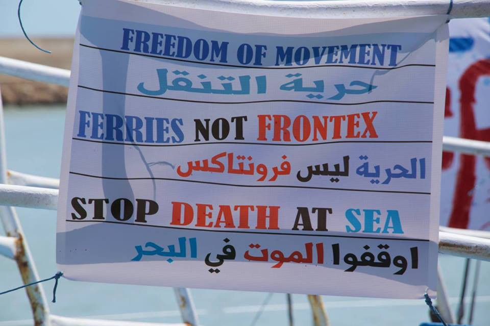
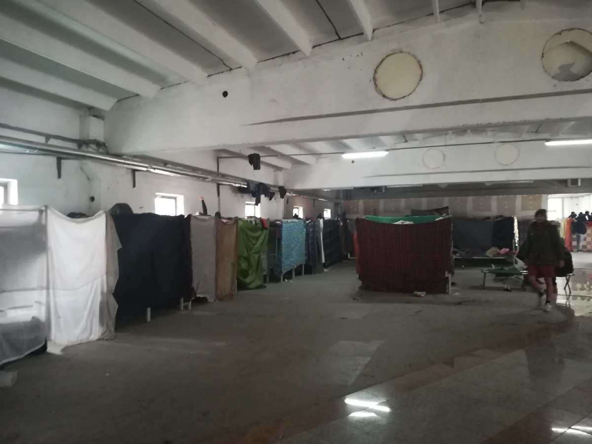

### سنة أخرى مميتة للاجئين والمهاجرين الذين يحاولون الوصول إلى أوروبا
#### 30\- \-24 AYS Weekly News Summary in Arabic, December

خمسة بلدان: رفضت إيطاليا ومالطا وأسبانيا وألمانيا وهولندا السماح للسفينة بالنزول في أراضيها ، مما دفع فيليب هان ، رئيس البعثة ، إلى دعوة ألمانيا وأوروبا للاضطلاع بمسؤولياتهما و “إظهار وعلى وجه التحديد ، تقوم المنظمة غير الحكومية بالضغط على وزير الداخلية ، هورست سيهوفر ، من أجل “استخدام” القسم ٢٣ من لائحة قانون الإقامة لتقديم جميع الذين يفرون من ليبيا تصريحًا آمنًا للإقامة ، بما يتوافق مع كرامة الإنسان والمفترض على نطاق واسع قبلت القيم الأوروبية\.
### **ليبيا**

الناس المتنقلون يجرون رحلاتهم إلى أوروبا لوصفهم بشكل أكثر وضوحًا\.

المصدر الأصلي:

■■■■■■■■■■■■■■ 
> **[Sally Hayden](https://twitter.com/sallyhayd) @ Twitter Says:** 

> > A young refugee in Libya asked could he draw &amp; send me illustrations to explain the journey tens of thousands of Eritreans make, between escaping the dictatorship in their home country &amp; trying to cross the Mediterranean Sea to Europe. I'll share them in this thread. 

> **Tweeted at [2018-12-26 19:43:24](https://twitter.com/sallyhayd/status/1078013428265115649).** 

■■■■■■■■■■■■■■ 

### **البحر**

ووفقاً لمنظمة الهجرة الدولية ، فقد توفي ٢٤٢٢ شخصاً أثناء محاولتهم عبور البحر المتوسط في عام ٢٠١٨، معظمهم فروا من ليبيا ومنطقة شمال أفريقيا\. أكثر من ٧٠٠منهم فقدوا حياتهم أثناء محاولتهم الوصول إلى إسبانيا ، ١٥منهم في الأسبوع الماضي \(بما في ذلك طفلين\) ؛ ١٢شخصا ما زالوا في عداد المفقودين ، وفقا ل \(واتج ذا ميد\) — إنذار الهاتف ، كما أفادت أمس في خلاصة لدينا\.

تعمل \- \(عين البحر\)و\(رقابه البحر\) في منطقة البحر الأبيض المتوسط الوسطى ، من أجل إنقاذ ٧٢ شخصًا يعانون من الشدة في البحر\. وفي هذا الصباح ، أبلغ مركز تنسيق الإنقاذ البحري في روما عن الحاجة إلى مساعدة خفر السواحل الليبي ، ومنذ ذلك الحين ، لم ترد أي معلومات إضافية حول كيفية تطور عمليات الإنقاذ\.
### **البوسنة والهرسك**
#### تواصل الشرطة نقل الأشخاص خارج إقليم بيهاتش

وذكر الصليب الأحمر في كليخوك أن الشرطة البوسنية تواصل وقف الناس في طريقهم من سراييفو إلى بيهاتش\. يتم ترك الناس على الطريق في بعض الأحيان لأكثر من ٢٤ساعة\. يساعد السكان المحليون والصليب الأحمر المحلي\. يوم الأحد ، تم العثور على ٩ أشخاص في فيليتسيفو حيث تركتهم الشرطة\. في المجموعة كان هناك قاصران وجرح البعض\. وفي المساء ، بعد أن عثرت المنظمة الدولية للهجرة والسلطات البوسنية على اتفاق ، تم نقل المجموعة بأكملها إلى بيهاتش إلى المركز الذي أنشئ حديثا في بيرا\.

نقص شديد في التدفئة في مخيم ووسيفاك

خلال عطلة نهاية الأسبوع ، [سلمت المنظمه \(ايد](ays-daily-digest-26-12-2018-humiliating-living-conditions-in-iom-run-centre-in-bosnia-174c30250862) \) ملابس الشتاء في مخيم ووسيفاك، بالقرب من سراييفو\.

Photo by Zarka Radoja, Miral
### **كرواتيا**

في الساعة ٦ صباح يوم عيد الميلاد ، على طريق جبلي ضيق في منطقة فرغوراك ، أوقفت الشرطة سيارة مليئة بالمهاجرين\. كان السائق في السادسة والعشرين من عمره ، وهو من أصل أصلي من سربرينيتشا \(البوسنة\) ، ولكنه يحمل الجنسية السلوفينية\.

عندما لاحظ السائق كمين الشرطة كان يبطئ من دون توقف وقفز من الشاحنة\. بدأ بالفرار ، وبحسب معلومات غير رسمية ، تحطمت السيارة في سيارة الشرطة\.

داخل السيارة كان هناك ٣٩ شخصًا من العراق وإيران ، بما في ذلك العديد من النساء ، وبعضهن حامل ، وأطفال\. لحسن الحظ ، نجا الجميع ، لكن السيارات تضررت\. تم القبض على السائق\.

تم إعطاء بعض المهاجرين الإسعافات الأولية في جناح الطوارئ في فرغوراك ، وفيما بعد امرأة في الأسبوع الرابع عشر من الحمل وتم نقل طفل يبلغ من العمر ثماني سنوات يعاني من الالتهاب الرئوي بواسطة سيارة إسعاف إلى المستشفى في سبليت\.

أصيب السائق أثناء فراره فوق التضاريس الصخرية\. وانتهى به المطاف في جناح الطوارئ مع جروح في ساقيه وذراع مكسورة
### **إيطاليا**

توفي شاب أفغاني في أنكونا\. وقد سحقته الشاحنة التي كان يتدلى منها ، محاولا النزول في الميناء\. [التحقيقات جارية\.](https://www.corriereadriatico.it/ancona/ancona_si_aggrappa_a_un_tir_per_sbarcare_giovane_afgano_resta_schiacciato_e_muore-4193274.html؟fbclid=IwAR3bz7K4Q23TpUBdwpaHHefVv57ZhCNMoN1RzmTNRaDGXE8aX-xqbyUHx18)

خرجت الجالية السودانية في روما إلى الشوارع مباشرة تحت السفارة السودانية للتعبير عن تضامنها مع الناس الذين يحتجون في بلدهم ، ضد القمع المسلح العنيف تجاه المتظاهرين وللتوعية بالوضع في السودان ، فقد ٣٥ شخصًا حياتهم أثناء الاحتجاج من بينهم ١٥طفلاً
### **فرنسا**

فرص التمويل للاجئين أو مجموعات المعونة للمشاريع المتعلقة بالمشاريع متاحة هنا

### **المملكة المتحدة**

تم العثور على حوالي ٢٣ شخصًا \(بينهم ثلاثة أطفال\) من إيران في ثلاثة مواقع مختلفة في كينت ، جنوب شرق إنجلترا يوم الخميس ، بعد الإبحار من شمال فرنسا في قارب قابل للنفخ ، في حين تم اعتراض ١١ آخرين من قبل السلطات الفرنسية ، في محاولة لعبور القناة بالقرب من سان كيتا\.

تلقى جميعهم المساعدة الطبية ، ولكن تم إرسالهم على الفور إلى مسؤولي الهجرة لإجراء مقابلات معهم ، في حين يتم رعاية الأطفال الثلاثة من قبل الخدمات الاجتماعية\.

_Converted [Medium Post](https://medium.com/are-you-syrious/%D8%B3%D9%86%D8%A9-%D8%A3%D8%AE%D8%B1%D9%89-%D9%85%D9%85%D9%8A%D8%AA%D8%A9-%D9%84%D9%84%D8%A7%D8%AC%D8%A6%D9%8A%D9%86-%D9%88%D8%A7%D9%84%D9%85%D9%87%D8%A7%D8%AC%D8%B1%D9%8A%D9%86-%D8%A7%D9%84%D8%B0%D9%8A%D9%86-%D9%8A%D8%AD%D8%A7%D9%88%D9%84%D9%88%D9%86-%D8%A7%D9%84%D9%88%D8%B5%D9%88%D9%84-%D8%A5%D9%84%D9%89-%D8%A3%D9%88%D8%B1%D9%88%D8%A8%D8%A7-d95219fa6ed1) by [ZMediumToMarkdown](https://github.com/ZhgChgLi/ZMediumToMarkdown)._
