### AYS SPECIAL: When governments turn against volunteers — the case of AYS
#### During 2018, we’ve witnessed unprecedented backlash against human rights defenders who’ve been advocating legal access to asylum system in the EU\. Volunteers and NGOs have been threatened, attacked and legally persecuted for crimes they didn’t commit\. AYS is one of them\. For the first time we’re publicly disclosing our own case to paint the full picture of the events on Europe’s largest terrestrial border\.

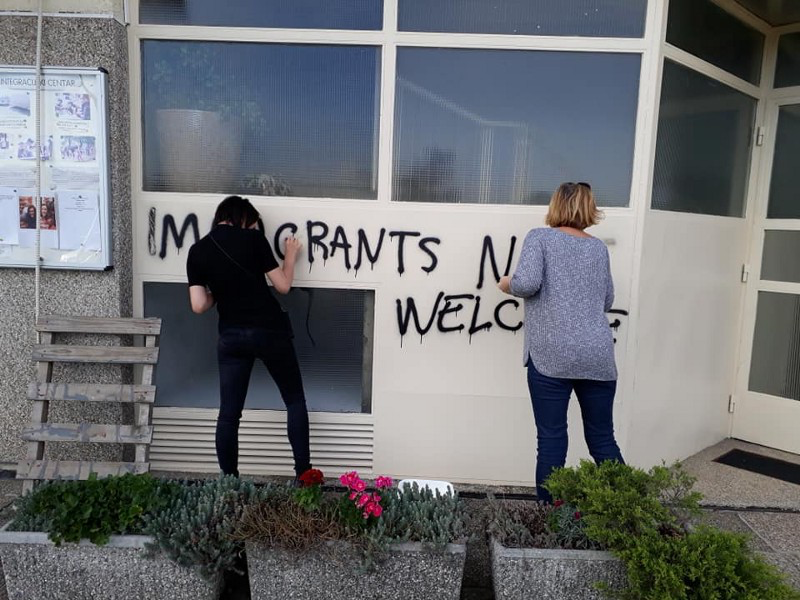

Volunteers removing anti\-refugee graffiti from our building in Zagreb, Croatia\. Photo: AYS

Looking back at the rapid change of European attitudes towards refugees and migrants and the radical turn of most member states to the right\-populist political spectrum, it was just a matter of time before human rights defenders became targets, just like the ones they were trying to defend\.

> “Fishermen who rescue refugees from the sea can be charged with aiding illegal immigration\. Volunteers who cook in public spaces can be charged for not having secured public health permits\. Volunteer doctors can be charged with working in Greece without having their licenses to be reviewed and approved by the national government\. Volunteers who pitch tents in public spaces can be charged with violating laws forbidding camping in public spaces\. Volunteers who help to change the wet clothes of shivering children might be charged with molesting them\. Photographers could be charged with violating military space on the coastlines\. Those who donate food, clothing, and other supplies could be charged for not providing receipts\. And finally, volunteers choosing to work in small groups without large donor bases, high overhead, bank accounts, and tax numbers can be prohibited from offering to help\.” _So [wrote](https://www.greeneuropeanjournal.eu/criminalising-solidarity-when-helping-refugees-becomes-a-risk/) Karolina Krist and Michael Bakas, describing the situation on Greek islands in 2016 — and precisely predicting what would soon happen throughout Europe\._ 

Last year brought some of the most shameful examples of backlash against volunteers and NGOs in modern history\. Sometimes, governmental pressure even lead to further endangerment of people’s lives\. Obstruction of the sea rescue missions in [Italy](ays-daily-digest-24-06-18-stranded-on-the-lifeline-50e63bf240de) , [Malta](ays-daily-digest-23-08-18-protesting-the-death-of-human-rights-in-malta-b24fbe05c5bc) and [Greece](https://medium.com/are-you-syrious/ays-daily-digest-28-08-18-30-volunteers-in-greece-accused-of-conspiring-in-human-trafficking-5c0f19998b03?fbclid=IwAR2_NwXYvfeiir3LZh89zf6n3WENnPIpFw9gUEfdHk076oWPtofR9pMsi28) has been covered extensively, both in our daily updates and in various mainstream media outlets\. But 2018 also brought a ray of hope: three Spanish firefighters and two volunteers from Denmark who rescued refugees off the coast of Greece in 2016 were cleared of wrongdoing on May, after two years of humiliating struggle to prove that rescue missions cannot be considered human trafficking\.

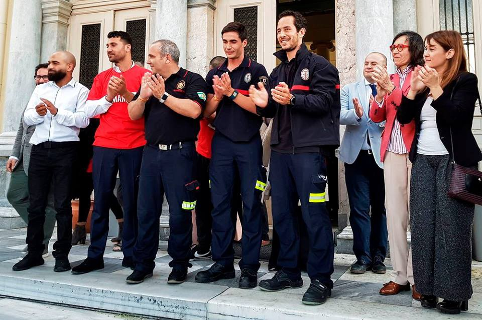

Firefighters and volunteers walk free after two years of humiliating struggle\. Photo: Proem Aid

Meanwhile, criminalisation of solidarity was proven to be a much wider phenomenon than several high\-profile cases\. It is happening across the European Union and is often unreported\. Those who are still present in the field are facing the backlash on an almost daily basis\.

> “Loan Torondel, a young volunteer of the association “L’auberge des migrants”, was found guilty of defamation and later on sentenced to a 1500 euros suspension fine in September 2018 by the tribunal of Boulogne\-sur\-Mer in France; because of a tweet, published in January, with a picture of policemen in Calais, suggesting that they were about to take the blankets away from migrants\. This event may seem extreme, ridiculous or tragic but sadly it has become the norm for migrant helpers in France,” _wrote Aude de Coustin in her paper [Criminalisation of Solidarity in France: A General Overview](https://www.borderline-europe.de/sites/default/files/readingtips/Criminalisation%20of%20Solidarity%20in%20France.pdf) \._ 

While most of the eyes were pointed towards the sea, criminalisation became a growing problem on Europe’s terrestrial frontiers\. It is especially felt in Croatia, where AYS has been directly targeted and even brought to court by the Ministry of the Interior, which requested banning our work in Croatia\. We’ve decided to publish the overview of our case for the first time, to paint the full picture about the events at Europe’s longest terrestrial border\.

**While focusing on our story as the example of criminalisation of solidarity, we’re painfully aware that our case is not isolated and that many other groups are facing similar struggles\.**
### How it started in Croatia: the case of little Madina

AYS has been active in the Balkans since the summer of 2015, when we gathered as a group of independent volunteers\. We’ve been active in most European and Balkan fields, with a main focus on Croatia and the surrounding countries\.

In the morning hours of November 22, 2017, we were contacted by our colleagues at the Serbian side of the border, who informed us about the death of little Madina, a 6 year old girl from Afghanistan who was illegally pushed back to Serbia along with her family\.

A 6\-year old girl who died minutes after the push\-back from Croatia\. Photo: family archive

Like so many times before, Croatian policemen forced the group to follow train tracks towards the Serbian town of Šid\. Little Madina never made it\. She was killed by a train only 200 meters away from European soil, where her family’s request for asylum was brutally denied by Croatian border police officers\.

AYS was the first group to inform the public about the tragedy\. Faced with the criminal charges that was opened on behalf of Madina’s family with the help of AYS and Center for Peace Studies, the Ministry of the Interior responded brutally\. Instead of providing answers, they decided to attack NGOs that were raising questions about the criminal treatment of refugees at our borders\.

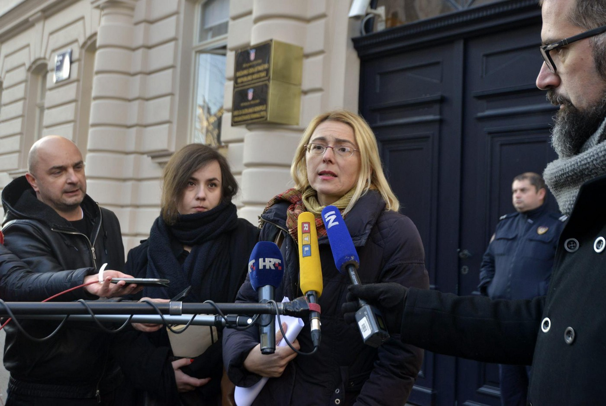

Representatives of CPS, AYS and their lawyer in front of the State’s Attorney Office of the Republic of Croatia after opening a criminal case for the manslaughter of little Madina\. Photo: AYS archive
### Volunteers portrayed as smugglers in Parliament

Following our public advocacy about push\-backs and little Madina’s case, a Member of the Croatian parliament Pedja Grbin asked for the government’s clarification of the events described in our reports\. In a letter that was sent to all Members of Parliament on March 22nd 2018, Croatian Minister of Interior Davor Božinović unfoundedly claimed that our volunteers were _“handing out their telephone numbers, instructions, money and directions on how to enter Croatia”_ to people who were located in Serbia, which can be seen as encouraging and helping them to illegally cross the border\. His letter was shared by almost all mainstream media in Croatia\.

Of course, these accusations were completely false and we only could interpret them as an attempt to create negative perception among potential allies but also among the broader public, by equating our work on human rights protection with criminal acts\. Instructions and directions on how to enter Croatia or money have never been distributed by our volunteers, and we strongly reject these allegations\.

As regards the accusation that we have provided refugees with our contacts, which is anyhow publicly available, it points to a strange expectation from the side of Ministry that people should be left in complete ignorance about how they can exercise their human rights\. This is in contradiction with the idea of human right protection, since informing people about their rights represents the first step in the realisation of those rights\.

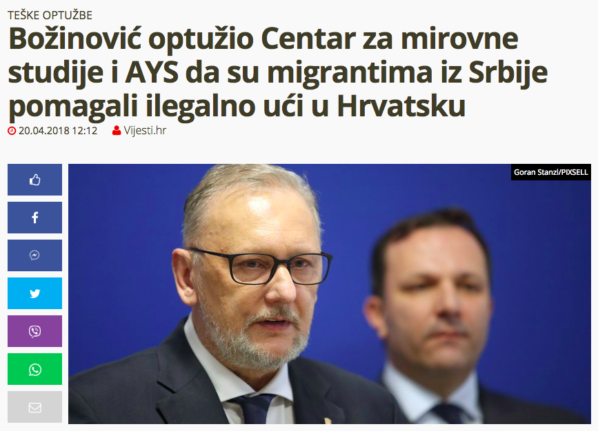

Minister of Interior accusing AYS of facilitating illegal border crossing in the Croatian Parliament became national news of the day, severely harming our reputation\. Photo: screenshot

In this context we must point out that we were never formally accused of committing any criminal act, so these accusations are in fact acts of public defamation that only tend to criminalize solidarity, discourage volunteers from legally supporting asylum seekers, and deny human rights to people who are refugees, which is completely opposed to international and regional human rights standards\. However, at the beginning of April, the Ministry raised a misdemeanour charge against our volunteer Dragan Umičević\.
### Ministry asks for AYS ban, prison for the volunteer who supported little Madina’s family

Our volunteer was charged for committing a misdemeanour act defined by Article 43 of the Foreigners Act, which prohibits providing assistance to a third country national\. The charges stated that he has helped third country nationals in illegally crossing the Croatian\-Serbian border\.

> The penalty that was requested by the Ministry was threefold: maximum jail time and a fine amounting to 43\.000 euro for the volunteer, and prohibition of conducting specific work or business to a legal entity\. This last proposal was, presumably, intended to prohibit the further work of AYS, but it was not taken into consideration by the court since it was legally misplaced, being proposed in a proceeding against a natural person\. The third country nationals that were mentioned in the charges were none other than the family of little Madina\. 

So this is what really happened that night\.

On 8th of March 2018, we were contacted by little Madina’s brother through our public Facebook profile\. He said they were in Croatian territory and they wanted to ask for asylum, but they were understandably afraid of the police\. They were in a group of 36 people, most of them children and minors\. Like many times before, we had to explain that the only legal way for them to stay in Croatia is to approach the first police officer in the field and to formally express their asylum request\. We immediately contacted the police ourselves, telling them about little Madina’s family presence in the country and their wish to ask for asylum\. Despite this, they ended up being threatened and pushed back in the same way that got their little sister killed only three months earlier\.

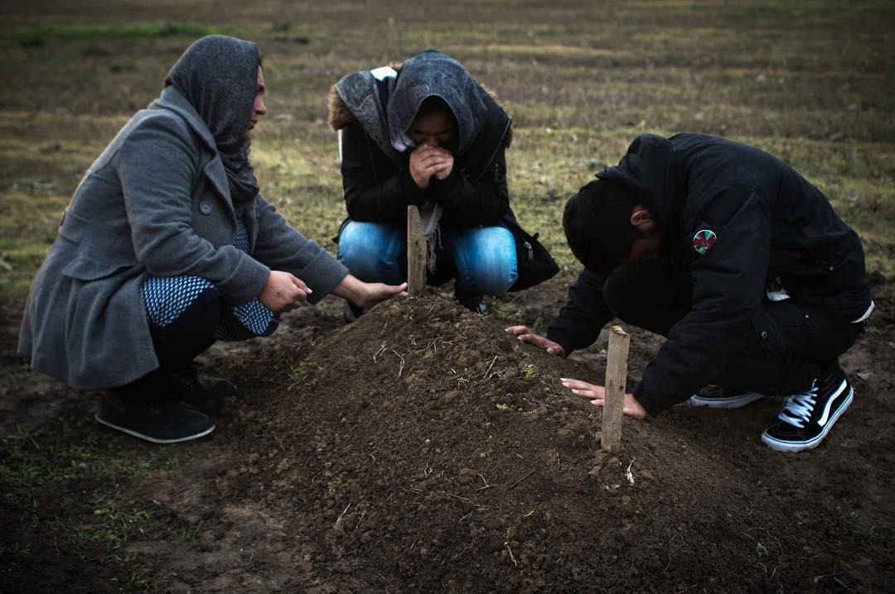

Madina’s family mourning at her grave in Šid, Serbia\. She was killed minutes after she was pushed back from Croatia together with her mother and five brothers and sisters\. Photo: Lazara Marinković

The next time they contacted us was in the night of 20th/21st of March 2018\. This time it was Madina’s sister who said that the family of 14, 11 of them being children and minors, was again in Croatia\. They confirmed their presence in Croatia by sending us their geolocations — a procedure developed to ensure that we weren’t talking to anyone who was attempting to illegally cross the border in order to avoid any possible misinterpretation of the nature of our work\. This time, one of our volunteers was an hour away from the spot where they entered Croatia and we asked him to be present when they met the police since they were frightened that they would be pushed back again\. His instructions were simple: to approach the nearest police checkpoint in the field and to inform the officers on duty about the presence of the family and their wish to ask for asylum\. He never had any direct contact with Madina’s family prior or after their arrival to Croatia\. All correspondence was done from our HQ in Zagreb, and Dragan went to the field only to monitor the family’s access to the asylum system after they approached the police\.

> Madina’s family was immediately put to detention and held there without access to legal assistance for months\. According to their own statements, they were forced to sign documents they didn’t understand — one of them being an incriminatory statement against AYS\. European Court of Human Rights issued two interim measures, ordering Croatian state to release them from detention and to allow their elected lawyer to visit them\. They never got the chance to be granted international protection in Croatia\. In the end, they’ve absconded\. 

Crucial evidence in the aforementioned proceeding against our volunteer on the side of the Ministry were statements given by three officers of the border police who monitored the Croatian\-Serbian border at the time our volunteer came to the village and to whom he initially turned for support in reaching out to the family that already was on the Croatian territory\. Additional evidence against the volunteer was the statement taken from a minor member of the refugee family the night they entered Croatia, without the presence of a lawyer/legal guardian and in a language she does not speak\. This evidence was, of course, dismissed by the court\.

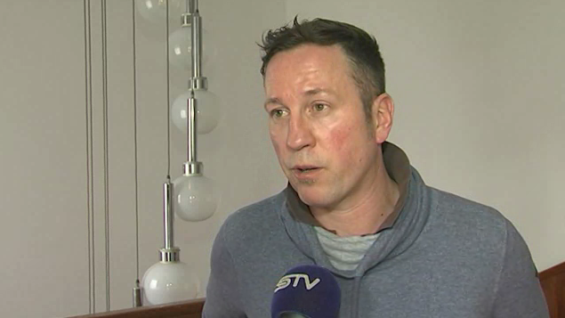

Persecuted for a crime he didn’t commit: AYS volunteer Dragan Umičević\. Photo: AYS archive

Taking into consideration that our volunteer came to support the family only after they had confirmed their position on Croatian territory, and that we had firm written evidence to prove that, we were confident that Dragan would be cleared of all charges\.

> In the court it was undoubtedly proved that the family was already in Croatia when they’ve contacted us\. The verdict also clearly states that Dragan had no direct contact with the family and no intention to facilitate illegal activity\. However, in September the court found our volunteer guilty based on “unconscious negligence”, saying that he should have assumed that the family maybe wasn’t in Croatia\. Despite the proven fact that they were on Croatian soil\. 

Dragan was charged with a fine in the amount of 8000 euro\. We have filed a complaint to the High Misdemeanour Court in relation to this decision and the process is ongoing\.

> Although national media did not report on this court proceeding at all, only few hours after the judgment was announced, it appeared on a state news portal, pointing that the MoI had informed government\-paid journalist of this judgment\. However, the news did not mention that the foreigners to whom our volunteer has allegedly provided assistance were family of Madina Hussiny, consisting of 11 minors\. Also, it did not quote the verdict itself, but instead it quoted charges that were largely dismissed by the court\. 

This is how the Ministry not only harmed the reputation of the AYS, but has sent a strong message to Croatian public that providing help to migrants and refugees will be punished\. Since then, the Ministry has been continuously misquoting the verdict in order to make false impression that our volunteer has actually assisted the illegal border crossing in a way which was proven to be untrue\.
### Defamation campaign triggers outbursts of violence against AYS

Public defamation of our NGO has led to several anonymous attacks to our premises in Zagreb, Croatia\. Our van was smashed with concrete blocks, windows of our integration center were shattered, and insulting graffiti was sprayed all over our building and the van\. All of the above incidents were reported to the police, but no one was ever found guilty for the attacks\.

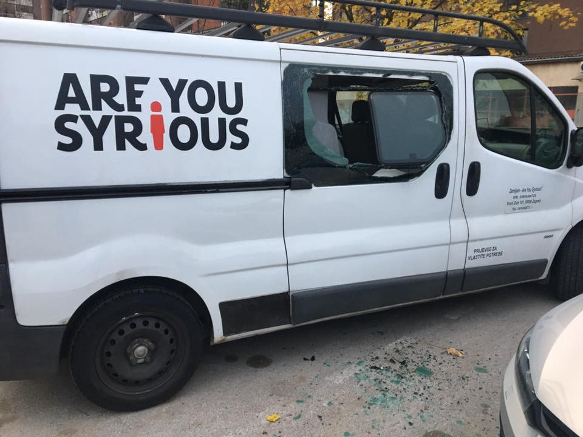

Our property is usually targeted during the night and perpetrators are never seen or found, despite heavy police presence in front of our offices\. Photo: AYS

Among many threats we’ve received, most disturbing was a direct death threat in the street from a war veteran and civil servant who has been harassing AYS employees and volunteers for months\. This incident was reported to the police, and the State Attorney then issued a restraining order whereby the man in question is forbidden to approach our employees, to a distance of 50 meters\.

> We have also been threatened online by various individuals that quote misinformation published by the Ministry as the justification to attack us\. Among others, we’ve reported a death threat sent to our NGO by a person who seems to be working for the Ministry — or at least this is stated on his public Facebook profile from which he sent the threats\. 

Following these incidents, AYS employees were advised by the police to buy pepper spray and to always carry it with them\. One of them was also advised to always follow her child to and from the school\. Due to this, AYS shortened working hours and has introduced a rule that nobody stays alone in the office after dark\.

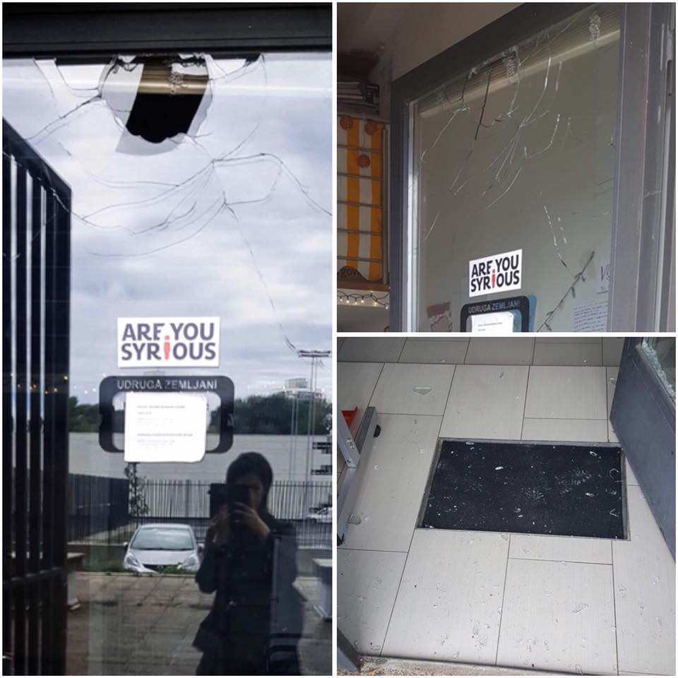

AYS offices smashed with bricks — again, no perpetrators have been identified\. Photo: AYS

During periods of increased arrivals of asylum seekers from Bosnia and Herzegovina, who wanted to seek international protection in Croatia but were too afraid to go alone to the police stations due to their experiences of push\-backs, we noted an increased police presence in front of our office and Integration center\. This refers to a two\-week period in May 2018 and to a second period during October and November of 2018\. The AYS office and center provides social support, information and humanitarian aid \(free clothes and hygiene items\) to asylum seekers and asylees\. During these periods, our users were stopped and registered \(their IDs were taken\) by the police without any explanation\. This whole process smacks of racial profiling, since for example the donors were not registered\. This frightened many of our users, who stopped using our services, and brought distrust to our neighbours, who noticed the presence of uniformed police officers and vehicles\.

> Sometimes the police officers would be present in front of our offices the entire day, and sometimes at certain hours\. Sometimes they would come in uniform / police cars and sometimes in civilian clothes / regular cars and stand very close to our office\. At one occasion in October, one police officer entered our Integration center without explanation and without presenting himself and rudely asked a building user, a refugee, to identify himself\. On another occasion, police officers entered our offices with no introduction whatsoever and asked for our IDs, but refused to explain why they were there or whether anyone had done anything wrong\. 

Although we assume that their presence had also to do with the attacks on our office, based on the general atmosphere and the attitude of police officers who were present in front of our premises, we are convinced that it was also a form of surveillance and intimidation\.
### AYS volunteers threatened in police stations

In addition to the public defamation that we are currently exposed to, our volunteers have been encountering police pressure for a long time now\. Over and over, they have been detained for several hours in police stations without any formal charges being brought against them, questioned in an inhumane and degrading way, yelled at and intimidated — for example, police often state that they are familiar with our volunteers’ whereabouts during their private hours\. The following examples are illustrative of the pressures that we have experienced recently\.

> In mid\-February this year we were contacted by a large group of refugees \(consisting also of children and one pregnant woman\) who informed us that they were on Croatian territory and wished to seek international protection, but also that they were in need of medical assistance\. We informed the competent police station in the county located on Croatian\-Serbian border and our volunteer also came to the field in order to be present when the asylum seekers meet police officers\. However, when he approached the officers present on the field and identified himself, he was taken to a police station where he waited for 4 hours to be interviewed by a crime unit inspector\. His cell phone was taken away from him for several hours, leaving him unable to contact anyone, and he was guarded by a police officer the entire time\. During the interrogation, the inspector who questioned him was suggesting that NGOs who assist refugees do so out of self\-interest\. The inspector also insisted that AYS should not speak out about pushbacks on Croatian borders and used humiliating language to describe our organization\. He repeatedly warned our volunteer against cooperating with us\. The volunteer was released without any charges brought against him, but the whole process lasted 6 hours\. 

### Volunteers detained for hours without explanation

Another volunteer who came to a police station in the Croatian capital to be present when a refugee was submitting a request for international protection was then held in this police station for 8 hours \(from 16h to midnight\) \. During that period no formal accusation were brought against her but she was threatened that there would be criminal charges, which never materialized\.

Without having examined the refugee’s claims and considering his request for asylum, the inspectors repeatedly insinuated that there was some sort previous connection between the volunteer and the Pashtu\-speaking refugee, whom we had previously never heard from\. They openly stated: “This has criminal elements, beware, don’t move anywhere, we will question you again,” and repeated this three more times, aggressively and with no proper information on the geographical position of the place of origin \(thus the reason for the asylum request\) of the refugee, to whom the officer spoke in Croatian\.

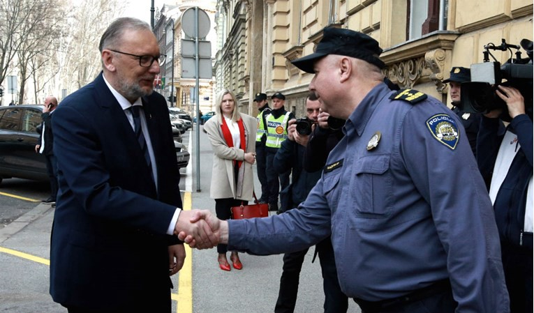

The Minister of The Interior in front of the police station where our volunteer had been held for 8 hours\.

Later on, the volunteer was questioned also by other inspectors \(presumably belonging to the Intelligence Service or the Ministry’s Criminal Sector\), but was not told clearly what law she broke or which moves were made for the questioning to lead in the direction of an accusation\. The approach and communication of the inspector who was in charge of the case was far from appropriate, and warnings were given several times with the intention of discouraging further volunteering activities and helping those who needed assistance in accompanying them to the police \(considering that all those who had not come accompanied by someone were expelled from the country, with no documentation of the case\) \. No police report or other documentation was given to the volunteer after her questioning\. She was denied information on what would happen to the asylum seeker, and around midnight, she was escorted from the precinct so as not to wait for the result of the investigation\.
### Attempt to stop our press conference by calling people in for questioning

In April this year, together with the Center for Peace Studies \(CPS\) and our lawyers, we announced a press conference in order to speak out about the pressure from the Ministry\. However, at the exact time when the press conference was scheduled, the Ministry invited our employees \(who were announced to speak at the conference\) in for questioning, in an obvious attempt to prevent them from speaking publicly\. They did so by appearing at their private address in the night, hours after the press conference was announced, causing concern and distress from their family\. The most absurd detail of it all: they were summoned to the police station to be questioned about little Madina’s case\! Finally, following the press conference, which went ahead regardless, the Minister of the Interior himself gave public statements presenting our work as a direct undermining of the Croatian goal to enter the Schengen system\. He also directly accused us of encouraging people who are currently in Serbia to illegally cross the Serbian\-Croatian border\.

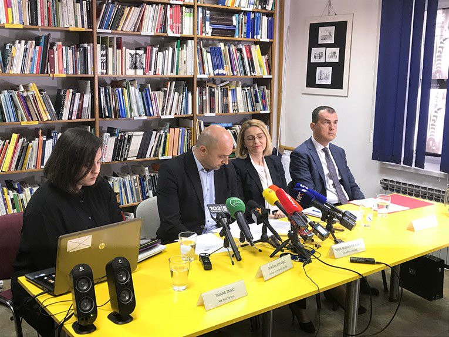

The press conference was held despite the very clear attempt to stop it by any cost\. Photo: AYS archive
### A volunteer with disabilities humiliated and yelled at for monitoring access to asylum system

On several occasions in August this year, asylum seekers approached our volunteers in front of Porin reception center in Zagreb, where we organize integration activities and educational programs for children\. They said they had recently arrived to Croatia from Bosnia and wanted to ask for asylum, but they were afraid of the police\. All of our volunteers followed our protocol and told them they should ask for asylum in the nearest police station\. On three occasions, our volunteer \(who is a person with disabilities\) went to the police station to monitor the process\. She was humiliated, yelled at, and threatened by the police officers on duty, who told her that she could be criminally charged just for coming to the police station\. She was then forced to translate to the refugees on behalf of police and to tell them their small children would have to sleep on the cold cell floor\. Later, after she brought food to the children, she was told that her presence in the hall was interfering with police business and was forced to leave the police station\.
### Who is allowed to provide legal support?

Very soon after this, our NGO was unofficially warned that that we were to be expelled from the reception center, and our contract with the Ministry was said to be “lost”\. It was made very obvious that this threat was connected to our monitoring activities regarding the people who’ve tried to seek international protection in front of the reception center\. After we presented our copies of the valid contract with the Ministry, we were allowed to continue our integration activities in the center, but our partnering organization CPS, which provides free legal aid to refugees, was expelled from the center\. When journalists asked the Ministry to explain this decision, it once again misquoted the verdict against our volunteer, equating our work with criminal activity\.

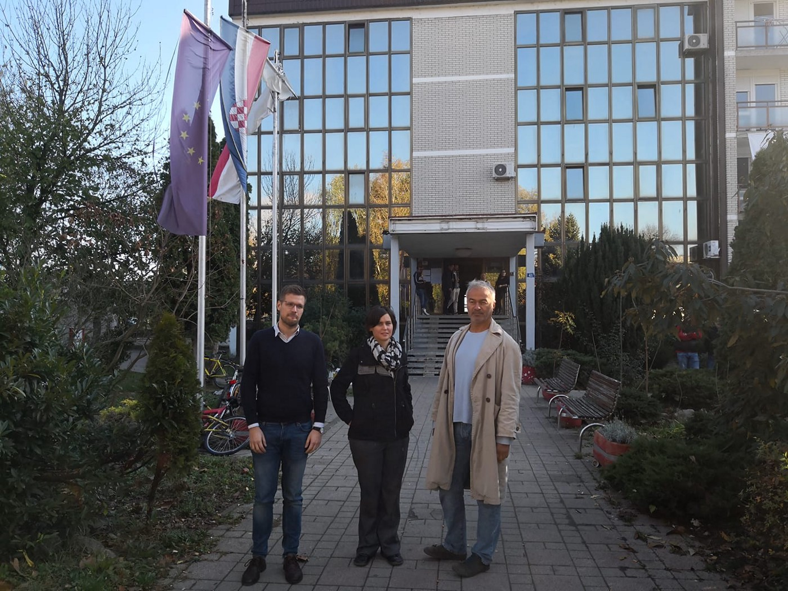

Volunteers providing legal support have been kicked out from the camp\. Photo: CPS
### When female volunteers turn to police for help, they end up being threatened with rape

We have also had negative experiences in situations when we addressed a problem to the police\. Namely, in February this year, we turned to them for protection upon receiving information that our contact details \(a link to our official Facebook page\) were being sold by smugglers to refugees in Serbia\. After there was no reply to a complaint submitted via email, our volunteers approached the police station in person, but even then our complaint was not formally received nor recorded\.

Moreover, the police officers who talked to us acted very unprofessionally, questioning our volunteers in the lobby and failing to state their names or take any personal ID from the volunteers\. After the police inspector on duty repeatedly refused to formally register our arrival, a lower\-ranked officer said that he would take our names “for his own sake”\. Meanwhile, the inspector was telling us that we shouldn’t have filed a report about the alleged smuggler via email, and that “we’re endangering ourselves and others around us”\.

In addition to that, while talking to the volunteers, the main inspector was incredibly disrespectful, both towards us and the work that we do and towards refugees in general\. During this conversation he engaged in offensive and racist remarks explicitly equating refugees with criminals\. Finally, he commented that our female volunteers were going to get raped by refugees if we continued with our work\.

**\(It must be said that several recent incidents have not been described in this report because volunteers were afraid of additional problems with the police if they reported mistreatment\. \)**

**We strive to echo correct news from the ground through collaboration and fairness\.**

**Every effort has been made to credit organizations and individuals with regard to the supply of information, video, and photo material \(in cases where the source wanted to be accredited\) \. Please notify us regarding corrections\.**

**If there’s anything you want to share or comment, contact us through Facebook or write to: areyousyrious@gmail\.com**

_Converted [Medium Post](https://medium.com/are-you-syrious/ays-special-when-governments-turn-against-volunteers-the-case-of-ays-5635bf786fa3) by [ZMediumToMarkdown](https://github.com/ZhgChgLi/ZMediumToMarkdown)._
