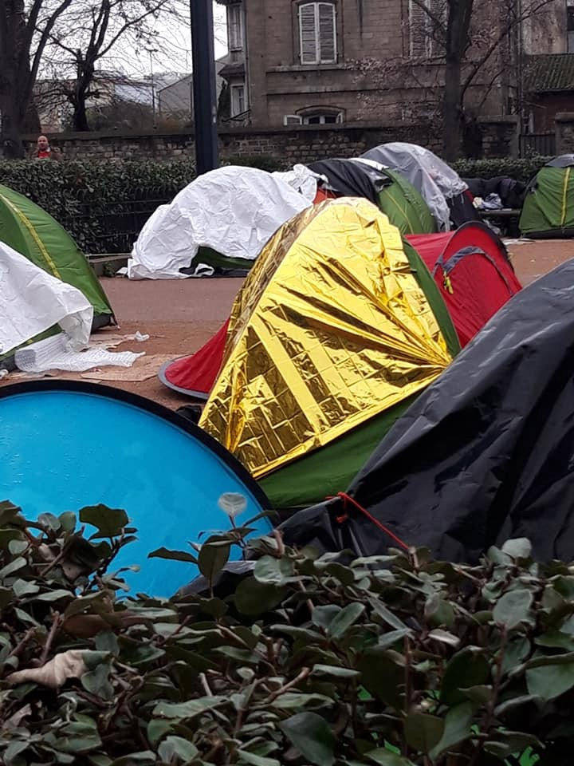
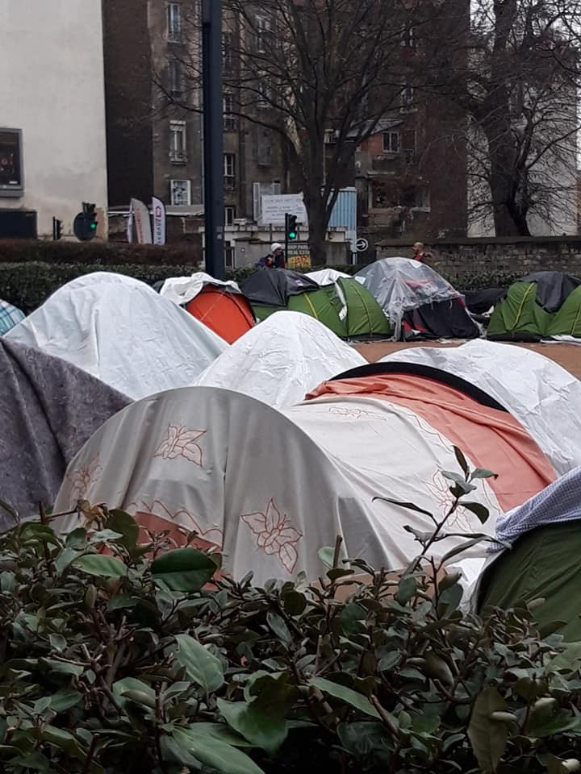

### AYS Weekend Digest 29–30/12/2018: French state “deliberately endangers” people on the move

_Heavy rain continues in Syria // TB outbreak in Triq al Sikka detention centre // 17,000 Turkish citizens sought asylum in EU in 2018 // At least 72 people lost at sea // 155 people arrive on Greek islands over weekend // ECRE complaint against Greece’s treatment of unaccompanied children // And more news…_

 \(Drawing by By Mikail Çiftçi\)](assets/becd0c54801e/1*S7OpoLfcbJrxJPxURQsg6g.jpeg)

The number increased to [4503](https://missingmigrants.iom.int/) \(Drawing by By Mikail Çiftçi\)
### FEATURE: The French state “deliberately endangers” people on the move

14 associations signed an [open letter](https://www.lejdd.fr/Societe/lettre-de-14-associations-a-emmanuel-macron-letat-met-en-danger-les-migrants-3829496) to French President Emmanuel Macron denouncing the failure of the state in the protection and sheltering of migrants\.

In the letter they reminded Macron of his public commitment not to have people sleeping on the streets:

> \[…\] Your commitment, made on July 28, 2017, was soon forgotten by your government, your majority, your services, and more seriously, by you\. 

> \[…\] A year later, thousands of people, women, men, children, families, share the interstices of cities, shelter under bridges, are stranded on the sidewalks of Paris and its immediate periphery\. In addition, there has been an infernal cycle that has been going on for three years now, with camps, inaction, dismantling, sometimes violent dispersal, but also harassment of exiled people as well as solidarity citizens and collectives that come to help them\. 

 \)](assets/becd0c54801e/1*QPP0TTxZ1nPId38JaYmjpQ.jpeg)

\( [Paris Refugee Ground Support](https://www.facebook.com/PRGS.team/photos/a.1806267829653329/2274160436197397/?type=3&theater) \)

> Today, these people on the street are always finding it more difficult to feed themselves, to heal themselves, to find reliable information to assert their basic rights\. They are less visible in the public space, they are forced to hide to escape police violence and administrative pressure\. Yet they are there\. 

 \)](assets/becd0c54801e/1*x-ywYgFba3-IQvCynp9F-Q.jpeg)

“ **The weather in Paris for the last 6 weeks fluctuates quickly between torrential rain and freezing temperatures\.** 
**Tonight it’s zero degrees\.** ” \( [Paris Refugee Ground Support](https://www.facebook.com/PRGS.team/photos/a.1806267829653329/2274160436197397/?type=3&theater) \)

Despite the efforts of the police, who every morning evict as many makeshift camps as they can, these camps grow day after day, “in basketball courts, under highway bridges and in parks\.”

](assets/becd0c54801e/1*2OwMCKyBWpWfdR40a61fqA.jpeg)

Photo by [Paris Refugee Ground Support](https://www.facebook.com/PRGS.team/photos/a.1806267829653329/2274160436197397/?type=3&theater)

From a [volunteer](https://www.facebook.com/groups/119648878605821/permalink/376147416289298/?hc_location=ufi) :

“Many spend months and months living like this\. What photos can’t show is the cold, the lack of dignity when washing in the street in full view of tourists, the danger from gangs and the huge psychological trauma many struggle with\.”

\(Photo by Sarah Fenby\-Dixon\)

The associations active in the field underline the inaction of the authorities:

> The discussions get bogged down, the answers remain the same and do not live up to the emergency\. Despite a good willingness, everyone is passing the buck to the point of locking us in an institutional table tennis game that has lasted too long\. Meanwhile, bodies and minds are damaged\. 

> To date, we can only note the failure of the State in the exercise of its responsibility of protection, shelter and unconditional acceptance\. 

> \[…\] Despite the efforts to improve reception, and current efforts to make Paris a “safe haven”, **the reality of people living on the street among rats shows us how bad this policy is** \. If precariousness is accentuated in society, it is even more acute for people who are marginalised \[…\] \. This is a reality in Paris, Ile\-de\-France, but also in Grande\-Synthe, on the north coast, elsewhere\. **We are the first witnesses, and those we help are the first victims\. Their situation confines to a deliberate endangerment\.** 

](assets/becd0c54801e/1*sNP8Eja36f3x4_YH5gTz5Q.jpeg)

Photo by [Paris Refugee Ground Support](https://www.facebook.com/PRGS.team/photos/a.1806267829653329/2274160436197397/?type=3&theater)

> To get out of this impasse, **we are ready to invent new solutions collectively tomorrow, provided that there is a real commitment and a change of political course** \. We want to build a sustainable response to an emergency\. Mr\. President, it is your responsibility, in close connection with the Regional Prefect, but also the responsibility of the Mayor of Paris, to allow rapid accommodation of people to the street, to enforce their rights and not let civil society, associations, collectives, citizens, substitute for your services\. 

### SYRIA
#### People forced to leave camps due to heavy rain

Heavy rain is continuing to cause problems in Syria, forcing more people to leave their camps\.

People affected are asking for help from international organizations, [while other groups highlight](https://www.facebook.com/BelgiumGent4Humanity/posts/2191304697854011?hc_location=ufi) the danger of waterborne diseases spreading as sewage overflows\.
### LIBYA
#### TB outbreak in Triq al Sikka detention centre

There is a [TB outbreak](https://www.aljazeera.com/news/2018/11/libyan-detention-hell-refugee-burned-alive-181110102329706.html?fbclid=IwAR3AaOxgTilZ9IN_i2DWoJwX-VxBiyZf7yEXUEjP-wwhIGfAZIDAKLSIqQg) in Triq al Sikka migrant detention centre in the Libyan capital, Tripoli, the same centre where Abdulaziz, a 28\-year\-old Somali set himself on fire three weeks ago after reportedly being told by UNHCR that he would not be evacuated out of Libya\.

[Sally Hayden reports](https://twitter.com/sallyhayd/status/1078973341157994498?fbclid=IwAR2he68j6Mmyghma3csI1rF-I8TKvsSY6KAmtkUQcUWzlnzv0EXKQsfnRhc) that the TB patients have now gone seven days without medicine\. A further 250 people have also arrived in the past few days\.

> Detainees say they’re starving, with too little water, food and even less space\. 

IRC are supposed to be providing medical care but now some of their staff have also become ill\. This is a situation so bad that international organizations cannot even work in safety \(in fact, in many areas of Libya, they cannot work at all\) \.
### TURKEY
#### 17,000 Turkish citizens sought asylum in the EU in 2018

Media sources [report](http://www.xinhuanet.com/english/2018-12/28/c_137705294.htm) that the number of Turkish citizens seeking asylum in EU countries has significantly increased in the past two years, going from almost zero applications in 2016 to more than 17,000 this year\. Turks ranked the fifth largest group among asylum applications to the EU member states in 2018\. Turkish applications were made mainly in Germany, followed by Greece, France, Sweden, Switzerland, and Belgium\. A number of Turkish military personnel based in various NATO bodies across Europe have sought asylum from their country of residence\. This surge in numbers is linked to the widespread repression of all opposition groups which followed the alleged attempted coup in 2016, and the erosion of the rights of minorities\.
### SEA

After eight days at sea, Sea\-Watch 3 is still waiting for a port to disembark the 32 people on board\. They are still searching for a reported boat in distress carrying 72 people\.

■■■■■■■■■■■■■■ 
> **[MSF Sea](https://twitter.com/MSF_Sea) @ Twitter Says:** 

> > After searching for 2 days @[seawatchcrew](https://twitter.com/seawatchcrew) have found no trace of a reported boat in distress with 72 people. With limited search &amp; rescue vessels left in the #Mediterranean &amp; no clear coordination from the maritime authorities, we may never know what happened to these 72 people. 

> **Tweeted at [2018-12-29 19:44:37](https://twitter.com/msf_sea/status/1079100899497312257).** 

■■■■■■■■■■■■■■ 

The Sea\-Eye vessel rescued a wooden boat with 17 people\. Now they too are waiting for the authorization to disembark\.

■■■■■■■■■■■■■■ 
> **[MSF Sea](https://twitter.com/MSF_Sea) @ Twitter Says:** 

> > The crew from @[seaeyeorg](https://twitter.com/seaeyeorg) have rescued 17 people from a small wooden boat in international waters. They now await a port of safety after refusing to handover the rescued people to the Libyan coastguard who would have taken them to #Libya. #Libya is not a safe place. 

> **Tweeted at [2018-12-30 12:07:50](https://twitter.com/msf_sea/status/1079348330688376834).** 

■■■■■■■■■■■■■■ 

24 people were saved last night by the Maltese army\.

3 more SOS calls were [reported](https://www.facebook.com/photo.php?fbid=10216224178189652&set=a.3005241742575&type=3&hc_location=ufi) in the central Mediterranean, but coordinates can’t be found\.
### GREECE
#### Arrival

Aegean Boat Report writes that over the weekend at least five boats arrived on the Greek islands, carrying 66 people\.

The [first boat](https://www.facebook.com/AegeanBoatReport/posts/499279397261836) landed on the south eastern coast of Symi island at 03:00 on Saturday\. The coast guard was informed, and after several hours on the rocky shore, 20 people were picked up by HCG and transported to Rhodes \(seven children, seven women, and six men; numbers not confirmed\) \.

The second boat landed in Kalo Limani, on the north west of Lesvos at 08:00 on Saturday with 46 people on board: 19 children, 12 women, and 15 men\.

A [third boat](https://www.facebook.com/AegeanBoatReport/posts/499796943876748?hc_location=ufi) was picked up outside the airport, Lesvos south, at 23:15 on Saturday by Frontex \(27 people, no breakdown available\) \.

The fourth boat arrived on Farmakonisi overnight between Saturday and Sunday and was transported to Leros \(43 people, no breakdown available\) \.

The [fifth boat](https://www.facebook.com/AegeanBoatReport/posts/500089133847529?hc_location=ufi) landed in the port of Agias Ermionis, Chios east, at 21:00 on Sunday\. It carried 19 people \(six children, three women, 10 men\) \.

ABR also report that five people arrived on Farmakonisi on Saturday and were transported to Leros, and that there has been unconfirmed reports about a boat landing on Cyprus on Sunday morning, carrying 37 people\.

> It might seem quiet regarding arrivals on the Greek Islands, and yes, not many have arrived this weekend\. But it doesn’t mean that it’s quiet\. A lot of activity, many boats have tried to reach Europe this weekend, but been arrested by Turkish Coastguard\. One of the boats this morning had 84 people, amongst them 43 children\. Started out from Dikili, heading towards Lesvos south\.
 

> As a reminder, that it’s not only numbers, but real people, here’s some pictures from the arrests this weekend\. _\( [Aegean Boat Report](https://www.facebook.com/AegeanBoatReport/posts/500059400517169?hc_location=ufi) \)_ 

#### On island overcrowding and transfers to the mainland

As Seebrucke Frankfurt [reports](https://twitter.com/SeebrueckeFfm/status/1078943902894354432?fbclid=IwAR2kL3pOobpDy-8ESIr_FP5giwGDD8nh9glckf3PE_yxeDpa1IqwztQejQo) , since September, 11,000 refugees have been transferred to camps on the mainland\. As a result, less than 5,000 people are now in Moria\. It is the first time since April 2018, but this is still more than double the capacity of the camp\. In recent weeks, temperatures have dropped to the single digits, especially at night, with frequent rains, further worsening living conditions, especially for those 2,000 people who have to endure in summer tents in the olive grove in Moria camp\.
#### New complaint against Greece filed at the European Commission of Social Rights

The International Commission of Jurists \(ICJ\) and the European Forum for Refugees and Exiles \(ECRE\) [filed a complaint on November 30th 2018 against the Greek state at the European Commission of Social Rights](https://www.coe.int/en/web/turin-european-social-charter/-/new-complaint-registered-concerning-gree-2?fbclid=IwAR1ITZLQzZKS0r-xiVnld4vpxlFhJiN9BNf0wR0mW1GkBxYj3Rc_S1N5q8Y) \. ICJ and ECRE allege that Greece fails to ensure the protection of unaccompanied migrant children in Greece and accompanied migrant children on the north eastern Aegean islands\.

The two organizations maintain that the situation in Greece is in breach of several provisions of the Revised European Social Charter “due to the oversaturation of reception facilities which are meant to assure basic care and protection of children, the deleterious conditions that children are subject to for lengthy periods of time as a result of the serious shortcomings in reception and care and the danger that such conditions pose for children’s mental and physical health, as well as the lack of access to education for migrant children on the North Eastern Aegean islands\.”

Read the full complaint [here](https://www.coe.int/en/web/turin-european-social-charter/-/new-complaint-registered-concerning-gree-2?fbclid=IwAR1ITZLQzZKS0r-xiVnld4vpxlFhJiN9BNf0wR0mW1GkBxYj3Rc_S1N5q8Y) \.
#### Katsikas camp reopened one year ago

#### Mini lexicon for basic communication available as apps or booklets

The Embassy of Switzerland in Greece in collaboration with UNHCR Greece, EADAP, and METAdrasi have developed a series of mini lexicons for basic communication for people on the move in Greece\. They are available for many languages \(Arabic, Farsi, Urdu, Kurmanji, Sorani, French\), with translations in both English and Greek\.

They are downloadable as booklets \( \.PDF\) or apps for IOS and Android [here](https://www.eda.admin.ch/greece-lexica?fbclid=IwAR116tv-qcmdTaxKIF89lxjkdIUKwBF8I6rM2K3QqFnCUGWcbtNJvWYgCEw) \.
#### Interpretation services in hospitals in Athens: Schedule for next week

#### Hotline for homeless people in Athens

A hotline is active in Athens for homeless people in need of help: the number is **1595** \.
#### Northern Lights Aid is urgently looking for a teaching coordinator

> It is a voluntary position, full of challenges and responsibilities, teaching dedicated adult students, within our small but joyful team\. We are looking for a volunteer TEFL/CELTA qualified, staying for minimum three months, starting as soon as possible\. You can find all the details [HERE](https://docs.google.com/document/d/1EPX8SqCaOrgEwFt28FikbQZfIYDEXMmhIcdvXu_ggPM/edit?usp=sharing) \. 

If you are interested please contact: alexandra@northernlightsaid\.org
### BALKANS
#### Border violence continues despite statements to the contrary

![The collective expulsion and violent return of asylum seekers to the to non\-EU borders surrounding Croatia is a routine occurrence\. Over the past two years, men, women, and even children have returned to Bosnia\-Herzegovina and Serbia from Croatia with split lips, black eyes, and broken bones\. \[…\] As winter continues in northwestern Bosnia and reports of deaths from exposure and coldness trickle back to us, we are reminded of the precarious position that these individuals are already in\. Violence along the borders and collective expulsions only serve to push these individuals towards even more dangerous and risky transit routes\. \(by [No Name Kitchen](https://www.facebook.com/NoNameKitchenBelgrade/photos/a.312076942523930/646407325757555/?type=3&theater) \)](assets/becd0c54801e/1*lGUbn1pK6ITYlKjsIXEcqQ.jpeg)

The collective expulsion and violent return of asylum seekers to the to non\-EU borders surrounding Croatia is a routine occurrence\. Over the past two years, men, women, and even children have returned to Bosnia\-Herzegovina and Serbia from Croatia with split lips, black eyes, and broken bones\. \[…\] As winter continues in northwestern Bosnia and reports of deaths from exposure and coldness trickle back to us, we are reminded of the precarious position that these individuals are already in\. Violence along the borders and collective expulsions only serve to push these individuals towards even more dangerous and risky transit routes\. \(by [No Name Kitchen](https://www.facebook.com/NoNameKitchenBelgrade/photos/a.312076942523930/646407325757555/?type=3&theater) \)
#### Balkan Weather Forecast for Monday 31/12

**Montenegro**

In the south, it will be changeably cloudy with sunny intervals, windy and mostly dry\. In the north, it will be predominately cloudy with snow from time to time\. The wind blowing from the north will be moderate to strong sometimes, with very strong and stormy gusts\. During the nights it will be dry and windy in the south and in the north windy and cold with a chance of snow\. The lowest temperatures will range from \-5 to 7 and the highest daily will vary from \-3 to 14 degrees\.

**Serbia**

Cloudy with rain and short durations of sleet\. In the west, southwest, south, and southeast snow is expected with formation and increase of the snow cover\. The wind will be moderate, strong in the mountains, blowing from the north and northwest\. The lowest temperatures will range from \-1 to 2 and the highest daily from 2 to 5 degrees\.

**BiH**

Cloudy in Bosnia mostly with snow and sleet\. In the north of Bosnia, expect first weak rain, which will gradually transition into sleet\. Most of the precipitation will be before noon, in the afternoon it will decrease or stop in some places\. The newly formed snow cover will be from 10 to 15 cm\. In Herzegovina, it will be lightly to moderately cloudy\. While the wind will be mostly moderate, blowing from the north and northwest, in Herzegovina and south\-western Bosnia strong gusts are expected\. The lowest temperatures will vary from \-3 to 5 and the highest daily from 2 to 10 degrees\.

**Croatia**

In the interior, it will be moderately cloudy to very cloudy and in the morning there is a chance of light precipitation on the border of rain and snow\. Alongside the coast, it should be partly sunny\. It will be windy; a moderate to strong northern and northeastern wind, along the coast a strong and locally stormy Bura\. The night will be cold, windy, and mostly dry\. The lowest temperatures will range from \-3 to 8 and the highest daily from 3 to 12 degrees\.
### MONTENEGRO
#### Threefold increase in asylum applications in 2018

As reported in local media, in 2018 a total of 3,075 refugees and migrants applied for asylum in Montenegro, a more\-than\-threefold increase compared to last year’s 848 requests \(Ministry of Internal Affairs figures\) \. 12 people got asylum this year\. During the year, the EU dedicated 90,000 Euro for Montenegro to assist with refugees and migrants, while the UNHCR and Red Cross Montenegro opened and began running a center in Spuz\.
### BOSNIA AND HERZEGOVINA
#### More photos from Miral Camp

In the last digests, AYS reported about the [conditions of refugee accommodations](ays-daily-digest-28-12-18-eu-turns-its-back-on-32-stranded-at-sea-5a008763d67f) in the country and especially about Miral Camp, the “ [most frightening place](https://medium.com/are-you-syrious/ays-daily-digest-26-12-2018-humiliating-living-conditions-in-iom-run-centre-in-bosnia-fffc3791cab2) ” in which refugees have to live\. We can’t help but stress that most of the centres and camps in the country are run by IOM\.

#### Cases of trench foot widespread in Velika Kladusa, and information on how to treat it

Zdravniki4azilante published a brief in\-field training for paramedics in humanitarian situations, based on the situation in Velika Kladusa\. Read more [here](https://zdravniki4azilante.blogspot.com/2018/12/in-field-training-and-education-for.html) \.
### SERBIA AND HUNGARY

Info Park report that there are around 150 people every day in the Savamala neighbourhood, in central Belgrade\.

Hungarian authorities prevented a total of 60 attempts to enter the country irregularly over the three days between December 24 and 26\. All of them were intercepted within Hungarian territory\.
### AUSTRIA

From the start of 2019, ID will be required to buy a prepaid phone in Austria\. For more information look [here](https://www.facebook.com/RefugeeCampVienna/photos/a.643040915748505/2161394263913155/?type=3&theater) \.
### FRANCE
#### More police abuses against refugees in Paris

From the group [Réfugiés de La Chapelle en Lutte](https://www.facebook.com/groups/458298734347690/?ref=group_header) :

> Over the past few days, some undocumented and refugees on the street have been occupying an apartment in a building left empty by Paris\-Habitat for over a year\.
 

> Yesterday, a security guard noticed their presence and warned Paris\-Habitat, who sent the cops\.
 

> They smashed the door and controlled the identities of all the people present, after they searched them under the threat of the taser\.
 

> While waiting to receive their orders, they held the people in a room by launching racist insults and preventing them from taking a piss\.
 

> Outside, some people gathered in support and blocked the traffic by chanting “Paris Habitat expulseurs”, “Housing not police”… until they were moved away by the CRS\.
 

> The cops finally left people in the apartment but preventing any entry into the building, people but also food, blankets… 

#### Volunteer opportunity with Gent4Humanity

G4H is looking for [new volunteers](https://www.facebook.com/BelgiumGent4Humanity/posts/2191322597852221?hc_location=ufi) to get involved in their monthly visits in Dunkirk and more in 2019\.

> If you want to make 2019 your year to do something to help displaced refugee men, women, and children in northern France then please send us an email in English only, to gent4humanity15@gmail\.com and we will send you all our information and an application form\. 
 

> We expect you to be able to legally cross the border, hold a current ID, live close to Gent or surrounding areas, and speak good English for our international team\. 

### DENMARK
#### Supreme Court rules against the government wish to make endured stay “intolerable”

The opinion of the government is that rejected foreigners deemed to be “criminals” have to live an “intolerable life” in the deportation centres in the country for an indefinite period of time\. This is defined as “endured stay,” and would apply to all people who received an expulsion order, whether they committed a crime or had their asylum claim rejected but can’t be deported to their home country\. Conditions in these centres have been heavily criticised, amounting to an “intolerable” life: in such centres people have no access to cooking appliances, no pocket money, and no activities\.

The Supreme Court recently [ruled](https://l.facebook.com/l.php?u=https%3A%2F%2Fwww.berlingske.dk%2Fpolitik%2Fhoejesteret-traekker-taeppet-vaek-under-regeringens-oenske-om-at-goere%3Ffbclid%3DIwAR3aiX8NY_7i1ZynDNAQkOSbnYl2rHfoUF-o9jLYMtp7h-S-oBM8eUbnAso&h=AT3ieGey8usZ1awTPRTGOXTu6iw3JgrvEjTC3mAQx_c7mISDNNS4or2uxzHG5igoDLXFBKLVkYz95bXNeQhk4U0u9vTkRkB044HBCF8juNpA-9RyV3Ei6qsGrTQ) that after four years — or even less in some cases — persons on endured stay can legally move back home to their families\.
### UK

6 Iranians arrived over the weekend, landing on a beach in Kent\. The Government continues to act as if this slight increase in sea arrivals is a terrible crisis, but let’s be honest, the numbers are totally manageable and measures to allow for asylum claims to be made while people are still in France would be very easy to implement, if only anybody wanted to do it\. At least it means they not talking about Brexit for five minutes\.

**We also publish weekly summaries of some of the most important news reported during the past week in our Daily News Digest: here is the [Arabic](%D9%85%D8%A7-%D8%B2%D8%A7%D9%84-%D8%A7%D9%84%D8%A8%D8%AD%D8%B1-%D8%A7%D9%84%D8%A3%D8%A8%D9%8A%D8%B6-%D8%A7%D9%84%D9%85%D8%AA%D9%88%D8%B3%D8%B7-%D9%87%D9%88-%D8%A7%D9%84%D8%B7%D8%B1%D9%8A%D9%82-%D8%A7%D9%84%D8%A3%D9%83%D8%AB%D8%B1-%D9%81%D8%AA%D9%83%D9%8B%D8%A7-f77530944236) for the Week of December 24–30 and the [Persian](%D8%AF%D8%B1%DB%8C%D8%A7%DB%8C-%D9%85%D8%AF%DB%8C%D8%AA%D8%B1%D8%A7%D9%86%D9%87-%D9%85%D8%B1%DA%AF%D8%A8%D8%A7%D8%B1-%D8%AA%D8%B1%DB%8C%D9%86-%D9%85%D8%B3%DB%8C%D8%B1-%D8%A7%D8%B3%D8%AA-891216f90337) for the week of December 17–23\.**

**We strive to echo correct news from the ground through collaboration and fairness\.**

**Every effort has been made to credit organizations and individuals with regard to the supply of information, video, and photo material \(in cases where the source wanted to be accredited\) \. Please notify us regarding corrections\.**

**If there’s anything you want to share or comment, contact us through Facebook or write to: areyousyrious@gmail\.com**

_Converted [Medium Post](https://medium.com/are-you-syrious/ays-weekend-digest-29-30-12-2018-french-state-deliberately-endangers-people-on-the-move-becd0c54801e) by [ZMediumToMarkdown](https://github.com/ZhgChgLi/ZMediumToMarkdown)._
