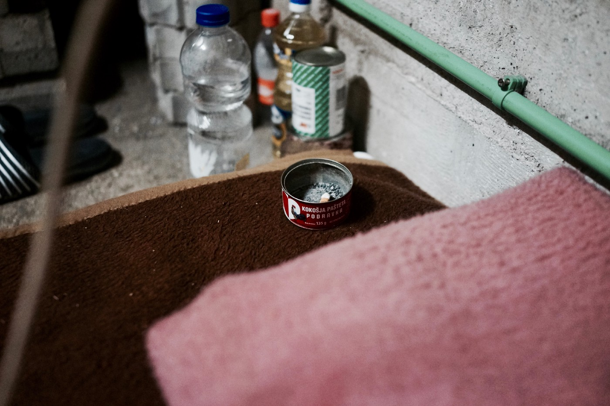
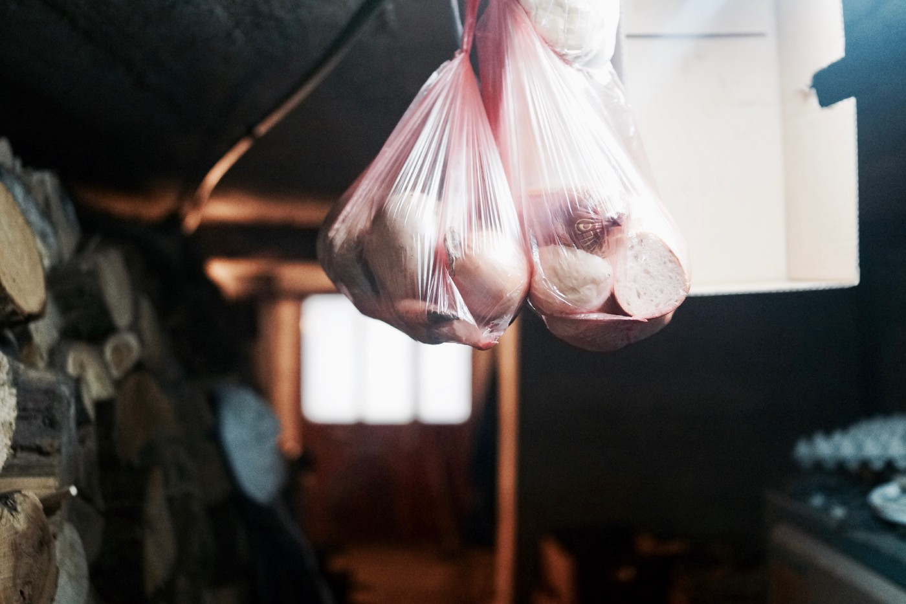
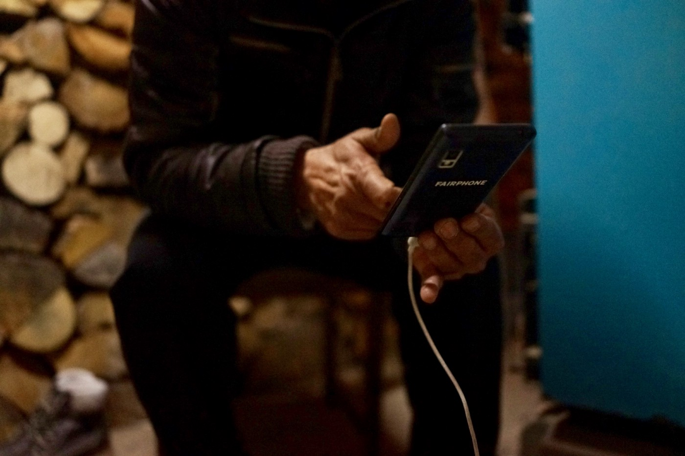
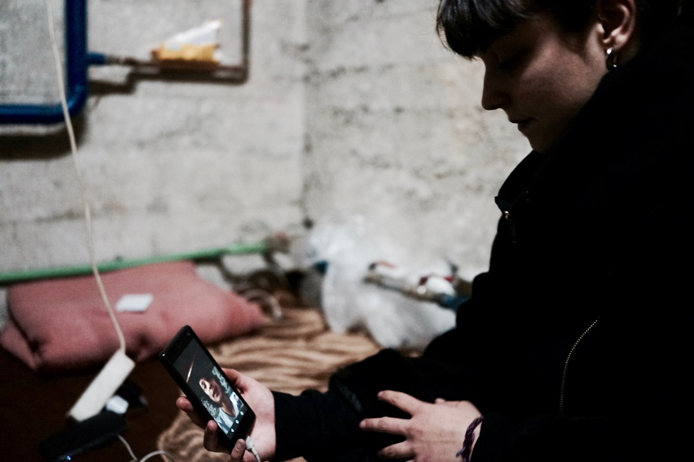

### AYS SPECIAL: Afghanistan is Not Safe — But Neither Is Europe for Afghan Refugees

_For over forty years Afghanistan has been overwhelmed by wars\. Wars, that if not created, were at the very least funded and supported by western democratic countries\. And much in the same way that western democratic countries played a role in dictating Abdul’s past, so too now, they will dictate his future\. As well as the future of his family, and of so many families like his, searching for protection in Europe\._

](assets/fd836afc260f/1*OMplvOsK5BK3L_ZjO4bu-A.jpeg)

All photos by Nevia Elezovic from [No Borders Photography](https://www.facebook.com/NoBordersPh/)

_‘Do you hope to one day return to Afghanistan?’_ I ask him _‘Do you think it will ever be safe enough for you to go back?’_

_‘I should tell you first, that it is difficult for me to answer this question\. It is impossible for me to say\. It is around forty years now that Afghanistan is in this situation\. For forty years Afghanistan has been ruled by various extremists\. You already know that Afghanistan is very unsafe at this time because of the Taliban — their goals and their way of thinking\. You know that when they want to do intihari \(suicide bombings\) they can do it easily\. They can do anything and everything that they want to do in Afghanistan\. They do intihari in front of embassies\. They do it in military places, they just go inside and bomb the military station\. They bomb diplomat buildings\. They also bomb the public and civilians\. There is no need that I explain it to you, there is no need that I give you a headache with my talk\. Afghanistan is not safe\.’_

Ispent a few afternoons talking to Abdul\. We met where he slept, together with a large supply of firewood, in the basement of a house of an older, retired Bosnian man, close to the border with Croatia\. The room was dark, small and damp, but warm\. Which is worth mentioning, as warmth has become somewhat of a luxury in the Europe of today\. A small mattress on the ground, a plastic bag with some bread in it, a phone charger and an ashtray, consist the only signs of life, in the otherwise lifeless concrete chamber\.

Abdul is a 57 years old and is from Kabul, Afghanistan\. He is a husband, a father and a former teacher for the Afghan Military\. The longer I spent talking to Abdul, the more acutely I became aware of how deeply his life has been dictated by the numerous wars that have ravaged his country over the last four decades\.

Wars, that if not created, where at the very least funded and supported by western democratic countries\. And much in the same way that western democratic countries played a role in dictating Abdul’s past, so too now, will they dictate his future\. As well as the future of his family, and of so many families like his, searching for protection in Europe\.

On one of the afternoons I spent talking with Abdul, I had the pleasure of meeting his family\. As we sat on his makeshift bed, he dialed a phone number using the free Wi\-Fi from the café next door\. The network intentionally left open by the cafe’s owners, as a sign of compassion for the new, temporary inhabitants of their small town\.

_‘Now you will meet my family,’_ said Abdul as the video call began to connect\. His wife answered\. They spoke a few words and then she passed the phone over to her son, Hammed\. Abdul placed his hand on his forehead in a military solute gesture\. His son smiled when he saw his dad on his phone and slowly returned the salute\. Abdul turned to me ‘ _No speak,’_ he said\.

From our earlier conversations I knew Hammed had lost his hearing from the injuries he received, as he and his father ran to escape from the terrorist that attacked them late in 2015\. I didn’t know that since that day Hammed had also stopped talking\. Abdul held his hand to his head as he spoke to his son\. _‘I teach them to be strong like I taught my students in the military_ ,’ he says ‘ _They must be strong\.’_ 
 
From Hammed the phone was passed over to his oldest son Mohammed who immediately put his hand on his forehead as he greeted his father\. He then turned the phone’s camera around, and on the screen appeared two younger boys, they were asleep on the bed\. Mohammed woke up his brothers\. As soon as they heard that it was their dad was on the phone, they eagerly jumped out of the bed and both saluted their father with bright, beaming smiles on their faces\. I looked at Abdul, his eyes were crinkled, infused with immense love\. He held his hand firmly on his forehead\.

His daughter took the phone and greeted her dad, she too with a solute\. ‘ _This is my girl, my daughter’_ he said proudly\. And then, his youngest son, three year old Ali took hold of the phone\. ‘Good morning baba,’ he said smiling the brightest of all\. Abdul’s smile also widened, but so too did the sadness that filled his eyes\. 
 
Abdul’s wife joined her youngest son on the phone\. She was a beautiful woman, but you could tell on her face that she was tired\. She didn’t solute her husband, but instead just gazed at him through the camera lens\. Abdul finally took his hand down from his forehead\. Not once in all the time that he spoke to his children did it waver\. He and his wife spoke a few words, and then he hung up the phone\.

He threw it onto the other side of the mattress\. The warmth of the last few moments was gone, and very suddenly we were back in Velika Kladuša, mid winter, very far from the most important people in this man’s life\.He began to breathe slowly and deeply\. ‘ _My family,_ ’ he said\. ‘ _Problem, problem problem\. Taliban problem, Afghanistan problem, religion problem\._ ’ He began to breath even deeper\. And then came the blows\. Once\. Twice\. Three times to his head, before he regathered himself\.

The same hand, so brave and stable, that he used to bring comfort to his children, crashed down upon his forehead, inflicting pain upon himself\. He lit a cigarette and then pointed his index finger to the side of his head\. ‘strength’ he said\. 
 
And indeed he needed to be strong\. In two days he told me, there would be sun again in Velika Kladuša, the snow would be gone, and he would go on ‘ [game](ays-special-from-bosnia-the-game-5a56eb2e9a6e) ’\. An infamous term along the Balkan Route, which indicates crossing borders irregularly through dangerous jungle terrain, and dodging the onslaught of highly equipped and often violent police officers\.

Although his current situation is different, this is Abdul’s second time seeking asylum\. The first time was after the Soviets withdrew from Afghanistan\. At the time of the Soviet invasion of Afghanistan, Abdul worked for the military of the Afghani regime\. He spent eighteen months completing military training in Russia, where he learnt how to use a number of soviet weapons, including a tank known as T69\.

After a bloody war, the Soviet Union withdrew from Afghanistan and a political shift occurred that saw the Mujahideen rise in power\. Because of Abdul’s work for the previous regime, and his connection to Russia and communism, he fled to Iran where he spent 11 years living in Bumhen, Tehran\. Finally in 2001, he returned to Afghanistan where he met his wife and they got married\.

From 2001–2008 he worked as a free man buying and reselling clothes\. _‘this was the most carefree period of my_ life’ he tells me\. However, as the size of Abdul’s family grew, so did his economic troubles\. With his current job it became impossible to support his families growing needs in a time of political and economic mayhem\.

In 2008 the Regime in Afghanistan, backed now by America, decided to re\-hire people with previous experience working for the government\. Abdul registered, sat a test and was accepted as a teacher for the Afghan Military\. He worked this job from August 2008 until the beginning of 2015\. He showed me three different certificates, including one provided to him by the American army thanking him for his contributions\. I asked him why he had chosen to do this, and he explained, that like many other men in Afghanistan — work for the Afghani regime was alluring despite the risk, due to the stable income it provided in time of economic distress\.

Abdul’s economic problems were for the moment gone, but the trade off was big, it compromised his safety\. ‘ _Back in the year 2013 is when my big problems began\._ ’ He tells me\. In 2013, the Taliban approached Abdul, and offered him a proposal to join them\. With access to Soviet tanks T69, that were left behind after the war, they wanted Abdul’s expertise in how to use them\.

‘ _At first,’ he tells me, I didn’t take the proposal seriously and just ignored it\.’_ In 2014, they found him again, and once again asked him to teach them how to use the tanks\. At this point Abdul realized that he had a problem, but once again ignored their offer\. In 2015, he stopped his work for the regime and went into hiding with his family in Mazar\-i\-Sharīf\. He had become a wanted target of the Taliban\.

One evening, while on their way to the shop with his son Hammed, who was in second grade of elementary school, a car stopped next to them\. A man emerged from it armed with a rifle and began to beat him with its handle\.

While engaged in a confrontation with their attacker, Abdul urged his son to run away\. He too managed to escape the attack, miraculously with only broken teeth and a cut lip\. While running back to his home, his son fell into a ditch full of water and permanently lost his hearing\.

This day was the last time Abdul saw his family, who remain in hiding in a small apartment that only he knows the location of\. They only leave the house to buy food and top up their mobile phones\. None of his five children are able to go to school\.

I ask Abdul whether it would have been safer for him to accept the Taliban’s Offer\. He is unable to even entertain the thought, ‘ _My opinion is against the Taliban and other extremist groups\. This is why I refused to join them\. I am against their thinking and ideologies\. My soul would never let be on their side knowing what they are doing,_ ’ he tells me\.

It is thirteen months since Abdul left Afghanistan\. His journey from Afghanistan, to Europe parallels that of many others, in similar situations to himself\.

From Afghanistan he made the overland journey to Iran, where he worked for some months in Tehran to save some money\. From Iran he went to Turkey and spent another few months working odd jobs there\. From Turkey he went to Greece, where he spent fifty\-two days, and from Greece to Macedonia, then to Serbia and finally to Bosnia, where I met him\. For five months now he has been living in a town close to the border of Bosnia and Croatia\. Each evening, speaking to his family through the lens of a telephone camera\.

Like all Afghani Refugees, Abdul faces many difficulties in Europe\. This begins first with making it to a safe country, continues with receiving protection and often ends with chain deportations back to the very place they fled\.

From a time when borders were still open in Europe, people from Afghanistan have endured discrimination from European authorities, who treated them as ‘second class asylum seekers\.’ While people from Syria were able to ride on trains from Greece, through Macedonia and into Europe, if you were from Afghanistan you were only permitted to travel across Macedonia by foot \. A dangerous distinction to be making between two populations that have both suffered inconceivable devastation\.

In 2015, with borders closed and Greece inundated with Syrian nationals that were given priority, in an already very flawed and inefficient asylum process that unjustly treated them as well , Afghan asylum seekers were essentially sidelined — left to be dealt with at a later date\.

The shortcomings in the Asylum Process in Greece, coerced Afghan nationals to rely on smugglers and illegal means of traveling to other European countries, where they believed they had a greater likelihood of being granted asylum\. However, as time has gone on, the journey to reach Europe has become even more dangerous\. Closed borders, their subsequent militarization, increased police violence as well as an anti\-migration rhetoric that has swept through Europe, has left thousands stranded in perilous conditions along the Balkan route, often for years\.

Today, thousands of Afghan refugees are stuck in transit countries, predominantly Greece, Serbia and Bosnia, that are unable and often unwilling to provide them any form of real protection\. In Greece, asylum interviews are scheduled for dates such as 2023, leaving people in limbo for up to 5 years\. In Bosnia — it is almost impossible to claim Asylum\. [In Serbia in 2017](https://www.asylumineurope.org/reports/country/serbia/statistics) , out of 236 asylum applicants — only 3 people were granted refugee status\.

This has resulted in people living for years in a parallel reality, outside any official system\. In this reality, many children are unable to go to school, many adults are unable to work, and access to the most basic elements that constitute a life, such as; food, shelter, medical care and hygiene facilities are also often denied\.

Upon reaching Europe, the difficulties do not end\. In 2016 out of 102,920 Afghan nationals that applied for asylum in member states of the EU, 48,605 were rejected\. In 2017, out of 176,455 Afghani refugees that applied for asylum, 94,955 were rejected\. For one out of every two asylum seekers from Afghanistan, their whole plight will have been for nothing\.

Furthermore, In 2016; only 20,100 people out of those who were not rejected, were given refugee status in Europe and in 2017; 30,320\. The rest who were not rejected were provided subsidiary protection\. A second class status that offers very little in terms of security, and prohibits people from beginning a new life, or from applying for family reunification\.

Abdul is right, making it to Europe requires a great deal of strength\. But as I watched him regain his conviction as we sat in that tiny concrete room, I couldn’t help but think that he needed much more than strength\. He needed luck\. A lot of it\.

For Abdul, his only realistic chance at bringing his family to Europe is if he is granted refugee status, and even then, the procedure across all EU member states is riddled with bureaucracy, and it will be years before their is any real possibility that his family will join him\. A much more likely scenario is that he will he will be refused asylum, and sooner than his family arrives to meet him in Europe, he will be on a charter flight back to Afghanistan to meet them\. What will be after that, I don’t have the capacity to think about\.

As he shows me photos of his children, Abdul tells me of a different Afghanistan, one he still remembers A place free of Western and Soviet intervention, where there was peace and children went to school\. Numerous times during our conversations, he highlights to me how much he wishes his children had the chance to go to school\.

I ask Abdul a typical question that I ask most people I speak to — ‘ _If you had one hope for the future, what would it be?’_ He doesn’t need any longer than a second to deliberate his answer\.

_‘My dream is that Afghanistan becomes a safe country\. For the kids of Afghanistan,’_ he tell’s me\. _‘So that they have the chance to live like other children in the world\. They should be able to have a real education like in other countries where children can study easily\. My dream is that all kids in Afghanistan can go to school and become a positive influence in their community\. Not the way it is now, in this unsafe situation, where instead of going to school and getting an education, children are learning how to survive during war, or are learning how to put bombs on their bodies and kill one hundred people in a public area, for the goals of terrorists\._

_When there is no education, no safety, and nobody to teach our kids, it is normal that this happens\. This is my dream, that I can live to see that Afghanistan is safe, and the children of Afghanistan are living under a peace flag\.’_

**We strive to echo correct news from the ground through collaboration and fairness\.**

**Every effort has been made to credit organizations and individuals with regard to the supply of information, video, and photo material \(in cases where the source wanted to be accredited\) \. Please notify us regarding corrections\.**

**If there’s anything you want to share or comment, contact us through Facebook or write to: [areyousyrious@gmail\.com](mailto:areyousyrious@gmail.com)**

_Converted [Medium Post](https://medium.com/are-you-syrious/ays-special-afghanistan-is-not-safe-but-neither-is-europe-for-afghan-refugees-fd836afc260f) by [ZMediumToMarkdown](https://github.com/ZhgChgLi/ZMediumToMarkdown)._
